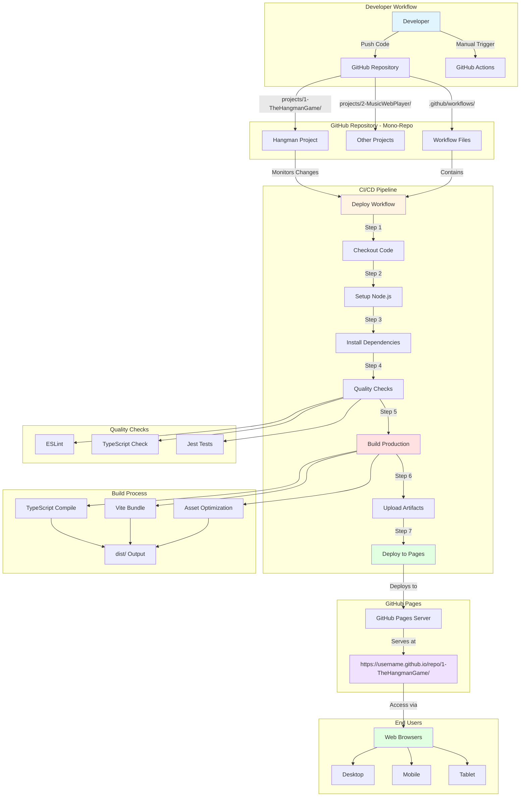
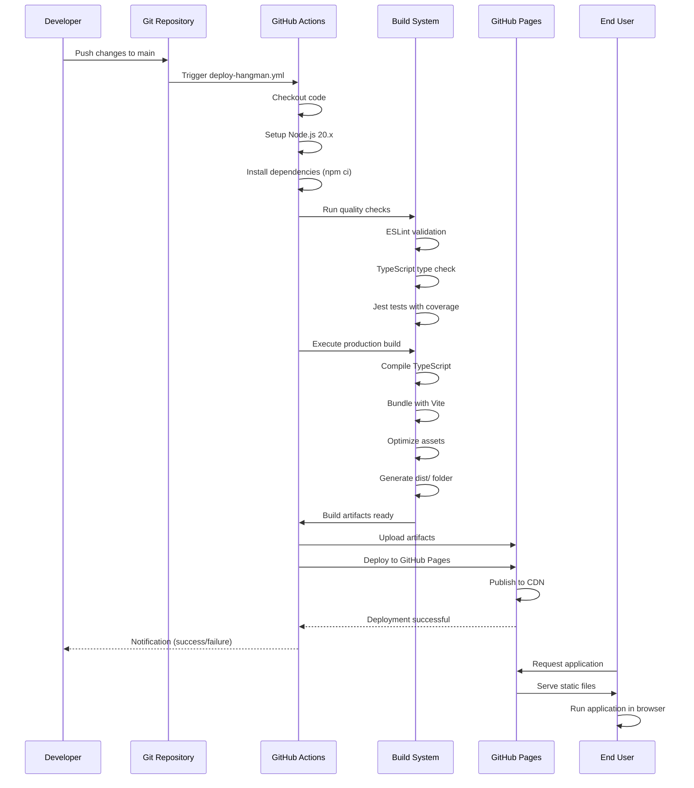
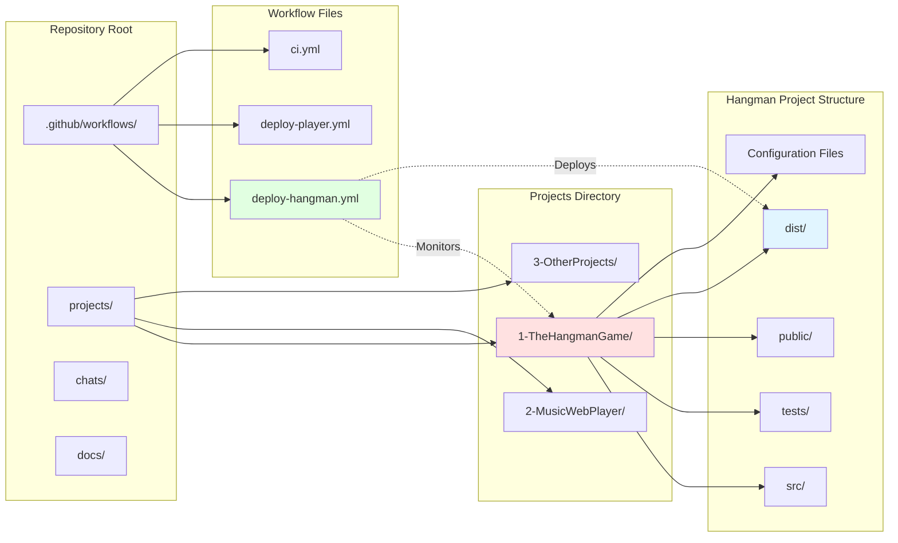
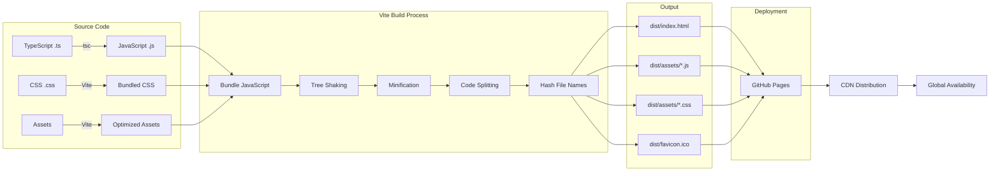
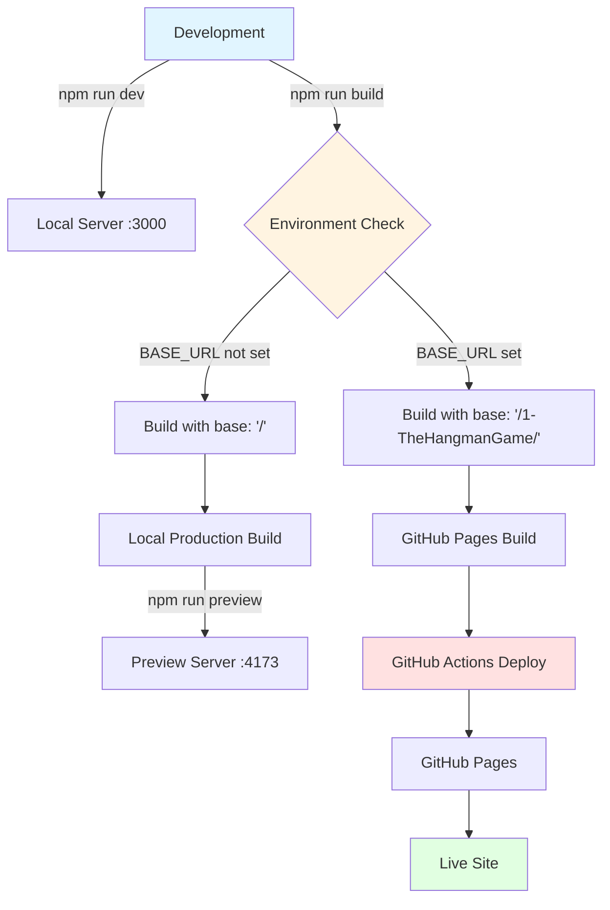
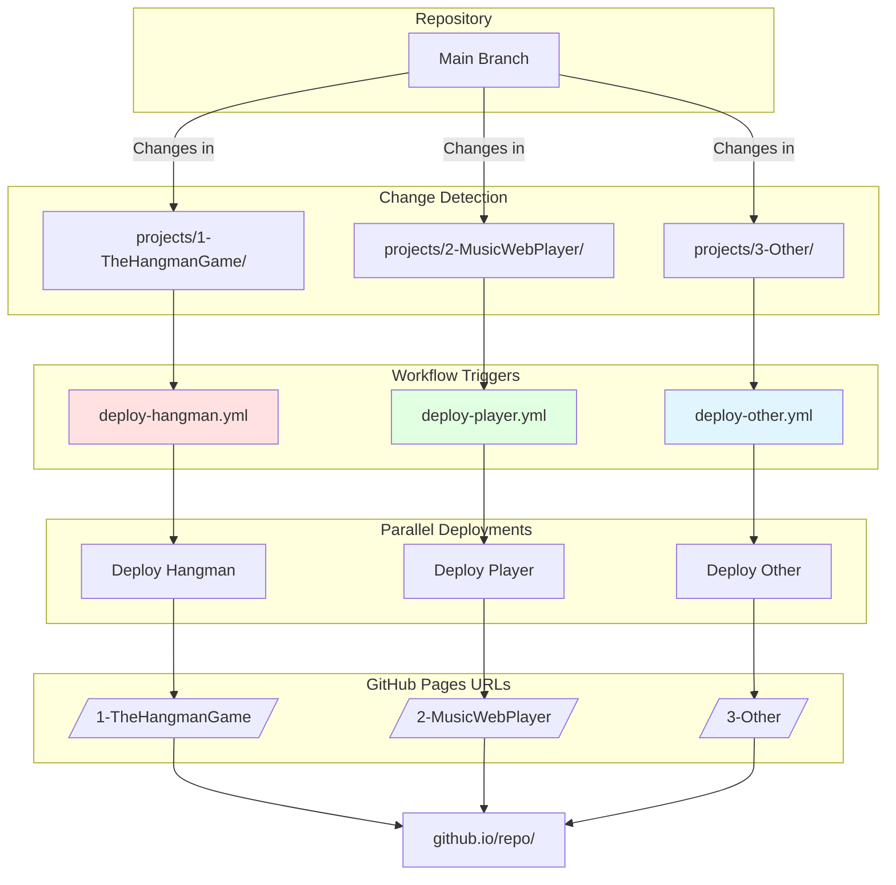
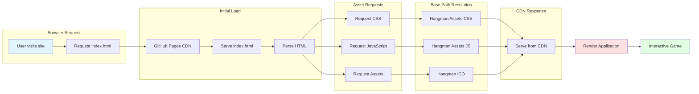
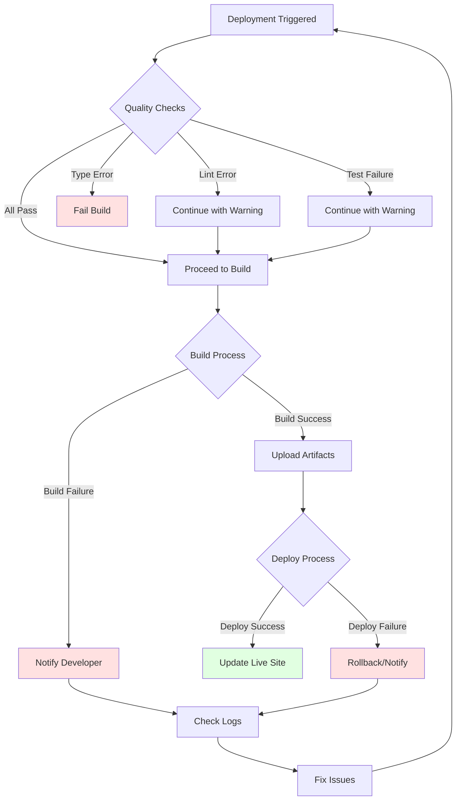
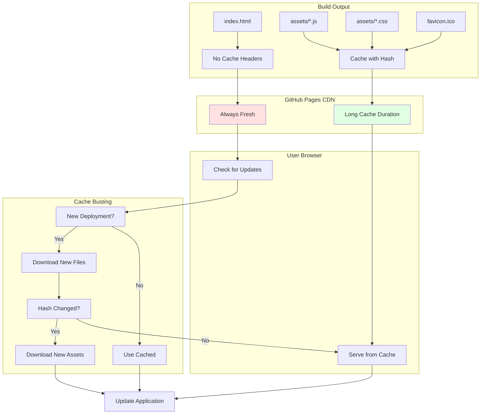

# Deployment Architecture - The Hangman Game

## System Architecture Diagram

## Deployment Flow Sequence

## Mono-Repo Structure

## Build and Deployment Pipeline

## Environment Configuration Flow

## Multi-Project Deployment Strategy

## Asset Loading Architecture

## Error Handling Flow

## Caching and CDN Strategy

---

## Key Architecture Principles

1. **Isolation**: Each project in the mono-repo is independent
2. **Automation**: Deployments are fully automated via GitHub Actions
3. **Quality**: Built-in quality gates before deployment
4. **Optimization**: Production builds are optimized for performance
5. **Reliability**: Error handling and rollback capabilities
6. **Scalability**: Easy to add more projects to the mono-repo
7. **Monitoring**: Full visibility into deployment process
8. **Security**: Minimal permissions, HTTPS by default

## Technology Stack

- **Version Control**: Git + GitHub
- **CI/CD**: GitHub Actions
- **Build Tool**: Vite
- **Language**: TypeScript
- **Testing**: Jest
- **Linting**: ESLint
- **Hosting**: GitHub Pages
- **CDN**: GitHub's Global CDN