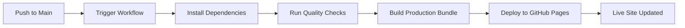

# Deployment Guide - The Hangman Game

This guide explains how to deploy The Hangman Game to GitHub Pages within a mono-repo structure.

## 🌐 Deployment Overview

The Hangman Game is deployed to GitHub Pages as part of a multi-project mono-repo. The deployment is automated using GitHub Actions.

### Repository Structure

```
repository-root/
├── projects/
│   ├── 1-TheHangmanGame/     # This project
│   ├── 2-MusicWebPlayer/
│   └── ...
├── chats/
└── .github/
    └── workflows/
        └── deploy-hangman.yml
```

## 📋 Prerequisites

Before deploying, ensure:

1. **GitHub Pages is enabled** in your repository settings
2. **Source is set to GitHub Actions** (Settings → Pages → Source → GitHub Actions)
3. **Repository permissions** allow GitHub Actions to deploy
4. **Node.js environment** is available (handled by GitHub Actions)

## 🚀 Deployment Process

### Automatic Deployment

The project automatically deploys when:

1. **Push to main/master branch** with changes in `projects/1-TheHangmanGame/`
2. **Manual workflow dispatch** from GitHub Actions tab

### Manual Deployment

To manually trigger deployment:

1. Go to your repository on GitHub
2. Navigate to **Actions** tab
3. Select **Deploy Hangman Game to GitHub Pages** workflow
4. Click **Run workflow** button
5. Select the branch and click **Run workflow**

## 🔧 Configuration Files

### 1. GitHub Actions Workflow (`.github/workflows/deploy-hangman.yml`)

Located at the repository root, this workflow:
- Monitors changes in `projects/1-TheHangmanGame/`
- Runs quality checks (linting, type checking, tests)
- Builds the production bundle
- Deploys to GitHub Pages

### 2. Vite Configuration (`projects/1-TheHangmanGame/vite.config.ts`)

Configured with:
- **Base path**: `/1-TheHangmanGame/` for GitHub Pages subdirectory
- **Build output**: `dist/` directory
- **Asset optimization**: Minification and tree-shaking enabled

### 3. Package Scripts (`projects/1-TheHangmanGame/package.json`)

Key scripts for deployment:
```json
{
  "scripts": {
    "build": "tsc && vite build",
    "preview": "vite preview"
  }
}
```

## 🌍 Accessing the Deployed Application

After successful deployment, the application will be available at:

```
https://alu0101549491.github.io/TFG-Fabian-Gonzalez-Lence/1-TheHangmanGame/
```

## 🔍 Deployment Verification

### Check Deployment Status

1. **GitHub Actions Tab**: Monitor workflow execution
2. **Deployments Section**: View deployment history (Code tab → Environments → github-pages)
3. **Live Site**: Visit the deployed URL

### Common Issues and Solutions

#### Issue: 404 Error on Deployed Site

**Solution**: Verify base path configuration in `vite.config.ts`:
```typescript
const base = process.env.BASE_URL || '/';
```

The workflow sets `BASE_URL=/1-TheHangmanGame/` during build.

#### Issue: Assets Not Loading

**Solution**: Ensure all asset imports use relative paths or the configured base path.

#### Issue: Workflow Not Triggering

**Solution**: 
1. Check if changes are in `projects/1-TheHangmanGame/` directory
2. Verify workflow file is in `.github/workflows/` at repository root
3. Ensure GitHub Actions is enabled in repository settings

#### Issue: Build Fails

**Solution**:
1. Check the Actions tab for error logs
2. Run `npm run build` locally to reproduce the issue
3. Ensure all dependencies are listed in `package.json`
4. Verify TypeScript compilation passes: `npm run type-check`

## 🏗️ Build Process

The deployment workflow executes the following steps:

### 1. Quality Checks
```bash
npm run lint        # ESLint validation
npm run type-check  # TypeScript type checking
npm run test:coverage # Run tests with coverage
```

### 2. Production Build
```bash
npm run build
```

This creates an optimized production bundle in `dist/`:
- Minified JavaScript
- Optimized CSS
- Compressed assets
- Source maps (for debugging)

### 3. Deployment
- Artifacts uploaded to GitHub Pages
- Deployment verified
- URL becomes accessible

## 📦 Build Output Structure

After building, the `dist/` directory contains:

```
dist/
├── index.html          # Main HTML file
├── assets/
│   ├── index-[hash].js # Bundled JavaScript
│   ├── index-[hash].css # Bundled CSS
│   └── ...             # Other assets
└── favicon.ico         # Favicon
```

## 🔄 Continuous Deployment Workflow



## 🛠️ Local Build Testing

To test the production build locally before deploying:

```bash
# Navigate to project directory
cd projects/1-TheHangmanGame

# Install dependencies
npm install

# Build production bundle
npm run build

# Preview production build
npm run preview
```

The preview will be available at `http://localhost:4173`

## 📊 Deployment Monitoring

### GitHub Actions Dashboard

Monitor deployments in the Actions tab:
- ✅ Green checkmark: Successful deployment
- ❌ Red X: Failed deployment
- 🟡 Yellow dot: In progress

### Deployment Logs

View detailed logs for each deployment:
1. Go to Actions tab
2. Click on the workflow run
3. Expand each step to see detailed output

## 🔐 Security Considerations

1. **Permissions**: Workflow uses minimal required permissions
2. **Dependencies**: Keep dependencies updated with `npm audit`
3. **Secrets**: No secrets required for static site deployment
4. **HTTPS**: GitHub Pages automatically serves content over HTTPS

## 🚦 Deployment Checklist

Before deploying:

- [ ] All tests pass locally: `npm test`
- [ ] TypeScript compiles without errors: `npm run type-check`
- [ ] Linter passes: `npm run lint`
- [ ] Build succeeds locally: `npm run build`
- [ ] Preview works correctly: `npm run preview`
- [ ] All changes committed and pushed
- [ ] GitHub Pages enabled in repository settings
- [ ] Workflow file at repository root

## 📚 Additional Resources

- [GitHub Pages Documentation](https://docs.github.com/en/pages)
- [GitHub Actions Documentation](https://docs.github.com/en/actions)
- [Vite Deployment Guide](https://vitejs.dev/guide/static-deploy.html)
- [Mono-repo Best Practices](https://monorepo.tools/)

## 🆘 Support

If you encounter issues:

1. Check the [Deployment Verification](#deployment-verification) section
2. Review GitHub Actions workflow logs
3. Test the build locally
4. Verify repository settings
5. Consult the project's main README.md

## 📝 Notes

- **Deployment time**: Typically 2-5 minutes
- **Cache**: Browser caching may delay updates (hard refresh with Ctrl+Shift+R)
- **Concurrent deployments**: Limited to one at a time
- **Multiple projects**: Each project in the mono-repo can have its own deployment workflow