I've created a comprehensive UML use case diagram for the Project Management System based on all 20 user stories. Here's what the diagram includes:

## **Actors (5 distinct roles):**

- **Administrator** (Red): Full system access and management capabilities
- **Client** (Blue): Project viewing, task management, and messaging
- **Special User** (Purple): Limited access with custom permissions
- **System** (Green): Automated background operations
- **Dropbox** (Blue): External file storage integration

## **Use Case Categories (Color-Coded):**

1. **Authentication (Yellow)**: Login, credential validation, session management, and role-based permissions
2. **Project Management (Orange)**: Project creation, assignment, finalization, and Dropbox folder generation
3. **Task Management (Purple)**: Task creation, modification, deletion, status changes, and file attachments
4. **Messaging (Light Blue)**: Internal project messages with file attachments and read status
5. **Notifications (Orange)**: Automatic notifications including WhatsApp integration
6. **Dropbox Integration (Bright Blue)**: File upload/download, validation, and secure link generation
7. **Viewing & Display (Gray)**: Main screen, calendar view, project summaries, and details
8. **Permission Management (Red)**: Permission definition, validation, and access restrictions
9. **Data Management (Green)**: Export functionality and backup/recovery system
10. **System Operations (Light Purple)**: UI updates, logging, real-time sync, and validation

## **Key Relationships Mapped:**

- **Include relationships** show dependencies (e.g., creating a project includes generating a Dropbox folder)
- **Extend relationships** show optional behaviors (e.g., notifications can extend to WhatsApp)
- All user stories (US-01 through US-20) are represented with proper actor interactions
- Priority levels are reflected in the interconnection complexity

The diagram captures the complete workflow from authentication through project lifecycle management, task collaboration, messaging, and data management with proper integration of Dropbox services.

```mermaid
graph TB
    Admin((Administrator))
    Client((Client))
    SpecialUser((Special User))
    System((System))
    Dropbox((Dropbox))
    
    %% Authentication Use Cases
    Login[Login to System]
    ValidateCredentials[Validate Credentials]
    ManageSession[Manage User Session]
    ApplyPermissions[Apply Role Permissions]
    DisplayLoginError[Display Login Error]
    
    %% Project Management Use Cases
    CreateProject[Create Project]
    AssignProjectToClient[Assign Project to Client]
    LinkSpecialUser[Link Special User to Project]
    ViewAssignedProjects[View Assigned Projects]
    FinalizeProject[Finalize Project]
    ViewProjectDetails[View Project Details]
    GenerateDropboxFolder[Generate Dropbox Folder]
    
    %% Task Management Use Cases
    CreateTaskByAdmin[Create Task by Admin]
    CreateTaskByClient[Create Task by Client]
    ModifyTask[Modify Task]
    DeleteTask[Delete Task]
    ChangeTaskStatus[Change Task Status]
    AttachFilesToTask[Attach Files to Task]
    ViewTaskHistory[View Task History]
    ConfirmTaskCompletion[Confirm Task Completion]
    
    %% Messaging Use Cases
    SendMessage[Send Project Message]
    ViewMessages[View Messages]
    MarkMessageAsRead[Mark Message as Read]
    AttachFilesToMessage[Attach Files to Message]
    ViewUnreadMessages[View Unread Messages]
    
    %% Notification Use Cases
    ReceiveNotification[Receive Notification]
    SendNotification[Send Notification]
    ViewNotifications[View Notifications]
    SendWhatsAppNotification[Send WhatsApp Notification]
    MarkNotificationAsRead[Mark Notification as Read]
    
    %% Dropbox Integration Use Cases
    UploadFileToDropbox[Upload File to Dropbox]
    DownloadFileFromDropbox[Download File from Dropbox]
    SyncDropboxFiles[Sync Dropbox Files]
    ValidateFileFormat[Validate File Format]
    GenerateSecureLink[Generate Secure Link]
    
    %% Viewing and Display Use Cases
    ViewMainScreen[View Main Project Screen]
    ViewCalendar[View Calendar]
    ViewProjectSummary[View Project Summary]
    ViewProjectsByDate[View Projects by Date]
    AccessProjectDetails[Access Project Details]
    
    %% Permission Management Use Cases
    DefineUserPermissions[Define User Permissions]
    ValidatePermissions[Validate Permissions]
    RestrictAccess[Restrict Access]
    
    %% Data Management Use Cases
    ExportData[Export Data]
    CreateBackup[Create Backup]
    RestoreBackup[Restore Backup]
    ScheduleAutomaticBackup[Schedule Automatic Backup]
    GenerateExportFile[Generate Export File]
    
    %% System Use Cases
    UpdateUI[Update User Interface]
    LogActivity[Log Activity]
    SyncRealTime[Sync Real-Time Changes]
    ValidateData[Validate Data]
    RecordHistory[Record History]
    CheckPendingTasks[Check Pending Tasks]
    
    %% Administrator interactions
    Admin -->|logs in| Login
    Admin -->|creates| CreateProject
    Admin -->|assigns| AssignProjectToClient
    Admin -->|links| LinkSpecialUser
    Admin -->|creates| CreateTaskByAdmin
    Admin -->|modifies| ModifyTask
    Admin -->|deletes| DeleteTask
    Admin -->|finalizes| FinalizeProject
    Admin -->|defines| DefineUserPermissions
    Admin -->|exports| ExportData
    Admin -->|creates| CreateBackup
    Admin -->|restores| RestoreBackup
    Admin -->|views| ViewMainScreen
    Admin -->|views| ViewCalendar
    Admin -->|sends| SendMessage
    
    %% Client interactions
    Client -->|logs in| Login
    Client -->|views| ViewAssignedProjects
    Client -->|creates| CreateTaskByClient
    Client -->|modifies| ModifyTask
    Client -->|deletes| DeleteTask
    Client -->|changes| ChangeTaskStatus
    Client -->|attaches| AttachFilesToTask
    Client -->|sends| SendMessage
    Client -->|views| ViewMessages
    Client -->|receives| ReceiveNotification
    Client -->|views| ViewMainScreen
    Client -->|views| ViewCalendar
    Client -->|views| ViewProjectDetails
    
    %% Special User interactions
    SpecialUser -->|logs in| Login
    SpecialUser -->|views| ViewAssignedProjects
    SpecialUser -->|views| ViewProjectDetails
    SpecialUser -->|downloads| DownloadFileFromDropbox
    SpecialUser -->|receives| ReceiveNotification
    
    %% System interactions
    System -->|validates| ValidateCredentials
    System -->|manages| ManageSession
    System -->|applies| ApplyPermissions
    System -->|validates| ValidatePermissions
    System -->|sends| SendNotification
    System -->|syncs| SyncDropboxFiles
    System -->|updates| UpdateUI
    System -->|logs| LogActivity
    System -->|syncs| SyncRealTime
    System -->|schedules| ScheduleAutomaticBackup
    System -->|checks| CheckPendingTasks
    
    %% Dropbox interactions
    Dropbox -->|stores| UploadFileToDropbox
    Dropbox -->|provides| DownloadFileFromDropbox
    
    %% Include relationships - Authentication
    Login -.->|includes| ValidateCredentials
    Login -.->|includes| ApplyPermissions
    Login -.->|includes| ManageSession
    
    ValidateCredentials ..->|extends| DisplayLoginError
    
    %% Include relationships - Project Management
    CreateProject -.->|includes| GenerateDropboxFolder
    CreateProject -.->|includes| ValidateData
    CreateProject -.->|includes| UpdateUI
    CreateProject -.->|includes| LogActivity
    
    AssignProjectToClient -.->|includes| ValidateData
    AssignProjectToClient -.->|includes| SendNotification
    AssignProjectToClient -.->|includes| UpdateUI
    
    LinkSpecialUser -.->|includes| DefineUserPermissions
    LinkSpecialUser -.->|includes| ValidatePermissions
    LinkSpecialUser -.->|includes| UpdateUI
    
    ViewAssignedProjects -.->|includes| ValidatePermissions
    ViewAssignedProjects -.->|includes| ViewProjectSummary
    ViewAssignedProjects -.->|includes| CheckPendingTasks
    
    FinalizeProject -.->|includes| CheckPendingTasks
    FinalizeProject -.->|includes| SendNotification
    FinalizeProject -.->|includes| RecordHistory
    FinalizeProject -.->|includes| UpdateUI
    
    %% Include relationships - Task Management
    CreateTaskByAdmin -.->|includes| ValidateData
    CreateTaskByAdmin -.->|includes| SendNotification
    CreateTaskByAdmin -.->|includes| UpdateUI
    CreateTaskByAdmin -.->|includes| LogActivity
    
    CreateTaskByClient -.->|includes| ValidateData
    CreateTaskByClient -.->|includes| SendNotification
    CreateTaskByClient -.->|includes| UpdateUI
    CreateTaskByClient -.->|includes| LogActivity
    
    ModifyTask -.->|includes| ValidatePermissions
    ModifyTask -.->|includes| RecordHistory
    ModifyTask -.->|includes| SendNotification
    ModifyTask -.->|includes| UpdateUI
    
    DeleteTask -.->|includes| ValidatePermissions
    DeleteTask -.->|includes| LogActivity
    DeleteTask -.->|includes| UpdateUI
    
    ChangeTaskStatus -.->|includes| ValidatePermissions
    ChangeTaskStatus -.->|includes| RecordHistory
    ChangeTaskStatus -.->|includes| SendNotification
    ChangeTaskStatus -.->|includes| UpdateUI
    
    ChangeTaskStatus ..->|extends| ConfirmTaskCompletion
    
    AttachFilesToTask -.->|includes| ValidateFileFormat
    AttachFilesToTask -.->|includes| UploadFileToDropbox
    AttachFilesToTask -.->|includes| SendNotification
    AttachFilesToTask -.->|includes| UpdateUI
    
    %% Include relationships - Messaging
    SendMessage -.->|includes| ValidateData
    SendMessage -.->|includes| SendNotification
    SendMessage -.->|includes| UpdateUI
    SendMessage -.->|includes| LogActivity
    
    SendMessage ..->|extends| AttachFilesToMessage
    
    AttachFilesToMessage -.->|includes| UploadFileToDropbox
    
    ViewMessages -.->|includes| ValidatePermissions
    ViewMessages -.->|includes| ViewUnreadMessages
    
    ViewMessages ..->|extends| MarkMessageAsRead
    
    %% Include relationships - Notifications
    ReceiveNotification -.->|includes| ViewNotifications
    
    SendNotification -.->|includes| LogActivity
    SendNotification ..->|extends| SendWhatsAppNotification
    
    ViewNotifications ..->|extends| MarkNotificationAsRead
    
    %% Include relationships - Dropbox Integration
    GenerateDropboxFolder -.->|includes| SyncDropboxFiles
    
    UploadFileToDropbox -.->|includes| ValidateFileFormat
    UploadFileToDropbox -.->|includes| GenerateSecureLink
    UploadFileToDropbox -.->|includes| SyncDropboxFiles
    
    DownloadFileFromDropbox -.->|includes| ValidatePermissions
    DownloadFileFromDropbox -.->|includes| GenerateSecureLink
    
    %% Include relationships - Viewing
    ViewMainScreen -.->|includes| ViewProjectSummary
    ViewMainScreen -.->|includes| ViewUnreadMessages
    ViewMainScreen -.->|includes| CheckPendingTasks
    
    ViewCalendar -.->|includes| ViewProjectsByDate
    
    ViewProjectDetails -.->|includes| ValidatePermissions
    ViewProjectDetails -.->|includes| ViewTaskHistory
    
    %% Include relationships - Data Management
    ExportData -.->|includes| ValidatePermissions
    ExportData -.->|includes| GenerateExportFile
    ExportData -.->|includes| ValidateData
    
    CreateBackup -.->|includes| ValidatePermissions
    CreateBackup -.->|includes| LogActivity
    
    RestoreBackup -.->|includes| ValidatePermissions
    RestoreBackup -.->|includes| ValidateData
    RestoreBackup -.->|includes| UpdateUI
    
    ScheduleAutomaticBackup -.->|includes| CreateBackup
    
    %% Extend relationships - Access Control
    ViewAssignedProjects ..->|extends| RestrictAccess
    ViewProjectDetails ..->|extends| RestrictAccess
    DownloadFileFromDropbox ..->|extends| RestrictAccess
    
    %% Styling
    classDef adminStyle fill:#E74C3C,stroke:#C0392B,stroke-width:3px,color:#fff
    classDef clientStyle fill:#3498DB,stroke:#2471A3,stroke-width:3px,color:#fff
    classDef specialUserStyle fill:#9B59B6,stroke:#6C3483,stroke-width:3px,color:#fff
    classDef systemStyle fill:#50C878,stroke:#2E7D4E,stroke-width:3px,color:#fff
    classDef dropboxStyle fill:#0061FF,stroke:#0051D5,stroke-width:3px,color:#fff
    classDef authUseCase fill:#FFD700,stroke:#DAA520,stroke-width:2px
    classDef projectUseCase fill:#FF9F40,stroke:#CC7A33,stroke-width:2px
    classDef taskUseCase fill:#9B59B6,stroke:#6C3483,stroke-width:2px
    classDef messageUseCase fill:#3498DB,stroke:#2471A3,stroke-width:2px
    classDef notificationUseCase fill:#E67E22,stroke:#CA6F1E,stroke-width:2px
    classDef dropboxUseCase fill:#0088FF,stroke:#0066CC,stroke-width:2px
    classDef viewUseCase fill:#95A5A6,stroke:#7F8C8D,stroke-width:2px
    classDef permissionUseCase fill:#E74C3C,stroke:#C0392B,stroke-width:2px
    classDef dataUseCase fill:#2ECC71,stroke:#27AE60,stroke-width:2px
    classDef systemUseCase fill:#B19CD9,stroke:#7B68A8,stroke-width:2px
    
    class Admin adminStyle
    class Client clientStyle
    class SpecialUser specialUserStyle
    class System systemStyle
    class Dropbox dropboxStyle
    class Login,ValidateCredentials,ManageSession,ApplyPermissions,DisplayLoginError authUseCase
    class CreateProject,AssignProjectToClient,LinkSpecialUser,ViewAssignedProjects,FinalizeProject,ViewProjectDetails,GenerateDropboxFolder projectUseCase
    class CreateTaskByAdmin,CreateTaskByClient,ModifyTask,DeleteTask,ChangeTaskStatus,AttachFilesToTask,ViewTaskHistory,ConfirmTaskCompletion taskUseCase
    class SendMessage,ViewMessages,MarkMessageAsRead,AttachFilesToMessage,ViewUnreadMessages messageUseCase
    class ReceiveNotification,SendNotification,ViewNotifications,SendWhatsAppNotification,MarkNotificationAsRead notificationUseCase
    class UploadFileToDropbox,DownloadFileFromDropbox,SyncDropboxFiles,ValidateFileFormat,GenerateSecureLink dropboxUseCase
    class ViewMainScreen,ViewCalendar,ViewProjectSummary,ViewProjectsByDate,AccessProjectDetails viewUseCase
    class DefineUserPermissions,ValidatePermissions,RestrictAccess permissionUseCase
    class ExportData,CreateBackup,RestoreBackup,ScheduleAutomaticBackup,GenerateExportFile dataUseCase
    class UpdateUI,LogActivity,SyncRealTime,ValidateData,RecordHistory,CheckPendingTasks systemUseCase
```

