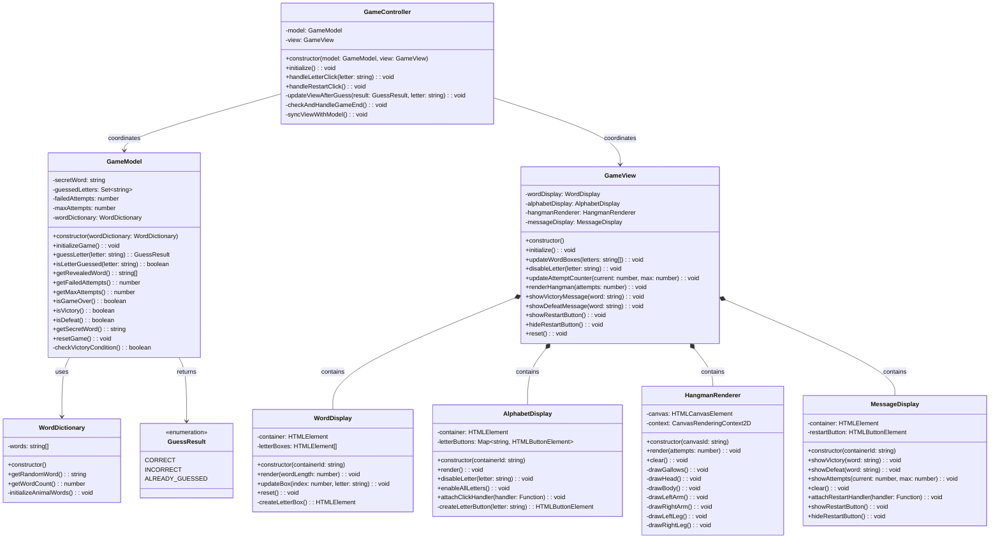
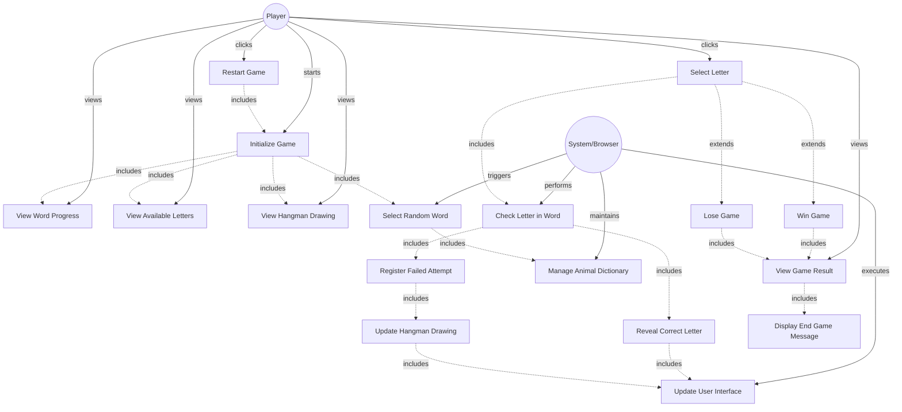

# PROJECT CONTEXT

**Project:** The Hangman Game

**Description:** A responsive Single Page Application (SPA) that implements the classic Hangman game where players guess animal names letter by letter before completing a hangman drawing (maximum 6 failed attempts). Features include interactive alphabet, visual word progress, Canvas-based hangman rendering, and complete game state management.

**Selected architecture:** MVC (Model-View-Controller)

**Technology stack:** TypeScript, HTML, CSS, Vite, TypeDoc, ESLint, Jest, ts-jest, Bulma, Canvas API

---

# AVAILABLE DESIGN ARTIFACTS

## Main class diagram

## Main use case diagram

## Design patterns to apply
- **MVC Pattern:** Separation of concerns between Model (business logic), View (UI), Controller (coordination)
- **Observer Pattern:** Controller observes user events (letter clicks, restart) and updates Model/View accordingly
- **Composite Pattern:** GameView composes multiple display components (WordDisplay, AlphabetDisplay, HangmanRenderer, MessageDisplay)
- **Singleton Pattern (implied):** WordDictionary maintains single source of animal words

## Relevant non-functional requirements
- **Maintainability:** Modular code with clear separation of concerns (MVC)
- **Testability:** ≥80% code coverage with Jest unit tests
- **Performance:** UI updates < 200ms after letter selection
- **Responsiveness:** Works on desktop and mobile browsers
- **Code Quality:** ESLint with Google TypeScript Style Guide compliance
- **Documentation:** Complete JSDoc/TypeDoc documentation
- **CI/CD:** GitHub Actions for linting, testing, build, and deployment

---

# TASK

Generate the complete folder and file structure of the project starting from a current directory named 1-TheHangmanGame and following these specifications:

## Required structure:
- Clear separation of MVC layers according to the class diagram
- TypeScript naming conventions following the Google Style Guide
- Initial configuration for Vite, Jest, TypeDoc, ESLint
- Base documentation files (README.md, ARCHITECTURE.md)

## Expected deliverables:
1. Complete directory tree (src, docs, tests, config, public)
2. Configuration files (package.json, jest.config.js, jest.setup.js, tsconfig.json, typedoc.json, vite.config.ts, eslint.config.mjs)
3. Main classes/modules as empty skeletons with methods declared
4. README.md with setup instructions
5. Jest and ts-jest properly configured
6. Vite configured for TypeScript SPA
7. ESLint configured with Google Style Guide

---

# CONSTRAINTS

- DO NOT implement logic yet, only structure
- Use consistent nomenclature from class diagram and Google Style Guide
- Include appropriate .gitignore
- Prepare structure for testing from the start
- Configure Vite for TypeScript + Canvas API
- Include Bulma CSS framework integration
- The `1-TheHangmanGame` is a subdirectory from a repository that stores multiple independent projects, so be careful with the GitHub interactions.

---

# OUTPUT FORMAT

Provide:
1. Textual listing of the folder structure
2. Content of each configuration file
3. Skeletons of main classes with JSDoc comments
4. Brief justification of architectural decisions
5. Bash commands to initialize the project
6. Bash commands to install dependencies
7. Bash commands to configure the project
