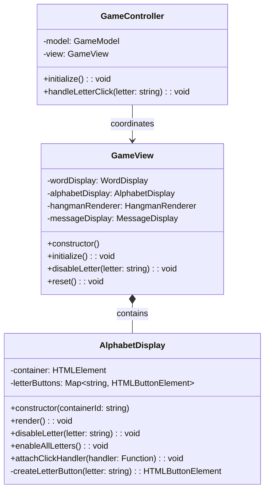
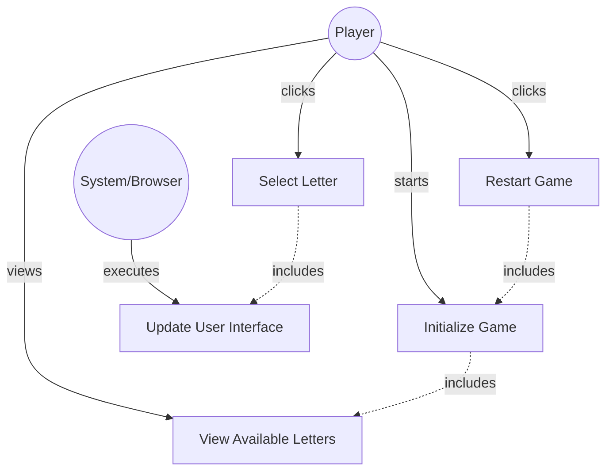

# GLOBAL CONTEXT

**Project:** The Hangman Game - Web Application

**Architecture:** MVC (Model-View-Controller) with TypeScript

**Current module:** View Layer - UI Components

---

# PROJECT FILE STRUCTURE

```
1-TheHangmanGame/
├── public/
│   └── favicon.ico
├── src/
│   ├── main.ts                    # Entry point
│   ├── models/
│   │   ├── guess-result.ts       # Enumeration for guess outcomes
│   │   ├── word-dictionary.ts    # Word management
│   │   └── game-model.ts         # Game logic
│   ├── views/
│   │   ├── game-view.ts          # Main view coordinator
│   │   ├── word-display.ts       # Letter boxes rendering
│   │   ├── alphabet-display.ts   # ← YOU ARE IMPLEMENTING THIS FILE
│   │   ├── hangman-renderer.ts   # Canvas drawing
│   │   └── message-display.ts    # Messages and restart
│   ├── controllers/
│   │   └── game-controller.ts    # Event coordination
│   └── styles/
│       └── main.css              # Custom styles
├── tests/
│   ├── models/
│   │   ├── guess-result.test.ts
│   │   ├── word-dictionary.test.ts
│   │   └── game-model.test.ts
│   ├── views/
│   │   ├── word-display.test.ts
│   │   ├── alphabet-display.test.ts  # Tests for this file
│   │   ├── hangman-renderer.test.ts
│   │   └── message-display.test.ts
│   └── controllers/
│       └── game-controller.test.ts
├── index.html
├── package.json
├── tsconfig.json
├── vite.config.ts
├── jest.config.js
└── README.md
```

---

# INPUT ARTIFACTS

## 1. Requirements Specification

### Relevant Functional Requirements:

- **FR2:** Letter selection by the user through click - When clicking on a letter of the alphabet, it is marked as selected (no longer clickable) and the system processes whether it is correct or incorrect
- **FR9:** Game restart - Restart resets all states including re-enabling all alphabet letters
- **FR10:** Disable already selected letters - Once the user selects a letter, it must be visually marked and cannot be selected again in the same game

### Relevant Non-Functional Requirements:

- **NFR2:** Modular and object-oriented code following MVC architecture
- **NFR4:** Use of Bulma for interface styling - HTML elements use Bulma classes with consistent design
- **NFR5:** Unit tests with Jest with minimum 80% coverage
- **NFR6:** Complete documentation with JSDoc/TypeDoc
- **NFR7:** Code analysis with ESLint and Google style guide
- **NFR8:** Immediate response time when selecting letters - Interface updates in less than 200ms

### Visual Specifications (from HTML/CSS prompt):

**Alphabet Display Section (`#alphabet-container`):**
- Interactive alphabet buttons (26 letters: A-Z)
- **Button specifications:**
  - Width: 45px, Height: 45px (desktop)
  - Width: 40px, Height: 40px (mobile)
  - Font-size: 1.25rem (desktop), 1rem (mobile)
  - Font-weight: bold
  - Border: 2px solid primary color (#3273dc)
  - Background: white initially
  - Color: primary color initially
  - Border-radius: 8px
  - Cursor: pointer
  - Transition: all 0.2s
- **Hover effect (enabled buttons only):**
  - Background changes to primary color
  - Text color changes to white
  - Transform: translateY(-2px) for lift effect
- **Disabled state (after selection):**
  - Opacity: 0.5
  - Cursor: not-allowed
  - No hover effects
- Arranged with flexbox, wrapped, centered
- Gap between buttons: 0.5rem
- **CSS class:** `.letter-button`

---

## 2. Class Diagram



**Relationship:** `AlphabetDisplay` is a component of `GameView` responsible for rendering the interactive alphabet buttons and managing their state (enabled/disabled).

---

## 3. Use Case Diagram



**Context:** AlphabetDisplay handles the visual representation of clickable letter buttons, enabling user interaction and visual feedback for selected letters.

---

# SPECIFIC TASK

Implement the class: **`AlphabetDisplay`**

**File location:** `src/views/alphabet-display.ts`

---

## Responsibilities:

1. **Manage the visual display of alphabet buttons** (A-Z)
2. **Create interactive buttons dynamically** for all 26 letters
3. **Handle button state management** (enabled/disabled)
4. **Attach click event handlers** to buttons for user interaction
5. **Provide methods to disable individual letters** after selection
6. **Enable all letters** when restarting the game

---

## Properties (Private):

- **container: HTMLElement** - The DOM container element that holds all alphabet buttons (the `#alphabet-container` div from HTML)
- **letterButtons: Map<string, HTMLButtonElement>** - Map of letters to their corresponding button elements for efficient lookup and state management

---

## Methods to implement:

### 1. **constructor(containerId: string)**
   - **Description:** Creates a new AlphabetDisplay instance and captures reference to the container element
   - **Parameters:** 
     - `containerId: string` - The ID of the container HTML element (should be `"alphabet-container"`)
   - **Returns:** Instance of AlphabetDisplay
   - **Preconditions:** 
     - An HTML element with the specified ID must exist in the DOM
   - **Postconditions:** 
     - `this.container` references the DOM element
     - `this.letterButtons` is initialized as empty Map
   - **Implementation details:**
     - Use `document.getElementById(containerId)` to get the container element
     - Check if element exists, throw error if not found with descriptive message
     - Initialize `letterButtons` as empty Map: `new Map<string, HTMLButtonElement>()`
   - **Error handling:**
     - Throw Error if element not found: `throw new Error(\`Element with id "${containerId}" not found\`)`
   - **Example usage:**
     ```typescript
     const alphabetDisplay = new AlphabetDisplay('alphabet-container');
     ```

### 2. **render(): void**
   - **Description:** Renders the complete alphabet of clickable buttons (A-Z)
   - **Parameters:** None
   - **Returns:** `void`
   - **Preconditions:** 
     - Container element must exist
   - **Postconditions:** 
     - Container is cleared of any previous content
     - 26 button elements (A-Z) are created and added to container
     - All buttons are stored in `letterButtons` Map with letter as key
     - All buttons are initially enabled
   - **Implementation details:**
     - Clear container: `this.container.innerHTML = ''`
     - Clear letterButtons Map: `this.letterButtons.clear()`
     - Define alphabet: `const alphabet = 'ABCDEFGHIJKLMNOPQRSTUVWXYZ'`
     - Loop through each letter in alphabet:
       - Create button using `createLetterButton(letter)`
       - Add button to container: `this.container.appendChild(button)`
       - Store button in Map: `this.letterButtons.set(letter, button)`
   - **Exceptions to handle:** None (always succeeds with valid container)
   - **Example:**
     ```typescript
     alphabetDisplay.render(); // Creates 26 buttons A-Z
     ```

### 3. **disableLetter(letter: string): void**
   - **Description:** Disables a specific letter button after it has been guessed
   - **Parameters:** 
     - `letter: string` - The letter to disable (should be A-Z, case-insensitive)
   - **Returns:** `void`
   - **Preconditions:** 
     - Buttons must have been rendered
     - Letter should be a valid alphabet character
   - **Postconditions:** 
     - The button for the specified letter is disabled
     - Button shows disabled styling (opacity, cursor, no hover)
   - **Implementation details:**
     - Normalize letter to uppercase: `letter = letter.toUpperCase()`
     - Get button from Map: `const button = this.letterButtons.get(letter)`
     - Check if button exists (optional defensive check)
     - Disable button: `button.disabled = true`
   - **Exceptions to handle:**
     - Optional: Check if button exists before disabling
     - Optional: Validate letter is single alphabetic character
   - **Example:**
     ```typescript
     alphabetDisplay.disableLetter('E'); // Disables the 'E' button
     alphabetDisplay.disableLetter('a'); // Disables the 'A' button (case-insensitive)
     ```

### 4. **enableAllLetters(): void**
   - **Description:** Enables all letter buttons (used when resetting the game)
   - **Parameters:** None
   - **Returns:** `void`
   - **Preconditions:** 
     - Buttons must have been rendered
   - **Postconditions:** 
     - All 26 alphabet buttons are enabled
     - All buttons are clickable again
   - **Implementation details:**
     - Iterate through all entries in `letterButtons` Map
     - For each button: `button.disabled = false`
     - Alternative: Use `Map.forEach()` method
   - **Exceptions to handle:** None
   - **Example:**
     ```typescript
     alphabetDisplay.enableAllLetters(); // Re-enables all buttons for new game
     ```

### 5. **attachClickHandler(handler: (letter: string) => void): void**
   - **Description:** Attaches a click handler to all letter buttons
   - **Parameters:** 
     - `handler: (letter: string) => void` - The callback function to invoke when a letter is clicked, receives the clicked letter as parameter
   - **Returns:** `void`
   - **Preconditions:** 
     - Buttons must have been rendered
     - Handler must be a valid function
   - **Postconditions:** 
     - All buttons have click event listeners attached
     - When clicked, each button calls the handler with its letter
   - **Implementation details:**
     - Iterate through all entries in `letterButtons` Map
     - For each letter and button:
       - Add click event listener: `button.addEventListener('click', () => handler(letter))`
       - The handler receives the letter (already uppercase)
   - **Exceptions to handle:** None
   - **Usage context:** Called by GameView/GameController to connect UI to game logic
   - **Example:**
     ```typescript
     alphabetDisplay.attachClickHandler((letter) => {
       console.log(`Letter ${letter} was clicked`);
       // Controller processes the guess
     });
     ```

### 6. **createLetterButton(letter: string): HTMLButtonElement** (private)
   - **Description:** Creates a single letter button element with appropriate styling and content
   - **Parameters:** 
     - `letter: string` - The letter for this button (A-Z, uppercase)
   - **Returns:** `HTMLButtonElement` - A button element configured for the letter
   - **Preconditions:** 
     - Letter should be single uppercase character
   - **Postconditions:** 
     - Returns a button element with:
       - CSS class `letter-button`
       - Text content set to the letter
       - Initially enabled state
   - **Implementation details:**
     - Create button element: `const button = document.createElement('button')`
     - Add CSS class: `button.classList.add('letter-button')`
     - Set text content: `button.textContent = letter`
     - Set type attribute: `button.type = 'button'` (prevent form submission if in form context)
     - Return the button
   - **Accessibility considerations:**
     - Optional: Add `aria-label` attribute: `button.setAttribute('aria-label', \`Letter ${letter}\`)`
     - Optional: Add `aria-pressed` attribute: `button.setAttribute('aria-pressed', 'false')`
   - **CSS class applied:** `.letter-button` (defined in `src/styles/main.css`)
   - **Example resulting HTML:**
     ```html
     <button type="button" class="letter-button">A</button>
     ```

---

## Dependencies:

- **Classes it must use:** None (pure DOM manipulation)
- **Interfaces it implements:** None
- **External services it consumes:** 
  - DOM API (`document.getElementById`, `document.createElement`, `addEventListener`, etc.)
- **Classes that depend on this:** 
  - `GameView` - composes AlphabetDisplay and calls its methods
  - `GameController` - attaches click handlers through GameView

---

# CONSTRAINTS AND STANDARDS

## Code:

- **Language:** TypeScript 5.6.3
- **Module system:** ES6 modules (ESNext)
- **Code style:** Google TypeScript Style Guide
  - Class name: PascalCase (`AlphabetDisplay`)
  - Method names: camelCase
  - Private methods: use `private` keyword
  - Constants: UPPER_CASE if extracted (e.g., `const ALPHABET = 'ABCDEFGHIJKLMNOPQRSTUVWXYZ'`)
- **Maximum cyclomatic complexity:** 5 (methods are simple DOM operations and loops)
- **Maximum method length:** 35 lines (render method might be longer due to loop)

## Mandatory best practices:

- **Application of SOLID principles:**
  - **SRP (Single Responsibility):** Only handles alphabet button display and state
  - **OCP (Open/Closed):** Can be extended without modification
  
- **Input parameter validation:**
  - Validate `containerId` exists in constructor (throw error if not)
  - Normalize letter case in `disableLetter()` (convert to uppercase)
  - Optional: Validate letter is single alphabetic character
  
- **Robust exception handling:**
  - Constructor must throw error if container element not found
  - Consider defensive checks in `disableLetter()` for non-existent letters
  
- **Logging at critical points:**
  - Not required for this simple view component
  - Optional: Console log for debugging during development
  
- **Comments for complex logic:**
  - Comment the alphabet rendering loop in `render()`
  - Comment the event handler attachment in `attachClickHandler()`
  - No other complex logic expected

## TypeScript-specific requirements:

- Use TypeScript type annotations for all parameters and return types
- Use `HTMLElement` and `HTMLButtonElement` types for DOM elements
- Use `Map<string, HTMLButtonElement>` for letterButtons
- Proper null checking when getting elements from DOM
- Use proper access modifiers: `public`, `private`
- Use function type for handler: `(letter: string) => void`

## Documentation requirements:

- **JSDoc comment block** for the class
- **JSDoc comments** for all public methods
- **JSDoc comment** for constructor
- **Optional:** JSDoc for private method `createLetterButton()`
- Include `@category View` tag for TypeDoc organization
- Use proper JSDoc tags: `@param`, `@returns`, `@throws`

## Accessibility Requirements:

- **Keyboard navigation:** Buttons are naturally keyboard accessible (native `<button>` elements)
- **ARIA attributes (optional but recommended):**
  - `aria-label` on each button: "Letter A", "Letter B", etc.
  - `aria-pressed` attribute to indicate button state (optional)
- **Disabled state:** Use native `disabled` attribute (automatic keyboard skip)
- **Focus styles:** Handled by CSS (`.letter-button:focus`)

## Security:

- **XSS Prevention:** Use `textContent` instead of `innerHTML` when setting letter text
- **Event Safety:** Use proper event listener management (no inline event handlers)
- **DOM Manipulation Safety:** Validate elements exist before manipulation

---

# DELIVERABLES

## 1. Complete source code of the class with:

- **File header comment** with brief description
- **Import statements** (none expected for this file)
- **Class declaration** with JSDoc documentation
- **Private properties** with type annotations
- **Constructor implementation** with element validation
- **All public methods implemented** (4 public methods: render, disableLetter, enableAllLetters, attachClickHandler)
- **Private method implemented:** `createLetterButton()`
- **Proper exports:** `export class AlphabetDisplay { ... }`

## 2. Inline documentation:

- **JSDoc for class:** Explain AlphabetDisplay's purpose
- **JSDoc for constructor:** Explain containerId parameter and error handling
- **JSDoc for each public method:** Parameters, return values, purpose
- **Inline comments:** Explain rendering loop, event handler attachment
- **Category tag:** `@category View`

## 3. New dependencies:

- **None** - Uses only native DOM APIs (browser built-ins)
- All DOM manipulation uses standard APIs

## 4. Edge cases considered:

- **Container not found:** Constructor throws descriptive error
- **Invalid letter in disableLetter:** Optional bounds checking, normalize to uppercase
- **Disabling already disabled button:** Idempotent operation (no error)
- **Enabling already enabled buttons:** Idempotent operation (no error)
- **Attaching handler before render:** No buttons exist yet (should render first)
- **Attaching multiple handlers:** Each attachment adds new listener (possible issue, but acceptable)
- **Letter case normalization:** All letters handled as uppercase internally
- **Non-alphabetic input:** Optional validation (numbers, special characters)

---

# OUTPUT FORMAT

```typescript
[Complete code here]
```

---

## Design decisions made:

- **[Decision 1 and its justification]**
- **[Decision 2 and its justification]**
- ...

---

## Possible future improvements:

- **[Improvement 1]**
- **[Improvement 2]**
- ...

---

## Testing considerations:

Unit tests should verify:

1. **Constructor throws error if container not found:** Mock DOM and test error
2. **Constructor succeeds with valid container:** Verify container reference stored
3. **render() creates 26 buttons:** Check letterButtons Map size
4. **render() adds buttons to container:** Verify container children count
5. **render() stores buttons in Map:** Check Map.has() for each letter A-Z
6. **render() clears previous buttons:** Call render twice, verify only 26 buttons exist
7. **disableLetter() disables specific button:** Check button.disabled property
8. **disableLetter() handles lowercase input:** Pass 'a', verify 'A' button disabled
9. **enableAllLetters() enables all buttons:** Disable some, then enable all, verify all enabled
10. **attachClickHandler() adds event listeners:** Mock handler, simulate click, verify handler called
11. **attachClickHandler() passes correct letter:** Click 'E' button, verify handler receives 'E'
12. **createLetterButton() creates button with correct class:** Verify classList contains 'letter-button'
13. **createLetterButton() sets text content:** Verify button.textContent equals letter

**Jest DOM Testing:**
```typescript
// Example test structure
describe('AlphabetDisplay', () => {
  let container: HTMLElement;
  let alphabetDisplay: AlphabetDisplay;

  beforeEach(() => {
    document.body.innerHTML = '<div id="alphabet-container"></div>';
    container = document.getElementById('alphabet-container')!;
    alphabetDisplay = new AlphabetDisplay('alphabet-container');
  });

  test('should render 26 alphabet buttons', () => {
    alphabetDisplay.render();
    expect(container.children.length).toBe(26);
  });

  test('should disable specific letter', () => {
    alphabetDisplay.render();
    alphabetDisplay.disableLetter('E');
    const button = container.querySelector('button[textContent="E"]') as HTMLButtonElement;
    expect(button.disabled).toBe(true);
  });
});
```

---

## CSS Integration:

**AlphabetDisplay should only:**
- Create button elements with the correct class
- Set text content
- Manage enabled/disabled state via `disabled` attribute
- Attach event listeners

**AlphabetDisplay should NOT:**
- Apply inline styles
- Manipulate CSS classes beyond initial setup
- Handle hover or focus states (CSS handles this)
- Implement responsive design (CSS handles this)

---

**Note:** This component handles user input and is critical for game interaction. Ensure proper event handling and state management for a smooth user experience.
