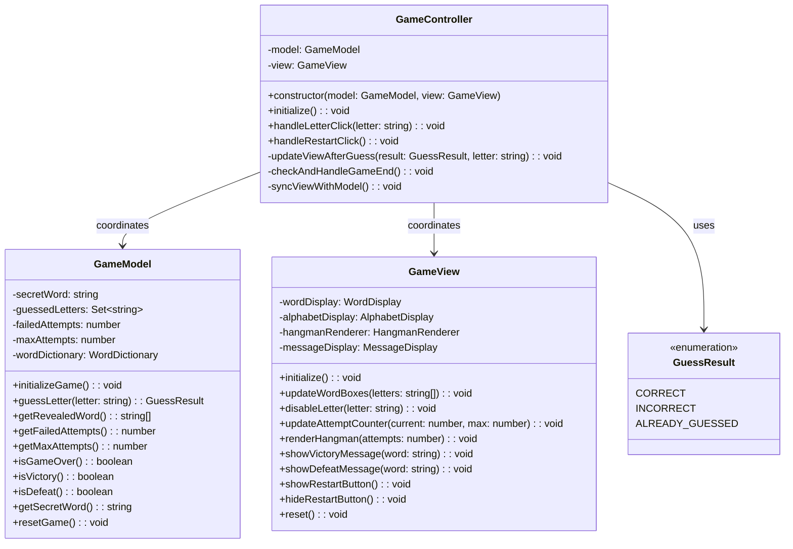
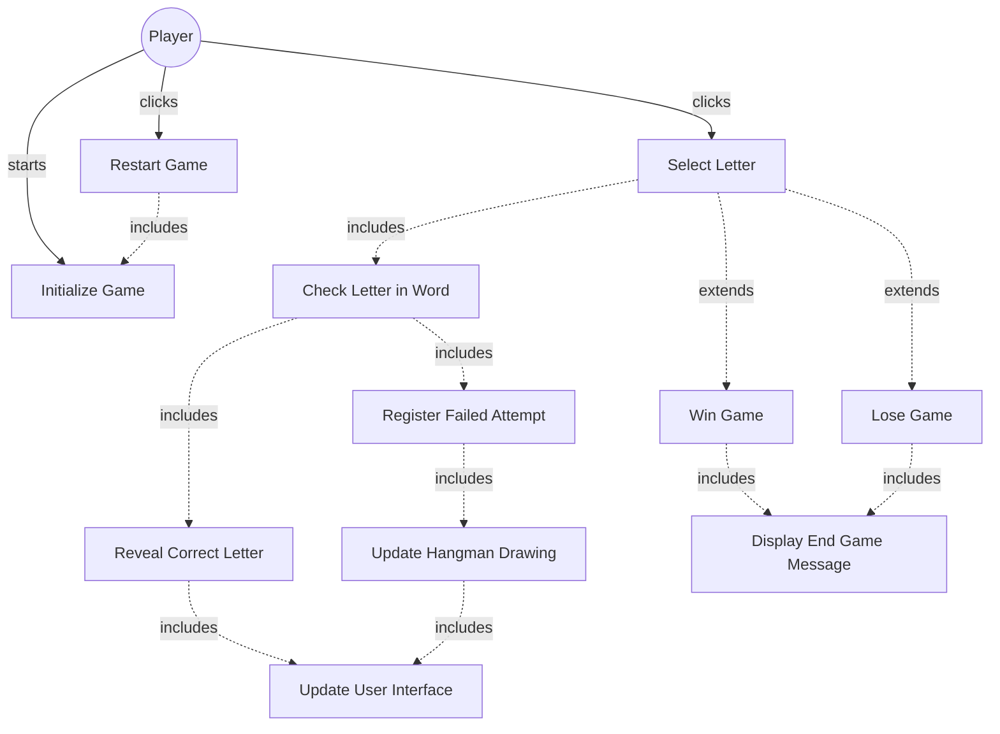

# GLOBAL CONTEXT

**Project:** The Hangman Game - Web Application

**Architecture:** MVC (Model-View-Controller) with TypeScript

**Current module:** Controller Layer - MVC Coordinator

---

# PROJECT FILE STRUCTURE

```
1-TheHangmanGame/
├── public/
│   └── favicon.ico
├── src/
│   ├── main.ts                    # Entry point
│   ├── models/
│   │   ├── guess-result.ts       # Enumeration for guess outcomes
│   │   ├── word-dictionary.ts    # Word management
│   │   └── game-model.ts         # Game logic
│   ├── views/
│   │   ├── game-view.ts          # Main view coordinator
│   │   ├── word-display.ts       # Letter boxes rendering
│   │   ├── alphabet-display.ts   # Alphabet buttons
│   │   ├── hangman-renderer.ts   # Canvas drawing
│   │   └── message-display.ts    # Messages and restart
│   ├── controllers/
│   │   └── game-controller.ts    # ← YOU ARE IMPLEMENTING THIS FILE
│   └── styles/
│       └── main.css              # Custom styles
├── tests/
│   ├── models/
│   │   ├── guess-result.test.ts
│   │   ├── word-dictionary.test.ts
│   │   └── game-model.test.ts
│   ├── views/
│   │   ├── word-display.test.ts
│   │   ├── alphabet-display.test.ts
│   │   ├── hangman-renderer.test.ts
│   │   ├── message-display.test.ts
│   │   └── game-view.test.ts
│   └── controllers/
│       └── game-controller.test.ts  # Tests for this file
├── index.html
├── package.json
├── tsconfig.json
├── vite.config.ts
├── jest.config.js
└── README.md
```

---

# INPUT ARTIFACTS

## 1. Requirements Specification

### Relevant Functional Requirements:

- **FR1:** Initialize the game displaying the word to guess in empty boxes
- **FR2:** Letter selection by the user through click - system processes whether it is correct or incorrect
- **FR3:** Reveal all occurrences of correct letters
- **FR4:** Register failed attempts and increment counter
- **FR5:** Update graphical representation of the hangman
- **FR6:** Game termination by player victory
- **FR7:** Game termination by computer victory
- **FR9:** Game restart - selects new random word and resets all states
- **FR10:** Disable already selected letters

### Relevant Non-Functional Requirements:

- **NFR2:** Modular and object-oriented code following MVC architecture
- **NFR3:** Implementation of three separate main classes - GameController (coordination between Model and View)
- **NFR5:** Unit tests with Jest with minimum 80% coverage
- **NFR6:** Complete documentation with JSDoc/TypeDoc
- **NFR7:** Code analysis with ESLint and Google style guide
- **NFR8:** Immediate response time when selecting letters - Interface updates in less than 200ms

### Architectural Context:

GameController is the **MVC Controller** that:
- Coordinates interaction between **GameModel** (business logic) and **GameView** (UI)
- Handles user events (letter clicks, restart clicks)
- Updates the view based on model state changes
- Implements the **Observer Pattern** for event handling
- Enforces game flow and rules

**MVC Responsibilities:**
- **Model (GameModel):** Game state and business logic
- **View (GameView):** UI rendering and display
- **Controller (GameController):** Event handling and coordination

---

## 2. Class Diagram



**Relationship:** `GameController` coordinates `GameModel` and `GameView`, handling user interactions and synchronizing the view with the model state.

---

## 3. Use Case Diagram



**Context:** GameController orchestrates the game flow, processing user input, updating model state, and synchronizing the view.

---

# SPECIFIC TASK

Implement the class: **`GameController`**

**File location:** `src/controllers/game-controller.ts`

---

## Responsibilities:

1. **Coordinate Model and View** (core MVC Controller responsibility)
2. **Handle user interaction events** (letter clicks, restart clicks)
3. **Process game logic** by calling Model methods
4. **Update View** based on Model state changes
5. **Manage game flow** (initialization, gameplay, game end, restart)
6. **Enforce game rules** through Model-View synchronization

---

## Properties (Private):

- **model: GameModel** - Reference to the game logic model
- **view: GameView** - Reference to the game UI view

---

## Methods to implement:

### 1. **constructor(model: GameModel, view: GameView)**
   - **Description:** Creates a new GameController instance with dependency injection of Model and View
   - **Parameters:** 
     - `model: GameModel` - The game logic model
     - `view: GameView` - The game UI view
   - **Returns:** Instance of GameController
   - **Preconditions:** 
     - Both model and view must be valid, initialized instances
   - **Postconditions:** 
     - `this.model` references the provided model
     - `this.view` references the provided view
   - **Implementation details:**
     - Store model reference: `this.model = model`
     - Store view reference: `this.view = view`
     - No initialization logic in constructor (handled by initialize method)
   - **Error handling:** None (constructor just stores references)
   - **Example usage:**
     ```typescript
     const controller = new GameController(gameModel, gameView);
     ```

### 2. **initialize(): void**
   - **Description:** Initializes the game by setting up the model, view, and event handlers
   - **Parameters:** None
   - **Returns:** `void`
   - **Preconditions:** 
     - Model and view must be set in constructor
   - **Postconditions:** 
     - Game is initialized with random word
     - View displays initial game state
     - Event handlers are attached to UI elements
     - Game is ready for player interaction
   - **Implementation details:**
     - Initialize model: `this.model.initializeGame()` (selects random word)
     - Initialize view: `this.view.initialize()` (renders initial UI)
     - Attach event handlers:
       - Alphabet click handler: `this.view.alphabetDisplay.attachClickHandler((letter) => this.handleLetterClick(letter))`
       - Restart button handler: `this.view.messageDisplay.attachRestartHandler(() => this.handleRestartClick())`
     - Synchronize view with model: `this.syncViewWithModel()` (display initial word state)
   - **Exceptions to handle:** None (child methods handle errors)
   - **Usage context:** Called once after creating controller in main.ts
   - **Flow:**
     1. Model initializes (selects word)
     2. View initializes (renders UI components)
     3. Event handlers attached
     4. View synchronized with model state

### 3. **handleLetterClick(letter: string): void**
   - **Description:** Handles a letter click event from the alphabet display
   - **Parameters:** 
     - `letter: string` - The letter that was clicked (A-Z)
   - **Returns:** `void`
   - **Preconditions:** 
     - Game must be initialized
     - Letter should be valid alphabet character
   - **Postconditions:** 
     - Letter is processed by model
     - View is updated based on guess result
     - Game end condition is checked
   - **Implementation details:**
     - Process the guess: `const result = this.model.guessLetter(letter)`
     - Update view based on result: `this.updateViewAfterGuess(result, letter)`
     - Check if game ended: `this.checkAndHandleGameEnd()`
   - **Exceptions to handle:** None (model validates input)
   - **Game flow:**
     1. Model processes guess and returns result
     2. View updated based on result
     3. Check for game end (victory/defeat)
   - **Example:**
     ```typescript
     // User clicks 'E' button
     controller.handleLetterClick('E');
     ```

### 4. **handleRestartClick(): void**
   - **Description:** Handles the restart button click event
   - **Parameters:** None
   - **Returns:** `void`
   - **Preconditions:** 
     - Game must have ended (victory or defeat)
     - Restart button must be visible
   - **Postconditions:** 
     - New game is started with new random word
     - All game state is reset
     - View displays fresh game state
   - **Implementation details:**
     - Reset model: `this.model.resetGame()` (selects new word, resets state)
     - Reset view: `this.view.reset()` (clears UI, re-enables buttons)
     - Synchronize view with model: `this.syncViewWithModel()` (show new word state)
   - **Exceptions to handle:** None
   - **Usage context:** Called when player clicks restart button after game ends
   - **Flow:**
     1. Model resets (new word, clear guesses)
     2. View resets (clear UI, enable buttons)
     3. View synchronized with new game state

### 5. **updateViewAfterGuess(result: GuessResult, letter: string): void** (private)
   - **Description:** Updates the view based on the result of a guess
   - **Parameters:** 
     - `result: GuessResult` - The result from model.guessLetter() (CORRECT, INCORRECT, or ALREADY_GUESSED)
     - `letter: string` - The letter that was guessed
   - **Returns:** `void`
   - **Preconditions:** 
     - Result must be valid GuessResult value
     - View must be initialized
   - **Postconditions:** 
     - View reflects the guess result appropriately
     - Letter button is disabled (if not already)
     - Model state is synchronized with view
   - **Implementation details:**
     - Use switch statement or if-else to handle each result type:
       - **CORRECT:**
         - Disable letter button: `this.view.disableLetter(letter)`
         - Sync view with model: `this.syncViewWithModel()` (reveals letter in word boxes, updates counter, updates hangman)
       - **INCORRECT:**
         - Disable letter button: `this.view.disableLetter(letter)`
         - Sync view with model: `this.syncViewWithModel()` (updates attempt counter, updates hangman)
       - **ALREADY_GUESSED:**
         - Do nothing (letter already disabled, no state change)
         - Optional: Show brief feedback message (not required in base version)
   - **Exceptions to handle:** None
   - **Note:** CORRECT and INCORRECT both sync view, ALREADY_GUESSED does nothing

### 6. **checkAndHandleGameEnd(): void** (private)
   - **Description:** Checks if the game has ended and handles the appropriate end state
   - **Parameters:** None
   - **Returns:** `void`
   - **Preconditions:** 
     - Model state must be up to date
   - **Postconditions:** 
     - If game ended: Victory/defeat message shown, restart button appears
     - If game continues: No action taken
   - **Implementation details:**
     - Check for victory: `if (this.model.isVictory())`
       - Show victory message: `this.view.showVictoryMessage(this.model.getSecretWord())`
       - Show restart button: `this.view.showRestartButton()`
     - Check for defeat: `else if (this.model.isDefeat())`
       - Show defeat message: `this.view.showDefeatMessage(this.model.getSecretWord())`
       - Show restart button: `this.view.showRestartButton()`
     - If neither: Game continues, no action needed
   - **Exceptions to handle:** None
   - **Usage context:** Called after every letter guess to check game status
   - **Note:** Order matters - check victory first, then defeat

### 7. **syncViewWithModel(): void** (private)
   - **Description:** Synchronizes the view with the current model state
   - **Parameters:** None
   - **Returns:** `void`
   - **Preconditions:** 
     - Model must be initialized
     - View must be initialized
   - **Postconditions:** 
     - View displays current model state accurately:
       - Word boxes show revealed letters
       - Attempt counter shows current attempts
       - Hangman drawing shows current state
   - **Implementation details:**
     - Get revealed word: `const revealedWord = this.model.getRevealedWord()`
     - Update word boxes: `this.view.updateWordBoxes(revealedWord)`
     - Get attempt counts: 
       - `const current = this.model.getFailedAttempts()`
       - `const max = this.model.getMaxAttempts()`
     - Update attempt counter: `this.view.updateAttemptCounter(current, max)`
     - Update hangman drawing: `this.view.renderHangman(current)`
   - **Exceptions to handle:** None
   - **Usage context:** Called multiple times:
     - After game initialization
     - After each correct/incorrect guess
     - After game restart
   - **Purpose:** Ensures view always reflects current model state (single source of truth)

---

## Dependencies:

- **Classes it must use:** 
  - `GameModel` - for game logic and state
  - `GameView` - for UI updates and event handling
  - `GuessResult` - enum for interpreting guess results

- **Imports required:**
  ```typescript
  import {GameModel} from '@models/game-model';
  import {GameView} from '@views/game-view';
  import {GuessResult} from '@models/guess-result';
  ```

- **Interfaces it implements:** None

- **External services it consumes:** None (all operations through Model and View)

- **Classes that depend on this:** 
  - `main.ts` - creates and initializes GameController

---

# CONSTRAINTS AND STANDARDS

## Code:

- **Language:** TypeScript 5.6.3
- **Module system:** ES6 modules (ESNext)
- **Code style:** Google TypeScript Style Guide
  - Class name: PascalCase (`GameController`)
  - Method names: camelCase
  - Private methods: use `private` keyword
  - Public methods: use `public` keyword (or omit, public is default)
- **Maximum cyclomatic complexity:** 8 (some conditional logic in private methods)
- **Maximum method length:** 30 lines (most methods are shorter)

## Mandatory best practices:

- **Application of SOLID principles:**
  - **SRP (Single Responsibility):** Only handles coordination, no business logic or UI rendering
  - **OCP (Open/Closed):** Can extend without modifying (e.g., add new event handlers)
  - **DIP (Dependency Inversion):** Depends on abstractions (Model and View interfaces conceptually)
  
- **Observer Pattern implementation:**
  - Controller observes UI events (letter clicks, restart clicks)
  - Responds to events by updating model and view
  - Event-driven architecture
  
- **MVC Pattern adherence:**
  - **No business logic in controller** (delegate to Model)
  - **No UI rendering in controller** (delegate to View)
  - **Controller only coordinates** between Model and View
  
- **Input parameter validation:**
  - Not needed - Model validates game logic, View validates UI input
  - Controller just passes data between layers
  
- **Robust exception handling:**
  - Let exceptions from Model/View propagate
  - Controller doesn't handle errors (handled by Model/View)
  
- **Logging at critical points:**
  - Optional: Console log for debugging game flow
  - Not required for production code
  
- **Comments for complex logic:**
  - Comment the event handling flow
  - Comment the synchronization logic
  - Comment the game flow in initialize()

## TypeScript-specific requirements:

- Use TypeScript type annotations for all parameters and return types
- Use proper types for Model and View
- Use `GuessResult` enum type in switch statements
- Proper access modifiers: `private` for properties and private methods, `public` (or omit) for public methods
- Import using path aliases: `@models/`, `@views/`

## Documentation requirements:

- **JSDoc comment block** for the class explaining MVC Controller role
- **JSDoc comments** for all public methods
- **JSDoc comment** for constructor
- **Optional:** JSDoc for private methods (recommended for clarity)
- Include `@category Controller` tag for TypeDoc organization
- Use proper JSDoc tags: `@param`, `@returns`, `@private`

---

# DELIVERABLES

## 1. Complete source code of the class with:

- **File header comment** with brief description and MVC pattern explanation
- **Import statements** for GameModel, GameView, GuessResult
- **Class declaration** with JSDoc documentation
- **Private properties** for model and view
- **Constructor implementation** with dependency injection
- **All public methods implemented:** `initialize()`, `handleLetterClick()`, `handleRestartClick()`
- **All private methods implemented:** `updateViewAfterGuess()`, `checkAndHandleGameEnd()`, `syncViewWithModel()`
- **Proper exports:** `export class GameController { ... }`

## 2. Inline documentation:

- **JSDoc for class:** Explain GameController's role as MVC coordinator
- **JSDoc for constructor:** Explain dependency injection of Model and View
- **JSDoc for public methods:** Parameters, return values, purpose, game flow
- **JSDoc for private methods:** Purpose, usage context
- **Comments explaining:** Event handling flow, synchronization logic, game flow
- **Category tag:** `@category Controller`

## 3. New dependencies:

- **GameModel** (already implemented) - imported from `'@models/game-model'`
- **GameView** (already implemented) - imported from `'@views/game-view'`
- **GuessResult** (already implemented) - imported from `'@models/guess-result'`
- **No external npm packages required**

## 4. Edge cases considered:

- **Multiple clicks on same letter:** Model returns ALREADY_GUESSED, view not updated
- **Game end during letter click:** checkAndHandleGameEnd() detects and handles appropriately
- **Restart before game ends:** Safe but unusual (restart can be called anytime)
- **Initialize called multiple times:** Safe (re-initializes game)
- **Event handlers attached multiple times:** Could cause issues - ensure initialize() called once
- **Model/View out of sync:** syncViewWithModel() ensures consistency
- **Null model or view:** Would cause errors - caller must provide valid instances

---

# OUTPUT FORMAT

```typescript
[Complete code here]
```

---

## Design decisions made:

- **[Decision 1 and its justification]**
- **[Decision 2 and its justification]**
- ...

---

## Possible future improvements:

- **[Improvement 1]**
- **[Improvement 2]**
- ...

---

## Testing considerations:

Unit tests should verify:

1. **Constructor stores model and view references:** Verify properties set correctly
2. **initialize() calls model.initializeGame():** Mock model, verify method called
3. **initialize() calls view.initialize():** Mock view, verify method called
4. **initialize() attaches event handlers:** Mock view components, verify handlers attached
5. **initialize() syncs view with model:** Verify syncViewWithModel() called
6. **handleLetterClick() processes guess:** Mock model.guessLetter(), verify called
7. **handleLetterClick() updates view:** Verify updateViewAfterGuess() called
8. **handleLetterClick() checks game end:** Verify checkAndHandleGameEnd() called
9. **handleRestartClick() resets model:** Mock model.resetGame(), verify called
10. **handleRestartClick() resets view:** Mock view.reset(), verify called
11. **handleRestartClick() syncs view:** Verify syncViewWithModel() called
12. **updateViewAfterGuess() handles CORRECT:** Verify letter disabled, view synced
13. **updateViewAfterGuess() handles INCORRECT:** Verify letter disabled, view synced
14. **updateViewAfterGuess() handles ALREADY_GUESSED:** Verify no action taken
15. **checkAndHandleGameEnd() handles victory:** Mock isVictory() true, verify victory message shown
16. **checkAndHandleGameEnd() handles defeat:** Mock isDefeat() true, verify defeat message shown
17. **checkAndHandleGameEnd() handles ongoing game:** Verify no messages shown
18. **syncViewWithModel() updates all view components:** Verify all view update methods called

**Jest Testing Strategy:**
```typescript
describe('GameController', () => {
  let controller: GameController;
  let mockModel: jest.Mocked<GameModel>;
  let mockView: jest.Mocked<GameView>;

  beforeEach(() => {
    mockModel = {
      initializeGame: jest.fn(),
      guessLetter: jest.fn(),
      getRevealedWord: jest.fn().mockReturnValue(['E', '', '', '', '', '', '', '']),
      getFailedAttempts: jest.fn().mockReturnValue(0),
      getMaxAttempts: jest.fn().mockReturnValue(6),
      isVictory: jest.fn().mockReturnValue(false),
      isDefeat: jest.fn().mockReturnValue(false),
      getSecretWord: jest.fn().mockReturnValue('ELEPHANT'),
      resetGame: jest.fn(),
    } as any;

    mockView = {
      initialize: jest.fn(),
      updateWordBoxes: jest.fn(),
      disableLetter: jest.fn(),
      updateAttemptCounter: jest.fn(),
      renderHangman: jest.fn(),
      showVictoryMessage: jest.fn(),
      showDefeatMessage: jest.fn(),
      showRestartButton: jest.fn(),
      reset: jest.fn(),
      alphabetDisplay: {
        attachClickHandler: jest.fn(),
      },
      messageDisplay: {
        attachRestartHandler: jest.fn(),
      },
    } as any;

    controller = new GameController(mockModel, mockView);
  });

  test('should initialize game correctly', () => {
    controller.initialize();
    expect(mockModel.initializeGame).toHaveBeenCalled();
    expect(mockView.initialize).toHaveBeenCalled();
  });

  test('should handle letter click correctly', () => {
    mockModel.guessLetter.mockReturnValue(GuessResult.CORRECT);
    controller.initialize();
    controller.handleLetterClick('E');
    expect(mockModel.guessLetter).toHaveBeenCalledWith('E');
    expect(mockView.disableLetter).toHaveBeenCalledWith('E');
  });
});
```

---

## MVC Pattern Flow Diagram:

```
User Interaction (Click Letter 'E')
         │
         ↓
    [GameView]
    AlphabetDisplay fires click event
         │
         ↓
  [GameController]
  handleLetterClick('E')
         │
         ├──→ [GameModel]
         │    guessLetter('E')
         │    Returns: GuessResult.CORRECT
         │
         ├──→ updateViewAfterGuess()
         │    │
         │    └──→ [GameView]
         │         disableLetter('E')
         │         syncViewWithModel()
         │
         └──→ checkAndHandleGameEnd()
              │
              └──→ [GameModel]
                   isVictory() / isDefeat()
                   │
                   └──→ [GameView]
                        showVictoryMessage() or continue
```

---

## Critical Notes:

1. **Controller has NO business logic** - All game rules in GameModel
2. **Controller has NO rendering logic** - All UI updates through GameView
3. **Controller is the GLUE** between Model and View
4. **Single Source of Truth** - Model holds game state, View displays it
5. **Event-Driven** - Controller responds to user events
6. **Synchronization** - Controller keeps View in sync with Model

---

**Note:** This is the final piece that brings the entire MVC architecture together. Ensure proper coordination between Model and View with clear separation of concerns.
