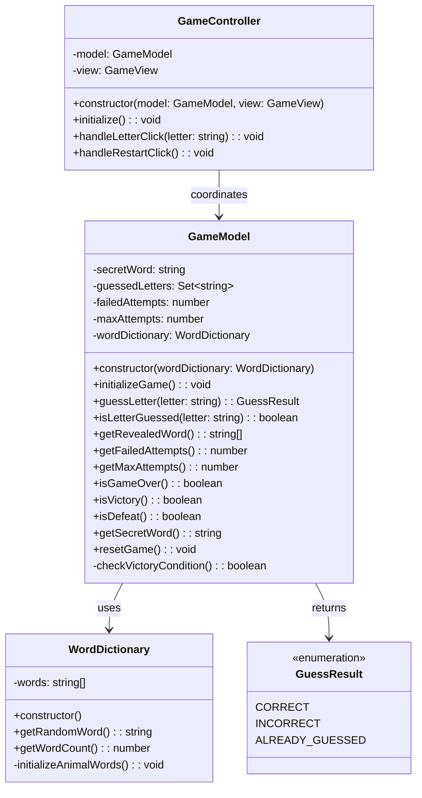
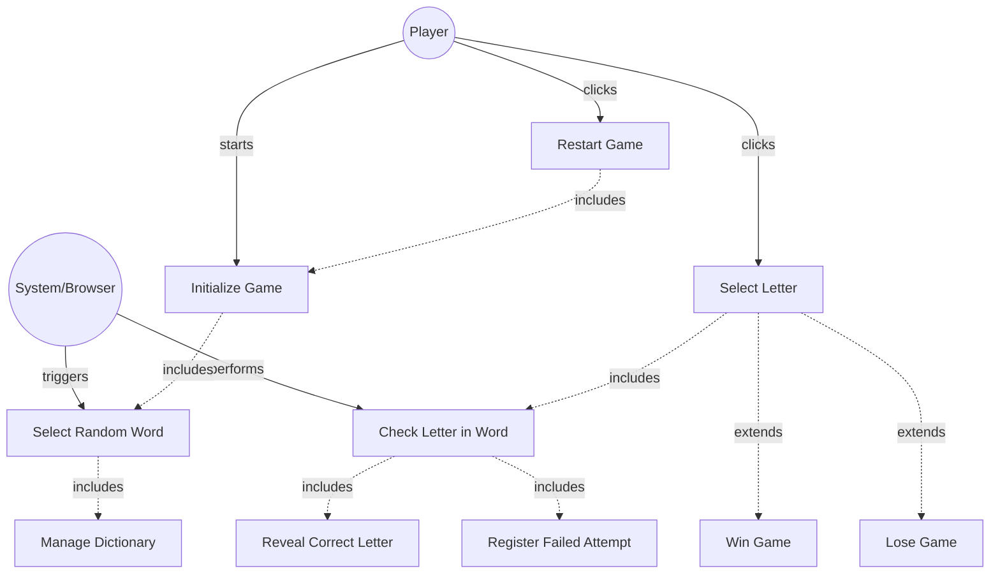

# GLOBAL CONTEXT

**Project:** The Hangman Game - Web Application

**Architecture:** MVC (Model-View-Controller) with TypeScript

**Current module:** Model Layer - Business Logic

---

# PROJECT FILE STRUCTURE

```
1-TheHangmanGame/
├── public/
│   └── favicon.ico
├── src/
│   ├── main.ts                    # Entry point
│   ├── models/
│   │   ├── guess-result.ts       # Enumeration for guess outcomes
│   │   ├── word-dictionary.ts    # Word management
│   │   └── game-model.ts         # ← YOU ARE IMPLEMENTING THIS FILE
│   ├── views/
│   │   ├── game-view.ts          # Main view coordinator
│   │   ├── word-display.ts       # Letter boxes rendering
│   │   ├── alphabet-display.ts   # Alphabet buttons
│   │   ├── hangman-renderer.ts   # Canvas drawing
│   │   └── message-display.ts    # Messages and restart
│   ├── controllers/
│   │   └── game-controller.ts    # Event coordination
│   └── styles/
│       └── main.css              # Custom styles
├── tests/
│   ├── models/
│   │   ├── guess-result.test.ts
│   │   ├── word-dictionary.test.ts
│   │   └── game-model.test.ts    # Tests for this file
│   ├── views/
│   │   ├── word-display.test.ts
│   │   ├── alphabet-display.test.ts
│   │   ├── hangman-renderer.test.ts
│   │   └── message-display.test.ts
│   └── controllers/
│       └── game-controller.test.ts
├── index.html
├── package.json
├── tsconfig.json
├── vite.config.ts
├── jest.config.js
└── README.md
```

---

# INPUT ARTIFACTS

## 1. Requirements Specification

### Relevant Functional Requirements:

- **FR1:** Initialize the game displaying the word to guess in empty boxes
- **FR2:** Letter selection by the user through click - system processes whether it is correct or incorrect
- **FR3:** Reveal all occurrences of correct letters
- **FR4:** Register failed attempts and increment counter - Each incorrect letter increments the failed attempts counter (maximum 6)
- **FR6:** Game termination by player victory - If the player guesses all letters before reaching 6 failed attempts
- **FR7:** Game termination by computer victory - If 6 failed attempts are completed without guessing the word
- **FR8:** Management of animal word dictionary - System randomly selects one when starting or restarting
- **FR9:** Game restart - Select new random word and reset all states (attempts, selected letters, drawing)
- **FR10:** Disable already selected letters - Once selected, cannot be selected again

### Relevant Non-Functional Requirements:

- **NFR2:** Modular and object-oriented code following MVC architecture
- **NFR3:** Implementation of three separate main classes - GameModel (data and business logic)
- **NFR5:** Unit tests with Jest with minimum 80% coverage
- **NFR6:** Complete documentation with JSDoc/TypeDoc
- **NFR7:** Code analysis with ESLint and Google style guide

### Game Rules:

- **Secret word:** Randomly selected from animal dictionary
- **Maximum attempts:** 6 failed guesses before game over
- **Letter validation:** Check if letter exists in word, track guessed letters
- **Victory condition:** All letters in the word have been guessed
- **Defeat condition:** 6 incorrect guesses reached
- **State management:** Track secret word, guessed letters, failed attempts

---

## 2. Class Diagram



**Relationship:** `GameModel` is the core business logic class that uses `WordDictionary` for word selection and returns `GuessResult` values. It is coordinated by `GameController`.

---

## 3. Use Case Diagram



**Context:** GameModel encapsulates all the business logic for checking letters, tracking state, and determining game outcomes.

---

# SPECIFIC TASK

Implement the class: **`GameModel`**

**File location:** `src/models/game-model.ts`

---

## Responsibilities:

1. **Manage game state:** secret word, guessed letters, failed attempts
2. **Process letter guesses:** validate and return appropriate GuessResult
3. **Track game progress:** determine victory/defeat conditions
4. **Provide game data:** expose current state to Controller/View
5. **Handle game lifecycle:** initialize and reset game state

---

## Properties (Private):

- **secretWord: string** - The current secret word to be guessed (UPPERCASE)
- **guessedLetters: Set<string>** - Collection of all letters guessed so far (both correct and incorrect)
- **failedAttempts: number** - Count of incorrect guesses (0-6)
- **maxAttempts: number** (readonly) - Maximum allowed failed attempts (always 6)
- **wordDictionary: WordDictionary** - Reference to word dictionary for getting random words

---

## Methods to implement:

### 1. **constructor(wordDictionary: WordDictionary)**
   - **Description:** Creates a new GameModel instance with dependency injection of WordDictionary
   - **Parameters:** 
     - `wordDictionary: WordDictionary` - The dictionary to use for word selection
   - **Returns:** Instance of GameModel
   - **Preconditions:** 
     - wordDictionary must be a valid WordDictionary instance
   - **Postconditions:** 
     - `this.wordDictionary` is set to the provided dictionary
     - `this.secretWord` is initialized to empty string (will be set by initializeGame)
     - `this.guessedLetters` is initialized as empty Set
     - `this.failedAttempts` is initialized to 0
     - `this.maxAttempts` is set to 6
   - **Implementation details:**
     - Store wordDictionary reference
     - Initialize all properties with default values
     - Note: Actual game initialization happens in `initializeGame()`
   - **Exceptions to handle:** None (constructor should always succeed)

### 2. **initializeGame(): void**
   - **Description:** Initializes a new game by selecting a random word and resetting all state
   - **Parameters:** None
   - **Returns:** `void`
   - **Preconditions:** 
     - WordDictionary must be available
   - **Postconditions:** 
     - `secretWord` is set to a new random word from dictionary (UPPERCASE)
     - `guessedLetters` is cleared (empty Set)
     - `failedAttempts` is reset to 0
   - **Implementation details:**
     - Call `this.wordDictionary.getRandomWord()` to get new word
     - Clear the guessed letters Set
     - Reset failed attempts counter
   - **Exceptions to handle:** None (WordDictionary.getRandomWord() should always return valid word)

### 3. **guessLetter(letter: string): GuessResult**
   - **Description:** Processes a letter guess and updates game state accordingly
   - **Parameters:** 
     - `letter: string` - The letter being guessed (should be single character, A-Z)
   - **Returns:** `GuessResult` - CORRECT, INCORRECT, or ALREADY_GUESSED
   - **Preconditions:** 
     - Game has been initialized (secretWord is not empty)
     - Letter should be a single character A-Z (normalize to uppercase internally)
   - **Postconditions:**
     - If ALREADY_GUESSED: No state change
     - If CORRECT: Letter added to guessedLetters Set
     - If INCORRECT: Letter added to guessedLetters Set, failedAttempts incremented
   - **Implementation details:**
     - Normalize letter to uppercase: `letter = letter.toUpperCase()`
     - Check if letter is already in guessedLetters Set
       - If yes: return `GuessResult.ALREADY_GUESSED`
     - Add letter to guessedLetters Set
     - Check if letter exists in secretWord
       - If yes: return `GuessResult.CORRECT`
       - If no: increment failedAttempts, return `GuessResult.INCORRECT`
   - **Exceptions to handle:** 
     - Optional: Validate letter is single character and alphabetic
     - Optional: Throw error if game not initialized

### 4. **isLetterGuessed(letter: string): boolean**
   - **Description:** Checks if a specific letter has already been guessed
   - **Parameters:** 
     - `letter: string` - The letter to check
   - **Returns:** `boolean` - true if letter has been guessed, false otherwise
   - **Preconditions:** None
   - **Postconditions:** No state change
   - **Implementation details:**
     - Normalize letter to uppercase
     - Check if letter exists in guessedLetters Set using `has()` method
     - Return boolean result
   - **Exceptions to handle:** None

### 5. **getRevealedWord(): string[]**
   - **Description:** Returns an array representing the current state of the word with revealed letters
   - **Parameters:** None
   - **Returns:** `string[]` - Array where each element is either the letter (if guessed) or empty string
   - **Preconditions:** 
     - Game has been initialized (secretWord is not empty)
   - **Postconditions:** No state change
   - **Implementation details:**
     - Create array with same length as secretWord
     - For each character in secretWord:
       - If character is in guessedLetters: add character to array
       - If not guessed: add empty string to array
     - Return the array
   - **Example:**
     - secretWord = "ELEPHANT"
     - guessedLetters = {E, L, A}
     - Returns: ["E", "L", "E", "", "", "A", "", ""]
   - **Exceptions to handle:** None

### 6. **getFailedAttempts(): number**
   - **Description:** Gets the current number of failed attempts
   - **Parameters:** None
   - **Returns:** `number` - Current count of incorrect guesses (0-6)
   - **Preconditions:** None
   - **Postconditions:** No state change
   - **Implementation details:** Simple getter, return `this.failedAttempts`
   - **Exceptions to handle:** None

### 7. **getMaxAttempts(): number**
   - **Description:** Gets the maximum allowed number of failed attempts
   - **Parameters:** None
   - **Returns:** `number` - Maximum attempts (always 6)
   - **Preconditions:** None
   - **Postconditions:** No state change
   - **Implementation details:** Simple getter, return `this.maxAttempts`
   - **Exceptions to handle:** None

### 8. **isGameOver(): boolean**
   - **Description:** Checks if the game has ended (either victory or defeat)
   - **Parameters:** None
   - **Returns:** `boolean` - true if game is over, false otherwise
   - **Preconditions:** None
   - **Postconditions:** No state change
   - **Implementation details:** 
     - Return `this.isVictory() || this.isDefeat()`
   - **Exceptions to handle:** None

### 9. **isVictory(): boolean**
   - **Description:** Checks if the player has won the game (all letters guessed)
   - **Parameters:** None
   - **Returns:** `boolean` - true if all letters have been correctly guessed
   - **Preconditions:** 
     - Game has been initialized
   - **Postconditions:** No state change
   - **Implementation details:** 
     - Call `checkVictoryCondition()` and return result
   - **Exceptions to handle:** None

### 10. **isDefeat(): boolean**
   - **Description:** Checks if the player has lost the game (max attempts reached)
   - **Parameters:** None
   - **Returns:** `boolean` - true if failedAttempts >= maxAttempts
   - **Preconditions:** None
   - **Postconditions:** No state change
   - **Implementation details:** 
     - Return `this.failedAttempts >= this.maxAttempts`
   - **Exceptions to handle:** None

### 11. **getSecretWord(): string**
   - **Description:** Reveals the secret word (used when game ends)
   - **Parameters:** None
   - **Returns:** `string` - The complete secret word
   - **Preconditions:** None (but typically called only when game is over)
   - **Postconditions:** No state change
   - **Implementation details:** Simple getter, return `this.secretWord`
   - **Exceptions to handle:** None

### 12. **resetGame(): void**
   - **Description:** Resets the game state for a new game
   - **Parameters:** None
   - **Returns:** `void`
   - **Preconditions:** None
   - **Postconditions:** 
     - New random word selected
     - All state reset (same as initializeGame)
   - **Implementation details:** 
     - Call `this.initializeGame()` to reset everything
   - **Exceptions to handle:** None

### 13. **checkVictoryCondition(): boolean** (private)
   - **Description:** Checks if the player has successfully guessed all letters in the secret word
   - **Parameters:** None
   - **Returns:** `boolean` - true if all unique letters in secretWord are in guessedLetters
   - **Preconditions:** 
     - Game has been initialized
   - **Postconditions:** No state change
   - **Implementation details:** 
     - Get all unique letters from secretWord (convert to Set or array)
     - Check if every unique letter exists in guessedLetters Set
     - Return true only if all letters have been guessed
   - **Alternative approach:**
     - Loop through each character in secretWord
     - If any character is not in guessedLetters, return false
     - If all characters are found, return true
   - **Exceptions to handle:** None

---

## Dependencies:

- **Classes it must use:** 
  - `WordDictionary` - for getting random words
  - `GuessResult` - enum for return values

- **Imports required:**
  ```typescript
  import {GuessResult} from './guess-result';
  import {WordDictionary} from './word-dictionary';
  ```

- **Interfaces it implements:** None

- **External services it consumes:** None

- **Classes that depend on this:** 
  - `GameController` - coordinates GameModel and updates view based on model state

---

# CONSTRAINTS AND STANDARDS

## Code:

- **Language:** TypeScript 5.6.3
- **Module system:** ES6 modules (ESNext)
- **Code style:** Google TypeScript Style Guide
  - Class name: PascalCase (`GameModel`)
  - Method names: camelCase
  - Private properties/methods: use `private` keyword
  - Constants: `readonly` for maxAttempts
- **Maximum cyclomatic complexity:** 10 (some methods have conditional logic)
- **Maximum method length:** 50 lines (most methods should be much shorter)

## Mandatory best practices:

- **Application of SOLID principles:**
  - **SRP (Single Responsibility):** GameModel only handles game logic, no UI concerns
  - **DIP (Dependency Inversion):** WordDictionary injected via constructor (dependency injection)
  - **OCP (Open/Closed):** Can be extended without modifying existing code
  
- **Input parameter validation:**
  - Normalize letter input to uppercase in `guessLetter()` and `isLetterGuessed()`
  - Optional: Validate letter is single alphabetic character
  
- **Robust exception handling:**
  - Methods should handle edge cases gracefully
  - Optional: Throw errors for invalid state (e.g., game not initialized)
  
- **Logging at critical points:**
  - Optional: Console log for debugging during development
  - Not required in production code
  
- **Comments for complex logic:**
  - Comment the victory condition check algorithm
  - Comment the revealed word generation logic
  - Explain the Set usage for guessed letters

## TypeScript-specific requirements:

- Use TypeScript type annotations for all parameters and return types
- Use `Set<string>` for guessedLetters (efficient lookup)
- Use `readonly` for maxAttempts
- Use proper access modifiers: `public`, `private`
- Import types/classes from other modules

## Documentation requirements:

- **JSDoc comment block** for the class
- **JSDoc comments** for all public methods
- **JSDoc comment** for constructor
- **Optional:** JSDoc for private method `checkVictoryCondition()`
- Include `@category Model` tag for TypeDoc organization
- Use proper JSDoc tags: `@param`, `@returns`, `@throws` (if applicable), `@private`

## Security:

- **Input sanitization:** Normalize letter input to uppercase
- **No injection vulnerabilities:** All data is internal, no external input beyond single letters
- **State integrity:** Ensure state cannot be corrupted by invalid operations

---

# DELIVERABLES

## 1. Complete source code of the class with:

- **File header comment** with brief description
- **Import statements** for GuessResult and WordDictionary
- **Class declaration** with JSDoc documentation
- **Private properties** with type annotations
- **Constructor implementation** with dependency injection
- **All public methods implemented** (10 public methods)
- **Private method implemented:** `checkVictoryCondition()`
- **Proper exports:** `export class GameModel { ... }`

## 2. Inline documentation:

- **JSDoc for class:** Explain GameModel's purpose as core game logic
- **JSDoc for constructor:** Explain dependency injection
- **JSDoc for each public method:** Parameters, return values, purpose
- **Inline comments:** Explain victory condition algorithm, revealed word logic
- **Category tag:** `@category Model`

## 3. New dependencies:

- **GuessResult** (already implemented) - imported from `'./guess-result'`
- **WordDictionary** (already implemented) - imported from `'./word-dictionary'`
- **No external npm packages required** - uses only TypeScript/JavaScript built-ins

## 4. Edge cases considered:

- **Empty secret word:** Should not occur if WordDictionary works correctly
- **Case sensitivity:** All letters normalized to uppercase
- **Duplicate guesses:** Handled by ALREADY_GUESSED result
- **Invalid letters:** Optional validation (numbers, special characters)
- **Victory with failed attempts:** Player can win even after some incorrect guesses
- **All letters guessed but game continues:** Game should end immediately upon victory
- **Checking game over before letter guess:** isGameOver() should be checked by controller

---

# OUTPUT FORMAT

```typescript
[Complete code here]
```

---

## Design decisions made:

- **[Decision 1 and its justification]**
- **[Decision 2 and its justification]**
- ...

---

## Possible future improvements:

- **[Improvement 1]**
- **[Improvement 2]**
- ...

---

## Testing considerations:

Unit tests should verify:

1. **Constructor initializes correctly:** All properties have correct initial values
2. **initializeGame sets random word:** secretWord is not empty, state is reset
3. **guessLetter returns CORRECT:** Letter exists in word
4. **guessLetter returns INCORRECT:** Letter not in word, failedAttempts increments
5. **guessLetter returns ALREADY_GUESSED:** Same letter guessed twice
6. **isLetterGuessed works correctly:** Returns true for guessed, false for not guessed
7. **getRevealedWord shows correct state:** Guessed letters visible, others hidden
8. **isVictory detects win:** All letters guessed returns true
9. **isDefeat detects loss:** 6 failed attempts returns true
10. **isGameOver detects end:** Victory or defeat returns true
11. **resetGame starts fresh:** New word, reset state
12. **Case insensitivity:** Lowercase and uppercase letters treated the same

---

**Note:** This is the most complex class in the Model layer, containing all core game logic. Implement carefully with thorough testing.
