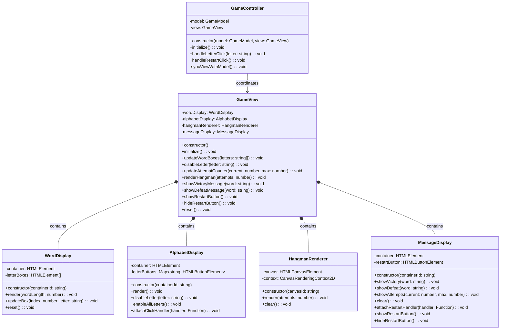
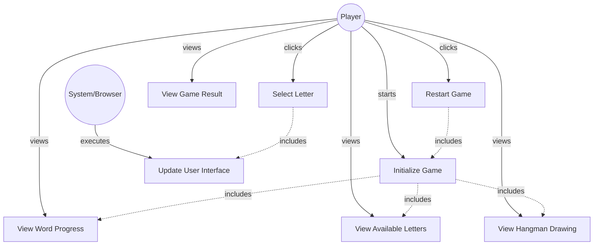

# GLOBAL CONTEXT

**Project:** The Hangman Game - Web Application

**Architecture:** MVC (Model-View-Controller) with TypeScript

**Current module:** View Layer - Composite View Coordinator

---

# PROJECT FILE STRUCTURE

```
1-TheHangmanGame/
├── public/
│   └── favicon.ico
├── src/
│   ├── main.ts                    # Entry point
│   ├── models/
│   │   ├── guess-result.ts       # Enumeration for guess outcomes
│   │   ├── word-dictionary.ts    # Word management
│   │   └── game-model.ts         # Game logic
│   ├── views/
│   │   ├── game-view.ts          # ← YOU ARE IMPLEMENTING THIS FILE
│   │   ├── word-display.ts       # Letter boxes rendering
│   │   ├── alphabet-display.ts   # Alphabet buttons
│   │   ├── hangman-renderer.ts   # Canvas drawing
│   │   └── message-display.ts    # Messages and restart
│   ├── controllers/
│   │   └── game-controller.ts    # Event coordination
│   └── styles/
│       └── main.css              # Custom styles
├── tests/
│   ├── models/
│   │   ├── guess-result.test.ts
│   │   ├── word-dictionary.test.ts
│   │   └── game-model.test.ts
│   ├── views/
│   │   ├── word-display.test.ts
│   │   ├── alphabet-display.test.ts
│   │   ├── hangman-renderer.test.ts
│   │   ├── message-display.test.ts
│   │   └── game-view.test.ts     # Tests for this file
│   └── controllers/
│       └── game-controller.test.ts
├── index.html
├── package.json
├── tsconfig.json
├── vite.config.ts
├── jest.config.js
└── README.md
```

---

# INPUT ARTIFACTS

## 1. Requirements Specification

### Relevant Functional Requirements:

- **FR1:** Initialize the game displaying the word to guess in empty boxes
- **FR2:** Letter selection by the user through click
- **FR3:** Reveal all occurrences of correct letters
- **FR4:** Register failed attempts and increment counter
- **FR5:** Update graphical representation of the hangman
- **FR6:** Game termination by player victory
- **FR7:** Game termination by computer victory
- **FR9:** Game restart - resets all states
- **FR10:** Disable already selected letters

### Relevant Non-Functional Requirements:

- **NFR2:** Modular and object-oriented code following MVC architecture
- **NFR3:** Implementation of three separate main classes - GameView (user interface and rendering)
- **NFR4:** Use of Bulma for interface styling
- **NFR5:** Unit tests with Jest with minimum 80% coverage
- **NFR6:** Complete documentation with JSDoc/TypeDoc
- **NFR7:** Code analysis with ESLint and Google style guide
- **NFR8:** Immediate response time when selecting letters - Interface updates in less than 200ms

### Architectural Context:

GameView is the **Composite Pattern** implementation that orchestrates all UI components:
- **WordDisplay** - manages letter boxes
- **AlphabetDisplay** - manages alphabet buttons
- **HangmanRenderer** - manages canvas drawing
- **MessageDisplay** - manages messages and restart button

GameView provides a **unified interface** to the Controller, abstracting away the complexity of managing multiple view components.

---

## 2. Class Diagram



**Relationship:** `GameView` implements the **Composite Pattern**, composing all view components and providing a unified interface to `GameController`. It delegates operations to the appropriate child components.

---

## 3. Use Case Diagram



**Context:** GameView orchestrates all UI updates, ensuring all components stay synchronized with the game state.

---

# SPECIFIC TASK

Implement the class: **`GameView`**

**File location:** `src/views/game-view.ts`

---

## Responsibilities:

1. **Compose and manage all view components** (Composite Pattern)
2. **Provide unified interface** to the Controller for all UI operations
3. **Initialize all view components** on game start
4. **Coordinate updates** across multiple components
5. **Delegate operations** to appropriate child components
6. **Reset all components** when starting a new game

---

## Properties (Private):

- **wordDisplay: WordDisplay** - Component for displaying word letter boxes
- **alphabetDisplay: AlphabetDisplay** - Component for displaying alphabet buttons
- **hangmanRenderer: HangmanRenderer** - Component for canvas drawing
- **messageDisplay: MessageDisplay** - Component for messages and restart button

---

## Methods to implement:

### 1. **constructor()**
   - **Description:** Creates a new GameView instance and initializes all child view components
   - **Parameters:** None
   - **Returns:** Instance of GameView
   - **Preconditions:** 
     - All required DOM elements must exist in the HTML (word-container, alphabet-container, hangman-canvas, message-container)
   - **Postconditions:** 
     - All four child components are instantiated and stored
     - Child components have references to their DOM elements
   - **Implementation details:**
     - Create WordDisplay: `this.wordDisplay = new WordDisplay('word-container')`
     - Create AlphabetDisplay: `this.alphabetDisplay = new AlphabetDisplay('alphabet-container')`
     - Create HangmanRenderer: `this.hangmanRenderer = new HangmanRenderer('hangman-canvas')`
     - Create MessageDisplay: `this.messageDisplay = new MessageDisplay('message-container')`
   - **Error handling:**
     - If any child constructor throws error (container not found), let it propagate
     - Controller should handle initialization errors
   - **Example usage:**
     ```typescript
     const gameView = new GameView();
     ```

### 2. **initialize(): void**
   - **Description:** Initializes all view components for a new game
   - **Parameters:** None
   - **Returns:** `void`
   - **Preconditions:** 
     - All child components must be instantiated
   - **Postconditions:** 
     - Alphabet is rendered (26 buttons visible)
     - Canvas shows initial gallows (0 attempts)
     - Message shows initial attempt counter "Attempts: 0/6"
     - Word display is ready (but not yet rendered - waits for word length)
     - Restart button is hidden
   - **Implementation details:**
     - Render alphabet: `this.alphabetDisplay.render()`
     - Render initial hangman state: `this.hangmanRenderer.render(0)`
     - Show initial attempt counter: `this.messageDisplay.showAttempts(0, 6)`
     - Hide restart button: `this.messageDisplay.hideRestartButton()`
     - Note: Word display will be initialized when updateWordBoxes is first called
   - **Exceptions to handle:** None (child methods handle their own errors)
   - **Usage context:** Called by Controller after creating GameView

### 3. **updateWordBoxes(letters: string[]): void**
   - **Description:** Updates the word display with current letter states
   - **Parameters:** 
     - `letters: string[]` - Array of letters where each element is either the letter (if guessed) or empty string (if not guessed)
   - **Returns:** `void`
   - **Preconditions:** 
     - Letters array must match the word length
     - WordDisplay component must be initialized
   - **Postconditions:** 
     - Word boxes are rendered if not already
     - Revealed letters are displayed in their corresponding boxes
     - Empty boxes remain for unrevealed letters
   - **Implementation details:**
     - Check if word display needs initial rendering (first call)
     - If first call: `this.wordDisplay.render(letters.length)`
     - Loop through letters array:
       - For each non-empty letter: `this.wordDisplay.updateBox(index, letter)`
     - Alternative approach:
       - Always render first: `this.wordDisplay.render(letters.length)`
       - Then update all boxes with letters
   - **Exceptions to handle:** None
   - **Example:**
     ```typescript
     // Word is "ELEPHANT", user has guessed E, L, A
     gameView.updateWordBoxes(['E', 'L', 'E', '', '', 'A', '', '']);
     ```

### 4. **disableLetter(letter: string): void**
   - **Description:** Disables a specific letter button in the alphabet display
   - **Parameters:** 
     - `letter: string` - The letter to disable (A-Z, case-insensitive)
   - **Returns:** `void`
   - **Preconditions:** 
     - Alphabet must be rendered
     - Letter should be valid alphabet character
   - **Postconditions:** 
     - The specified letter button is disabled (not clickable)
     - Button shows disabled styling
   - **Implementation details:**
     - Delegate to AlphabetDisplay: `this.alphabetDisplay.disableLetter(letter)`
   - **Exceptions to handle:** None (AlphabetDisplay handles validation)
   - **Example:**
     ```typescript
     gameView.disableLetter('E'); // Disables 'E' button
     ```

### 5. **updateAttemptCounter(current: number, max: number): void**
   - **Description:** Updates the attempt counter display
   - **Parameters:** 
     - `current: number` - Current number of failed attempts (0-6)
     - `max: number` - Maximum allowed failed attempts (6)
   - **Returns:** `void`
   - **Preconditions:** 
     - MessageDisplay must be initialized
   - **Postconditions:** 
     - Message container shows updated attempt count
   - **Implementation details:**
     - Delegate to MessageDisplay: `this.messageDisplay.showAttempts(current, max)`
   - **Exceptions to handle:** None
   - **Example:**
     ```typescript
     gameView.updateAttemptCounter(3, 6); // Shows "Attempts: 3/6"
     ```

### 6. **renderHangman(attempts: number): void**
   - **Description:** Renders the hangman drawing for the given attempt count
   - **Parameters:** 
     - `attempts: number` - Number of failed attempts (0-6)
   - **Returns:** `void`
   - **Preconditions:** 
     - Canvas must be initialized
     - Attempts should be between 0-6
   - **Postconditions:** 
     - Canvas shows hangman state corresponding to attempt count
   - **Implementation details:**
     - Delegate to HangmanRenderer: `this.hangmanRenderer.render(attempts)`
   - **Exceptions to handle:** None (HangmanRenderer handles validation)
   - **Example:**
     ```typescript
     gameView.renderHangman(4); // Shows gallows + head + body + both arms
     ```

### 7. **showVictoryMessage(word: string): void**
   - **Description:** Displays a victory message with the secret word
   - **Parameters:** 
     - `word: string` - The word that was guessed (uppercase)
   - **Returns:** `void`
   - **Preconditions:** 
     - Game has ended in victory
     - MessageDisplay must be initialized
   - **Postconditions:** 
     - Message container shows victory message
     - Victory styling applied (green, bold)
   - **Implementation details:**
     - Delegate to MessageDisplay: `this.messageDisplay.showVictory(word)`
   - **Exceptions to handle:** None
   - **Example:**
     ```typescript
     gameView.showVictoryMessage('ELEPHANT');
     ```

### 8. **showDefeatMessage(word: string): void**
   - **Description:** Displays a defeat message with the secret word
   - **Parameters:** 
     - `word: string` - The word that was not guessed (uppercase)
   - **Returns:** `void`
   - **Preconditions:** 
     - Game has ended in defeat
     - MessageDisplay must be initialized
   - **Postconditions:** 
     - Message container shows defeat message
     - Defeat styling applied (red, bold)
   - **Implementation details:**
     - Delegate to MessageDisplay: `this.messageDisplay.showDefeat(word)`
   - **Exceptions to handle:** None
   - **Example:**
     ```typescript
     gameView.showDefeatMessage('RHINOCEROS');
     ```

### 9. **showRestartButton(): void**
   - **Description:** Shows the restart button
   - **Parameters:** None
   - **Returns:** `void`
   - **Preconditions:** 
     - Game has ended (victory or defeat)
   - **Postconditions:** 
     - Restart button is visible and clickable
   - **Implementation details:**
     - Delegate to MessageDisplay: `this.messageDisplay.showRestartButton()`
   - **Exceptions to handle:** None
   - **Usage context:** Called by Controller when game ends

### 10. **hideRestartButton(): void**
   - **Description:** Hides the restart button
   - **Parameters:** None
   - **Returns:** `void`
   - **Preconditions:** None
   - **Postconditions:** 
     - Restart button is not visible
   - **Implementation details:**
     - Delegate to MessageDisplay: `this.messageDisplay.hideRestartButton()`
   - **Exceptions to handle:** None
   - **Usage context:** Called when starting new game

### 11. **reset(): void**
   - **Description:** Resets all view components to initial state
   - **Parameters:** None
   - **Returns:** `void`
   - **Preconditions:** None
   - **Postconditions:** 
     - Word display is cleared
     - All alphabet buttons are re-enabled
     - Canvas shows only gallows (0 attempts)
     - Message shows initial attempt counter
     - Restart button is hidden
   - **Implementation details:**
     - Reset word display: `this.wordDisplay.reset()`
     - Enable all letters: `this.alphabetDisplay.enableAllLetters()`
     - Clear and render initial hangman: 
       - `this.hangmanRenderer.clear()`
       - `this.hangmanRenderer.render(0)`
     - Show initial attempt counter: `this.messageDisplay.showAttempts(0, 6)`
     - Hide restart button: `this.messageDisplay.hideRestartButton()`
   - **Exceptions to handle:** None
   - **Usage context:** Called by Controller when restarting game
   - **Note:** After reset, updateWordBoxes will be called with new word

---

## Dependencies:

- **Classes it must use:** 
  - `WordDisplay` - for word box management
  - `AlphabetDisplay` - for alphabet button management
  - `HangmanRenderer` - for canvas drawing
  - `MessageDisplay` - for messages and restart button

- **Imports required:**
  ```typescript
  import {WordDisplay} from './word-display';
  import {AlphabetDisplay} from './alphabet-display';
  import {HangmanRenderer} from './hangman-renderer';
  import {MessageDisplay} from './message-display';
  ```

- **Interfaces it implements:** None

- **External services it consumes:** None (all operations delegated to child components)

- **Classes that depend on this:** 
  - `GameController` - uses GameView as unified interface to all UI

---

# CONSTRAINTS AND STANDARDS

## Code:

- **Language:** TypeScript 5.6.3
- **Module system:** ES6 modules (ESNext)
- **Code style:** Google TypeScript Style Guide
  - Class name: PascalCase (`GameView`)
  - Method names: camelCase
  - Private properties: use `private` keyword
  - No private methods in this class (all methods public)
- **Maximum cyclomatic complexity:** 5 (methods are mostly delegations)
- **Maximum method length:** 25 lines (most methods are much shorter)

## Mandatory best practices:

- **Application of SOLID principles:**
  - **SRP (Single Responsibility):** Coordinates view components, doesn't implement UI logic itself
  - **OCP (Open/Closed):** Can add new view components without modifying existing code
  - **LSP (Liskov Substitution):** Not directly applicable (no inheritance)
  - **ISP (Interface Segregation):** Provides focused interface to Controller
  - **DIP (Dependency Inversion):** Depends on concrete view components (acceptable for Composite Pattern)
  
- **Composite Pattern implementation:**
  - GameView is the **Composite** (contains child components)
  - Child components (WordDisplay, AlphabetDisplay, etc.) are **Leaves**
  - GameView delegates operations to children
  - Provides unified interface to clients (Controller)
  
- **Input parameter validation:**
  - Not needed - parameters are validated by child components
  - GameView just passes data through
  
- **Robust exception handling:**
  - Let constructor errors from children propagate (container not found)
  - No exception handling needed in methods (children handle their errors)
  
- **Logging at critical points:**
  - Not required for this coordinator class
  - Optional: Console log for debugging view updates
  
- **Comments for complex logic:**
  - Comment the composite pattern structure
  - Comment initialization sequence
  - Most methods are self-explanatory delegations

## TypeScript-specific requirements:

- Use TypeScript type annotations for all parameters and return types
- Use proper types for child components
- Proper access modifiers: all properties `private`, all methods `public`
- Import all child component classes

## Documentation requirements:

- **JSDoc comment block** for the class explaining Composite Pattern
- **JSDoc comments** for all public methods
- **JSDoc comment** for constructor
- Include `@category View` tag for TypeDoc organization
- Use proper JSDoc tags: `@param`, `@returns`

---

# DELIVERABLES

## 1. Complete source code of the class with:

- **File header comment** with brief description and design pattern explanation
- **Import statements** for all four child components
- **Class declaration** with JSDoc documentation
- **Private properties** for all four child components
- **Constructor implementation** instantiating all children
- **All public methods implemented** (10 public methods)
- **No private methods** (all methods delegate to children)
- **Proper exports:** `export class GameView { ... }`

## 2. Inline documentation:

- **JSDoc for class:** Explain GameView's role as Composite coordinator
- **JSDoc for constructor:** Explain child component initialization
- **JSDoc for each public method:** Parameters, return values, purpose, which child handles it
- **Comment explaining Composite Pattern:** At class level or in constructor
- **Category tag:** `@category View`

## 3. New dependencies:

- **WordDisplay** (already implemented) - imported from `'./word-display'`
- **AlphabetDisplay** (already implemented) - imported from `'./alphabet-display'`
- **HangmanRenderer** (already implemented) - imported from `'./hangman-renderer'`
- **MessageDisplay** (already implemented) - imported from `'./message-display'`
- **No external npm packages required**

## 4. Edge cases considered:

- **DOM elements not found:** Child constructors throw errors (propagated)
- **Initialize called multiple times:** Safe (re-renders components)
- **updateWordBoxes with different word lengths:** First call renders, subsequent calls update
- **Reset without initialize:** Safe (each child resets independently)
- **Method calls before initialize:** May fail (children not ready) - Controller should initialize first
- **Null or undefined parameters:** Not handled - Controller ensures valid data

---

# OUTPUT FORMAT

```typescript
[Complete code here]
```

---

## Design decisions made:

- **[Decision 1 and its justification]**
- **[Decision 2 and its justification]**
- ...

---

## Possible future improvements:

- **[Improvement 1]**
- **[Improvement 2]**
- ...

---

## Testing considerations:

Unit tests should verify:

1. **Constructor creates all child components:** Verify all four properties are initialized
2. **Constructor propagates child errors:** If child constructor fails, GameView constructor fails
3. **initialize() calls child render methods:** Mock children, verify methods called
4. **updateWordBoxes() renders on first call:** Verify wordDisplay.render() called with correct length
5. **updateWordBoxes() updates boxes:** Verify updateBox() called for each revealed letter
6. **disableLetter() delegates to AlphabetDisplay:** Mock child, verify delegation
7. **updateAttemptCounter() delegates to MessageDisplay:** Mock child, verify delegation
8. **renderHangman() delegates to HangmanRenderer:** Mock child, verify delegation
9. **showVictoryMessage() delegates to MessageDisplay:** Mock child, verify delegation
10. **showDefeatMessage() delegates to MessageDisplay:** Mock child, verify delegation
11. **showRestartButton() delegates to MessageDisplay:** Mock child, verify delegation
12. **hideRestartButton() delegates to MessageDisplay:** Mock child, verify delegation
13. **reset() calls reset/clear methods on all children:** Verify all children reset

**Jest Testing Strategy:**
```typescript
describe('GameView', () => {
  let gameView: GameView;
  let mockWordDisplay: jest.Mocked<WordDisplay>;
  let mockAlphabetDisplay: jest.Mocked<AlphabetDisplay>;
  let mockHangmanRenderer: jest.Mocked<HangmanRenderer>;
  let mockMessageDisplay: jest.Mocked<MessageDisplay>;

  beforeEach(() => {
    // Setup DOM
    document.body.innerHTML = `
      <div id="word-container"></div>
      <div id="alphabet-container"></div>
      <canvas id="hangman-canvas" width="400" height="400"></canvas>
      <div id="message-container"></div>
    `;
    
    gameView = new GameView();
    
    // Mock child components (spy on methods)
    mockWordDisplay = gameView['wordDisplay'] as any;
    // ... etc
  });

  test('should delegate disableLetter to AlphabetDisplay', () => {
    const spy = jest.spyOn(mockAlphabetDisplay, 'disableLetter');
    gameView.disableLetter('E');
    expect(spy).toHaveBeenCalledWith('E');
  });
});
```

---

## Composite Pattern Benefits:

**Why use Composite Pattern here:**

1. **Unified Interface:** Controller interacts with one GameView object instead of four separate components
2. **Encapsulation:** Controller doesn't need to know about internal view structure
3. **Maintainability:** Can add/remove view components without changing Controller
4. **Coordination:** GameView ensures all components stay synchronized
5. **Simplified Client Code:** Controller has cleaner, more readable code

**Structure:**
```
GameController (Client)
    │
    └── GameView (Composite)
            ├── WordDisplay (Leaf)
            ├── AlphabetDisplay (Leaf)
            ├── HangmanRenderer (Leaf)
            └── MessageDisplay (Leaf)
```

---

**Note:** This is the central view coordinator implementing the Composite Pattern. It should remain simple, focused on delegation, with minimal logic of its own.
