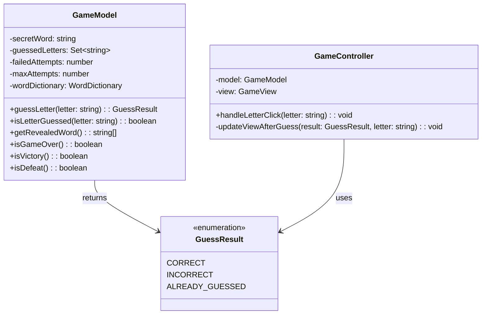
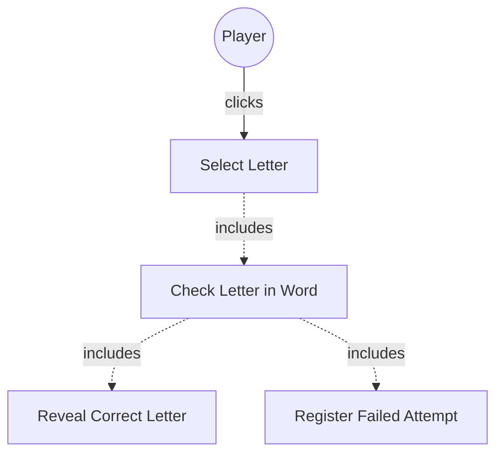

# GLOBAL CONTEXT

**Project:** The Hangman Game - Web Application

**Architecture:** MVC (Model-View-Controller) with TypeScript

**Current module:** Model Layer - Data Types

---

# PROJECT FILE STRUCTURE

```
1-TheHangmanGame/
├── public/
│   └── favicon.ico
├── src/
│   ├── main.ts                    # Entry point
│   ├── models/
│   │   ├── guess-result.ts       # ← YOU ARE IMPLEMENTING THIS FILE
│   │   ├── word-dictionary.ts    # Word management
│   │   └── game-model.ts         # Game logic
│   ├── views/
│   │   ├── game-view.ts          # Main view coordinator
│   │   ├── word-display.ts       # Letter boxes rendering
│   │   ├── alphabet-display.ts   # Alphabet buttons
│   │   ├── hangman-renderer.ts   # Canvas drawing
│   │   └── message-display.ts    # Messages and restart
│   ├── controllers/
│   │   └── game-controller.ts    # Event coordination
│   └── styles/
│       └── main.css              # Custom styles
├── tests/
│   ├── models/
│   │   ├── guess-result.test.ts
│   │   ├── word-dictionary.test.ts
│   │   └── game-model.test.ts
│   ├── views/
│   │   ├── word-display.test.ts
│   │   ├── alphabet-display.test.ts
│   │   ├── hangman-renderer.test.ts
│   │   └── message-display.test.ts
│   └── controllers/
│       └── game-controller.test.ts
├── index.html
├── package.json
├── tsconfig.json
├── vite.config.ts
├── jest.config.js
└── README.md
```

---

# INPUT ARTIFACTS

## 1. Requirements Specification

### Relevant Functional Requirements:
- **FR2:** Letter selection by the user through click - system must process whether it is correct or incorrect
- **FR3:** Reveal all occurrences of correct letters
- **FR4:** Register failed attempts and increment counter
- **FR10:** Disable already selected letters

### Relevant Non-Functional Requirements:
- **NFR2:** Modular and object-oriented code following MVC architecture
- **NFR5:** Unit tests with Jest with minimum 80% coverage
- **NFR6:** Complete documentation with JSDoc/TypeDoc
- **NFR7:** Code analysis with ESLint and Google style guide

### Game Rules Context:
- When a player selects a letter, the system must determine if:
  - The letter is **correct** (present in the secret word)
  - The letter is **incorrect** (not present in the secret word)
  - The letter has **already been guessed** (duplicate attempt)
- Each incorrect letter increments the failed attempts counter
- Already guessed letters should not be processed again

---

## 2. Class Diagram



**Relationship:** `GuessResult` is returned by `GameModel.guessLetter()` method and used by `GameController` to determine how to update the view.

---

## 3. Use Case Diagram



**Context:** After a player selects a letter, the system must check if it's in the word and return an appropriate result (correct, incorrect, or already guessed).

---

# SPECIFIC TASK

Implement the enumeration: **`GuessResult`**

**File location:** `src/models/guess-result.ts`

---

## Responsibilities:

1. **Define the three possible outcomes of a letter guess attempt**
   - CORRECT: Letter exists in the secret word
   - INCORRECT: Letter does not exist in the secret word
   - ALREADY_GUESSED: Letter has been guessed before

2. **Provide type-safe result values** for the game logic to use

3. **Enable clear communication** between Model and Controller layers about guess outcomes

---

## Enumeration Values to Define:

### 1. **CORRECT**
   - **Meaning:** The guessed letter is present in the secret word
   - **Usage context:** Returned by `GameModel.guessLetter()` when the letter exists in the word
   - **Effect on game:** All occurrences of this letter will be revealed in the word display
   - **Example:** If the word is "ELEPHANT" and the player guesses "E", return CORRECT

### 2. **INCORRECT**
   - **Meaning:** The guessed letter is not present in the secret word
   - **Usage context:** Returned by `GameModel.guessLetter()` when the letter doesn't exist in the word
   - **Effect on game:** Failed attempts counter increments, hangman drawing progresses
   - **Example:** If the word is "ELEPHANT" and the player guesses "Z", return INCORRECT

### 3. **ALREADY_GUESSED**
   - **Meaning:** The letter has been previously guessed (whether correct or incorrect)
   - **Usage context:** Returned by `GameModel.guessLetter()` when the letter is already in the guessed set
   - **Effect on game:** No state change, no penalty, just feedback to user
   - **Example:** If "E" was already guessed and player clicks "E" again, return ALREADY_GUESSED

---

## Dependencies:

- **Classes it must use:** None (this is a pure enumeration with no dependencies)
- **Interfaces it implements:** None
- **External services it consumes:** None
- **Classes that depend on this:** 
  - `GameModel` (returns this type)
  - `GameController` (consumes this type to update view)

---

# CONSTRAINTS AND STANDARDS

## Code:

- **Language:** TypeScript 5.6.3
- **Module system:** ES6 modules (ESNext)
- **Code style:** Google TypeScript Style Guide
- **Export:** Must be exported as named export for use in other modules
- **Naming convention:** 
  - Enum name: PascalCase (`GuessResult`)
  - Enum values: UPPER_CASE with underscores (`CORRECT`, `INCORRECT`, `ALREADY_GUESSED`)

## TypeScript-specific requirements:

- Use TypeScript `enum` keyword
- Export as named export: `export enum GuessResult { ... }`
- Enum values should be string enums for better debugging (not numeric)
- Follow TypeScript enum best practices

## Mandatory best practices:

- **Clear naming:** Enum values must be self-explanatory
- **Complete JSDoc documentation:** Document the enum and each value
- **Consistency:** Use consistent naming pattern (all UPPER_CASE)
- **Type safety:** Leverage TypeScript's type system
- **No magic values:** The enum replaces string literals or magic numbers

## Documentation requirements:

- JSDoc comment block for the enum itself
- JSDoc comment for each enum value explaining its meaning and usage
- Include `@category Model` tag for TypeDoc organization
- Include examples in documentation if helpful

---

# DELIVERABLES

## 1. Complete source code of the enumeration with:

- **File header comment** with brief description
- **Import statements** (if any - none expected for this file)
- **Enum declaration** with JSDoc documentation
- **All three enum values** with individual JSDoc comments
- **Proper exports** for module consumption

## 2. Inline documentation:

- **JSDoc for the enum:** Explain what GuessResult represents
- **JSDoc for each value:** Explain when each value is used
- **Usage examples** in JSDoc comments (optional but recommended)
- **Category tag** for TypeDoc: `@category Model`

## 3. New dependencies:

- **None expected** - This is a pure TypeScript enum with no external dependencies

## 4. Edge cases considered:

- **Not applicable** - Enumerations don't have runtime logic or edge cases
- The enum simply defines constants

---

# OUTPUT FORMAT

```typescript
[Complete code here]
```

---

## Design decisions made:

- **[Decision 1 and its justification]**
- **[Decision 2 and its justification]**
- ...

---

## Possible future improvements:

- **[Improvement 1]**
- **[Improvement 2]**
- ...

---

## Testing considerations:

While enums typically don't require unit tests (they're just type definitions), you should verify:
- The enum exports correctly
- The enum can be imported in other files
- TypeScript type checking works correctly with the enum values

---

## Integration points:

This enum will be used by:

1. **`GameModel.guessLetter()` method** - Returns `GuessResult`
2. **`GameController.updateViewAfterGuess()` method** - Receives `GuessResult` and acts accordingly:
   - `CORRECT` → Update word boxes, disable letter button
   - `INCORRECT` → Increment attempts, update hangman, disable letter button
   - `ALREADY_GUESSED` → Show feedback, no state change

---

**Note:** This is a foundational type for the entire game logic. It must be implemented first as other classes depend on it.
