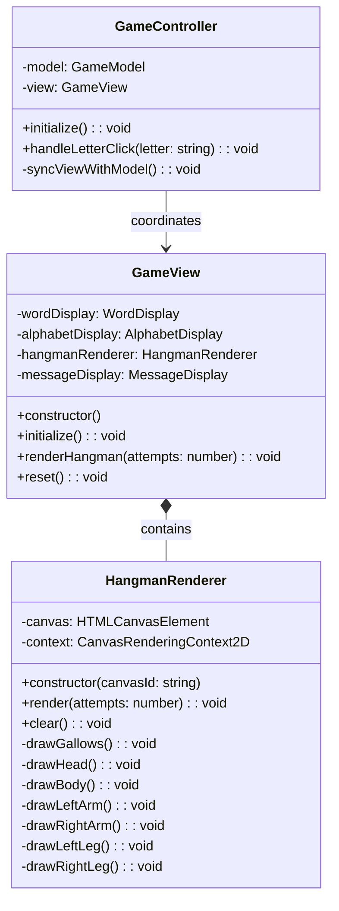
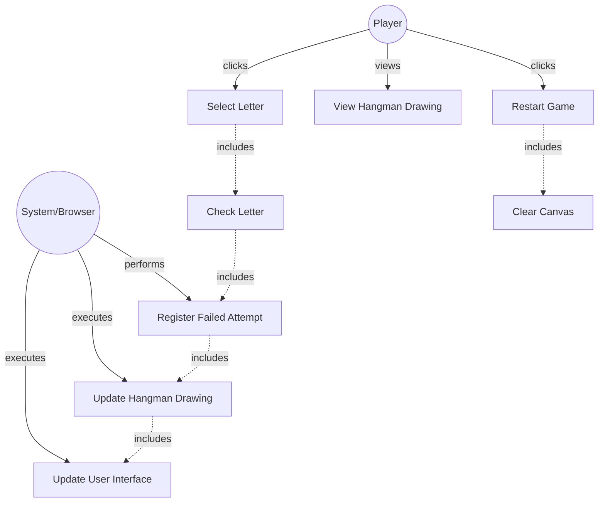

# GLOBAL CONTEXT

**Project:** The Hangman Game - Web Application

**Architecture:** MVC (Model-View-Controller) with TypeScript

**Current module:** View Layer - UI Components (Canvas Graphics)

---

# PROJECT FILE STRUCTURE

```
1-TheHangmanGame/
├── public/
│   └── favicon.ico
├── src/
│   ├── main.ts                    # Entry point
│   ├── models/
│   │   ├── guess-result.ts       # Enumeration for guess outcomes
│   │   ├── word-dictionary.ts    # Word management
│   │   └── game-model.ts         # Game logic
│   ├── views/
│   │   ├── game-view.ts          # Main view coordinator
│   │   ├── word-display.ts       # Letter boxes rendering
│   │   ├── alphabet-display.ts   # Alphabet buttons
│   │   ├── hangman-renderer.ts   # ← YOU ARE IMPLEMENTING THIS FILE
│   │   └── message-display.ts    # Messages and restart
│   ├── controllers/
│   │   └── game-controller.ts    # Event coordination
│   └── styles/
│       └── main.css              # Custom styles
├── tests/
│   ├── models/
│   │   ├── guess-result.test.ts
│   │   ├── word-dictionary.test.ts
│   │   └── game-model.test.ts
│   ├── views/
│   │   ├── word-display.test.ts
│   │   ├── alphabet-display.test.ts
│   │   ├── hangman-renderer.test.ts  # Tests for this file
│   │   └── message-display.test.ts
│   └── controllers/
│       └── game-controller.test.ts
├── index.html
├── package.json
├── tsconfig.json
├── vite.config.ts
├── jest.config.js
└── README.md
```

---

# INPUT ARTIFACTS

## 1. Requirements Specification

### Relevant Functional Requirements:

- **FR4:** Register failed attempts and increment counter - Each incorrect letter selected increments the failed attempts counter (maximum 6) and does not reveal any letter
- **FR5:** Update graphical representation of the hangman - Each failed attempt adds a new part to the hangman drawing (6 progressive states: base, post, beam, rope, head, body/limbs)
- **FR7:** Game termination by computer victory - If 6 failed attempts are completed without guessing the word, a defeat message is displayed
- **FR9:** Game restart - Restart resets all states including the hangman drawing

### Relevant Non-Functional Requirements:

- **NFR2:** Modular and object-oriented code following MVC architecture
- **NFR5:** Unit tests with Jest with minimum 80% coverage
- **NFR6:** Complete documentation with JSDoc/TypeDoc
- **NFR7:** Code analysis with ESLint and Google style guide
- **NFR8:** Immediate response time when selecting letters - Interface updates in less than 200ms

### Visual Specifications (from HTML/CSS prompt):

**Hangman Canvas Section (`#hangman-canvas`):**
- Canvas element (400x400px) for drawing the progressive hangman states
- **6 progressive drawing states:**
  - **State 0:** Empty gallows structure (base, post, beam, rope)
  - **State 1:** Head
  - **State 2:** Body
  - **State 3:** Left arm
  - **State 4:** Right arm
  - **State 5:** Left leg
  - **State 6:** Right leg (game over)
- Centered within its container box
- Must have white background with border (handled by CSS)
- Canvas dimensions: 400x400px (set as HTML attributes)

### Drawing Specifications:

The hangman should be drawn progressively as a stick figure with clear, simple lines:
- **Gallows (always visible):**
  - Base (horizontal line at bottom)
  - Post (vertical line from base)
  - Beam (horizontal line from top of post)
  - Rope (vertical line from beam)
  
- **Body parts (added progressively):**
  1. Head (circle)
  2. Body (vertical line from head)
  3. Left arm (diagonal line from upper body)
  4. Right arm (diagonal line from upper body)
  5. Left leg (diagonal line from lower body)
  6. Right leg (diagonal line from lower body)

---

## 2. Class Diagram



**Relationship:** `HangmanRenderer` is a component of `GameView` responsible for drawing the progressive hangman figure on the canvas based on failed attempt count.

---

## 3. Use Case Diagram



**Context:** HangmanRenderer provides visual feedback on game progress by drawing body parts incrementally as the player makes incorrect guesses.

---

# SPECIFIC TASK

Implement the class: **`HangmanRenderer`**

**File location:** `src/views/hangman-renderer.ts`

---

## Responsibilities:

1. **Render the hangman drawing on canvas** based on failed attempt count
2. **Draw the gallows structure** (always visible as base state)
3. **Progressively add body parts** (6 states: head, body, left arm, right arm, left leg, right leg)
4. **Clear the canvas** when restarting the game
5. **Provide clean, consistent drawing** with proper line styles and proportions

---

## Properties (Private):

- **canvas: HTMLCanvasElement** - The canvas DOM element for drawing
- **context: CanvasRenderingContext2D** - The 2D rendering context for canvas drawing operations

---

## Methods to implement:

### 1. **constructor(canvasId: string)**
   - **Description:** Creates a new HangmanRenderer instance and captures references to canvas and context
   - **Parameters:** 
     - `canvasId: string` - The ID of the canvas HTML element (should be `"hangman-canvas"`)
   - **Returns:** Instance of HangmanRenderer
   - **Preconditions:** 
     - A canvas element with the specified ID must exist in the DOM
   - **Postconditions:** 
     - `this.canvas` references the canvas DOM element
     - `this.context` references the 2D rendering context
   - **Implementation details:**
     - Use `document.getElementById(canvasId)` to get the canvas element
     - Check if element exists and is a canvas element
     - Throw error if element not found or not a canvas: `throw new Error(\`Canvas element with id "${canvasId}" not found\`)`
     - Get 2D context: `const ctx = this.canvas.getContext('2d')`
     - Check if context exists (should always succeed in modern browsers)
     - Throw error if context fails: `throw new Error('Failed to get 2D context from canvas')`
     - Store canvas and context references
   - **Error handling:**
     - Throw Error if element not found or wrong type
     - Throw Error if 2D context cannot be obtained
   - **Example usage:**
     ```typescript
     const renderer = new HangmanRenderer('hangman-canvas');
     ```

### 2. **render(attempts: number): void**
   - **Description:** Renders the hangman drawing based on number of failed attempts (0-6)
   - **Parameters:** 
     - `attempts: number` - The number of failed attempts (0 = only gallows, 6 = complete hangman)
   - **Returns:** `void`
   - **Preconditions:** 
     - Canvas and context must be initialized
     - `attempts` should be between 0 and 6 (inclusive)
   - **Postconditions:** 
     - Canvas shows the appropriate hangman state
     - Drawing includes gallows plus body parts corresponding to attempt count
   - **Implementation details:**
     - Clear canvas first: call `this.clear()`
     - Always draw gallows: call `this.drawGallows()`
     - Use switch statement or if-else chain to draw body parts based on attempts:
       - `attempts >= 1`: draw head
       - `attempts >= 2`: draw body
       - `attempts >= 3`: draw left arm
       - `attempts >= 4`: draw right arm
       - `attempts >= 5`: draw left leg
       - `attempts >= 6`: draw right leg
     - Each state should be cumulative (e.g., at 3 attempts, show head + body + left arm)
   - **Exceptions to handle:**
     - Optional: Validate attempts is between 0-6
     - Clamp value if out of range (silent correction)
   - **Example:**
     ```typescript
     renderer.render(0); // Only gallows
     renderer.render(3); // Gallows + head + body + left arm
     renderer.render(6); // Complete hangman (game over)
     ```

### 3. **clear(): void**
   - **Description:** Clears the entire canvas (removes all drawings)
   - **Parameters:** None
   - **Returns:** `void`
   - **Preconditions:** 
     - Canvas and context must be initialized
   - **Postconditions:** 
     - Canvas is completely blank (white)
   - **Implementation details:**
     - Use `clearRect()` to clear entire canvas
     - `this.context.clearRect(0, 0, this.canvas.width, this.canvas.height)`
     - Canvas dimensions are 400x400 (from HTML attributes)
   - **Exceptions to handle:** None
   - **Usage context:** Called before each new drawing and when resetting game

### 4. **drawGallows(): void** (private)
   - **Description:** Draws the gallows structure (base, post, beam, rope)
   - **Parameters:** None
   - **Returns:** `void`
   - **Preconditions:** 
     - Context must be initialized
   - **Postconditions:** 
     - Gallows structure is drawn on canvas
   - **Implementation details:**
     - Set line style properties:
       - `this.context.strokeStyle = '#363636'` (dark gray)
       - `this.context.lineWidth = 4`
       - `this.context.lineCap = 'round'`
     - Draw base (horizontal line at bottom):
       - Start point: (50, 350)
       - End point: (200, 350)
     - Draw post (vertical line from base):
       - Start point: (125, 350)
       - End point: (125, 50)
     - Draw beam (horizontal line from top of post):
       - Start point: (125, 50)
       - End point: (250, 50)
     - Draw rope (vertical line from beam):
       - Start point: (250, 50)
       - End point: (250, 100)
     - Use `beginPath()`, `moveTo()`, `lineTo()`, `stroke()` for each line
   - **Canvas coordinate system:** Origin (0,0) is top-left corner
   - **Proportions:** Gallows should be centered and proportional within 400x400 canvas

### 5. **drawHead(): void** (private)
   - **Description:** Draws the head (1st failed attempt)
   - **Parameters:** None
   - **Returns:** `void`
   - **Preconditions:** Context initialized
   - **Postconditions:** Head (circle) is drawn below the rope
   - **Implementation details:**
     - Set line style:
       - `this.context.strokeStyle = '#363636'`
       - `this.context.lineWidth = 4`
     - Draw circle using `arc()`:
       - Center: (250, 130) - below rope end
       - Radius: 30
       - Start angle: 0
       - End angle: 2 * Math.PI (full circle)
     - Use `beginPath()`, `arc()`, `stroke()`
   - **Example:**
     ```typescript
     this.context.beginPath();
     this.context.arc(250, 130, 30, 0, 2 * Math.PI);
     this.context.stroke();
     ```

### 6. **drawBody(): void** (private)
   - **Description:** Draws the body (2nd failed attempt)
   - **Parameters:** None
   - **Returns:** `void`
   - **Preconditions:** Context initialized
   - **Postconditions:** Body (vertical line) is drawn from head to torso
   - **Implementation details:**
     - Set line style (same as before)
     - Draw vertical line:
       - Start point: (250, 160) - bottom of head
       - End point: (250, 250) - torso length
     - Use `beginPath()`, `moveTo()`, `lineTo()`, `stroke()`

### 7. **drawLeftArm(): void** (private)
   - **Description:** Draws the left arm (3rd failed attempt)
   - **Parameters:** None
   - **Returns:** `void`
   - **Preconditions:** Context initialized
   - **Postconditions:** Left arm (diagonal line) is drawn from upper body
   - **Implementation details:**
     - Set line style
     - Draw diagonal line:
       - Start point: (250, 180) - upper body
       - End point: (210, 210) - angled downward-left
     - Use `beginPath()`, `moveTo()`, `lineTo()`, `stroke()`

### 8. **drawRightArm(): void** (private)
   - **Description:** Draws the right arm (4th failed attempt)
   - **Parameters:** None
   - **Returns:** `void`
   - **Preconditions:** Context initialized
   - **Postconditions:** Right arm (diagonal line) is drawn from upper body
   - **Implementation details:**
     - Set line style
     - Draw diagonal line:
       - Start point: (250, 180) - upper body
       - End point: (290, 210) - angled downward-right
     - Use `beginPath()`, `moveTo()`, `lineTo()`, `stroke()`

### 9. **drawLeftLeg(): void** (private)
   - **Description:** Draws the left leg (5th failed attempt)
   - **Parameters:** None
   - **Returns:** `void`
   - **Preconditions:** Context initialized
   - **Postconditions:** Left leg (diagonal line) is drawn from lower body
   - **Implementation details:**
     - Set line style
     - Draw diagonal line:
       - Start point: (250, 250) - bottom of body
       - End point: (220, 310) - angled downward-left
     - Use `beginPath()`, `moveTo()`, `lineTo()`, `stroke()`

### 10. **drawRightLeg(): void** (private)
   - **Description:** Draws the right leg (6th failed attempt - game over)
   - **Parameters:** None
   - **Returns:** `void`
   - **Preconditions:** Context initialized
   - **Postconditions:** Right leg (diagonal line) is drawn from lower body, completing the hangman
   - **Implementation details:**
     - Set line style
     - Draw diagonal line:
       - Start point: (250, 250) - bottom of body
       - End point: (280, 310) - angled downward-right
     - Use `beginPath()`, `moveTo()`, `lineTo()`, `stroke()`

---

## Dependencies:

- **Classes it must use:** None (pure Canvas API)
- **Interfaces it implements:** None
- **External services it consumes:** 
  - Canvas API (`HTMLCanvasElement`, `CanvasRenderingContext2D`)
  - Math API (`Math.PI` for circle drawing)
- **Classes that depend on this:** 
  - `GameView` - composes HangmanRenderer and calls its methods

---

# CONSTRAINTS AND STANDARDS

## Code:

- **Language:** TypeScript 5.6.3
- **Module system:** ES6 modules (ESNext)
- **Code style:** Google TypeScript Style Guide
  - Class name: PascalCase (`HangmanRenderer`)
  - Method names: camelCase
  - Private methods: use `private` keyword
  - Magic numbers: Consider extracting coordinates as constants or configuration object
- **Maximum cyclomatic complexity:** 8 (render method has switch/if-else for attempts)
- **Maximum method length:** 40 lines (render method includes multiple conditional calls)

## Mandatory best practices:

- **Application of SOLID principles:**
  - **SRP (Single Responsibility):** Only handles hangman canvas drawing
  - **OCP (Open/Closed):** Drawing style can be customized without modifying methods
  
- **Input parameter validation:**
  - Validate `canvasId` exists in constructor (throw error if not)
  - Optional: Validate `attempts` is between 0-6 in render method
  
- **Robust exception handling:**
  - Constructor must throw error if canvas element not found
  - Constructor must throw error if 2D context cannot be obtained
  
- **Logging at critical points:**
  - Not required for this view component
  - Optional: Console log for debugging drawing issues
  
- **Comments for complex logic:**
  - Comment the coordinate system and proportions
  - Comment each drawing method explaining what it draws
  - Comment the progressive rendering logic in render()

## Canvas API Best Practices:

- **Line styling consistency:**
  - Use consistent `strokeStyle`, `lineWidth`, `lineCap` across all drawings
  - Set styles before each drawing operation (context state can change)
  
- **Path management:**
  - Always call `beginPath()` before starting new path
  - Use `moveTo()` and `lineTo()` for lines
  - Use `arc()` for circles
  - Call `stroke()` or `fill()` to render
  
- **Coordinate system:**
  - Origin (0,0) is top-left corner
  - X increases to the right
  - Y increases downward
  - Canvas size: 400x400px
  
- **Performance:**
  - Clear canvas before redrawing (prevents overlapping)
  - Minimize state changes in context
  - Use efficient drawing methods

## TypeScript-specific requirements:

- Use TypeScript type annotations for all parameters and return types
- Use `HTMLCanvasElement` type for canvas element
- Use `CanvasRenderingContext2D` type for context
- Proper null checking when getting canvas and context
- Use proper access modifiers: `public`, `private`

## Documentation requirements:

- **JSDoc comment block** for the class
- **JSDoc comments** for all public methods
- **JSDoc comment** for constructor
- **Optional but recommended:** JSDoc for private drawing methods
- Include `@category View` tag for TypeDoc organization
- Use proper JSDoc tags: `@param`, `@returns`, `@throws`

---

# DELIVERABLES

## 1. Complete source code of the class with:

- **File header comment** with brief description
- **Import statements** (none expected)
- **Class declaration** with JSDoc documentation
- **Private properties** with type annotations (canvas, context)
- **Constructor implementation** with element validation
- **Public methods implemented:** `render()`, `clear()`
- **Private methods implemented:** `drawGallows()`, `drawHead()`, `drawBody()`, `drawLeftArm()`, `drawRightArm()`, `drawLeftLeg()`, `drawRightLeg()`
- **Proper exports:** `export class HangmanRenderer { ... }`

## 2. Inline documentation:

- **JSDoc for class:** Explain HangmanRenderer's purpose
- **JSDoc for constructor:** Explain canvasId parameter and error handling
- **JSDoc for public methods:** Parameters, return values, purpose
- **Comments in render():** Explain progressive drawing logic
- **Comments in drawing methods:** Explain coordinates and what each part represents
- **Category tag:** `@category View`

## 3. New dependencies:

- **None** - Uses only native Canvas API (browser built-in)
- Canvas API is available in all modern browsers

## 4. Edge cases considered:

- **Canvas not found:** Constructor throws descriptive error
- **Wrong element type:** Constructor validates element is actually a canvas
- **2D context unavailable:** Constructor throws error (rare, but possible in old browsers)
- **Invalid attempts value:** Optional clamping to 0-6 range
- **Negative attempts:** Treat as 0 (only gallows)
- **Attempts > 6:** Treat as 6 (complete hangman)
- **Clear before render:** Prevents overlapping drawings
- **Coordinate consistency:** All coordinates calculated relative to canvas size

---

# OUTPUT FORMAT

```typescript
[Complete code here]
```

---

## Design decisions made:

- **[Decision 1 and its justification]**
- **[Decision 2 and its justification]**
- ...

---

## Possible future improvements:

- **[Improvement 1]**
- **[Improvement 2]**
- ...

---

## Testing considerations:

Unit tests should verify:

1. **Constructor throws error if canvas not found:** Mock DOM, test error thrown
2. **Constructor throws error if element is not canvas:** Create div with ID, test error
3. **Constructor throws error if context unavailable:** Mock getContext to return null
4. **Constructor succeeds with valid canvas:** Verify canvas and context stored
5. **clear() clears the canvas:** Draw something, clear, verify canvas is blank
6. **render(0) draws only gallows:** Check canvas contains drawing (pixel data or mock context calls)
7. **render(1) draws gallows + head:** Verify head drawing method called
8. **render(6) draws complete hangman:** Verify all body part methods called
9. **Progressive rendering:** Each attempt adds only new parts (cumulative)
10. **Multiple render calls:** Second render clears first (no overlap)

**Jest Canvas Mock:**
```typescript
// In jest.setup.js, canvas context is already mocked

describe('HangmanRenderer', () => {
  let canvas: HTMLCanvasElement;
  let renderer: HangmanRenderer;

  beforeEach(() => {
    document.body.innerHTML = '<canvas id="hangman-canvas" width="400" height="400"></canvas>';
    canvas = document.getElementById('hangman-canvas') as HTMLCanvasElement;
    renderer = new HangmanRenderer('hangman-canvas');
  });

  test('should render only gallows at 0 attempts', () => {
    const ctx = canvas.getContext('2d') as any;
    renderer.render(0);
    expect(ctx.stroke).toHaveBeenCalled();
  });
});
```

---

## Visual Reference - Coordinate Layout:

```
Canvas: 400x400px
Coordinate System: (0,0) at top-left

Gallows Structure:
- Base: (50, 350) to (200, 350)
- Post: (125, 350) to (125, 50)
- Beam: (125, 50) to (250, 50)
- Rope: (250, 50) to (250, 100)

Body Parts (centered at x=250):
- Head: circle at (250, 130), radius 30
- Body: line from (250, 160) to (250, 250)
- Left Arm: line from (250, 180) to (210, 210)
- Right Arm: line from (250, 180) to (290, 210)
- Left Leg: line from (250, 250) to (220, 310)
- Right Leg: line from (250, 250) to (280, 310)
```

---

## Drawing Style Guidelines:

- **Line color:** Dark gray (#363636) for all drawings
- **Line width:** 4px for visibility and consistency
- **Line cap:** 'round' for smoother appearance at line ends
- **Background:** White (handled by CSS, canvas is transparent by default)
- **Style:** Simple stick figure, clear and recognizable
- **Proportions:** Centered on canvas, appropriately sized for 400x400px

---

**Note:** This component provides critical visual feedback for game progress. Ensure drawing is clear, consistent, and renders efficiently (<200ms per update).
