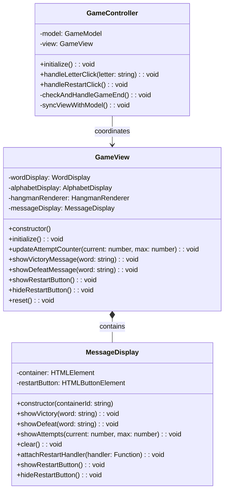
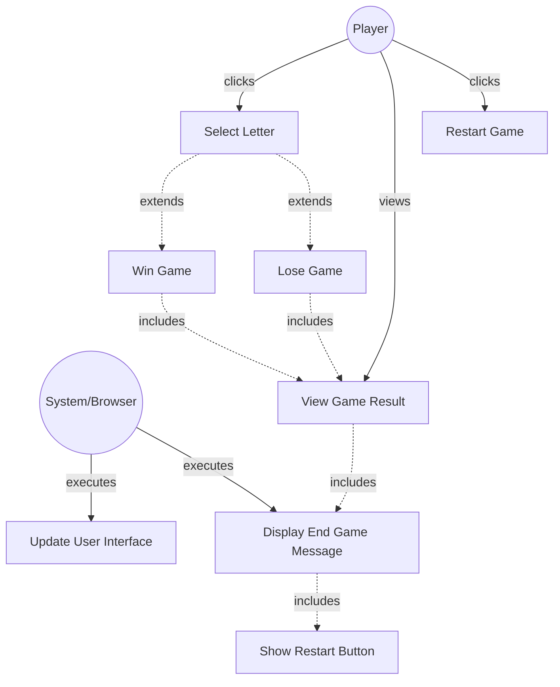

# GLOBAL CONTEXT

**Project:** The Hangman Game - Web Application

**Architecture:** MVC (Model-View-Controller) with TypeScript

**Current module:** View Layer - UI Components (User Feedback)

---

# PROJECT FILE STRUCTURE

```
1-TheHangmanGame/
├── public/
│   └── favicon.ico
├── src/
│   ├── main.ts                    # Entry point
│   ├── models/
│   │   ├── guess-result.ts       # Enumeration for guess outcomes
│   │   ├── word-dictionary.ts    # Word management
│   │   └── game-model.ts         # Game logic
│   ├── views/
│   │   ├── game-view.ts          # Main view coordinator
│   │   ├── word-display.ts       # Letter boxes rendering
│   │   ├── alphabet-display.ts   # Alphabet buttons
│   │   ├── hangman-renderer.ts   # Canvas drawing
│   │   └── message-display.ts    # ← YOU ARE IMPLEMENTING THIS FILE
│   ├── controllers/
│   │   └── game-controller.ts    # Event coordination
│   └── styles/
│       └── main.css              # Custom styles
├── tests/
│   ├── models/
│   │   ├── guess-result.test.ts
│   │   ├── word-dictionary.test.ts
│   │   └── game-model.test.ts
│   ├── views/
│   │   ├── word-display.test.ts
│   │   ├── alphabet-display.test.ts
│   │   ├── hangman-renderer.test.ts
│   │   └── message-display.test.ts  # Tests for this file
│   └── controllers/
│       └── game-controller.test.ts
├── index.html
├── package.json
├── tsconfig.json
├── vite.config.ts
├── jest.config.js
└── README.md
```

---

# INPUT ARTIFACTS

## 1. Requirements Specification

### Relevant Functional Requirements:

- **FR4:** Register failed attempts and increment counter - Visual indicator of failed attempts (e.g., "Attempts: 3/6")
- **FR6:** Game termination by player victory - If the player guesses all letters before reaching 6 failed attempts, a victory message is displayed and the restart option is enabled
- **FR7:** Game termination by computer victory - If 6 failed attempts are completed without guessing the word, a defeat message is displayed with the correct word and the restart option is enabled
- **FR9:** Game restart - Upon finishing a game (victory or defeat), the user can restart the game through a button

### Relevant Non-Functional Requirements:

- **NFR2:** Modular and object-oriented code following MVC architecture
- **NFR4:** Use of Bulma for interface styling - HTML elements use Bulma classes with consistent design
- **NFR5:** Unit tests with Jest with minimum 80% coverage
- **NFR6:** Complete documentation with JSDoc/TypeDoc
- **NFR7:** Code analysis with ESLint and Google style guide
- **NFR8:** Immediate response time when selecting letters - Interface updates in less than 200ms

### Visual Specifications (from HTML/CSS prompt):

**Message Display Area (`#message-container`):**
- Dynamic area showing:
  - **Attempt counter:** e.g., "Attempts: 3/6"
  - **Victory message:** When player wins
  - **Defeat message:** When player loses (showing the correct word)
- Initially displays attempt counter
- Must be centered text alignment
- Minimum height: 100px to prevent layout shifts

**Message Styling:**
- **Victory message:** 
  - CSS class: `.victory-message`
  - Color: Success green (#48c774)
  - Font-size: 1.5rem
  - Font-weight: bold
  - Example: "You Won! The word was: ELEPHANT"

- **Defeat message:**
  - CSS class: `.defeat-message`
  - Color: Danger red (#f14668)
  - Font-size: 1.5rem
  - Font-weight: bold
  - Example: "You Lost. The word was: ELEPHANT"

- **Attempt counter:**
  - CSS class: `.attempt-counter`
  - Font-size: 1.25rem
  - Font-weight: 600
  - Color: Text color (#363636)
  - Example: "Attempts: 3/6"

**Restart Button:**
- CSS class: `.restart-button`
- Appears only when game ends (victory or defeat)
- Bulma button styling with primary color
- Text: "Restart Game" or "Play Again"

---

## 2. Class Diagram



**Relationship:** `MessageDisplay` is a component of `GameView` responsible for showing game status messages, attempt counter, and restart button.

---

## 3. Use Case Diagram



**Context:** MessageDisplay provides feedback to the user about game progress and outcome, and offers the ability to restart the game.

---

# SPECIFIC TASK

Implement the class: **`MessageDisplay`**

**File location:** `src/views/message-display.ts`

---

## Responsibilities:

1. **Display the current attempt counter** during active gameplay
2. **Show victory message** when player wins (with the secret word)
3. **Show defeat message** when player loses (with the secret word)
4. **Manage the restart button** (show/hide, attach event handler)
5. **Clear messages** when resetting or updating game state

---

## Properties (Private):

- **container: HTMLElement** - The DOM container element that holds messages and the restart button (the `#message-container` div from HTML)
- **restartButton: HTMLButtonElement** - The restart button element (created dynamically)

---

## Methods to implement:

### 1. **constructor(containerId: string)**
   - **Description:** Creates a new MessageDisplay instance and captures reference to the container element
   - **Parameters:** 
     - `containerId: string` - The ID of the container HTML element (should be `"message-container"`)
   - **Returns:** Instance of MessageDisplay
   - **Preconditions:** 
     - An HTML element with the specified ID must exist in the DOM
   - **Postconditions:** 
     - `this.container` references the DOM element
     - `this.restartButton` is created but not yet added to DOM
   - **Implementation details:**
     - Use `document.getElementById(containerId)` to get the container element
     - Check if element exists, throw error if not found with descriptive message
     - Throw error if element not found: `throw new Error(\`Element with id "${containerId}" not found\`)`
     - Create restart button: `this.restartButton = document.createElement('button')`
     - Configure restart button:
       - Add CSS class: `this.restartButton.classList.add('restart-button')`
       - Set text: `this.restartButton.textContent = 'Restart Game'`
       - Set type: `this.restartButton.type = 'button'`
       - Initially hidden (not added to DOM yet)
   - **Error handling:**
     - Throw Error if container element not found
   - **Example usage:**
     ```typescript
     const messageDisplay = new MessageDisplay('message-container');
     ```

### 2. **showVictory(word: string): void**
   - **Description:** Displays a victory message with the revealed word
   - **Parameters:** 
     - `word: string` - The secret word that was guessed (should be uppercase)
   - **Returns:** `void`
   - **Preconditions:** 
     - Container element must exist
     - Game has ended in victory
   - **Postconditions:** 
     - Container displays victory message
     - Message includes the secret word
     - Victory styling applied (green color, bold)
   - **Implementation details:**
     - Clear container first: `this.container.innerHTML = ''`
     - Create message element (div or paragraph): `const message = document.createElement('div')`
     - Add CSS class: `message.classList.add('victory-message')`
     - Set text content: `message.textContent = \`You Won! The word was: ${word.toUpperCase()}\``
     - Append message to container: `this.container.appendChild(message)`
   - **Exceptions to handle:** None
   - **Message format examples:**
     - "You Won! The word was: ELEPHANT"
     - "Congratulations! The word was: GIRAFFE"
     - (Choose one consistent format)
   - **Example:**
     ```typescript
     messageDisplay.showVictory('ELEPHANT');
     ```

### 3. **showDefeat(word: string): void**
   - **Description:** Displays a defeat message with the secret word
   - **Parameters:** 
     - `word: string` - The secret word that was not guessed (should be uppercase)
   - **Returns:** `void`
   - **Preconditions:** 
     - Container element must exist
     - Game has ended in defeat (6 failed attempts)
   - **Postconditions:** 
     - Container displays defeat message
     - Message includes the secret word
     - Defeat styling applied (red color, bold)
   - **Implementation details:**
     - Clear container first: `this.container.innerHTML = ''`
     - Create message element: `const message = document.createElement('div')`
     - Add CSS class: `message.classList.add('defeat-message')`
     - Set text content: `message.textContent = \`You Lost. The word was: ${word.toUpperCase()}\``
     - Append message to container: `this.container.appendChild(message)`
   - **Exceptions to handle:** None
   - **Message format examples:**
     - "You Lost. The word was: ELEPHANT"
     - "Game Over! The word was: GIRAFFE"
     - (Choose one consistent format)
   - **Example:**
     ```typescript
     messageDisplay.showDefeat('RHINOCEROS');
     ```

### 4. **showAttempts(current: number, max: number): void**
   - **Description:** Displays the current attempt counter
   - **Parameters:** 
     - `current: number` - Current number of failed attempts (0-6)
     - `max: number` - Maximum allowed failed attempts (typically 6)
   - **Returns:** `void`
   - **Preconditions:** 
     - Container element must exist
     - current should be <= max
   - **Postconditions:** 
     - Container displays attempt counter
     - Format: "Attempts: X/Y"
   - **Implementation details:**
     - Clear container first: `this.container.innerHTML = ''`
     - Create message element: `const message = document.createElement('div')`
     - Add CSS class: `message.classList.add('attempt-counter')`
     - Set text content: `message.textContent = \`Attempts: ${current}/${max}\``
     - Append message to container: `this.container.appendChild(message)`
   - **Exceptions to handle:**
     - Optional: Validate current <= max
   - **Example:**
     ```typescript
     messageDisplay.showAttempts(3, 6); // Shows "Attempts: 3/6"
     messageDisplay.showAttempts(0, 6); // Shows "Attempts: 0/6"
     ```

### 5. **clear(): void**
   - **Description:** Clears all messages from the display
   - **Parameters:** None
   - **Returns:** `void`
   - **Preconditions:** None
   - **Postconditions:** 
     - Container is empty (no messages or buttons)
   - **Implementation details:**
     - Clear container: `this.container.innerHTML = ''`
   - **Exceptions to handle:** None
   - **Usage context:** Called when updating messages or resetting game
   - **Note:** This removes everything including restart button if present

### 6. **attachRestartHandler(handler: () => void): void**
   - **Description:** Attaches a click handler to the restart button
   - **Parameters:** 
     - `handler: () => void` - The callback function to invoke when restart button is clicked
   - **Returns:** `void`
   - **Preconditions:** 
     - Restart button must exist
     - Handler must be a valid function
   - **Postconditions:** 
     - Restart button has click event listener attached
     - When clicked, button calls the handler function
   - **Implementation details:**
     - Add click event listener to restart button:
       - `this.restartButton.addEventListener('click', handler)`
   - **Exceptions to handle:** None
   - **Usage context:** Called by GameView/GameController to connect restart button to game logic
   - **Example:**
     ```typescript
     messageDisplay.attachRestartHandler(() => {
       console.log('Restart clicked');
       // Controller restarts the game
     });
     ```

### 7. **showRestartButton(): void**
   - **Description:** Makes the restart button visible by adding it to the container
   - **Parameters:** None
   - **Returns:** `void`
   - **Preconditions:** 
     - Container must exist
     - Restart button must exist
     - Game should be over (victory or defeat)
   - **Postconditions:** 
     - Restart button is visible in the container
     - Button is clickable
   - **Implementation details:**
     - Check if button is already in container (optional defensive check)
     - Append button to container: `this.container.appendChild(this.restartButton)`
   - **Exceptions to handle:** None
   - **Note:** Button appears below the victory/defeat message
   - **Example:**
     ```typescript
     messageDisplay.showVictory('ELEPHANT');
     messageDisplay.showRestartButton(); // Button appears below victory message
     ```

### 8. **hideRestartButton(): void**
   - **Description:** Hides the restart button by removing it from the container
   - **Parameters:** None
   - **Returns:** `void`
   - **Preconditions:** None
   - **Postconditions:** 
     - Restart button is not visible
     - Button is not in the DOM container
   - **Implementation details:**
     - Check if button is in container: `if (this.restartButton.parentNode)`
     - Remove button: `this.restartButton.parentNode.removeChild(this.restartButton)`
     - Alternative: `this.restartButton.remove()` (modern browsers)
   - **Exceptions to handle:** None (safe to call even if button not in DOM)
   - **Usage context:** Called when starting new game to hide button during gameplay
   - **Example:**
     ```typescript
     messageDisplay.hideRestartButton(); // Button disappears
     messageDisplay.showAttempts(0, 6); // Show initial attempt counter
     ```

---

## Dependencies:

- **Classes it must use:** None (pure DOM manipulation)
- **Interfaces it implements:** None
- **External services it consumes:** 
  - DOM API (`document.getElementById`, `document.createElement`, `appendChild`, etc.)
- **Classes that depend on this:** 
  - `GameView` - composes MessageDisplay and calls its methods

---

# CONSTRAINTS AND STANDARDS

## Code:

- **Language:** TypeScript 5.6.3
- **Module system:** ES6 modules (ESNext)
- **Code style:** Google TypeScript Style Guide
  - Class name: PascalCase (`MessageDisplay`)
  - Method names: camelCase
  - Private methods: use `private` keyword (none in this class)
  - Constants: Extract message templates if desired
- **Maximum cyclomatic complexity:** 3 (methods are very simple)
- **Maximum method length:** 20 lines (all methods are short)

## Mandatory best practices:

- **Application of SOLID principles:**
  - **SRP (Single Responsibility):** Only handles message display and restart button
  - **OCP (Open/Closed):** Can be extended without modification
  
- **Input parameter validation:**
  - Validate `containerId` exists in constructor (throw error if not)
  - Normalize word to uppercase in showVictory/showDefeat
  - Optional: Validate current <= max in showAttempts
  
- **Robust exception handling:**
  - Constructor must throw error if container element not found
  - Other methods are safe (no risky operations)
  
- **Logging at critical points:**
  - Not required for this simple view component
  - Optional: Console log for debugging
  
- **Comments for complex logic:**
  - No complex logic in this class
  - JSDoc comments sufficient

## TypeScript-specific requirements:

- Use TypeScript type annotations for all parameters and return types
- Use `HTMLElement` and `HTMLButtonElement` types for DOM elements
- Proper null checking when getting elements from DOM
- Use proper access modifiers: `public`, `private`
- Use function type for handler: `() => void`

## Documentation requirements:

- **JSDoc comment block** for the class
- **JSDoc comments** for all public methods
- **JSDoc comment** for constructor
- Include `@category View` tag for TypeDoc organization
- Use proper JSDoc tags: `@param`, `@returns`, `@throws`

## Security:

- **XSS Prevention:** Use `textContent` instead of `innerHTML` when setting message text (prevents script injection)
- **Input sanitization:** Word parameter should only contain letters (comes from validated game model)
- **DOM Manipulation Safety:** Validate elements exist before manipulation

---

# DELIVERABLES

## 1. Complete source code of the class with:

- **File header comment** with brief description
- **Import statements** (none expected for this file)
- **Class declaration** with JSDoc documentation
- **Private properties** with type annotations
- **Constructor implementation** with element validation and button creation
- **All public methods implemented** (7 public methods)
- **No private methods** (all methods are public)
- **Proper exports:** `export class MessageDisplay { ... }`

## 2. Inline documentation:

- **JSDoc for class:** Explain MessageDisplay's purpose
- **JSDoc for constructor:** Explain containerId parameter and error handling
- **JSDoc for each public method:** Parameters, return values, purpose
- **Category tag:** `@category View`

## 3. New dependencies:

- **None** - Uses only native DOM APIs (browser built-ins)

## 4. Edge cases considered:

- **Container not found:** Constructor throws descriptive error
- **Word case normalization:** Always display in uppercase
- **Multiple message calls:** Each call clears previous content (no overlap)
- **Restart button already in DOM:** Safe to call showRestartButton multiple times
- **Restart button not in DOM:** Safe to call hideRestartButton when not present
- **Clear removes restart button:** Intentional behavior (clean slate)
- **Attaching multiple handlers:** Each call adds new listener (acceptable, but typically called once)

---

# OUTPUT FORMAT

```typescript
[Complete code here]
```

---

## Design decisions made:

- **[Decision 1 and its justification]**
- **[Decision 2 and its justification]**
- ...

---

## Possible future improvements:

- **[Improvement 1]**
- **[Improvement 2]**
- ...

---

## Testing considerations:

Unit tests should verify:

1. **Constructor throws error if container not found:** Mock DOM, test error thrown
2. **Constructor succeeds with valid container:** Verify container reference stored
3. **Constructor creates restart button:** Verify restartButton exists
4. **showVictory displays correct message:** Check container contains victory text
5. **showVictory applies correct CSS class:** Verify .victory-message class present
6. **showDefeat displays correct message:** Check container contains defeat text
7. **showDefeat applies correct CSS class:** Verify .defeat-message class present
8. **showAttempts displays counter:** Check format "Attempts: X/Y"
9. **showAttempts applies correct CSS class:** Verify .attempt-counter class present
10. **clear removes all content:** Add message, clear, verify container empty
11. **showRestartButton adds button to DOM:** Verify button in container
12. **hideRestartButton removes button from DOM:** Verify button not in container
13. **attachRestartHandler attaches event:** Mock handler, click button, verify handler called

**Jest DOM Testing:**
```typescript
describe('MessageDisplay', () => {
  let container: HTMLElement;
  let messageDisplay: MessageDisplay;

  beforeEach(() => {
    document.body.innerHTML = '<div id="message-container"></div>';
    container = document.getElementById('message-container')!;
    messageDisplay = new MessageDisplay('message-container');
  });

  test('should display victory message', () => {
    messageDisplay.showVictory('ELEPHANT');
    expect(container.textContent).toContain('You Won');
    expect(container.textContent).toContain('ELEPHANT');
    expect(container.querySelector('.victory-message')).toBeTruthy();
  });

  test('should display attempt counter', () => {
    messageDisplay.showAttempts(3, 6);
    expect(container.textContent).toBe('Attempts: 3/6');
    expect(container.querySelector('.attempt-counter')).toBeTruthy();
  });

  test('should show restart button', () => {
    messageDisplay.showRestartButton();
    expect(container.querySelector('.restart-button')).toBeTruthy();
  });
});
```

---

## CSS Integration:

**MessageDisplay should only:**
- Create elements with the correct classes
- Set text content
- Manage DOM structure (add/remove elements)

**MessageDisplay should NOT:**
- Apply inline styles
- Manipulate CSS classes beyond initial setup
- Handle animations (CSS handles this)

---

**Note:** This component provides essential feedback to the player about game status and outcome. Keep messages clear, concise, and user-friendly.
