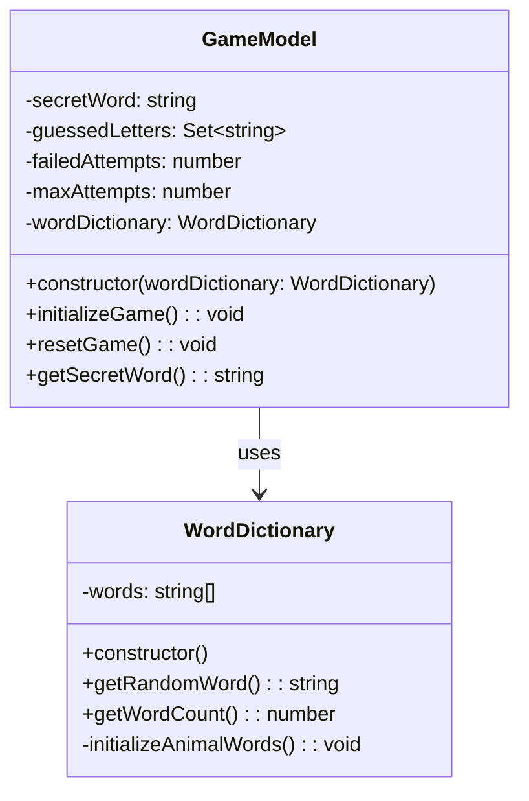
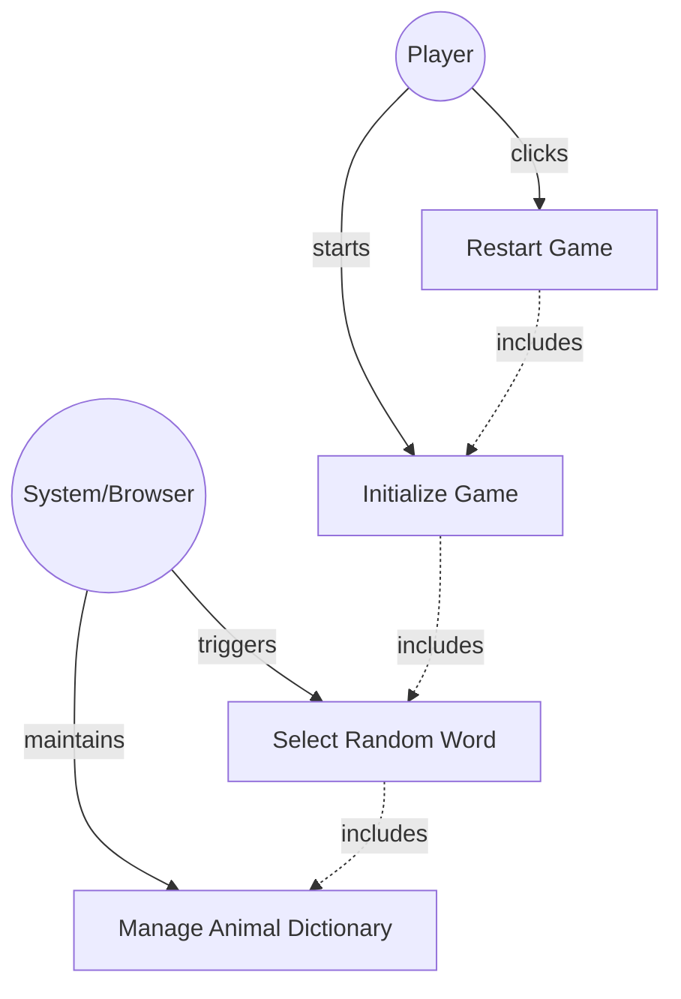

# GLOBAL CONTEXT
**Project:** The Hangman Game - Web Application
**Architecture:** MVC (Model-View-Controller) with TypeScript
**Current module:** Model Layer - Data Management
---
# PROJECT FILE STRUCTURE
```
1-TheHangmanGame/
├── public/
│   └── favicon.ico
├── src/
│   ├── main.ts                    # Entry point
│   ├── models/
│   │   ├── guess-result.ts       # Enumeration for guess outcomes
│   │   ├── word-dictionary.ts    # ← YOU ARE IMPLEMENTING THIS FILE
│   │   └── game-model.ts         # Game logic
│   ├── views/
│   │   ├── game-view.ts          # Main view coordinator
│   │   ├── word-display.ts       # Letter boxes rendering
│   │   ├── alphabet-display.ts   # Alphabet buttons
│   │   ├── hangman-renderer.ts   # Canvas drawing
│   │   └── message-display.ts    # Messages and restart
│   ├── controllers/
│   │   └── game-controller.ts    # Event coordination
│   └── styles/
│       └── main.css              # Custom styles
├── tests/
│   ├── models/
│   │   ├── guess-result.test.ts
│   │   ├── word-dictionary.test.ts  # Tests for this file
│   │   └── game-model.test.ts
│   ├── views/
│   │   ├── word-display.test.ts
│   │   ├── alphabet-display.test.ts
│   │   ├── hangman-renderer.test.ts
│   │   └── message-display.ts
│   └── controllers/
│       └── game-controller.test.ts
├── index.html
├── package.json
├── tsconfig.json
├── vite.config.ts
├── jest.config.js
└── README.md
```
---
# INPUT ARTIFACTS
## 1. Requirements Specification
### Relevant Functional Requirements:
- **FR1:** Initialize the game displaying the word to guess in empty boxes - requires selecting a random word
- **FR8:** Management of animal word dictionary - The system maintains a dictionary of at least 10 animal names and randomly selects one when starting or restarting the game
- **FR9:** Game restart - Upon finishing a game, the user can restart the game through a button, which selects a new random word
### Relevant Non-Functional Requirements:
- **NFR2:** Modular and object-oriented code following MVC architecture
- **NFR3:** Implementation of three separate main classes (this is a supporting class for GameModel)
- **NFR5:** Unit tests with Jest with minimum 80% coverage
- **NFR6:** Complete documentation with JSDoc/TypeDoc
- **NFR7:** Code analysis with ESLint and Google style guide
### Game Context:
- The dictionary must contain **at least 10 animal names**
- Words should be in **UPPERCASE** for consistency
- Each game session requires a **random word selection**
- The same word can be selected multiple times across different games (true randomness)
---
## 2. Class Diagram

**Relationship:** `GameModel` depends on `WordDictionary` to obtain random words when initializing or resetting the game.
---
## 3. Use Case Diagram

**Context:** The WordDictionary is responsible for maintaining the collection of animal names and providing random selections when requested by the GameModel.
---
# SPECIFIC TASK
Implement the class: **`WordDictionary`**
**File location:** `src/models/word-dictionary.ts`
---
## Responsibilities:
1. **Store and manage a collection of animal names** (minimum 10 words)
2. **Provide random word selection** for game initialization and restart
3. **Ensure word format consistency** (all words in UPPERCASE)
4. **Expose dictionary metadata** (word count for potential future features)
---
## Methods to implement:
### 1. **constructor()**
   - **Description:** Initializes the WordDictionary instance and populates the words array with animal names
   - **Parameters:** None
   - **Returns:** Instance of WordDictionary
   - **Preconditions:** None
   - **Postconditions:** 
     - `this.words` array is initialized and populated with at least 10 animal names
     - All words are in UPPERCASE format
   - **Implementation details:**
     - Initialize empty `words` array
     - Call `initializeAnimalWords()` to populate the array
   - **Exceptions to handle:** None (initialization should always succeed)
### 2. **getRandomWord(): string**
   - **Description:** Returns a randomly selected word from the dictionary
   - **Parameters:** None
   - **Returns:** `string` - A random animal name in UPPERCASE
   - **Preconditions:** 
     - The `words` array must be populated (at least 1 word)
   - **Postconditions:** 
     - Returns a valid word from the dictionary
     - The dictionary state remains unchanged (non-destructive read)
   - **Implementation details:**
     - Generate random index between 0 and words.length - 1
     - Return the word at that index
     - Use `Math.random()` and `Math.floor()` for index generation
   - **Exceptions to handle:** 
     - Should never occur if constructor works correctly
     - Optional: Defensive check if words array is empty (throw error or return empty string)
### 3. **getWordCount(): number**
   - **Description:** Returns the total number of words available in the dictionary
   - **Parameters:** None
   - **Returns:** `number` - The count of words in the dictionary
   - **Preconditions:** None
   - **Postconditions:** 
     - Returns the length of the words array
     - Dictionary state unchanged
   - **Implementation details:**
     - Simply return `this.words.length`
   - **Exceptions to handle:** None
   - **Usage:** Useful for testing, debugging, or future features (difficulty levels, statistics)
### 4. **initializeAnimalWords(): void** (private)
   - **Description:** Populates the words array with a predefined list of animal names
   - **Parameters:** None
   - **Returns:** `void`
   - **Preconditions:** 
     - `this.words` array exists (initialized in constructor)
   - **Postconditions:** 
     - `this.words` array contains at least 10 animal names
     - All words are in UPPERCASE
     - Words are suitable for the game (reasonable length, recognizable animals)
   - **Implementation details:**
     - Create an array of animal names (at least 10)
     - All words should be in UPPERCASE
     - Suggested animals: common, recognizable names of varying lengths
     - Assign the array to `this.words`
   - **Recommended animal list (suggestions):**
     - Short words (3-5 letters): CAT, DOG, FOX, BEAR, DEER
     - Medium words (6-8 letters): ELEPHANT, GIRAFFE, DOLPHIN, PENGUIN, TIGER
     - Long words (9+ letters): RHINOCEROS, CHIMPANZEE, CROCODILE
   - **Exceptions to handle:** None (static data initialization)
---
## Dependencies:
- **Classes it must use:** None (standalone class)
- **Interfaces it implements:** None
- **External services it consumes:** None
- **Classes that depend on this:** 
  - `GameModel` - uses WordDictionary to get random words
---
# CONSTRAINTS AND STANDARDS
## Code:
- **Language:** TypeScript 5.6.3
- **Module system:** ES6 modules (ESNext)
- **Code style:** Google TypeScript Style Guide
  - Class name: PascalCase (`WordDictionary`)
  - Method names: camelCase (`getRandomWord`, `getWordCount`, `initializeAnimalWords`)
  - Private methods: prefix with `private` keyword
  - Constants: UPPER_CASE if extracted (optional)
- **Maximum cyclomatic complexity:** 5 (methods are simple, no complex branching needed)
- **Maximum method length:** 20 lines (all methods should be concise)
## Mandatory best practices:
- **Application of SOLID principles:**
  - **SRP (Single Responsibility):** Class only manages word dictionary
  - **OCP (Open/Closed):** Can be extended to support multiple word sources without modification
  - **LSP, ISP, DIP:** Not directly applicable for this simple class
  
- **Input parameter validation:** 
  - Not applicable (no external inputs - methods have no parameters except constructor)
  - Optional: Defensive check in `getRandomWord()` if words array is empty
  
- **Robust exception handling:**
  - Not critical for this class (no risky operations)
  - Optional: Throw error in `getRandomWord()` if dictionary is empty
  
- **Logging at critical points:**
  - Not required for this simple class
  - Optional: Console log for debugging during development
  
- **Comments for complex logic:**
  - Comment the random index calculation in `getRandomWord()`
  - No other complex logic expected
## TypeScript-specific requirements:
- Use TypeScript type annotations for all methods
- Declare `words` as `private words: string[]`
- Use `public` keyword for public methods (or omit, public is default)
- Use `private` keyword for `initializeAnimalWords()`
- Return type annotations on all methods
## Documentation requirements:
- **JSDoc comment block** for the class
- **JSDoc comments** for all public methods (`getRandomWord`, `getWordCount`)
- **JSDoc comment** for constructor
- **Optional:** JSDoc for private method `initializeAnimalWords()` (recommended for clarity)
- Include `@category Model` tag for TypeDoc organization
- Use proper JSDoc tags: `@returns`, `@throws` (if applicable), `@private`
---
# DELIVERABLES
## 1. Complete source code of the class with:
- **File header comment** with brief description
- **Import statements** (none expected)
- **Class declaration** with JSDoc documentation
- **Private property:** `words: string[]`
- **Constructor implementation**
- **All public methods implemented:** `getRandomWord()`, `getWordCount()`
- **Private method implemented:** `initializeAnimalWords()`
- **Proper exports:** `export class WordDictionary { ... }`
## 2. Inline documentation:
- **JSDoc for class:** Explain WordDictionary's purpose
- **JSDoc for constructor:** Explain initialization
- **JSDoc for each public method:** Parameters, return values, purpose
- **Inline comment:** Explain random index calculation logic
- **Category tag:** `@category Model`
## 3. New dependencies:
- **None** - This class uses only native JavaScript/TypeScript features
- Uses `Math.random()` and `Math.floor()` (built-in)
## 4. Edge cases considered:
- **Empty dictionary:** Should never occur if `initializeAnimalWords()` works correctly
  - Optional: Defensive check in `getRandomWord()`
- **Random distribution:** `Math.random()` provides uniform distribution (acceptable for this use case)
- **Word format consistency:** All words initialized in UPPERCASE
- **Word repetition:** Same word can be selected multiple times (intentional, true randomness)
---
# OUTPUT FORMAT
```typescript
[Complete code here]
```
---
## Design decisions made:
- **[Decision 1 and its justification]**
- **[Decision 2 and its justification]**
- ...
---
## Possible future improvements:
- **[Improvement 1]**
- **[Improvement 2]**
- ...
---
## Testing considerations:
Unit tests should verify:
1. **Constructor initializes words array:** `expect(dictionary.getWordCount()).toBeGreaterThanOrEqual(10)`
2. **getRandomWord returns valid word:** Check that returned word exists in expected list
3. **getRandomWord returns uppercase:** `expect(word).toBe(word.toUpperCase())`
4. **getWordCount returns correct count:** Match expected number of words
5. **Random distribution (optional):** Call `getRandomWord()` 100 times, verify all words can be selected
---
## Suggested animal word list:
Include at least 10 animals with varying lengths for game variety:
**Short (3-5 letters):**
- CAT, DOG, FOX, BEAR, LION, DEER, SEAL, FROG, DUCK
**Medium (6-8 letters):**
- ELEPHANT, GIRAFFE, DOLPHIN, PENGUIN, CHEETAH, GORILLA, LEOPARD, RACCOON
**Long (9+ letters):**
- RHINOCEROS, CROCODILE, CHIMPANZEE, ALLIGATOR, BUTTERFLY
**Minimum requirement:** At least 10 words. You can include more for variety.
---
**Note:** This class provides the foundation for word selection in the game. It should be simple, reliable, and easily testable.
