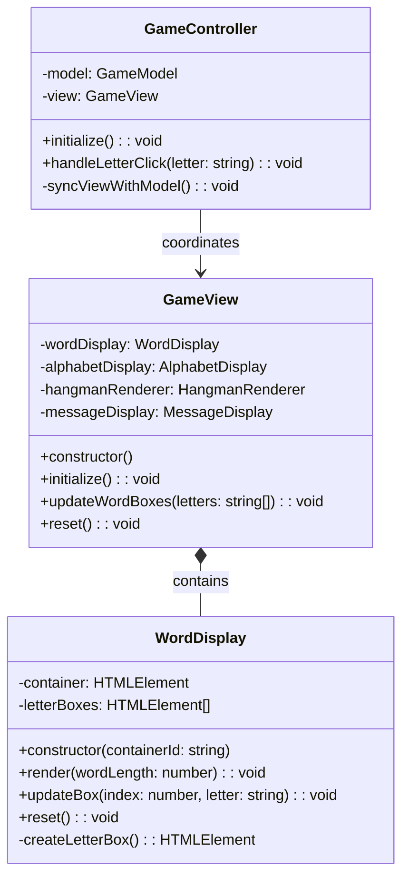
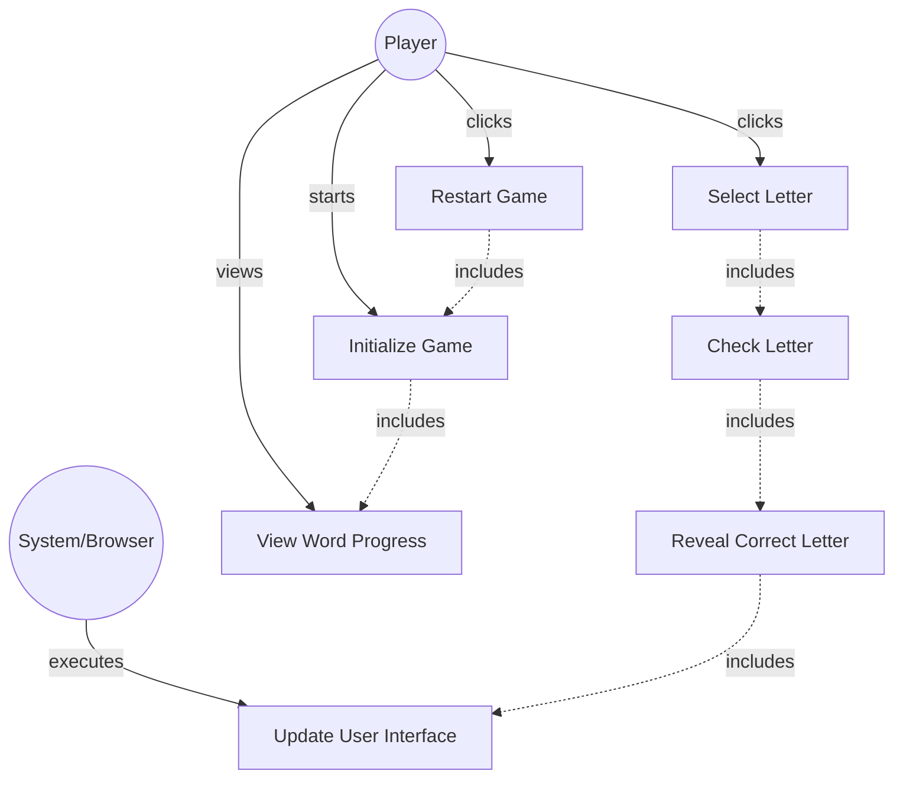

# GLOBAL CONTEXT

**Project:** The Hangman Game - Web Application

**Architecture:** MVC (Model-View-Controller) with TypeScript

**Current module:** View Layer - UI Components

---

# PROJECT FILE STRUCTURE

```
1-TheHangmanGame/
├── public/
│   └── favicon.ico
├── src/
│   ├── main.ts                    # Entry point
│   ├── models/
│   │   ├── guess-result.ts       # Enumeration for guess outcomes
│   │   ├── word-dictionary.ts    # Word management
│   │   └── game-model.ts         # Game logic
│   ├── views/
│   │   ├── game-view.ts          # Main view coordinator
│   │   ├── word-display.ts       # ← YOU ARE IMPLEMENTING THIS FILE
│   │   ├── alphabet-display.ts   # Alphabet buttons
│   │   ├── hangman-renderer.ts   # Canvas drawing
│   │   └── message-display.ts    # Messages and restart
│   ├── controllers/
│   │   └── game-controller.ts    # Event coordination
│   └── styles/
│       └── main.css              # Custom styles
├── tests/
│   ├── models/
│   │   ├── guess-result.test.ts
│   │   ├── word-dictionary.test.ts
│   │   └── game-model.test.ts
│   ├── views/
│   │   ├── word-display.test.ts   # Tests for this file
│   │   ├── alphabet-display.test.ts
│   │   ├── hangman-renderer.test.ts
│   │   └── message-display.test.ts
│   └── controllers/
│       └── game-controller.test.ts
├── index.html
├── package.json
├── tsconfig.json
├── vite.config.ts
├── jest.config.js
└── README.md
```

---

# INPUT ARTIFACTS

## 1. Requirements Specification

### Relevant Functional Requirements:

- **FR1:** Initialize the game displaying the word to guess in empty boxes - word is displayed as empty boxes (underscores)
- **FR3:** Reveal all occurrences of correct letters - If the selected letter is in the word, all its occurrences are revealed simultaneously in the corresponding boxes
- **FR9:** Game restart - Restart resets all states including the word display

### Relevant Non-Functional Requirements:

- **NFR2:** Modular and object-oriented code following MVC architecture
- **NFR4:** Use of Bulma for interface styling - HTML elements use Bulma classes
- **NFR5:** Unit tests with Jest with minimum 80% coverage
- **NFR6:** Complete documentation with JSDoc/TypeDoc
- **NFR7:** Code analysis with ESLint and Google style guide
- **NFR8:** Immediate response time when selecting letters - Interface updates in less than 200ms

### Visual Specifications (from HTML/CSS prompt):

**Word Display Section (`#word-container`):**
- Dynamic container displaying empty letter boxes initially
- Each box represents one letter of the secret word
- **Box specifications:**
  - Width: 50px, Height: 60px (desktop)
  - Width: 40px, Height: 50px (mobile)
  - Border: 2px solid primary color (#3273dc)
  - Border-radius: 8px
  - White background
  - Font-size: 2rem (desktop), 1.5rem (mobile)
  - Font-weight: bold
  - Centered content (flex display)
- Boxes arranged horizontally with flex-wrap for responsive behavior
- Gap between boxes: 0.5rem
- **CSS class:** `.letter-box`

---

## 2. Class Diagram



**Relationship:** `WordDisplay` is a component of `GameView` responsible for rendering and updating the word letter boxes.

---

## 3. Use Case Diagram



**Context:** WordDisplay handles the visual representation of the secret word, showing empty boxes initially and revealing letters as they are guessed correctly.

---

# SPECIFIC TASK

Implement the class: **`WordDisplay`**

**File location:** `src/views/word-display.ts`

---

## Responsibilities:

1. **Manage the visual display of the word being guessed**
2. **Create letter boxes dynamically** based on word length
3. **Update individual boxes** when letters are revealed
4. **Reset the display** for new games
5. **Maintain reference to letter box elements** for efficient updates

---

## Properties (Private):

- **container: HTMLElement** - The DOM container element that holds all letter boxes (the `#word-container` div from HTML)
- **letterBoxes: HTMLElement[]** - Array of letter box div elements for direct access and updates

---

## Methods to implement:

### 1. **constructor(containerId: string)**
   - **Description:** Creates a new WordDisplay instance and captures reference to the container element
   - **Parameters:** 
     - `containerId: string` - The ID of the container HTML element (should be `"word-container"`)
   - **Returns:** Instance of WordDisplay
   - **Preconditions:** 
     - An HTML element with the specified ID must exist in the DOM
   - **Postconditions:** 
     - `this.container` references the DOM element
     - `this.letterBoxes` is initialized as empty array
   - **Implementation details:**
     - Use `document.getElementById(containerId)` to get the container element
     - Check if element exists, throw error if not found with descriptive message
     - Initialize `letterBoxes` as empty array `[]`
   - **Error handling:**
     - Throw Error if element not found: `throw new Error(\`Element with id "${containerId}" not found\`)`
   - **Example usage:**
     ```typescript
     const wordDisplay = new WordDisplay('word-container');
     ```

### 2. **render(wordLength: number): void**
   - **Description:** Renders the initial word display with empty boxes based on word length
   - **Parameters:** 
     - `wordLength: number` - The number of letters in the secret word
   - **Returns:** `void`
   - **Preconditions:** 
     - `wordLength` must be a positive integer (> 0)
     - Container element must exist
   - **Postconditions:** 
     - Container is cleared of any previous content
     - `wordLength` number of empty letter boxes are created and added to container
     - `letterBoxes` array contains references to all created box elements
   - **Implementation details:**
     - Clear container: `this.container.innerHTML = ''`
     - Clear letterBoxes array: `this.letterBoxes = []`
     - Loop `wordLength` times:
       - Create a letter box using `createLetterBox()`
       - Add box to container: `this.container.appendChild(box)`
       - Add box to letterBoxes array: `this.letterBoxes.push(box)`
   - **Exceptions to handle:**
     - Optional: Validate wordLength is positive number
   - **Example:**
     ```typescript
     wordDisplay.render(8); // Creates 8 empty boxes for "ELEPHANT"
     ```

### 3. **updateBox(index: number, letter: string): void**
   - **Description:** Updates a specific letter box with a revealed letter
   - **Parameters:** 
     - `index: number` - The position of the letter (0-based index)
     - `letter: string` - The letter to display (should be uppercase)
   - **Returns:** `void`
   - **Preconditions:** 
     - `index` must be valid (0 <= index < letterBoxes.length)
     - Letter boxes must have been rendered
   - **Postconditions:** 
     - The letter box at the specified index displays the letter
     - Letter is shown in uppercase
   - **Implementation details:**
     - Validate index is within bounds (optional but recommended)
     - Get the box element: `const box = this.letterBoxes[index]`
     - Set the text content: `box.textContent = letter.toUpperCase()`
   - **Exceptions to handle:**
     - Optional: Check if index is valid, throw error if out of bounds
     - Optional: Check if letterBoxes array is populated
   - **Example:**
     ```typescript
     wordDisplay.updateBox(0, 'E'); // Shows 'E' in first box
     wordDisplay.updateBox(2, 'E'); // Shows 'E' in third box
     ```

### 4. **reset(): void**
   - **Description:** Resets the display by clearing all letter boxes from the container
   - **Parameters:** None
   - **Returns:** `void`
   - **Preconditions:** None
   - **Postconditions:** 
     - Container is empty (no letter boxes)
     - `letterBoxes` array is empty
   - **Implementation details:**
     - Clear container HTML: `this.container.innerHTML = ''`
     - Clear letterBoxes array: `this.letterBoxes = []`
   - **Exceptions to handle:** None
   - **Usage context:** Called when starting a new game to prepare for new word
   - **Note:** After reset, `render()` must be called to display new word boxes

### 5. **createLetterBox(): HTMLElement** (private)
   - **Description:** Creates a single letter box div element with appropriate styling
   - **Parameters:** None
   - **Returns:** `HTMLElement` - A div element configured as a letter box
   - **Preconditions:** None
   - **Postconditions:** 
     - Returns a div element with class `letter-box`
     - Element is ready to be added to the DOM
   - **Implementation details:**
     - Create div element: `const box = document.createElement('div')`
     - Add CSS class: `box.classList.add('letter-box')`
     - Initially empty (no text content)
     - Return the element
   - **CSS class applied:** `.letter-box` (defined in `src/styles/main.css`)
   - **Note:** The CSS class handles all styling (size, border, font, etc.)
   - **Example resulting HTML:**
     ```html
     <div class="letter-box"></div>
     ```

---

## Dependencies:

- **Classes it must use:** None (pure DOM manipulation)
- **Interfaces it implements:** None
- **External services it consumes:** 
  - DOM API (`document.getElementById`, `document.createElement`, `appendChild`, etc.)
- **Classes that depend on this:** 
  - `GameView` - composes WordDisplay and calls its methods

---

# CONSTRAINTS AND STANDARDS

## Code:

- **Language:** TypeScript 5.6.3
- **Module system:** ES6 modules (ESNext)
- **Code style:** Google TypeScript Style Guide
  - Class name: PascalCase (`WordDisplay`)
  - Method names: camelCase
  - Private methods: use `private` keyword
  - Constants: UPPER_CASE if extracted
- **Maximum cyclomatic complexity:** 5 (methods are simple DOM operations)
- **Maximum method length:** 30 lines (all methods should be concise)

## Mandatory best practices:

- **Application of SOLID principles:**
  - **SRP (Single Responsibility):** Only handles word box display, nothing else
  - **OCP (Open/Closed):** Can be extended without modification
  
- **Input parameter validation:**
  - Validate `containerId` exists in constructor (throw error if not)
  - Optional: Validate `index` bounds in `updateBox()`
  - Optional: Validate `wordLength` is positive in `render()`
  
- **Robust exception handling:**
  - Constructor must throw error if container element not found
  - Consider bounds checking in updateBox
  
- **Logging at critical points:**
  - Not required for this simple view component
  - Optional: Console log for debugging during development
  
- **Comments for complex logic:**
  - Comment the rendering loop in `render()`
  - No other complex logic expected

## TypeScript-specific requirements:

- Use TypeScript type annotations for all parameters and return types
- Use `HTMLElement` type for DOM elements
- Use array type annotation: `HTMLElement[]`
- Proper null checking when getting elements from DOM
- Use proper access modifiers: `public`, `private`

## Documentation requirements:

- **JSDoc comment block** for the class
- **JSDoc comments** for all public methods
- **JSDoc comment** for constructor
- **Optional:** JSDoc for private method `createLetterBox()`
- Include `@category View` tag for TypeDoc organization
- Use proper JSDoc tags: `@param`, `@returns`, `@throws`

## Security:

- **XSS Prevention:** Use `textContent` instead of `innerHTML` when setting letter text (prevents script injection)
- **DOM Manipulation Safety:** Validate elements exist before manipulation

---

# DELIVERABLES

## 1. Complete source code of the class with:

- **File header comment** with brief description
- **Import statements** (none expected for this file)
- **Class declaration** with JSDoc documentation
- **Private properties** with type annotations
- **Constructor implementation** with element validation
- **All public methods implemented** (3 public methods: render, updateBox, reset)
- **Private method implemented:** `createLetterBox()`
- **Proper exports:** `export class WordDisplay { ... }`

## 2. Inline documentation:

- **JSDoc for class:** Explain WordDisplay's purpose
- **JSDoc for constructor:** Explain containerId parameter and error handling
- **JSDoc for each public method:** Parameters, return values, purpose
- **Inline comment:** Explain rendering loop logic
- **Category tag:** `@category View`

## 3. New dependencies:

- **None** - Uses only native DOM APIs (browser built-ins)
- All DOM manipulation uses standard APIs

## 4. Edge cases considered:

- **Container not found:** Constructor throws descriptive error
- **Invalid index in updateBox:** Optional bounds checking
- **Empty word (wordLength = 0):** Renders no boxes (valid but unusual)
- **Reset before render:** Safe, just clears empty container
- **Multiple renders without reset:** Previous boxes are cleared automatically
- **Letter case normalization:** Letters always displayed in uppercase

---

# OUTPUT FORMAT

```typescript
[Complete code here]
```

---

## Design decisions made:

- **[Decision 1 and its justification]**
- **[Decision 2 and its justification]**
- ...

---

## Possible future improvements:

- **[Improvement 1]**
- **[Improvement 2]**
- ...

---

## Testing considerations:

Unit tests should verify:

1. **Constructor throws error if container not found:** Mock DOM and test error
2. **Constructor succeeds with valid container:** Verify container reference stored
3. **render() creates correct number of boxes:** Check letterBoxes array length
4. **render() adds boxes to container:** Verify container children count
5. **render() clears previous boxes:** Call render twice, verify only new boxes exist
6. **updateBox() sets letter correctly:** Set letter, verify textContent
7. **updateBox() converts to uppercase:** Set lowercase, verify uppercase displayed
8. **reset() clears container:** Render then reset, verify container is empty
9. **reset() clears letterBoxes array:** Verify array length is 0 after reset
10. **createLetterBox() creates element with correct class:** Verify classList contains 'letter-box'

**Jest DOM Testing:**
```typescript
// Example test structure
describe('WordDisplay', () => {
  let container: HTMLElement;
  let wordDisplay: WordDisplay;

  beforeEach(() => {
    document.body.innerHTML = '<div id="word-container"></div>';
    container = document.getElementById('word-container')!;
    wordDisplay = new WordDisplay('word-container');
  });

  test('should render correct number of boxes', () => {
    wordDisplay.render(5);
    expect(container.children.length).toBe(5);
  });
});
```

## CSS Integration:

**WordDisplay should only:**
- Create elements with the correct class
- Set text content
- Manage DOM structure

**WordDisplay should NOT:**
- Apply inline styles
- Manipulate CSS classes beyond initial setup
- Handle responsive design (CSS handles this)

---

**Note:** This is a straightforward view component focused on DOM manipulation. Keep it simple, focused, and easily testable.
