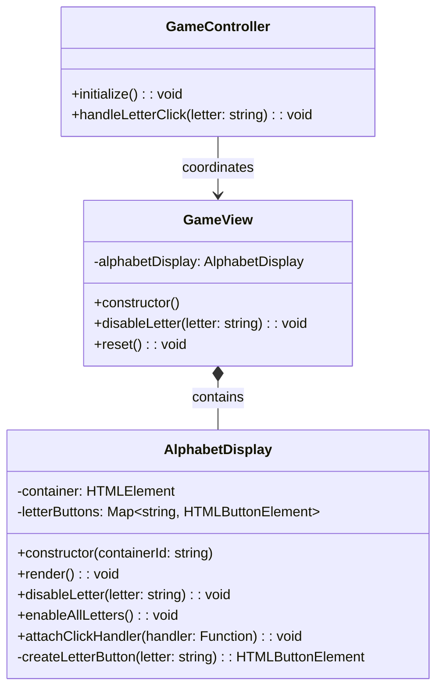

# REVIEW CONTEXT

**Project:** The Hangman Game - Web Application

**Component reviewed:** `AlphabetDisplay` (Class)

**Component objective:** Manage the visual display of interactive alphabet buttons (A-Z). Creates 26 clickable letter buttons dynamically, manages their enabled/disabled state, attaches click event handlers for user interaction, and provides methods to disable individual letters and re-enable all letters for game restart. Part of the View layer in MVC architecture.

---

# REQUIREMENTS SPECIFICATION

## Relevant Functional Requirements:

- **FR2:** Letter selection by the user through click - When clicking on a letter of the alphabet, it is marked as selected (no longer clickable) and the system processes whether it is correct or incorrect
- **FR9:** Game restart - Restart resets all states including re-enabling all alphabet letters
- **FR10:** Disable already selected letters - Once the user selects a letter, it must be visually marked and cannot be selected again in the same game

## Relevant Non-Functional Requirements:

- **NFR2:** Modular and object-oriented code following MVC architecture
- **NFR4:** Use of Bulma for interface styling - HTML elements use Bulma classes with consistent design
- **NFR5:** Unit tests with Jest with minimum 80% coverage
- **NFR6:** Complete documentation with JSDoc/TypeDoc
- **NFR7:** Code analysis with ESLint and Google style guide
- **NFR8:** Immediate response time when selecting letters - Interface updates in less than 200ms

## Visual Specifications:

**Alphabet Display Section (`#alphabet-container`):**
- Interactive alphabet buttons (26 letters: A-Z)
- **Button specifications:**
  - Width: 45px, Height: 45px (desktop)
  - Width: 40px, Height: 40px (mobile)
  - Font-size: 1.25rem (desktop), 1rem (mobile)
  - Font-weight: bold
  - Border: 2px solid primary color (#3273dc)
  - Background: white initially
  - Color: primary color initially
  - Border-radius: 8px
  - Cursor: pointer
  - Transition: all 0.2s
- **Hover effect (enabled buttons only):**
  - Background changes to primary color
  - Text color changes to white
  - Transform: translateY(-2px)
- **Disabled state (after selection):**
  - Opacity: 0.5
  - Cursor: not-allowed
  - No hover effects
- Arranged with flexbox, wrapped, centered
- Gap between buttons: 0.5rem
- **CSS class:** `.letter-button`

---

# CLASS DIAGRAM



**Relationships:**
- AlphabetDisplay is composed by GameView (Composite Pattern)
- AlphabetDisplay manages alphabet button rendering and state
- GameController attaches event handlers through GameView

---

# CODE TO REVIEW

```typescript
(Referenced Code)
```

---

# EVALUATION CRITERIA

## 1. DESIGN ADHERENCE (Weight: 30%)

**Checklist - Class Structure:**
- [ ] Class name is `AlphabetDisplay` (PascalCase)
- [ ] Has 2 private properties: `container: HTMLElement`, `letterButtons: Map<string, HTMLButtonElement>`
- [ ] Uses `Map` (not plain object or array) for efficient letter-to-button lookup
- [ ] Constructor accepts `containerId: string` parameter
- [ ] Properly exported: `export class AlphabetDisplay`

**Checklist - Methods (6 total):**
- [ ] `constructor(containerId: string)` - public
- [ ] `render(): void` - public
- [ ] `disableLetter(letter: string): void` - public
- [ ] `enableAllLetters(): void` - public
- [ ] `attachClickHandler(handler: (letter: string) => void): void` - public
- [ ] `createLetterButton(letter: string): HTMLButtonElement` - private

**Checklist - DOM Integration:**
- [ ] Uses `document.getElementById()` to get container
- [ ] Uses `document.createElement('button')` for letter buttons
- [ ] Uses `addEventListener('click', ...)` for event handling
- [ ] Uses `.classList.add('letter-button')` for CSS styling
- [ ] Sets `button.type = 'button'` to prevent form submission
- [ ] Uses `button.disabled = true/false` for state management

**Checklist - Relationships:**
- [ ] No dependencies on other classes (pure View component)
- [ ] No imports needed (only uses DOM API)
- [ ] Can be composed by GameView

**Score:** __/10

**Observations:**
- [Verify all methods match signatures from diagram]
- [Check Map usage for efficient button lookup]
- [Confirm event handlers properly attached]

---

## 2. CODE QUALITY (Weight: 25%)

**Analyze using these metrics:**

### Complexity Analysis:
- [ ] `constructor()`: Low (O(1) - get element, throw error if not found)
- [ ] `render()`: Linear (O(26) - loop through alphabet, constant)
- [ ] `disableLetter()`: Low (O(1) - Map lookup)
- [ ] `enableAllLetters()`: Linear (O(26) - iterate through Map, constant)
- [ ] `attachClickHandler()`: Linear (O(26) - attach to all buttons, constant)
- [ ] `createLetterButton()`: Low (O(1) - create single element)

**Cyclomatic Complexity:**
- [ ] `constructor()`: 2 (check if element exists)
- [ ] `render()`: 2 (loop through alphabet)
- [ ] `disableLetter()`: 2-3 (normalize case, optional check if button exists)
- [ ] `enableAllLetters()`: 2 (iterate Map entries)
- [ ] `attachClickHandler()`: 2 (iterate Map entries)
- [ ] `createLetterButton()`: 1 (no branching)
- [ ] All methods should be under complexity of 5

### Coupling:
- [ ] Fan-in: Low (only GameView depends on it)
- [ ] Fan-out: Zero (no dependencies, only DOM API)
- [ ] Excellent: Minimal coupling, highly reusable

### Cohesion:
- [ ] All methods relate to alphabet button display and state
- [ ] High cohesion expected - single responsibility

### Code Smells:
- [ ] **Long Method:** 
  - `render()` might be 15-20 lines with loop (acceptable)
  - All other methods should be under 10 lines
  
- [ ] **Large Class:** 
  - Only 6 methods, 2 properties (small, focused class)
  
- [ ] **Feature Envy:** 
  - Should not access properties of other objects
  - Only manipulates its own container and buttons
  
- [ ] **Code Duplication:** 
  - Check if alphabet string is defined multiple times
  - Check if CSS class name is repeated
  - Check if letter normalization is duplicated
  
- [ ] **Magic Strings:** 
  - Alphabet "ABCDEFGHIJKLMNOPQRSTUVWXYZ" should be constant
  - CSS class name should be constant (optional)
  
- [ ] **Primitive Obsession:**
  - Uses Map<string, HTMLButtonElement> (good)
  - Proper types for DOM elements
  
- [ ] **Data Clumps:**
  - Not applicable in this simple class

**Score:** __/10

**Detected code smells:** [List any issues]

---

## 3. REQUIREMENTS COMPLIANCE (Weight: 25%)

**Checklist - Functional Requirements:**

### FR2 - Letter Selection:
- [ ] Buttons are clickable (button elements, not divs)
- [ ] Event handlers can be attached via `attachClickHandler()`
- [ ] Disabled buttons are not clickable (native HTML disabled attribute)
- [ ] Visual feedback through CSS (disabled styling)

### FR9 - Game Restart:
- [ ] `enableAllLetters()` re-enables all 26 buttons
- [ ] All buttons return to clickable state
- [ ] Visual state reset (opacity back to 1.0)

### FR10 - Disable Selected Letters:
- [ ] `disableLetter()` disables specific button
- [ ] Uses native `disabled` attribute (semantic HTML)
- [ ] Disabled buttons show visual feedback (CSS handles opacity, cursor)
- [ ] Disabled buttons cannot be clicked again

### Button Requirements:
- [ ] Exactly 26 buttons created (A-Z)
- [ ] Each button displays its letter
- [ ] Buttons stored in Map with letter as key
- [ ] Buttons have CSS class `.letter-button`
- [ ] Button type set to "button" (not "submit")

### Event Handling:
- [ ] `attachClickHandler()` accepts function parameter
- [ ] Handler receives letter as parameter when clicked
- [ ] Handler called with uppercase letter
- [ ] Event listeners attached to all 26 buttons

### Edge Cases:
- [ ] Container not found: Constructor throws error
- [ ] disableLetter with lowercase: Normalizes to uppercase
- [ ] disableLetter with invalid letter: Optional defensive check
- [ ] enableAllLetters on already enabled: Idempotent (no error)
- [ ] attachClickHandler called multiple times: Adds multiple listeners (acceptable pattern)
- [ ] disableLetter on already disabled: Idempotent (no error)

### Performance:
- [ ] Map.get() for O(1) letter lookup in disableLetter()
- [ ] Map.forEach() for efficient iteration in enableAllLetters()
- [ ] Event delegation NOT used (26 buttons is acceptable)

**Score:** __/10

**Unmet requirements:** [List any missing functionality]

---

## 4. MAINTAINABILITY (Weight: 10%)

**Checklist - Naming:**
- [ ] Class name `AlphabetDisplay` clearly indicates purpose
- [ ] Method names are descriptive: `render`, `disableLetter`, `enableAllLetters`, `attachClickHandler`
- [ ] Property names are clear: `container`, `letterButtons`
- [ ] Parameter names are meaningful: `containerId`, `letter`, `handler`
- [ ] Private method clearly named: `createLetterButton`
- [ ] Map key/value types descriptive: `Map<string, HTMLButtonElement>`

**Checklist - Documentation:**
- [ ] JSDoc comment block for the class
- [ ] JSDoc for constructor explaining containerId and error handling
- [ ] JSDoc for `render()` explaining alphabet creation
- [ ] JSDoc for `disableLetter()` with @param for letter
- [ ] JSDoc for `enableAllLetters()` explaining use case
- [ ] JSDoc for `attachClickHandler()` with @param for handler function
- [ ] JSDoc for private `createLetterButton()` (optional but recommended)
- [ ] Includes `@category View` tag for TypeDoc
- [ ] File header comment present

**Checklist - Comments:**
- [ ] Comment explaining alphabet rendering loop
- [ ] Comment explaining Map usage for efficient lookup
- [ ] Comment explaining event handler attachment
- [ ] No redundant comments (e.g., "create button" for createElement)
- [ ] No commented-out code

**Checklist - Self-documenting Code:**
- [ ] Method names clearly indicate actions
- [ ] Logic flow is straightforward
- [ ] Variable names explain their purpose (e.g., `const alphabet = 'ABCDEFGHIJKLMNOPQRSTUVWXYZ'`)

**Score:** __/10

**Documentation issues:** [List missing or unclear documentation]

---

## 5. BEST PRACTICES (Weight: 10%)

**Checklist - SOLID Principles:**

- [ ] **SRP (Single Responsibility):** 
  - Class only handles alphabet button display and state
  - No game logic, no other UI concerns
  
- [ ] **OCP (Open/Closed):** 
  - Can extend with animations without modifying existing code
  
- [ ] **LSP, ISP, DIP:** 
  - Not directly applicable (no inheritance/interfaces)

**Checklist - Other Principles:**

- [ ] **DRY (Don't Repeat Yourself):**
  - `createLetterButton()` avoids duplicating button creation
  - Letter normalization done once per method call
  - Alphabet string defined once
  
- [ ] **KISS (Keep It Simple):**
  - Methods are simple and focused
  - No unnecessary complexity
  
- [ ] **Separation of Concerns:**
  - No business logic in view component
  - Only handles DOM manipulation and event attachment

**Checklist - Event Handling Best Practices:**
- [ ] Uses addEventListener (not inline onclick)
- [ ] Event listeners properly scoped (arrow functions or bind)
- [ ] Handler receives letter parameter (not button element)
- [ ] No memory leaks (listeners can be garbage collected)

**Checklist - Accessibility:**
- [ ] Uses semantic `<button>` elements (keyboard accessible)
- [ ] Uses native `disabled` attribute (screen reader aware)
- [ ] Optional: aria-label on buttons ("Letter A", "Letter B", etc.)
- [ ] Optional: aria-pressed attribute to indicate state
- [ ] Focus styles handled by CSS

**Checklist - DOM Best Practices:**
- [ ] Gets container element once in constructor
- [ ] Stores button references in Map for efficient lookup
- [ ] Uses `innerHTML = ''` for clearing (efficient)
- [ ] Uses `type="button"` to prevent form submission
- [ ] No memory leaks (buttons properly managed)

**Checklist - TypeScript Best Practices:**
- [ ] Type annotations on all parameters and return types
- [ ] Proper use of `HTMLElement` and `HTMLButtonElement` types
- [ ] Proper use of `Map<string, HTMLButtonElement>` type
- [ ] Function type for handler: `(letter: string) => void`
- [ ] Null checking when getting DOM elements
- [ ] Private/public keywords used correctly
- [ ] No use of `any` type

**Checklist - Google Style Guide Compliance:**
- [ ] Class name: PascalCase ✓
- [ ] Method names: camelCase ✓
- [ ] Property names: camelCase ✓
- [ ] Constant: UPPER_CASE (for ALPHABET if extracted)
- [ ] Indentation: 2 spaces
- [ ] Max line length: 100 characters
- [ ] Semicolons present
- [ ] No trailing spaces

**Score:** __/10

**Best practice violations:** [List any issues]

---

# DELIVERABLES

## Review Report:

**Total Score:** __/10 (weighted average)

Formula: `(Design×0.30) + (Quality×0.25) + (Requirements×0.25) + (Maintainability×0.10) + (BestPractices×0.10)`

---

**Executive Summary:**

[2-3 lines about the general state of the code - to be filled after reviewing actual code]

Example: "The AlphabetDisplay class provides a robust implementation for managing interactive alphabet buttons with efficient state management using a Map. All 26 buttons are properly created with event handling and accessibility features. The component correctly separates view concerns from business logic and follows best practices for DOM manipulation."

---

**Critical Issues (Blockers):**

[Only if there are severe problems]

Example issues to check:

1. **Constructor doesn't throw error if container not found** - Line [X]
   - Impact: Silent failure, other methods will crash with null reference
   - Proposed solution: Add validation and throw descriptive error

2. **letterButtons is array instead of Map** - Line [X]
   - Impact: O(n) lookup instead of O(1), inefficient for disableLetter
   - Proposed solution: Change to `Map<string, HTMLButtonElement>`

3. **render() doesn't populate letterButtons Map** - Line [X]
   - Impact: disableLetter() cannot find buttons, will fail
   - Proposed solution: Add `this.letterButtons.set(letter, button)` in loop

4. **disableLetter() doesn't normalize letter case** - Line [X]
   - Impact: Lowercase letters won't be found in Map (keys are uppercase)
   - Proposed solution: Add `letter = letter.toUpperCase()`

5. **attachClickHandler() doesn't pass letter to handler** - Line [X]
   - Impact: Controller doesn't know which letter was clicked
   - Proposed solution: Call handler with letter: `handler(letter)`

6. **Buttons don't have type="button"** - Line [X]
   - Impact: May trigger form submission if inside form
   - Proposed solution: Set `button.type = 'button'`

7. **createLetterButton() not implemented** - Not found
   - Impact: Code duplication in render(), violates DRY principle
   - Proposed solution: Extract button creation into private method

8. **Class not exported** - Line [X]
   - Impact: Cannot be imported by GameView
   - Proposed solution: Add `export` keyword

---

**Minor Issues (Suggested improvements):**

[Non-critical issues]

Example issues to check:

1. **Alphabet string defined multiple times** - Lines [X, Y]
   - Suggestion: Extract as constant: `private readonly ALPHABET = 'ABCDEFGHIJKLMNOPQRSTUVWXYZ';`

2. **No defensive check in disableLetter()** - Line [X]
   - Suggestion: Check if button exists before disabling: `if (!button) return;`

3. **Missing JSDoc documentation** - Lines [X-Y]
   - Suggestion: Add JSDoc comments for class and all methods

4. **CSS class name hardcoded** - Line [X]
   - Suggestion: Extract as constant (optional): `private readonly BUTTON_CLASS = 'letter-button';`

5. **No file header comment** - Line [1]
   - Suggestion: Add brief file description

6. **Missing @category tag** - Line [X]
   - Suggestion: Add `@category View` to class JSDoc

7. **attachClickHandler allows multiple attachments** - Line [X]
   - Note: This is acceptable behavior, but could document it
   - Suggestion: Document that multiple handlers can be attached

8. **No ARIA labels for accessibility** - Lines [X-Y]
   - Suggestion: Add `button.setAttribute('aria-label', \`Letter ${letter}\`)`

9. **render() doesn't clear previous buttons** - Line [X]
   - Suggestion: Clear container and Map at start: `this.container.innerHTML = ''; this.letterButtons.clear();`

---

**Positive Aspects:**

[Highlight what was done well]

Examples:
- Clean, focused class with single responsibility
- All 6 methods from class diagram implemented
- Efficient use of Map for O(1) button lookup
- Proper use of semantic button elements
- Native disabled attribute for accessibility
- Event handlers properly attached with addEventListener
- No dependencies on other classes (highly reusable)
- Clear separation of concerns (no game logic)
- Type-safe with TypeScript Map and HTMLButtonElement
- Follows MVC pattern correctly
- Good method naming with clear purpose
- Idempotent operations (disableLetter, enableAllLetters)

---

**Decision:**

- [ ] ✅ **APPROVED** - Ready for integration
  - *Use if: All methods present, uses Map, proper event handling, normalizes case, error handling in constructor, well documented*

- [ ] ⚠️ **APPROVED WITH RESERVATIONS** - Functional but needs minor improvements
  - *Use if: Works correctly but missing documentation, no defensive checks, or minor style issues*

- [ ] ❌ **REJECTED** - Requires corrections before continuing
  - *Use if: Missing methods, uses array instead of Map, no error handling, doesn't pass letter to handler, missing button type attribute*
