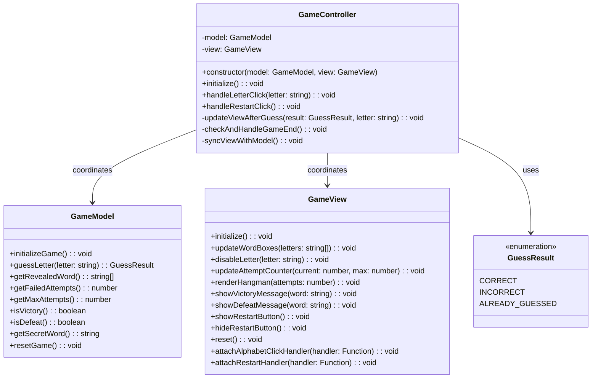

# REVIEW CONTEXT

**Project:** The Hangman Game - Web Application

**Component reviewed:** `GameController` (Class)

**Component objective:** Main controller coordinating the game logic (Model) and user interface (View). Implements the Observer pattern to handle user interactions (letter clicks, restart clicks), processes game events by delegating to the Model, updates the View based on Model state changes, and enforces game flow. This is the central MVC Controller that brings the entire architecture together.

---

# REQUIREMENTS SPECIFICATION

## Relevant Functional Requirements:

- **FR1:** Initialize the game displaying the word to guess in empty boxes
- **FR2:** Letter selection by the user through click - system processes whether it is correct or incorrect
- **FR3:** Reveal all occurrences of correct letters
- **FR4:** Register failed attempts and increment counter
- **FR5:** Update graphical representation of the hangman
- **FR6:** Game termination by player victory
- **FR7:** Game termination by computer victory
- **FR9:** Game restart - Selects new random word and resets all states
- **FR10:** Disable already selected letters

## Relevant Non-Functional Requirements:

- **NFR2:** Modular and object-oriented code following MVC architecture
- **NFR3:** Implementation of three separate main classes - GameController (coordination between Model and View)
- **NFR5:** Unit tests with Jest with minimum 80% coverage
- **NFR6:** Complete documentation with JSDoc/TypeDoc
- **NFR7:** Code analysis with ESLint and Google style guide
- **NFR8:** Immediate response time when selecting letters - Interface updates in less than 200ms

## Architectural Context:

**GameController as MVC Coordinator:**
- **NO business logic** (delegates to Model)
- **NO UI rendering** (delegates to View)
- **ONLY coordination** between Model and View
- Observes user events and responds appropriately
- Maintains Model as single source of truth
- Keeps View synchronized with Model state

**MVC Responsibilities:**
- **Model (GameModel):** Game state and business logic
- **View (GameView):** UI rendering and display
- **Controller (GameController):** Event handling and coordination

---

# CLASS DIAGRAM



**Relationships:**
- GameController coordinates GameModel and GameView
- GameController does NOT inherit from anything
- GameController uses GuessResult to interpret Model responses
- GameController is the ONLY connection between Model and View

---

# CODE TO REVIEW

```typescript
(Referenced Code)
```

---

# EVALUATION CRITERIA

## 1. DESIGN ADHERENCE (Weight: 30%)

**Checklist - Class Structure:**
- [ ] Class name is `GameController` (PascalCase)
- [ ] Has 2 private properties:
  - `model: GameModel`
  - `view: GameView`
- [ ] Constructor accepts both Model and View via dependency injection
- [ ] Properly exported: `export class GameController`

**Checklist - Methods (7 total):**
- [ ] `constructor(model: GameModel, view: GameView)` - public
- [ ] `initialize(): void` - public
- [ ] `handleLetterClick(letter: string): void` - public
- [ ] `handleRestartClick(): void` - public
- [ ] `updateViewAfterGuess(result: GuessResult, letter: string): void` - private
- [ ] `checkAndHandleGameEnd(): void` - private
- [ ] `syncViewWithModel(): void` - private

**Checklist - MVC Pattern Adherence:**
- [ ] **NO business logic** in controller (all in Model)
- [ ] **NO UI rendering** in controller (all in View)
- [ ] **ONLY coordination** between Model and View
- [ ] Model is single source of truth
- [ ] View always reflects Model state

**Checklist - Observer Pattern:**
- [ ] Controller observes user events (letter clicks, restart clicks)
- [ ] Event handlers attached through View
- [ ] Controller responds to events by updating Model and View

**Checklist - Dependencies:**
- [ ] Imports `GameModel` from `'@models/game-model'`
- [ ] Imports `GameView` from `'@views/game-view'`
- [ ] Imports `GuessResult` from `'@models/guess-result'`
- [ ] Uses path aliases correctly

**Score:** __/10

**Observations:**
- [Verify NO business logic in controller]
- [Check proper coordination between Model and View]
- [Confirm event-driven architecture]

---

## 2. CODE QUALITY (Weight: 25%)

**Analyze using these metrics:**

### Complexity Analysis:
- [ ] `constructor()`: Low (O(1) - store references)
- [ ] `initialize()`: Low (O(1) - sequential calls)
- [ ] `handleLetterClick()`: Low (O(1) - sequential operations)
- [ ] `handleRestartClick()`: Low (O(1) - sequential calls)
- [ ] `updateViewAfterGuess()`: Low (O(1) - switch statement with 3 cases)
- [ ] `checkAndHandleGameEnd()`: Low (O(1) - conditional checks)
- [ ] `syncViewWithModel()`: Low (O(n) where n = word length, typically small)

**Cyclomatic Complexity:**
- [ ] `constructor()`: 1 (no branching)
- [ ] `initialize()`: 1 (sequential)
- [ ] `handleLetterClick()`: 1 (sequential)
- [ ] `handleRestartClick()`: 1 (sequential)
- [ ] `updateViewAfterGuess()`: 3-4 (switch with 3 cases)
- [ ] `checkAndHandleGameEnd()`: 3 (if victory, else if defeat)
- [ ] `syncViewWithModel()`: 1-2 (sequential with one loop)
- [ ] All methods should be under complexity of 5

### Coupling:
- [ ] Fan-in: Low (only main.ts depends on it)
- [ ] Fan-out: Medium (depends on Model, View, GuessResult)
- [ ] Good: Coupling through dependency injection

### Cohesion:
- [ ] All methods relate to coordinating game flow
- [ ] High cohesion expected - single responsibility

### Code Smells:
- [ ] **Long Method:** 
  - `updateViewAfterGuess()` might be 10-15 lines (acceptable)
  - `syncViewWithModel()` might be 10-15 lines (acceptable)
  - All other methods should be under 10 lines
  
- [ ] **Large Class:** 
  - 7 methods, 2 properties (small, focused class)
  
- [ ] **Feature Envy:** 
  - Should NOT manipulate Model/View internals directly
  - Should only call public methods
  
- [ ] **Code Duplication:** 
  - syncViewWithModel() called multiple times (acceptable pattern)
  - No actual duplicate logic expected
  
- [ ] **Business Logic in Controller:**
  - **CRITICAL SMELL** if present
  - Controller should have NO game rules (victory conditions, attempt limits, etc.)
  
- [ ] **UI Rendering in Controller:**
  - **CRITICAL SMELL** if present
  - Controller should have NO DOM manipulation

**Score:** __/10

**Detected code smells:** [List any issues]

---

## 3. REQUIREMENTS COMPLIANCE (Weight: 25%)

**Checklist - Functional Requirements:**

### FR1 - Initialize Game:
- [ ] `initialize()` calls `model.initializeGame()`
- [ ] `initialize()` calls `view.initialize()`
- [ ] `initialize()` attaches event handlers
- [ ] `initialize()` calls `syncViewWithModel()`

### FR2 - Letter Processing:
- [ ] `handleLetterClick()` calls `model.guessLetter(letter)`
- [ ] Result from Model processed appropriately
- [ ] View updated based on result

### FR3 - Reveal Letters:
- [ ] After CORRECT guess, view updated with revealed letters
- [ ] `syncViewWithModel()` calls `view.updateWordBoxes()`

### FR4 - Failed Attempts:
- [ ] After INCORRECT guess, Model increments attempts
- [ ] View shows updated attempt counter
- [ ] `syncViewWithModel()` updates attempt display

### FR5 - Hangman Drawing:
- [ ] `syncViewWithModel()` updates hangman drawing
- [ ] Uses current attempt count from Model

### FR6 - Victory Condition:
- [ ] `checkAndHandleGameEnd()` checks `model.isVictory()`
- [ ] Victory message shown with secret word
- [ ] Restart button appears

### FR7 - Defeat Condition:
- [ ] `checkAndHandleGameEnd()` checks `model.isDefeat()`
- [ ] Defeat message shown with secret word
- [ ] Restart button appears

### FR9 - Game Restart:
- [ ] `handleRestartClick()` calls `model.resetGame()`
- [ ] `handleRestartClick()` calls `view.reset()`
- [ ] `handleRestartClick()` calls `syncViewWithModel()`

### FR10 - Disable Letters:
- [ ] After guess (CORRECT or INCORRECT), letter disabled
- [ ] `updateViewAfterGuess()` calls `view.disableLetter()`

### Coordination Requirements:
- [ ] Event handlers properly attached in initialize()
- [ ] Letter click handler: `view.attachLetterClickHandler((letter) => this.handleLetterClick(letter))`
- [ ] Restart handler: `view.attachRestartHandler(() => this.handleRestartClick())`
- [ ] All Model operations followed by View updates
- [ ] View always reflects current Model state

### Edge Cases:
- [ ] ALREADY_GUESSED: No state change, no view update (acceptable)
- [ ] Multiple letter clicks: Handled correctly (disabled buttons prevent re-clicks)
- [ ] Victory check before defeat check (order matters)
- [ ] syncViewWithModel() called at appropriate times

### Game Flow:
1. **Initialization:**
   - Model initialized → View initialized → Handlers attached → View synced
2. **Letter Click:**
   - Model processes guess → View updated for result → Game end checked
3. **Game End:**
   - Victory/defeat detected → Message shown → Restart button shown
4. **Restart:**
   - Model reset → View reset → View synced with new game

**Score:** __/10

**Unmet requirements:** [List any missing functionality]

---

## 4. MAINTAINABILITY (Weight: 10%)

**Checklist - Naming:**
- [ ] Class name `GameController` clearly indicates MVC role
- [ ] Method names are descriptive: `initialize`, `handleLetterClick`, `handleRestartClick`
- [ ] Private methods clearly named: `updateViewAfterGuess`, `checkAndHandleGameEnd`, `syncViewWithModel`
- [ ] Property names are clear: `model`, `view`
- [ ] Parameter names are meaningful: `letter`, `result`

**Checklist - Documentation:**
- [ ] JSDoc comment block for class explaining MVC Controller role
- [ ] JSDoc for constructor explaining dependency injection
- [ ] JSDoc for all 4 public methods
- [ ] JSDoc for 3 private methods (recommended)
- [ ] Each method JSDoc explains coordination logic
- [ ] Includes `@category Controller` tag for TypeDoc
- [ ] File header comment present

**Checklist - Comments:**
- [ ] Comment explaining MVC coordination role
- [ ] Comment explaining event handling flow
- [ ] Comment explaining synchronization logic
- [ ] Comment explaining game flow in initialize()
- [ ] No redundant comments
- [ ] No commented-out code

**Checklist - Code Organization:**
- [ ] Public methods first, private methods after
- [ ] Logical method grouping (init, event handlers, helpers)
- [ ] Consistent structure throughout

**Checklist - Self-documenting Code:**
- [ ] Method names clearly indicate purpose
- [ ] Coordination flow is obvious
- [ ] Minimal comments needed (code explains itself)

**Score:** __/10

**Documentation issues:** [List missing or unclear documentation]

---

## 5. BEST PRACTICES (Weight: 10%)

**Checklist - SOLID Principles:**

- [ ] **SRP (Single Responsibility):** 
  - **CRITICAL:** Only coordinates Model and View
  - **NO** business logic
  - **NO** UI rendering
  
- [ ] **OCP (Open/Closed):** 
  - Can extend with new event handlers without modifying existing code
  
- [ ] **LSP (Liskov Substitution):** 
  - Not applicable (no inheritance)
  
- [ ] **ISP (Interface Segregation):** 
  - Not applicable (no formal interfaces)
  
- [ ] **DIP (Dependency Inversion):** 
  - Depends on Model and View abstractions (injected via constructor)
  - Good: Uses dependency injection

**Checklist - Design Patterns:**

- [ ] **MVC Pattern:** 
  - **CRITICAL:** Controller only coordinates
  - Model handles all business logic
  - View handles all UI rendering
  
- [ ] **Observer Pattern:** 
  - Controller observes UI events
  - Responds to events by updating Model/View
  
- [ ] **Single Source of Truth:**
  - Model is the ONLY source of game state
  - View is synchronized with Model (never independent)

**Checklist - Other Principles:**

- [ ] **DRY (Don't Repeat Yourself):**
  - syncViewWithModel() reused (not duplicated)
  - handleRestartClick() reuses initialize logic
  
- [ ] **KISS (Keep It Simple):**
  - Methods are simple coordination
  - No unnecessary complexity
  
- [ ] **Separation of Concerns:**
  - **CRITICAL:** NO mixing of concerns
  - Business logic in Model
  - UI rendering in View
  - Coordination in Controller

**Checklist - Event Handling:**
- [ ] Event handlers attached in initialize()
- [ ] Handlers use arrow functions or .bind() for proper `this` context
- [ ] Handlers delegate to appropriate methods

**Checklist - TypeScript Best Practices:**
- [ ] Type annotations on all parameters and return types
- [ ] Proper types for Model and View
- [ ] GuessResult enum used in switch statements
- [ ] Private/public keywords used correctly
- [ ] No use of `any` type

**Checklist - Google Style Guide Compliance:**
- [ ] Class name: PascalCase ✓
- [ ] Method names: camelCase ✓
- [ ] Property names: camelCase ✓
- [ ] Indentation: 2 spaces
- [ ] Max line length: 100 characters
- [ ] Semicolons present
- [ ] No trailing spaces

**Score:** __/10

**Best practice violations:** [List any issues]

---

# DELIVERABLES

## Review Report:

**Total Score:** __/10 (weighted average)

Formula: `(Design×0.30) + (Quality×0.25) + (Requirements×0.25) + (Maintainability×0.10) + (BestPractices×0.10)`

---

**Executive Summary:**

[2-3 lines about the general state of the code - to be filled after reviewing actual code]

Example: "The GameController class successfully implements the MVC Controller pattern, coordinating Model and View without containing business logic or UI rendering. All event handlers are properly attached and the controller maintains the Model as single source of truth. The Observer pattern is correctly implemented with proper separation of concerns throughout."

---

**Critical Issues (Blockers):**

[Only if there are severe problems]

Example issues to check:

1. **Controller contains business logic** - Lines [X-Y]
   - Impact: Violates MVC pattern, breaks separation of concerns, makes testing difficult
   - Examples: victory condition logic, attempt counting, word validation
   - Proposed solution: Move all business logic to GameModel

2. **Controller contains UI rendering** - Lines [X-Y]
   - Impact: Violates MVC pattern, breaks separation of concerns
   - Examples: DOM manipulation, CSS class management, element creation
   - Proposed solution: Move all rendering to GameView

3. **Model and View not stored in constructor** - Line [X]
   - Impact: All methods will fail with undefined references
   - Proposed solution: Store references: `this.model = model; this.view = view;`

4. **initialize() doesn't call model.initializeGame()** - Line [X]
   - Impact: Game not properly initialized, no secret word
   - Proposed solution: Call `this.model.initializeGame()` first

5. **initialize() doesn't attach event handlers** - Line [X]
   - Impact: User interactions don't work
   - Proposed solution: Attach letter and restart handlers through View

6. **handleLetterClick() doesn't call model.guessLetter()** - Line [X]
   - Impact: Game doesn't process guesses, no state changes
   - Proposed solution: Call `this.model.guessLetter(letter)` and use result

7. **updateViewAfterGuess() doesn't handle all GuessResult cases** - Line [X]
   - Impact: Some guess outcomes not handled properly
   - Proposed solution: Switch/if-else for CORRECT, INCORRECT, ALREADY_GUESSED

8. **checkAndHandleGameEnd() doesn't check both victory and defeat** - Line [X]
   - Impact: Game doesn't end properly
   - Proposed solution: Check both conditions and show appropriate messages

9. **syncViewWithModel() doesn't update all view components** - Line [X]
   - Impact: View out of sync with Model, incorrect display
   - Proposed solution: Update word boxes, attempt counter, and hangman drawing

10. **Missing imports** - Lines [1-5]
    - Impact: TypeScript compilation fails
    - Proposed solution: Import GameModel, GameView, GuessResult

11. **Class not exported** - Line [X]
    - Impact: Cannot be imported by main.ts
    - Proposed solution: Add `export` keyword

---

**Minor Issues (Suggested improvements):**

[Non-critical issues]

Example issues to check:

1. **updateViewAfterGuess() doesn't disable letter for ALREADY_GUESSED** - Line [X]
   - Note: This is acceptable (letter already disabled)
   - Suggestion: Add comment explaining why no action needed

2. **Missing JSDoc documentation** - Lines [X-Y]
   - Suggestion: Add JSDoc comments for class and all methods

3. **No file header comment** - Line [1]
   - Suggestion: Add brief file description explaining MVC Controller role

4. **Missing @category tag** - Line [X]
   - Suggestion: Add `@category Controller` to class JSDoc

5. **Event handler arrow functions could be clearer** - Lines [X-Y]
   - Suggestion: Use explicit arrow syntax for readability

6. **syncViewWithModel() called redundantly** - Line [X]
   - Note: Multiple calls are safe and ensure consistency
   - Suggestion: Add comment explaining defensive synchronization

7. **No comment explaining game flow** - Line [X]
   - Suggestion: Add comment in initialize() explaining initialization sequence

8. **checkAndHandleGameEnd() checks defeat before victory** - Line [X]
   - Issue: Should check victory first (more important condition)
   - Suggestion: Reorder to check isVictory() first

---

**Positive Aspects:**

[Highlight what was done well]

Examples:
- All 7 methods from class diagram implemented
- Clean MVC separation (if present)
- No business logic in controller (if true)
- No UI rendering in controller (if true)
- Proper dependency injection
- Event-driven architecture correctly implemented
- Model is single source of truth
- View synchronized with Model state
- Clear separation of concerns
- Simple, focused methods
- Proper delegation to Model and View
- Type-safe with TypeScript
- Good use of private methods for internal logic

---

**Decision:**

- [ ] ✅ **APPROVED** - Ready for integration
  - *Use if: All methods present, proper MVC separation (no business logic, no UI rendering), event handlers attached, synchronization correct, well documented*

- [ ] ⚠️ **APPROVED WITH RESERVATIONS** - Functional but needs minor improvements
  - *Use if: Core coordination works but missing some documentation, minor logic improvements needed*

- [ ] ❌ **REJECTED** - Requires corrections before continuing
  - *Use if: Contains business logic, contains UI rendering, missing methods, event handlers not attached, synchronization incomplete, critical violations of MVC pattern*
