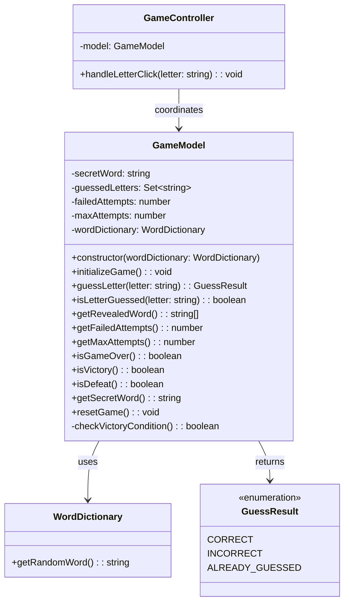

# REVIEW CONTEXT

**Project:** The Hangman Game - Web Application

**Component reviewed:** `GameModel` (Class)

**Component objective:** Core business logic for the Hangman game. Manages game state (secret word, guessed letters, failed attempts), processes letter guesses, validates game rules, and determines victory/defeat conditions. Acts as the single source of truth for game state in the MVC architecture.

---

# REQUIREMENTS SPECIFICATION

## Relevant Functional Requirements:

- **FR1:** Initialize the game displaying the word to guess in empty boxes
- **FR2:** Letter selection by the user through click - system processes whether it is correct or incorrect
- **FR3:** Reveal all occurrences of correct letters - if letter is in word, all occurrences revealed
- **FR4:** Register failed attempts and increment counter - Each incorrect letter increments counter (max 6)
- **FR6:** Game termination by player victory - Player guesses all letters before 6 failed attempts
- **FR7:** Game termination by computer victory - 6 failed attempts completed without guessing word
- **FR8:** Management of animal word dictionary - Randomly selects word when starting
- **FR9:** Game restart - Selects new random word and resets all states
- **FR10:** Disable already selected letters - Tracks which letters have been guessed

## Relevant Non-Functional Requirements:

- **NFR2:** Modular and object-oriented code following MVC architecture
- **NFR3:** Implementation of three separate main classes - GameModel (data and business logic)
- **NFR5:** Unit tests with Jest with minimum 80% coverage
- **NFR6:** Complete documentation with JSDoc/TypeDoc
- **NFR7:** Code analysis with ESLint and Google style guide

## Technical Context:

**Game Rules:**
- Secret word selected from WordDictionary
- Maximum 6 failed attempts before defeat
- All letters must be guessed for victory
- Already guessed letters should not change game state

**State Management:**
- `secretWord`: The current word to guess (uppercase)
- `guessedLetters`: Set of all letters guessed (correct + incorrect)
- `failedAttempts`: Counter for incorrect guesses (0-6)
- `maxAttempts`: Constant value of 6

---

# CLASS DIAGRAM

**Relationships:**
- GameModel depends on WordDictionary (dependency injection)
- GameModel returns GuessResult from guessLetter method
- GameController uses GameModel for all game logic operations

---

# CODE TO REVIEW

(Referenced Code)

---

# EVALUATION CRITERIA

## 1. DESIGN ADHERENCE (Weight: 30%)

**Checklist - Class Structure:**
- [ ] Class name is `GameModel` (PascalCase)
- [ ] Has 5 private properties: `secretWord`, `guessedLetters`, `failedAttempts`, `maxAttempts`, `wordDictionary`
- [ ] `guessedLetters` is implemented as `Set<string>` (efficient lookup)
- [ ] `maxAttempts` is readonly or const (value 6)

**Checklist - Methods (12 total):**
- [ ] `constructor(wordDictionary: WordDictionary)` - dependency injection
- [ ] `initializeGame(): void` - public
- [ ] `guessLetter(letter: string): GuessResult` - public
- [ ] `isLetterGuessed(letter: string): boolean` - public
- [ ] `getRevealedWord(): string[]` - public
- [ ] `getFailedAttempts(): number` - public
- [ ] `getMaxAttempts(): number` - public
- [ ] `isGameOver(): boolean` - public
- [ ] `isVictory(): boolean` - public
- [ ] `isDefeat(): boolean` - public
- [ ] `getSecretWord(): string` - public
- [ ] `resetGame(): void` - public
- [ ] `checkVictoryCondition(): boolean` - private

**Checklist - Relationships:**
- [ ] Imports `GuessResult` from `'./guess-result'`
- [ ] Imports `WordDictionary` from `'./word-dictionary'`
- [ ] Properly exported: `export class GameModel`

**Score:** __/10

**Observations:**
- [Verify all methods match signatures from diagram]
- [Check property types match specification]
- [Confirm private/public modifiers are correct]

---

## 2. CODE QUALITY (Weight: 25%)

**Analyze using these metrics:**

### Complexity Analysis:
- [ ] `constructor()`: Low (O(1) - initialization)
- [ ] `initializeGame()`: Low (O(1) - calls dictionary, resets state)
- [ ] `guessLetter()`: Low (O(n) where n = word length for checking letter presence)
- [ ] `isLetterGuessed()`: Low (O(1) - Set lookup)
- [ ] `getRevealedWord()`: Medium (O(n) - iterates word length)
- [ ] `getFailedAttempts()`: Low (O(1) - getter)
- [ ] `getMaxAttempts()`: Low (O(1) - getter)
- [ ] `isGameOver()`: Low (O(n) - calls isVictory)
- [ ] `isVictory()`: Low to Medium (O(n) - checks all letters)
- [ ] `isDefeat()`: Low (O(1) - comparison)
- [ ] `getSecretWord()`: Low (O(1) - getter)
- [ ] `resetGame()`: Low (O(1) - calls initializeGame)
- [ ] `checkVictoryCondition()`: Medium (O(n) - iterates word)

**Cyclomatic Complexity:**
- [ ] No method should exceed complexity of 10
- [ ] `guessLetter()` has branching (check already guessed, check correct/incorrect) - expect ~3-4
- [ ] `checkVictoryCondition()` has loop - expect ~2-3

### Coupling:
- [ ] Fan-in: Medium (GameController depends on it)
- [ ] Fan-out: Low (only depends on WordDictionary and GuessResult)
- [ ] Good: Minimal coupling through dependency injection

### Cohesion:
- [ ] All methods relate to game state management
- [ ] High cohesion expected - single responsibility

### Code Smells:
- [ ] **Long Method:** 
  - Check if any method exceeds 50 lines
  - `guessLetter()` and `getRevealedWord()` might be longer
- [ ] **Large Class:** 
  - 13 methods total (acceptable for core game logic)
  - All methods related to game state
- [ ] **Feature Envy:** 
  - Should not access internals of WordDictionary beyond getRandomWord()
- [ ] **Code Duplication:** 
  - Check if victory condition logic is repeated
  - Check if letter normalization (toUpperCase) is repeated
- [ ] **Magic Numbers:** 
  - Should use `maxAttempts` constant, not hardcoded 6
- [ ] **Primitive Obsession:**
  - Using Set<string> for guessedLetters is good
  - Avoid using plain arrays where Set is more appropriate
- [ ] **Switch Statements:**
  - Not expected in this class

**Score:** __/10

**Detected code smells:** [List any issues]

---

## 3. REQUIREMENTS COMPLIANCE (Weight: 25%)

**Checklist - Functional Requirements:**

### FR1 - Initialize Game:
- [ ] `initializeGame()` selects random word from dictionary
- [ ] Clears `guessedLetters` Set
- [ ] Resets `failedAttempts` to 0

### FR2 - Letter Processing:
- [ ] `guessLetter()` accepts letter parameter
- [ ] Normalizes letter to uppercase
- [ ] Returns appropriate GuessResult

### FR3 - Reveal Correct Letters:
- [ ] `getRevealedWord()` returns array with revealed letters
- [ ] All occurrences of a guessed letter are revealed

### FR4 - Failed Attempts:
- [ ] `guessLetter()` increments `failedAttempts` for incorrect guesses
- [ ] `guessLetter()` does NOT increment for correct guesses
- [ ] Maximum attempts is 6

### FR6 - Victory Condition:
- [ ] `isVictory()` returns true when all letters guessed
- [ ] `checkVictoryCondition()` correctly checks all unique letters

### FR7 - Defeat Condition:
- [ ] `isDefeat()` returns true when failedAttempts >= maxAttempts (6)

### FR8 - Dictionary Integration:
- [ ] Constructor accepts WordDictionary parameter
- [ ] `initializeGame()` calls `wordDictionary.getRandomWord()`

### FR9 - Game Restart:
- [ ] `resetGame()` selects new random word
- [ ] `resetGame()` resets all state (guesses, attempts)

### FR10 - Track Guessed Letters:
- [ ] `guessLetter()` adds letter to `guessedLetters` Set
- [ ] `guessLetter()` returns ALREADY_GUESSED if letter already in Set
- [ ] `isLetterGuessed()` checks Set membership

### Edge Cases:
- [ ] Empty secret word handled (shouldn't occur with valid dictionary)
- [ ] Lowercase letter input normalized to uppercase
- [ ] Already guessed letter doesn't change state
- [ ] Victory check handles words with duplicate letters (e.g., ELEPHANT has 2 E's)
- [ ] Non-alphabetic input handled (optional validation)

### Logic Correctness:
- [ ] Set used for guessedLetters (O(1) lookup vs O(n) for array)
- [ ] Victory condition checks unique letters, not total length
- [ ] Defeat checked before allowing more guesses (or game over checked)

**Score:** __/10

**Unmet requirements:** [List any missing functionality]

---

## 4. MAINTAINABILITY (Weight: 10%)

**Checklist - Naming:**
- [ ] Class name `GameModel` is descriptive
- [ ] Method names are verbs: `guessLetter`, `initializeGame`, `resetGame`
- [ ] Boolean methods start with `is`: `isVictory`, `isDefeat`, `isGameOver`
- [ ] Getter methods start with `get`: `getRevealedWord`, `getSecretWord`
- [ ] Private method clearly named: `checkVictoryCondition`
- [ ] Variable names are meaningful (avoid single letters except in loops)

**Checklist - Documentation:**
- [ ] JSDoc comment block for the class
- [ ] JSDoc for constructor explaining dependency injection
- [ ] JSDoc for all 12 public methods with @param, @returns
- [ ] JSDoc for private method `checkVictoryCondition`
- [ ] Includes `@category Model` tag for TypeDoc
- [ ] File header comment present
- [ ] Complex logic explained (victory condition, revealed word generation)

**Checklist - Comments:**
- [ ] Comment explaining Set usage for guessedLetters
- [ ] Comment explaining victory condition algorithm
- [ ] Comment explaining revealed word generation logic
- [ ] No redundant comments (e.g., "return failedAttempts" doesn't need comment)
- [ ] No commented-out code

**Checklist - Self-documenting Code:**
- [ ] Method names clearly indicate purpose
- [ ] Logic flow is straightforward
- [ ] Variable names explain their purpose

**Score:** __/10

**Documentation issues:** [List missing or unclear documentation]

---

## 5. BEST PRACTICES (Weight: 10%)

**Checklist - SOLID Principles:**

- [ ] **SRP (Single Responsibility):** 
  - Class only manages game state and rules
  - No UI logic, no file I/O, no network calls
  
- [ ] **OCP (Open/Closed):** 
  - Can extend with new features without modifying existing code
  - Example: Could add difficulty levels by extending
  
- [ ] **LSP (Liskov Substitution):** 
  - Not applicable (no inheritance)
  
- [ ] **ISP (Interface Segregation):** 
  - Not applicable (no interfaces in TypeScript for this class)
  
- [ ] **DIP (Dependency Inversion):** 
  - Depends on WordDictionary abstraction (injected via constructor)
  - Good: Uses dependency injection

**Checklist - Other Principles:**

- [ ] **DRY (Don't Repeat Yourself):**
  - Letter normalization (toUpperCase) not repeated
  - Victory check logic not duplicated
  - resetGame() reuses initializeGame()
  
- [ ] **KISS (Keep It Simple):**
  - Methods are focused and simple
  - No unnecessary complexity
  
- [ ] **YAGNI (You Aren't Gonna Need It):**
  - No premature features (hints, timers, difficulty levels)
  - Only implements required functionality

**Checklist - Input Validations:**
- [ ] Letter input normalized to uppercase in `guessLetter()`
- [ ] Optional: Validate letter is single alphabetic character
- [ ] Optional: Validate game is initialized before operations

**Checklist - Error Handling:**
- [ ] Optional: Throw error if word dictionary returns empty word
- [ ] Optional: Throw error if invalid letter format
- [ ] Defensive programming in critical methods

**Checklist - TypeScript Best Practices:**
- [ ] Type annotations on all parameters and return types
- [ ] Proper use of `Set<string>` for guessedLetters
- [ ] Private/public keywords used correctly
- [ ] Readonly for `maxAttempts`
- [ ] No use of `any` type

**Checklist - Google Style Guide Compliance:**
- [ ] Class name: PascalCase ✓
- [ ] Method names: camelCase ✓
- [ ] Property names: camelCase ✓
- [ ] Indentation: 2 spaces
- [ ] Max line length: 100 characters
- [ ] Semicolons present
- [ ] No trailing spaces
- [ ] Consistent quote style (single quotes)

**Score:** __/10

**Best practice violations:** [List any issues]

---

# DELIVERABLES

## Review Report:

**Total Score:** __/10 (weighted average)

Formula: `(Design×0.30) + (Quality×0.25) + (Requirements×0.25) + (Maintainability×0.10) + (BestPractices×0.10)`

---

**Executive Summary:**

[2-3 lines about the general state of the code - to be filled after reviewing actual code]

Example: "The GameModel class provides comprehensive game logic with proper state management using a Set for guessed letters. The implementation correctly handles all game rules including victory/defeat conditions and letter validation. All 13 methods are present and follow the class diagram. Minor improvements suggested for documentation and edge case handling."

---

**Critical Issues (Blockers):**

[Only if there are severe problems]

Example issues to check:

1. **Missing required method** - Method [X] from class diagram not implemented
   - Impact: Cannot fulfill game requirements, breaks MVC contract
   - Proposed solution: Implement missing method with signature from diagram

2. **guessLetter() doesn't return GuessResult** - Line [X]
   - Impact: Controller cannot determine how to update view
   - Proposed solution: Return GuessResult enum value based on guess outcome

3. **Victory condition incorrect** - Line [X]
   - Impact: Game never ends or ends prematurely
   - Proposed solution: Check all unique letters in word, not total count
   - Example: "ELEPHANT" has 8 letters but only 7 unique (E appears twice)

4. **Failed attempts not incremented** - Line [X]
   - Impact: Player can guess infinitely, game never ends in defeat
   - Proposed solution: Increment `failedAttempts` when GuessResult.INCORRECT

5. **guessedLetters not tracked** - Line [X]
   - Impact: Cannot detect already guessed letters, no ALREADY_GUESSED result
   - Proposed solution: Add letter to Set in guessLetter() method

6. **maxAttempts not set to 6** - Line [X]
   - Impact: Wrong game rules, doesn't match requirements
   - Proposed solution: Set `this.maxAttempts = 6` in constructor

7. **WordDictionary not stored** - Line [X]
   - Impact: Cannot get new word for resetGame()
   - Proposed solution: Store reference: `this.wordDictionary = wordDictionary`

8. **Class not exported** - Line [X]
   - Impact: Cannot be imported by GameController
   - Proposed solution: Add `export` keyword: `export class GameModel`

---

**Minor Issues (Suggested improvements):**

[Non-critical issues]

Example issues to check:

1. **Letter not normalized to uppercase** - Line [X]
   - Suggestion: Add `letter = letter.toUpperCase()` in guessLetter()

2. **No defensive check for empty word** - Line [X]
   - Suggestion: Validate secretWord is not empty in initializeGame()

3. **getRevealedWord() inefficient** - Line [X]
   - Suggestion: Use Array.from() or map() instead of manual loop

4. **Missing JSDoc for private method** - Line [X]
   - Suggestion: Document checkVictoryCondition() for clarity

5. **No comment explaining Set usage** - Line [X]
   - Suggestion: Comment why Set is used over array (O(1) lookup)

6. **Victory condition uses length instead of unique letters** - Line [X]
   - Suggestion: Get unique letters: `const uniqueLetters = new Set(this.secretWord)`

7. **isGameOver() recalculates victory** - Line [X]
   - Suggestion: Already checked in isVictory, avoid redundant calculation

8. **No validation for non-alphabetic input** - Line [X]
   - Suggestion: Optional validation: `/^[A-Z]$/.test(letter)`

---

**Positive Aspects:**

[Highlight what was done well]

Examples:
- All 13 methods from class diagram implemented
- Proper use of Set<string> for efficient letter lookup
- Dependency injection pattern correctly applied
- Clear separation of concerns (only game logic, no UI)
- Victory and defeat conditions correctly implemented
- State properly encapsulated (all properties private)
- Getters provide read-only access to state
- resetGame() reuses initializeGame() (DRY principle)
- Boolean methods properly named with "is" prefix
- maxAttempts is readonly/const (immutable game rule)
- Good use of TypeScript type system

---

**Decision:**

- [ ] ✅ **APPROVED** - Ready for integration
  - *Use if: All 13 methods present, correct logic for victory/defeat/guess, proper state management, well documented*

- [ ] ⚠️ **APPROVED WITH RESERVATIONS** - Functional but needs minor improvements
  - *Use if: Core logic works but missing letter normalization, incomplete documentation, or minor efficiency issues*

- [ ] ❌ **REJECTED** - Requires corrections before continuing
  - *Use if: Missing methods, incorrect victory condition, doesn't track guesses, failed attempts not incremented, critical logic errors*
