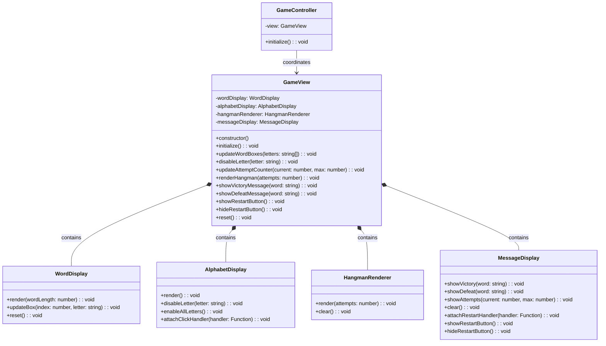

# REVIEW CONTEXT

**Project:** The Hangman Game - Web Application

**Component reviewed:** `GameView` (Class)

**Component objective:** Main view coordinator that composes all display components (WordDisplay, AlphabetDisplay, HangmanRenderer, MessageDisplay). Implements the Composite pattern to manage multiple view elements and provides a unified interface for the GameController to interact with the entire UI. Part of the View layer in MVC architecture, orchestrating all visual updates without containing business logic.

---

# REQUIREMENTS SPECIFICATION

## Relevant Functional Requirements:

- **FR1:** Initialize the game displaying the word to guess in empty boxes
- **FR2:** Letter selection by the user through click
- **FR3:** Reveal all occurrences of correct letters
- **FR4:** Register failed attempts and increment counter
- **FR5:** Update graphical representation of the hangman
- **FR6:** Game termination by player victory
- **FR7:** Game termination by computer victory
- **FR9:** Game restart
- **FR10:** Disable already selected letters

## Relevant Non-Functional Requirements:

- **NFR2:** Modular and object-oriented code following MVC architecture
- **NFR3:** Implementation of three separate main classes - GameView (presentation/UI)
- **NFR4:** Use of Bulma for interface styling
- **NFR5:** Unit tests with Jest with minimum 80% coverage
- **NFR6:** Complete documentation with JSDoc/TypeDoc
- **NFR7:** Code analysis with ESLint and Google style guide
- **NFR8:** Immediate response time when selecting letters - Interface updates in less than 200ms

## Architectural Context:

**GameView as Composite Coordinator:**
- Composes 4 specialized view components
- Provides unified interface to GameController
- Delegates operations to appropriate child components
- No direct DOM manipulation (delegates to children)
- No business logic (only coordination)

---

# CLASS DIAGRAM



**Relationships:**
- GameView composes all 4 view components (Composite Pattern)
- GameView delegates operations to child components
- GameController uses GameView as single point of contact for UI
- No direct interaction between GameController and individual view components

---

# CODE TO REVIEW

```typescript
(Referenced Code)
```

---

# EVALUATION CRITERIA

## 1. DESIGN ADHERENCE (Weight: 30%)

**Checklist - Class Structure:**
- [ ] Class name is `GameView` (PascalCase)
- [ ] Has 4 private properties (one for each child component):
  - `wordDisplay: WordDisplay`
  - `alphabetDisplay: AlphabetDisplay`
  - `hangmanRenderer: HangmanRenderer`
  - `messageDisplay: MessageDisplay`
- [ ] Constructor creates all 4 child components with correct container IDs
- [ ] Properly exported: `export class GameView`

**Checklist - Methods (10 total):**
- [ ] `constructor()` - public
- [ ] `initialize(): void` - public
- [ ] `updateWordBoxes(letters: string[]): void` - public
- [ ] `disableLetter(letter: string): void` - public
- [ ] `updateAttemptCounter(current: number, max: number): void` - public
- [ ] `renderHangman(attempts: number): void` - public
- [ ] `showVictoryMessage(word: string): void` - public
- [ ] `showDefeatMessage(word: string): void` - public
- [ ] `showRestartButton(): void` - public
- [ ] `hideRestartButton(): void` - public
- [ ] `reset(): void` - public

**Checklist - Composite Pattern:**
- [ ] No direct DOM manipulation in GameView (delegates to children)
- [ ] Each method delegates to appropriate child component
- [ ] GameView acts as facade/coordinator
- [ ] Child components encapsulate their own logic

**Checklist - Dependencies:**
- [ ] Imports `WordDisplay` from `'./word-display'`
- [ ] Imports `AlphabetDisplay` from `'./alphabet-display'`
- [ ] Imports `HangmanRenderer` from `'./hangman-renderer'`
- [ ] Imports `MessageDisplay` from `'./message-display'`

**Checklist - Container IDs:**
- [ ] WordDisplay: `'word-container'`
- [ ] AlphabetDisplay: `'alphabet-container'`
- [ ] HangmanRenderer: `'hangman-canvas'`
- [ ] MessageDisplay: `'message-container'`

**Score:** __/10

**Observations:**
- [Verify all methods delegate correctly]
- [Check Composite pattern properly implemented]
- [Confirm no business logic in GameView]

---

## 2. CODE QUALITY (Weight: 25%)

**Analyze using these metrics:**

### Complexity Analysis:
- [ ] `constructor()`: Low (O(1) - create 4 child components)
- [ ] `initialize()`: Low (O(1) - call child initialize methods)
- [ ] `updateWordBoxes()`: Linear (O(n) where n = letters array length)
- [ ] `disableLetter()`: Low (O(1) - delegate to AlphabetDisplay)
- [ ] `updateAttemptCounter()`: Low (O(1) - delegate to MessageDisplay)
- [ ] `renderHangman()`: Low (O(1) - delegate to HangmanRenderer)
- [ ] `showVictoryMessage()`: Low (O(1) - delegate to MessageDisplay)
- [ ] `showDefeatMessage()`: Low (O(1) - delegate to MessageDisplay)
- [ ] `showRestartButton()`: Low (O(1) - delegate to MessageDisplay)
- [ ] `hideRestartButton()`: Low (O(1) - delegate to MessageDisplay)
- [ ] `reset()`: Low (O(1) - call child reset methods)

**Cyclomatic Complexity:**
- [ ] `constructor()`: 1 (no branching)
- [ ] `initialize()`: 1-2 (sequential calls)
- [ ] `updateWordBoxes()`: 2-3 (loop or check for first render)
- [ ] All delegation methods: 1 (no branching)
- [ ] `reset()`: 1 (sequential calls)
- [ ] All methods should be under complexity of 5

### Coupling:
- [ ] Fan-in: Medium (GameController depends on it)
- [ ] Fan-out: Medium (depends on 4 view components)
- [ ] Good: Coupling through composition, not inheritance

### Cohesion:
- [ ] All methods relate to view coordination
- [ ] High cohesion expected - single responsibility (coordinate views)

### Code Smells:
- [ ] **Long Method:** 
  - `updateWordBoxes()` might be 10-15 lines (acceptable)
  - All other methods should be under 5 lines (simple delegation)
  
- [ ] **Large Class:** 
  - 11 methods, 4 properties (medium size, acceptable for coordinator)
  
- [ ] **Feature Envy:** 
  - GameView should NOT directly manipulate child component internals
  - Should only call public methods of children
  
- [ ] **Code Duplication:** 
  - Multiple methods delegate to MessageDisplay (acceptable pattern)
  - No actual duplicate logic expected
  
- [ ] **Middle Man:** 
  - GameView is intentionally a middle man (Composite pattern)
  - This is GOOD design, not a smell in this context
  
- [ ] **Inappropriate Intimacy:**
  - Should not access private properties of child components

**Score:** __/10

**Detected code smells:** [List any issues]

---

## 3. REQUIREMENTS COMPLIANCE (Weight: 25%)

**Checklist - Functional Requirements:**

### FR1 - Initialize Game:
- [ ] `initialize()` calls all child component initialization
- [ ] `alphabetDisplay.render()` called
- [ ] Initial hangman state rendered
- [ ] Initial message displayed (attempt counter)

### FR2 & FR10 - Letter Selection:
- [ ] AlphabetDisplay click handler accessible through GameView
- [ ] `disableLetter()` delegates to AlphabetDisplay

### FR3 - Reveal Letters:
- [ ] `updateWordBoxes()` delegates to WordDisplay
- [ ] Handles array of letters with revealed/unrevealed states

### FR4 - Failed Attempts:
- [ ] `updateAttemptCounter()` delegates to MessageDisplay
- [ ] Accepts current and max attempt parameters

### FR5 - Hangman Drawing:
- [ ] `renderHangman()` delegates to HangmanRenderer
- [ ] Accepts attempt count parameter

### FR6 - Victory:
- [ ] `showVictoryMessage()` delegates to MessageDisplay
- [ ] Passes word parameter

### FR7 - Defeat:
- [ ] `showDefeatMessage()` delegates to MessageDisplay
- [ ] Passes word parameter

### FR9 - Restart:
- [ ] `showRestartButton()` delegates to MessageDisplay
- [ ] `hideRestartButton()` delegates to MessageDisplay
- [ ] `reset()` calls reset on all child components
- [ ] MessageDisplay restart handler accessible through GameView

### Delegation Requirements:
- [ ] `initialize()` delegates properly to all children
- [ ] `updateWordBoxes()` delegates to WordDisplay (with logic for first render)
- [ ] `disableLetter()` delegates to AlphabetDisplay
- [ ] `updateAttemptCounter()` delegates to MessageDisplay
- [ ] `renderHangman()` delegates to HangmanRenderer
- [ ] `showVictoryMessage()` delegates to MessageDisplay
- [ ] `showDefeatMessage()` delegates to MessageDisplay
- [ ] `showRestartButton()` delegates to MessageDisplay
- [ ] `hideRestartButton()` delegates to MessageDisplay
- [ ] `reset()` delegates to all children

### Edge Cases:
- [ ] updateWordBoxes on first call: calls wordDisplay.render(letters.length)
- [ ] updateWordBoxes on subsequent calls: calls wordDisplay.updateBox for each letter
- [ ] reset() resets all components to initial state
- [ ] Child component errors propagate correctly

### Integration:
- [ ] All child components properly instantiated
- [ ] Correct container IDs used for each component
- [ ] GameController can use GameView as single point of contact

**Score:** __/10

**Unmet requirements:** [List any missing functionality]

---

## 4. MAINTAINABILITY (Weight: 10%)

**Checklist - Naming:**
- [ ] Class name `GameView` clearly indicates purpose
- [ ] Method names are descriptive and indicate coordination: `initialize`, `updateWordBoxes`, etc.
- [ ] Property names clearly indicate components: `wordDisplay`, `alphabetDisplay`, etc.
- [ ] Parameter names are meaningful

**Checklist - Documentation:**
- [ ] JSDoc comment block for the class explaining Composite pattern
- [ ] JSDoc for constructor explaining child component creation
- [ ] JSDoc for all 11 public methods
- [ ] Each method JSDoc explains what it delegates to
- [ ] Includes `@category View` tag for TypeDoc
- [ ] File header comment present

**Checklist - Comments:**
- [ ] Comment explaining Composite pattern role
- [ ] Comment explaining first render logic in updateWordBoxes (if complex)
- [ ] No redundant comments for simple delegation
- [ ] No commented-out code

**Checklist - Code Organization:**
- [ ] Constructor creates all components clearly
- [ ] Methods grouped logically (initialization, updates, game end, reset)
- [ ] Consistent delegation pattern throughout

**Checklist - Self-documenting Code:**
- [ ] Method names clearly indicate what they coordinate
- [ ] Delegation is obvious and straightforward
- [ ] Child component usage is clear

**Score:** __/10

**Documentation issues:** [List missing or unclear documentation]

---

## 5. BEST PRACTICES (Weight: 10%)

**Checklist - SOLID Principles:**

- [ ] **SRP (Single Responsibility):** 
  - Class only coordinates child view components
  - No DOM manipulation, no business logic
  
- [ ] **OCP (Open/Closed):** 
  - Can add new child components without modifying existing code
  - Can extend with new coordination methods
  
- [ ] **LSP (Liskov Substitution):** 
  - Not directly applicable (no inheritance)
  
- [ ] **ISP (Interface Segregation):** 
  - Not directly applicable (no formal interfaces in TypeScript)
  
- [ ] **DIP (Dependency Inversion):** 
  - Depends on concrete child components (acceptable for Composite pattern)
  - Could be improved with interfaces (optional enhancement)

**Checklist - Design Patterns:**

- [ ] **Composite Pattern:** 
  - GameView is the composite
  - Child components are the leaves
  - Provides unified interface
  - Delegates operations to children
  
- [ ] **Facade Pattern:** 
  - GameView acts as facade for GameController
  - Simplifies interface to complex subsystem (4 view components)

**Checklist - Other Principles:**

- [ ] **DRY (Don't Repeat Yourself):**
  - No duplicate delegation logic
  - Each method delegates once
  
- [ ] **KISS (Keep It Simple):**
  - Methods are simple delegation
  - No unnecessary complexity
  
- [ ] **Separation of Concerns:**
  - No business logic in GameView
  - Only view coordination
  - No direct DOM manipulation (delegates to children)

**Checklist - Error Handling:**
- [ ] Child component errors propagate to GameController
- [ ] No error swallowing in delegation methods
- [ ] Constructor errors from children propagate correctly

**Checklist - TypeScript Best Practices:**
- [ ] Type annotations on all parameters and return types
- [ ] Proper types for child components
- [ ] Array type for letters parameter: `string[]`
- [ ] Private/public keywords used correctly
- [ ] No use of `any` type

**Checklist - Google Style Guide Compliance:**
- [ ] Class name: PascalCase ✓
- [ ] Method names: camelCase ✓
- [ ] Property names: camelCase ✓
- [ ] Indentation: 2 spaces
- [ ] Max line length: 100 characters
- [ ] Semicolons present
- [ ] No trailing spaces

**Score:** __/10

**Best practice violations:** [List any issues]

---

# DELIVERABLES

## Review Report:

**Total Score:** __/10 (weighted average)

Formula: `(Design×0.30) + (Quality×0.25) + (Requirements×0.25) + (Maintainability×0.10) + (BestPractices×0.10)`

---

**Executive Summary:**

[2-3 lines about the general state of the code - to be filled after reviewing actual code]

Example: "The GameView class successfully implements the Composite pattern to coordinate all view components. All delegation methods are present and correctly route operations to appropriate child components. The class provides a clean, unified interface for the GameController without containing business logic or direct DOM manipulation."

---

**Critical Issues (Blockers):**

[Only if there are severe problems]

Example issues to check:

1. **Child components not created in constructor** - Line [X]
   - Impact: All methods will fail with null reference errors
   - Proposed solution: Instantiate all 4 components in constructor

2. **Wrong container IDs used** - Lines [X-Y]
   - Impact: Child components can't find their DOM elements
   - Proposed solution: Use correct IDs: 'word-container', 'alphabet-container', 'hangman-canvas', 'message-container'

3. **Missing imports for child components** - Lines [1-5]
   - Impact: TypeScript compilation fails
   - Proposed solution: Import all 4 child component classes

4. **initialize() doesn't call child initializations** - Line [X]
   - Impact: UI not properly initialized
   - Proposed solution: Call alphabetDisplay.render(), hangmanRenderer.render(0), etc.

5. **updateWordBoxes() doesn't handle first render** - Line [X]
   - Impact: Word boxes never created
   - Proposed solution: Check if first call, call wordDisplay.render(letters.length)

6. **Methods don't delegate to children** - Lines [X-Y]
   - Impact: UI updates don't happen, GameView does nothing
   - Proposed solution: Call appropriate child component methods

7. **reset() doesn't reset all children** - Line [X]
   - Impact: UI not fully reset on restart
   - Proposed solution: Call reset/clear on all 4 child components

8. **Class not exported** - Line [X]
   - Impact: Cannot be imported by GameController
   - Proposed solution: Add `export` keyword

9. **GameView contains direct DOM manipulation** - Lines [X-Y]
   - Impact: Violates Composite pattern, breaks separation of concerns
   - Proposed solution: Remove direct DOM code, delegate to children

10. **GameView contains business logic** - Lines [X-Y]
    - Impact: Violates MVC architecture
    - Proposed solution: Move logic to GameModel, only keep delegation in GameView

---

**Minor Issues (Suggested improvements):**

[Non-critical issues]

Example issues to check:

1. **updateWordBoxes() logic could be clearer** - Line [X]
   - Suggestion: Add comment explaining first render detection

2. **Missing JSDoc documentation** - Lines [X-Y]
   - Suggestion: Add JSDoc comments for class and all methods

3. **No file header comment** - Line [1]
   - Suggestion: Add brief file description explaining Composite pattern

4. **Missing @category tag** - Line [X]
   - Suggestion: Add `@category View` to class JSDoc

5. **initialize() doesn't set initial game state clearly** - Line [X]
   - Suggestion: Explicitly render initial hangman (attempts=0) and attempt counter (0/6)

6. **No comment explaining Composite pattern** - Line [X]
   - Suggestion: Add comment explaining role as view coordinator

7. **Delegation could be more explicit** - Lines [X-Y]
   - Suggestion: Add comments for each delegation explaining purpose

8. **Method order could be more logical** - Lines [X-Y]
   - Suggestion: Group related methods (all MessageDisplay delegations together)

---

**Positive Aspects:**

[Highlight what was done well]

Examples:
- All 11 methods from class diagram implemented
- Clean Composite pattern implementation
- All 4 child components properly composed
- No direct DOM manipulation (proper delegation)
- No business logic (proper MVC separation)
- Simple, focused methods (mostly 1-2 lines)
- Provides unified interface to GameController
- Clear delegation to appropriate children
- Proper encapsulation of child components (private properties)
- Good separation of concerns
- Type-safe with proper TypeScript types

---

**Decision:**

- [ ] ✅ **APPROVED** - Ready for integration
  - *Use if: All children created, all methods delegate correctly, initialize complete, updateWordBoxes handles first render, reset complete, event handlers accessible, well documented*

- [ ] ⚠️ **APPROVED WITH RESERVATIONS** - Functional but needs minor improvements
  - *Use if: Core delegation works but missing some initialization, incomplete documentation, or minor logic issues*

- [ ] ❌ **REJECTED** - Requires corrections before continuing
  - *Use if: Missing child components, wrong container IDs, no delegation, contains DOM manipulation or business logic, missing methods*
