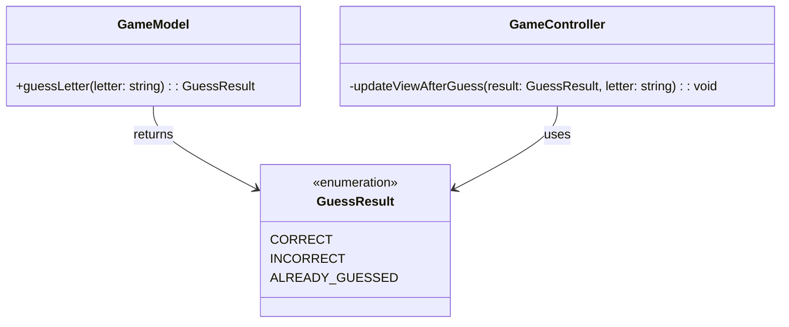

# REVIEW CONTEXT

**Project:** The Hangman Game - Web Application

**Component reviewed:** `GuessResult` (Enumeration)

**Component objective:** Define the three possible outcomes of a letter guess attempt in the Hangman game. Provides type-safe result values (CORRECT, INCORRECT, ALREADY_GUESSED) for communication between the Model layer and Controller layer about guess outcomes.

---

# REQUIREMENTS SPECIFICATION

## Relevant Functional Requirements:

- **FR2:** Letter selection by the user through click - system must process whether it is correct or incorrect
- **FR3:** Reveal all occurrences of correct letters - requires distinguishing correct guesses
- **FR4:** Register failed attempts and increment counter - requires distinguishing incorrect guesses
- **FR10:** Disable already selected letters - requires detecting duplicate guesses

## Relevant Non-Functional Requirements:

- **NFR2:** Modular and object-oriented code following MVC architecture
- **NFR6:** Complete documentation with JSDoc/TypeDoc
- **NFR7:** Code analysis with ESLint and Google style guide

## Technical Context:

This enumeration is a foundational type used throughout the application:
- **Returned by:** `GameModel.guessLetter(letter: string): GuessResult`
- **Used by:** `GameController.handleLetterClick()` to determine how to update the view
- **Purpose:** Provide clear, type-safe communication about guess outcomes

## Expected Values:

1. **CORRECT:** The guessed letter exists in the secret word
2. **INCORRECT:** The guessed letter does not exist in the secret word
3. **ALREADY_GUESSED:** The letter has been guessed before (whether correct or incorrect)

---

# CLASS DIAGRAM

---

# CODE TO REVIEW

(Referenced Code)

---

# EVALUATION CRITERIA

## 1. DESIGN ADHERENCE (Weight: 30%)

**Checklist:**
- [ ] Is it defined as a TypeScript `enum`?
- [ ] Does it contain exactly three values: CORRECT, INCORRECT, ALREADY_GUESSED?
- [ ] Are the enum values in UPPER_CASE format (naming convention)?
- [ ] Is it exported as a named export (`export enum GuessResult`)?
- [ ] Does it follow TypeScript enum best practices (string enum vs numeric)?

**Score:** __/10

**Observations:**
- [Check if enum is properly structured]
- [Verify naming conventions match Google TypeScript Style Guide]
- [Confirm it can be imported and used by GameModel and GameController]

---

## 2. CODE QUALITY (Weight: 25%)

**Analyze using these metrics:**

- [ ] **Complexity:** N/A for enums (no logic, just declarations)
- [ ] **Coupling:** Low (enum has no dependencies, only depended upon)
- [ ] **Cohesion:** High (all values related to guess outcomes)
- [ ] **Code smells:**
- [ ] Inappropriate naming (values not descriptive)
- [ ] Wrong enum type (numeric when string preferred)
- [ ] Missing values (only 1 or 2 instead of 3)
- [ ] Extra unnecessary values

**Score:** __/10

**Detected code smells:** [List any issues]

---

## 3. REQUIREMENTS COMPLIANCE (Weight: 25%)

**Checklist:**
- [ ] CORRECT value exists and is properly named
- [ ] INCORRECT value exists and is properly named
- [ ] ALREADY_GUESSED value exists and is properly named
- [ ] Can be used as return type for `GameModel.guessLetter()`
- [ ] Can be used in switch statements or conditionals
- [ ] String enum (recommended) vs numeric enum

**Score:** __/10

**Unmet requirements:** [List any missing functionality]

---

## 4. MAINTAINABILITY (Weight: 10%)

**Checklist:**
- [ ] Enum name is descriptive: `GuessResult` clearly indicates purpose
- [ ] Each value is self-documenting (CORRECT, INCORRECT, ALREADY_GUESSED are clear)
- [ ] JSDoc comment block for the enum explaining its purpose
- [ ] JSDoc comments for each enum value (optional but recommended)
- [ ] Includes `@category Model` tag for TypeDoc organization
- [ ] File header comment present

**Score:** __/10

**Documentation issues:** [List any missing or unclear documentation]

---

## 5. BEST PRACTICES (Weight: 10%)

**Checklist:**
- [ ] **SOLID principles:** Not directly applicable to enums, but ensures single responsibility (only guess results)
- [ ] **DRY:** No code duplication possible in enum
- [ ] **KISS:** Simple, straightforward enum definition
- [ ] **TypeScript best practices:**
  - [ ] String enum preferred over numeric for better debugging
  - [ ] Proper export statement
  - [ ] No magic values (enum provides named constants)
- [ ] **Google Style Guide compliance:**
  - [ ] Enum name in PascalCase: `GuessResult`
  - [ ] Enum values in UPPER_CASE: `CORRECT`, `INCORRECT`, `ALREADY_GUESSED`

**Score:** __/10

**Best practice violations:** [List any issues]

---

# DELIVERABLES

## Review Report:

**Total Score:** __/10 (weighted average)

Formula: `(Design×0.30) + (Quality×0.25) + (Requirements×0.25) + (Maintainability×0.10) + (BestPractices×0.10)`

---

**Executive Summary:**

[2-3 lines about the general state of the code - to be filled after reviewing actual code]

Example: "The GuessResult enumeration correctly defines the three required outcomes for letter guesses. The implementation follows TypeScript enum conventions and provides clear, type-safe values for Model-Controller communication. Minor documentation improvements suggested."

---

**Critical Issues (Blockers):**

[Only if there are severe problems that prevent the enum from working]

Example issues to check:
1. Missing enum values (only 2 instead of 3) - Lines [X-Y]
   - Impact: Cannot handle all guess scenarios, will cause runtime errors
   - Proposed solution: Add missing ALREADY_GUESSED value

2. Using numeric enum instead of string enum - Line [X]
   - Impact: Harder to debug, less readable console output
   - Proposed solution: Convert to string enum with explicit string values

3. Not exported - Line [X]
   - Impact: Cannot be imported by GameModel or GameController
   - Proposed solution: Add `export` keyword before `enum`

---

**Minor Issues (Suggested improvements):**

[Non-critical issues that should be addressed]

Example issues to check:
1. Missing JSDoc documentation - Line [X]
   - Suggestion: Add JSDoc comment block explaining the enum's purpose and usage

2. Inconsistent naming (e.g., `AlreadyGuessed` instead of `ALREADY_GUESSED`) - Line [X]
   - Suggestion: Use UPPER_CASE for enum values per Google Style Guide

3. Missing @category tag - Line [X]
   - Suggestion: Add `@category Model` for TypeDoc organization

4. No file header comment - Line [1]
   - Suggestion: Add brief file description

---

**Positive Aspects:**

[Highlight what was done well]

Examples:
- Clear, self-documenting enum value names
- Proper TypeScript enum syntax
- Correct export statement for module usage
- String enum used for better debugging
- Complete set of three required values
- Follows naming conventions (PascalCase for enum, UPPER_CASE for values)

---

**Decision:**

- [ ] ✅ **APPROVED** - Ready for integration
  - *Use if: All 3 values present, proper naming, properly exported, no critical issues*

- [ ] ⚠️ **APPROVED WITH RESERVATIONS** - Functional but needs minor improvements
  - *Use if: Works correctly but missing documentation or minor style issues*

- [ ] ❌ **REJECTED** - Requires corrections before continuing
  - *Use if: Missing values, not exported, wrong type, cannot be used by other components*
