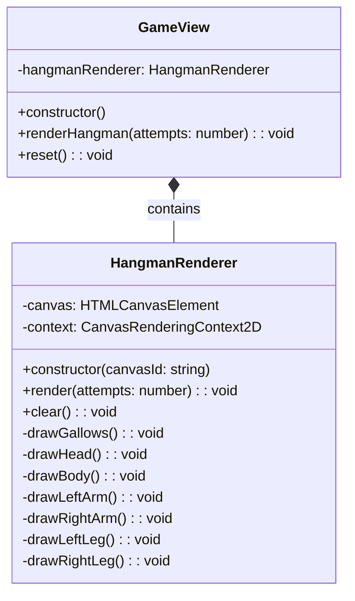

# REVIEW CONTEXT

**Project:** The Hangman Game - Web Application

**Component reviewed:** `HangmanRenderer` (Class)

**Component objective:** Render the hangman drawing on a canvas element using the Canvas API. Progressively draws the gallows structure (always visible) and body parts (head, body, arms, legs) based on the number of failed attempts. Provides visual feedback on game progress. Part of the View layer in MVC architecture, responsible only for drawing (no game logic).

---

# REQUIREMENTS SPECIFICATION

## Relevant Functional Requirements:

- **FR4:** Register failed attempts and increment counter - Each incorrect letter increments counter (maximum 6)
- **FR5:** Update graphical representation of the hangman - Each failed attempt adds a new part to the hangman drawing (6 progressive states: gallows, head, body, left arm, right arm, left leg, right leg)
- **FR7:** Game termination by computer victory - If 6 failed attempts are completed, complete hangman is drawn
- **FR9:** Game restart - Restart clears the drawing and shows initial gallows

## Relevant Non-Functional Requirements:

- **NFR2:** Modular and object-oriented code following MVC architecture
- **NFR5:** Unit tests with Jest with minimum 80% coverage
- **NFR6:** Complete documentation with JSDoc/TypeDoc
- **NFR7:** Code analysis with ESLint and Google style guide
- **NFR8:** Immediate response time when selecting letters - Interface updates in less than 200ms (drawing should be fast)

## Visual Specifications:

**Hangman Canvas Section (`#hangman-canvas`):**
- Canvas element (400x400px) for drawing progressive hangman states
- **7 progressive drawing states (0-6 failed attempts):**
  - **State 0:** Empty gallows structure only (base, post, beam, rope)
  - **State 1:** Gallows + Head
  - **State 2:** Gallows + Head + Body
  - **State 3:** Gallows + Head + Body + Left arm
  - **State 4:** Gallows + Head + Body + Both arms
  - **State 5:** Gallows + Head + Body + Both arms + Left leg
  - **State 6:** Complete hangman (game over)

**Drawing Specifications:**
- **Line style:**
  - Color: Dark gray (#363636)
  - Width: 4px
  - Cap: round
- **Gallows structure (always visible):**
  - Base: horizontal line at bottom
  - Post: vertical line from base
  - Beam: horizontal line from top of post
  - Rope: vertical line from beam
- **Body parts (added progressively):**
  - Head: circle
  - Body: vertical line
  - Arms: diagonal lines from upper body
  - Legs: diagonal lines from lower body

---

# CLASS DIAGRAM



**Relationships:**
- HangmanRenderer is composed by GameView (Composite Pattern)
- HangmanRenderer manages only canvas drawing operations
- GameView delegates hangman rendering to HangmanRenderer

---

# CODE TO REVIEW

```typescript
(Referenced Code)
```

---

# EVALUATION CRITERIA

## 1. DESIGN ADHERENCE (Weight: 30%)

**Checklist - Class Structure:**
- [ ] Class name is `HangmanRenderer` (PascalCase)
- [ ] Has 2 private properties: `canvas: HTMLCanvasElement`, `context: CanvasRenderingContext2D`
- [ ] Constructor accepts `canvasId: string` parameter
- [ ] Properly exported: `export class HangmanRenderer`

**Checklist - Methods (10 total):**
- [ ] `constructor(canvasId: string)` - public
- [ ] `render(attempts: number): void` - public
- [ ] `clear(): void` - public
- [ ] `drawGallows(): void` - private
- [ ] `drawHead(): void` - private
- [ ] `drawBody(): void` - private
- [ ] `drawLeftArm(): void` - private
- [ ] `drawRightArm(): void` - private
- [ ] `drawLeftLeg(): void` - private
- [ ] `drawRightLeg(): void` - private

**Checklist - Canvas API Usage:**
- [ ] Uses `document.getElementById()` to get canvas
- [ ] Validates element is actually a canvas (`instanceof HTMLCanvasElement`)
- [ ] Gets 2D context: `canvas.getContext('2d')`
- [ ] Validates context exists (non-null check)
- [ ] Uses `clearRect()` to clear canvas
- [ ] Uses `strokeStyle`, `lineWidth`, `lineCap` for line styling
- [ ] Uses `beginPath()`, `moveTo()`, `lineTo()`, `stroke()` for lines
- [ ] Uses `arc()` for circle (head)

**Checklist - Progressive Rendering:**
- [ ] `render(0)`: Draws only gallows
- [ ] `render(1)`: Draws gallows + head
- [ ] `render(2)`: Draws gallows + head + body
- [ ] `render(3)`: Draws gallows + head + body + left arm
- [ ] `render(4)`: Draws gallows + head + body + both arms
- [ ] `render(5)`: Draws gallows + head + body + both arms + left leg
- [ ] `render(6)`: Draws complete hangman
- [ ] Each state is cumulative (includes all previous parts)

**Checklist - Relationships:**
- [ ] No dependencies on other classes (pure View component)
- [ ] No imports needed (only uses Canvas API)
- [ ] Can be composed by GameView

**Score:** __/10

**Observations:**
- [Verify all 10 methods match diagram]
- [Check Canvas API usage is correct]
- [Confirm progressive rendering logic]

---

## 2. CODE QUALITY (Weight: 25%)

**Analyze using these metrics:**

### Complexity Analysis:
- [ ] `constructor()`: Low (O(1) - get canvas, get context, validate)
- [ ] `render()`: Low (O(1) - switch/if-else with constant branches, max 7 method calls)
- [ ] `clear()`: Low (O(1) - single clearRect call)
- [ ] `drawGallows()`: Low (O(1) - 4 line segments)
- [ ] `drawHead()`: Low (O(1) - single arc)
- [ ] `drawBody()`: Low (O(1) - single line)
- [ ] `drawLeftArm()`: Low (O(1) - single line)
- [ ] `drawRightArm()`: Low (O(1) - single line)
- [ ] `drawLeftLeg()`: Low (O(1) - single line)
- [ ] `drawRightLeg()`: Low (O(1) - single line)

**Cyclomatic Complexity:**
- [ ] `constructor()`: 3-4 (check element exists, check is canvas, check context)
- [ ] `render()`: 7-8 (switch with 7 cases or if-else chain)
- [ ] `clear()`: 1 (no branching)
- [ ] Drawing methods: 1 each (no branching)
- [ ] `render()` should be under 10, all others under 3

### Coupling:
- [ ] Fan-in: Low (only GameView depends on it)
- [ ] Fan-out: Zero (no dependencies, only Canvas API)
- [ ] Excellent: Minimal coupling

### Cohesion:
- [ ] All methods relate to hangman drawing
- [ ] High cohesion expected - single responsibility

### Code Smells:
- [ ] **Long Method:** 
  - `render()` might be 20-30 lines with switch/if-else (acceptable)
  - Drawing methods should be 5-10 lines each
  
- [ ] **Large Class:** 
  - 10 methods total (7 private drawing methods is acceptable for canvas rendering)
  
- [ ] **Code Duplication:** 
  - Check if line styling (`strokeStyle`, `lineWidth`, `lineCap`) is repeated
  - Should be set once or in a helper method
  - Check if `beginPath()`/`stroke()` pattern is properly used
  
- [ ] **Magic Numbers:** 
  - Canvas coordinates are hardcoded (acceptable if well-commented)
  - Consider extracting coordinates as constants (optional)
  
- [ ] **Feature Envy:** 
  - Should not access properties of other objects
  - Only uses its own canvas and context
  
- [ ] **Switch Statements:** 
  - Expected in `render()` method (7 cases for 0-6 attempts)
  - Alternative: if-else chain (both acceptable)

**Score:** __/10

**Detected code smells:** [List any issues]

---

## 3. REQUIREMENTS COMPLIANCE (Weight: 25%)

**Checklist - Functional Requirements:**

### FR4 & FR5 - Progressive Drawing:
- [ ] `render(0)` shows only gallows (initial state)
- [ ] `render(1)` adds head
- [ ] `render(2)` adds body
- [ ] `render(3)` adds left arm
- [ ] `render(4)` adds right arm
- [ ] `render(5)` adds left leg
- [ ] `render(6)` adds right leg (complete hangman)
- [ ] Each state includes all previous parts (cumulative)

### FR7 - Game Over State:
- [ ] `render(6)` draws complete hangman figure
- [ ] All 6 body parts visible at maximum attempts

### FR9 - Reset Capability:
- [ ] `clear()` removes all drawings
- [ ] `render(0)` can be called after clear to show initial state

### Canvas Requirements:
- [ ] Canvas dimensions: 400x400px (read from HTML attributes)
- [ ] Drawing within canvas bounds
- [ ] Proper coordinate system usage (origin at top-left)

### Drawing Quality:
- [ ] **Gallows structure:**
  - Base line (horizontal at bottom)
  - Post line (vertical from base)
  - Beam line (horizontal from post top)
  - Rope line (vertical from beam)
  
- [ ] **Body parts:**
  - Head: circle below rope
  - Body: vertical line from head
  - Left arm: diagonal line from upper body (downward-left)
  - Right arm: diagonal line from upper body (downward-right)
  - Left leg: diagonal line from lower body (downward-left)
  - Right leg: diagonal line from lower body (downward-right)

### Edge Cases:
- [ ] Canvas element not found: Constructor throws error
- [ ] Element is not a canvas: Constructor throws error
- [ ] 2D context unavailable: Constructor throws error
- [ ] Invalid attempts value (negative): Optional clamping to 0
- [ ] Attempts > 6: Optional clamping to 6
- [ ] Multiple render calls: Previous drawing cleared first
- [ ] clear() on empty canvas: Safe (no error)

### Performance:
- [ ] Drawing completes in <200ms (should be nearly instant)
- [ ] Efficient canvas operations (no unnecessary redraws)
- [ ] `clear()` uses single `clearRect()` call

**Score:** __/10

**Unmet requirements:** [List any missing functionality]

---

## 4. MAINTAINABILITY (Weight: 10%)

**Checklist - Naming:**
- [ ] Class name `HangmanRenderer` clearly indicates purpose
- [ ] Method names are descriptive: `render`, `clear`, `drawGallows`, `drawHead`, etc.
- [ ] Property names are clear: `canvas`, `context`
- [ ] Parameter names are meaningful: `canvasId`, `attempts`
- [ ] Drawing methods clearly named by body part

**Checklist - Documentation:**
- [ ] JSDoc comment block for the class
- [ ] JSDoc for constructor explaining canvasId and error handling
- [ ] JSDoc for `render()` with @param for attempts (0-6)
- [ ] JSDoc for `clear()` explaining purpose
- [ ] JSDoc for private drawing methods (optional but recommended)
- [ ] Includes `@category View` tag for TypeDoc
- [ ] File header comment present

**Checklist - Comments:**
- [ ] Comment explaining coordinate system (origin at top-left)
- [ ] Comment explaining each drawing method's coordinates
- [ ] Comment explaining progressive rendering logic in render()
- [ ] Comment on gallows structure components
- [ ] No redundant comments (e.g., "draw line" for lineTo)
- [ ] No commented-out code

**Checklist - Code Organization:**
- [ ] Clear separation: public methods first, private methods after
- [ ] Drawing methods grouped logically (gallows, then body parts)
- [ ] Consistent structure in all drawing methods

**Checklist - Self-documenting Code:**
- [ ] Method names clearly indicate what they draw
- [ ] Coordinate calculations are clear (or commented)
- [ ] Progressive logic in render() is straightforward

**Score:** __/10

**Documentation issues:** [List missing or unclear documentation]

---

## 5. BEST PRACTICES (Weight: 10%)

**Checklist - SOLID Principles:**

- [ ] **SRP (Single Responsibility):** 
  - Class only handles hangman canvas drawing
  - No game logic, no other UI concerns
  
- [ ] **OCP (Open/Closed):** 
  - Can extend with different hangman styles without modifying existing code
  
- [ ] **LSP, ISP, DIP:** 
  - Not directly applicable (no inheritance/interfaces)

**Checklist - Other Principles:**

- [ ] **DRY (Don't Repeat Yourself):**
  - Line styling set once (not repeated in every method)
  - Drawing pattern consistent (beginPath, moveTo/lineTo/arc, stroke)
  - No duplicate coordinate calculations
  
- [ ] **KISS (Keep It Simple):**
  - Drawing methods are simple and focused
  - No unnecessary complexity
  
- [ ] **Separation of Concerns:**
  - No business logic in view component
  - Only handles Canvas API drawing

**Checklist - Canvas API Best Practices:**
- [ ] Sets strokeStyle, lineWidth, lineCap before drawing
- [ ] Calls `beginPath()` before each new path
- [ ] Uses `moveTo()` to position pen
- [ ] Uses `lineTo()` for straight lines
- [ ] Uses `arc()` for circles
- [ ] Calls `stroke()` to render path
- [ ] Clears canvas before redrawing (in render())
- [ ] Uses canvas width/height from HTML attributes

**Checklist - Error Handling:**
- [ ] Constructor validates canvas element exists
- [ ] Constructor validates element is HTMLCanvasElement type
- [ ] Constructor validates 2D context is available
- [ ] All validations throw descriptive errors

**Checklist - TypeScript Best Practices:**
- [ ] Type annotations on all parameters and return types
- [ ] Proper use of `HTMLCanvasElement` type
- [ ] Proper use of `CanvasRenderingContext2D` type
- [ ] Null checking when getting canvas and context
- [ ] Private/public keywords used correctly
- [ ] No use of `any` type

**Checklist - Google Style Guide Compliance:**
- [ ] Class name: PascalCase ✓
- [ ] Method names: camelCase ✓
- [ ] Property names: camelCase ✓
- [ ] Indentation: 2 spaces
- [ ] Max line length: 100 characters
- [ ] Semicolons present
- [ ] No trailing spaces

**Checklist - Coordinate System:**
- [ ] Coordinates are well-planned and proportional
- [ ] Drawing is centered on 400x400 canvas
- [ ] All parts fit within canvas bounds
- [ ] Proportions look reasonable (head size relative to body, etc.)

**Score:** __/10

**Best practice violations:** [List any issues]

---

# DELIVERABLES

## Review Report:

**Total Score:** __/10 (weighted average)

Formula: `(Design×0.30) + (Quality×0.25) + (Requirements×0.25) + (Maintainability×0.10) + (BestPractices×0.10)`

---

**Executive Summary:**

[2-3 lines about the general state of the code - to be filled after reviewing actual code]

Example: "The HangmanRenderer class provides a clean Canvas API implementation for progressive hangman drawing. All 7 drawing states are correctly implemented with proper coordinate calculations. Error handling in the constructor ensures robust canvas initialization. Drawing performance is excellent with efficient canvas operations."

---

**Critical Issues (Blockers):**

[Only if there are severe problems]

Example issues to check:

1. **Constructor doesn't validate canvas element** - Line [X]
   - Impact: Silent failure if element not found, null reference errors
   - Proposed solution: Add validation and throw descriptive error

2. **Constructor doesn't check if element is canvas** - Line [X]
   - Impact: getContext will fail on non-canvas elements
   - Proposed solution: Check `instanceof HTMLCanvasElement`

3. **Constructor doesn't validate 2D context** - Line [X]
   - Impact: Context might be null, methods will crash
   - Proposed solution: Check if context is null and throw error

4. **render() doesn't clear canvas first** - Line [X]
   - Impact: Multiple render calls accumulate drawings, incorrect display
   - Proposed solution: Call `this.clear()` at start of render()

5. **render() doesn't call drawGallows()** - Line [X]
   - Impact: Gallows not always visible, violates requirements
   - Proposed solution: Always call `this.drawGallows()` in render()

6. **Progressive rendering not cumulative** - Lines [X-Y]
   - Impact: Only shows single body part instead of all previous parts
   - Proposed solution: Use if-else chain with >= comparisons, not switch

7. **Drawing methods don't call beginPath()** - Lines [X-Y]
   - Impact: Paths connected incorrectly, visual artifacts
   - Proposed solution: Call `this.context.beginPath()` at start of each method

8. **Drawing methods don't call stroke()** - Lines [X-Y]
   - Impact: Nothing rendered to canvas
   - Proposed solution: Call `this.context.stroke()` at end of each method

9. **Head drawn with wrong method** - Line [X]
   - Impact: Head appears as line instead of circle
   - Proposed solution: Use `arc(x, y, radius, 0, 2*Math.PI)` for circle

10. **Class not exported** - Line [X]
    - Impact: Cannot be imported by GameView
    - Proposed solution: Add `export` keyword

---

**Minor Issues (Suggested improvements):**

[Non-critical issues]

Example issues to check:

1. **Line styling repeated in each drawing method** - Lines [X-Y]
   - Suggestion: Set once in render() or extract to helper method

2. **No comments explaining coordinates** - Lines [X-Y]
   - Suggestion: Add comments explaining coordinate system and key points

3. **Magic numbers for coordinates** - Lines [X-Y]
   - Suggestion: Extract as constants (optional, may reduce readability)

4. **Missing JSDoc for private methods** - Lines [X-Y]
   - Suggestion: Document what each drawing method renders

5. **No file header comment** - Line [1]
   - Suggestion: Add brief file description

6. **Missing @category tag** - Line [X]
   - Suggestion: Add `@category View` to class JSDoc

7. **render() uses switch instead of if-else** - Line [X]
   - Note: Both acceptable, but if-else with >= is clearer for cumulative drawing
   - Suggestion: Consider if-else for clarity

8. **No validation for attempts parameter** - Line [X]
   - Suggestion: Optional clamping: `attempts = Math.max(0, Math.min(6, attempts))`

9. **clear() doesn't use canvas dimensions** - Line [X]
   - Suggestion: Use `this.canvas.width` and `this.canvas.height` instead of hardcoded 400

10. **Proportions could be better** - Visual inspection needed
    - Suggestion: Ensure head size, arm/leg angles look reasonable

---

**Positive Aspects:**

[Highlight what was done well]

Examples:
- All 10 methods from class diagram implemented
- Clean separation of drawing logic (one method per body part)
- Proper Canvas API usage (beginPath, stroke, arc, lineTo)
- Progressive rendering logic correctly implemented
- Error handling in constructor (if present)
- Efficient drawing (no unnecessary operations)
- Clear method names (drawHead, drawBody, etc.)
- No dependencies on other classes
- Type-safe with HTMLCanvasElement and CanvasRenderingContext2D
- Gallows always drawn (requirement met)
- Good coordinate planning and proportions

---

**Decision:**

- [ ] ✅ **APPROVED** - Ready for integration
  - *Use if: All methods present, proper validation, cumulative rendering, Canvas API correctly used, well documented*

- [ ] ⚠️ **APPROVED WITH RESERVATIONS** - Functional but needs minor improvements
  - *Use if: Drawing works but missing some documentation, could optimize line styling, or minor coordinate adjustments*

- [ ] ❌ **REJECTED** - Requires corrections before continuing
  - *Use if: Missing validation, rendering not cumulative, missing beginPath/stroke, incorrect Canvas API usage, missing methods*
