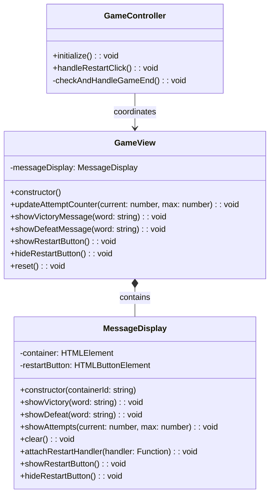

# REVIEW CONTEXT

**Project:** The Hangman Game - Web Application

**Component reviewed:** `MessageDisplay` (Class)

**Component objective:** Manage the display of game messages (attempt counter, victory/defeat messages) and the restart button. Shows dynamic feedback to the user about game progress and outcome, and provides the ability to restart the game. Part of the View layer in MVC architecture, responsible only for displaying messages and managing button visibility (no game logic).

---

# REQUIREMENTS SPECIFICATION

## Relevant Functional Requirements:

- **FR4:** Register failed attempts and increment counter - Visual indicator of failed attempts (e.g., "Attempts: 3/6")
- **FR6:** Game termination by player victory - If the player guesses all letters before reaching 6 failed attempts, a victory message is displayed and the restart option is enabled
- **FR7:** Game termination by computer victory - If 6 failed attempts are completed without guessing the word, a defeat message is displayed with the correct word and the restart option is enabled
- **FR9:** Game restart - Upon finishing a game (victory or defeat), the user can restart the game through a button

## Relevant Non-Functional Requirements:

- **NFR2:** Modular and object-oriented code following MVC architecture
- **NFR4:** Use of Bulma for interface styling - HTML elements use Bulma classes with consistent design
- **NFR5:** Unit tests with Jest with minimum 80% coverage
- **NFR6:** Complete documentation with JSDoc/TypeDoc
- **NFR7:** Code analysis with ESLint and Google style guide
- **NFR8:** Immediate response time when selecting letters - Interface updates in less than 200ms

## Visual Specifications:

**Message Display Area (`#message-container`):**
- Dynamic area showing:
  - **Attempt counter:** e.g., "Attempts: 3/6"
  - **Victory message:** When player wins (with the secret word)
  - **Defeat message:** When player loses (with the secret word)
- Initially displays attempt counter
- Must be centered text alignment
- Minimum height: 100px to prevent layout shifts

**Message Styling (CSS classes):**
- **Victory message:** 
  - Class: `.victory-message`
  - Color: Success green (#48c774)
  - Font-size: 1.5rem
  - Font-weight: bold
  
- **Defeat message:**
  - Class: `.defeat-message`
  - Color: Danger red (#f14668)
  - Font-size: 1.5rem
  - Font-weight: bold
  
- **Attempt counter:**
  - Class: `.attempt-counter`
  - Font-size: 1.25rem
  - Font-weight: 600
  - Color: Text color (#363636)

**Restart Button:**
- Class: `.restart-button`
- Appears only when game ends (victory or defeat)
- Text: "Restart Game"
- Bulma button styling with primary color

---

# CLASS DIAGRAM



**Relationships:**
- MessageDisplay is composed by GameView (Composite Pattern)
- MessageDisplay manages message display and restart button
- GameController attaches restart event handler through GameView

---

# CODE TO REVIEW

```typescript
(Referenced code)
```

---

# EVALUATION CRITERIA

## 1. DESIGN ADHERENCE (Weight: 30%)

**Checklist - Class Structure:**
- [ ] Class name is `MessageDisplay` (PascalCase)
- [ ] Has 2 private properties: `container: HTMLElement`, `restartButton: HTMLButtonElement`
- [ ] Constructor accepts `containerId: string` parameter
- [ ] Restart button created in constructor (not in showRestartButton)
- [ ] Properly exported: `export class MessageDisplay`

**Checklist - Methods (8 total):**
- [ ] `constructor(containerId: string)` - public
- [ ] `showVictory(word: string): void` - public
- [ ] `showDefeat(word: string): void` - public
- [ ] `showAttempts(current: number, max: number): void` - public
- [ ] `clear(): void` - public
- [ ] `attachRestartHandler(handler: () => void): void` - public
- [ ] `showRestartButton(): void` - public
- [ ] `hideRestartButton(): void` - public

**Checklist - DOM Integration:**
- [ ] Uses `document.getElementById()` to get container
- [ ] Uses `document.createElement('button')` for restart button
- [ ] Uses `document.createElement('div')` for message elements
- [ ] Uses `.classList.add()` for CSS classes
- [ ] Uses `.textContent` (not `.innerHTML`) for security
- [ ] Uses `addEventListener()` for restart button click
- [ ] Uses `appendChild()` and `removeChild()` for button visibility

**Checklist - Relationships:**
- [ ] No dependencies on other classes (pure View component)
- [ ] No imports needed (only uses DOM API)
- [ ] Can be composed by GameView

**Score:** __/10

**Observations:**
- [Verify all 8 methods match signatures from diagram]
- [Check message formatting matches specifications]
- [Confirm restart button properly managed]

---

## 2. CODE QUALITY (Weight: 25%)

**Analyze using these metrics:**

### Complexity Analysis:
- [ ] `constructor()`: Low (O(1) - get element, create button)
- [ ] `showVictory()`: Low (O(1) - clear, create element, set text, append)
- [ ] `showDefeat()`: Low (O(1) - same as showVictory)
- [ ] `showAttempts()`: Low (O(1) - clear, create element, set text, append)
- [ ] `clear()`: Low (O(1) - clear innerHTML)
- [ ] `attachRestartHandler()`: Low (O(1) - add event listener)
- [ ] `showRestartButton()`: Low (O(1) - appendChild)
- [ ] `hideRestartButton()`: Low (O(1) - removeChild with check)

**Cyclomatic Complexity:**
- [ ] `constructor()`: 2 (check if element exists)
- [ ] `showVictory()`: 1 (no branching)
- [ ] `showDefeat()`: 1 (no branching)
- [ ] `showAttempts()`: 1 (no branching)
- [ ] `clear()`: 1 (no branching)
- [ ] `attachRestartHandler()`: 1 (no branching)
- [ ] `showRestartButton()`: 1-2 (optional check if already in DOM)
- [ ] `hideRestartButton()`: 2 (check if in DOM before removing)
- [ ] All methods should be under complexity of 3

### Coupling:
- [ ] Fan-in: Low (only GameView depends on it)
- [ ] Fan-out: Zero (no dependencies, only DOM API)
- [ ] Excellent: Minimal coupling

### Cohesion:
- [ ] All methods relate to message display and restart button
- [ ] High cohesion expected - single responsibility

### Code Smells:
- [ ] **Long Method:** 
  - All methods should be under 15 lines
  - showVictory/showDefeat might be 8-12 lines
  
- [ ] **Large Class:** 
  - Only 8 methods, 2 properties (small, focused class)
  
- [ ] **Feature Envy:** 
  - Should not access properties of other objects
  - Only manipulates its own container and button
  
- [ ] **Code Duplication:** 
  - Check if showVictory and showDefeat have duplicate code
  - Could extract common message creation logic (optional)
  - Check if message formatting is duplicated
  
- [ ] **Magic Strings:** 
  - Message templates might be hardcoded (acceptable)
  - CSS class names (should use constants if repeated)
  
- [ ] **Primitive Obsession:**
  - Uses proper DOM types (HTMLElement, HTMLButtonElement)

**Score:** __/10

**Detected code smells:** [List any issues]

---

## 3. REQUIREMENTS COMPLIANCE (Weight: 25%)

**Checklist - Functional Requirements:**

### FR4 - Attempt Counter:
- [ ] `showAttempts()` displays format "Attempts: X/Y"
- [ ] Uses `.attempt-counter` CSS class
- [ ] Shows current and maximum attempts

### FR6 - Victory Message:
- [ ] `showVictory()` displays victory message
- [ ] Includes the secret word in message
- [ ] Uses `.victory-message` CSS class
- [ ] Format: "You Won! The word was: [WORD]" (or similar)

### FR7 - Defeat Message:
- [ ] `showDefeat()` displays defeat message
- [ ] Includes the secret word in message
- [ ] Uses `.defeat-message` CSS class
- [ ] Format: "You Lost. The word was: [WORD]" (or similar)

### FR9 - Restart Button:
- [ ] Restart button created in constructor
- [ ] Uses `.restart-button` CSS class
- [ ] Text set to "Restart Game" or similar
- [ ] Button type set to "button" (not "submit")
- [ ] `showRestartButton()` adds button to DOM
- [ ] `hideRestartButton()` removes button from DOM
- [ ] `attachRestartHandler()` attaches click event

### Message Display Requirements:
- [ ] `clear()` removes all messages from container
- [ ] clear() uses `innerHTML = ''` for efficiency
- [ ] Messages displayed with proper formatting
- [ ] Word always shown in UPPERCASE

### Edge Cases:
- [ ] Container not found: Constructor throws error
- [ ] Word case: Normalized to uppercase in messages
- [ ] showRestartButton when already shown: Safe (no duplicate)
- [ ] hideRestartButton when not shown: Safe (no error)
- [ ] clear() removes restart button if present
- [ ] Multiple message calls: Each clears previous content

### Security:
- [ ] Uses `textContent` (not `innerHTML`) for word display
- [ ] No XSS vulnerabilities
- [ ] Word parameter properly sanitized (uppercase conversion)

**Score:** __/10

**Unmet requirements:** [List any missing functionality]

---

## 4. MAINTAINABILITY (Weight: 10%)

**Checklist - Naming:**
- [ ] Class name `MessageDisplay` clearly indicates purpose
- [ ] Method names are descriptive: `showVictory`, `showDefeat`, `showAttempts`, `clear`
- [ ] Button-related methods clearly named: `showRestartButton`, `hideRestartButton`, `attachRestartHandler`
- [ ] Property names are clear: `container`, `restartButton`
- [ ] Parameter names are meaningful: `containerId`, `word`, `current`, `max`, `handler`

**Checklist - Documentation:**
- [ ] JSDoc comment block for the class
- [ ] JSDoc for constructor explaining containerId and error handling
- [ ] JSDoc for `showVictory()` with @param for word
- [ ] JSDoc for `showDefeat()` with @param for word
- [ ] JSDoc for `showAttempts()` with @param for current and max
- [ ] JSDoc for `clear()` explaining purpose
- [ ] JSDoc for `attachRestartHandler()` with @param for handler
- [ ] JSDoc for `showRestartButton()` explaining when to use
- [ ] JSDoc for `hideRestartButton()` explaining when to use
- [ ] Includes `@category View` tag for TypeDoc
- [ ] File header comment present

**Checklist - Comments:**
- [ ] No redundant comments (methods are self-explanatory)
- [ ] Comment explaining message format if complex
- [ ] No commented-out code

**Checklist - Self-documenting Code:**
- [ ] Method names clearly indicate actions
- [ ] Message format is clear from code
- [ ] Logic flow is straightforward

**Score:** __/10

**Documentation issues:** [List missing or unclear documentation]

---

## 5. BEST PRACTICES (Weight: 10%)

**Checklist - SOLID Principles:**

- [ ] **SRP (Single Responsibility):** 
  - Class only handles message display and restart button
  - No game logic, no other UI concerns
  
- [ ] **OCP (Open/Closed):** 
  - Can extend with different message types without modifying existing code
  
- [ ] **LSP, ISP, DIP:** 
  - Not directly applicable (no inheritance/interfaces)

**Checklist - Other Principles:**

- [ ] **DRY (Don't Repeat Yourself):**
  - showVictory and showDefeat might share code structure
  - Optional: Extract common message creation method
  - clear() called at start of show methods (good)
  
- [ ] **KISS (Keep It Simple):**
  - Methods are simple and focused
  - No unnecessary complexity
  
- [ ] **Separation of Concerns:**
  - No business logic in view component
  - Only handles DOM manipulation

**Checklist - Security:**
- [ ] Uses `textContent` instead of `innerHTML` for word display
- [ ] No eval() or dynamic code execution
- [ ] Input sanitization: word converted to uppercase

**Checklist - Event Handling Best Practices:**
- [ ] Uses addEventListener (not inline onclick)
- [ ] Event listener properly scoped
- [ ] Handler called when button clicked
- [ ] No memory leaks

**Checklist - DOM Best Practices:**
- [ ] Gets container element once in constructor
- [ ] Creates restart button once in constructor
- [ ] Uses `innerHTML = ''` for clearing (efficient)
- [ ] Uses `type="button"` to prevent form submission
- [ ] Checks if button is in DOM before removing (defensive)
- [ ] No memory leaks (elements properly managed)

**Checklist - TypeScript Best Practices:**
- [ ] Type annotations on all parameters and return types
- [ ] Proper use of `HTMLElement` and `HTMLButtonElement` types
- [ ] Function type for handler: `() => void`
- [ ] Null checking when getting DOM elements
- [ ] Private/public keywords used correctly
- [ ] No use of `any` type

**Checklist - Google Style Guide Compliance:**
- [ ] Class name: PascalCase ✓
- [ ] Method names: camelCase ✓
- [ ] Property names: camelCase ✓
- [ ] Indentation: 2 spaces
- [ ] Max line length: 100 characters
- [ ] Semicolons present
- [ ] No trailing spaces

**Score:** __/10

**Best practice violations:** [List any issues]

---

# DELIVERABLES

## Review Report:

**Total Score:** __/10 (weighted average)

Formula: `(Design×0.30) + (Quality×0.25) + (Requirements×0.25) + (Maintainability×0.10) + (BestPractices×0.10)`

---

**Executive Summary:**

[2-3 lines about the general state of the code - to be filled after reviewing actual code]

Example: "The MessageDisplay class provides a clean implementation for displaying game messages and managing the restart button. All message types (attempt counter, victory, defeat) are properly formatted with appropriate CSS classes. The restart button lifecycle is correctly managed with show/hide methods and event handler attachment."

---

**Critical Issues (Blockers):**

[Only if there are severe problems]

Example issues to check:

1. **Constructor doesn't throw error if container not found** - Line [X]
   - Impact: Silent failure, other methods will crash with null reference
   - Proposed solution: Add validation and throw descriptive error

2. **Restart button not created in constructor** - Line [X]
   - Impact: showRestartButton() and attachRestartHandler() will fail
   - Proposed solution: Create button in constructor, configure properties

3. **showVictory doesn't include word** - Line [X]
   - Impact: User doesn't see what the word was (requirement violation)
   - Proposed solution: Include word in message: `You Won! The word was: ${word}`

4. **showDefeat doesn't include word** - Line [X]
   - Impact: User doesn't see what the word was (requirement violation)
   - Proposed solution: Include word in message: `You Lost. The word was: ${word}`

5. **Uses innerHTML instead of textContent** - Line [X]
   - Impact: XSS vulnerability
   - Proposed solution: Use `textContent` for setting word display

6. **showVictory doesn't use .victory-message class** - Line [X]
   - Impact: Wrong styling, message won't be green
   - Proposed solution: Add `message.classList.add('victory-message')`

7. **showDefeat doesn't use .defeat-message class** - Line [X]
   - Impact: Wrong styling, message won't be red
   - Proposed solution: Add `message.classList.add('defeat-message')`

8. **showAttempts doesn't use .attempt-counter class** - Line [X]
   - Impact: Wrong styling
   - Proposed solution: Add `message.classList.add('attempt-counter')`

9. **hideRestartButton doesn't check if button is in DOM** - Line [X]
   - Impact: Error when trying to remove button not in DOM
   - Proposed solution: Check `if (this.restartButton.parentNode)`

10. **Class not exported** - Line [X]
    - Impact: Cannot be imported by GameView
    - Proposed solution: Add `export` keyword

---

**Minor Issues (Suggested improvements):**

[Non-critical issues]

Example issues to check:

1. **Word not normalized to uppercase** - Lines [X, Y]
   - Suggestion: Add `.toUpperCase()` in showVictory and showDefeat

2. **Message format could be more consistent** - Lines [X, Y]
   - Suggestion: Ensure victory/defeat messages use consistent punctuation

3. **showVictory and showDefeat have duplicate code** - Lines [X-Y]
   - Suggestion: Extract common message creation logic (optional refactoring)

4. **Missing JSDoc documentation** - Lines [X-Y]
   - Suggestion: Add JSDoc comments for class and all methods

5. **No file header comment** - Line [1]
   - Suggestion: Add brief file description

6. **Missing @category tag** - Line [X]
   - Suggestion: Add `@category View` to class JSDoc

7. **Restart button text not set** - Line [X]
   - Suggestion: Set `this.restartButton.textContent = 'Restart Game'` in constructor

8. **Restart button type not set** - Line [X]
   - Suggestion: Set `this.restartButton.type = 'button'` in constructor

9. **showRestartButton doesn't check if already shown** - Line [X]
   - Note: Multiple appendChild calls move element, doesn't duplicate
   - Suggestion: Optional defensive check for clarity

10. **CSS class names hardcoded** - Lines [X, Y, Z]
    - Suggestion: Extract as constants (optional, may be overkill)

---

**Positive Aspects:**

[Highlight what was done well]

Examples:
- All 8 methods from class diagram implemented
- Clean, focused class with single responsibility
- Proper separation of message types (victory, defeat, attempts)
- Restart button lifecycle properly managed
- Uses textContent for security (if present)
- Event handler properly attached
- No dependencies on other classes
- Clear method names with obvious purpose
- Proper use of private/public access modifiers
- Efficient DOM manipulation with clear()
- Idempotent operations (show/hide button safe to call multiple times)

---

**Decision:**

- [ ] ✅ **APPROVED** - Ready for integration
  - *Use if: All methods present, proper error handling, correct message formats with CSS classes, button lifecycle correct, uses textContent, well documented*

- [ ] ⚠️ **APPROVED WITH RESERVATIONS** - Functional but needs minor improvements
  - *Use if: Core functionality works but missing documentation, word not uppercased, or minor style issues*

- [ ] ❌ **REJECTED** - Requires corrections before continuing
  - *Use if: Missing methods, no error handling, word not included in messages, wrong CSS classes, uses innerHTML (XSS risk), button not created in constructor*
