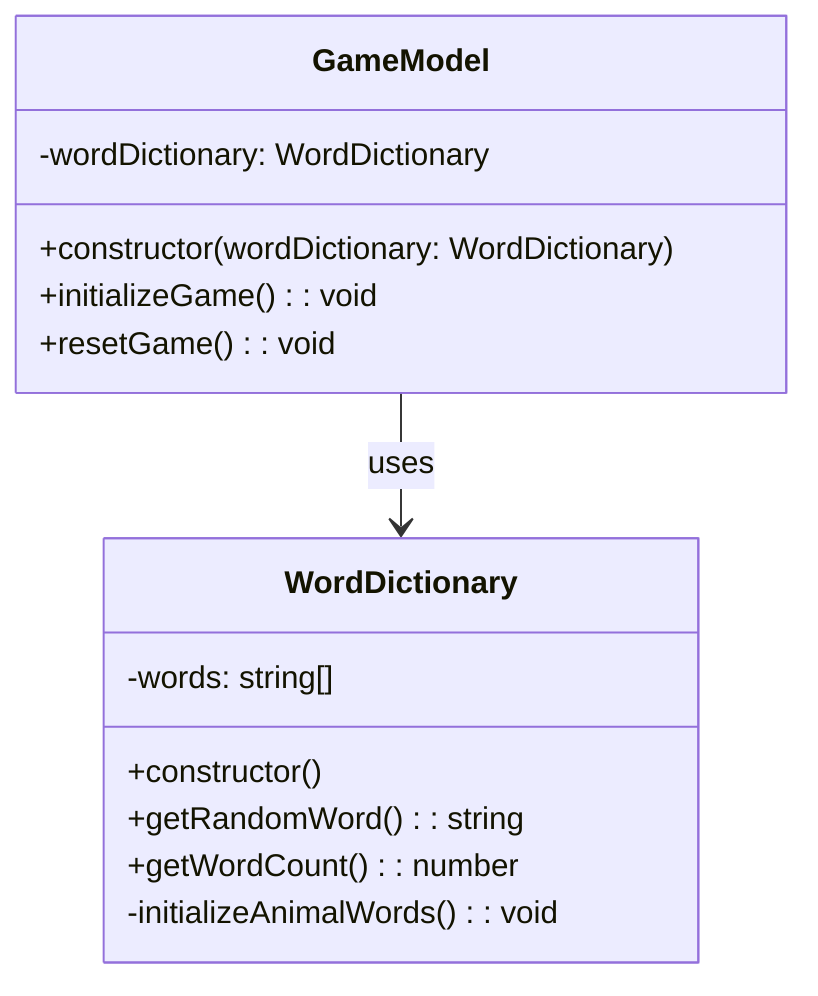

# REVIEW CONTEXT

**Project:** The Hangman Game - Web Application

**Component reviewed:** `WordDictionary` (Class)

**Component objective:** Manage the dictionary of animal names for the Hangman game. Provides functionality to store at least 10 animal names and retrieve random words for game initialization and restart. Acts as a data source for the GameModel.

---

# REQUIREMENTS SPECIFICATION

## Relevant Functional Requirements:

- **FR1:** Initialize the game displaying the word to guess - requires selecting a random word
- **FR8:** Management of animal word dictionary - The system maintains a dictionary of at least 10 animal names and randomly selects one when starting or restarting the game
- **FR9:** Game restart - Upon finishing a game, selects a new random word

## Relevant Non-Functional Requirements:

- **NFR2:** Modular and object-oriented code following MVC architecture
- **NFR3:** Implementation of three separate main classes (WordDictionary is a supporting class for GameModel)
- **NFR5:** Unit tests with Jest with minimum 80% coverage
- **NFR6:** Complete documentation with JSDoc/TypeDoc
- **NFR7:** Code analysis with ESLint and Google style guide

## Technical Context:

- **Minimum words:** At least 10 animal names
- **Word format:** All words in UPPERCASE
- **Randomness:** True random selection (same word can be selected multiple times)
- **Integration:** Used by GameModel via dependency injection

## Word Selection Criteria:

- Common, recognizable animal names
- Variety of word lengths (short, medium, long)
- English language
- No special characters or spaces

---

# CLASS DIAGRAM

**Relationships:**
- GameModel depends on WordDictionary for word selection
- WordDictionary is injected into GameModel constructor (Dependency Injection)

---

# CODE TO REVIEW

(Referenced code)

---

# EVALUATION CRITERIA

## 1. DESIGN ADHERENCE (Weight: 30%)

**Checklist:**
- [ ] Class name is `WordDictionary` (PascalCase)
- [ ] Has private property `words: string[]`
- [ ] Has `constructor()` that calls `initializeAnimalWords()`
- [ ] Has public method `getRandomWord(): string`
- [ ] Has public method `getWordCount(): number`
- [ ] Has private method `initializeAnimalWords(): void`
- [ ] All methods match the class diagram signatures
- [ ] Properly exported: `export class WordDictionary`

**Score:** __/10

**Observations:**
- [Verify method signatures match diagram]
- [Check property visibility (private/public)]
- [Confirm class structure follows OOP principles]

---

## 2. CODE QUALITY (Weight: 25%)

**Analyze using these metrics:**

### Complexity Analysis:
- [ ] `constructor()`: Low complexity (O(1) - just calls initialization)
- [ ] `getRandomWord()`: Low complexity (O(1) - random access)
- [ ] `getWordCount()`: Low complexity (O(1) - array length)
- [ ] `initializeAnimalWords()`: Low complexity (O(1) - static array assignment)

### Coupling:
- [ ] Fan-in: Low (only GameModel depends on it)
- [ ] Fan-out: Zero (no dependencies on other classes)
- [ ] Good: Single responsibility, minimal coupling

### Cohesion:
- [ ] All methods related to word dictionary management
- [ ] High cohesion expected

### Code Smells:
- [ ] **Magic Numbers:** 
  - Check if hardcoded word list is reasonable
  - Check if random index calculation uses clear logic
- [ ] **Long Method:** 
  - `initializeAnimalWords()` might be long if it has 10+ words inline
  - Acceptable for this use case (static data initialization)
- [ ] **Code Duplication:** 
  - Should not have duplicate word entries
  - Should not repeat random logic
- [ ] **Feature Envy:** 
  - Should not access internals of other classes (none expected)
- [ ] **Large Class:** 
  - Should be small (4 methods, 1 property)

**Score:** __/10

**Detected code smells:** [List any issues]

---

## 3. REQUIREMENTS COMPLIANCE (Weight: 25%)

**Checklist:**

### Functional Requirements:
- [ ] Contains **at least 10 animal names** in the dictionary
- [ ] All words are in **UPPERCASE** format
- [ ] `getRandomWord()` returns a **random** word (uses `Math.random()`)
- [ ] `getRandomWord()` can return **same word multiple times** (true randomness)
- [ ] `getWordCount()` returns **correct count** of words

### Edge Cases:
- [ ] Empty dictionary handled (should not occur with proper initialization)
- [ ] Random index calculation correct: `Math.floor(Math.random() * words.length)`
- [ ] No null/undefined returned from `getRandomWord()`

### Logic Correctness:
- [ ] Constructor initializes words array
- [ ] `initializeAnimalWords()` populates array with valid animal names
- [ ] Random selection uses proper bounds (0 to length-1)

**Score:** __/10

**Unmet requirements:** [List any missing functionality]

---

## 4. MAINTAINABILITY (Weight: 10%)

**Checklist:**

### Naming:
- [ ] Class name `WordDictionary` is descriptive and clear
- [ ] Method names follow camelCase: `getRandomWord`, `getWordCount`, `initializeAnimalWords`
- [ ] Property name `words` is clear and descriptive
- [ ] Variable names in methods are meaningful (e.g., `randomIndex`)

### Documentation:
- [ ] JSDoc comment block for the class
- [ ] JSDoc for `constructor()`
- [ ] JSDoc for `getRandomWord()` with @returns
- [ ] JSDoc for `getWordCount()` with @returns
- [ ] JSDoc for private `initializeAnimalWords()` (optional but recommended)
- [ ] Includes `@category Model` tag for TypeDoc
- [ ] File header comment present

### Comments:
- [ ] Random index calculation explained (not obvious to all readers)
- [ ] Word list organization commented if grouped by length
- [ ] No redundant comments (e.g., "increment i" for i++)

### Self-documenting Code:
- [ ] Method names clearly indicate their purpose
- [ ] Logic is straightforward and easy to follow

**Score:** __/10

**Documentation issues:** [List missing or unclear documentation]

---

## 5. BEST PRACTICES (Weight: 10%)

**Checklist:**

### SOLID Principles:
- [ ] **SRP (Single Responsibility):** Only manages word dictionary, nothing else
- [ ] **OCP (Open/Closed):** Could be extended (e.g., load words from file) without modification
- [ ] **LSP, ISP, DIP:** Not directly applicable (no inheritance/interfaces in this simple class)

### DRY (Don't Repeat Yourself):
- [ ] No duplicate word entries in the dictionary
- [ ] No repeated logic in methods

### KISS (Keep It Simple):
- [ ] Methods are simple and focused
- [ ] No unnecessary complexity
- [ ] Random selection uses standard approach

### Input Validations:
- [ ] Not critical (no external input - static word list)
- [ ] Optional: Defensive check in `getRandomWord()` if words array is empty

### Resource Management:
- [ ] Not applicable (no files, connections, or resources to manage)
- [ ] Memory efficient (single array of strings)

### TypeScript Best Practices:
- [ ] Type annotations on all methods (`: string`, `: number`, `: void`)
- [ ] Private/public keywords used appropriately
- [ ] Array type annotation: `private words: string[]`

### Google Style Guide Compliance:
- [ ] Class name: PascalCase ✓
- [ ] Method names: camelCase ✓
- [ ] Property names: camelCase ✓
- [ ] Indentation: 2 spaces
- [ ] Max line length: 100 characters
- [ ] Semicolons present
- [ ] No trailing spaces

**Score:** __/10

**Best practice violations:** [List any issues]

---

# DELIVERABLES

## Review Report:

**Total Score:** __/10 (weighted average)

Formula: `(Design×0.30) + (Quality×0.25) + (Requirements×0.25) + (Maintainability×0.10) + (BestPractices×0.10)`

---

**Executive Summary:**

[2-3 lines about the general state of the code - to be filled after reviewing actual code]

Example: "The WordDictionary class provides a clean, simple implementation for managing animal words. The random word selection logic is correct and the class follows SOLID principles. Contains the required minimum of 10 animal names in uppercase format. Minor documentation improvements may be needed."

---

**Critical Issues (Blockers):**

[Only if there are severe problems]

Example issues to check:

1. **Fewer than 10 words in dictionary** - Line [X]
   - Impact: Does not meet FR8 requirement, insufficient word variety
   - Proposed solution: Add more animal names to reach at least 10

2. **Words not in UPPERCASE** - Lines [X-Y]
   - Impact: Inconsistent with game requirements, will display incorrectly
   - Proposed solution: Convert all words to uppercase: `'elephant'` → `'ELEPHANT'`

3. **Random selection logic incorrect** - Line [X]
   - Impact: May throw index out of bounds error, or always return same word
   - Proposed solution: Use correct formula: `Math.floor(Math.random() * this.words.length)`

4. **Class not exported** - Line [X]
   - Impact: Cannot be imported by GameModel
   - Proposed solution: Add `export` keyword: `export class WordDictionary`

5. **Constructor doesn't initialize words** - Line [X]
   - Impact: words array remains empty, getRandomWord will fail
   - Proposed solution: Call `this.initializeAnimalWords()` in constructor

---

**Minor Issues (Suggested improvements):**

[Non-critical issues]

Example issues to check:

1. **Missing JSDoc documentation** - Lines [X-Y]
   - Suggestion: Add JSDoc comments for class and all public methods

2. **No comment explaining random logic** - Line [X]
   - Suggestion: Add inline comment: `// Generate random index: 0 to length-1`

3. **Words not organized by length** - Line [X]
   - Suggestion: Group words by length for better readability (optional)

4. **Missing @category tag** - Line [X]
   - Suggestion: Add `@category Model` to class JSDoc

5. **Duplicate words in dictionary** - Lines [X, Y]
   - Suggestion: Remove duplicate entries (e.g., 'ELEPHANT' appears twice)

6. **No defensive check for empty array** - Line [X]
   - Suggestion: Add check in `getRandomWord()`: `if (this.words.length === 0) throw new Error(...)`

7. **Word list includes non-animals** - Line [X]
   - Suggestion: Remove entries that aren't animals (e.g., 'TREE', 'CAR')

---

**Positive Aspects:**

[Highlight what was done well]

Examples:
- Clean, focused class with single responsibility
- Correct random word selection algorithm
- Proper use of private/public access modifiers
- Contains at least 10 words as required
- All words in uppercase format
- Good variety of word lengths (short, medium, long)
- Simple, maintainable code structure
- No unnecessary dependencies
- Efficient O(1) random access
- Follows TypeScript conventions

---

**Decision:**

- [ ] ✅ **APPROVED** - Ready for integration
  - *Use if: Has ≥10 words, all uppercase, correct random logic, properly exported, well documented*

- [ ] ⚠️ **APPROVED WITH RESERVATIONS** - Functional but needs minor improvements
  - *Use if: Works correctly but missing documentation, could use better organization, or minor style issues*

- [ ] ❌ **REJECTED** - Requires corrections before continuing
  - *Use if: <10 words, incorrect random logic, not exported, words not uppercase, missing methods*
