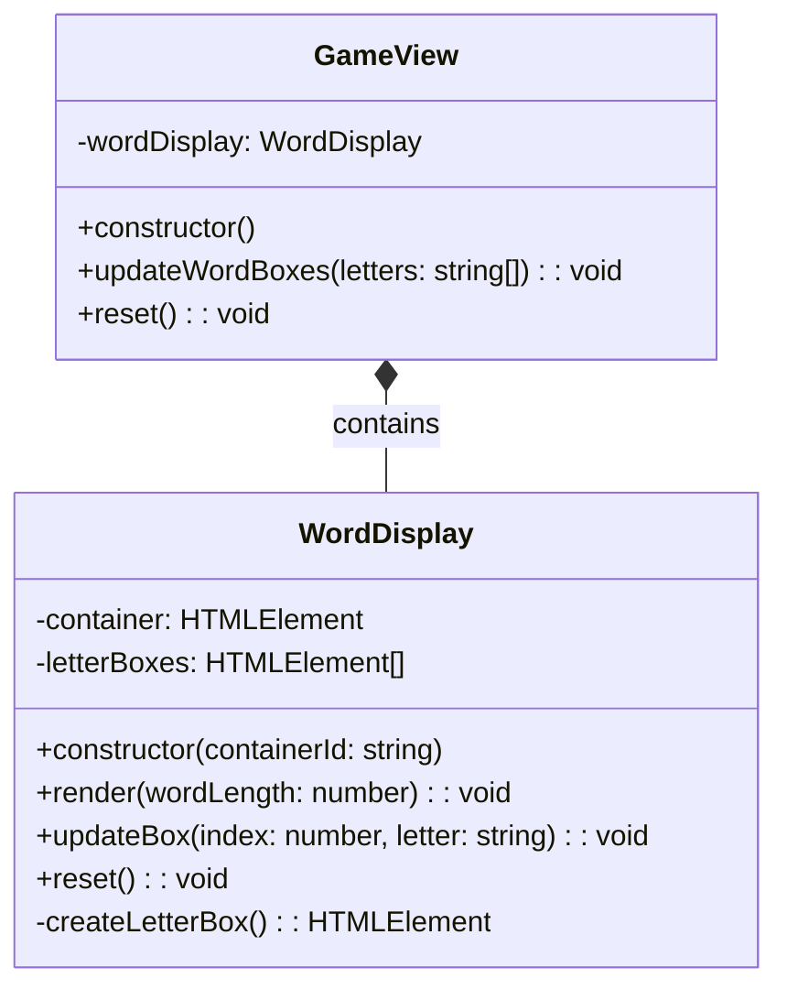

# REVIEW CONTEXT

**Project:** The Hangman Game - Web Application

**Component reviewed:** `WordDisplay` (Class)

**Component objective:** Manage the visual display of the word being guessed. Creates and updates letter boxes dynamically based on word length, reveals letters as they are correctly guessed, and resets display for new games. Part of the View layer in MVC architecture, responsible only for rendering word state (no business logic).

---

# REQUIREMENTS SPECIFICATION

## Relevant Functional Requirements:

- **FR1:** Initialize the game displaying the word to guess in empty boxes - word is displayed as empty boxes (underscores)
- **FR3:** Reveal all occurrences of correct letters - If the selected letter is in the word, all its occurrences are revealed simultaneously in the corresponding boxes
- **FR9:** Game restart - Restart resets all states including the word display

## Relevant Non-Functional Requirements:

- **NFR2:** Modular and object-oriented code following MVC architecture
- **NFR4:** Use of Bulma for interface styling - HTML elements use Bulma classes with consistent design
- **NFR5:** Unit tests with Jest with minimum 80% coverage
- **NFR6:** Complete documentation with JSDoc/TypeDoc
- **NFR7:** Code analysis with ESLint and Google style guide
- **NFR8:** Immediate response time when selecting letters - Interface updates in less than 200ms

## Visual Specifications:

**Word Display Section (`#word-container`):**
- Dynamic container displaying empty letter boxes initially
- Each box represents one letter of the secret word
- **Box specifications:**
  - Width: 50px, Height: 60px (desktop)
  - Width: 40px, Height: 50px (mobile)
  - Border: 2px solid primary color (#3273dc)
  - Border-radius: 8px
  - White background
  - Font-size: 2rem (desktop), 1.5rem (mobile)
  - Font-weight: bold
  - Centered content (flex display)
- Boxes arranged horizontally with flex-wrap
- Gap between boxes: 0.5rem
- **CSS class:** `.letter-box`

---

# CLASS DIAGRAM



**Relationships:**
- WordDisplay is composed by GameView (Composite Pattern)
- WordDisplay manages only letter box rendering, no game logic
- GameView delegates word display operations to WordDisplay

---

# CODE TO REVIEW

```typescript
(Referenced Code)
```

---

# EVALUATION CRITERIA

## 1. DESIGN ADHERENCE (Weight: 30%)

**Checklist - Class Structure:**
- [ ] Class name is `WordDisplay` (PascalCase)
- [ ] Has 2 private properties: `container: HTMLElement`, `letterBoxes: HTMLElement[]`
- [ ] Constructor accepts `containerId: string` parameter
- [ ] Properly exported: `export class WordDisplay`

**Checklist - Methods (5 total):**
- [ ] `constructor(containerId: string)` - public
- [ ] `render(wordLength: number): void` - public
- [ ] `updateBox(index: number, letter: string): void` - public
- [ ] `reset(): void` - public
- [ ] `createLetterBox(): HTMLElement` - private

**Checklist - DOM Integration:**
- [ ] Uses `document.getElementById()` to get container
- [ ] Uses `document.createElement('div')` for letter boxes
- [ ] Uses `appendChild()` to add boxes to container
- [ ] Uses `.classList.add('letter-box')` for CSS styling
- [ ] Uses `.textContent` (not `.innerHTML`) for security

**Checklist - Relationships:**
- [ ] No dependencies on other classes (pure View component)
- [ ] No imports needed (only uses DOM API)
- [ ] Can be composed by GameView

**Score:** __/10

**Observations:**
- [Verify all methods match signatures from diagram]
- [Check DOM manipulation is safe and efficient]
- [Confirm no business logic in this view component]

---

## 2. CODE QUALITY (Weight: 25%)

**Analyze using these metrics:**

### Complexity Analysis:
- [ ] `constructor()`: Low (O(1) - get element, throw error if not found)
- [ ] `render()`: Linear (O(n) where n = wordLength - loop to create boxes)
- [ ] `updateBox()`: Low (O(1) - direct array access)
- [ ] `reset()`: Low (O(1) - clear container and array)
- [ ] `createLetterBox()`: Low (O(1) - create single element)

**Cyclomatic Complexity:**
- [ ] `constructor()`: 2 (check if element exists)
- [ ] `render()`: 2 (loop for each letter)
- [ ] `updateBox()`: 1-2 (optional bounds checking)
- [ ] `reset()`: 1 (no branching)
- [ ] `createLetterBox()`: 1 (no branching)
- [ ] All methods should be under complexity of 5

### Coupling:
- [ ] Fan-in: Low (only GameView depends on it)
- [ ] Fan-out: Zero (no dependencies, only DOM API)
- [ ] Excellent: Minimal coupling, highly reusable

### Cohesion:
- [ ] All methods relate to word box display
- [ ] High cohesion expected - single responsibility

### Code Smells:
- [ ] **Long Method:** 
  - `render()` might be 10-15 lines (acceptable - simple loop)
  - All other methods should be under 10 lines
  
- [ ] **Large Class:** 
  - Only 5 methods, 2 properties (small, focused class)
  
- [ ] **Feature Envy:** 
  - Should not access properties of other objects
  - Only manipulates its own container and letterBoxes
  
- [ ] **Code Duplication:** 
  - Check if CSS class name is repeated (should use constant if repeated)
  - Check if element creation logic is duplicated
  
- [ ] **Magic Numbers:** 
  - No magic numbers expected (wordLength is parameter)
  
- [ ] **Primitive Obsession:**
  - Uses proper types (HTMLElement, HTMLElement[])
  
- [ ] **Inappropriate Intimacy:**
  - Should not directly manipulate other view components

**Score:** __/10

**Detected code smells:** [List any issues]

---

## 3. REQUIREMENTS COMPLIANCE (Weight: 25%)

**Checklist - Functional Requirements:**

### FR1 - Display Empty Boxes:
- [ ] `render()` creates correct number of boxes based on `wordLength`
- [ ] Boxes are initially empty (no text content)
- [ ] Boxes are added to container element

### FR3 - Reveal Letters:
- [ ] `updateBox()` accepts index and letter parameters
- [ ] `updateBox()` sets text content of specific box
- [ ] Letter is displayed in uppercase (`.toUpperCase()`)

### FR9 - Reset Display:
- [ ] `reset()` clears container HTML
- [ ] `reset()` clears letterBoxes array
- [ ] After reset, ready for new word rendering

### DOM Manipulation Requirements:
- [ ] Container element retrieved in constructor
- [ ] Error thrown if container not found
- [ ] Letter boxes created dynamically
- [ ] CSS class `.letter-box` applied to each box
- [ ] Uses `textContent` for XSS prevention (not `innerHTML`)

### Edge Cases:
- [ ] Container not found: Constructor throws error with descriptive message
- [ ] Invalid index in updateBox: Optional bounds checking
- [ ] wordLength = 0: Renders no boxes (edge case, but valid)
- [ ] updateBox called before render: May fail (acceptable - GameView ensures proper order)
- [ ] Multiple render calls: Previous boxes cleared automatically
- [ ] Letter case: Always displayed uppercase

### Performance:
- [ ] Direct array access in updateBox (O(1))
- [ ] Efficient DOM manipulation (batch updates if possible)
- [ ] No unnecessary reflows/repaints

**Score:** __/10

**Unmet requirements:** [List any missing functionality]

---

## 4. MAINTAINABILITY (Weight: 10%)

**Checklist - Naming:**
- [ ] Class name `WordDisplay` clearly indicates purpose
- [ ] Method names are descriptive verbs: `render`, `updateBox`, `reset`
- [ ] Property names are clear: `container`, `letterBoxes`
- [ ] Parameter names are meaningful: `containerId`, `wordLength`, `index`, `letter`
- [ ] Private method clearly named: `createLetterBox`

**Checklist - Documentation:**
- [ ] JSDoc comment block for the class
- [ ] JSDoc for constructor explaining containerId and error handling
- [ ] JSDoc for `render()` with @param and @returns
- [ ] JSDoc for `updateBox()` with @param for index and letter
- [ ] JSDoc for `reset()` explaining its purpose
- [ ] JSDoc for private `createLetterBox()` (optional but recommended)
- [ ] Includes `@category View` tag for TypeDoc
- [ ] File header comment present

**Checklist - Comments:**
- [ ] Comment explaining rendering loop logic
- [ ] Comment explaining why textContent is used (security)
- [ ] No redundant comments (e.g., "create div" for createElement)
- [ ] No commented-out code

**Checklist - Self-documenting Code:**
- [ ] Method names clearly indicate actions
- [ ] Logic flow is straightforward
- [ ] Variable names explain their purpose

**Score:** __/10

**Documentation issues:** [List missing or unclear documentation]

---

## 5. BEST PRACTICES (Weight: 10%)

**Checklist - SOLID Principles:**

- [ ] **SRP (Single Responsibility):** 
  - Class only handles word box display
  - No game logic, no event handling, no other UI concerns
  
- [ ] **OCP (Open/Closed):** 
  - Can extend with animations without modifying existing code
  
- [ ] **LSP, ISP, DIP:** 
  - Not directly applicable (no inheritance/interfaces)

**Checklist - Other Principles:**

- [ ] **DRY (Don't Repeat Yourself):**
  - createLetterBox() avoids duplicating box creation logic
  - CSS class name not hardcoded multiple times
  
- [ ] **KISS (Keep It Simple):**
  - Methods are simple and focused
  - No unnecessary complexity
  
- [ ] **Separation of Concerns:**
  - No business logic in view component
  - Only handles DOM manipulation

**Checklist - Security:**
- [ ] Uses `textContent` instead of `innerHTML` for XSS prevention
- [ ] No eval() or dynamic code execution
- [ ] Input sanitization: letter converted to uppercase (safe)

**Checklist - DOM Best Practices:**
- [ ] Gets container element once in constructor (not repeatedly)
- [ ] Stores references to letterBoxes for efficient updates
- [ ] Uses `innerHTML = ''` for clearing (efficient)
- [ ] No memory leaks (elements properly managed)

**Checklist - TypeScript Best Practices:**
- [ ] Type annotations on all parameters and return types
- [ ] Proper use of `HTMLElement` and `HTMLElement[]` types
- [ ] Null checking when getting DOM elements
- [ ] Private/public keywords used correctly
- [ ] No use of `any` type

**Checklist - Google Style Guide Compliance:**
- [ ] Class name: PascalCase ✓
- [ ] Method names: camelCase ✓
- [ ] Property names: camelCase ✓
- [ ] Indentation: 2 spaces
- [ ] Max line length: 100 characters
- [ ] Semicolons present
- [ ] No trailing spaces

**Score:** __/10

**Best practice violations:** [List any issues]

---

# DELIVERABLES

## Review Report:

**Total Score:** __/10 (weighted average)

Formula: `(Design×0.30) + (Quality×0.25) + (Requirements×0.25) + (Maintainability×0.10) + (BestPractices×0.10)`

---

**Executive Summary:**

[2-3 lines about the general state of the code - to be filled after reviewing actual code]

Example: "The WordDisplay class provides a clean, focused implementation for managing letter box rendering. DOM manipulation is safe and efficient with proper use of textContent for XSS prevention. All required methods are present and follow the class diagram. The component correctly separates view concerns from business logic."

---

**Critical Issues (Blockers):**

[Only if there are severe problems]

Example issues to check:

1. **Constructor doesn't throw error if container not found** - Line [X]
   - Impact: Silent failure, other methods will crash with null reference
   - Proposed solution: Add check and throw descriptive error
   ```typescript
   if (!element) {
     throw new Error(`Element with id "${containerId}" not found`);
   }
   ```

2. **Uses innerHTML instead of textContent** - Line [X]
   - Impact: XSS vulnerability, security risk
   - Proposed solution: Replace `box.innerHTML = letter` with `box.textContent = letter`

3. **Missing createLetterBox() method** - Not found
   - Impact: Violates class diagram, duplicates box creation logic
   - Proposed solution: Extract box creation into private method

4. **render() doesn't clear previous boxes** - Line [X]
   - Impact: Multiple render calls accumulate boxes, incorrect display
   - Proposed solution: Clear container at start: `this.container.innerHTML = ''`

5. **letterBoxes array not populated** - Line [X]
   - Impact: updateBox() cannot access boxes, will throw error
   - Proposed solution: Push boxes to array in render loop: `this.letterBoxes.push(box)`

6. **updateBox() doesn't convert letter to uppercase** - Line [X]
   - Impact: Mixed case display, inconsistent with game requirements
   - Proposed solution: Add `letter = letter.toUpperCase()`

7. **Class not exported** - Line [X]
   - Impact: Cannot be imported by GameView
   - Proposed solution: Add `export` keyword: `export class WordDisplay`

---

**Minor Issues (Suggested improvements):**

[Non-critical issues]

Example issues to check:

1. **No bounds checking in updateBox()** - Line [X]
   - Suggestion: Add validation: `if (index < 0 || index >= this.letterBoxes.length) return;`

2. **Missing JSDoc documentation** - Lines [X-Y]
   - Suggestion: Add JSDoc comments for class and all methods

3. **CSS class name hardcoded multiple times** - Lines [X, Y]
   - Suggestion: Extract as constant: `private readonly LETTER_BOX_CLASS = 'letter-box';`

4. **No file header comment** - Line [1]
   - Suggestion: Add brief file description and purpose

5. **Missing @category tag** - Line [X]
   - Suggestion: Add `@category View` to class JSDoc

6. **render() loop could be more functional** - Line [X]
   - Suggestion: Consider using Array.from() for clarity (optional)

7. **No comment explaining security choice** - Line [X]
   - Suggestion: Comment why textContent is used: `// Use textContent to prevent XSS`

8. **reset() doesn't call render after clear** - Line [X]
   - Note: This is actually correct - reset just clears, render is called separately

---

**Positive Aspects:**

[Highlight what was done well]

Examples:
- Clean, focused class with single responsibility
- All 5 methods from class diagram implemented
- Proper use of private/public access modifiers
- Efficient DOM manipulation with array storage
- Secure implementation with textContent
- No dependencies on other classes (highly reusable)
- Simple, straightforward logic
- Good separation of view from business logic
- Proper error handling in constructor
- Letter boxes properly stored for efficient updates
- Uses CSS classes for styling (separation of concerns)
- TypeScript types properly used

---

**Decision:**

- [ ] ✅ **APPROVED** - Ready for integration
  - *Use if: All methods present, proper error handling, uses textContent, clears before render, stores letterBoxes, well documented*

- [ ] ⚠️ **APPROVED WITH RESERVATIONS** - Functional but needs minor improvements
  - *Use if: Works correctly but missing documentation, no bounds checking, or minor style issues*

- [ ] ❌ **REJECTED** - Requires corrections before continuing
  - *Use if: Missing methods, no error handling in constructor, XSS vulnerability (innerHTML), doesn't clear before render, doesn't store letterBoxes*
