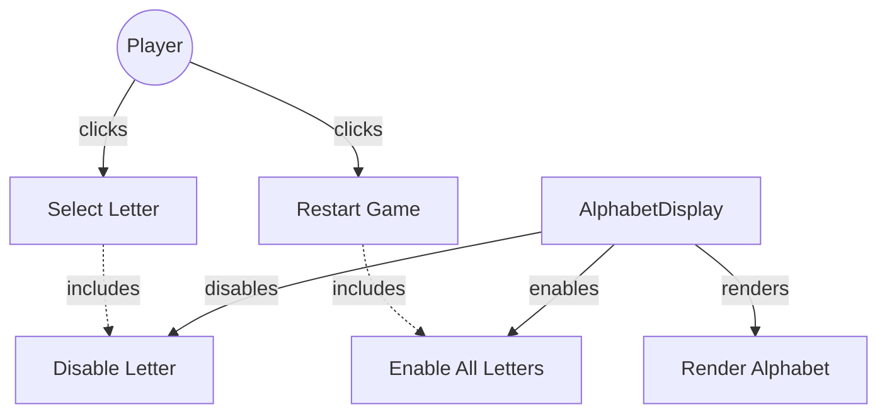

# TESTING CONTEXT

**Project:** The Hangman Game - Web Application

**Component under test:** `AlphabetDisplay` (Class)

**Testing framework:** Jest 29.7.0, ts-jest 29.2.5, jsdom environment

**Target coverage:** 
- Line coverage: ≥80%
- Function coverage: 100% (all public methods)
- Branch coverage: ≥80%

---

# CODE TO TEST

```typescript
/**
 * University of La Laguna
 * School of Engineering and Technology
 * Degree in Computer Engineering
 * Final Degree Project (TFG)
 *
 * @author Fabián González Lence <alu0101549491@ull.edu.es>
 * @since 2025-11-25
 * @file TFG-Fabian-Gonzalez-Lence/projects/1-TheHangmanGame/src/views/alphabet-display.ts
 * @desc Manages the visual display of the alphabet buttons (A-Z) and their interactions.
 * @see {@link https://github.com/alu0101549491/TFG-Fabian-Gonzalez-Lence/tree/main/projects/1-TheHangmanGame}
 * @see {@link https://typescripttutorial.net}
 */

/**
 * Manages the visual display of the alphabet buttons in the Hangman game.
 * Creates interactive buttons for each letter A-Z, handles their state (enabled/disabled),
 * and attaches click event handlers for user interaction.
 *
 * @category View
 */
export class AlphabetDisplay {
  /** Container element for the alphabet buttons */
  private container: HTMLElement;

  /** Map of letters to their corresponding button elements */
  private letterButtons: Map<string, HTMLButtonElement>;

  /**
   * Creates a new AlphabetDisplay instance.
   * @param containerId - The ID of the container HTML element
   * @throws {Error} If the container element is not found
   */
  constructor(containerId: string) {
    const element = document.getElementById(containerId);
    if (!element) {
      throw new Error(`Element with id "${containerId}" not found`);
    }
    this.container = element;
    this.letterButtons = new Map<string, HTMLButtonElement>();
  }

  /**
   * Renders the complete alphabet of clickable buttons (A-Z).
   */
  public render(): void {
    // Clear previous content
    this.container.innerHTML = '';
    this.letterButtons.clear();

    // Define the alphabet
    const alphabet = 'ABCDEFGHIJKLMNOPQRSTUVWXYZ';

    // Create a button for each letter
    for (const letter of alphabet) {
      const button = this.createLetterButton(letter);
      this.container.appendChild(button);
      this.letterButtons.set(letter, button);
    }
  }

  /**
   * Disables a specific letter button after it has been guessed.
   * @param letter - The letter to disable (case-insensitive)
   */
  public disableLetter(letter: string): void {
    const normalizedLetter = letter.toUpperCase();
    const button = this.letterButtons.get(normalizedLetter);
    if (button) {
      button.disabled = true;
    }
  }

  /**
   * Enables all letter buttons (used when resetting the game).
   */
  public enableAllLetters(): void {
    this.letterButtons.forEach(button => {
      button.disabled = false;
    });
  }

  /**
   * Attaches a click handler to all letter buttons.
   * @param handler - The function to call when a letter is clicked, receives the clicked letter as parameter
   */
  public attachClickHandler(handler: (letter: string) => void): void {
    this.letterButtons.forEach((button, letter) => {
      button.addEventListener('click', () => handler(letter));
    });
  }

  /**
   * Creates a single letter button element.
   * @param letter - The letter for this button
   * @returns A button element configured for the letter
   * @private
   */
  private createLetterButton(letter: string): HTMLButtonElement {
    const button = document.createElement('button');
    button.type = 'button';
    button.classList.add('letter-button');
    button.textContent = letter;
    button.setAttribute('aria-label', `Letter ${letter}`);
    return button;
  }
}
```

---

# JEST CONFIGURATION

```javascript
/** @type {import('ts-jest').JestConfigWithTsJest} */
export default {
  preset: 'ts-jest',
  testEnvironment: 'jsdom',
  roots: ['<rootDir>/tests', '<rootDir>/src'],
  testMatch: ['**/__tests__/**/*.ts', '**/?(*.)+(spec|test).ts'],
  transform: {
    '^.+\\.ts$': ['ts-jest', {
      tsconfig: {
        esModuleInterop: true,
        allowSyntheticDefaultImports: true,
      },
    }],
  },
  moduleNameMapper: {
    '^@/(.*)$': '<rootDir>/src/$1',
    '^@models/(.*)$': '<rootDir>/src/models/$1',
    '^@views/(.*)$': '<rootDir>/src/views/$1',
    '^@controllers/(.*)$': '<rootDir>/src/controllers/$1',
    '\\.(css|less|scss|sass)$': '<rootDir>/tests/__mocks__/styleMock.js',
  },
  collectCoverageFrom: [
    'src/**/*.ts',
    '!src/main.ts',
    '!src/**/*.d.ts',
  ],
  coverageThreshold: {
    global: {
      branches: 80,
      functions: 80,
      lines: 80,
      statements: 80,
    },
  },
  coverageDirectory: 'coverage',
  setupFilesAfterEnv: ['<rootDir>/jest.setup.js'],
};
```

---

# JEST SETUP

```javascript
// Setup file for Jest
// Add custom matchers or global test configuration here

// Mock Canvas API for testing
HTMLCanvasElement.prototype.getContext = jest.fn(() => ({
  fillStyle: '',
  strokeStyle: '',
  lineWidth: 1,
  lineCap: 'butt',
  beginPath: jest.fn(),
  moveTo: jest.fn(),
  lineTo: jest.fn(),
  arc: jest.fn(),
  stroke: jest.fn(),
  fill: jest.fn(),
  clearRect: jest.fn(),
  fillRect: jest.fn(),
  strokeRect: jest.fn(),
}));

// Mock localStorage
const localStorageMock = {
  getItem: jest.fn(),
  setItem: jest.fn(),
  removeItem: jest.fn(),
  clear: jest.fn(),
};
global.localStorage = localStorageMock;
```

---

# TYPESCRIPT CONFIGURATION

```json
{
  "compilerOptions": {
    "target": "ES2020",
    "useDefineForClassFields": true,
    "module": "ESNext",
    "lib": ["ES2020", "DOM", "DOM.Iterable"],
    "skipLibCheck": true,

    /* Bundler mode */
    "moduleResolution": "bundler",
    "allowImportingTsExtensions": true,
    "resolveJsonModule": true,
    "isolatedModules": true,
    "noEmit": true,

    /* Linting */
    "strict": true,
    "noUnusedLocals": true,
    "noUnusedParameters": true,
    "noFallthroughCasesInSwitch": true,
    "forceConsistentCasingInFileNames": true,

    /* Path mapping */
    "baseUrl": ".",
    "paths": {
      "@/*": ["src/*"],
      "@models/*": ["src/models/*"],
      "@views/*": ["src/views/*"],
      "@controllers/*": ["src/controllers/*"]
    }
  },
  "include": ["src"],
  "exclude": ["node_modules", "dist", "tests"]
}
```

---

# REQUIREMENTS SPECIFICATION

## Relevant Functional Requirements:

- **FR2:** Letter selection by the user through click - When clicking on a letter of the alphabet, it is marked as selected (no longer clickable) and the system processes whether it is correct or incorrect
- **FR9:** Game restart - Restart resets all states including re-enabling all alphabet letters
- **FR10:** Disable already selected letters - Once the user selects a letter, it must be visually marked and cannot be selected again in the same game

## Relevant Non-Functional Requirements:

- **NFR2:** Modular and object-oriented code following MVC architecture
- **NFR4:** Use of Bulma for interface styling - HTML elements use Bulma classes with consistent design
- **NFR5:** Unit tests with Jest with minimum 80% coverage
- **NFR6:** Complete documentation with JSDoc/TypeDoc
- **NFR7:** Code analysis with ESLint and Google style guide
- **NFR8:** Immediate response time when selecting letters - Interface updates in less than 200ms

## Visual Specifications:

**Alphabet Display Section (`#alphabet-container`):**
- Interactive alphabet buttons (26 letters: A-Z)

**Button specifications:**
- Width: 45px, Height: 45px (desktop) / 40px, 40px (mobile)
- Font-size: 1.25rem (desktop) / 1rem (mobile)
- Font-weight: bold
- Border: 2px solid primary color (#3273dc)
- Background: white initially
- Color: primary color initially
- Border-radius: 8px
- Cursor: pointer
- Transition: all 0.2s
- **Disabled state:** opacity 0.5, cursor not-allowed
- **CSS class:** `.letter-button`

---

# USE CASE DIAGRAM



**Context:** AlphabetDisplay manages interactive alphabet buttons with click handling and disabled state management.

---

# TASK

Generate a complete unit test suite for the `AlphabetDisplay` class that covers:

## 1. NORMAL CASES (Happy Path)

**Constructor Tests:**
- [ ] Verify constructor accepts containerId parameter
- [ ] Verify constructor finds container element by ID
- [ ] Verify constructor initializes empty letterButtons Map
- [ ] Verify constructor stores container reference

**render() Tests:**
- [ ] Verify creates exactly 26 buttons (A-Z)
- [ ] Verify buttons are appended to container
- [ ] Verify buttons are stored in letterButtons Map with letter as key
- [ ] Verify each button has correct CSS class (.letter-button)
- [ ] Verify each button displays its corresponding letter
- [ ] Verify buttons are in alphabetical order (A to Z)
- [ ] Verify each button has type="button"
- [ ] Verify Map size is 26 after render

**disableLetter() Tests:**
- [ ] Verify disables specific button
- [ ] Verify sets button.disabled = true
- [ ] Verify works with uppercase letter
- [ ] Verify works with lowercase letter (normalizes to uppercase)
- [ ] Verify button is no longer clickable after disabled

**enableAllLetters() Tests:**
- [ ] Verify enables all 26 buttons
- [ ] Verify sets button.disabled = false for each button
- [ ] Verify all buttons become clickable again
- [ ] Verify works after some buttons were disabled

**attachClickHandler() Tests:**
- [ ] Verify attaches event listener to all 26 buttons
- [ ] Verify handler is called when button clicked
- [ ] Verify handler receives correct letter parameter
- [ ] Verify handler receives uppercase letter
- [ ] Verify multiple buttons can trigger handler independently

## 2. EDGE CASES

**render() Edge Cases:**
- [ ] Verify clears previous buttons before rendering new ones
- [ ] Verify clears letterButtons Map before rendering
- [ ] Verify multiple render() calls work correctly
- [ ] Verify render() after reset works correctly

**disableLetter() Edge Cases:**
- [ ] Verify disabling already disabled button is idempotent (no error)
- [ ] Verify disabling with lowercase 'a' same as uppercase 'A'
- [ ] Verify disabling invalid letter (if defensive check present)
- [ ] Verify letter not in Map (if defensive check present)
- [ ] Verify disableLetter('A') affects only 'A' button, not others

**enableAllLetters() Edge Cases:**
- [ ] Verify enabling already enabled buttons is idempotent
- [ ] Verify works when no buttons are disabled
- [ ] Verify works when all buttons are disabled
- [ ] Verify works when some buttons are disabled

**attachClickHandler() Edge Cases:**
- [ ] Verify attaching multiple handlers works (both handlers called)
- [ ] Verify handler attached before render() doesn't crash (no buttons yet)
- [ ] Verify handler works with disabled buttons (disabled prevents click)

**Letter Case Handling:**
- [ ] Verify disableLetter('e') and disableLetter('E') affect same button
- [ ] Verify case normalization in letter parameter
- [ ] Verify Map keys are always uppercase

## 3. EXCEPTIONAL CASES (Error Handling)

**Constructor Error Cases:**
- [ ] Verify throws error when container element not found
- [ ] Verify throws error with descriptive message
- [ ] Verify error message includes container ID

**disableLetter() Error Cases:**
- [ ] Verify handles non-existent letter gracefully (if defensive check present)
- [ ] Verify handles empty string (if validation present)
- [ ] Verify handles multi-character string (if validation present)
- [ ] Verify handles special characters (if validation present)

**Map Integrity:**
- [ ] Verify letterButtons Map never has duplicate keys
- [ ] Verify letterButtons Map has exactly 26 entries after render
- [ ] Verify Map keys are all uppercase letters A-Z

## 4. INTEGRATION CASES

**GameView Integration (Mock):**
- [ ] Verify can be instantiated by GameView
- [ ] Verify works with standard container ID 'alphabet-container'
- [ ] Verify multiple AlphabetDisplay instances can coexist (different containers)

**GameController Integration (Mock):**
- [ ] Verify click handler can be attached by controller
- [ ] Verify handler receives letter in format expected by controller
- [ ] Verify disabled buttons don't trigger handler

**Event Flow Integration:**
- [ ] Verify typical game flow: render() → attachClickHandler() → click → disableLetter()
- [ ] Verify restart flow: disableLetter() × N → enableAllLetters() → all clickable again
- [ ] Verify multiple click handlers work together

**CSS Integration:**
- [ ] Verify buttons have .letter-button class for styling
- [ ] Verify disabled attribute affects CSS (opacity, cursor handled by CSS)

---

# STRUCTURE OF EACH TEST

Use the **AAA (Arrange-Act-Assert)** pattern with TypeScript and DOM testing:

```typescript
import {AlphabetDisplay} from '@views/alphabet-display';

describe('AlphabetDisplay', () => {
  let container: HTMLElement;
  let alphabetDisplay: AlphabetDisplay;

  beforeEach(() => {
    // Setup DOM
    document.body.innerHTML = '<div id="alphabet-container"></div>';
    container = document.getElementById('alphabet-container')!;
    
    // Create AlphabetDisplay instance
    alphabetDisplay = new AlphabetDisplay('alphabet-container');
  });

  afterEach(() => {
    // Cleanup DOM
    document.body.innerHTML = '';
    jest.clearAllMocks();
  });

  describe('constructor', () => {
    it('should initialize with valid container ID', () => {
      // ARRANGE: DOM setup in beforeEach
      
      // ACT
      const display = new AlphabetDisplay('alphabet-container');
      
      // ASSERT
      expect(display).toBeDefined();
      expect(display).toBeInstanceOf(AlphabetDisplay);
    });

    it('should throw error when container not found', () => {
      // ARRANGE: No container with ID 'invalid-id'
      
      // ACT & ASSERT
      expect(() => new AlphabetDisplay('invalid-id')).toThrow();
      expect(() => new AlphabetDisplay('invalid-id')).toThrow('not found');
    });
  });

  describe('render', () => {
    it('should create exactly 26 letter buttons', () => {
      // ARRANGE: alphabetDisplay already created
      
      // ACT
      alphabetDisplay.render();
      
      // ASSERT
      const buttons = container.querySelectorAll('.letter-button');
      expect(buttons.length).toBe(26);
    });

    it('should create buttons with correct letters A-Z', () => {
      // ARRANGE
      const expectedLetters = 'ABCDEFGHIJKLMNOPQRSTUVWXYZ'.split('');
      
      // ACT
      alphabetDisplay.render();
      
      // ASSERT
      const buttons = Array.from(container.querySelectorAll('.letter-button'));
      buttons.forEach((button, index) => {
        expect(button.textContent).toBe(expectedLetters[index]);
      });
    });

    it('should create buttons with type="button"', () => {
      // ARRANGE & ACT
      alphabetDisplay.render();
      
      // ASSERT
      const buttons = container.querySelectorAll('button.letter-button');
      buttons.forEach(button => {
        expect((button as HTMLButtonElement).type).toBe('button');
      });
    });

    it('should clear previous buttons before rendering', () => {
      // ARRANGE: Render first time
      alphabetDisplay.render();
      const firstButton = container.querySelector('.letter-button');
      
      // ACT: Render second time
      alphabetDisplay.render();
      
      // ASSERT: Should still have exactly 26 buttons (not 52)
      const buttons = container.querySelectorAll('.letter-button');
      expect(buttons.length).toBe(26);
    });
  });

  describe('disableLetter', () => {
    beforeEach(() => {
      // Render buttons before each test
      alphabetDisplay.render();
    });

    it('should disable specific letter button', () => {
      // ARRANGE: All buttons enabled initially
      
      // ACT
      alphabetDisplay.disableLetter('E');
      
      // ASSERT
      const buttons = Array.from(container.querySelectorAll('.letter-button'));
      const eButton = buttons.find(b => b.textContent === 'E') as HTMLButtonElement;
      expect(eButton.disabled).toBe(true);
    });

    it('should normalize lowercase letter to uppercase', () => {
      // ARRANGE & ACT
      alphabetDisplay.disableLetter('e');
      
      // ASSERT: Should disable 'E' button
      const buttons = Array.from(container.querySelectorAll('.letter-button'));
      const eButton = buttons.find(b => b.textContent === 'E') as HTMLButtonElement;
      expect(eButton.disabled).toBe(true);
    });

    it('should only disable specified letter, not others', () => {
      // ARRANGE & ACT
      alphabetDisplay.disableLetter('E');
      
      // ASSERT: E disabled, A still enabled
      const buttons = Array.from(container.querySelectorAll('.letter-button'));
      const eButton = buttons.find(b => b.textContent === 'E') as HTMLButtonElement;
      const aButton = buttons.find(b => b.textContent === 'A') as HTMLButtonElement;
      
      expect(eButton.disabled).toBe(true);
      expect(aButton.disabled).toBe(false);
    });

    it('should be idempotent when disabling already disabled button', () => {
      // ARRANGE: Disable once
      alphabetDisplay.disableLetter('E');
      
      // ACT: Disable again (should not throw)
      expect(() => alphabetDisplay.disableLetter('E')).not.toThrow();
      
      // ASSERT: Still disabled
      const buttons = Array.from(container.querySelectorAll('.letter-button'));
      const eButton = buttons.find(b => b.textContent === 'E') as HTMLButtonElement;
      expect(eButton.disabled).toBe(true);
    });
  });

  describe('enableAllLetters', () => {
    beforeEach(() => {
      alphabetDisplay.render();
    });

    it('should enable all 26 buttons', () => {
      // ARRANGE: Disable some buttons first
      alphabetDisplay.disableLetter('E');
      alphabetDisplay.disableLetter('A');
      alphabetDisplay.disableLetter('T');
      
      // ACT
      alphabetDisplay.enableAllLetters();
      
      // ASSERT: All buttons should be enabled
      const buttons = Array.from(container.querySelectorAll('.letter-button'));
      buttons.forEach(button => {
        expect((button as HTMLButtonElement).disabled).toBe(false);
      });
    });

    it('should work when no buttons are disabled', () => {
      // ARRANGE: All buttons enabled
      
      // ACT (should not throw)
      expect(() => alphabetDisplay.enableAllLetters()).not.toThrow();
      
      // ASSERT: All still enabled
      const buttons = Array.from(container.querySelectorAll('.letter-button'));
      buttons.forEach(button => {
        expect((button as HTMLButtonElement).disabled).toBe(false);
      });
    });
  });

  describe('attachClickHandler', () => {
    beforeEach(() => {
      alphabetDisplay.render();
    });

    it('should call handler when button is clicked', () => {
      // ARRANGE
      const mockHandler = jest.fn();
      alphabetDisplay.attachClickHandler(mockHandler);
      
      // ACT: Click a button
      const buttons = Array.from(container.querySelectorAll('.letter-button'));
      const eButton = buttons.find(b => b.textContent === 'E') as HTMLButtonElement;
      eButton.click();
      
      // ASSERT
      expect(mockHandler).toHaveBeenCalledTimes(1);
      expect(mockHandler).toHaveBeenCalledWith('E');
    });

    it('should pass correct letter to handler', () => {
      // ARRANGE
      const mockHandler = jest.fn();
      alphabetDisplay.attachClickHandler(mockHandler);
      
      // ACT: Click different buttons
      const buttons = Array.from(container.querySelectorAll('.letter-button'));
      const aButton = buttons.find(b => b.textContent === 'A') as HTMLButtonElement;
      const zButton = buttons.find(b => b.textContent === 'Z') as HTMLButtonElement;
      
      aButton.click();
      zButton.click();
      
      // ASSERT
      expect(mockHandler).toHaveBeenCalledTimes(2);
      expect(mockHandler).toHaveBeenNthCalledWith(1, 'A');
      expect(mockHandler).toHaveBeenNthCalledWith(2, 'Z');
    });

    it('should not call handler for disabled button', () => {
      // ARRANGE
      const mockHandler = jest.fn();
      alphabetDisplay.attachClickHandler(mockHandler);
      alphabetDisplay.disableLetter('E');
      
      // ACT: Try to click disabled button
      const buttons = Array.from(container.querySelectorAll('.letter-button'));
      const eButton = buttons.find(b => b.textContent === 'E') as HTMLButtonElement;
      eButton.click();
      
      // ASSERT: Handler should not be called (disabled button blocks click)
      expect(mockHandler).not.toHaveBeenCalled();
    });
  });
});
```

---

# TEST REQUIREMENTS

## Configuration and types:
- [ ] Import class using path alias: `import {AlphabetDisplay} from '@views/alphabet-display';`
- [ ] Setup DOM in `beforeEach()` with jsdom
- [ ] Clean up DOM in `afterEach()`
- [ ] Use TypeScript assertions with proper types
- [ ] Mock click handlers with `jest.fn()`

## DOM Testing with jsdom:
```typescript
// Setup DOM
beforeEach(() => {
  document.body.innerHTML = '<div id="alphabet-container"></div>';
  container = document.getElementById('alphabet-container')!;
});

// Query all buttons
const buttons = container.querySelectorAll('.letter-button');
const buttonArray = Array.from(buttons);

// Find specific button
const eButton = buttonArray.find(b => b.textContent === 'E') as HTMLButtonElement;

// Simulate click
eButton.click();

// Check disabled state
expect(eButton.disabled).toBe(true);
```

## Event Handler Testing:
```typescript
// Create mock handler
const mockHandler = jest.fn();

// Attach to alphabet display
alphabetDisplay.attachClickHandler(mockHandler);

// Simulate clicks
eButton.click();

// Verify handler called
expect(mockHandler).toHaveBeenCalledTimes(1);
expect(mockHandler).toHaveBeenCalledWith('E');
expect(mockHandler).toHaveBeenNthCalledWith(1, 'E');
```

## Map Testing:
```typescript
// Test Map usage (if accessible through public interface)
// Map should store letter → button associations

// After render, Map should have 26 entries
// Keys should be uppercase letters A-Z
// Values should be HTMLButtonElement instances

// Test through behavior:
// - disableLetter works for any letter A-Z
// - All 26 buttons can be disabled independently
// - enableAllLetters enables all 26 buttons
```

## Jest-specific assertions:
```typescript
// Button count
expect(buttons.length).toBe(26);
expect(buttons).toHaveLength(26);

// Button properties
expect(button.textContent).toBe('E');
expect(button.type).toBe('button');
expect(button.disabled).toBe(true);
expect(button.classList.contains('letter-button')).toBe(true);

// Event handler calls
expect(mockHandler).toHaveBeenCalled();
expect(mockHandler).toHaveBeenCalledTimes(2);
expect(mockHandler).toHaveBeenCalledWith('E');
expect(mockHandler).not.toHaveBeenCalled();

// Array operations
expect(buttonTexts).toEqual(['A', 'B', 'C', ..., 'Z']);
expect(buttonArray.every(b => !b.disabled)).toBe(true);

// Error assertions
expect(() => new AlphabetDisplay('invalid')).toThrow();
```

## Naming conventions:
- File: `alphabet-display.test.ts` in `tests/views/` directory
- Describe blocks: 'AlphabetDisplay' (class name)
- Nested describe: Method names (constructor, render, disableLetter, enableAllLetters, attachClickHandler)
- It blocks: `should [expected behavior] when [condition]`

---

# DELIVERABLES

## 1. Complete Test File

Create file: `tests/views/alphabet-display.test.ts`

```typescript
[Complete test implementation with all test cases]
```

## 2. Coverage Matrix

| Method | Normal Cases | Edge Cases | Exceptions | Integration | Total Tests |
|--------|--------------|------------|------------|-------------|-------------|
| constructor() | 2 | 0 | 2 | 1 | 5 |
| render() | 6 | 4 | 0 | 1 | 11 |
| disableLetter() | 3 | 5 | 4 | 1 | 13 |
| enableAllLetters() | 3 | 3 | 0 | 1 | 7 |
| attachClickHandler() | 3 | 3 | 0 | 2 | 8 |
| createLetterButton() | 0 | 0 | 0 | 0 | 0* |
| Event Integration | 0 | 0 | 0 | 3 | 3 |
| Map Integrity | 0 | 3 | 0 | 0 | 3 |
| **TOTAL** | **17** | **18** | **6** | **9** | **50** |

*createLetterButton() is private and tested indirectly through render()

## 3. Test Data

```typescript
// Complete alphabet for validation
const ALPHABET = 'ABCDEFGHIJKLMNOPQRSTUVWXYZ';
const ALPHABET_ARRAY = ALPHABET.split('');
const ALPHABET_SIZE = 26;

// Test letters
const TEST_LETTERS = {
  first: 'A',
  middle: 'M',
  last: 'Z',
  lowercase: 'e',
  uppercase: 'E',
};

// Helper to get all buttons
function getAllButtons(container: HTMLElement): HTMLButtonElement[] {
  return Array.from(container.querySelectorAll('.letter-button'));
}

// Helper to get button by letter
function getButtonByLetter(container: HTMLElement, letter: string): HTMLButtonElement | null {
  const buttons = getAllButtons(container);
  return buttons.find(b => b.textContent === letter.toUpperCase()) || null;
}

// Helper to get enabled buttons
function getEnabledButtons(container: HTMLElement): HTMLButtonElement[] {
  return getAllButtons(container).filter(b => !b.disabled);
}

// Helper to get disabled buttons
function getDisabledButtons(container: HTMLElement): HTMLButtonElement[] {
  return getAllButtons(container).filter(b => b.disabled);
}

// Helper to verify all buttons present
function expectAllLettersPresent(container: HTMLElement): void {
  const buttons = getAllButtons(container);
  const letters = buttons.map(b => b.textContent).join('');
  expect(letters).toBe(ALPHABET);
}

// Helper to disable multiple letters
function disableLetters(display: AlphabetDisplay, letters: string[]): void {
  letters.forEach(letter => display.disableLetter(letter));
}
```

## 4. Expected Coverage Analysis

- **Estimated line coverage:** 95-100% (all DOM manipulation and event handling is testable)
- **Estimated branch coverage:** 90-100% (case normalization, Map lookup)
- **Methods covered:** 5/5 public methods (constructor, render, disableLetter, enableAllLetters, attachClickHandler)
- **Private method coverage:** createLetterButton() tested indirectly through render()
- **Uncovered scenarios:** 
  - Optional: Defensive checks for invalid letters in disableLetter()
  - Optional: Multiple handler attachment behavior details

## 5. Execution Instructions

```bash
# Run tests for AlphabetDisplay only
npm test -- alphabet-display.test.ts

# Run tests with coverage
npm run test:coverage -- alphabet-display.test.ts

# Run tests in watch mode
npm run test:watch -- alphabet-display.test.ts

# Run with verbose output
npm test -- alphabet-display.test.ts --verbose

# Run specific test suite
npm test -- alphabet-display.test.ts -t "disableLetter"
```

---

# SPECIAL CASES TO CONSIDER

## Map Data Structure Testing:

**Test efficient O(1) lookup:**
```typescript
it('should use Map for O(1) letter lookup (test through behavior)', () => {
  alphabetDisplay.render();
  
  // Should be able to disable any letter instantly
  const letters = ['A', 'M', 'Z', 'B', 'Y'];
  
  letters.forEach(letter => {
    expect(() => alphabetDisplay.disableLetter(letter)).not.toThrow();
    
    const button = getButtonByLetter(container, letter);
    expect(button?.disabled).toBe(true);
  });
});
```

## Case Normalization:

**Critical Test Case:**
```typescript
it('should treat lowercase and uppercase identically', () => {
  alphabetDisplay.render();
  
  // Disable with lowercase
  alphabetDisplay.disableLetter('e');
  
  const eButton = getButtonByLetter(container, 'E');
  expect(eButton?.disabled).toBe(true);
  
  // Try to disable again with uppercase (should be idempotent)
  expect(() => alphabetDisplay.disableLetter('E')).not.toThrow();
  expect(eButton?.disabled).toBe(true);
});
```

## Event Handler with Disabled Buttons:

**Test native disabled behavior:**
```typescript
it('should prevent click events on disabled buttons (native HTML behavior)', () => {
  const mockHandler = jest.fn();
  alphabetDisplay.render();
  alphabetDisplay.attachClickHandler(mockHandler);
  
  // Disable button E
  alphabetDisplay.disableLetter('E');
  
  // Try to click disabled button
  const eButton = getButtonByLetter(container, 'E');
  eButton?.click();
  
  // Handler should NOT be called (disabled attribute prevents click)
  expect(mockHandler).not.toHaveBeenCalled();
});
```

## Multiple Click Handlers:

**Test multiple handler attachment:**
```typescript
it('should support multiple click handlers (all called)', () => {
  alphabetDisplay.render();
  
  const handler1 = jest.fn();
  const handler2 = jest.fn();
  
  alphabetDisplay.attachClickHandler(handler1);
  alphabetDisplay.attachClickHandler(handler2);
  
  // Click a button
  const aButton = getButtonByLetter(container, 'A');
  aButton?.click();
  
  // Both handlers should be called
  expect(handler1).toHaveBeenCalledWith('A');
  expect(handler2).toHaveBeenCalledWith('A');
});
```

## Complete Alphabet Verification:

**Test all 26 letters present:**
```typescript
it('should render all 26 letters of the alphabet in order', () => {
  alphabetDisplay.render();
  
  const buttons = getAllButtons(container);
  const letters = buttons.map(b => b.textContent);
  
  // Verify all letters present
  expect(letters).toHaveLength(26);
  expect(letters.join('')).toBe('ABCDEFGHIJKLMNOPQRSTUVWXYZ');
  
  // Verify in alphabetical order
  for (let i = 0; i < 26; i++) {
    expect(letters[i]).toBe(ALPHABET[i]);
  }
});
```

## Render Idempotence:

**Test multiple render calls:**
```typescript
it('should handle multiple render calls correctly', () => {
  // First render
  alphabetDisplay.render();
  expect(getAllButtons(container)).toHaveLength(26);
  
  // Disable some buttons
  alphabetDisplay.disableLetter('E');
  alphabetDisplay.disableLetter('A');
  
  // Second render should clear and recreate all buttons
  alphabetDisplay.render();
  
  // Should have 26 buttons again, all enabled
  const buttons = getAllButtons(container);
  expect(buttons).toHaveLength(26);
  expect(buttons.every(b => !b.disabled)).toBe(true);
});
```

---

# ADDITIONAL NOTES

## Testing Philosophy for Interactive Components:

- **Focus on user interaction:** Verify clicks trigger handlers correctly
- **Test state management:** Verify enable/disable state changes
- **Test event flow:** Click → handler called → letter passed correctly
- **Verify accessibility:** Native button elements, disabled attribute
- **Test edge cases:** Multiple handlers, disabled buttons, case normalization

## Common Pitfalls to Avoid:

1. **Don't assume CSS applied:** jsdom doesn't apply styles (opacity, cursor)
2. **Test behavior, not implementation:** Don't test Map directly, test through public methods
3. **Use native HTML disabled:** Leverages browser behavior for click prevention
4. **Mock all event handlers:** Use jest.fn() to verify handler calls

## Best Practices:

- Always render() before testing button interactions
- Use helper functions to find buttons by letter
- Test with both uppercase and lowercase inputs
- Verify handler receives correct letter parameter
- Test idempotent operations (disable twice, enable when enabled)
- Clean up DOM and mocks in afterEach()

## Integration with GameController:

```typescript
// GameController will use AlphabetDisplay like this:
const alphabetDisplay = new AlphabetDisplay('alphabet-container');

// Render alphabet
alphabetDisplay.render();

// Attach click handler
alphabetDisplay.attachClickHandler((letter: string) => {
  // Controller handles letter click
  controller.handleLetterClick(letter);
});

// Disable letter after guess
alphabetDisplay.disableLetter('E');

// Enable all on restart
alphabetDisplay.enableAllLetters();
```

## Accessibility Considerations:

- Native `<button>` elements provide keyboard accessibility
- `disabled` attribute prevents clicks and is screen-reader aware
- `type="button"` prevents form submission
- Optional: Test aria-label attributes if implemented

---

**Note to Tester AI:** AlphabetDisplay is an interactive View component managing 26 letter buttons. Focus on:

1. **Button Creation:** Verify all 26 buttons created with correct properties
2. **Event Handling:** Test click handlers receive correct letter parameter
3. **State Management:** Test enable/disable functionality thoroughly
4. **Case Normalization:** Verify lowercase/uppercase handled identically
5. **Map Usage:** Test through behavior (efficient letter lookup)
6. **Integration:** Verify works with GameController expectations

Create comprehensive tests covering all user interactions and state management scenarios.
