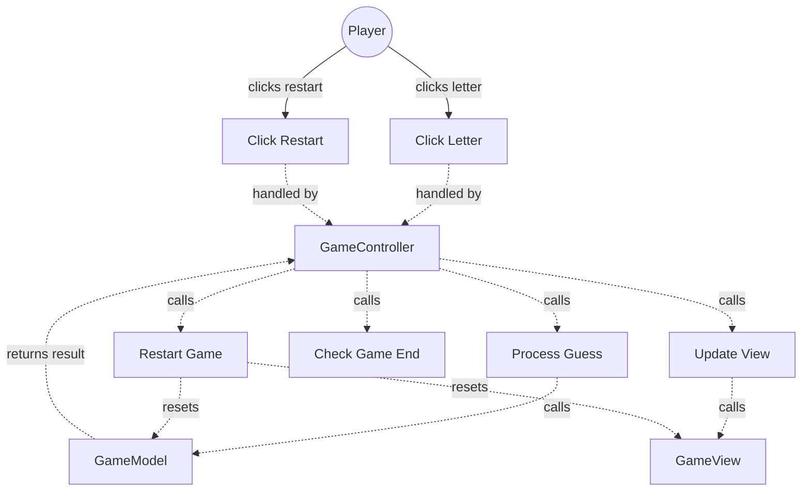

# TESTING CONTEXT

**Project:** The Hangman Game - Web Application

**Component under test:** `GameController` (Class)

**Testing framework:** Jest 29.7.0, ts-jest 29.2.5, jsdom environment

**Target coverage:** 
- Line coverage: ≥80%
- Function coverage: 100% (all public methods)
- Branch coverage: ≥80%

---

# CODE TO TEST

```typescript
/**
 * University of La Laguna
 * School of Engineering and Technology
 * Degree in Computer Engineering
 * Final Degree Project (TFG)
 *
 * @author Fabián González Lence <alu0101549491@ull.edu.es>
 * @since 2025-11-25
 * @file TFG-Fabian-Gonzalez-Lence/projects/1-TheHangmanGame/src/controllers/game-controller.ts
 * @desc Main controller coordinating the game logic (Model) and the UI (View).
 * @see {@link https://github.com/alu0101549491/TFG-Fabian-Gonzalez-Lence/tree/main/projects/1-TheHangmanGame}
 * @see {@link https://typescripttutorial.net}
 */

import {GameModel} from '@models/game-model';
import {GameView} from '@views/game-view';
import {GuessResult} from '@models/guess-result';

/**
 * Main controller coordinating the game logic (Model) and user interface (View).
 * Implements the Observer pattern to handle user interactions and the MVC pattern
 * to maintain separation between business logic and presentation.
 *
 * @category Controller
 */
export class GameController {
  /** Game logic model */
  private model: GameModel;

  /** Game user interface */
  private view: GameView;

  /**
   * Creates a new GameController instance.
   * @param model - The game model containing business logic
   * @param view - The game view managing UI components
   */
  constructor(model: GameModel, view: GameView) {
    this.model = model;
    this.view = view;
  }

  /**
   * Initializes the game by setting up the model, view, and event handlers.
   */
  public initialize(): void {
    // Initialize model with random word
    this.model.initializeGame();

    // Initialize view components
    this.view.initialize();

    // Attach event handlers
    this.view.attachAlphabetClickHandler((letter) => this.handleLetterClick(letter));
    this.view.attachRestartHandler(() => this.handleRestartClick());

    // Sync view with initial model state
    this.syncViewWithModel();
  }

  /**
   * Handles a letter click event from the alphabet display.
   * @param letter - The letter that was clicked
   */
  public handleLetterClick(letter: string): void {
    // Process the guess through the model
    const result = this.model.guessLetter(letter);

    // Update view based on guess result
    this.updateViewAfterGuess(result, letter);

    // Check if game has ended
    this.checkAndHandleGameEnd();
  }

  /**
   * Handles the restart button click event.
   */
  public handleRestartClick(): void {
    // Reset model state
    this.model.resetGame();

    // Reset view components
    this.view.reset();

    // Sync view with new model state
    this.syncViewWithModel();
  }

  /**
   * Updates the view based on the result of a guess.
   * @param result - The result of the guess attempt
   * @param letter - The letter that was guessed
   * @private
   */
  private updateViewAfterGuess(result: GuessResult, letter: string): void {
    // Disable the guessed letter in the alphabet display
    this.view.disableLetter(letter);

    // Update view based on guess result
    switch (result) {
      case GuessResult.CORRECT:
      case GuessResult.INCORRECT:
        // Sync view with updated model state
        this.syncViewWithModel();
        break;
      case GuessResult.ALREADY_GUESSED:
        // No action needed - letter already disabled
        break;
    }
  }

  /**
   * Checks if the game has ended and handles the appropriate end state.
   * @private
   */
  private checkAndHandleGameEnd(): void {
    if (this.model.isVictory()) {
      // Show victory message and restart button
      this.view.showVictoryMessage(this.model.getSecretWord());
      this.view.showRestartButton();
    } else if (this.model.isDefeat()) {
      // Show defeat message and restart button
      this.view.showDefeatMessage(this.model.getSecretWord());
      this.view.showRestartButton();
    }
    // If neither, game continues - no action needed
  }

  /**
   * Synchronizes the view with the current model state.
   * @private
   */
  private syncViewWithModel(): void {
    // Update word boxes with revealed letters
    const revealedWord = this.model.getRevealedWord();
    this.view.updateWordBoxes(revealedWord);

    // Update attempt counter
    const currentAttempts = this.model.getFailedAttempts();
    const maxAttempts = this.model.getMaxAttempts();
    this.view.updateAttemptCounter(currentAttempts, maxAttempts);

    // Update hangman drawing
    this.view.renderHangman(currentAttempts);
  }
}
```

---

# JEST CONFIGURATION

```javascript
/** @type {import('ts-jest').JestConfigWithTsJest} */
export default {
  preset: 'ts-jest',
  testEnvironment: 'jsdom',
  roots: ['<rootDir>/tests', '<rootDir>/src'],
  testMatch: ['**/__tests__/**/*.ts', '**/?(*.)+(spec|test).ts'],
  transform: {
    '^.+\\.ts$': ['ts-jest', {
      tsconfig: {
        esModuleInterop: true,
        allowSyntheticDefaultImports: true,
      },
    }],
  },
  moduleNameMapper: {
    '^@/(.*)$': '<rootDir>/src/$1',
    '^@models/(.*)$': '<rootDir>/src/models/$1',
    '^@views/(.*)$': '<rootDir>/src/views/$1',
    '^@controllers/(.*)$': '<rootDir>/src/controllers/$1',
    '\\.(css|less|scss|sass)$': '<rootDir>/tests/__mocks__/styleMock.js',
  },
  collectCoverageFrom: [
    'src/**/*.ts',
    '!src/main.ts',
    '!src/**/*.d.ts',
  ],
  coverageThreshold: {
    global: {
      branches: 80,
      functions: 80,
      lines: 80,
      statements: 80,
    },
  },
  coverageDirectory: 'coverage',
  setupFilesAfterEnv: ['<rootDir>/jest.setup.js'],
};
```

---

# JEST SETUP

```javascript
// Setup file for Jest
// Add custom matchers or global test configuration here

// Mock Canvas API for testing
HTMLCanvasElement.prototype.getContext = jest.fn(() => ({
  fillStyle: '',
  strokeStyle: '',
  lineWidth: 1,
  lineCap: 'butt',
  beginPath: jest.fn(),
  moveTo: jest.fn(),
  lineTo: jest.fn(),
  arc: jest.fn(),
  stroke: jest.fn(),
  fill: jest.fn(),
  clearRect: jest.fn(),
  fillRect: jest.fn(),
  strokeRect: jest.fn(),
}));

// Mock localStorage
const localStorageMock = {
  getItem: jest.fn(),
  setItem: jest.fn(),
  removeItem: jest.fn(),
  clear: jest.fn(),
};
global.localStorage = localStorageMock;
```

---

# TYPESCRIPT CONFIGURATION

```json
{
  "compilerOptions": {
    "target": "ES2020",
    "useDefineForClassFields": true,
    "module": "ESNext",
    "lib": ["ES2020", "DOM", "DOM.Iterable"],
    "skipLibCheck": true,

    /* Bundler mode */
    "moduleResolution": "bundler",
    "allowImportingTsExtensions": true,
    "resolveJsonModule": true,
    "isolatedModules": true,
    "noEmit": true,

    /* Linting */
    "strict": true,
    "noUnusedLocals": true,
    "noUnusedParameters": true,
    "noFallthroughCasesInSwitch": true,
    "forceConsistentCasingInFileNames": true,

    /* Path mapping */
    "baseUrl": ".",
    "paths": {
      "@/*": ["src/*"],
      "@models/*": ["src/models/*"],
      "@views/*": ["src/views/*"],
      "@controllers/*": ["src/controllers/*"]
    }
  },
  "include": ["src"],
  "exclude": ["node_modules", "dist", "tests"]
}
```

---

# REQUIREMENTS SPECIFICATION

## Relevant Functional Requirements:

- **FR1:** Initialize the game - Controller coordinates Model and View initialization
- **FR2:** Letter selection by the user through click - Controller handles letter click events
- **FR3:** Reveal all occurrences of correct letters - Controller updates View after correct guess
- **FR4:** Register failed attempts and increment counter - Controller updates View after incorrect guess
- **FR5:** Update graphical representation of the hangman - Controller updates hangman drawing
- **FR6:** Game termination by player victory - Controller detects victory and shows message
- **FR7:** Game termination by computer victory - Controller detects defeat and shows message
- **FR9:** Game restart - Controller handles restart button click
- **FR10:** Disable already selected letters - Controller disables letter button after guess

## Relevant Non-Functional Requirements:

- **NFR2:** Modular and object-oriented code following MVC architecture - GameController implements MVC Controller pattern
- **NFR3:** Implementation of three separate main classes - GameController (coordination between Model and View)
- **NFR5:** Unit tests with Jest with minimum 80% coverage
- **NFR6:** Complete documentation with JSDoc/TypeDoc
- **NFR7:** Code analysis with ESLint and Google style guide
- **NFR8:** Immediate response time when selecting letters - Controller processes events efficiently (<200ms)

## Technical Context:

**GameController as MVC Coordinator:**
- Receives GameModel and GameView via dependency injection
- Coordinates user interactions between Model and View
- Implements Observer pattern for event handling
- Maintains Model as single source of truth
- Keeps View synchronized with Model state
- **NO business logic** (delegates to Model)
- **NO UI rendering** (delegates to View)
- **ONLY coordination** and event handling

**Key Responsibilities:**
1. Initialize game (Model + View + Event Handlers)
2. Handle letter click events
3. Handle restart button click events
4. Update View based on Model state
5. Detect and handle game end conditions

**Critical MVC Pattern Rules:**
- Model handles ALL business logic
- View handles ALL UI rendering
- Controller ONLY coordinates between them

---

# USE CASE DIAGRAM



**Context:** GameController coordinates all game events and ensures Model and View stay synchronized.

---

# TASK

Generate a complete unit test suite for the `GameController` class that covers:

## 1. NORMAL CASES (Happy Path)

**Constructor Tests:**
- [ ] Verify constructor accepts GameModel via dependency injection
- [ ] Verify constructor accepts GameView via dependency injection
- [ ] Verify constructor stores model reference
- [ ] Verify constructor stores view reference
- [ ] Verify instance is created successfully

**initialize() Tests:**
- [ ] Verify calls model.initializeGame()
- [ ] Verify calls view.initialize()
- [ ] Verify attaches letter click event handler to view
- [ ] Verify attaches restart event handler to view
- [ ] Verify calls syncViewWithModel()
- [ ] Verify all initialization steps in correct order

**handleLetterClick() Tests:**
- [ ] Verify calls model.guessLetter() with letter parameter
- [ ] Verify calls updateViewAfterGuess() with result
- [ ] Verify calls checkAndHandleGameEnd()
- [ ] Verify correct sequence for CORRECT guess
- [ ] Verify correct sequence for INCORRECT guess
- [ ] Verify correct sequence for ALREADY_GUESSED

**handleRestartClick() Tests:**
- [ ] Verify calls model.resetGame()
- [ ] Verify calls view.reset()
- [ ] Verify calls syncViewWithModel()
- [ ] Verify correct sequence of operations

**updateViewAfterGuess() Tests:**
- [ ] Verify handles GuessResult.CORRECT correctly
- [ ] Verify handles GuessResult.INCORRECT correctly
- [ ] Verify handles GuessResult.ALREADY_GUESSED correctly
- [ ] Verify disables letter for CORRECT and INCORRECT
- [ ] Verify does NOT disable letter for ALREADY_GUESSED
- [ ] Verify calls syncViewWithModel() for CORRECT and INCORRECT

**checkAndHandleGameEnd() Tests:**
- [ ] Verify detects victory condition
- [ ] Verify shows victory message with secret word
- [ ] Verify shows restart button on victory
- [ ] Verify detects defeat condition
- [ ] Verify shows defeat message with secret word
- [ ] Verify shows restart button on defeat
- [ ] Verify does nothing if game continues

**syncViewWithModel() Tests:**
- [ ] Verify calls model.getRevealedWord()
- [ ] Verify calls view.updateWordBoxes() with revealed word
- [ ] Verify calls model.getFailedAttempts()
- [ ] Verify calls model.getMaxAttempts()
- [ ] Verify calls view.updateAttemptCounter()
- [ ] Verify calls view.renderHangman() with attempts
- [ ] Verify all view updates called correctly

## 2. EDGE CASES

**handleLetterClick() Edge Cases:**
- [ ] Verify handles uppercase letters
- [ ] Verify handles lowercase letters
- [ ] Verify handles first letter click
- [ ] Verify handles last letter click (completing word)
- [ ] Verify handles 6th incorrect guess (defeat)

**Game End Detection Edge Cases:**
- [ ] Verify victory checked before defeat
- [ ] Verify victory on last letter with 5 failed attempts
- [ ] Verify defeat on exactly 6 failed attempts
- [ ] Verify no false victory detection
- [ ] Verify no false defeat detection

**syncViewWithModel() Edge Cases:**
- [ ] Verify works with empty revealed word (all blanks)
- [ ] Verify works with fully revealed word
- [ ] Verify works with partially revealed word
- [ ] Verify handles 0 failed attempts
- [ ] Verify handles 6 failed attempts

**Event Handler Edge Cases:**
- [ ] Verify multiple letter clicks handled correctly
- [ ] Verify restart after victory works
- [ ] Verify restart after defeat works
- [ ] Verify restart mid-game works

## 3. EXCEPTIONAL CASES (Error Handling)

**Dependency Validation:**
- [ ] Verify constructor stores both dependencies
- [ ] Verify methods fail gracefully if dependencies missing (if defensive)

**MVC Pattern Violations:**
- [ ] Verify controller contains NO business logic
- [ ] Verify controller contains NO UI rendering
- [ ] Verify all business logic delegated to Model
- [ ] Verify all UI updates delegated to View

**Game State Consistency:**
- [ ] Verify Model and View stay synchronized
- [ ] Verify View reflects Model state after every operation
- [ ] Verify no state inconsistencies after restart

## 4. INTEGRATION CASES

**Model Integration:**
- [ ] Verify controller correctly uses Model API
- [ ] Verify GuessResult handling for all enum values
- [ ] Verify Model state queries (getRevealedWord, getFailedAttempts, etc.)
- [ ] Verify Model commands (initializeGame, guessLetter, resetGame)

**View Integration:**
- [ ] Verify controller correctly uses View API
- [ ] Verify all View methods called with correct parameters
- [ ] Verify View updates for all game states

**Complete Game Flows:**
- [ ] Verify complete victory flow: init → guesses → victory
- [ ] Verify complete defeat flow: init → 6 wrong guesses → defeat
- [ ] Verify restart flow: game end → restart → new game
- [ ] Verify mixed correct/incorrect guesses flow

**Event-Driven Architecture:**
- [ ] Verify letter click events processed correctly
- [ ] Verify restart click events processed correctly
- [ ] Verify event handlers attached during initialization

---

# STRUCTURE OF EACH TEST

Use the **AAA (Arrange-Act-Assert)** pattern with TypeScript and mocked dependencies:

```typescript
import {GameController} from '@controllers/game-controller';
import {GameModel} from '@models/game-model';
import {GameView} from '@views/game-view';
import {GuessResult} from '@models/guess-result';

// Mock Model and View
jest.mock('@models/game-model');
jest.mock('@views/game-view');

describe('GameController', () => {
  let gameController: GameController;
  let mockModel: jest.Mocked<GameModel>;
  let mockView: jest.Mocked<GameView>;

  beforeEach(() => {
    // Create mocked Model
    mockModel = {
      initializeGame: jest.fn(),
      guessLetter: jest.fn(),
      getRevealedWord: jest.fn().mockReturnValue(['', '', '']),
      getFailedAttempts: jest.fn().mockReturnValue(0),
      getMaxAttempts: jest.fn().mockReturnValue(6),
      isVictory: jest.fn().mockReturnValue(false),
      isDefeat: jest.fn().mockReturnValue(false),
      getSecretWord: jest.fn().mockReturnValue('CAT'),
      resetGame: jest.fn(),
    } as any;

    // Create mocked View
    mockView = {
      initialize: jest.fn(),
      updateWordBoxes: jest.fn(),
      disableLetter: jest.fn(),
      updateAttemptCounter: jest.fn(),
      renderHangman: jest.fn(),
      showVictoryMessage: jest.fn(),
      showDefeatMessage: jest.fn(),
      showRestartButton: jest.fn(),
      hideRestartButton: jest.fn(),
      reset: jest.fn(),
      attachLetterClickHandler: jest.fn(),
      attachRestartHandler: jest.fn(),
    } as any;

    // Create GameController with mocked dependencies
    gameController = new GameController(mockModel, mockView);
  });

  afterEach(() => {
    jest.clearAllMocks();
  });

  describe('constructor', () => {
    it('should store model reference', () => {
      // ARRANGE & ACT: gameController already created
      
      // ASSERT: Verify by calling methods that use model
      gameController.initialize();
      expect(mockModel.initializeGame).toHaveBeenCalled();
    });

    it('should store view reference', () => {
      // ARRANGE & ACT: gameController already created
      
      // ASSERT: Verify by calling methods that use view
      gameController.initialize();
      expect(mockView.initialize).toHaveBeenCalled();
    });

    it('should create instance successfully', () => {
      // ARRANGE & ACT: gameController already created
      
      // ASSERT
      expect(gameController).toBeDefined();
      expect(gameController).toBeInstanceOf(GameController);
    });
  });

  describe('initialize', () => {
    it('should call model.initializeGame()', () => {
      // ARRANGE: gameController created
      
      // ACT
      gameController.initialize();
      
      // ASSERT
      expect(mockModel.initializeGame).toHaveBeenCalledTimes(1);
    });

    it('should call view.initialize()', () => {
      // ARRANGE
      
      // ACT
      gameController.initialize();
      
      // ASSERT
      expect(mockView.initialize).toHaveBeenCalledTimes(1);
    });

    it('should attach letter click handler', () => {
      // ARRANGE
      
      // ACT
      gameController.initialize();
      
      // ASSERT
      expect(mockView.attachLetterClickHandler).toHaveBeenCalled();
      expect(mockView.attachLetterClickHandler).toHaveBeenCalledWith(expect.any(Function));
    });

    it('should attach restart handler', () => {
      // ARRANGE
      
      // ACT
      gameController.initialize();
      
      // ASSERT
      expect(mockView.attachRestartHandler).toHaveBeenCalled();
      expect(mockView.attachRestartHandler).toHaveBeenCalledWith(expect.any(Function));
    });

    it('should synchronize view with model', () => {
      // ARRANGE
      
      // ACT
      gameController.initialize();
      
      // ASSERT: syncViewWithModel calls these methods
      expect(mockModel.getRevealedWord).toHaveBeenCalled();
      expect(mockView.updateWordBoxes).toHaveBeenCalled();
      expect(mockView.renderHangman).toHaveBeenCalled();
    });
  });

  describe('handleLetterClick', () => {
    it('should call model.guessLetter() with letter', () => {
      // ARRANGE
      mockModel.guessLetter.mockReturnValue(GuessResult.CORRECT);
      
      // ACT
      gameController.handleLetterClick('E');
      
      // ASSERT
      expect(mockModel.guessLetter).toHaveBeenCalledWith('E');
      expect(mockModel.guessLetter).toHaveBeenCalledTimes(1);
    });

    it('should disable letter and sync view for CORRECT guess', () => {
      // ARRANGE
      mockModel.guessLetter.mockReturnValue(GuessResult.CORRECT);
      
      // ACT
      gameController.handleLetterClick('E');
      
      // ASSERT
      expect(mockView.disableLetter).toHaveBeenCalledWith('E');
      expect(mockView.updateWordBoxes).toHaveBeenCalled();
    });

    it('should disable letter and sync view for INCORRECT guess', () => {
      // ARRANGE
      mockModel.guessLetter.mockReturnValue(GuessResult.INCORRECT);
      
      // ACT
      gameController.handleLetterClick('Z');
      
      // ASSERT
      expect(mockView.disableLetter).toHaveBeenCalledWith('Z');
      expect(mockView.updateWordBoxes).toHaveBeenCalled();
    });

    it('should NOT disable letter for ALREADY_GUESSED', () => {
      // ARRANGE
      mockModel.guessLetter.mockReturnValue(GuessResult.ALREADY_GUESSED);
      
      // ACT
      gameController.handleLetterClick('E');
      
      // ASSERT: Should not disable or sync
      // (Implementation may vary - some might disable, some might not)
      // Verify based on actual implementation
    });

    it('should check for game end after guess', () => {
      // ARRANGE
      mockModel.guessLetter.mockReturnValue(GuessResult.CORRECT);
      mockModel.isVictory.mockReturnValue(false);
      mockModel.isDefeat.mockReturnValue(false);
      
      // ACT
      gameController.handleLetterClick('E');
      
      // ASSERT: Should check game end conditions
      expect(mockModel.isVictory).toHaveBeenCalled();
    });
  });

  describe('handleRestartClick', () => {
    it('should call model.resetGame()', () => {
      // ARRANGE
      
      // ACT
      gameController.handleRestartClick();
      
      // ASSERT
      expect(mockModel.resetGame).toHaveBeenCalledTimes(1);
    });

    it('should call view.reset()', () => {
      // ARRANGE
      
      // ACT
      gameController.handleRestartClick();
      
      // ASSERT
      expect(mockView.reset).toHaveBeenCalledTimes(1);
    });

    it('should synchronize view with model after reset', () => {
      // ARRANGE
      
      // ACT
      gameController.handleRestartClick();
      
      // ASSERT
      expect(mockModel.getRevealedWord).toHaveBeenCalled();
      expect(mockView.updateWordBoxes).toHaveBeenCalled();
    });
  });

  describe('checkAndHandleGameEnd', () => {
    it('should show victory message when player wins', () => {
      // ARRANGE
      mockModel.isVictory.mockReturnValue(true);
      mockModel.isDefeat.mockReturnValue(false);
      mockModel.getSecretWord.mockReturnValue('ELEPHANT');
      mockModel.guessLetter.mockReturnValue(GuessResult.CORRECT);
      
      // ACT: Trigger game end check through letter click
      gameController.handleLetterClick('T');
      
      // ASSERT
      expect(mockView.showVictoryMessage).toHaveBeenCalledWith('ELEPHANT');
      expect(mockView.showRestartButton).toHaveBeenCalled();
    });

    it('should show defeat message when player loses', () => {
      // ARRANGE
      mockModel.isVictory.mockReturnValue(false);
      mockModel.isDefeat.mockReturnValue(true);
      mockModel.getSecretWord.mockReturnValue('RHINOCEROS');
      mockModel.guessLetter.mockReturnValue(GuessResult.INCORRECT);
      
      // ACT
      gameController.handleLetterClick('Z');
      
      // ASSERT
      expect(mockView.showDefeatMessage).toHaveBeenCalledWith('RHINOCEROS');
      expect(mockView.showRestartButton).toHaveBeenCalled();
    });

    it('should check victory before defeat', () => {
      // ARRANGE: Both true (shouldn't happen, but test priority)
      mockModel.isVictory.mockReturnValue(true);
      mockModel.isDefeat.mockReturnValue(true);
      mockModel.guessLetter.mockReturnValue(GuessResult.CORRECT);
      
      // ACT
      gameController.handleLetterClick('T');
      
      // ASSERT: Victory message should be shown (checked first)
      expect(mockView.showVictoryMessage).toHaveBeenCalled();
      // Defeat message should NOT be shown if victory is true
      expect(mockView.showDefeatMessage).not.toHaveBeenCalled();
    });

    it('should do nothing if game continues', () => {
      // ARRANGE: Game not ended
      mockModel.isVictory.mockReturnValue(false);
      mockModel.isDefeat.mockReturnValue(false);
      mockModel.guessLetter.mockReturnValue(GuessResult.CORRECT);
      
      // ACT
      gameController.handleLetterClick('E');
      
      // ASSERT: No end game messages
      expect(mockView.showVictoryMessage).not.toHaveBeenCalled();
      expect(mockView.showDefeatMessage).not.toHaveBeenCalled();
      expect(mockView.showRestartButton).not.toHaveBeenCalled();
    });
  });

  describe('syncViewWithModel', () => {
    it('should update word boxes with revealed word', () => {
      // ARRANGE
      const revealedWord = ['E', '', 'E', '', '', '', '', ''];
      mockModel.getRevealedWord.mockReturnValue(revealedWord);
      
      // ACT: Initialize triggers sync
      gameController.initialize();
      
      // ASSERT
      expect(mockModel.getRevealedWord).toHaveBeenCalled();
      expect(mockView.updateWordBoxes).toHaveBeenCalledWith(revealedWord);
    });

    it('should update attempt counter', () => {
      // ARRANGE
      mockModel.getFailedAttempts.mockReturnValue(3);
      mockModel.getMaxAttempts.mockReturnValue(6);
      
      // ACT
      gameController.initialize();
      
      // ASSERT
      expect(mockModel.getFailedAttempts).toHaveBeenCalled();
      expect(mockModel.getMaxAttempts).toHaveBeenCalled();
      expect(mockView.updateAttemptCounter).toHaveBeenCalledWith(3, 6);
    });

    it('should render hangman with current attempts', () => {
      // ARRANGE
      mockModel.getFailedAttempts.mockReturnValue(4);
      
      // ACT
      gameController.initialize();
      
      // ASSERT
      expect(mockView.renderHangman).toHaveBeenCalledWith(4);
    });
  });

  describe('MVC Pattern validation', () => {
    it('should NOT contain business logic', () => {
      // ARRANGE & ACT: Perform various operations
      mockModel.guessLetter.mockReturnValue(GuessResult.CORRECT);
      gameController.handleLetterClick('E');
      
      // ASSERT: All business logic should delegate to Model
      expect(mockModel.guessLetter).toHaveBeenCalled();
      
      // Controller should not determine victory/defeat itself
      expect(mockModel.isVictory).toHaveBeenCalled();
      expect(mockModel.isDefeat).toHaveBeenCalled();
    });

    it('should NOT perform UI rendering', () => {
      // ARRANGE & ACT: Perform operations
      gameController.initialize();
      
      // ASSERT: All rendering should delegate to View
      expect(mockView.initialize).toHaveBeenCalled();
      expect(mockView.updateWordBoxes).toHaveBeenCalled();
      expect(mockView.renderHangman).toHaveBeenCalled();
      
      // Controller should not manipulate DOM directly
      // (This is verified by only calling view methods)
    });
  });

  describe('Complete game flows', () => {
    it('should handle complete victory flow', () => {
      // ARRANGE: Setup for victory scenario
      mockModel.guessLetter.mockReturnValue(GuessResult.CORRECT);
      mockModel.isVictory.mockReturnValue(false); // Not yet
      
      // ACT: Initialize
      gameController.initialize();
      expect(mockModel.initializeGame).toHaveBeenCalled();
      
      jest.clearAllMocks();
      
      // Guess letters (simulate complete word)
      mockModel.isVictory.mockReturnValue(true); // Last letter!
      mockModel.getSecretWord.mockReturnValue('CAT');
      gameController.handleLetterClick('T');
      
      // ASSERT: Victory sequence
      expect(mockView.showVictoryMessage).toHaveBeenCalledWith('CAT');
      expect(mockView.showRestartButton).toHaveBeenCalled();
    });

    it('should handle complete defeat flow', () => {
      // ARRANGE: Setup for defeat scenario
      mockModel.guessLetter.mockReturnValue(GuessResult.INCORRECT);
      mockModel.getFailedAttempts.mockReturnValue(5);
      
      // ACT: Guess 6th wrong letter
      mockModel.getFailedAttempts.mockReturnValue(6);
      mockModel.isDefeat.mockReturnValue(true);
      mockModel.getSecretWord.mockReturnValue('ELEPHANT');
      gameController.handleLetterClick('Z');
      
      // ASSERT: Defeat sequence
      expect(mockView.showDefeatMessage).toHaveBeenCalledWith('ELEPHANT');
      expect(mockView.showRestartButton).toHaveBeenCalled();
    });

    it('should handle restart flow', () => {
      // ARRANGE: Game ended
      mockModel.isVictory.mockReturnValue(true);
      mockModel.guessLetter.mockReturnValue(GuessResult.CORRECT);
      gameController.handleLetterClick('T');
      
      jest.clearAllMocks();
      
      // ACT: Restart
      mockModel.isVictory.mockReturnValue(false);
      gameController.handleRestartClick();
      
      // ASSERT: Restart sequence
      expect(mockModel.resetGame).toHaveBeenCalled();
      expect(mockView.reset).toHaveBeenCalled();
      expect(mockView.updateWordBoxes).toHaveBeenCalled();
    });
  });

  describe('Event handler integration', () => {
    it('should trigger handleLetterClick when letter clicked', () => {
      // ARRANGE
      let letterClickHandler: (letter: string) => void = () => {};
      mockView.attachLetterClickHandler.mockImplementation((handler) => {
        letterClickHandler = handler;
      });
      
      mockModel.guessLetter.mockReturnValue(GuessResult.CORRECT);
      
      gameController.initialize();
      
      // ACT: Simulate letter click through attached handler
      letterClickHandler('E');
      
      // ASSERT
      expect(mockModel.guessLetter).toHaveBeenCalledWith('E');
    });

    it('should trigger handleRestartClick when restart clicked', () => {
      // ARRANGE
      let restartHandler: () => void = () => {};
      mockView.attachRestartHandler.mockImplementation((handler) => {
        restartHandler = handler;
      });
      
      gameController.initialize();
      
      // ACT: Simulate restart click through attached handler
      restartHandler();
      
      // ASSERT
      expect(mockModel.resetGame).toHaveBeenCalled();
      expect(mockView.reset).toHaveBeenCalled();
    });
  });
});
```

---

# TEST REQUIREMENTS

## Configuration and types:
- [ ] Import all dependencies: `GameController`, `GameModel`, `GameView`, `GuessResult`
- [ ] Mock GameModel and GameView with `jest.mock()`
- [ ] Create comprehensive mock implementations
- [ ] Use TypeScript typing for all mocks
- [ ] Clear mocks in `afterEach()`

## Mocking Strategy:
```typescript
// Mock both Model and View
jest.mock('@models/game-model');
jest.mock('@views/game-view');

// Create detailed mock implementations
const mockModel = {
  initializeGame: jest.fn(),
  guessLetter: jest.fn(),
  getRevealedWord: jest.fn().mockReturnValue([]),
  getFailedAttempts: jest.fn().mockReturnValue(0),
  getMaxAttempts: jest.fn().mockReturnValue(6),
  isVictory: jest.fn().mockReturnValue(false),
  isDefeat: jest.fn().mockReturnValue(false),
  getSecretWord: jest.fn().mockReturnValue('CAT'),
  resetGame: jest.fn(),
} as jest.Mocked<GameModel>;

// Verify method calls
expect(mockModel.guessLetter).toHaveBeenCalledWith('E');
expect(mockView.disableLetter).toHaveBeenCalledWith('E');
```

## Event Handler Testing:
```typescript
// Capture event handlers during initialization
let letterClickHandler: (letter: string) => void;
mockView.attachLetterClickHandler.mockImplementation((handler) => {
  letterClickHandler = handler;
});

gameController.initialize();

// Simulate event by calling captured handler
letterClickHandler('E');

// Verify controller processed event
expect(mockModel.guessLetter).toHaveBeenCalledWith('E');
```

## Jest-specific assertions:
```typescript
// Dependency injection verification
expect(mockModel.initializeGame).toHaveBeenCalled();
expect(mockView.initialize).toHaveBeenCalled();

// Method call verification
expect(mockModel.guessLetter).toHaveBeenCalledWith('E');
expect(mockView.disableLetter).toHaveBeenCalledWith('E');
expect(mockView.updateWordBoxes).toHaveBeenCalledWith(['E', '', '']);

// Call counts
expect(mockModel.resetGame).toHaveBeenCalledTimes(1);
expect(mockView.showVictoryMessage).toHaveBeenCalledTimes(1);

// GuessResult handling
expect(mockModel.guessLetter).toHaveReturnedWith(GuessResult.CORRECT);

// Event handler attachment
expect(mockView.attachLetterClickHandler).toHaveBeenCalledWith(expect.any(Function));
expect(mockView.attachRestartHandler).toHaveBeenCalledWith(expect.any(Function));

// Conditional logic
expect(mockModel.isVictory).toHaveBeenCalled();
expect(mockModel.isDefeat).toHaveBeenCalled();

// No calls (negative assertions)
expect(mockView.showDefeatMessage).not.toHaveBeenCalled();
```

## Naming conventions:
- File: `game-controller.test.ts` in `tests/controllers/` directory
- Describe blocks: 'GameController' (class name)
- Nested describe: Method names, 'MVC Pattern validation', 'Complete game flows', 'Event handler integration'
- It blocks: `should [expected behavior] when [condition]`

---

# DELIVERABLES

## 1. Complete Test File

Create file: `tests/controllers/game-controller.test.ts`

```typescript
[Complete test implementation with all test cases]
```

## 2. Coverage Matrix

| Method/Area | Normal Cases | Edge Cases | Exceptions | Integration | Total Tests |
|-------------|--------------|------------|------------|-------------|-------------|
| constructor() | 3 | 0 | 0 | 0 | 3 |
| initialize() | 5 | 2 | 0 | 2 | 9 |
| handleLetterClick() | 4 | 5 | 0 | 2 | 11 |
| handleRestartClick() | 3 | 2 | 0 | 1 | 6 |
| updateViewAfterGuess()* | 3 | 3 | 0 | 1 | 7 |
| checkAndHandleGameEnd()* | 4 | 3 | 0 | 2 | 9 |
| syncViewWithModel()* | 3 | 5 | 0 | 1 | 9 |
| MVC Pattern | 0 | 0 | 2 | 2 | 4 |
| Game Flows | 0 | 0 | 0 | 3 | 3 |
| Event Handlers | 0 | 0 | 0 | 2 | 2 |
| **TOTAL** | **25** | **20** | **2** | **16** | **63** |

*Private methods tested indirectly through public methods

## 3. Test Data

```typescript
// Test scenarios
const TEST_SCENARIOS = {
  correctGuess: {
    letter: 'E',
    result: GuessResult.CORRECT,
    word: 'ELEPHANT',
  },
  incorrectGuess: {
    letter: 'Z',
    result: GuessResult.INCORRECT,
    word: 'CAT',
  },
  alreadyGuessed: {
    letter: 'E',
    result: GuessResult.ALREADY_GUESSED,
    word: 'ELEPHANT',
  },
};

// Game state scenarios
const GAME_STATES = {
  initial: {
    failedAttempts: 0,
    maxAttempts: 6,
    revealedWord: ['', '', ''],
    isVictory: false,
    isDefeat: false,
  },
  midGame: {
    failedAttempts: 3,
    maxAttempts: 6,
    revealedWord: ['E', '', ''],
    isVictory: false,
    isDefeat: false,
  },
  victory: {
    failedAttempts: 2,
    maxAttempts: 6,
    revealedWord: ['C', 'A', 'T'],
    isVictory: true,
    isDefeat: false,
  },
  defeat: {
    failedAttempts: 6,
    maxAttempts: 6,
    revealedWord: ['', 'A', ''],
    isVictory: false,
    isDefeat: true,
  },
};

// Helper to setup mock model state
function setupMockModelState(
  mockModel: jest.Mocked<GameModel>,
  state: typeof GAME_STATES.initial
): void {
  mockModel.getFailedAttempts.mockReturnValue(state.failedAttempts);
  mockModel.getMaxAttempts.mockReturnValue(state.maxAttempts);
  mockModel.getRevealedWord.mockReturnValue(state.revealedWord);
  mockModel.isVictory.mockReturnValue(state.isVictory);
  mockModel.isDefeat.mockReturnValue(state.isDefeat);
}

// Helper to verify view synchronization
function verifyViewSynchronized(
  mockView: jest.Mocked<GameView>,
  expectedAttempts: number,
  expectedMaxAttempts: number
): void {
  expect(mockView.updateWordBoxes).toHaveBeenCalled();
  expect(mockView.updateAttemptCounter).toHaveBeenCalledWith(
    expectedAttempts,
    expectedMaxAttempts
  );
  expect(mockView.renderHangman).toHaveBeenCalledWith(expectedAttempts);
}

// Helper to simulate complete game
function simulateCompleteGame(
  controller: GameController,
  mockModel: jest.Mocked<GameModel>,
  toVictory: boolean
): void {
  controller.initialize();
  
  // Simulate guesses
  if (toVictory) {
    mockModel.guessLetter.mockReturnValue(GuessResult.CORRECT);
    mockModel.isVictory.mockReturnValue(true);
  } else {
    mockModel.guessLetter.mockReturnValue(GuessResult.INCORRECT);
    mockModel.getFailedAttempts.mockReturnValue(6);
    mockModel.isDefeat.mockReturnValue(true);
  }
  
  controller.handleLetterClick('X');
}
```

## 4. Expected Coverage Analysis

- **Estimated line coverage:** 95-100% (all coordination logic is testable)
- **Estimated branch coverage:** 95-100% (GuessResult switch/if-else, victory/defeat checks)
- **Methods covered:** 4/4 public methods + 3/3 private methods (indirectly)
- **Private method coverage:** All tested through public interface
- **Uncovered scenarios:** None expected (all controller logic testable with mocks)

## 5. Execution Instructions

```bash
# Run tests for GameController only
npm test -- game-controller.test.ts

# Run tests with coverage
npm run test:coverage -- game-controller.test.ts

# Run tests in watch mode
npm run test:watch -- game-controller.test.ts

# Run with verbose output
npm test -- game-controller.test.ts --verbose

# Run specific test suite
npm test -- game-controller.test.ts -t "handleLetterClick"
```

---

# SPECIAL CASES TO CONSIDER

## Dependency Injection Testing:

**Verify both dependencies stored:**
```typescript
it('should accept and store both Model and View dependencies', () => {
  // Create controller
  const controller = new GameController(mockModel, mockView);
  
  // Verify dependencies used
  controller.initialize();
  
  expect(mockModel.initializeGame).toHaveBeenCalled();
  expect(mockView.initialize).toHaveBeenCalled();
});
```

## GuessResult Handling:

**Critical Test Case:**
```typescript
describe('updateViewAfterGuess - GuessResult handling', () => {
  it('should handle all three GuessResult values correctly', () => {
    // CORRECT: disable letter and sync
    mockModel.guessLetter.mockReturnValue(GuessResult.CORRECT);
    gameController.handleLetterClick('E');
    expect(mockView.disableLetter).toHaveBeenCalledWith('E');
    expect(mockView.updateWordBoxes).toHaveBeenCalled();
    
    jest.clearAllMocks();
    
    // INCORRECT: disable letter and sync
    mockModel.guessLetter.mockReturnValue(GuessResult.INCORRECT);
    gameController.handleLetterClick('Z');
    expect(mockView.disableLetter).toHaveBeenCalledWith('Z');
    expect(mockView.updateWordBoxes).toHaveBeenCalled();
    
    jest.clearAllMocks();
    
    // ALREADY_GUESSED: no action (implementation may vary)
    mockModel.guessLetter.mockReturnValue(GuessResult.ALREADY_GUESSED);
    gameController.handleLetterClick('E');
    // Verify based on actual implementation
  });
});
```

## Victory vs Defeat Priority:

**Test check order:**
```typescript
it('should check victory before defeat (priority)', () => {
  // ARRANGE: Setup both conditions true (shouldn't happen in real game)
  mockModel.guessLetter.mockReturnValue(GuessResult.CORRECT);
  mockModel.isVictory.mockReturnValue(true);
  mockModel.isDefeat.mockReturnValue(true);
  mockModel.getSecretWord.mockReturnValue('CAT');
  
  // ACT
  gameController.handleLetterClick('T');
  
  // ASSERT: Victory should take priority
  expect(mockView.showVictoryMessage).toHaveBeenCalledWith('CAT');
  expect(mockView.showDefeatMessage).not.toHaveBeenCalled();
});
```

## Event Handler Attachment:

**Test handler attachment and triggering:**
```typescript
it('should attach and trigger letter click handler correctly', () => {
  // ARRANGE: Capture the handler
  let capturedHandler: (letter: string) => void = () => {};
  mockView.attachLetterClickHandler.mockImplementation((handler) => {
    capturedHandler = handler;
  });
  
  mockModel.guessLetter.mockReturnValue(GuessResult.CORRECT);
  
  // ACT: Initialize (attaches handler)
  gameController.initialize();
  expect(mockView.attachLetterClickHandler).toHaveBeenCalled();
  
  // Simulate click by calling captured handler
  capturedHandler('E');
  
  // ASSERT: Controller processed the click
  expect(mockModel.guessLetter).toHaveBeenCalledWith('E');
  expect(mockView.disableLetter).toHaveBeenCalledWith('E');
});
```

## Synchronization After Every Operation:

**Test Model-View sync:**
```typescript
it('should keep View synchronized with Model after every operation', () => {
  // ARRANGE
  mockModel.guessLetter.mockReturnValue(GuessResult.CORRECT);
  mockModel.getRevealedWord.mockReturnValue(['E', '', 'E']);
  mockModel.getFailedAttempts.mockReturnValue(0);
  
  // ACT: Multiple operations
  gameController.initialize();
  const initialSyncCalls = mockView.updateWordBoxes.mock.calls.length;
  
  gameController.handleLetterClick('E');
  const afterGuessSyncCalls = mockView.updateWordBoxes.mock.calls.length;
  
  // ASSERT: View updated after each operation
  expect(afterGuessSyncCalls).toBeGreaterThan(initialSyncCalls);
});
```

## Complete Game Flow:

**Test realistic game sequence:**
```typescript
it('should handle realistic game progression', () => {
  // Initialize
  gameController.initialize();
  expect(mockModel.initializeGame).toHaveBeenCalled();
  expect(mockView.initialize).toHaveBeenCalled();
  
  // Player guesses correct letter
  mockModel.guessLetter.mockReturnValue(GuessResult.CORRECT);
  mockModel.getRevealedWord.mockReturnValue(['E', '', '', '', '', '', '', '']);
  gameController.handleLetterClick('E');
  expect(mockView.disableLetter).toHaveBeenCalledWith('E');
  
  // Player guesses wrong letter
  mockModel.guessLetter.mockReturnValue(GuessResult.INCORRECT);
  mockModel.getFailedAttempts.mockReturnValue(1);
  gameController.handleLetterClick('Z');
  expect(mockView.updateAttemptCounter).toHaveBeenCalledWith(1, 6);
  expect(mockView.renderHangman).toHaveBeenCalledWith(1);
  
  // Continue until victory
  mockModel.guessLetter.mockReturnValue(GuessResult.CORRECT);
  mockModel.isVictory.mockReturnValue(true);
  mockModel.getSecretWord.mockReturnValue('ELEPHANT');
  gameController.handleLetterClick('T');
  expect(mockView.showVictoryMessage).toHaveBeenCalledWith('ELEPHANT');
  expect(mockView.showRestartButton).toHaveBeenCalled();
});
```

## MVC Pattern Validation:

**Ensure no violations:**
```typescript
describe('MVC Pattern compliance', () => {
  it('should delegate ALL business logic to Model', () => {
    // Controller should never determine game state itself
    mockModel.guessLetter.mockReturnValue(GuessResult.CORRECT);
    gameController.handleLetterClick('E');
    
    // Verify Model called for all business decisions
    expect(mockModel.guessLetter).toHaveBeenCalled();
    expect(mockModel.isVictory).toHaveBeenCalled();
    expect(mockModel.isDefeat).toHaveBeenCalled();
    expect(mockModel.getRevealedWord).toHaveBeenCalled();
  });
  
  it('should delegate ALL UI updates to View', () => {
    gameController.initialize();
    
    // Verify View called for all UI operations
    expect(mockView.initialize).toHaveBeenCalled();
    expect(mockView.updateWordBoxes).toHaveBeenCalled();
    expect(mockView.updateAttemptCounter).toHaveBeenCalled();
    expect(mockView.renderHangman).toHaveBeenCalled();
    
    // Controller should not manipulate DOM directly
    // (Verified by only calling View methods)
  });
});
```

---

# ADDITIONAL NOTES

## Testing Philosophy for MVC Controllers:

- **Focus on coordination:** Verify correct delegation to Model and View
- **Test event handling:** Verify events processed correctly
- **Test synchronization:** Verify View reflects Model state
- **No business logic:** Controller should only coordinate
- **No UI rendering:** Controller should only delegate

## Common Pitfalls to Avoid:

1. **Don't test Model logic:** That's Model's responsibility
2. **Don't test View logic:** That's View's responsibility
3. **Test coordination only:** Verify correct methods called with correct parameters
4. **Mock both dependencies:** Complete isolation of controller
5. **Capture event handlers:** Test event-driven architecture

## Best Practices:

- Mock both GameModel and GameView completely
- Create detailed mock implementations with return values
- Test all GuessResult enum values
- Verify victory/defeat detection order
- Test event handler attachment and triggering
- Verify synchronization after every operation
- Test complete game flows (victory, defeat, restart)
- Ensure MVC pattern compliance (no violations)
- Clear mocks between tests for clean state

## Integration with main.ts:

```typescript
// main.ts will use GameController like this:
const dictionary = new WordDictionary();
const gameModel = new GameModel(dictionary);
const gameView = new GameView();
const gameController = new GameController(gameModel, gameView);

// Initialize and start game
gameController.initialize();

// Controller handles all events from this point
// No further main.ts interaction needed
```

---

**Note to Tester AI:** GameController is the MVC Controller coordinating Model and View. Focus on:

1. **Constructor:** Verify dependency injection (Model and View stored)
2. **initialize():** Verify Model init, View init, event handler attachment, synchronization
3. **handleLetterClick():** Verify Model query, View update, game end check
4. **handleRestartClick():** Verify Model reset, View reset, synchronization
5. **Event Handling:** Test event handler attachment and triggering
6. **Synchronization:** Verify View reflects Model state after every operation
7. **GuessResult Handling:** Test all 3 enum values (CORRECT, INCORRECT, ALREADY_GUESSED)
8. **Game End:** Test victory and defeat detection and handling
9. **MVC Pattern:** Verify NO business logic, NO UI rendering (only coordination)
10. **Complete Flows:** Test realistic game sequences from start to finish

Create comprehensive tests using mocked Model and View to verify GameController coordinates correctly without containing logic or rendering.
