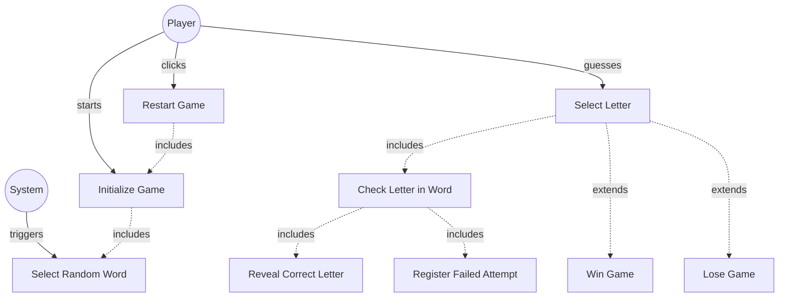

# TESTING CONTEXT

**Project:** The Hangman Game - Web Application

**Component under test:** `GameModel` (Class)

**Testing framework:** Jest 29.7.0, ts-jest 29.2.5

**Target coverage:** 
- Line coverage: ≥80%
- Function coverage: 100% (all public methods)
- Branch coverage: ≥80%

---

# CODE TO TEST

```typescript
/**
 * University of La Laguna
 * School of Engineering and Technology
 * Degree in Computer Engineering
 * Final Degree Project (TFG)
 *
 * @author Fabián González Lence <alu0101549491@ull.edu.es>
 * @since 2025-11-25
 * @file TFG-Fabian-Gonzalez-Lence/projects/1-TheHangmanGame/src/models/game-model.ts
 * @desc Core game logic for the Hangman game; manages state and processes guesses.
 * @see {@link https://github.com/alu0101549491/TFG-Fabian-Gonzalez-Lence/tree/main/projects/1-TheHangmanGame}
 * @see {@link https://typescripttutorial.net}
 */

import {GuessResult} from './guess-result';
import {WordDictionary} from './word-dictionary';

/**
 * Core game logic for the Hangman game.
 * Manages game state, processes guesses, and determines victory/defeat conditions.
 *
 * @category Model
 */
export class GameModel {
  /** The secret word to be guessed */
  private secretWord: string;

  /** Set of letters that have been guessed */
  private readonly guessedLetters: Set<string>;

  /** Number of incorrect guess attempts made */
  private failedAttempts: number;

  /** Maximum number of allowed failed attempts */
  private readonly maxAttempts: number = 6;

  /** Dictionary providing random words */
  private wordDictionary: WordDictionary;

  /**
   * Creates a new GameModel instance.
   * @param wordDictionary - The dictionary to use for selecting secret words
   */
  constructor(wordDictionary: WordDictionary) {
    this.wordDictionary = wordDictionary;
    this.secretWord = '';
    this.guessedLetters = new Set();
    this.failedAttempts = 0;
  }

  /**
   * Initializes a new game with a random word.
   */
  public initializeGame(): void {
    this.secretWord = this.wordDictionary.getRandomWord();
    this.guessedLetters.clear();
    this.failedAttempts = 0;
  }

/**
   * Processes a letter guess and updates game state.
   * @param letter - The letter being guessed
   * @returns The result of the guess attempt
   */
  public guessLetter(letter: string): GuessResult {
    // Validate input: single alphabetic character
    if (!letter || typeof letter !== 'string' || !/^[a-zA-Z]$/.test(letter)) {
      throw new Error('Invalid letter. Must be a single alphabetic character.');
    }

    // Normalize to uppercase
    letter = letter.toUpperCase();

    // Ensure game initialized
    if (!this.secretWord) {
      throw new Error('Game not initialized. Call initializeGame() first.');
    }

    // Prevent processing when game already ended
    if (this.isGameOver()) {
      throw new Error('Game is over. Call resetGame() to start a new game.');
    }

    // Check if letter has already been guessed
    if (this.isLetterGuessed(letter)) {
      return GuessResult.ALREADY_GUESSED;
    }

    // Add letter to guessed set
    this.guessedLetters.add(letter);

    // Check if letter exists in secret word
    if (this.secretWord.includes(letter)) {
      return GuessResult.CORRECT;
    } else {
      this.failedAttempts++;
      return GuessResult.INCORRECT;
    }
  }

  /**
   * Checks if a specific letter has already been guessed.
   * @param letter - The letter to check
   * @returns True if the letter has been guessed, false otherwise
   */
  public isLetterGuessed(letter: string): boolean {
    return this.guessedLetters.has(letter.toUpperCase());
  }

  /**
   * Generates the current state of the word with revealed letters.
   * @returns Array where each element is either the letter (if guessed) or empty string
   */
  public getRevealedWord(): string[] {
    const revealed: string[] = [];

    for (const char of this.secretWord) {
      if (this.guessedLetters.has(char)) {
        revealed.push(char);
      } else {
        revealed.push('');
      }
    }

    return revealed;
  }

  /**
   * Gets the current number of failed attempts.
   * @returns The number of incorrect guesses
   */
  public getFailedAttempts(): number {
    return this.failedAttempts;
  }

  /**
   * Gets the maximum allowed number of failed attempts.
   * @returns The maximum attempts allowed
   */
  public getMaxAttempts(): number {
    return this.maxAttempts;
  }

  /**
   * Checks if the game has ended (either victory or defeat).
   * @returns True if the game is over, false otherwise
   */
  public isGameOver(): boolean {
    return this.isVictory() || this.isDefeat();
  }

  /**
   * Checks if the player has won the game.
   * @returns True if all letters have been correctly guessed
   */
  public isVictory(): boolean {
    return this.checkVictoryCondition();
  }

  /**
   * Checks if the player has lost the game.
   * @returns True if maximum failed attempts reached
   */
  public isDefeat(): boolean {
    return this.failedAttempts >= this.maxAttempts;
  }

  /**
   * Reveals the secret word (used when game ends).
   * @returns The complete secret word
   */
  public getSecretWord(): string {
    return this.secretWord;
  }

  /**
   * Resets the game state for a new game.
   */
  public resetGame(): void {
    this.initializeGame();
  }

  /**
   * Checks if the player has successfully guessed all letters.
   * @returns True if victory condition is met
   * @private
   */
  private checkVictoryCondition(): boolean {
    // Check unique letters only
    const uniqueLetters = new Set(this.secretWord);
    for (const char of uniqueLetters) {
      if (!this.guessedLetters.has(char)) {
        return false;
      }
    }
    return true;
  }
}
```

---

# JEST CONFIGURATION

```javascript
/** @type {import('ts-jest').JestConfigWithTsJest} */
export default {
  preset: 'ts-jest',
  testEnvironment: 'jsdom',
  roots: ['<rootDir>/tests', '<rootDir>/src'],
  testMatch: ['**/__tests__/**/*.ts', '**/?(*.)+(spec|test).ts'],
  transform: {
    '^.+\\.ts$': ['ts-jest', {
      tsconfig: {
        esModuleInterop: true,
        allowSyntheticDefaultImports: true,
      },
    }],
  },
  moduleNameMapper: {
    '^@/(.*)$': '<rootDir>/src/$1',
    '^@models/(.*)$': '<rootDir>/src/models/$1',
    '^@views/(.*)$': '<rootDir>/src/views/$1',
    '^@controllers/(.*)$': '<rootDir>/src/controllers/$1',
    '\\.(css|less|scss|sass)$': '<rootDir>/tests/__mocks__/styleMock.js',
  },
  collectCoverageFrom: [
    'src/**/*.ts',
    '!src/main.ts',
    '!src/**/*.d.ts',
  ],
  coverageThreshold: {
    global: {
      branches: 80,
      functions: 80,
      lines: 80,
      statements: 80,
    },
  },
  coverageDirectory: 'coverage',
  setupFilesAfterEnv: ['<rootDir>/jest.setup.js'],
};
```

---

# JEST SETUP

```javascript
// Setup file for Jest
// Add custom matchers or global test configuration here

// Mock Canvas API for testing
HTMLCanvasElement.prototype.getContext = jest.fn(() => ({
  fillStyle: '',
  strokeStyle: '',
  lineWidth: 1,
  lineCap: 'butt',
  beginPath: jest.fn(),
  moveTo: jest.fn(),
  lineTo: jest.fn(),
  arc: jest.fn(),
  stroke: jest.fn(),
  fill: jest.fn(),
  clearRect: jest.fn(),
  fillRect: jest.fn(),
  strokeRect: jest.fn(),
}));

// Mock localStorage
const localStorageMock = {
  getItem: jest.fn(),
  setItem: jest.fn(),
  removeItem: jest.fn(),
  clear: jest.fn(),
};
global.localStorage = localStorageMock;
```

---

# TYPESCRIPT CONFIGURATION

```json
{
  "compilerOptions": {
    "target": "ES2020",
    "useDefineForClassFields": true,
    "module": "ESNext",
    "lib": ["ES2020", "DOM", "DOM.Iterable"],
    "skipLibCheck": true,

    /* Bundler mode */
    "moduleResolution": "bundler",
    "allowImportingTsExtensions": true,
    "resolveJsonModule": true,
    "isolatedModules": true,
    "noEmit": true,

    /* Linting */
    "strict": true,
    "noUnusedLocals": true,
    "noUnusedParameters": true,
    "noFallthroughCasesInSwitch": true,
    "forceConsistentCasingInFileNames": true,

    /* Path mapping */
    "baseUrl": ".",
    "paths": {
      "@/*": ["src/*"],
      "@models/*": ["src/models/*"],
      "@views/*": ["src/views/*"],
      "@controllers/*": ["src/controllers/*"]
    }
  },
  "include": ["src"],
  "exclude": ["node_modules", "dist", "tests"]
}
```

---

# REQUIREMENTS SPECIFICATION

## Relevant Functional Requirements:

- **FR1:** Initialize the game displaying the word to guess in empty boxes
- **FR2:** Letter selection by the user through click - system processes whether it is correct or incorrect
- **FR3:** Reveal all occurrences of correct letters - if letter is in word, all occurrences revealed
- **FR4:** Register failed attempts and increment counter - Each incorrect letter increments counter (max 6)
- **FR6:** Game termination by player victory - Player guesses all letters before 6 failed attempts
- **FR7:** Game termination by computer victory - 6 failed attempts completed without guessing word
- **FR8:** Management of animal word dictionary - Randomly selects word when starting
- **FR9:** Game restart - Selects new random word and resets all states
- **FR10:** Disable already selected letters - Tracks which letters have been guessed

## Relevant Non-Functional Requirements:

- **NFR2:** Modular and object-oriented code following MVC architecture
- **NFR3:** Implementation of three separate main classes - GameModel (data and business logic)
- **NFR5:** Unit tests with Jest with minimum 80% coverage
- **NFR6:** Complete documentation with JSDoc/TypeDoc
- **NFR7:** Code analysis with ESLint and Google style guide

## Technical Context:

**Game Rules:**
- Secret word selected from WordDictionary
- Maximum 6 failed attempts before defeat
- All letters must be guessed for victory
- Already guessed letters should not change game state

**State Management:**
- `secretWord`: The current word to guess (uppercase)
- `guessedLetters`: Set of all letters guessed (correct + incorrect)
- `failedAttempts`: Counter for incorrect guesses (0-6)
- `maxAttempts`: Constant value of 6

---

# USE CASE DIAGRAM



**Context:** GameModel contains all game logic and state management for the Hangman game.

---

# TASK

Generate a complete unit test suite for the `GameModel` class that covers:

## 1. NORMAL CASES (Happy Path)

**Constructor Tests:**
- [ ] Verify constructor accepts WordDictionary via dependency injection
- [ ] Verify constructor initializes all properties correctly
- [ ] Verify maxAttempts is set to 6
- [ ] Verify failedAttempts starts at 0
- [ ] Verify guessedLetters Set is empty initially

**initializeGame() Tests:**
- [ ] Verify calls wordDictionary.getRandomWord()
- [ ] Verify sets secretWord from dictionary
- [ ] Verify clears guessedLetters Set
- [ ] Verify resets failedAttempts to 0
- [ ] Verify secretWord is non-empty after initialization

**guessLetter() - Correct Guess Tests:**
- [ ] Verify returns GuessResult.CORRECT when letter is in word
- [ ] Verify adds letter to guessedLetters Set
- [ ] Verify does NOT increment failedAttempts
- [ ] Verify works with lowercase input (normalizes to uppercase)
- [ ] Verify works for multiple occurrences of same letter

**guessLetter() - Incorrect Guess Tests:**
- [ ] Verify returns GuessResult.INCORRECT when letter not in word
- [ ] Verify adds letter to guessedLetters Set
- [ ] Verify increments failedAttempts by 1
- [ ] Verify works with lowercase input (normalizes to uppercase)

**guessLetter() - Already Guessed Tests:**
- [ ] Verify returns GuessResult.ALREADY_GUESSED for duplicate correct letter
- [ ] Verify returns GuessResult.ALREADY_GUESSED for duplicate incorrect letter
- [ ] Verify does NOT add letter again (Set prevents duplicates)
- [ ] Verify does NOT increment failedAttempts
- [ ] Verify guessedLetters Set size doesn't change

**isLetterGuessed() Tests:**
- [ ] Verify returns true for guessed letter
- [ ] Verify returns false for unguessed letter
- [ ] Verify works case-insensitively (normalizes to uppercase)

**getRevealedWord() Tests:**
- [ ] Verify returns array with empty strings for unguessed letters
- [ ] Verify returns letters for guessed positions
- [ ] Verify array length matches secretWord length
- [ ] Verify all occurrences of guessed letter are revealed
- [ ] Verify returns all letters when all guessed (victory state)

**Victory Condition Tests:**
- [ ] Verify isVictory() returns true when all letters guessed
- [ ] Verify isVictory() returns false when some letters missing
- [ ] Verify checkVictoryCondition() handles words with duplicate letters correctly
- [ ] Verify isGameOver() returns true when victory achieved

**Defeat Condition Tests:**
- [ ] Verify isDefeat() returns true when failedAttempts === 6
- [ ] Verify isDefeat() returns false when failedAttempts < 6
- [ ] Verify isGameOver() returns true when defeat reached

**Getter Tests:**
- [ ] Verify getFailedAttempts() returns current count
- [ ] Verify getMaxAttempts() returns 6
- [ ] Verify getSecretWord() returns the secret word

**resetGame() Tests:**
- [ ] Verify calls initializeGame()
- [ ] Verify selects new word
- [ ] Verify resets all state (guesses, attempts)

## 2. EDGE CASES

**Word with Duplicate Letters:**
- [ ] Verify words like "ELEPHANT" (2 E's) work correctly
- [ ] Verify victory condition checks unique letters, not total count
- [ ] Verify getRevealedWord() shows all occurrences of guessed letter

**Single Letter Word:**
- [ ] Verify works with single-letter word (edge case)
- [ ] Verify victory after one correct guess

**All Incorrect Guesses:**
- [ ] Verify reaches defeat after exactly 6 incorrect guesses
- [ ] Verify does not allow 7th failed attempt

**All Correct Guesses:**
- [ ] Verify victory when guessing all unique letters
- [ ] Verify no failed attempts recorded for correct guesses only

**Mixed Correct and Incorrect:**
- [ ] Verify game progresses correctly with mixed guesses
- [ ] Verify can win with some failed attempts (e.g., 3 wrong, but word guessed)
- [ ] Verify can lose with some correct guesses (e.g., 6 wrong, word not complete)

**Letter Case Handling:**
- [ ] Verify lowercase 'e' treated same as uppercase 'E'
- [ ] Verify mixed case inputs normalized correctly
- [ ] Verify guessedLetters Set stores uppercase only

**Empty/Boundary States:**
- [ ] Verify game state immediately after initialization (0 guesses, 0 attempts)
- [ ] Verify game state at exactly 6 failed attempts (defeat threshold)
- [ ] Verify game state when victory occurs on last guess before defeat

## 3. EXCEPTIONAL CASES (Error Handling)

**Invalid Input Handling:**
- [ ] Verify guessLetter() handles non-alphabetic input gracefully (if validation present)
- [ ] Verify guessLetter() handles empty string (if validation present)
- [ ] Verify guessLetter() handles multi-character input (if validation present)

**Dictionary Errors:**
- [ ] Verify handles empty word from dictionary (if defensive check present)
- [ ] Verify handles null/undefined from dictionary (if defensive check present)

**State Consistency:**
- [ ] Verify guessedLetters Set never contains duplicates
- [ ] Verify failedAttempts never exceeds maxAttempts
- [ ] Verify failedAttempts never goes negative

**Post-Game State:**
- [ ] Verify guessLetter() after victory doesn't change state (if handled)
- [ ] Verify guessLetter() after defeat doesn't change state (if handled)

## 4. INTEGRATION CASES

**WordDictionary Integration:**
- [ ] Verify GameModel correctly uses injected WordDictionary
- [ ] Verify calls getRandomWord() during initialization
- [ ] Verify different dictionary instances work correctly
- [ ] Verify mock WordDictionary integration

**GameController Integration (Mock):**
- [ ] Verify GameModel can be used by mock GameController
- [ ] Verify GuessResult values are correctly interpreted by mock controller
- [ ] Verify state getters provide correct data for view updates

**Multiple Game Lifecycle:**
- [ ] Verify complete game flow: init → guesses → victory → reset → new game
- [ ] Verify complete game flow: init → guesses → defeat → reset → new game
- [ ] Verify multiple resets work correctly

---

# STRUCTURE OF EACH TEST

Use the **AAA (Arrange-Act-Assert)** pattern with TypeScript:

```typescript
import {GameModel} from '@models/game-model';
import {WordDictionary} from '@models/word-dictionary';
import {GuessResult} from '@models/guess-result';

describe('GameModel', () => {
  let gameModel: GameModel;
  let mockWordDictionary: jest.Mocked<WordDictionary>;

  beforeEach(() => {
    // Create mock WordDictionary
    mockWordDictionary = {
      getRandomWord: jest.fn().mockReturnValue('ELEPHANT'),
      getWordCount: jest.fn().mockReturnValue(10),
    } as any;

    // Create GameModel with mock dictionary
    gameModel = new GameModel(mockWordDictionary);
  });

  afterEach(() => {
    jest.clearAllMocks();
  });

  describe('constructor', () => {
    it('should initialize with provided WordDictionary', () => {
      // ARRANGE & ACT
      const model = new GameModel(mockWordDictionary);
      
      // ASSERT
      expect(model).toBeDefined();
      expect(model).toBeInstanceOf(GameModel);
    });

    it('should set maxAttempts to 6', () => {
      // ARRANGE & ACT
      const model = new GameModel(mockWordDictionary);
      
      // ASSERT
      expect(model.getMaxAttempts()).toBe(6);
    });
  });

  describe('initializeGame', () => {
    it('should call wordDictionary.getRandomWord', () => {
      // ARRANGE: gameModel already created in beforeEach
      
      // ACT
      gameModel.initializeGame();
      
      // ASSERT
      expect(mockWordDictionary.getRandomWord).toHaveBeenCalledTimes(1);
    });

    it('should reset failedAttempts to 0', () => {
      // ARRANGE
      gameModel.initializeGame();
      gameModel.guessLetter('Z'); // Make a wrong guess
      expect(gameModel.getFailedAttempts()).toBe(1);
      
      // ACT
      gameModel.initializeGame();
      
      // ASSERT
      expect(gameModel.getFailedAttempts()).toBe(0);
    });
  });

  describe('guessLetter', () => {
    beforeEach(() => {
      gameModel.initializeGame();
    });

    it('should return CORRECT when letter is in word', () => {
      // ARRANGE: word is 'ELEPHANT'
      
      // ACT
      const result = gameModel.guessLetter('E');
      
      // ASSERT
      expect(result).toBe(GuessResult.CORRECT);
    });

    it('should return INCORRECT when letter is not in word', () => {
      // ARRANGE: word is 'ELEPHANT'
      
      // ACT
      const result = gameModel.guessLetter('Z');
      
      // ASSERT
      expect(result).toBe(GuessResult.INCORRECT);
    });

    it('should increment failedAttempts on incorrect guess', () => {
      // ARRANGE: word is 'ELEPHANT'
      expect(gameModel.getFailedAttempts()).toBe(0);
      
      // ACT
      gameModel.guessLetter('Z');
      
      // ASSERT
      expect(gameModel.getFailedAttempts()).toBe(1);
    });

    it('should NOT increment failedAttempts on correct guess', () => {
      // ARRANGE: word is 'ELEPHANT'
      expect(gameModel.getFailedAttempts()).toBe(0);
      
      // ACT
      gameModel.guessLetter('E');
      
      // ASSERT
      expect(gameModel.getFailedAttempts()).toBe(0);
    });

    it('should return ALREADY_GUESSED for duplicate letter', () => {
      // ARRANGE
      gameModel.guessLetter('E');
      
      // ACT
      const result = gameModel.guessLetter('E');
      
      // ASSERT
      expect(result).toBe(GuessResult.ALREADY_GUESSED);
    });

    it('should normalize lowercase input to uppercase', () => {
      // ARRANGE & ACT
      const result = gameModel.guessLetter('e');
      
      // ASSERT
      expect(result).toBe(GuessResult.CORRECT);
    });
  });

  describe('getRevealedWord', () => {
    beforeEach(() => {
      gameModel.initializeGame();
    });

    it('should return array with empty strings for unguessed letters', () => {
      // ARRANGE: No guesses yet, word is 'ELEPHANT'
      
      // ACT
      const revealed = gameModel.getRevealedWord();
      
      // ASSERT
      expect(revealed).toHaveLength(8);
      expect(revealed.every(letter => letter === '')).toBe(true);
    });

    it('should reveal all occurrences of guessed letter', () => {
      // ARRANGE: word is 'ELEPHANT' (2 E's)
      gameModel.guessLetter('E');
      
      // ACT
      const revealed = gameModel.getRevealedWord();
      
      // ASSERT
      expect(revealed[0]).toBe('E');
      expect(revealed[2]).toBe('E');
      expect(revealed[1]).toBe('');
    });
  });

  describe('isVictory', () => {
    beforeEach(() => {
      gameModel.initializeGame();
    });

    it('should return true when all unique letters guessed', () => {
      // ARRANGE: word is 'ELEPHANT', unique letters: E, L, P, H, A, N, T
      ['E', 'L', 'P', 'H', 'A', 'N', 'T'].forEach(letter => {
        gameModel.guessLetter(letter);
      });
      
      // ACT & ASSERT
      expect(gameModel.isVictory()).toBe(true);
    });

    it('should return false when some letters missing', () => {
      // ARRANGE: word is 'ELEPHANT', only guess 'E'
      gameModel.guessLetter('E');
      
      // ACT & ASSERT
      expect(gameModel.isVictory()).toBe(false);
    });
  });

  describe('isDefeat', () => {
    beforeEach(() => {
      gameModel.initializeGame();
    });

    it('should return true when failedAttempts reaches 6', () => {
      // ARRANGE: Make 6 incorrect guesses
      ['Z', 'Q', 'X', 'W', 'V', 'U'].forEach(letter => {
        gameModel.guessLetter(letter);
      });
      
      // ACT & ASSERT
      expect(gameModel.isDefeat()).toBe(true);
    });

    it('should return false when failedAttempts less than 6', () => {
      // ARRANGE: Make 3 incorrect guesses
      ['Z', 'Q', 'X'].forEach(letter => {
        gameModel.guessLetter(letter);
      });
      
      // ACT & ASSERT
      expect(gameModel.isDefeat()).toBe(false);
    });
  });
});
```

---

# TEST REQUIREMENTS

## Configuration and types:
- [ ] Import all dependencies: `GameModel`, `WordDictionary`, `GuessResult`
- [ ] Use path aliases for imports
- [ ] Create mock WordDictionary with jest.fn()
- [ ] Use strict TypeScript typing
- [ ] Create fresh instances in `beforeEach()`

## Mocking Strategy:
```typescript
// Mock WordDictionary
const mockWordDictionary = {
  getRandomWord: jest.fn().mockReturnValue('ELEPHANT'),
  getWordCount: jest.fn().mockReturnValue(10),
} as jest.Mocked<WordDictionary>;

// Verify mock calls
expect(mockWordDictionary.getRandomWord).toHaveBeenCalledTimes(1);
expect(mockWordDictionary.getRandomWord).toHaveBeenCalled();

// Change mock return value for specific tests
mockWordDictionary.getRandomWord.mockReturnValue('CAT');
```

## Victory Condition Testing:
```typescript
// Test word with duplicate letters
mockWordDictionary.getRandomWord.mockReturnValue('ELEPHANT');
// Unique letters: E, L, P, H, A, N, T (7 unique, 8 total)
// Must guess all 7 unique letters to win

// Verify victory checks unique letters, not total count
const uniqueLetters = ['E', 'L', 'P', 'H', 'A', 'N', 'T'];
uniqueLetters.forEach(letter => gameModel.guessLetter(letter));
expect(gameModel.isVictory()).toBe(true);
```

## Jest-specific assertions:
```typescript
// GuessResult enum
expect(result).toBe(GuessResult.CORRECT);
expect(result).toBe(GuessResult.INCORRECT);
expect(result).toBe(GuessResult.ALREADY_GUESSED);

// Numbers
expect(gameModel.getFailedAttempts()).toBe(3);
expect(gameModel.getMaxAttempts()).toBe(6);
expect(attempts).toBeGreaterThanOrEqual(0);
expect(attempts).toBeLessThanOrEqual(6);

// Strings
expect(word).toBe('ELEPHANT');
expect(word).toMatch(/^[A-Z]+$/);
expect(word.length).toBeGreaterThan(0);

// Arrays
expect(revealed).toHaveLength(8);
expect(revealed[0]).toBe('E');
expect(revealed.every(l => typeof l === 'string')).toBe(true);

// Booleans
expect(gameModel.isVictory()).toBe(true);
expect(gameModel.isDefeat()).toBe(false);
expect(gameModel.isGameOver()).toBeTruthy();

// Mock function calls
expect(mockWordDictionary.getRandomWord).toHaveBeenCalled();
expect(mockWordDictionary.getRandomWord).toHaveBeenCalledTimes(2);
```

## Naming conventions:
- File: `game-model.test.ts` in `tests/models/` directory
- Describe blocks: 'GameModel' (class name)
- Nested describe: Method names (constructor, initializeGame, guessLetter, etc.)
- It blocks: `should [expected behavior] when [condition]`

---

# DELIVERABLES

## 1. Complete Test File

Create file: `tests/models/game-model.test.ts`

```typescript
[Complete test implementation with all test cases]
```

## 2. Coverage Matrix

| Method | Normal Cases | Edge Cases | Exceptions | Integration | Total Tests |
|--------|--------------|------------|------------|-------------|-------------|
| constructor() | 3 | 0 | 0 | 1 | 4 |
| initializeGame() | 3 | 1 | 1 | 1 | 6 |
| guessLetter() | 6 | 5 | 2 | 2 | 15 |
| isLetterGuessed() | 2 | 1 | 0 | 0 | 3 |
| getRevealedWord() | 3 | 2 | 0 | 1 | 6 |
| getFailedAttempts() | 1 | 1 | 0 | 0 | 2 |
| getMaxAttempts() | 1 | 0 | 0 | 0 | 1 |
| isGameOver() | 2 | 1 | 0 | 0 | 3 |
| isVictory() | 2 | 2 | 0 | 1 | 5 |
| isDefeat() | 2 | 1 | 0 | 0 | 3 |
| getSecretWord() | 1 | 0 | 0 | 0 | 1 |
| resetGame() | 2 | 1 | 0 | 2 | 5 |
| Game Flow | 0 | 4 | 0 | 2 | 6 |
| **TOTAL** | **28** | **19** | **3** | **10** | **60** |

## 3. Test Data

```typescript
// Common test words for different scenarios
const TEST_WORDS = {
  simple: 'CAT',                    // 3 letters, no duplicates
  medium: 'ELEPHANT',               // 8 letters, duplicate E
  long: 'RHINOCEROS',              // 10 letters, multiple duplicates
  single: 'A',                     // Edge case: single letter
  allDifferent: 'FAMILY',          // No duplicate letters
};

// Helper to guess all letters in a word
function guessAllLetters(model: GameModel, word: string): void {
  const uniqueLetters = [...new Set(word.split(''))];
  uniqueLetters.forEach(letter => model.guessLetter(letter));
}

// Helper to make specific number of wrong guesses
function makeWrongGuesses(model: GameModel, count: number): void {
  const wrongLetters = ['Z', 'Q', 'X', 'W', 'V', 'U'];
  for (let i = 0; i < count && i < wrongLetters.length; i++) {
    model.guessLetter(wrongLetters[i]);
  }
}

// Helper to verify revealed word state
function expectRevealedState(revealed: string[], expected: string[]): void {
  expect(revealed).toHaveLength(expected.length);
  revealed.forEach((letter, index) => {
    expect(letter).toBe(expected[index]);
  });
}
```

## 4. Expected Coverage Analysis

- **Estimated line coverage:** 95-100% (all game logic is testable)
- **Estimated branch coverage:** 90-95% (all conditional paths covered)
- **Methods covered:** 13/13 (all public methods + private checkVictoryCondition indirectly)
- **Private method coverage:** checkVictoryCondition() covered through isVictory() tests
- **Uncovered scenarios:** 
  - Optional: Post-game-end behavior (if not explicitly prevented)
  - Optional: Invalid input handling (if not explicitly validated)

## 5. Execution Instructions

```bash
# Run tests for GameModel only
npm test -- game-model.test.ts

# Run tests with coverage
npm run test:coverage -- game-model.test.ts

# Run tests in watch mode
npm run test:watch -- game-model.test.ts

# Run with verbose output
npm test -- game-model.test.ts --verbose

# Run specific test suite
npm test -- game-model.test.ts -t "guessLetter"
```

---

# SPECIAL CASES TO CONSIDER

## Victory Condition with Duplicate Letters:

**Critical Test Case:**
```typescript
// Word: ELEPHANT (8 letters, but only 7 unique: E, L, P, H, A, N, T)
it('should achieve victory by guessing unique letters, not total count', () => {
  mockWordDictionary.getRandomWord.mockReturnValue('ELEPHANT');
  gameModel.initializeGame();
  
  // Guess all unique letters
  const uniqueLetters = ['E', 'L', 'P', 'H', 'A', 'N', 'T'];
  uniqueLetters.forEach(letter => gameModel.guessLetter(letter));
  
  // Should be victory (all unique letters guessed)
  expect(gameModel.isVictory()).toBe(true);
  
  // Revealed word should show all 8 letters including duplicate E
  const revealed = gameModel.getRevealedWord();
  expect(revealed).toEqual(['E', 'L', 'E', 'P', 'H', 'A', 'N', 'T']);
});
```

## Game State Transitions:

**Test complete game lifecycle:**
```typescript
it('should handle complete game lifecycle: init → play → victory → reset', () => {
  // Initialize
  gameModel.initializeGame();
  expect(gameModel.getFailedAttempts()).toBe(0);
  expect(gameModel.isGameOver()).toBe(false);
  
  // Play (guess all letters)
  guessAllLetters(gameModel, 'ELEPHANT');
  expect(gameModel.isVictory()).toBe(true);
  expect(gameModel.isGameOver()).toBe(true);
  
  // Reset
  mockWordDictionary.getRandomWord.mockReturnValue('CAT');
  gameModel.resetGame();
  expect(gameModel.getFailedAttempts()).toBe(0);
  expect(gameModel.isGameOver()).toBe(false);
  expect(gameModel.getSecretWord()).toBe('CAT');
});
```

## Boundary Testing:

**Test at defeat threshold:**
```typescript
it('should transition to defeat at exactly 6 failed attempts', () => {
  gameModel.initializeGame();
  
  // 5 wrong guesses - not defeated yet
  makeWrongGuesses(gameModel, 5);
  expect(gameModel.getFailedAttempts()).toBe(5);
  expect(gameModel.isDefeat()).toBe(false);
  expect(gameModel.isGameOver()).toBe(false);
  
  // 6th wrong guess - defeated
  gameModel.guessLetter('U');
  expect(gameModel.getFailedAttempts()).toBe(6);
  expect(gameModel.isDefeat()).toBe(true);
  expect(gameModel.isGameOver()).toBe(true);
});
```

## Case Sensitivity:

**Test letter normalization:**
```typescript
it('should treat lowercase and uppercase letters identically', () => {
  gameModel.initializeGame();
  
  // Guess lowercase 'e'
  const result1 = gameModel.guessLetter('e');
  expect(result1).toBe(GuessResult.CORRECT);
  
  // Guess uppercase 'E' - should be ALREADY_GUESSED
  const result2 = gameModel.guessLetter('E');
  expect(result2).toBe(GuessResult.ALREADY_GUESSED);
  
  // Verify only added once
  expect(gameModel.isLetterGuessed('e')).toBe(true);
  expect(gameModel.isLetterGuessed('E')).toBe(true);
});
```

---

# ADDITIONAL NOTES

## Testing Philosophy:

- **Focus on business logic:** GameModel contains core game rules
- **Test state transitions:** Verify state changes correctly after each operation
- **Test boundary conditions:** 0 attempts, 6 attempts, victory edge cases
- **Mock dependencies:** Use mock WordDictionary for controlled testing
- **Test integration points:** Verify GuessResult return values work correctly

## Common Pitfalls to Avoid:

1. **Don't test dictionary behavior:** That's WordDictionary's responsibility
2. **Don't assume word content:** Use mock to control test words
3. **Test unique letters vs total letters:** Critical for victory condition
4. **Verify Set behavior:** guessedLetters prevents duplicates automatically

## Best Practices:

- Use descriptive test words (ELEPHANT, CAT) for clarity
- Test both CORRECT and INCORRECT paths for each method
- Verify state doesn't change for ALREADY_GUESSED
- Test complete game flows (init → play → end → reset)
- Use helper functions to reduce test code duplication
- Clear mocks between tests with `afterEach(jest.clearAllMocks)`

---

**Note to Tester AI:** GameModel is the core business logic class containing all game rules. Focus on:

1. **State Management:** Verify all state transitions are correct
2. **Victory/Defeat Logic:** Test boundary conditions and edge cases thoroughly
3. **GuessResult Values:** Verify correct enum values returned for all scenarios
4. **Letter Normalization:** Test case-insensitive behavior
5. **Set Behavior:** Verify guessedLetters Set works correctly
6. **Integration:** Verify class works correctly with mock WordDictionary

This is the most critical class to test thoroughly as it contains all game logic. Aim for comprehensive coverage of all methods and edge cases.
