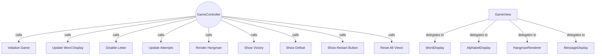

# TESTING CONTEXT

**Project:** The Hangman Game - Web Application

**Component under test:** `GameView` (Class)

**Testing framework:** Jest 29.7.0, ts-jest 29.2.5, jsdom environment

**Target coverage:** 
- Line coverage: ≥80%
- Function coverage: 100% (all public methods)
- Branch coverage: ≥80%

---

# CODE TO TEST

```typescript
/**
 * University of La Laguna
 * School of Engineering and Technology
 * Degree in Computer Engineering
 * Final Degree Project (TFG)
 *
 * @author Fabián González Lence <alu0101549491@ull.edu.es>
 * @since 2025-11-25
 * @file TFG-Fabian-Gonzalez-Lence/projects/1-TheHangmanGame/src/views/game-view.ts
 * @desc Composes view components (word, alphabet, hangman, messages) and provides a unified interface.
 * @see {@link https://github.com/alu0101549491/TFG-Fabian-Gonzalez-Lence/tree/main/projects/1-TheHangmanGame}
 * @see {@link https://typescripttutorial.net}
 */

import {WordDisplay} from './word-display';
import {AlphabetDisplay} from './alphabet-display';
import {HangmanRenderer} from './hangman-renderer';
import {MessageDisplay} from './message-display';

/**
 * Main view coordinator that composes all display components.
 * Implements the Composite Pattern to manage multiple view elements,
 * providing a unified interface to the GameController.
 *
 * @category View
 */
export class GameView {
  /** Word display component */
  private wordDisplay: WordDisplay;

  /** Alphabet display component */
  private alphabetDisplay: AlphabetDisplay;

  /** Hangman renderer component */
  private hangmanRenderer: HangmanRenderer;

  /** Message display component */
  private messageDisplay: MessageDisplay;

  /** Flag to track if the word has been rendered */
  private wordRendered: boolean = false;

  /** Current length of the secret word */
  private currentWordLength: number = 0;

  /**
   * Creates a new GameView instance and initializes all display components.
   */
  constructor() {
    // Initialize all child components
    this.wordDisplay = new WordDisplay('word-container');
    this.alphabetDisplay = new AlphabetDisplay('alphabet-container');
    this.hangmanRenderer = new HangmanRenderer('hangman-canvas');
    this.messageDisplay = new MessageDisplay('message-container');
  }

  /**
   * Initializes all view components.
   */
  public initialize(): void {
    // Render alphabet buttons
    this.alphabetDisplay.render();

    // Show initial hangman state (gallows only)
    this.hangmanRenderer.render(0);

    // Show initial attempt counter
    this.messageDisplay.showAttempts(0, 6);

    // Hide restart button initially
    this.messageDisplay.hideRestartButton();

    // Reset word rendered state
    this.wordRendered = false;
    this.currentWordLength = 0;
  }

  /**
   * Updates the word display with current letter states.
   * @param letters - Array where each element is either the letter (if guessed) or empty string
   */
  public updateWordBoxes(letters: string[]): void {
    // Render word boxes only when needed (first call or when word length changes)
    if (!this.wordRendered || this.currentWordLength !== letters.length) {
      this.wordDisplay.render(letters.length);
      this.wordRendered = true;
      this.currentWordLength = letters.length;
    }

    // Update each box with its letter (if revealed)
    letters.forEach((letter, index) => {
      if (letter) {
        this.wordDisplay.updateBox(index, letter);
      }
    });
  }

  /**
   * Attach alphabet letter click handler via GameView (facade).
   * @param handler - receives clicked letter as uppercase string
   */
  public attachAlphabetClickHandler(handler: (letter: string) => void): void {
    this.alphabetDisplay.attachClickHandler(handler);
  }

  /**
   * Attach restart button handler via GameView (facade).
   * @param handler - function to call when restart clicked
   */
  public attachRestartHandler(handler: () => void): void {
    this.messageDisplay.attachRestartHandler(handler);
  }

  /**
   * Disables a letter button in the alphabet display.
   * @param letter - The letter to disable
   */
  public disableLetter(letter: string): void {
    this.alphabetDisplay.disableLetter(letter);
  }

  /**
   * Updates the attempt counter display.
   * @param current - Current number of failed attempts
   * @param max - Maximum allowed failed attempts
   */
  public updateAttemptCounter(current: number, max: number): void {
    this.messageDisplay.showAttempts(current, max);
  }

  /**
   * Renders the hangman drawing for the given attempt count.
   * @param attempts - Number of failed attempts
   */
  public renderHangman(attempts: number): void {
    this.hangmanRenderer.render(attempts);
  }

  /**
   * Displays a victory message with the secret word.
   * @param word - The word that was guessed
   */
  public showVictoryMessage(word: string): void {
    this.messageDisplay.showVictory(word);
  }

  /**
   * Displays a defeat message with the secret word.
   * @param word - The word that was not guessed
   */
  public showDefeatMessage(word: string): void {
    this.messageDisplay.showDefeat(word);
  }

  /**
   * Shows the restart button.
   */
  public showRestartButton(): void {
    this.messageDisplay.showRestartButton();
  }

  /**
   * Hides the restart button.
   */
  public hideRestartButton(): void {
    this.messageDisplay.hideRestartButton();
  }

  /**
   * Resets all view components to initial state.
   */
  public reset(): void {
    // Reset word display
    this.wordDisplay.reset();
    this.wordRendered = false;
    this.currentWordLength = 0;

    // Enable all alphabet letters
    this.alphabetDisplay.enableAllLetters();

    // Clear and render initial hangman
    this.hangmanRenderer.clear();
    this.hangmanRenderer.render(0);

    // Show initial attempt counter
    this.messageDisplay.showAttempts(0, 6);

    // Hide restart button
    this.messageDisplay.hideRestartButton();
  }
}
```

---

# JEST CONFIGURATION

```javascript
/** @type {import('ts-jest').JestConfigWithTsJest} */
export default {
  preset: 'ts-jest',
  testEnvironment: 'jsdom',
  roots: ['<rootDir>/tests', '<rootDir>/src'],
  testMatch: ['**/__tests__/**/*.ts', '**/?(*.)+(spec|test).ts'],
  transform: {
    '^.+\\.ts$': ['ts-jest', {
      tsconfig: {
        esModuleInterop: true,
        allowSyntheticDefaultImports: true,
      },
    }],
  },
  moduleNameMapper: {
    '^@/(.*)$': '<rootDir>/src/$1',
    '^@models/(.*)$': '<rootDir>/src/models/$1',
    '^@views/(.*)$': '<rootDir>/src/views/$1',
    '^@controllers/(.*)$': '<rootDir>/src/controllers/$1',
    '\\.(css|less|scss|sass)$': '<rootDir>/tests/__mocks__/styleMock.js',
  },
  collectCoverageFrom: [
    'src/**/*.ts',
    '!src/main.ts',
    '!src/**/*.d.ts',
  ],
  coverageThreshold: {
    global: {
      branches: 80,
      functions: 80,
      lines: 80,
      statements: 80,
    },
  },
  coverageDirectory: 'coverage',
  setupFilesAfterEnv: ['<rootDir>/jest.setup.js'],
};
```

---

# JEST SETUP

```javascript
// Setup file for Jest
// Add custom matchers or global test configuration here

// Mock Canvas API for testing
HTMLCanvasElement.prototype.getContext = jest.fn(() => ({
  fillStyle: '',
  strokeStyle: '',
  lineWidth: 1,
  lineCap: 'butt',
  beginPath: jest.fn(),
  moveTo: jest.fn(),
  lineTo: jest.fn(),
  arc: jest.fn(),
  stroke: jest.fn(),
  fill: jest.fn(),
  clearRect: jest.fn(),
  fillRect: jest.fn(),
  strokeRect: jest.fn(),
}));

// Mock localStorage
const localStorageMock = {
  getItem: jest.fn(),
  setItem: jest.fn(),
  removeItem: jest.fn(),
  clear: jest.fn(),
};
global.localStorage = localStorageMock;
```

---

# TYPESCRIPT CONFIGURATION

```json
{
  "compilerOptions": {
    "target": "ES2020",
    "useDefineForClassFields": true,
    "module": "ESNext",
    "lib": ["ES2020", "DOM", "DOM.Iterable"],
    "skipLibCheck": true,

    /* Bundler mode */
    "moduleResolution": "bundler",
    "allowImportingTsExtensions": true,
    "resolveJsonModule": true,
    "isolatedModules": true,
    "noEmit": true,

    /* Linting */
    "strict": true,
    "noUnusedLocals": true,
    "noUnusedParameters": true,
    "noFallthroughCasesInSwitch": true,
    "forceConsistentCasingInFileNames": true,

    /* Path mapping */
    "baseUrl": ".",
    "paths": {
      "@/*": ["src/*"],
      "@models/*": ["src/models/*"],
      "@views/*": ["src/views/*"],
      "@controllers/*": ["src/controllers/*"]
    }
  },
  "include": ["src"],
  "exclude": ["node_modules", "dist", "tests"]
}
```

---

# REQUIREMENTS SPECIFICATION

## Relevant Functional Requirements:

- **FR1:** Initialize the game displaying the word to guess in empty boxes
- **FR2:** Letter selection by the user through click
- **FR3:** Reveal all occurrences of correct letters
- **FR4:** Register failed attempts and increment counter - Visual counter display
- **FR5:** Update graphical representation of the hangman
- **FR6:** Game termination by player victory - Display victory message and enable restart
- **FR7:** Game termination by computer victory - Display defeat message and enable restart
- **FR9:** Game restart - Reset all visual components
- **FR10:** Disable already selected letters - Visual button state

## Relevant Non-Functional Requirements:

- **NFR2:** Modular and object-oriented code following MVC architecture - GameView implements Composite Pattern
- **NFR3:** Implementation of three separate main classes - GameView (user interface)
- **NFR5:** Unit tests with Jest with minimum 80% coverage
- **NFR6:** Complete documentation with JSDoc/TypeDoc
- **NFR7:** Code analysis with ESLint and Google style guide
- **NFR8:** Immediate response time when selecting letters - Interface updates in less than 200ms

## Technical Context:

**GameView as Composite Coordinator:**
- Composes 4 child view components: WordDisplay, AlphabetDisplay, HangmanRenderer, MessageDisplay
- Provides unified interface for GameController
- Delegates all operations to appropriate child components
- Implements Composite Pattern for view composition
- **NO direct DOM manipulation** (only through child components)
- **NO business logic** (only coordination)

**Child Components:**
- **WordDisplay:** Manages letter boxes for word display
- **AlphabetDisplay:** Manages interactive alphabet buttons
- **HangmanRenderer:** Manages canvas drawing
- **MessageDisplay:** Manages messages and restart button

**Container IDs:**
- Word display: `word-container`
- Alphabet: `alphabet-container`
- Hangman canvas: `hangman-canvas`
- Messages: `message-container`

---

# USE CASE DIAGRAM



**Context:** GameView is the main view coordinator implementing Composite Pattern to manage all UI components.

---

# TASK

Generate a complete unit test suite for the `GameView` class that covers:

## 1. NORMAL CASES (Happy Path)

**Constructor Tests:**
- [ ] Verify constructor creates all 4 child components
- [ ] Verify WordDisplay created with 'word-container'
- [ ] Verify AlphabetDisplay created with 'alphabet-container'
- [ ] Verify HangmanRenderer created with 'hangman-canvas'
- [ ] Verify MessageDisplay created with 'message-container'
- [ ] Verify instance is created successfully

**initialize() Tests:**
- [ ] Verify calls alphabetDisplay.render()
- [ ] Verify calls hangmanRenderer.render(0)
- [ ] Verify calls messageDisplay.showAttempts(0, 6)
- [ ] Verify calls messageDisplay.hideRestartButton()
- [ ] Verify all child initializations called in correct order

**updateWordBoxes() Tests:**
- [ ] Verify delegates to wordDisplay
- [ ] Verify handles first render (calls render with array length)
- [ ] Verify updates individual boxes for revealed letters
- [ ] Verify handles empty array
- [ ] Verify handles array with all letters revealed

**disableLetter() Tests:**
- [ ] Verify delegates to alphabetDisplay.disableLetter()
- [ ] Verify passes letter parameter correctly
- [ ] Verify works with uppercase letters
- [ ] Verify works with lowercase letters

**updateAttemptCounter() Tests:**
- [ ] Verify delegates to messageDisplay.showAttempts()
- [ ] Verify passes current and max parameters correctly
- [ ] Verify works with different attempt values (0-6)

**renderHangman() Tests:**
- [ ] Verify delegates to hangmanRenderer.render()
- [ ] Verify passes attempt count correctly
- [ ] Verify works with all attempt values (0-6)

**showVictoryMessage() Tests:**
- [ ] Verify delegates to messageDisplay.showVictory()
- [ ] Verify passes word parameter correctly
- [ ] Verify word case handling

**showDefeatMessage() Tests:**
- [ ] Verify delegates to messageDisplay.showDefeat()
- [ ] Verify passes word parameter correctly
- [ ] Verify word case handling

**showRestartButton() Tests:**
- [ ] Verify delegates to messageDisplay.showRestartButton()
- [ ] Verify method calls child correctly

**hideRestartButton() Tests:**
- [ ] Verify delegates to messageDisplay.hideRestartButton()
- [ ] Verify method calls child correctly

**reset() Tests:**
- [ ] Verify calls wordDisplay.reset()
- [ ] Verify calls alphabetDisplay.enableAllLetters()
- [ ] Verify calls hangmanRenderer.clear()
- [ ] Verify calls hangmanRenderer.render(0)
- [ ] Verify calls messageDisplay.clear()
- [ ] Verify calls messageDisplay.hideRestartButton()
- [ ] Verify all resets called in correct order

**Event Handler Attachment (if public methods exist):**
- [ ] Verify attachLetterClickHandler delegates to alphabetDisplay
- [ ] Verify attachRestartHandler delegates to messageDisplay

## 2. EDGE CASES

**updateWordBoxes() Edge Cases:**
- [ ] Verify first call renders boxes (initialization)
- [ ] Verify subsequent calls only update boxes
- [ ] Verify handles word length change (if game restarts)
- [ ] Verify empty string array handled correctly
- [ ] Verify single letter word
- [ ] Verify long word (15+ letters)

**Delegation Edge Cases:**
- [ ] Verify all methods delegate (no direct DOM manipulation)
- [ ] Verify parameters passed correctly to children
- [ ] Verify method chaining works (multiple operations in sequence)

**Initialize and Reset:**
- [ ] Verify initialize can be called multiple times
- [ ] Verify reset followed by initialize works correctly
- [ ] Verify state after reset matches initial state

## 3. EXCEPTIONAL CASES (Error Handling)

**Constructor Error Cases:**
- [ ] Verify throws error if any child component construction fails
- [ ] Verify error propagates from child components
- [ ] Verify meaningful error messages

**Child Component Failures:**
- [ ] Verify handles child method errors gracefully (if defensive)
- [ ] Verify errors from children propagate correctly

**Validation:**
- [ ] Verify GameView contains no business logic
- [ ] Verify GameView contains no direct DOM manipulation
- [ ] Verify all operations delegate to children

## 4. INTEGRATION CASES

**GameController Integration (Mock):**
- [ ] Verify GameView can be used by mock GameController
- [ ] Verify all methods callable in typical game sequence
- [ ] Verify initialization → game play → end game flow

**Child Component Integration:**
- [ ] Verify all 4 children created and stored
- [ ] Verify children receive correct method calls
- [ ] Verify children work together through GameView coordination

**Complete Game Flow:**
- [ ] Verify initialize → updateWordBoxes → disableLetter → updateAttemptCounter → renderHangman
- [ ] Verify victory flow: showVictoryMessage → showRestartButton
- [ ] Verify defeat flow: showDefeatMessage → showRestartButton
- [ ] Verify restart flow: reset → initialize

**Composite Pattern Verification:**
- [ ] Verify GameView only coordinates (no logic)
- [ ] Verify all rendering delegated to children
- [ ] Verify unified interface provided to controller

---

# STRUCTURE OF EACH TEST

Use the **AAA (Arrange-Act-Assert)** pattern with TypeScript and mocked child components:

```typescript
import {GameView} from '@views/game-view';
import {WordDisplay} from '@views/word-display';
import {AlphabetDisplay} from '@views/alphabet-display';
import {HangmanRenderer} from '@views/hangman-renderer';
import {MessageDisplay} from '@views/message-display';

// Mock all child components
jest.mock('@views/word-display');
jest.mock('@views/alphabet-display');
jest.mock('@views/hangman-renderer');
jest.mock('@views/message-display');

describe('GameView', () => {
  let gameView: GameView;
  let mockWordDisplay: jest.Mocked<WordDisplay>;
  let mockAlphabetDisplay: jest.Mocked<AlphabetDisplay>;
  let mockHangmanRenderer: jest.Mocked<HangmanRenderer>;
  let mockMessageDisplay: jest.Mocked<MessageDisplay>;

  beforeEach(() => {
    // Setup DOM with all required containers
    document.body.innerHTML = `
      <div id="word-container"></div>
      <div id="alphabet-container"></div>
      <canvas id="hangman-canvas" width="400" height="400"></canvas>
      <div id="message-container"></div>
    `;

    // Mock canvas context
    const mockContext = {
      clearRect: jest.fn(),
      beginPath: jest.fn(),
      moveTo: jest.fn(),
      lineTo: jest.fn(),
      arc: jest.fn(),
      stroke: jest.fn(),
    } as any;
    
    const canvas = document.getElementById('hangman-canvas') as HTMLCanvasElement;
    canvas.getContext = jest.fn().mockReturnValue(mockContext);

    // Clear all mocks
    jest.clearAllMocks();

    // Create GameView (will create mocked children)
    gameView = new GameView();

    // Get mocked instances
    mockWordDisplay = (WordDisplay as jest.MockedClass<typeof WordDisplay>).mock.instances[0] as jest.Mocked<WordDisplay>;
    mockAlphabetDisplay = (AlphabetDisplay as jest.MockedClass<typeof AlphabetDisplay>).mock.instances[0] as jest.Mocked<AlphabetDisplay>;
    mockHangmanRenderer = (HangmanRenderer as jest.MockedClass<typeof HangmanRenderer>).mock.instances[0] as jest.Mocked<HangmanRenderer>;
    mockMessageDisplay = (MessageDisplay as jest.MockedClass<typeof MessageDisplay>).mock.instances[0] as jest.Mocked<MessageDisplay>;
  });

  afterEach(() => {
    document.body.innerHTML = '';
    jest.clearAllMocks();
  });

  describe('constructor', () => {
    it('should create WordDisplay with correct container ID', () => {
      // ARRANGE & ACT: gameView already created in beforeEach
      
      // ASSERT
      expect(WordDisplay).toHaveBeenCalledWith('word-container');
      expect(WordDisplay).toHaveBeenCalledTimes(1);
    });

    it('should create AlphabetDisplay with correct container ID', () => {
      // ARRANGE & ACT: gameView already created
      
      // ASSERT
      expect(AlphabetDisplay).toHaveBeenCalledWith('alphabet-container');
      expect(AlphabetDisplay).toHaveBeenCalledTimes(1);
    });

    it('should create HangmanRenderer with correct canvas ID', () => {
      // ARRANGE & ACT: gameView already created
      
      // ASSERT
      expect(HangmanRenderer).toHaveBeenCalledWith('hangman-canvas');
      expect(HangmanRenderer).toHaveBeenCalledTimes(1);
    });

    it('should create MessageDisplay with correct container ID', () => {
      // ARRANGE & ACT: gameView already created
      
      // ASSERT
      expect(MessageDisplay).toHaveBeenCalledWith('message-container');
      expect(MessageDisplay).toHaveBeenCalledTimes(1);
    });

    it('should create instance successfully', () => {
      // ARRANGE & ACT: gameView already created
      
      // ASSERT
      expect(gameView).toBeDefined();
      expect(gameView).toBeInstanceOf(GameView);
    });
  });

  describe('initialize', () => {
    it('should call alphabetDisplay.render()', () => {
      // ARRANGE: gameView created
      
      // ACT
      gameView.initialize();
      
      // ASSERT
      expect(mockAlphabetDisplay.render).toHaveBeenCalledTimes(1);
    });

    it('should call hangmanRenderer.render(0) for initial state', () => {
      // ARRANGE
      
      // ACT
      gameView.initialize();
      
      // ASSERT
      expect(mockHangmanRenderer.render).toHaveBeenCalledWith(0);
      expect(mockHangmanRenderer.render).toHaveBeenCalledTimes(1);
    });

    it('should call messageDisplay.showAttempts(0, 6)', () => {
      // ARRANGE
      
      // ACT
      gameView.initialize();
      
      // ASSERT
      expect(mockMessageDisplay.showAttempts).toHaveBeenCalledWith(0, 6);
    });

    it('should call messageDisplay.hideRestartButton()', () => {
      // ARRANGE
      
      // ACT
      gameView.initialize();
      
      // ASSERT
      expect(mockMessageDisplay.hideRestartButton).toHaveBeenCalledTimes(1);
    });
  });

  describe('updateWordBoxes', () => {
    it('should delegate to wordDisplay for rendering', () => {
      // ARRANGE
      const letters = ['E', '', 'E', '', '', '', '', ''];
      
      // ACT
      gameView.updateWordBoxes(letters);
      
      // ASSERT
      // Should call render on first call, then updateBox for revealed letters
      // Exact implementation depends on GameView logic
      expect(mockWordDisplay.render || mockWordDisplay.updateBox).toHaveBeenCalled();
    });

    it('should handle first render (initialize word boxes)', () => {
      // ARRANGE
      const letters = ['', '', '', '', '', '', '', ''];
      
      // ACT
      gameView.updateWordBoxes(letters);
      
      // ASSERT: Should call render with word length
      expect(mockWordDisplay.render).toHaveBeenCalledWith(8);
    });

    it('should update revealed letters in subsequent calls', () => {
      // ARRANGE: First call to initialize
      gameView.updateWordBoxes(['', '', '', '']);
      jest.clearAllMocks();
      
      // ACT: Second call with revealed letter
      gameView.updateWordBoxes(['E', '', '', '']);
      
      // ASSERT: Should update box at index 0
      expect(mockWordDisplay.updateBox).toHaveBeenCalledWith(0, 'E');
    });
  });

  describe('disableLetter', () => {
    it('should delegate to alphabetDisplay.disableLetter()', () => {
      // ARRANGE & ACT
      gameView.disableLetter('E');
      
      // ASSERT
      expect(mockAlphabetDisplay.disableLetter).toHaveBeenCalledWith('E');
      expect(mockAlphabetDisplay.disableLetter).toHaveBeenCalledTimes(1);
    });

    it('should work with lowercase letters', () => {
      // ARRANGE & ACT
      gameView.disableLetter('e');
      
      // ASSERT
      expect(mockAlphabetDisplay.disableLetter).toHaveBeenCalledWith('e');
    });
  });

  describe('updateAttemptCounter', () => {
    it('should delegate to messageDisplay.showAttempts()', () => {
      // ARRANGE & ACT
      gameView.updateAttemptCounter(3, 6);
      
      // ASSERT
      expect(mockMessageDisplay.showAttempts).toHaveBeenCalledWith(3, 6);
      expect(mockMessageDisplay.showAttempts).toHaveBeenCalledTimes(1);
    });

    it('should work with different attempt values', () => {
      // ARRANGE & ACT: Test multiple values
      gameView.updateAttemptCounter(0, 6);
      gameView.updateAttemptCounter(6, 6);
      
      // ASSERT
      expect(mockMessageDisplay.showAttempts).toHaveBeenCalledWith(0, 6);
      expect(mockMessageDisplay.showAttempts).toHaveBeenCalledWith(6, 6);
    });
  });

  describe('renderHangman', () => {
    it('should delegate to hangmanRenderer.render()', () => {
      // ARRANGE & ACT
      gameView.renderHangman(3);
      
      // ASSERT
      expect(mockHangmanRenderer.render).toHaveBeenCalledWith(3);
      expect(mockHangmanRenderer.render).toHaveBeenCalledTimes(1);
    });

    it('should work with all attempt values 0-6', () => {
      // ARRANGE & ACT: Test all states
      for (let i = 0; i <= 6; i++) {
        gameView.renderHangman(i);
      }
      
      // ASSERT
      expect(mockHangmanRenderer.render).toHaveBeenCalledTimes(7);
    });
  });

  describe('showVictoryMessage', () => {
    it('should delegate to messageDisplay.showVictory()', () => {
      // ARRANGE & ACT
      gameView.showVictoryMessage('ELEPHANT');
      
      // ASSERT
      expect(mockMessageDisplay.showVictory).toHaveBeenCalledWith('ELEPHANT');
      expect(mockMessageDisplay.showVictory).toHaveBeenCalledTimes(1);
    });
  });

  describe('showDefeatMessage', () => {
    it('should delegate to messageDisplay.showDefeat()', () => {
      // ARRANGE & ACT
      gameView.showDefeatMessage('RHINOCEROS');
      
      // ASSERT
      expect(mockMessageDisplay.showDefeat).toHaveBeenCalledWith('RHINOCEROS');
      expect(mockMessageDisplay.showDefeat).toHaveBeenCalledTimes(1);
    });
  });

  describe('showRestartButton', () => {
    it('should delegate to messageDisplay.showRestartButton()', () => {
      // ARRANGE & ACT
      gameView.showRestartButton();
      
      // ASSERT
      expect(mockMessageDisplay.showRestartButton).toHaveBeenCalledTimes(1);
    });
  });

  describe('hideRestartButton', () => {
    it('should delegate to messageDisplay.hideRestartButton()', () => {
      // ARRANGE & ACT
      gameView.hideRestartButton();
      
      // ASSERT
      expect(mockMessageDisplay.hideRestartButton).toHaveBeenCalledTimes(1);
    });
  });

  describe('reset', () => {
    it('should call wordDisplay.reset()', () => {
      // ARRANGE & ACT
      gameView.reset();
      
      // ASSERT
      expect(mockWordDisplay.reset).toHaveBeenCalledTimes(1);
    });

    it('should call alphabetDisplay.enableAllLetters()', () => {
      // ARRANGE & ACT
      gameView.reset();
      
      // ASSERT
      expect(mockAlphabetDisplay.enableAllLetters).toHaveBeenCalledTimes(1);
    });

    it('should call hangmanRenderer.clear()', () => {
      // ARRANGE & ACT
      gameView.reset();
      
      // ASSERT
      expect(mockHangmanRenderer.clear).toHaveBeenCalledTimes(1);
    });

    it('should call hangmanRenderer.render(0) after clearing', () => {
      // ARRANGE & ACT
      gameView.reset();
      
      // ASSERT
      expect(mockHangmanRenderer.render).toHaveBeenCalledWith(0);
    });

    it('should call messageDisplay.clear()', () => {
      // ARRANGE & ACT
      gameView.reset();
      
      // ASSERT
      expect(mockMessageDisplay.clear).toHaveBeenCalledTimes(1);
    });

    it('should call messageDisplay.hideRestartButton()', () => {
      // ARRANGE & ACT
      gameView.reset();
      
      // ASSERT
      expect(mockMessageDisplay.hideRestartButton).toHaveBeenCalledTimes(1);
    });
  });

  describe('Composite Pattern validation', () => {
    it('should only delegate operations to child components', () => {
      // ARRANGE: Track all operations
      
      // ACT: Perform various operations
      gameView.initialize();
      gameView.updateWordBoxes(['E', '', '', '']);
      gameView.disableLetter('E');
      gameView.updateAttemptCounter(1, 6);
      gameView.renderHangman(1);
      
      // ASSERT: All operations should delegate to children
      expect(mockAlphabetDisplay.render).toHaveBeenCalled();
      expect(mockHangmanRenderer.render).toHaveBeenCalled();
      expect(mockMessageDisplay.showAttempts).toHaveBeenCalled();
      expect(mockAlphabetDisplay.disableLetter).toHaveBeenCalled();
      expect(mockWordDisplay.render || mockWordDisplay.updateBox).toHaveBeenCalled();
    });
  });

  describe('Game flow integration', () => {
    it('should handle complete victory flow', () => {
      // ARRANGE & ACT: Simulate victory sequence
      gameView.initialize();
      gameView.updateWordBoxes(['E', 'L', 'E', 'P', 'H', 'A', 'N', 'T']);
      gameView.showVictoryMessage('ELEPHANT');
      gameView.showRestartButton();
      
      // ASSERT: All methods called correctly
      expect(mockMessageDisplay.showVictory).toHaveBeenCalledWith('ELEPHANT');
      expect(mockMessageDisplay.showRestartButton).toHaveBeenCalled();
    });

    it('should handle complete defeat flow', () => {
      // ARRANGE & ACT: Simulate defeat sequence
      gameView.initialize();
      gameView.renderHangman(6);
      gameView.showDefeatMessage('ELEPHANT');
      gameView.showRestartButton();
      
      // ASSERT
      expect(mockHangmanRenderer.render).toHaveBeenCalledWith(6);
      expect(mockMessageDisplay.showDefeat).toHaveBeenCalledWith('ELEPHANT');
      expect(mockMessageDisplay.showRestartButton).toHaveBeenCalled();
    });

    it('should handle restart flow', () => {
      // ARRANGE: Game ended
      gameView.showVictoryMessage('CAT');
      gameView.showRestartButton();
      
      // ACT: Restart
      gameView.reset();
      gameView.initialize();
      
      // ASSERT: All reset methods called
      expect(mockWordDisplay.reset).toHaveBeenCalled();
      expect(mockAlphabetDisplay.enableAllLetters).toHaveBeenCalled();
      expect(mockHangmanRenderer.clear).toHaveBeenCalled();
      expect(mockMessageDisplay.clear).toHaveBeenCalled();
    });
  });
});
```

---

# TEST REQUIREMENTS

## Configuration and types:
- [ ] Import GameView and all child component classes
- [ ] Mock all 4 child components with `jest.mock()`
- [ ] Setup DOM with all 4 required containers
- [ ] Mock canvas context for HangmanRenderer
- [ ] Get mocked instances after GameView construction
- [ ] Clean up mocks in `afterEach()`

## Mocking Strategy:
```typescript
// Mock all child components
jest.mock('@views/word-display');
jest.mock('@views/alphabet-display');
jest.mock('@views/hangman-renderer');
jest.mock('@views/message-display');

// After GameView creation, get mocked instances
const mockWordDisplay = (WordDisplay as jest.MockedClass<typeof WordDisplay>)
  .mock.instances[0] as jest.Mocked<WordDisplay>;

// Verify constructor calls
expect(WordDisplay).toHaveBeenCalledWith('word-container');

// Verify method calls on mocked instances
expect(mockWordDisplay.render).toHaveBeenCalledWith(8);
expect(mockAlphabetDisplay.disableLetter).toHaveBeenCalledWith('E');
```

## Composite Pattern Testing:
```typescript
// Verify GameView only delegates (no direct DOM manipulation)
it('should not perform any direct DOM manipulation', () => {
  // Spy on document methods
  const appendChildSpy = jest.spyOn(document.body, 'appendChild');
  const innerHTMLSpy = jest.spyOn(document.body, 'innerHTML', 'set');
  
  // Perform various GameView operations
  gameView.initialize();
  gameView.updateWordBoxes(['E', '', '']);
  gameView.disableLetter('E');
  
  // Should not have called any DOM methods directly
  expect(appendChildSpy).not.toHaveBeenCalled();
  expect(innerHTMLSpy).not.toHaveBeenCalled();
  
  appendChildSpy.mockRestore();
  innerHTMLSpy.mockRestore();
});
```

## Jest-specific assertions:
```typescript
// Constructor calls
expect(WordDisplay).toHaveBeenCalledWith('word-container');
expect(WordDisplay).toHaveBeenCalledTimes(1);

// Method delegation
expect(mockWordDisplay.render).toHaveBeenCalledWith(8);
expect(mockAlphabetDisplay.disableLetter).toHaveBeenCalledWith('E');
expect(mockHangmanRenderer.render).toHaveBeenCalledWith(3);
expect(mockMessageDisplay.showAttempts).toHaveBeenCalledWith(3, 6);

// Call counts
expect(mockWordDisplay.reset).toHaveBeenCalledTimes(1);
expect(mockAlphabetDisplay.render).toHaveBeenCalled();

// Multiple calls with different parameters
expect(mockHangmanRenderer.render).toHaveBeenCalledWith(0);
expect(mockHangmanRenderer.render).toHaveBeenCalledWith(3);
expect(mockHangmanRenderer.render).toHaveBeenCalledWith(6);

// Call order verification (if needed)
expect(mockMessageDisplay.clear).toHaveBeenCalledBefore(mockMessageDisplay.hideRestartButton);
```

## Naming conventions:
- File: `game-view.test.ts` in `tests/views/` directory
- Describe blocks: 'GameView' (class name)
- Nested describe: Method names, 'Composite Pattern validation', 'Game flow integration'
- It blocks: `should [expected behavior] when [condition]`

---

# DELIVERABLES

## 1. Complete Test File

Create file: `tests/views/game-view.test.ts`

```typescript
[Complete test implementation with all test cases]
```

## 2. Coverage Matrix

| Method/Area | Normal Cases | Edge Cases | Exceptions | Integration | Total Tests |
|-------------|--------------|------------|------------|-------------|-------------|
| constructor() | 5 | 0 | 1 | 0 | 6 |
| initialize() | 4 | 2 | 0 | 1 | 7 |
| updateWordBoxes() | 3 | 6 | 0 | 1 | 10 |
| disableLetter() | 2 | 0 | 0 | 0 | 2 |
| updateAttemptCounter() | 2 | 0 | 0 | 0 | 2 |
| renderHangman() | 2 | 0 | 0 | 0 | 2 |
| showVictoryMessage() | 1 | 0 | 0 | 0 | 1 |
| showDefeatMessage() | 1 | 0 | 0 | 0 | 1 |
| showRestartButton() | 1 | 0 | 0 | 0 | 1 |
| hideRestartButton() | 1 | 0 | 0 | 0 | 1 |
| reset() | 6 | 2 | 0 | 1 | 9 |
| Event Handlers* | 2 | 0 | 0 | 1 | 3 |
| Composite Pattern | 0 | 0 | 2 | 2 | 4 |
| Game Flow | 0 | 0 | 0 | 3 | 3 |
| **TOTAL** | **30** | **10** | **3** | **9** | **52** |

*If attachLetterClickHandler and attachRestartHandler exist as public methods

## 3. Test Data

```typescript
// Test word states for updateWordBoxes
const WORD_STATES = {
  empty: ['', '', '', '', '', '', '', ''],
  partial: ['E', '', 'E', '', '', '', '', ''],
  complete: ['E', 'L', 'E', 'P', 'H', 'A', 'N', 'T'],
  single: ['C'],
  short: ['C', 'A', 'T'],
};

// Test attempt values
const ATTEMPT_VALUES = {
  initial: 0,
  midGame: 3,
  nearDefeat: 5,
  defeat: 6,
};

// Test words
const TEST_WORDS = {
  short: 'CAT',
  medium: 'ELEPHANT',
  long: 'RHINOCEROS',
};

// Helper to verify all children created
function verifyAllChildrenCreated(): void {
  expect(WordDisplay).toHaveBeenCalledWith('word-container');
  expect(AlphabetDisplay).toHaveBeenCalledWith('alphabet-container');
  expect(HangmanRenderer).toHaveBeenCalledWith('hangman-canvas');
  expect(MessageDisplay).toHaveBeenCalledWith('message-container');
}

// Helper to verify initialization sequence
function verifyInitializationSequence(
  mockAlphabet: jest.Mocked<AlphabetDisplay>,
  mockHangman: jest.Mocked<HangmanRenderer>,
  mockMessage: jest.Mocked<MessageDisplay>
): void {
  expect(mockAlphabet.render).toHaveBeenCalled();
  expect(mockHangman.render).toHaveBeenCalledWith(0);
  expect(mockMessage.showAttempts).toHaveBeenCalledWith(0, 6);
  expect(mockMessage.hideRestartButton).toHaveBeenCalled();
}

// Helper to verify reset sequence
function verifyResetSequence(
  mockWord: jest.Mocked<WordDisplay>,
  mockAlphabet: jest.Mocked<AlphabetDisplay>,
  mockHangman: jest.Mocked<HangmanRenderer>,
  mockMessage: jest.Mocked<MessageDisplay>
): void {
  expect(mockWord.reset).toHaveBeenCalled();
  expect(mockAlphabet.enableAllLetters).toHaveBeenCalled();
  expect(mockHangman.clear).toHaveBeenCalled();
  expect(mockHangman.render).toHaveBeenCalledWith(0);
  expect(mockMessage.clear).toHaveBeenCalled();
  expect(mockMessage.hideRestartButton).toHaveBeenCalled();
}
```

## 4. Expected Coverage Analysis

- **Estimated line coverage:** 95-100% (all coordination logic is testable)
- **Estimated branch coverage:** 90-95% (updateWordBoxes has first-render logic)
- **Methods covered:** 11/11 public methods (or 13/13 if event handler methods exist)
- **Private method coverage:** N/A (no complex private methods)
- **Uncovered scenarios:** 
  - Optional: Error handling if child component fails
  - Optional: Advanced state management edge cases

## 5. Execution Instructions

```bash
# Run tests for GameView only
npm test -- game-view.test.ts

# Run tests with coverage
npm run test:coverage -- game-view.test.ts

# Run tests in watch mode
npm run test:watch -- game-view.test.ts

# Run with verbose output
npm test -- game-view.test.ts --verbose

# Run specific test suite
npm test -- game-view.test.ts -t "initialize"
```

---

# SPECIAL CASES TO CONSIDER

## Mocking All Child Components:

**Complete mocking setup:**
```typescript
// At top of test file
jest.mock('@views/word-display');
jest.mock('@views/alphabet-display');
jest.mock('@views/hangman-renderer');
jest.mock('@views/message-display');

// In beforeEach
const gameView = new GameView();

// Get mocked instances
const mockWordDisplay = (WordDisplay as jest.MockedClass<typeof WordDisplay>)
  .mock.instances[0] as jest.Mocked<WordDisplay>;
// ... repeat for all children

// Now can verify calls on mockWordDisplay, etc.
```

## updateWordBoxes First Render Logic:

**Critical Test Case:**
```typescript
it('should handle first render vs subsequent updates correctly', () => {
  // First call: should render boxes
  const firstCall = ['', '', '', ''];
  gameView.updateWordBoxes(firstCall);
  
  expect(mockWordDisplay.render).toHaveBeenCalledWith(4);
  expect(mockWordDisplay.render).toHaveBeenCalledTimes(1);
  
  jest.clearAllMocks();
  
  // Second call: should update boxes, not render
  const secondCall = ['C', '', '', ''];
  gameView.updateWordBoxes(secondCall);
  
  expect(mockWordDisplay.render).not.toHaveBeenCalled();
  expect(mockWordDisplay.updateBox).toHaveBeenCalledWith(0, 'C');
});
```

## Composite Pattern Verification:

**Test delegation only:**
```typescript
it('should implement Composite Pattern (only coordinate, no logic)', () => {
  // GameView should:
  // 1. Delegate all operations to children
  // 2. Not perform DOM manipulation
  // 3. Not contain business logic
  
  // Test by verifying all operations delegate
  gameView.initialize();
  gameView.updateWordBoxes(['E', '', '']);
  gameView.disableLetter('E');
  gameView.renderHangman(1);
  
  // All should delegate to children
  expect(mockAlphabetDisplay.render).toHaveBeenCalled();
  expect(mockWordDisplay.render).toHaveBeenCalled();
  expect(mockAlphabetDisplay.disableLetter).toHaveBeenCalled();
  expect(mockHangmanRenderer.render).toHaveBeenCalled();
});
```

## Reset All Components:

**Test complete reset:**
```typescript
it('should reset all child components to initial state', () => {
  // ARRANGE: Perform some operations
  gameView.initialize();
  gameView.updateWordBoxes(['E', '', '', '']);
  gameView.disableLetter('E');
  gameView.renderHangman(3);
  gameView.showVictoryMessage('CAT');
  
  jest.clearAllMocks();
  
  // ACT: Reset
  gameView.reset();
  
  // ASSERT: All children reset
  verifyResetSequence(
    mockWordDisplay,
    mockAlphabetDisplay,
    mockHangmanRenderer,
    mockMessageDisplay
  );
});
```

## Event Handler Methods (if exist):

**Test event handler delegation:**
```typescript
describe('attachLetterClickHandler', () => {
  it('should delegate to alphabetDisplay.attachClickHandler()', () => {
    // ARRANGE
    const mockHandler = jest.fn();
    
    // ACT
    gameView.attachLetterClickHandler(mockHandler);
    
    // ASSERT
    expect(mockAlphabetDisplay.attachClickHandler).toHaveBeenCalledWith(mockHandler);
  });
});

describe('attachRestartHandler', () => {
  it('should delegate to messageDisplay.attachRestartHandler()', () => {
    // ARRANGE
    const mockHandler = jest.fn();
    
    // ACT
    gameView.attachRestartHandler(mockHandler);
    
    // ASSERT
    expect(mockMessageDisplay.attachRestartHandler).toHaveBeenCalledWith(mockHandler);
  });
});
```

## Complete Game Flows:

**Test typical game sequences:**
```typescript
it('should handle typical game progression correctly', () => {
  // Initialize
  gameView.initialize();
  expect(mockAlphabetDisplay.render).toHaveBeenCalled();
  
  // Player guesses
  gameView.updateWordBoxes(['E', '', 'E', '', '', '', '', '']);
  gameView.disableLetter('E');
  gameView.updateAttemptCounter(0, 6);
  
  // More guesses with failures
  gameView.disableLetter('Z');
  gameView.updateAttemptCounter(1, 6);
  gameView.renderHangman(1);
  
  // Continue until victory
  gameView.updateWordBoxes(['E', 'L', 'E', 'P', 'H', 'A', 'N', 'T']);
  gameView.showVictoryMessage('ELEPHANT');
  gameView.showRestartButton();
  
  // Verify all delegations occurred
  expect(mockWordDisplay.updateBox).toHaveBeenCalled();
  expect(mockAlphabetDisplay.disableLetter).toHaveBeenCalled();
  expect(mockHangmanRenderer.render).toHaveBeenCalled();
  expect(mockMessageDisplay.showVictory).toHaveBeenCalled();
});
```

---

# ADDITIONAL NOTES

## Testing Philosophy for Composite Pattern:

- **Focus on delegation:** Verify all operations delegate to children
- **No direct testing of children:** Child components have their own tests
- **Verify coordination:** Ensure correct child methods called with correct parameters
- **Test unified interface:** GameView provides clean API to GameController
- **No business logic:** GameView should only coordinate, not decide

## Common Pitfalls to Avoid:

1. **Don't test child component logic:** That's the child's responsibility
2. **Mock all children completely:** Use jest.mock() for clean mocking
3. **Verify parameters passed:** Ensure children receive correct data
4. **Test delegation, not implementation:** Focus on what's called, not how

## Best Practices:

- Mock all 4 child components with jest.mock()
- Setup complete DOM with all containers
- Get mocked instances after GameView construction
- Verify constructor calls with correct container IDs
- Test all delegation methods individually
- Test complete game flows for integration
- Verify Composite Pattern implementation (only coordination)
- Clear mocks between tests for clean state

## Integration with GameController:

```typescript
// GameController will use GameView like this:
const gameView = new GameView();

// Initialize
gameView.initialize();

// Attach event handlers
gameView.attachLetterClickHandler((letter) => controller.handleLetterClick(letter));
gameView.attachRestartHandler(() => controller.handleRestartClick());

// Update during game
gameView.updateWordBoxes(model.getRevealedWord());
gameView.disableLetter('E');
gameView.updateAttemptCounter(model.getFailedAttempts(), model.getMaxAttempts());
gameView.renderHangman(model.getFailedAttempts());

// End game
gameView.showVictoryMessage(model.getSecretWord());
gameView.showRestartButton();

// Restart
gameView.reset();
```

---

**Note to Tester AI:** GameView is a Composite Pattern coordinator for all View components. Focus on:

1. **Constructor:** Verify all 4 children created with correct container IDs
2. **Delegation:** Verify every method delegates to appropriate child
3. **Initialization:** Verify initialize() calls all child initializations
4. **Reset:** Verify reset() resets all children
5. **Composite Pattern:** Verify NO direct DOM manipulation, NO business logic
6. **Integration:** Test complete game flows (init → play → end → restart)
7. **Event Handlers:** Test delegation of event handler attachment (if exists)

Create comprehensive tests using mocked child components to verify GameView only coordinates.
