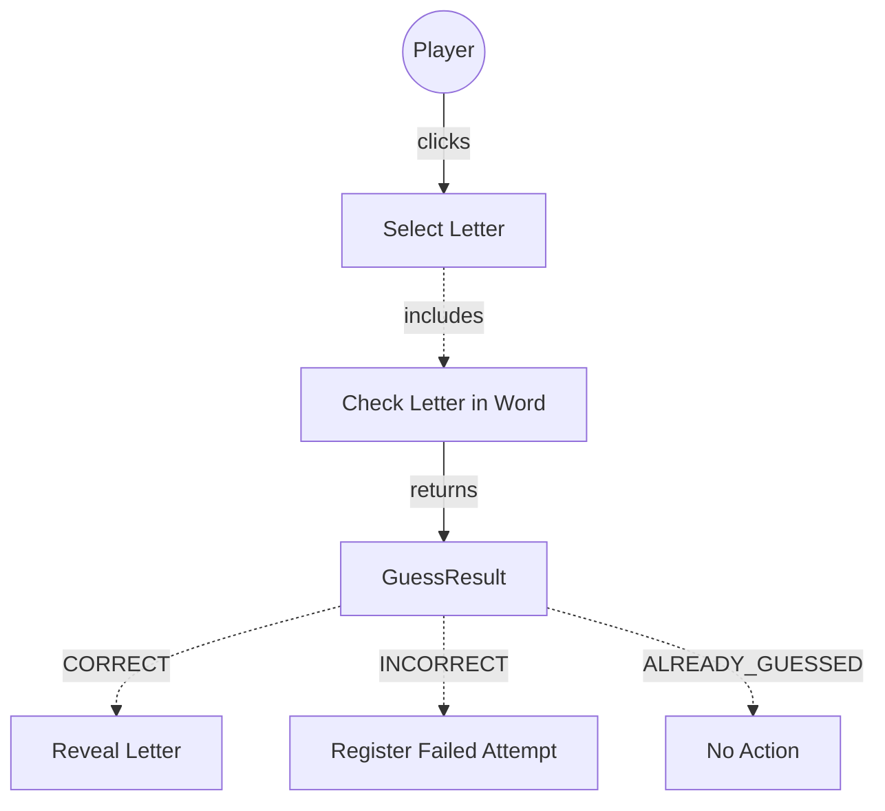

# TESTING CONTEXT

**Project:** The Hangman Game - Web Application

**Component under test:** `GuessResult` (Enumeration)

**Testing framework:** Jest 29.7.0, ts-jest 29.2.5

**Target coverage:** 100% (enum coverage - all values exported and usable)

---

# CODE TO TEST

```typescript
/**
 * University of La Laguna
 * School of Engineering and Technology
 * Degree in Computer Engineering
 * Final Degree Project (TFG)
 *
 * @author Fabián González Lence <alu0101549491@ull.edu.es>
 * @since 2025-11-25
 * @file TFG-Fabian-Gonzalez-Lence/projects/1-TheHangmanGame/src/models/guess-result.ts
 * @desc Enumeration representing the result of a letter guess attempt in the Hangman game.
 * @see {@link https://github.com/alu0101549491/TFG-Fabian-Gonzalez-Lence/tree/main/projects/1-TheHangmanGame}
 * @see {@link https://typescripttutorial.net}
 */

/**
 * Enumeration representing the result of a letter guess attempt in the Hangman game.
 * This enum is used to communicate the outcome of a player's letter guess between the Model and Controller layers.
 *
 * @category Model
 * @example
 * // Usage in GameModel:
 * const result = gameModel.guessLetter('A');
 * // result can be GuessResult.CORRECT, GuessResult.INCORRECT, or GuessResult.ALREADY_GUESSED
 */
export enum GuessResult {
  /**
   * The guessed letter is correct and present in the secret word.
   * All occurrences of this letter will be revealed in the word display.
   *
   * @example
   * // If the word is "ELEPHANT" and the player guesses "E"
   * return GuessResult.CORRECT;
   */
  CORRECT = 'CORRECT',

  /**
   * The guessed letter is incorrect and not present in the secret word.
   * This will increment the failed attempts counter and progress the hangman drawing.
   *
   * @example
   * // If the word is "ELEPHANT" and the player guesses "Z"
   * return GuessResult.INCORRECT;
   */
  INCORRECT = 'INCORRECT',

  /**
   * The letter has already been guessed previously (whether correct or incorrect).
   * No state change occurs, but feedback is provided to the user.
   *
   * @example
   * // If "E" was already guessed and the player clicks "E" again
   * return GuessResult.ALREADY_GUESSED;
   */
  ALREADY_GUESSED = 'ALREADY_GUESSED',
}
```

---

# JEST CONFIGURATION

```javascript
/** @type {import('ts-jest').JestConfigWithTsJest} */
export default {
  preset: 'ts-jest',
  testEnvironment: 'jsdom',
  roots: ['<rootDir>/tests', '<rootDir>/src'],
  testMatch: ['**/__tests__/**/*.ts', '**/?(*.)+(spec|test).ts'],
  transform: {
    '^.+\\.ts$': ['ts-jest', {
      tsconfig: {
        esModuleInterop: true,
        allowSyntheticDefaultImports: true,
      },
    }],
  },
  moduleNameMapper: {
    '^@/(.*)$': '<rootDir>/src/$1',
    '^@models/(.*)$': '<rootDir>/src/models/$1',
    '^@views/(.*)$': '<rootDir>/src/views/$1',
    '^@controllers/(.*)$': '<rootDir>/src/controllers/$1',
    '\\.(css|less|scss|sass)$': '<rootDir>/tests/__mocks__/styleMock.js',
  },
  collectCoverageFrom: [
    'src/**/*.ts',
    '!src/main.ts',
    '!src/**/*.d.ts',
  ],
  coverageThreshold: {
    global: {
      branches: 80,
      functions: 80,
      lines: 80,
      statements: 80,
    },
  },
  coverageDirectory: 'coverage',
  setupFilesAfterEnv: ['<rootDir>/jest.setup.js'],
};
```

---

# JEST SETUP

```javascript
// Setup file for Jest
// Add custom matchers or global test configuration here

// Mock Canvas API for testing
HTMLCanvasElement.prototype.getContext = jest.fn(() => ({
  fillStyle: '',
  strokeStyle: '',
  lineWidth: 1,
  lineCap: 'butt',
  beginPath: jest.fn(),
  moveTo: jest.fn(),
  lineTo: jest.fn(),
  arc: jest.fn(),
  stroke: jest.fn(),
  fill: jest.fn(),
  clearRect: jest.fn(),
  fillRect: jest.fn(),
  strokeRect: jest.fn(),
}));

// Mock localStorage
const localStorageMock = {
  getItem: jest.fn(),
  setItem: jest.fn(),
  removeItem: jest.fn(),
  clear: jest.fn(),
};
global.localStorage = localStorageMock;
```

---

# TYPESCRIPT CONFIGURATION

```json
{
  "compilerOptions": {
    "target": "ES2020",
    "useDefineForClassFields": true,
    "module": "ESNext",
    "lib": ["ES2020", "DOM", "DOM.Iterable"],
    "skipLibCheck": true,

    /* Bundler mode */
    "moduleResolution": "bundler",
    "allowImportingTsExtensions": true,
    "resolveJsonModule": true,
    "isolatedModules": true,
    "noEmit": true,

    /* Linting */
    "strict": true,
    "noUnusedLocals": true,
    "noUnusedParameters": true,
    "noFallthroughCasesInSwitch": true,
    "forceConsistentCasingInFileNames": true,

    /* Path mapping */
    "baseUrl": ".",
    "paths": {
      "@/*": ["src/*"],
      "@models/*": ["src/models/*"],
      "@views/*": ["src/views/*"],
      "@controllers/*": ["src/controllers/*"]
    }
  },
  "include": ["src"],
  "exclude": ["node_modules", "dist", "tests"]
}
```

---

# REQUIREMENTS SPECIFICATION

## Relevant Functional Requirements:

- **FR2:** Letter selection by the user through click - system processes whether it is correct or incorrect
- **FR3:** Reveal all occurrences of correct letters - requires distinguishing correct guesses
- **FR4:** Register failed attempts and increment counter - requires distinguishing incorrect guesses
- **FR10:** Disable already selected letters - requires detecting duplicate guesses

## Technical Context:

This enumeration is a foundational type used throughout the application to communicate guess outcomes between the Model layer and Controller layer.

**Purpose:** Provide clear, type-safe communication about guess outcomes

**Expected Values:**
1. **CORRECT:** The guessed letter exists in the secret word
2. **INCORRECT:** The guessed letter does not exist in the secret word
3. **ALREADY_GUESSED:** The letter has been guessed before (whether correct or incorrect)

**Integration Points:**
- **Returned by:** `GameModel.guessLetter(letter: string): GuessResult`
- **Used by:** `GameController.handleLetterClick()` to determine how to update the view

---

# USE CASE DIAGRAM



**Context:** GuessResult is the return type that communicates the outcome of checking a letter guess.

---

# TASK

Generate a complete unit test suite for the `GuessResult` enumeration that covers:

## 1. NORMAL CASES (Happy Path)

**Enum Structure Tests:**
- [ ] Verify enum exports correctly
- [ ] Verify all three values exist: CORRECT, INCORRECT, ALREADY_GUESSED
- [ ] Verify enum values are strings (not numeric)
- [ ] Verify enum can be imported using path alias `@models/guess-result`

**Enum Value Tests:**
- [ ] Verify CORRECT value is exactly 'CORRECT'
- [ ] Verify INCORRECT value is exactly 'INCORRECT'
- [ ] Verify ALREADY_GUESSED value is exactly 'ALREADY_GUESSED'

**Type Safety Tests:**
- [ ] Verify TypeScript accepts GuessResult type annotations
- [ ] Verify enum values can be used in switch statements
- [ ] Verify enum values can be used in if-else comparisons
- [ ] Verify enum values can be used as function return types

## 2. EDGE CASES

**Enum Comparison Tests:**
- [ ] Verify strict equality (===) works correctly between enum values
- [ ] Verify enum values are not equal to their string representations (unless string enum)
- [ ] Verify enum values can be compared using === operator
- [ ] Verify Object.keys() returns all enum keys
- [ ] Verify Object.values() returns all enum values

**Serialization Tests:**
- [ ] Verify enum values can be serialized to JSON
- [ ] Verify enum values can be deserialized from JSON
- [ ] Verify enum values maintain type after JSON round-trip (if string enum)

## 3. EXCEPTIONAL CASES (Error Handling)

**Invalid Value Tests:**
- [ ] Verify TypeScript catches invalid enum assignments at compile time
- [ ] Verify runtime behavior with invalid string values
- [ ] Verify behavior when casting strings to enum type

**Type Guard Tests:**
- [ ] Verify type guard functions work correctly with enum
- [ ] Verify checking if a value is a valid GuessResult

## 4. INTEGRATION CASES

**Usage in Switch Statements:**
- [ ] Verify all enum values can be used in switch cases
- [ ] Verify exhaustive switch statement compilation
- [ ] Verify default case handling

**Usage with GameModel (Mock Integration):**
- [ ] Verify enum can be returned from mock GameModel.guessLetter()
- [ ] Verify enum can be processed by mock GameController

**Usage with GameController (Mock Integration):**
- [ ] Verify enum values trigger correct controller behavior in mock scenarios

---

# STRUCTURE OF EACH TEST

Use the **AAA (Arrange-Act-Assert)** pattern with TypeScript:

```typescript
import {GuessResult} from '@models/guess-result';

describe('GuessResult', () => {
  describe('Enum Structure', () => {
    it('should export all three enum values', () => {
      // ARRANGE: Enum is already imported
      
      // ACT: Access enum values
      const correct = GuessResult.CORRECT;
      const incorrect = GuessResult.INCORRECT;
      const alreadyGuessed = GuessResult.ALREADY_GUESSED;
      
      // ASSERT: All values are defined
      expect(correct).toBeDefined();
      expect(incorrect).toBeDefined();
      expect(alreadyGuessed).toBeDefined();
    });
  });

  describe('Enum Values', () => {
    it('should have CORRECT value equal to "CORRECT"', () => {
      // ARRANGE & ACT
      const value = GuessResult.CORRECT;
      
      // ASSERT
      expect(value).toBe('CORRECT');
    });
  });

  describe('Type Safety', () => {
    it('should work in switch statements', () => {
      // ARRANGE
      const result: GuessResult = GuessResult.CORRECT;
      let message = '';
      
      // ACT
      switch (result) {
        case GuessResult.CORRECT:
          message = 'Letter is correct';
          break;
        case GuessResult.INCORRECT:
          message = 'Letter is incorrect';
          break;
        case GuessResult.ALREADY_GUESSED:
          message = 'Already guessed';
          break;
      }
      
      // ASSERT
      expect(message).toBe('Letter is correct');
    });
  });
});
```

---

# TEST REQUIREMENTS

## Configuration and types:
- [ ] Import enum using path alias: `import {GuessResult} from '@models/guess-result';`
- [ ] Use strict TypeScript typing in all test data
- [ ] Verify enum is exported as named export (not default)

## Enum-specific tests:
- [ ] Test that enum has exactly 3 values (no more, no less)
- [ ] Test that enum values are distinct (no duplicates)
- [ ] Test that enum can be used as type annotation
- [ ] Test that enum values are immutable

## Jest-specific assertions:
```typescript
// Existence checks
expect(GuessResult.CORRECT).toBeDefined();
expect(GuessResult.CORRECT).not.toBeNull();
expect(GuessResult.CORRECT).not.toBeUndefined();

// Value equality
expect(GuessResult.CORRECT).toBe('CORRECT');
expect(GuessResult.INCORRECT).toBe('INCORRECT');

// Type checks
expect(typeof GuessResult.CORRECT).toBe('string');

// Object methods
expect(Object.keys(GuessResult)).toHaveLength(3);
expect(Object.values(GuessResult)).toContain('CORRECT');
```

## Naming conventions:
- File: `guess-result.test.ts` in `tests/models/` directory
- Describe blocks: 'GuessResult' (enum name)
- Nested describe: 'Enum Structure', 'Enum Values', 'Type Safety', 'Integration'
- It blocks: `should [verify property] when [condition]`

---

# DELIVERABLES

## 1. Complete Test File

Create file: `tests/models/guess-result.test.ts`

```typescript
[Complete test implementation with all test cases]
```

## 2. Coverage Matrix

| Test Category | Test Cases | Description |
|---------------|------------|-------------|
| Enum Structure | 4 | Verify enum exports, has all values, importable |
| Enum Values | 3 | Verify CORRECT, INCORRECT, ALREADY_GUESSED values |
| Type Safety | 3 | Verify switch statements, comparisons, type annotations |
| Serialization | 2 | Verify JSON serialization/deserialization |
| Integration | 3 | Verify usage in switch, mock Model, mock Controller |
| **TOTAL** | **15** | **Complete enum coverage** |

## 3. Expected Coverage Analysis

- **Estimated line coverage:** 100% (enum declarations only)
- **Estimated branch coverage:** N/A (no branching in enum)
- **Enum values covered:** 3/3 (CORRECT, INCORRECT, ALREADY_GUESSED)
- **Uncovered scenarios:** None (enum is fully testable)

## 4. Execution Instructions

```bash
# Run tests for GuessResult only
npm test -- guess-result.test.ts

# Run tests with coverage
npm run test:coverage -- guess-result.test.ts

# Run tests in watch mode
npm run test:watch -- guess-result.test.ts
```

---

# SPECIAL CASES TO CONSIDER

## Enum-Specific Considerations:

1. **String Enum vs Numeric Enum:**
   - Verify enum is string-based (as per requirements)
   - String enums have better debugging output
   - String enums are more serialization-friendly

2. **Exhaustiveness Checking:**
   - TypeScript compiler should warn if switch statement is not exhaustive
   - Test helper function that ensures all cases are handled

3. **Immutability:**
   - Enum values should be immutable (TypeScript enforces this at compile time)
   - Verify that enum cannot be reassigned at runtime

4. **Usage Patterns:**
   - Common pattern: `if (result === GuessResult.CORRECT) { ... }`
   - Common pattern: `switch (result) { case GuessResult.CORRECT: ... }`
   - Avoid: String comparisons like `if (result === 'CORRECT')`

5. **Type Guards:**
   - Consider testing custom type guard: `function isGuessResult(value: any): value is GuessResult`
   - Useful for validating external input

---

# ADDITIONAL NOTES

## Testing Philosophy for Enums:

- Enums are simple data structures, so tests focus on **existence and correctness of values**
- Tests verify **integration with TypeScript type system**
- Tests ensure **enum can be used correctly in application code**
- Tests validate **serialization behavior** for potential future needs (e.g., state persistence)

## Best Practices:

- Keep enum tests simple and focused
- Verify enum values don't change accidentally (regression prevention)
- Test common usage patterns (switch, if-else)
- Document expected enum behavior clearly

---

**Note to Tester AI:** This is a simple enumeration with no complex logic. Focus on verifying that:
1. All three values exist and are correct
2. Enum can be imported and used correctly
3. TypeScript type system integration works
4. Common usage patterns (switch, comparisons) function properly

The test suite should be straightforward but comprehensive, ensuring the enum serves its purpose as a type-safe communication mechanism between Model and Controller.
