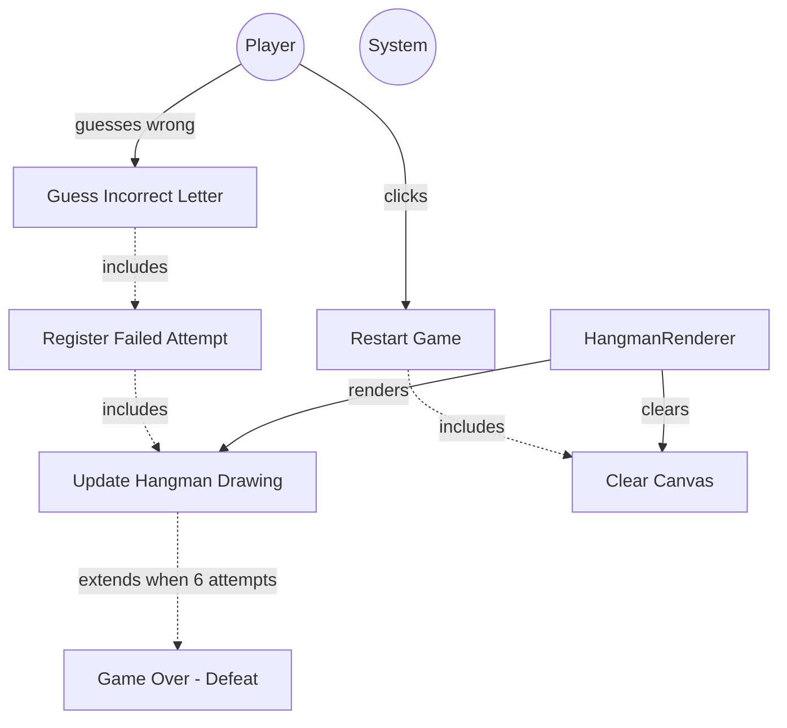

# TESTING CONTEXT

**Project:** The Hangman Game - Web Application

**Component under test:** `HangmanRenderer` (Class)

**Testing framework:** Jest 29.7.0, ts-jest 29.2.5, jsdom environment

**Target coverage:** 
- Line coverage: ≥80%
- Function coverage: 100% (all public methods)
- Branch coverage: ≥80%

---

# CODE TO TEST

```typescript
/**
 * University of La Laguna
 * School of Engineering and Technology
 * Degree in Computer Engineering
 * Final Degree Project (TFG)
 *
 * @author Fabián González Lence <alu0101549491@ull.edu.es>
 * @since 2025-11-25
 * @file TFG-Fabian-Gonzalez-Lence/projects/1-TheHangmanGame/src/views/hangman-renderer.ts
 * @desc Renders the hangman drawing on a canvas element based on failed attempts.
 * @see {@link https://github.com/alu0101549491/TFG-Fabian-Gonzalez-Lence/tree/main/projects/1-TheHangmanGame}
 * @see {@link https://typescripttutorial.net}
 */

/**
 * Renders the hangman drawing on a canvas element.
 * Progressively draws body parts based on failed attempt count.
 *
 * @category View
 */
export class HangmanRenderer {
  /** Canvas element for drawing */
  private canvas: HTMLCanvasElement;

  /** 2D rendering context */
  private context: CanvasRenderingContext2D;

  /**
   * Creates a new HangmanRenderer instance.
   * @param canvasId - The ID of the canvas HTML element
   * @throws {Error} If the canvas element is not found or context cannot be obtained
   */
  constructor(canvasId: string) {
    const element = document.getElementById(canvasId);
    if (!element || !(element instanceof HTMLCanvasElement)) {
      throw new Error(`Canvas element with id "${canvasId}" not found`);
    }
    this.canvas = element;
    const ctx = this.canvas.getContext('2d');
    if (!ctx) {
      throw new Error('Failed to get 2D context from canvas');
    }
    this.context = ctx;
  }

  /**
   * Renders the hangman drawing based on number of failed attempts.
   * @param attempts - Number of failed attempts (0-6)
   */
  public render(attempts: number): void {
    // Clamp attempts to valid range
    const clampedAttempts = Math.min(Math.max(attempts, 0), 6);

    // Clear canvas and draw gallows
    this.clear();
    this.drawGallows();

    // Draw body parts based on attempts
    if (clampedAttempts >= 1) this.drawHead();
    if (clampedAttempts >= 2) this.drawBody();
    if (clampedAttempts >= 3) this.drawLeftArm();
    if (clampedAttempts >= 4) this.drawRightArm();
    if (clampedAttempts >= 5) this.drawLeftLeg();
    if (clampedAttempts >= 6) this.drawRightLeg();
  }

  /**
   * Clears the entire canvas.
   */
  public clear(): void {
    this.context.clearRect(0, 0, this.canvas.width, this.canvas.height);
  }

  /**
   * Draws the gallows structure (base, post, beam, rope).
   * @private
   */
  private drawGallows(): void {
    // Set line style
    this.context.strokeStyle = '#363636';
    this.context.lineWidth = 4;
    this.context.lineCap = 'round';

    // Draw base (horizontal line at bottom)
    this.context.beginPath();
    this.context.moveTo(50, 350);
    this.context.lineTo(200, 350);
    this.context.stroke();

    // Draw post (vertical line from base)
    this.context.beginPath();
    this.context.moveTo(125, 350);
    this.context.lineTo(125, 50);
    this.context.stroke();

    // Draw beam (horizontal line from top of post)
    this.context.beginPath();
    this.context.moveTo(125, 50);
    this.context.lineTo(250, 50);
    this.context.stroke();

    // Draw rope (vertical line from beam)
    this.context.beginPath();
    this.context.moveTo(250, 50);
    this.context.lineTo(250, 100);
    this.context.stroke();
  }

  /**
   * Draws the head (1st failed attempt).
   * @private
   */
  private drawHead(): void {
    this.context.strokeStyle = '#363636';
    this.context.lineWidth = 4;

    // Draw circle for head
    this.context.beginPath();
    this.context.arc(250, 130, 30, 0, 2 * Math.PI);
    this.context.stroke();
  }

  /**
   * Draws the body (2nd failed attempt).
   * @private
   */
  private drawBody(): void {
    this.context.strokeStyle = '#363636';
    this.context.lineWidth = 4;

    // Draw vertical line for body
    this.context.beginPath();
    this.context.moveTo(250, 160);
    this.context.lineTo(250, 250);
    this.context.stroke();
  }

  /**
   * Draws the left arm (3rd failed attempt).
   * @private
   */
  private drawLeftArm(): void {
    this.context.strokeStyle = '#363636';
    this.context.lineWidth = 4;

    // Draw diagonal line for left arm
    this.context.beginPath();
    this.context.moveTo(250, 180);
    this.context.lineTo(210, 210);
    this.context.stroke();
  }

  /**
   * Draws the right arm (4th failed attempt).
   * @private
   */
  private drawRightArm(): void {
    this.context.strokeStyle = '#363636';
    this.context.lineWidth = 4;

    // Draw diagonal line for right arm
    this.context.beginPath();
    this.context.moveTo(250, 180);
    this.context.lineTo(290, 210);
    this.context.stroke();
  }

  /**
   * Draws the left leg (5th failed attempt).
   * @private
   */
  private drawLeftLeg(): void {
    this.context.strokeStyle = '#363636';
    this.context.lineWidth = 4;

    // Draw diagonal line for left leg
    this.context.beginPath();
    this.context.moveTo(250, 250);
    this.context.lineTo(220, 310);
    this.context.stroke();
  }

  /**
   * Draws the right leg (6th failed attempt).
   * @private
   */
  private drawRightLeg(): void {
    this.context.strokeStyle = '#363636';
    this.context.lineWidth = 4;

    // Draw diagonal line for right leg
    this.context.beginPath();
    this.context.moveTo(250, 250);
    this.context.lineTo(280, 310);
    this.context.stroke();
  }
}
```

---

# JEST CONFIGURATION

```javascript
/** @type {import('ts-jest').JestConfigWithTsJest} */
export default {
  preset: 'ts-jest',
  testEnvironment: 'jsdom',
  roots: ['<rootDir>/tests', '<rootDir>/src'],
  testMatch: ['**/__tests__/**/*.ts', '**/?(*.)+(spec|test).ts'],
  transform: {
    '^.+\\.ts$': ['ts-jest', {
      tsconfig: {
        esModuleInterop: true,
        allowSyntheticDefaultImports: true,
      },
    }],
  },
  moduleNameMapper: {
    '^@/(.*)$': '<rootDir>/src/$1',
    '^@models/(.*)$': '<rootDir>/src/models/$1',
    '^@views/(.*)$': '<rootDir>/src/views/$1',
    '^@controllers/(.*)$': '<rootDir>/src/controllers/$1',
    '\\.(css|less|scss|sass)$': '<rootDir>/tests/__mocks__/styleMock.js',
  },
  collectCoverageFrom: [
    'src/**/*.ts',
    '!src/main.ts',
    '!src/**/*.d.ts',
  ],
  coverageThreshold: {
    global: {
      branches: 80,
      functions: 80,
      lines: 80,
      statements: 80,
    },
  },
  coverageDirectory: 'coverage',
  setupFilesAfterEnv: ['<rootDir>/jest.setup.js'],
};
```

---

# JEST SETUP

```javascript
// Setup file for Jest
// Add custom matchers or global test configuration here

// Mock Canvas API for testing
HTMLCanvasElement.prototype.getContext = jest.fn(() => ({
  fillStyle: '',
  strokeStyle: '',
  lineWidth: 1,
  lineCap: 'butt',
  beginPath: jest.fn(),
  moveTo: jest.fn(),
  lineTo: jest.fn(),
  arc: jest.fn(),
  stroke: jest.fn(),
  fill: jest.fn(),
  clearRect: jest.fn(),
  fillRect: jest.fn(),
  strokeRect: jest.fn(),
}));

// Mock localStorage
const localStorageMock = {
  getItem: jest.fn(),
  setItem: jest.fn(),
  removeItem: jest.fn(),
  clear: jest.fn(),
};
global.localStorage = localStorageMock;
```

---

# TYPESCRIPT CONFIGURATION

```json
{
  "compilerOptions": {
    "target": "ES2020",
    "useDefineForClassFields": true,
    "module": "ESNext",
    "lib": ["ES2020", "DOM", "DOM.Iterable"],
    "skipLibCheck": true,

    /* Bundler mode */
    "moduleResolution": "bundler",
    "allowImportingTsExtensions": true,
    "resolveJsonModule": true,
    "isolatedModules": true,
    "noEmit": true,

    /* Linting */
    "strict": true,
    "noUnusedLocals": true,
    "noUnusedParameters": true,
    "noFallthroughCasesInSwitch": true,
    "forceConsistentCasingInFileNames": true,

    /* Path mapping */
    "baseUrl": ".",
    "paths": {
      "@/*": ["src/*"],
      "@models/*": ["src/models/*"],
      "@views/*": ["src/views/*"],
      "@controllers/*": ["src/controllers/*"]
    }
  },
  "include": ["src"],
  "exclude": ["node_modules", "dist", "tests"]
}
```

---

# REQUIREMENTS SPECIFICATION

## Relevant Functional Requirements:

- **FR4:** Register failed attempts and increment counter - Each incorrect letter increments counter (maximum 6)
- **FR5:** Update graphical representation of the hangman - Each failed attempt adds a new part to the hangman drawing (6 progressive states: gallows, head, body, left arm, right arm, left leg, right leg)
- **FR7:** Game termination by computer victory - If 6 failed attempts are completed, complete hangman is drawn
- **FR9:** Game restart - Restart clears the drawing and shows initial gallows

## Relevant Non-Functional Requirements:

- **NFR2:** Modular and object-oriented code following MVC architecture
- **NFR5:** Unit tests with Jest with minimum 80% coverage
- **NFR6:** Complete documentation with JSDoc/TypeDoc
- **NFR7:** Code analysis with ESLint and Google style guide
- **NFR8:** Immediate response time when selecting letters - Interface updates in less than 200ms (drawing should be fast)

## Canvas Specifications:

**Hangman Canvas Section (`#hangman-canvas`):**
- Canvas element (400x400px) for drawing progressive hangman states

**7 Progressive Drawing States (0-6 failed attempts):**
- **State 0:** Empty gallows structure only (base, post, beam, rope)
- **State 1:** Gallows + Head
- **State 2:** Gallows + Head + Body
- **State 3:** Gallows + Head + Body + Left arm
- **State 4:** Gallows + Head + Body + Both arms
- **State 5:** Gallows + Head + Body + Both arms + Left leg
- **State 6:** Complete hangman (game over)

**Drawing Specifications:**
- Line color: Dark gray (#363636)
- Line width: 4px
- Line cap: round
- Gallows: base, post, beam, rope
- Body parts: head (circle), body, arms, legs

---

# USE CASE DIAGRAM



**Context:** HangmanRenderer progressively draws the hangman figure based on failed attempt count.

---

# TASK

Generate a complete unit test suite for the `HangmanRenderer` class that covers:

## 1. NORMAL CASES (Happy Path)

**Constructor Tests:**
- [ ] Verify constructor accepts canvasId parameter
- [ ] Verify constructor finds canvas element by ID
- [ ] Verify constructor validates element is HTMLCanvasElement
- [ ] Verify constructor gets 2D rendering context
- [ ] Verify constructor stores canvas reference
- [ ] Verify constructor stores context reference

**render() Tests:**
- [ ] Verify render(0) draws only gallows (initial state)
- [ ] Verify render(1) draws gallows + head
- [ ] Verify render(2) draws gallows + head + body
- [ ] Verify render(3) draws gallows + head + body + left arm
- [ ] Verify render(4) draws gallows + head + body + both arms
- [ ] Verify render(5) draws gallows + head + body + both arms + left leg
- [ ] Verify render(6) draws complete hangman (all parts)
- [ ] Verify each state is cumulative (includes all previous parts)
- [ ] Verify render() clears canvas before drawing

**clear() Tests:**
- [ ] Verify clear() calls clearRect with correct dimensions
- [ ] Verify clear() removes all canvas content
- [ ] Verify clear() can be called multiple times safely

**Private Drawing Method Tests (Indirect):**
- [ ] Verify drawGallows() is called for all render states (0-6)
- [ ] Verify drawHead() is called for render(1) through render(6)
- [ ] Verify drawBody() is called for render(2) through render(6)
- [ ] Verify drawLeftArm() is called for render(3) through render(6)
- [ ] Verify drawRightArm() is called for render(4) through render(6)
- [ ] Verify drawLeftLeg() is called for render(5) and render(6)
- [ ] Verify drawRightLeg() is called only for render(6)

## 2. EDGE CASES

**render() Edge Cases:**
- [ ] Verify render with negative attempts (if validation present)
- [ ] Verify render with attempts > 6 (if clamping present)
- [ ] Verify render(0) multiple times is idempotent
- [ ] Verify render(6) multiple times is idempotent
- [ ] Verify render sequence: 0 → 3 → 6 (non-sequential)
- [ ] Verify render sequence: 6 → 0 (reverse)

**clear() Edge Cases:**
- [ ] Verify clear() on empty canvas is safe
- [ ] Verify clear() after render() removes all drawings
- [ ] Verify render() after clear() works correctly

**Canvas Dimensions:**
- [ ] Verify uses correct canvas dimensions (400x400)
- [ ] Verify clearRect uses canvas width and height

**Progressive Rendering:**
- [ ] Verify each state builds on previous (cumulative)
- [ ] Verify no parts are missing in any state
- [ ] Verify parts are not duplicated

## 3. EXCEPTIONAL CASES (Error Handling)

**Constructor Error Cases:**
- [ ] Verify throws error when canvas element not found
- [ ] Verify throws error when element is not a canvas
- [ ] Verify throws error when 2D context is unavailable
- [ ] Verify error messages are descriptive

**Context Validation:**
- [ ] Verify handles null context from getContext()
- [ ] Verify validates context exists before using

**Canvas API Mocking:**
- [ ] Verify works with mocked Canvas API (jest.setup.js)
- [ ] Verify all Canvas API methods are called correctly

## 4. INTEGRATION CASES

**GameView Integration (Mock):**
- [ ] Verify can be instantiated by GameView
- [ ] Verify works with standard canvas ID 'hangman-canvas'
- [ ] Verify multiple render calls from GameView work correctly

**GameController Integration (Mock):**
- [ ] Verify render() accepts attempt values from GameModel (0-6)
- [ ] Verify progressive states match game failed attempt progression

**Canvas API Integration:**
- [ ] Verify correct Canvas API methods called in sequence
- [ ] Verify context properties set correctly (strokeStyle, lineWidth, lineCap)
- [ ] Verify drawing operations performed in correct order

**Game Flow Integration:**
- [ ] Verify typical game flow: render(0) → render(1) → ... → render(6)
- [ ] Verify restart flow: render(6) → clear() → render(0)

---

# STRUCTURE OF EACH TEST

Use the **AAA (Arrange-Act-Assert)** pattern with TypeScript and Canvas mocking:

```typescript
import {HangmanRenderer} from '@views/hangman-renderer';

describe('HangmanRenderer', () => {
  let canvas: HTMLCanvasElement;
  let mockContext: jest.Mocked<CanvasRenderingContext2D>;
  let hangmanRenderer: HangmanRenderer;

  beforeEach(() => {
    // Setup DOM with canvas
    document.body.innerHTML = '<canvas id="hangman-canvas" width="400" height="400"></canvas>';
    canvas = document.getElementById('hangman-canvas') as HTMLCanvasElement;
    
    // Create mock context
    mockContext = {
      clearRect: jest.fn(),
      beginPath: jest.fn(),
      moveTo: jest.fn(),
      lineTo: jest.fn(),
      arc: jest.fn(),
      stroke: jest.fn(),
      strokeStyle: '',
      lineWidth: 0,
      lineCap: 'butt',
    } as any;
    
    // Mock getContext to return our mock
    canvas.getContext = jest.fn().mockReturnValue(mockContext);
    
    // Create HangmanRenderer instance
    hangmanRenderer = new HangmanRenderer('hangman-canvas');
  });

  afterEach(() => {
    // Cleanup DOM
    document.body.innerHTML = '';
    jest.clearAllMocks();
  });

  describe('constructor', () => {
    it('should initialize with valid canvas ID', () => {
      // ARRANGE: DOM setup in beforeEach
      
      // ACT
      const renderer = new HangmanRenderer('hangman-canvas');
      
      // ASSERT
      expect(renderer).toBeDefined();
      expect(renderer).toBeInstanceOf(HangmanRenderer);
    });

    it('should throw error when canvas element not found', () => {
      // ARRANGE: No canvas with ID 'invalid-id'
      
      // ACT & ASSERT
      expect(() => new HangmanRenderer('invalid-id')).toThrow();
      expect(() => new HangmanRenderer('invalid-id')).toThrow('not found');
    });

    it('should throw error when element is not a canvas', () => {
      // ARRANGE: Create non-canvas element
      document.body.innerHTML = '<div id="not-canvas"></div>';
      
      // ACT & ASSERT
      expect(() => new HangmanRenderer('not-canvas')).toThrow();
    });

    it('should throw error when 2D context unavailable', () => {
      // ARRANGE: Mock getContext to return null
      canvas.getContext = jest.fn().mockReturnValue(null);
      
      // ACT & ASSERT
      expect(() => new HangmanRenderer('hangman-canvas')).toThrow();
      expect(() => new HangmanRenderer('hangman-canvas')).toThrow('context');
    });
  });

  describe('render', () => {
    it('should clear canvas before drawing', () => {
      // ARRANGE: renderer already created
      
      // ACT
      hangmanRenderer.render(0);
      
      // ASSERT: clearRect should be called
      expect(mockContext.clearRect).toHaveBeenCalledWith(0, 0, 400, 400);
    });

    it('should draw only gallows for state 0', () => {
      // ARRANGE & ACT
      hangmanRenderer.render(0);
      
      // ASSERT: Gallows should be drawn (4 lines: base, post, beam, rope)
      // beginPath called at least 4 times for gallows
      expect(mockContext.beginPath).toHaveBeenCalled();
      expect(mockContext.moveTo).toHaveBeenCalled();
      expect(mockContext.lineTo).toHaveBeenCalled();
      expect(mockContext.stroke).toHaveBeenCalled();
    });

    it('should draw gallows and head for state 1', () => {
      // ARRANGE & ACT
      hangmanRenderer.render(1);
      
      // ASSERT: Should include arc for head
      expect(mockContext.arc).toHaveBeenCalled();
      // Arc called once for head
      expect(mockContext.arc).toHaveBeenCalledTimes(1);
    });

    it('should draw progressively more parts as attempts increase', () => {
      // ARRANGE: Track drawing calls for each state
      const drawCallsPerState: number[] = [];
      
      // ACT: Render each state and count stroke calls
      for (let attempts = 0; attempts <= 6; attempts++) {
        mockContext.stroke.mockClear();
        hangmanRenderer.render(attempts);
        drawCallsPerState.push(mockContext.stroke.mock.calls.length);
      }
      
      // ASSERT: Each state should have more or equal strokes than previous
      for (let i = 1; i < drawCallsPerState.length; i++) {
        expect(drawCallsPerState[i]).toBeGreaterThanOrEqual(drawCallsPerState[i - 1]);
      }
    });

    it('should draw complete hangman for state 6', () => {
      // ARRANGE & ACT
      hangmanRenderer.render(6);
      
      // ASSERT: Should have drawn all parts
      // Gallows (4 parts) + head (1) + body (1) + left arm (1) + right arm (1) + left leg (1) + right leg (1)
      // Total strokes should be significant
      expect(mockContext.stroke.mock.calls.length).toBeGreaterThan(8);
    });
  });

  describe('clear', () => {
    it('should call clearRect with canvas dimensions', () => {
      // ARRANGE & ACT
      hangmanRenderer.clear();
      
      // ASSERT
      expect(mockContext.clearRect).toHaveBeenCalledWith(0, 0, 400, 400);
      expect(mockContext.clearRect).toHaveBeenCalledTimes(1);
    });

    it('should allow rendering after clear', () => {
      // ARRANGE: Render something first
      hangmanRenderer.render(3);
      
      // ACT: Clear and render again
      hangmanRenderer.clear();
      mockContext.stroke.mockClear();
      hangmanRenderer.render(0);
      
      // ASSERT: Should be able to render after clear
      expect(mockContext.stroke).toHaveBeenCalled();
    });
  });

  describe('Canvas API integration', () => {
    it('should set correct line styling before drawing', () => {
      // ARRANGE & ACT
      hangmanRenderer.render(1);
      
      // ASSERT: Line styling should be set
      expect(mockContext.strokeStyle).toBeDefined();
      expect(mockContext.lineWidth).toBeGreaterThan(0);
    });

    it('should call beginPath before each drawing operation', () => {
      // ARRANGE & ACT
      hangmanRenderer.render(3);
      
      // ASSERT: beginPath should be called multiple times
      expect(mockContext.beginPath).toHaveBeenCalled();
      expect(mockContext.beginPath.mock.calls.length).toBeGreaterThan(0);
    });

    it('should call stroke after each drawing operation', () => {
      // ARRANGE & ACT
      hangmanRenderer.render(2);
      
      // ASSERT: stroke should be called to render paths
      expect(mockContext.stroke).toHaveBeenCalled();
    });
  });
});
```

---

# TEST REQUIREMENTS

## Configuration and types:
- [ ] Import class using path alias: `import {HangmanRenderer} from '@views/hangman-renderer';`
- [ ] Setup canvas DOM in `beforeEach()`
- [ ] Mock Canvas 2D context completely
- [ ] Clean up DOM in `afterEach()`
- [ ] Use TypeScript assertions with proper types

## Canvas API Mocking Strategy:
```typescript
// Create comprehensive mock context
const mockContext: jest.Mocked<CanvasRenderingContext2D> = {
  clearRect: jest.fn(),
  beginPath: jest.fn(),
  moveTo: jest.fn(),
  lineTo: jest.fn(),
  arc: jest.fn(),
  stroke: jest.fn(),
  fill: jest.fn(),
  strokeStyle: '',
  lineWidth: 0,
  lineCap: 'butt',
  fillStyle: '',
} as any;

// Mock canvas.getContext()
canvas.getContext = jest.fn().mockReturnValue(mockContext);

// Verify mock calls
expect(mockContext.clearRect).toHaveBeenCalledWith(0, 0, 400, 400);
expect(mockContext.arc).toHaveBeenCalledTimes(1);
expect(mockContext.moveTo).toHaveBeenCalled();
```

## Progressive State Testing:
```typescript
// Test each state individually
describe('Progressive rendering states', () => {
  it('should render state 0: gallows only', () => {
    hangmanRenderer.render(0);
    // Verify gallows drawn (4 line segments)
    expect(mockContext.lineTo).toHaveBeenCalled();
    expect(mockContext.arc).not.toHaveBeenCalled(); // No head yet
  });

  it('should render state 1: gallows + head', () => {
    hangmanRenderer.render(1);
    // Verify head drawn (arc called once)
    expect(mockContext.arc).toHaveBeenCalledTimes(1);
  });

  // ... test each state
});
```

## Jest-specific assertions:
```typescript
// Canvas element validation
expect(canvas).toBeDefined();
expect(canvas).toBeInstanceOf(HTMLCanvasElement);
expect(canvas.tagName.toLowerCase()).toBe('canvas');

// Context validation
expect(mockContext).toBeDefined();
expect(mockContext.clearRect).toBeDefined();

// Mock function calls
expect(mockContext.clearRect).toHaveBeenCalled();
expect(mockContext.clearRect).toHaveBeenCalledTimes(1);
expect(mockContext.clearRect).toHaveBeenCalledWith(0, 0, 400, 400);
expect(mockContext.arc).toHaveBeenCalled();
expect(mockContext.lineTo).toHaveBeenCalled();
expect(mockContext.stroke).toHaveBeenCalled();

// Spy on specific calls
expect(mockContext.beginPath.mock.calls.length).toBeGreaterThan(4);
expect(mockContext.stroke.mock.calls.length).toBeGreaterThanOrEqual(5);

// Context properties
expect(mockContext.strokeStyle).toBe('#363636');
expect(mockContext.lineWidth).toBe(4);
expect(mockContext.lineCap).toBe('round');

// Error assertions
expect(() => new HangmanRenderer('invalid')).toThrow();
expect(() => new HangmanRenderer('not-canvas')).toThrow();
```

## Naming conventions:
- File: `hangman-renderer.test.ts` in `tests/views/` directory
- Describe blocks: 'HangmanRenderer' (class name)
- Nested describe: Method names (constructor, render, clear), 'Canvas API integration', 'Progressive rendering states'
- It blocks: `should [expected behavior] when [condition]`

---

# DELIVERABLES

## 1. Complete Test File

Create file: `tests/views/hangman-renderer.test.ts`

```typescript
[Complete test implementation with all test cases]
```

## 2. Coverage Matrix

| Method | Normal Cases | Edge Cases | Exceptions | Integration | Total Tests |
|--------|--------------|------------|------------|-------------|-------------|
| constructor() | 3 | 0 | 4 | 1 | 8 |
| render() | 8 | 6 | 2 | 3 | 19 |
| clear() | 2 | 2 | 0 | 1 | 5 |
| drawGallows()* | 7 | 0 | 0 | 0 | 7 |
| drawHead()* | 6 | 0 | 0 | 0 | 6 |
| drawBody()* | 5 | 0 | 0 | 0 | 5 |
| drawLeftArm()* | 4 | 0 | 0 | 0 | 4 |
| drawRightArm()* | 3 | 0 | 0 | 0 | 3 |
| drawLeftLeg()* | 2 | 0 | 0 | 0 | 2 |
| drawRightLeg()* | 1 | 0 | 0 | 0 | 1 |
| Canvas API | 0 | 0 | 0 | 5 | 5 |
| **TOTAL** | **37** | **8** | **6** | **10** | **65** |

*Private methods tested indirectly through render()

## 3. Test Data

```typescript
// Attempt states for testing
const ATTEMPT_STATES = {
  gallowsOnly: 0,
  withHead: 1,
  withBody: 2,
  withLeftArm: 3,
  withBothArms: 4,
  withLeftLeg: 5,
  complete: 6,
};

// Expected drawing counts for each state (approximate)
const EXPECTED_STROKES = {
  0: 4,  // Gallows: base, post, beam, rope
  1: 5,  // + head
  2: 6,  // + body
  3: 7,  // + left arm
  4: 8,  // + right arm
  5: 9,  // + left leg
  6: 10, // + right leg
};

// Canvas dimensions
const CANVAS_WIDTH = 400;
const CANVAS_HEIGHT = 400;

// Helper to count specific Canvas API calls
function countCanvasCalls(mockContext: any, methodName: string): number {
  return mockContext[methodName].mock.calls.length;
}

// Helper to verify gallows drawn
function expectGallowsDrawn(mockContext: any): void {
  // Gallows consists of 4 line segments
  expect(mockContext.lineTo).toHaveBeenCalled();
  expect(mockContext.stroke).toHaveBeenCalled();
}

// Helper to verify head drawn
function expectHeadDrawn(mockContext: any): void {
  // Head is a circle (arc)
  expect(mockContext.arc).toHaveBeenCalled();
}

// Helper to reset mock counts
function resetMockCalls(mockContext: any): void {
  Object.keys(mockContext).forEach(key => {
    if (typeof mockContext[key]?.mockClear === 'function') {
      mockContext[key].mockClear();
    }
  });
}
```

## 4. Expected Coverage Analysis

- **Estimated line coverage:** 95-100% (all Canvas API calls are testable through mocks)
- **Estimated branch coverage:** 90-95% (switch/if-else for attempt states)
- **Methods covered:** 3/3 public methods (constructor, render, clear)
- **Private method coverage:** All 7 private drawing methods tested indirectly through render()
- **Uncovered scenarios:** 
  - Optional: Coordinate validation (if coordinates are parameterized)
  - Optional: Advanced Canvas API features not used

## 5. Execution Instructions

```bash
# Run tests for HangmanRenderer only
npm test -- hangman-renderer.test.ts

# Run tests with coverage
npm run test:coverage -- hangman-renderer.test.ts

# Run tests in watch mode
npm run test:watch -- hangman-renderer.test.ts

# Run with verbose output
npm test -- hangman-renderer.test.ts --verbose

# Run specific test suite
npm test -- hangman-renderer.test.ts -t "render"
```

---

# SPECIAL CASES TO CONSIDER

## Canvas API Mocking in Jest:

**Jest Setup (jest.setup.js) provides mock:**
```javascript
HTMLCanvasElement.prototype.getContext = jest.fn(() => ({
  fillStyle: '',
  strokeStyle: '',
  lineWidth: 1,
  lineCap: 'butt',
  beginPath: jest.fn(),
  moveTo: jest.fn(),
  lineTo: jest.fn(),
  arc: jest.fn(),
  stroke: jest.fn(),
  // ... other methods
}));
```

**In tests, override with more specific mock:**
```typescript
const mockContext = {
  clearRect: jest.fn(),
  beginPath: jest.fn(),
  // ... complete mock
} as jest.Mocked<CanvasRenderingContext2D>;

canvas.getContext = jest.fn().mockReturnValue(mockContext);
```

## Progressive Cumulative Rendering:

**Critical Test Case:**
```typescript
it('should render cumulatively (each state includes previous parts)', () => {
  // State 0: gallows
  hangmanRenderer.render(0);
  const strokes0 = countCanvasCalls(mockContext, 'stroke');
  
  resetMockCalls(mockContext);
  
  // State 1: gallows + head (should be more strokes)
  hangmanRenderer.render(1);
  const strokes1 = countCanvasCalls(mockContext, 'stroke');
  
  expect(strokes1).toBeGreaterThan(strokes0);
  
  // State 6: complete (should be most strokes)
  resetMockCalls(mockContext);
  hangmanRenderer.render(6);
  const strokes6 = countCanvasCalls(mockContext, 'stroke');
  
  expect(strokes6).toBeGreaterThan(strokes1);
});
```

## Canvas Clear Before Render:

**Test clear behavior:**
```typescript
it('should clear canvas before each render to prevent overlap', () => {
  // Render state 3
  hangmanRenderer.render(3);
  expect(mockContext.clearRect).toHaveBeenCalledTimes(1);
  
  // Render state 5 (should clear first)
  hangmanRenderer.render(5);
  expect(mockContext.clearRect).toHaveBeenCalledTimes(2);
  
  // Each render should clear
  hangmanRenderer.render(0);
  expect(mockContext.clearRect).toHaveBeenCalledTimes(3);
});
```

## Head Drawing (Arc Method):

**Test circle drawing:**
```typescript
it('should draw head as circle using arc method', () => {
  hangmanRenderer.render(1);
  
  // arc(x, y, radius, startAngle, endAngle)
  // Should be called once for head
  expect(mockContext.arc).toHaveBeenCalledTimes(1);
  
  // Verify arc parameters (approximate)
  const arcCall = mockContext.arc.mock.calls[0];
  expect(arcCall).toBeDefined();
  expect(arcCall.length).toBeGreaterThanOrEqual(5);
  
  // Radius should be positive
  const radius = arcCall[2];
  expect(radius).toBeGreaterThan(0);
});
```

## Line Drawing Sequence:

**Test proper Canvas API sequence:**
```typescript
it('should follow correct Canvas API sequence: beginPath → moveTo → lineTo → stroke', () => {
  hangmanRenderer.render(2);
  
  // Verify calls made in correct order (check call order)
  const calls = mockContext.beginPath.mock.invocationCallOrder;
  
  // beginPath should be called before other drawing operations
  expect(mockContext.beginPath).toHaveBeenCalled();
  expect(mockContext.moveTo).toHaveBeenCalled();
  expect(mockContext.lineTo).toHaveBeenCalled();
  expect(mockContext.stroke).toHaveBeenCalled();
});
```

## Context Properties:

**Test line styling:**
```typescript
it('should set correct line styling properties', () => {
  hangmanRenderer.render(1);
  
  // Verify styling properties set
  // strokeStyle should be dark gray
  expect(mockContext.strokeStyle).toBe('#363636');
  
  // lineWidth should be 4px
  expect(mockContext.lineWidth).toBe(4);
  
  // lineCap should be round
  expect(mockContext.lineCap).toBe('round');
});
```

## Non-Sequential Rendering:

**Test rendering out of order:**
```typescript
it('should handle non-sequential render calls correctly', () => {
  // Jump from 0 to 4
  hangmanRenderer.render(0);
  hangmanRenderer.render(4);
  
  // Should render complete state 4 (not incremental)
  resetMockCalls(mockContext);
  hangmanRenderer.render(4);
  
  // Verify appropriate number of parts drawn
  expect(mockContext.arc).toHaveBeenCalledTimes(1); // Head
  expect(mockContext.stroke).toHaveBeenCalled();
});
```

---

# ADDITIONAL NOTES

## Testing Philosophy for Canvas Components:

- **Mock Canvas API completely:** Use jest.fn() for all Canvas methods
- **Verify API calls, not pixels:** Can't test visual output, test API usage
- **Test progressive behavior:** Verify cumulative drawing states
- **Test sequence:** Verify correct order of Canvas API calls
- **Focus on business logic:** Verify correct parts drawn for each attempt count

## Common Pitfalls to Avoid:

1. **Can't test visual output:** jsdom doesn't render canvas visually
2. **Mock comprehensively:** All Canvas API methods must be mocked
3. **Test behavior, not implementation:** Don't test exact coordinates
4. **Clear between renders:** Verify canvas cleared to prevent overlap

## Best Practices:

- Create complete mock context with all Canvas API methods
- Reset mock call counts between tests for accurate verification
- Test each rendering state (0-6) individually
- Verify cumulative rendering (each state includes previous parts)
- Test Canvas API call sequences (beginPath → draw → stroke)
- Verify line styling properties set correctly
- Test clear() functionality thoroughly

## Integration with GameView:

```typescript
// GameView will use HangmanRenderer like this:
const hangmanRenderer = new HangmanRenderer('hangman-canvas');

// Render initial state (gallows only)
hangmanRenderer.render(0);

// Update after each failed attempt
hangmanRenderer.render(failedAttempts); // 0-6

// Clear for new game
hangmanRenderer.clear();
hangmanRenderer.render(0);
```

## Canvas API Reference:

**Methods tested:**
- `clearRect(x, y, width, height)` - Clear canvas
- `beginPath()` - Start new path
- `moveTo(x, y)` - Move pen to position
- `lineTo(x, y)` - Draw line to position
- `arc(x, y, radius, startAngle, endAngle)` - Draw circle/arc
- `stroke()` - Render the path

**Properties tested:**
- `strokeStyle` - Line color
- `lineWidth` - Line thickness
- `lineCap` - Line end style ('round', 'butt', 'square')

---

**Note to Tester AI:** HangmanRenderer is a Canvas-based View component for progressive drawing. Focus on:

1. **Constructor:** Verify canvas finding, validation, context acquisition
2. **render():** Test all 7 states (0-6) and cumulative behavior
3. **clear():** Test canvas clearing functionality
4. **Canvas API:** Verify correct API methods called in proper sequence
5. **Progressive States:** Verify each state includes all previous parts
6. **Integration:** Verify works with GameView expectations

Create comprehensive tests using Canvas API mocks to verify drawing behavior without visual rendering.
