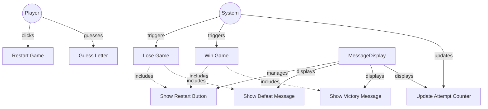

# TESTING CONTEXT

**Project:** The Hangman Game - Web Application

**Component under test:** `MessageDisplay` (Class)

**Testing framework:** Jest 29.7.0, ts-jest 29.2.5, jsdom environment

**Target coverage:** 
- Line coverage: ≥80%
- Function coverage: 100% (all public methods)
- Branch coverage: ≥80%

---

# CODE TO TEST

```typescript
/**
 * University of La Laguna
 * School of Engineering and Technology
 * Degree in Computer Engineering
 * Final Degree Project (TFG)
 *
 * @author Fabián González Lence <alu0101549491@ull.edu.es>
 * @since 2025-11-25
 * @file TFG-Fabian-Gonzalez-Lence/projects/1-TheHangmanGame/src/views/message-display.ts
 * @desc Displays victory/defeat messages, attempt counter, and restart button.
 * @see {@link https://github.com/alu0101549491/TFG-Fabian-Gonzalez-Lence/tree/main/projects/1-TheHangmanGame}
 * @see {@link https://typescripttutorial.net}
 */

/**
 * Manages the display of game messages and the restart button.
 * Shows victory/defeat messages, attempt counter, and restart button.
 *
 * @category View
 */
export class MessageDisplay {
  /** Container element for messages */
  private container: HTMLElement;

  /** Restart button element */
  private restartButton: HTMLButtonElement;

  /**
   * Creates a new MessageDisplay instance.
   * @param containerId - The ID of the container HTML element
   * @throws {Error} If the container element is not found
   */
  constructor(containerId: string) {
    const element = document.getElementById(containerId);
    if (!element) {
      throw new Error(`Element with id "${containerId}" not found`);
    }
    this.container = element;

    // Create restart button
    this.restartButton = document.createElement('button');
    this.restartButton.type = 'button';
    this.restartButton.classList.add('restart-button');
    this.restartButton.textContent = 'Restart Game';
  }

  /**
   * Displays a victory message with the revealed word.
   * @param word - The secret word that was guessed
   */
  public showVictory(word: string): void {
    this.clear();
    const message = document.createElement('div');
    message.classList.add('victory-message');
    message.textContent = `You Won! The word was: ${word.toUpperCase()}`;
    this.container.appendChild(message);
  }

  /**
   * Displays a defeat message with the secret word.
   * @param word - The secret word that was not guessed
   */
  public showDefeat(word: string): void {
    this.clear();
    const message = document.createElement('div');
    message.classList.add('defeat-message');
    message.textContent = `You Lost. The word was: ${word.toUpperCase()}`;
    this.container.appendChild(message);
  }

  /**
   * Displays the current attempt counter.
   * @param current - Current number of failed attempts
   * @param max - Maximum allowed failed attempts
   */
  public showAttempts(current: number, max: number): void {
    this.clear();
    const message = document.createElement('div');
    message.classList.add('attempt-counter');
    message.textContent = `Attempts: ${current}/${max}`;
    this.container.appendChild(message);
  }

  /**
   * Clears all messages from the display.
   */
  public clear(): void {
    this.container.innerHTML = '';
  }

  /**
   * Attaches a click handler to the restart button.
   * @param handler - The function to call when restart is clicked
   */
  public attachRestartHandler(handler: () => void): void {
    this.restartButton.addEventListener('click', handler);
  }

  /**
   * Makes the restart button visible.
   */
  public showRestartButton(): void {
    // Remove if already present (defensive)
    if (this.restartButton.parentNode === this.container) {
      return;
    }
    this.container.appendChild(this.restartButton);
  }

  /**
   * Hides the restart button.
   */
  public hideRestartButton(): void {
    if (this.restartButton.parentNode === this.container) {
      this.container.removeChild(this.restartButton);
    }
  }
}
```

---

# JEST CONFIGURATION

```javascript
/** @type {import('ts-jest').JestConfigWithTsJest} */
export default {
  preset: 'ts-jest',
  testEnvironment: 'jsdom',
  roots: ['<rootDir>/tests', '<rootDir>/src'],
  testMatch: ['**/__tests__/**/*.ts', '**/?(*.)+(spec|test).ts'],
  transform: {
    '^.+\\.ts$': ['ts-jest', {
      tsconfig: {
        esModuleInterop: true,
        allowSyntheticDefaultImports: true,
      },
    }],
  },
  moduleNameMapper: {
    '^@/(.*)$': '<rootDir>/src/$1',
    '^@models/(.*)$': '<rootDir>/src/models/$1',
    '^@views/(.*)$': '<rootDir>/src/views/$1',
    '^@controllers/(.*)$': '<rootDir>/src/controllers/$1',
    '\\.(css|less|scss|sass)$': '<rootDir>/tests/__mocks__/styleMock.js',
  },
  collectCoverageFrom: [
    'src/**/*.ts',
    '!src/main.ts',
    '!src/**/*.d.ts',
  ],
  coverageThreshold: {
    global: {
      branches: 80,
      functions: 80,
      lines: 80,
      statements: 80,
    },
  },
  coverageDirectory: 'coverage',
  setupFilesAfterEnv: ['<rootDir>/jest.setup.js'],
};
```

---

# JEST SETUP

```javascript
// Setup file for Jest
// Add custom matchers or global test configuration here

// Mock Canvas API for testing
HTMLCanvasElement.prototype.getContext = jest.fn(() => ({
  fillStyle: '',
  strokeStyle: '',
  lineWidth: 1,
  lineCap: 'butt',
  beginPath: jest.fn(),
  moveTo: jest.fn(),
  lineTo: jest.fn(),
  arc: jest.fn(),
  stroke: jest.fn(),
  fill: jest.fn(),
  clearRect: jest.fn(),
  fillRect: jest.fn(),
  strokeRect: jest.fn(),
}));

// Mock localStorage
const localStorageMock = {
  getItem: jest.fn(),
  setItem: jest.fn(),
  removeItem: jest.fn(),
  clear: jest.fn(),
};
global.localStorage = localStorageMock;
```

---

# TYPESCRIPT CONFIGURATION

```json
{
  "compilerOptions": {
    "target": "ES2020",
    "useDefineForClassFields": true,
    "module": "ESNext",
    "lib": ["ES2020", "DOM", "DOM.Iterable"],
    "skipLibCheck": true,

    /* Bundler mode */
    "moduleResolution": "bundler",
    "allowImportingTsExtensions": true,
    "resolveJsonModule": true,
    "isolatedModules": true,
    "noEmit": true,

    /* Linting */
    "strict": true,
    "noUnusedLocals": true,
    "noUnusedParameters": true,
    "noFallthroughCasesInSwitch": true,
    "forceConsistentCasingInFileNames": true,

    /* Path mapping */
    "baseUrl": ".",
    "paths": {
      "@/*": ["src/*"],
      "@models/*": ["src/models/*"],
      "@views/*": ["src/views/*"],
      "@controllers/*": ["src/controllers/*"]
    }
  },
  "include": ["src"],
  "exclude": ["node_modules", "dist", "tests"]
}
```

---

# REQUIREMENTS SPECIFICATION

## Relevant Functional Requirements:

- **FR4:** Register failed attempts and increment counter - Visual indicator of failed attempts (e.g., "Attempts: 3/6")
- **FR6:** Game termination by player victory - If the player guesses all letters before reaching 6 failed attempts, a victory message is displayed and the restart option is enabled
- **FR7:** Game termination by computer victory - If 6 failed attempts are completed without guessing the word, a defeat message is displayed with the correct word and the restart option is enabled
- **FR9:** Game restart - Upon finishing a game (victory or defeat), the user can restart the game through a button

## Relevant Non-Functional Requirements:

- **NFR2:** Modular and object-oriented code following MVC architecture
- **NFR4:** Use of Bulma for interface styling - HTML elements use Bulma classes with consistent design
- **NFR5:** Unit tests with Jest with minimum 80% coverage
- **NFR6:** Complete documentation with JSDoc/TypeDoc
- **NFR7:** Code analysis with ESLint and Google style guide
- **NFR8:** Immediate response time when selecting letters - Interface updates in less than 200ms

## Visual Specifications:

**Message Display Area (`#message-container`):**
- Dynamic area showing:
  - **Attempt counter:** e.g., "Attempts: 3/6"
  - **Victory message:** When player wins (with the secret word)
  - **Defeat message:** When player loses (with the secret word)
- Initially displays attempt counter
- Must be centered text alignment
- Minimum height: 100px to prevent layout shifts

**Message Styling (CSS classes):**
- **Victory message:** `.victory-message` - Color: Success green (#48c774), Font-size: 1.5rem, Font-weight: bold
- **Defeat message:** `.defeat-message` - Color: Danger red (#f14668), Font-size: 1.5rem, Font-weight: bold
- **Attempt counter:** `.attempt-counter` - Font-size: 1.25rem, Font-weight: 600, Color: Text color (#363636)

**Restart Button:**
- Class: `.restart-button`
- Appears only when game ends (victory or defeat)
- Text: "Restart Game"
- Bulma button styling with primary color

---

# USE CASE DIAGRAM



**Context:** MessageDisplay manages all game messages (attempts, victory, defeat) and restart button visibility.

---

# TASK

Generate a complete unit test suite for the `MessageDisplay` class that covers:

## 1. NORMAL CASES (Happy Path)

**Constructor Tests:**
- [ ] Verify constructor accepts containerId parameter
- [ ] Verify constructor finds container element by ID
- [ ] Verify constructor stores container reference
- [ ] Verify constructor creates restart button
- [ ] Verify restart button is configured correctly (type, class, text)

**showVictory() Tests:**
- [ ] Verify displays victory message
- [ ] Verify includes secret word in message
- [ ] Verify message has .victory-message CSS class
- [ ] Verify word is displayed in UPPERCASE
- [ ] Verify clears previous content before showing message

**showDefeat() Tests:**
- [ ] Verify displays defeat message
- [ ] Verify includes secret word in message
- [ ] Verify message has .defeat-message CSS class
- [ ] Verify word is displayed in UPPERCASE
- [ ] Verify clears previous content before showing message

**showAttempts() Tests:**
- [ ] Verify displays attempt counter in correct format
- [ ] Verify format is "Attempts: X/Y" or similar
- [ ] Verify uses .attempt-counter CSS class
- [ ] Verify displays current and max attempts
- [ ] Verify updates correctly when called multiple times

**clear() Tests:**
- [ ] Verify clears all messages from container
- [ ] Verify container innerHTML is empty after clear
- [ ] Verify can be called multiple times safely

**attachRestartHandler() Tests:**
- [ ] Verify attaches event listener to restart button
- [ ] Verify handler is called when button clicked
- [ ] Verify multiple handlers can be attached

**showRestartButton() Tests:**
- [ ] Verify adds restart button to container
- [ ] Verify button becomes visible in DOM
- [ ] Verify button is appended to container

**hideRestartButton() Tests:**
- [ ] Verify removes restart button from container
- [ ] Verify button is no longer in DOM
- [ ] Verify safe when button not in container

## 2. EDGE CASES

**showVictory() Edge Cases:**
- [ ] Verify works with short word (e.g., "CAT")
- [ ] Verify works with long word (e.g., "RHINOCEROS")
- [ ] Verify word case normalization (lowercase → uppercase)
- [ ] Verify multiple calls replace previous message

**showDefeat() Edge Cases:**
- [ ] Verify works with short word (e.g., "CAT")
- [ ] Verify works with long word (e.g., "RHINOCEROS")
- [ ] Verify word case normalization (lowercase → uppercase)
- [ ] Verify multiple calls replace previous message

**showAttempts() Edge Cases:**
- [ ] Verify displays 0/6 (initial state)
- [ ] Verify displays 6/6 (defeat threshold)
- [ ] Verify displays 3/6 (mid-game)
- [ ] Verify multiple calls update display correctly

**showRestartButton() Edge Cases:**
- [ ] Verify calling multiple times doesn't duplicate button
- [ ] Verify button can be shown after being hidden
- [ ] Verify idempotent behavior (safe to call when already shown)

**hideRestartButton() Edge Cases:**
- [ ] Verify safe when button not in DOM
- [ ] Verify safe when called multiple times
- [ ] Verify idempotent behavior

**clear() Edge Cases:**
- [ ] Verify clear on empty container is safe
- [ ] Verify clear removes restart button if present
- [ ] Verify multiple clear calls are safe

## 3. EXCEPTIONAL CASES (Error Handling)

**Constructor Error Cases:**
- [ ] Verify throws error when container element not found
- [ ] Verify throws error with descriptive message
- [ ] Verify error message includes container ID

**Message Content Validation:**
- [ ] Verify showVictory with empty word (if validation present)
- [ ] Verify showDefeat with empty word (if validation present)
- [ ] Verify showAttempts with invalid values (if validation present)

**Button Management:**
- [ ] Verify restart button exists after construction
- [ ] Verify hideRestartButton checks if button in DOM before removing

**Security:**
- [ ] Verify uses textContent (not innerHTML) for word display
- [ ] Verify XSS prevention in message display

## 4. INTEGRATION CASES

**GameView Integration (Mock):**
- [ ] Verify can be instantiated by GameView
- [ ] Verify works with standard container ID 'message-container'
- [ ] Verify multiple MessageDisplay instances can coexist (different containers)

**GameController Integration (Mock):**
- [ ] Verify showAttempts called during game progress
- [ ] Verify showVictory/showDefeat called at game end
- [ ] Verify restart handler triggered by controller

**Message Flow Integration:**
- [ ] Verify typical game flow: showAttempts → showVictory → showRestartButton
- [ ] Verify defeat flow: showAttempts × N → showDefeat → showRestartButton
- [ ] Verify restart flow: showRestartButton → clear → showAttempts

**CSS Integration:**
- [ ] Verify messages have correct CSS classes for styling
- [ ] Verify restart button has correct CSS class

---

# STRUCTURE OF EACH TEST

Use the **AAA (Arrange-Act-Assert)** pattern with TypeScript and DOM testing:

```typescript
import {MessageDisplay} from '@views/message-display';

describe('MessageDisplay', () => {
  let container: HTMLElement;
  let messageDisplay: MessageDisplay;

  beforeEach(() => {
    // Setup DOM
    document.body.innerHTML = '<div id="message-container"></div>';
    container = document.getElementById('message-container')!;
    
    // Create MessageDisplay instance
    messageDisplay = new MessageDisplay('message-container');
  });

  afterEach(() => {
    // Cleanup DOM
    document.body.innerHTML = '';
    jest.clearAllMocks();
  });

  describe('constructor', () => {
    it('should initialize with valid container ID', () => {
      // ARRANGE: DOM setup in beforeEach
      
      // ACT
      const display = new MessageDisplay('message-container');
      
      // ASSERT
      expect(display).toBeDefined();
      expect(display).toBeInstanceOf(MessageDisplay);
    });

    it('should throw error when container not found', () => {
      // ARRANGE: No container with ID 'invalid-id'
      
      // ACT & ASSERT
      expect(() => new MessageDisplay('invalid-id')).toThrow();
      expect(() => new MessageDisplay('invalid-id')).toThrow('not found');
    });

    it('should create restart button during construction', () => {
      // ARRANGE & ACT: messageDisplay already created in beforeEach
      
      // ASSERT: Restart button should exist (though not in DOM yet)
      // Verify through behavior: showRestartButton should work
      expect(() => messageDisplay.showRestartButton()).not.toThrow();
    });
  });

  describe('showVictory', () => {
    it('should display victory message with word', () => {
      // ARRANGE
      const word = 'ELEPHANT';
      
      // ACT
      messageDisplay.showVictory(word);
      
      // ASSERT
      const message = container.querySelector('.victory-message');
      expect(message).toBeDefined();
      expect(message?.textContent).toContain(word);
    });

    it('should display victory message with correct CSS class', () => {
      // ARRANGE & ACT
      messageDisplay.showVictory('CAT');
      
      // ASSERT
      const message = container.querySelector('.victory-message');
      expect(message).toBeDefined();
      expect(message?.classList.contains('victory-message')).toBe(true);
    });

    it('should convert word to uppercase', () => {
      // ARRANGE & ACT
      messageDisplay.showVictory('elephant');
      
      // ASSERT
      const message = container.querySelector('.victory-message');
      expect(message?.textContent).toContain('ELEPHANT');
      expect(message?.textContent).not.toContain('elephant');
    });

    it('should clear previous content before showing message', () => {
      // ARRANGE: Show attempts first
      messageDisplay.showAttempts(3, 6);
      expect(container.textContent).toContain('3');
      
      // ACT
      messageDisplay.showVictory('CAT');
      
      // ASSERT: Should only have victory message
      expect(container.querySelector('.attempt-counter')).toBeNull();
      expect(container.querySelector('.victory-message')).toBeDefined();
    });
  });

  describe('showDefeat', () => {
    it('should display defeat message with word', () => {
      // ARRANGE
      const word = 'RHINOCEROS';
      
      // ACT
      messageDisplay.showDefeat(word);
      
      // ASSERT
      const message = container.querySelector('.defeat-message');
      expect(message).toBeDefined();
      expect(message?.textContent).toContain(word);
    });

    it('should display defeat message with correct CSS class', () => {
      // ARRANGE & ACT
      messageDisplay.showDefeat('DOG');
      
      // ASSERT
      const message = container.querySelector('.defeat-message');
      expect(message).toBeDefined();
      expect(message?.classList.contains('defeat-message')).toBe(true);
    });

    it('should convert word to uppercase', () => {
      // ARRANGE & ACT
      messageDisplay.showDefeat('cat');
      
      // ASSERT
      const message = container.querySelector('.defeat-message');
      expect(message?.textContent).toContain('CAT');
    });
  });

  describe('showAttempts', () => {
    it('should display attempt counter with correct format', () => {
      // ARRANGE & ACT
      messageDisplay.showAttempts(3, 6);
      
      // ASSERT
      const counter = container.querySelector('.attempt-counter');
      expect(counter).toBeDefined();
      expect(counter?.textContent).toContain('3');
      expect(counter?.textContent).toContain('6');
    });

    it('should display initial attempt counter (0/6)', () => {
      // ARRANGE & ACT
      messageDisplay.showAttempts(0, 6);
      
      // ASSERT
      const counter = container.querySelector('.attempt-counter');
      expect(counter?.textContent).toMatch(/0.*6/);
    });

    it('should display defeat threshold (6/6)', () => {
      // ARRANGE & ACT
      messageDisplay.showAttempts(6, 6);
      
      // ASSERT
      const counter = container.querySelector('.attempt-counter');
      expect(counter?.textContent).toMatch(/6.*6/);
    });

    it('should update when called multiple times', () => {
      // ARRANGE: Show initial
      messageDisplay.showAttempts(0, 6);
      
      // ACT: Update
      messageDisplay.showAttempts(3, 6);
      
      // ASSERT: Should show updated value
      const counter = container.querySelector('.attempt-counter');
      expect(counter?.textContent).toContain('3');
    });
  });

  describe('clear', () => {
    it('should clear all content from container', () => {
      // ARRANGE: Add some content
      messageDisplay.showAttempts(3, 6);
      expect(container.innerHTML).not.toBe('');
      
      // ACT
      messageDisplay.clear();
      
      // ASSERT
      expect(container.innerHTML).toBe('');
    });

    it('should be safe to call on empty container', () => {
      // ARRANGE: Container already empty
      
      // ACT & ASSERT: Should not throw
      expect(() => messageDisplay.clear()).not.toThrow();
      expect(container.innerHTML).toBe('');
    });

    it('should remove restart button if present', () => {
      // ARRANGE: Show restart button
      messageDisplay.showRestartButton();
      expect(container.querySelector('.restart-button')).toBeDefined();
      
      // ACT
      messageDisplay.clear();
      
      // ASSERT
      expect(container.querySelector('.restart-button')).toBeNull();
    });
  });

  describe('attachRestartHandler', () => {
    beforeEach(() => {
      // Show restart button for testing
      messageDisplay.showRestartButton();
    });

    it('should call handler when restart button clicked', () => {
      // ARRANGE
      const mockHandler = jest.fn();
      messageDisplay.attachRestartHandler(mockHandler);
      
      // ACT: Click restart button
      const button = container.querySelector('.restart-button') as HTMLButtonElement;
      button.click();
      
      // ASSERT
      expect(mockHandler).toHaveBeenCalledTimes(1);
    });

    it('should support multiple handlers', () => {
      // ARRANGE
      const handler1 = jest.fn();
      const handler2 = jest.fn();
      messageDisplay.attachRestartHandler(handler1);
      messageDisplay.attachRestartHandler(handler2);
      
      // ACT
      const button = container.querySelector('.restart-button') as HTMLButtonElement;
      button.click();
      
      // ASSERT
      expect(handler1).toHaveBeenCalled();
      expect(handler2).toHaveBeenCalled();
    });
  });

  describe('showRestartButton', () => {
    it('should add restart button to container', () => {
      // ARRANGE: Button not in DOM initially
      expect(container.querySelector('.restart-button')).toBeNull();
      
      // ACT
      messageDisplay.showRestartButton();
      
      // ASSERT
      const button = container.querySelector('.restart-button');
      expect(button).toBeDefined();
      expect(button).toBeInstanceOf(HTMLButtonElement);
    });

    it('should not duplicate button when called multiple times', () => {
      // ARRANGE & ACT: Call twice
      messageDisplay.showRestartButton();
      messageDisplay.showRestartButton();
      
      // ASSERT: Should only have one button
      const buttons = container.querySelectorAll('.restart-button');
      expect(buttons.length).toBe(1);
    });

    it('should create button with correct properties', () => {
      // ARRANGE & ACT
      messageDisplay.showRestartButton();
      
      // ASSERT
      const button = container.querySelector('.restart-button') as HTMLButtonElement;
      expect(button.type).toBe('button');
      expect(button.classList.contains('restart-button')).toBe(true);
      expect(button.textContent).toBeTruthy();
    });
  });

  describe('hideRestartButton', () => {
    it('should remove restart button from container', () => {
      // ARRANGE: Show button first
      messageDisplay.showRestartButton();
      expect(container.querySelector('.restart-button')).toBeDefined();
      
      // ACT
      messageDisplay.hideRestartButton();
      
      // ASSERT
      expect(container.querySelector('.restart-button')).toBeNull();
    });

    it('should be safe when button not in DOM', () => {
      // ARRANGE: Button not shown
      
      // ACT & ASSERT: Should not throw
      expect(() => messageDisplay.hideRestartButton()).not.toThrow();
    });

    it('should be idempotent (safe to call multiple times)', () => {
      // ARRANGE: Show then hide
      messageDisplay.showRestartButton();
      messageDisplay.hideRestartButton();
      
      // ACT: Hide again
      expect(() => messageDisplay.hideRestartButton()).not.toThrow();
      
      // ASSERT
      expect(container.querySelector('.restart-button')).toBeNull();
    });
  });
});
```

---

# TEST REQUIREMENTS

## Configuration and types:
- [ ] Import class using path alias: `import {MessageDisplay} from '@views/message-display';`
- [ ] Setup DOM in `beforeEach()` with jsdom
- [ ] Clean up DOM in `afterEach()`
- [ ] Use TypeScript assertions with proper types
- [ ] Mock event handlers with `jest.fn()`

## DOM Testing with jsdom:
```typescript
// Setup DOM
beforeEach(() => {
  document.body.innerHTML = '<div id="message-container"></div>';
  container = document.getElementById('message-container')!;
});

// Query message elements
const victoryMsg = container.querySelector('.victory-message');
const defeatMsg = container.querySelector('.defeat-message');
const attemptCounter = container.querySelector('.attempt-counter');
const restartBtn = container.querySelector('.restart-button') as HTMLButtonElement;

// Assert message content
expect(victoryMsg?.textContent).toContain('ELEPHANT');
expect(attemptCounter?.textContent).toMatch(/3.*6/);

// Simulate button click
restartBtn.click();
```

## Message Format Testing:
```typescript
// Test attempt counter format variations
it('should display attempts in format "Attempts: X/Y"', () => {
  messageDisplay.showAttempts(3, 6);
  const counter = container.querySelector('.attempt-counter');
  
  // Should contain both numbers
  expect(counter?.textContent).toContain('3');
  expect(counter?.textContent).toContain('6');
  
  // Should have separator (/, :, etc.)
  expect(counter?.textContent).toMatch(/3.*6/);
});
```

## Security Testing:
```typescript
// Verify textContent used (not innerHTML)
it('should prevent XSS by using textContent', () => {
  const maliciousWord = '<script>alert("xss")</script>';
  messageDisplay.showVictory(maliciousWord);
  
  const message = container.querySelector('.victory-message');
  
  // Should display as text, not execute
  expect(message?.textContent).toContain('script');
  expect(message?.innerHTML).not.toContain('<script>');
});
```

## Jest-specific assertions:
```typescript
// DOM element existence
expect(message).toBeDefined();
expect(message).not.toBeNull();
expect(button).toBeInstanceOf(HTMLButtonElement);

// CSS classes
expect(message?.classList.contains('victory-message')).toBe(true);
expect(button?.classList.contains('restart-button')).toBe(true);

// Text content
expect(message?.textContent).toContain('ELEPHANT');
expect(message?.textContent).toMatch(/won|victory/i);
expect(counter?.textContent).toMatch(/\d+\/\d+/);

// Button properties
expect(button?.type).toBe('button');
expect(button?.textContent).toBeTruthy();

// Container state
expect(container.innerHTML).toBe('');
expect(container.children.length).toBe(0);
expect(container.querySelector('.restart-button')).toBeNull();

// Event handlers
expect(mockHandler).toHaveBeenCalled();
expect(mockHandler).toHaveBeenCalledTimes(1);

// Error assertions
expect(() => new MessageDisplay('invalid')).toThrow();
```

## Naming conventions:
- File: `message-display.test.ts` in `tests/views/` directory
- Describe blocks: 'MessageDisplay' (class name)
- Nested describe: Method names (constructor, showVictory, showDefeat, showAttempts, clear, attachRestartHandler, showRestartButton, hideRestartButton)
- It blocks: `should [expected behavior] when [condition]`

---

# DELIVERABLES

## 1. Complete Test File

Create file: `tests/views/message-display.test.ts`

```typescript
[Complete test implementation with all test cases]
```

## 2. Coverage Matrix

| Method | Normal Cases | Edge Cases | Exceptions | Integration | Total Tests |
|--------|--------------|------------|------------|-------------|-------------|
| constructor() | 3 | 0 | 2 | 1 | 6 |
| showVictory() | 4 | 4 | 2 | 1 | 11 |
| showDefeat() | 4 | 4 | 2 | 1 | 11 |
| showAttempts() | 4 | 3 | 1 | 1 | 9 |
| clear() | 2 | 2 | 0 | 1 | 5 |
| attachRestartHandler() | 2 | 1 | 0 | 1 | 4 |
| showRestartButton() | 3 | 2 | 0 | 1 | 6 |
| hideRestartButton() | 2 | 2 | 0 | 1 | 5 |
| Security | 0 | 0 | 2 | 0 | 2 |
| Message Flow | 0 | 0 | 0 | 3 | 3 |
| **TOTAL** | **24** | **18** | **9** | **11** | **62** |

## 3. Test Data

```typescript
// Test words for messages
const TEST_WORDS = {
  short: 'CAT',
  medium: 'ELEPHANT',
  long: 'RHINOCEROS',
  lowercase: 'elephant',
  uppercase: 'ELEPHANT',
  mixed: 'ElEpHaNt',
  malicious: '<script>alert("xss")</script>',
};

// Test attempt values
const TEST_ATTEMPTS = {
  initial: { current: 0, max: 6 },
  midGame: { current: 3, max: 6 },
  nearDefeat: { current: 5, max: 6 },
  defeat: { current: 6, max: 6 },
};

// Helper to get message element
function getMessageElement(container: HTMLElement, className: string): HTMLElement | null {
  return container.querySelector(`.${className}`);
}

// Helper to get restart button
function getRestartButton(container: HTMLElement): HTMLButtonElement | null {
  return container.querySelector('.restart-button');
}

// Helper to verify message format
function expectMessageFormat(element: HTMLElement | null, word: string): void {
  expect(element).toBeDefined();
  expect(element?.textContent).toContain(word.toUpperCase());
}

// Helper to verify attempt format
function expectAttemptFormat(element: HTMLElement | null, current: number, max: number): void {
  expect(element).toBeDefined();
  expect(element?.textContent).toContain(String(current));
  expect(element?.textContent).toContain(String(max));
}

// Helper to verify button properties
function expectButtonProperties(button: HTMLButtonElement): void {
  expect(button.type).toBe('button');
  expect(button.classList.contains('restart-button')).toBe(true);
  expect(button.textContent).toBeTruthy();
}
```

## 4. Expected Coverage Analysis

- **Estimated line coverage:** 95-100% (all DOM manipulation is testable)
- **Estimated branch coverage:** 90-100% (minimal branching - case normalization, button presence checks)
- **Methods covered:** 8/8 public methods (all public methods)
- **Private method coverage:** N/A (no private methods or tested through public interface)
- **Uncovered scenarios:** 
  - Optional: Complex message formatting edge cases
  - Optional: Advanced button state management

## 5. Execution Instructions

```bash
# Run tests for MessageDisplay only
npm test -- message-display.test.ts

# Run tests with coverage
npm run test:coverage -- message-display.test.ts

# Run tests in watch mode
npm run test:watch -- message-display.test.ts

# Run with verbose output
npm test -- message-display.test.ts --verbose

# Run specific test suite
npm test -- message-display.test.ts -t "showVictory"
```

---

# SPECIAL CASES TO CONSIDER

## Message Content and Formatting:

**Test message includes word:**
```typescript
it('should include word in victory message in recognizable format', () => {
  messageDisplay.showVictory('ELEPHANT');
  
  const message = getMessageElement(container, 'victory-message');
  
  // Word should be clearly present in message
  expect(message?.textContent).toContain('ELEPHANT');
  
  // Should have victory indication
  expect(message?.textContent).toMatch(/won|victory|congratulations/i);
});
```

## Case Normalization:

**Critical Test Case:**
```typescript
it('should normalize word case regardless of input', () => {
  // Test lowercase
  messageDisplay.showVictory('elephant');
  expect(container.textContent).toContain('ELEPHANT');
  expect(container.textContent).not.toContain('elephant');
  
  // Test mixed case
  messageDisplay.clear();
  messageDisplay.showDefeat('ElEpHaNt');
  expect(container.textContent).toContain('ELEPHANT');
  expect(container.textContent).not.toContain('ElEpHaNt');
});
```

## Button Lifecycle:

**Test button show/hide flow:**
```typescript
it('should manage button visibility through game lifecycle', () => {
  // Initially hidden
  expect(getRestartButton(container)).toBeNull();
  
  // Show at game end
  messageDisplay.showRestartButton();
  expect(getRestartButton(container)).toBeDefined();
  
  // Hide on restart
  messageDisplay.hideRestartButton();
  expect(getRestartButton(container)).toBeNull();
  
  // Can show again
  messageDisplay.showRestartButton();
  expect(getRestartButton(container)).toBeDefined();
});
```

## Clear Behavior:

**Test clear removes all content:**
```typescript
it('should clear all types of content', () => {
  // Add various content
  messageDisplay.showAttempts(3, 6);
  messageDisplay.showRestartButton();
  
  // Verify content present
  expect(container.children.length).toBeGreaterThan(0);
  
  // Clear
  messageDisplay.clear();
  
  // Verify empty
  expect(container.innerHTML).toBe('');
  expect(container.children.length).toBe(0);
});
```

## Multiple Message Types:

**Test message replacement:**
```typescript
it('should replace previous message with new message', () => {
  // Show attempt counter
  messageDisplay.showAttempts(3, 6);
  expect(getMessageElement(container, 'attempt-counter')).toBeDefined();
  
  // Show victory (should replace counter)
  messageDisplay.showVictory('CAT');
  expect(getMessageElement(container, 'attempt-counter')).toBeNull();
  expect(getMessageElement(container, 'victory-message')).toBeDefined();
  
  // Show defeat (should replace victory)
  messageDisplay.showDefeat('DOG');
  expect(getMessageElement(container, 'victory-message')).toBeNull();
  expect(getMessageElement(container, 'defeat-message')).toBeDefined();
});
```

## XSS Prevention:

**Security Test:**
```typescript
it('should prevent XSS injection through word parameter', () => {
  const xssAttempts = [
    '<script>alert("xss")</script>',
    '',
    '<svg onload=alert(1)>',
  ];
  
  xssAttempts.forEach(xss => {
    messageDisplay.clear();
    messageDisplay.showVictory(xss);
    
    const message = getMessageElement(container, 'victory-message');
    
    // Should display as text, not execute
    expect(message?.innerHTML).not.toContain('<script');
    expect(message?.innerHTML).not.toContain(' {
  const handler1 = jest.fn();
  const handler2 = jest.fn();
  const handler3 = jest.fn();
  
  messageDisplay.attachRestartHandler(handler1);
  messageDisplay.attachRestartHandler(handler2);
  messageDisplay.attachRestartHandler(handler3);
  
  messageDisplay.showRestartButton();
  const button = getRestartButton(container)!;
  button.click();
  
  // All handlers should be called
  expect(handler1).toHaveBeenCalled();
  expect(handler2).toHaveBeenCalled();
  expect(handler3).toHaveBeenCalled();
});
```

---

# ADDITIONAL NOTES

## Testing Philosophy for Message Display Components:

- **Focus on content correctness:** Verify messages display correct information
- **Test button lifecycle:** Show, hide, event handling
- **Verify CSS classes:** Ensure styling hooks present
- **Test message replacement:** Previous content cleared
- **Security first:** Verify XSS prevention with textContent

## Common Pitfalls to Avoid:

1. **Don't test exact message wording:** Test that word is included, not exact format
2. **Test CSS classes, not styling:** jsdom doesn't apply CSS
3. **Test button behavior:** Show/hide, event handling, not visual appearance
4. **Verify case normalization:** Always display uppercase

## Best Practices:

- Always clear container in beforeEach() or use fresh DOM
- Test all message types (victory, defeat, attempts)
- Verify button shows/hides correctly
- Test event handler attachment thoroughly
- Verify XSS prevention with malicious inputs
- Test idempotent operations (multiple shows, multiple hides)
- Use helper functions to reduce duplication

## Integration with GameView:

```typescript
// GameView will use MessageDisplay like this:
const messageDisplay = new MessageDisplay('message-container');

// During game
messageDisplay.showAttempts(currentAttempts, maxAttempts);

// On victory
messageDisplay.showVictory(secretWord);
messageDisplay.showRestartButton();

// On defeat
messageDisplay.showDefeat(secretWord);
messageDisplay.showRestartButton();

// Attach restart handler (GameController)
messageDisplay.attachRestartHandler(() => {
  controller.handleRestartClick();
});

// On restart
messageDisplay.clear();
messageDisplay.hideRestartButton();
```

## Accessibility Considerations:

- Native `<button>` for restart provides keyboard access
- Messages use semantic HTML (divs with text)
- CSS classes provide styling without JavaScript
- Optional: ARIA attributes for screen readers

---

**Note to Tester AI:** MessageDisplay is a message and button management View component. Focus on:

1. **Constructor:** Verify container finding and button creation
2. **Messages:** Test all message types (victory, defeat, attempts) with correct CSS classes
3. **Button Management:** Test show/hide lifecycle thoroughly
4. **Event Handling:** Test restart handler attachment and triggering
5. **Content Replacement:** Verify clear() and message replacement
6. **Security:** Verify XSS prevention with textContent
7. **Case Normalization:** Verify words always display in uppercase

Create comprehensive tests covering all message scenarios and button lifecycle states.
