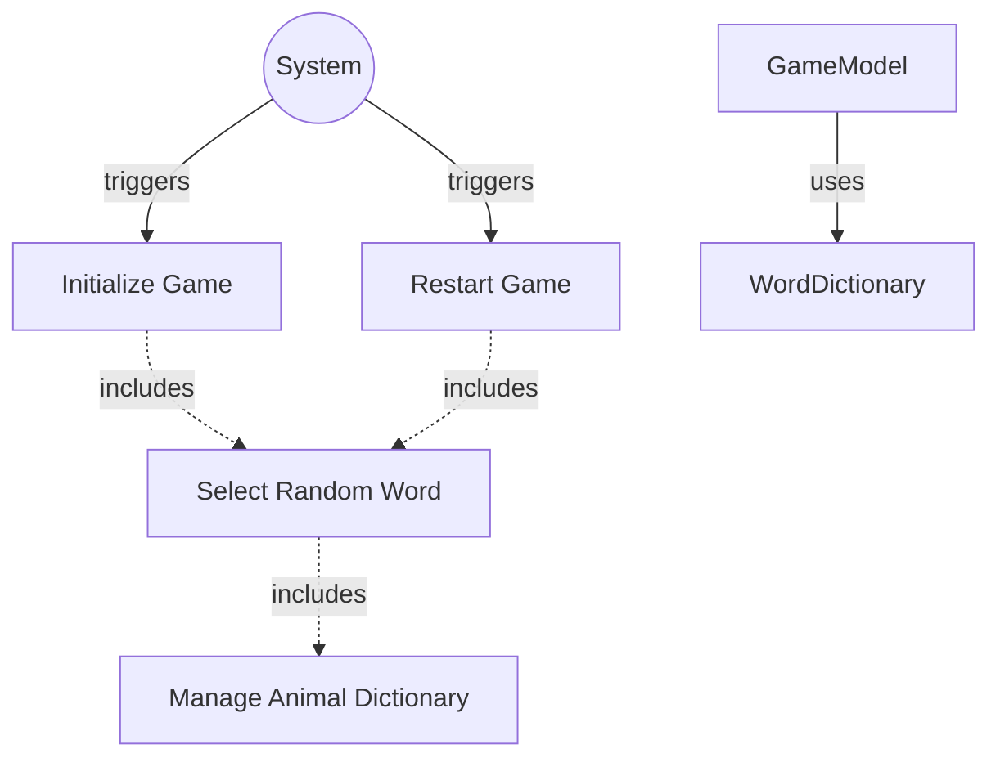

# TESTING CONTEXT

**Project:** The Hangman Game - Web Application

**Component under test:** `WordDictionary` (Class)

**Testing framework:** Jest 29.7.0, ts-jest 29.2.5

**Target coverage:** 
- Line coverage: ≥80%
- Function coverage: 100% (all public methods)
- Branch coverage: ≥80%

---

# CODE TO TEST

```typescript
/**
 * University of La Laguna
 * School of Engineering and Technology
 * Degree in Computer Engineering
 * Final Degree Project (TFG)
 *
 * @author Fabián González Lence <alu0101549491@ull.edu.es>
 * @since 2025-11-25
 * @file TFG-Fabian-Gonzalez-Lence/projects/1-TheHangmanGame/src/models/word-dictionary.ts
 * @desc Manages the dictionary of animal names for the Hangman game.
 * @see {@link https://github.com/alu0101549491/TFG-Fabian-Gonzalez-Lence/tree/main/projects/1-TheHangmanGame}
 * @see {@link https://typescripttutorial.net}
 */

import animals from '../data/animals.json';

/**
 * Manages the dictionary of animal names for the Hangman game.
 * Provides functionality to retrieve random words from the collection.
 * All words are stored in UPPERCASE for consistency.
 *
 * @category Model
 */
export class WordDictionary {
  /** Collection of animal names available for the game */
  private words: string[];

  /**
   * Creates a new WordDictionary instance and initializes the animal words.
   */
  constructor() {
    // Initialize from external JSON data and normalize to UPPERCASE
    this.words = Array.isArray(animals) ? animals.map((w: string) => w.toUpperCase()) : [];
  }

  /**
   * Retrieves a random word from the dictionary.
   * @returns A randomly selected animal name in UPPERCASE
   * @throws {Error} If the dictionary is empty (should never occur if constructor works correctly)
   */
  public getRandomWord(): string {
    if (this.words.length === 0) {
      throw new Error('Word dictionary is empty');
    }
    // Generate a random index between 0 and words.length - 1
    const randomIndex = Math.floor(Math.random() * this.words.length);
    return this.words[randomIndex];
  }

  /**
   * Returns the total number of words in the dictionary.
   * @returns The count of available words
   */
  public getWordCount(): number {
    return this.words.length;
  }

  // Words are loaded from `src/data/animals.json` at build time via import
}
```

---

# JEST CONFIGURATION

```javascript
/** @type {import('ts-jest').JestConfigWithTsJest} */
export default {
  preset: 'ts-jest',
  testEnvironment: 'jsdom',
  roots: ['<rootDir>/tests', '<rootDir>/src'],
  testMatch: ['**/__tests__/**/*.ts', '**/?(*.)+(spec|test).ts'],
  transform: {
    '^.+\\.ts$': ['ts-jest', {
      tsconfig: {
        esModuleInterop: true,
        allowSyntheticDefaultImports: true,
      },
    }],
  },
  moduleNameMapper: {
    '^@/(.*)$': '<rootDir>/src/$1',
    '^@models/(.*)$': '<rootDir>/src/models/$1',
    '^@views/(.*)$': '<rootDir>/src/views/$1',
    '^@controllers/(.*)$': '<rootDir>/src/controllers/$1',
    '\\.(css|less|scss|sass)$': '<rootDir>/tests/__mocks__/styleMock.js',
  },
  collectCoverageFrom: [
    'src/**/*.ts',
    '!src/main.ts',
    '!src/**/*.d.ts',
  ],
  coverageThreshold: {
    global: {
      branches: 80,
      functions: 80,
      lines: 80,
      statements: 80,
    },
  },
  coverageDirectory: 'coverage',
  setupFilesAfterEnv: ['<rootDir>/jest.setup.js'],
};
```

---

# JEST SETUP

```javascript
// Setup file for Jest
// Add custom matchers or global test configuration here

// Mock Canvas API for testing
HTMLCanvasElement.prototype.getContext = jest.fn(() => ({
  fillStyle: '',
  strokeStyle: '',
  lineWidth: 1,
  lineCap: 'butt',
  beginPath: jest.fn(),
  moveTo: jest.fn(),
  lineTo: jest.fn(),
  arc: jest.fn(),
  stroke: jest.fn(),
  fill: jest.fn(),
  clearRect: jest.fn(),
  fillRect: jest.fn(),
  strokeRect: jest.fn(),
}));

// Mock localStorage
const localStorageMock = {
  getItem: jest.fn(),
  setItem: jest.fn(),
  removeItem: jest.fn(),
  clear: jest.fn(),
};
global.localStorage = localStorageMock;
```

---

# TYPESCRIPT CONFIGURATION

```json
{
  "compilerOptions": {
    "target": "ES2020",
    "useDefineForClassFields": true,
    "module": "ESNext",
    "lib": ["ES2020", "DOM", "DOM.Iterable"],
    "skipLibCheck": true,

    /* Bundler mode */
    "moduleResolution": "bundler",
    "allowImportingTsExtensions": true,
    "resolveJsonModule": true,
    "isolatedModules": true,
    "noEmit": true,

    /* Linting */
    "strict": true,
    "noUnusedLocals": true,
    "noUnusedParameters": true,
    "noFallthroughCasesInSwitch": true,
    "forceConsistentCasingInFileNames": true,

    /* Path mapping */
    "baseUrl": ".",
    "paths": {
      "@/*": ["src/*"],
      "@models/*": ["src/models/*"],
      "@views/*": ["src/views/*"],
      "@controllers/*": ["src/controllers/*"]
    }
  },
  "include": ["src"],
  "exclude": ["node_modules", "dist", "tests"]
}
```

---

# REQUIREMENTS SPECIFICATION

## Relevant Functional Requirements:

- **FR1:** Initialize the game displaying the word to guess - requires selecting a random word
- **FR8:** Management of animal word dictionary - The system maintains a dictionary of at least 10 animal names and randomly selects one when starting or restarting the game
- **FR9:** Game restart - Upon finishing a game, selects a new random word

## Relevant Non-Functional Requirements:

- **NFR2:** Modular and object-oriented code following MVC architecture
- **NFR5:** Unit tests with Jest with minimum 80% coverage
- **NFR6:** Complete documentation with JSDoc/TypeDoc
- **NFR7:** Code analysis with ESLint and Google style guide

## Technical Context:

**WordDictionary Responsibilities:**
- Store at least 10 animal names in UPPERCASE format
- Provide random word selection for game initialization
- Support multiple random selections (same word can be selected multiple times)

**Word Selection Criteria:**
- Common, recognizable animal names
- Variety of word lengths (short, medium, long)
- English language
- No special characters or spaces
- All words in UPPERCASE

**Integration Points:**
- **Used by:** `GameModel` constructor via dependency injection
- **Called by:** `GameModel.initializeGame()` and `GameModel.resetGame()`

---

# USE CASE DIAGRAM



**Context:** WordDictionary provides random word selection for GameModel during initialization and restart.

---

# TASK

Generate a complete unit test suite for the `WordDictionary` class that covers:

## 1. NORMAL CASES (Happy Path)

**Constructor Tests:**
- [ ] Verify constructor initializes without errors
- [ ] Verify constructor calls initializeAnimalWords()
- [ ] Verify words array is populated after construction
- [ ] Verify instance can be created successfully

**getRandomWord() Tests:**
- [ ] Verify returns a valid word from the dictionary
- [ ] Verify returned word is a non-empty string
- [ ] Verify returned word is in UPPERCASE
- [ ] Verify returned word exists in the dictionary
- [ ] Verify can be called multiple times successfully
- [ ] Verify different calls can return different words

**getWordCount() Tests:**
- [ ] Verify returns correct number of words
- [ ] Verify returns at least 10 words (minimum requirement)
- [ ] Verify count matches actual array length

## 2. EDGE CASES

**Random Selection Tests:**
- [ ] Verify random selection distribution (over many calls)
- [ ] Verify same word can be selected multiple times (true randomness)
- [ ] Verify all words can potentially be selected (no unreachable words)
- [ ] Verify selection works at boundaries (first and last words in array)

**Word Format Tests:**
- [ ] Verify all words are in UPPERCASE
- [ ] Verify all words contain only alphabetic characters
- [ ] Verify no words contain spaces
- [ ] Verify no words contain special characters
- [ ] Verify no empty strings in dictionary
- [ ] Verify no duplicate words in dictionary

**Word Length Variety Tests:**
- [ ] Verify dictionary contains short words (3-5 letters)
- [ ] Verify dictionary contains medium words (6-8 letters)
- [ ] Verify dictionary contains long words (9+ letters)

## 3. EXCEPTIONAL CASES (Error Handling)

**Dictionary Integrity Tests:**
- [ ] Verify dictionary is not empty after initialization
- [ ] Verify dictionary has at least minimum required words (10)
- [ ] Verify all entries are valid animal names (non-empty, uppercase, alphabetic)

**Defensive Programming Tests:**
- [ ] Verify getRandomWord() doesn't return undefined
- [ ] Verify getRandomWord() doesn't return null
- [ ] Verify getRandomWord() doesn't return empty string
- [ ] Verify getWordCount() returns positive integer

## 4. INTEGRATION CASES

**GameModel Integration (Mock):**
- [ ] Verify WordDictionary can be injected into GameModel
- [ ] Verify GameModel can call getRandomWord() successfully
- [ ] Verify multiple GameModel instances can share or have separate dictionaries

**Word Selection Consistency:**
- [ ] Verify word format is consistent with GameModel expectations
- [ ] Verify returned words are suitable for hangman gameplay
- [ ] Verify words work with letter-by-letter reveal mechanism

---

# STRUCTURE OF EACH TEST

Use the **AAA (Arrange-Act-Assert)** pattern with TypeScript:

```typescript
import {WordDictionary} from '@models/word-dictionary';

describe('WordDictionary', () => {
  let dictionary: WordDictionary;

  beforeEach(() => {
    // Create fresh instance for each test
    dictionary = new WordDictionary();
  });

  describe('constructor', () => {
    it('should initialize without errors', () => {
      // ARRANGE & ACT
      const dict = new WordDictionary();
      
      // ASSERT
      expect(dict).toBeDefined();
      expect(dict).toBeInstanceOf(WordDictionary);
    });

    it('should populate words array during initialization', () => {
      // ARRANGE & ACT
      const dict = new WordDictionary();
      
      // ASSERT
      expect(dict.getWordCount()).toBeGreaterThan(0);
    });
  });

  describe('getRandomWord', () => {
    it('should return a valid non-empty string', () => {
      // ARRANGE: dictionary already created in beforeEach
      
      // ACT
      const word = dictionary.getRandomWord();
      
      // ASSERT
      expect(word).toBeDefined();
      expect(typeof word).toBe('string');
      expect(word.length).toBeGreaterThan(0);
    });

    it('should return a word in UPPERCASE', () => {
      // ARRANGE & ACT
      const word = dictionary.getRandomWord();
      
      // ASSERT
      expect(word).toBe(word.toUpperCase());
    });
  });

  describe('getWordCount', () => {
    it('should return at least 10 words', () => {
      // ARRANGE & ACT
      const count = dictionary.getWordCount();
      
      // ASSERT
      expect(count).toBeGreaterThanOrEqual(10);
    });

    it('should return a positive integer', () => {
      // ARRANGE & ACT
      const count = dictionary.getWordCount();
      
      // ASSERT
      expect(count).toBeGreaterThan(0);
      expect(Number.isInteger(count)).toBe(true);
    });
  });
});
```

---

# TEST REQUIREMENTS

## Configuration and types:
- [ ] Import class using path alias: `import {WordDictionary} from '@models/word-dictionary';`
- [ ] Use strict TypeScript typing for all test variables
- [ ] Create fresh instance in `beforeEach()` for test isolation

## Statistical Testing for Randomness:
- [ ] Test random distribution by calling getRandomWord() many times (e.g., 1000 iterations)
- [ ] Verify all words appear at least once in large sample
- [ ] Verify no single word dominates the distribution (reasonable variance)
- [ ] Use statistical assertions for randomness validation

## Jest-specific assertions:
```typescript
// String validations
expect(word).toBeDefined();
expect(word).not.toBeNull();
expect(word).not.toBe('');
expect(typeof word).toBe('string');
expect(word.length).toBeGreaterThan(0);

// UPPERCASE validation
expect(word).toBe(word.toUpperCase());
expect(word).toMatch(/^[A-Z]+$/);

// Count validations
expect(count).toBeGreaterThanOrEqual(10);
expect(count).toBeGreaterThan(0);
expect(Number.isInteger(count)).toBe(true);

// Array contains
expect(allWords).toContain(selectedWord);
expect(allWords).toHaveLength(count);

// No duplicates
expect(new Set(allWords).size).toBe(allWords.length);
```

## Naming conventions:
- File: `word-dictionary.test.ts` in `tests/models/` directory
- Describe blocks: 'WordDictionary' (class name)
- Nested describe: 'constructor', 'getRandomWord', 'getWordCount'
- It blocks: `should [expected behavior] when [condition]`

---

# DELIVERABLES

## 1. Complete Test File

Create file: `tests/models/word-dictionary.test.ts`

```typescript
[Complete test implementation with all test cases]
```

## 2. Coverage Matrix

| Method | Normal Cases | Edge Cases | Exceptions | Integration | Total Tests |
|--------|--------------|------------|------------|-------------|-------------|
| constructor() | 2 | 1 | 1 | 0 | 4 |
| getRandomWord() | 4 | 4 | 3 | 1 | 12 |
| getWordCount() | 2 | 1 | 1 | 0 | 4 |
| Word Quality | 0 | 7 | 3 | 0 | 10 |
| Integration | 0 | 0 | 0 | 2 | 2 |
| **TOTAL** | **8** | **13** | **8** | **3** | **32** |

## 3. Expected Coverage Analysis

- **Estimated line coverage:** 100% (all lines in WordDictionary are testable)
- **Estimated branch coverage:** 100% (minimal branching - mainly in getRandomWord logic)
- **Methods covered:** 3/3 public methods (constructor, getRandomWord, getWordCount)
- **Private method coverage:** initializeAnimalWords() covered indirectly through constructor tests
- **Uncovered scenarios:** None - all class functionality is testable

## 4. Execution Instructions

```bash
# Run tests for WordDictionary only
npm test -- word-dictionary.test.ts

# Run tests with coverage
npm run test:coverage -- word-dictionary.test.ts

# Run tests in watch mode
npm run test:watch -- word-dictionary.test.ts

# Run with verbose output
npm test -- word-dictionary.test.ts --verbose
```

---

# SPECIAL CASES TO CONSIDER

## Random Selection Testing Strategies:

1. **Statistical Randomness:**
   - Call `getRandomWord()` 1000+ times
   - Count occurrences of each word
   - Verify reasonable distribution (no word appears >50% of the time)
   - Verify all words appear at least once in large sample

2. **True Randomness vs Determinism:**
   - Dictionary should allow same word to be selected consecutively
   - Each call is independent (no internal state affecting selection)
   - Math.random() behavior is non-deterministic (acceptable for tests)

3. **Boundary Testing:**
   - If dictionary uses array indexing, verify index 0 and length-1 are reachable
   - Verify no off-by-one errors in random index calculation

## Word Quality Validation:

1. **Format Consistency:**
   - All words must be UPPERCASE (critical for game logic)
   - All words must be alphabetic only (A-Z)
   - No spaces, hyphens, or special characters

2. **Word Length Variety:**
   - Short words (3-5 letters): Easier for players
   - Medium words (6-8 letters): Balanced difficulty
   - Long words (9+ letters): Challenging

3. **Animal Names Validity:**
   - Optional: Verify words are recognizable animal names
   - Optional: Check against known animal name list

## Integration Considerations:

1. **GameModel Compatibility:**
   - Words should work with letter-by-letter reveal
   - No special handling needed for any dictionary word
   - All words suitable for hangman gameplay

2. **Multiple Instances:**
   - Each WordDictionary instance has its own word array
   - Multiple GameModel instances can use separate dictionaries
   - No shared state between instances

---

# ADDITIONAL NOTES

## Testing Philosophy:

- **Tests must be deterministic:** Except for random selection distribution tests
- **Avoid sleeps or waits:** Not needed for this synchronous class
- **Mock Math.random() if needed:** For deterministic random selection tests (optional)

## Random Testing Approach:

```typescript
// Option 1: Test statistical distribution (recommended)
it('should distribute selections across all words in large sample', () => {
  const sampleSize = 1000;
  const samples = collectRandomSample(dictionary, sampleSize);
  const uniqueWords = new Set(samples);
  
  // Verify good variety in large sample
  expect(uniqueWords.size).toBeGreaterThan(5); // At least half of min words
});

// Option 2: Mock Math.random() for deterministic tests
it('should select word at specific index when Math.random returns specific value', () => {
  // Mock Math.random to return predictable value
  const mockRandom = jest.spyOn(Math, 'random').mockReturnValue(0.5);
  
  const word = dictionary.getRandomWord();
  
  // Assert based on mocked random value
  expect(word).toBeDefined();
  
  mockRandom.mockRestore();
});
```

## Best Practices:

- Test dictionary initialization through constructor (don't test private method directly)
- Verify word format requirements thoroughly (UPPERCASE, alphabetic)
- Test boundary conditions in random selection
- Verify minimum word count requirement (10 words)
- Test that getWordCount() returns consistent value across multiple calls
- Verify no side effects from calling getRandomWord() multiple times

---

**Note to Tester AI:** WordDictionary is a simple data management class with three public methods. Focus on:

1. **Initialization:** Verify constructor properly populates the word array
2. **Random Selection:** Test getRandomWord() returns valid words with reasonable randomness
3. **Word Quality:** Verify all words meet format requirements (UPPERCASE, alphabetic, non-empty)
4. **Count Accuracy:** Verify getWordCount() returns correct value
5. **Integration:** Verify class can be used by GameModel as intended

The test suite should be comprehensive but straightforward, ensuring the dictionary provides consistent, valid animal names for the hangman game.
