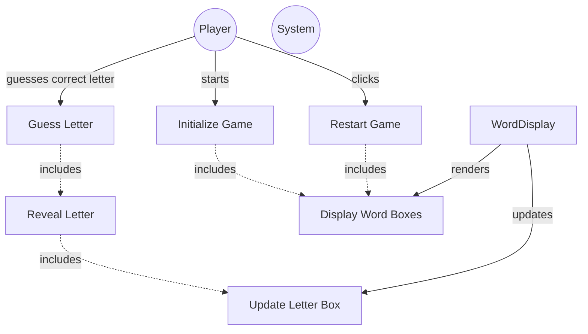

# TESTING CONTEXT

**Project:** The Hangman Game - Web Application

**Component under test:** `WordDisplay` (Class)

**Testing framework:** Jest 29.7.0, ts-jest 29.2.5, jsdom environment

**Target coverage:** 
- Line coverage: ≥80%
- Function coverage: 100% (all public methods)
- Branch coverage: ≥80%

---

# CODE TO TEST

```typescript
/**
 * University of La Laguna
 * School of Engineering and Technology
 * Degree in Computer Engineering
 * Final Degree Project (TFG)
 *
 * @author Fabián González Lence <alu0101549491@ull.edu.es>
 * @since 2025-11-25
 * @file TFG-Fabian-Gonzalez-Lence/projects/1-TheHangmanGame/src/views/word-display.ts
 * @desc Manages the visual display of the word being guessed and updates letter boxes.
 * @see {@link https://github.com/alu0101549491/TFG-Fabian-Gonzalez-Lence/tree/main/projects/1-TheHangmanGame}
 * @see {@link https://typescripttutorial.net}
 */

/**
 * Manages the visual display of the word being guessed in the Hangman game.
 * Creates and updates letter boxes showing the current progress.
 *
 * @category View
 */
export class WordDisplay {
  /** Container element for the word display */
  private container: HTMLElement;

  /** Array of letter box elements */
  private letterBoxes: HTMLElement[];

  /** CSS class applied to each letter box */
  private readonly LETTER_BOX_CLASS = 'letter-box';

  /**
   * Creates a new WordDisplay instance.
   * @param containerId - The ID of the container HTML element
   * @throws {Error} If the container element is not found
   */
  constructor(containerId: string) {
    const element = document.getElementById(containerId);
    if (!element) {
      throw new Error(`Element with id "${containerId}" not found`);
    }
    this.container = element;
    this.letterBoxes = [];
  }

  /**
   * Renders the initial word display with empty boxes.
   * @param wordLength - The number of letters in the word
   */
  public render(wordLength: number): void {
    // Clear previous content
    this.container.innerHTML = '';
    this.letterBoxes = [];
    // Batch DOM inserts to minimize reflows
    const fragment = document.createDocumentFragment();
    for (let i = 0; i < wordLength; i++) {
      const box = this.createLetterBox();
      fragment.appendChild(box);
      this.letterBoxes.push(box);
    }
    this.container.appendChild(fragment);
  }

  /**
   * Updates a specific letter box with a revealed letter.
   * @param index - The position of the letter (0-based)
   * @param letter - The letter to display
   * @throws {Error} If the index is out of bounds
   */
  public updateBox(index: number, letter: string): void {
    if (index < 0 || index >= this.letterBoxes.length) {
      throw new Error(`Index ${index} is out of bounds`);
    }
    this.letterBoxes[index].textContent = letter.toUpperCase();
  }

  /**
   * Resets the display by clearing all letter boxes.
   */
  public reset(): void {
    this.container.innerHTML = '';
    this.letterBoxes = [];
  }

  /**
   * Creates a single letter box element.
   * @returns The created letter box element
   * @private
   */
  private createLetterBox(): HTMLElement {
    const box = document.createElement('div');
    box.classList.add(this.LETTER_BOX_CLASS);
    return box;
  }
}
```

---

# JEST CONFIGURATION

```javascript
/** @type {import('ts-jest').JestConfigWithTsJest} */
export default {
  preset: 'ts-jest',
  testEnvironment: 'jsdom',
  roots: ['<rootDir>/tests', '<rootDir>/src'],
  testMatch: ['**/__tests__/**/*.ts', '**/?(*.)+(spec|test).ts'],
  transform: {
    '^.+\\.ts$': ['ts-jest', {
      tsconfig: {
        esModuleInterop: true,
        allowSyntheticDefaultImports: true,
      },
    }],
  },
  moduleNameMapper: {
    '^@/(.*)$': '<rootDir>/src/$1',
    '^@models/(.*)$': '<rootDir>/src/models/$1',
    '^@views/(.*)$': '<rootDir>/src/views/$1',
    '^@controllers/(.*)$': '<rootDir>/src/controllers/$1',
    '\\.(css|less|scss|sass)$': '<rootDir>/tests/__mocks__/styleMock.js',
  },
  collectCoverageFrom: [
    'src/**/*.ts',
    '!src/main.ts',
    '!src/**/*.d.ts',
  ],
  coverageThreshold: {
    global: {
      branches: 80,
      functions: 80,
      lines: 80,
      statements: 80,
    },
  },
  coverageDirectory: 'coverage',
  setupFilesAfterEnv: ['<rootDir>/jest.setup.js'],
};
```

---

# JEST SETUP

```javascript
// Setup file for Jest
// Add custom matchers or global test configuration here

// Mock Canvas API for testing
HTMLCanvasElement.prototype.getContext = jest.fn(() => ({
  fillStyle: '',
  strokeStyle: '',
  lineWidth: 1,
  lineCap: 'butt',
  beginPath: jest.fn(),
  moveTo: jest.fn(),
  lineTo: jest.fn(),
  arc: jest.fn(),
  stroke: jest.fn(),
  fill: jest.fn(),
  clearRect: jest.fn(),
  fillRect: jest.fn(),
  strokeRect: jest.fn(),
}));

// Mock localStorage
const localStorageMock = {
  getItem: jest.fn(),
  setItem: jest.fn(),
  removeItem: jest.fn(),
  clear: jest.fn(),
};
global.localStorage = localStorageMock;
```

---

# TYPESCRIPT CONFIGURATION

```json
{
  "compilerOptions": {
    "target": "ES2020",
    "useDefineForClassFields": true,
    "module": "ESNext",
    "lib": ["ES2020", "DOM", "DOM.Iterable"],
    "skipLibCheck": true,

    /* Bundler mode */
    "moduleResolution": "bundler",
    "allowImportingTsExtensions": true,
    "resolveJsonModule": true,
    "isolatedModules": true,
    "noEmit": true,

    /* Linting */
    "strict": true,
    "noUnusedLocals": true,
    "noUnusedParameters": true,
    "noFallthroughCasesInSwitch": true,
    "forceConsistentCasingInFileNames": true,

    /* Path mapping */
    "baseUrl": ".",
    "paths": {
      "@/*": ["src/*"],
      "@models/*": ["src/models/*"],
      "@views/*": ["src/views/*"],
      "@controllers/*": ["src/controllers/*"]
    }
  },
  "include": ["src"],
  "exclude": ["node_modules", "dist", "tests"]
}
```

---

# REQUIREMENTS SPECIFICATION

## Relevant Functional Requirements:

- **FR1:** Initialize the game displaying the word to guess in empty boxes - word is displayed as empty boxes (underscores)
- **FR3:** Reveal all occurrences of correct letters - If the selected letter is in the word, all its occurrences are revealed simultaneously in the corresponding boxes
- **FR9:** Game restart - Restart resets all states including the word display

## Relevant Non-Functional Requirements:

- **NFR2:** Modular and object-oriented code following MVC architecture
- **NFR4:** Use of Bulma for interface styling - HTML elements use Bulma classes with consistent design
- **NFR5:** Unit tests with Jest with minimum 80% coverage
- **NFR6:** Complete documentation with JSDoc/TypeDoc
- **NFR7:** Code analysis with ESLint and Google style guide
- **NFR8:** Immediate response time when selecting letters - Interface updates in less than 200ms

## Visual Specifications:

**Word Display Section (`#word-container`):**
- Dynamic container displaying empty letter boxes initially
- Each box represents one letter of the secret word

**Box specifications:**
- Width: 50px, Height: 60px (desktop) / 40px, 50px (mobile)
- Border: 2px solid primary color (#3273dc)
- Border-radius: 8px
- White background
- Font-size: 2rem (desktop) / 1.5rem (mobile)
- Font-weight: bold
- Centered content (flex display)
- Gap between boxes: 0.5rem
- **CSS class:** `.letter-box`

---

# USE CASE DIAGRAM



**Context:** WordDisplay manages the visual display of letter boxes that reveal the word progressively.

---

# TASK

Generate a complete unit test suite for the `WordDisplay` class that covers:

## 1. NORMAL CASES (Happy Path)

**Constructor Tests:**
- [ ] Verify constructor accepts containerId parameter
- [ ] Verify constructor finds container element by ID
- [ ] Verify constructor initializes empty letterBoxes array
- [ ] Verify constructor stores container reference

**render() Tests:**
- [ ] Verify creates correct number of boxes for given wordLength
- [ ] Verify boxes are appended to container
- [ ] Verify boxes are stored in letterBoxes array
- [ ] Verify boxes have correct CSS class (.letter-box)
- [ ] Verify boxes are initially empty (no text content)
- [ ] Verify clears previous boxes before creating new ones

**updateBox() Tests:**
- [ ] Verify updates specific box at given index
- [ ] Verify sets textContent of box to letter
- [ ] Verify converts lowercase letter to uppercase
- [ ] Verify updates correct box when multiple boxes exist
- [ ] Verify box displays letter correctly

**reset() Tests:**
- [ ] Verify clears container innerHTML
- [ ] Verify clears letterBoxes array
- [ ] Verify container is empty after reset
- [ ] Verify letterBoxes array is empty after reset

## 2. EDGE CASES

**render() Edge Cases:**
- [ ] Verify handles wordLength of 0 (no boxes created)
- [ ] Verify handles wordLength of 1 (single box)
- [ ] Verify handles large wordLength (e.g., 15+ boxes)
- [ ] Verify multiple render() calls clear previous boxes
- [ ] Verify render() resets letterBoxes array each time

**updateBox() Edge Cases:**
- [ ] Verify updateBox at index 0 (first box)
- [ ] Verify updateBox at last valid index
- [ ] Verify updateBox with empty string (clears box)
- [ ] Verify updateBox with lowercase letter normalizes to uppercase
- [ ] Verify updateBox with single character
- [ ] Verify multiple updateBox calls on same index

**reset() Edge Cases:**
- [ ] Verify reset() on already empty container is safe
- [ ] Verify reset() after render() clears everything
- [ ] Verify reset() can be called multiple times safely

**Container Edge Cases:**
- [ ] Verify behavior when container already has content
- [ ] Verify render() after reset() works correctly

## 3. EXCEPTIONAL CASES (Error Handling)

**Constructor Error Cases:**
- [ ] Verify throws error when container element not found
- [ ] Verify throws error with descriptive message
- [ ] Verify error message includes container ID

**updateBox() Error Cases:**
- [ ] Verify handles invalid index gracefully (if defensive check present)
- [ ] Verify handles negative index (if defensive check present)
- [ ] Verify handles index >= array length (if defensive check present)

**DOM Integrity:**
- [ ] Verify letterBoxes array stays in sync with DOM
- [ ] Verify no memory leaks from DOM references

## 4. INTEGRATION CASES

**GameView Integration (Mock):**
- [ ] Verify can be instantiated by GameView
- [ ] Verify works with standard container ID 'word-container'
- [ ] Verify multiple WordDisplay instances can coexist (different containers)

**CSS Integration:**
- [ ] Verify boxes have .letter-box class for styling
- [ ] Verify CSS classes are applied correctly

**Rendering Flow Integration:**
- [ ] Verify typical game flow: render() → updateBox() × N → reset()
- [ ] Verify can render word of length 8 (ELEPHANT)
- [ ] Verify can reveal all occurrences of same letter
- [ ] Verify boxes update independently

---

# STRUCTURE OF EACH TEST

Use the **AAA (Arrange-Act-Assert)** pattern with TypeScript and DOM testing:

```typescript
import {WordDisplay} from '@views/word-display';

describe('WordDisplay', () => {
  let container: HTMLElement;
  let wordDisplay: WordDisplay;

  beforeEach(() => {
    // Setup DOM
    document.body.innerHTML = '<div id="word-container"></div>';
    container = document.getElementById('word-container')!;
    
    // Create WordDisplay instance
    wordDisplay = new WordDisplay('word-container');
  });

  afterEach(() => {
    // Cleanup DOM
    document.body.innerHTML = '';
    jest.clearAllMocks();
  });

  describe('constructor', () => {
    it('should initialize with valid container ID', () => {
      // ARRANGE: DOM setup in beforeEach
      
      // ACT
      const display = new WordDisplay('word-container');
      
      // ASSERT
      expect(display).toBeDefined();
      expect(display).toBeInstanceOf(WordDisplay);
    });

    it('should throw error when container not found', () => {
      // ARRANGE: No container with ID 'invalid-id'
      
      // ACT & ASSERT
      expect(() => new WordDisplay('invalid-id')).toThrow();
      expect(() => new WordDisplay('invalid-id')).toThrow('not found');
    });
  });

  describe('render', () => {
    it('should create correct number of letter boxes', () => {
      // ARRANGE: wordDisplay already created
      const wordLength = 8; // ELEPHANT
      
      // ACT
      wordDisplay.render(wordLength);
      
      // ASSERT
      const boxes = container.querySelectorAll('.letter-box');
      expect(boxes.length).toBe(wordLength);
    });

    it('should create boxes with correct CSS class', () => {
      // ARRANGE
      const wordLength = 5;
      
      // ACT
      wordDisplay.render(wordLength);
      
      // ASSERT
      const boxes = container.querySelectorAll('.letter-box');
      boxes.forEach(box => {
        expect(box.classList.contains('letter-box')).toBe(true);
      });
    });

    it('should clear previous boxes before rendering new ones', () => {
      // ARRANGE: Render boxes first time
      wordDisplay.render(5);
      expect(container.children.length).toBe(5);
      
      // ACT: Render different number of boxes
      wordDisplay.render(3);
      
      // ASSERT: Should only have 3 boxes now
      expect(container.children.length).toBe(3);
    });
  });

  describe('updateBox', () => {
    beforeEach(() => {
      // Render 8 boxes for ELEPHANT
      wordDisplay.render(8);
    });

    it('should update box at specific index with letter', () => {
      // ARRANGE: boxes already rendered
      
      // ACT
      wordDisplay.updateBox(0, 'E');
      
      // ASSERT
      const box = container.children[0] as HTMLElement;
      expect(box.textContent).toBe('E');
    });

    it('should convert lowercase letter to uppercase', () => {
      // ARRANGE
      
      // ACT
      wordDisplay.updateBox(0, 'e');
      
      // ASSERT
      const box = container.children[0] as HTMLElement;
      expect(box.textContent).toBe('E');
    });

    it('should update correct box when multiple boxes exist', () => {
      // ARRANGE: 8 boxes rendered
      
      // ACT: Update boxes at different indices
      wordDisplay.updateBox(0, 'E');
      wordDisplay.updateBox(2, 'E');
      wordDisplay.updateBox(4, 'H');
      
      // ASSERT
      expect((container.children[0] as HTMLElement).textContent).toBe('E');
      expect((container.children[1] as HTMLElement).textContent).toBe('');
      expect((container.children[2] as HTMLElement).textContent).toBe('E');
      expect((container.children[4] as HTMLElement).textContent).toBe('H');
    });
  });

  describe('reset', () => {
    it('should clear all boxes from container', () => {
      // ARRANGE: Render and update some boxes
      wordDisplay.render(5);
      wordDisplay.updateBox(0, 'E');
      expect(container.children.length).toBe(5);
      
      // ACT
      wordDisplay.reset();
      
      // ASSERT
      expect(container.innerHTML).toBe('');
      expect(container.children.length).toBe(0);
    });

    it('should allow rendering after reset', () => {
      // ARRANGE: Render, then reset
      wordDisplay.render(5);
      wordDisplay.reset();
      
      // ACT: Render again
      wordDisplay.render(3);
      
      // ASSERT
      expect(container.children.length).toBe(3);
    });
  });
});
```

---

# TEST REQUIREMENTS

## Configuration and types:
- [ ] Import class using path alias: `import {WordDisplay} from '@views/word-display';`
- [ ] Setup DOM in `beforeEach()` with jsdom
- [ ] Clean up DOM in `afterEach()`
- [ ] Use TypeScript assertions with proper types

## DOM Testing with jsdom:
```typescript
// Setup DOM before tests
beforeEach(() => {
  document.body.innerHTML = '<div id="word-container"></div>';
  container = document.getElementById('word-container')!;
});

// Clean up after tests
afterEach(() => {
  document.body.innerHTML = '';
});

// Query DOM elements
const boxes = container.querySelectorAll('.letter-box');
const box = container.children[0] as HTMLElement;

// Assert DOM properties
expect(box.textContent).toBe('E');
expect(box.classList.contains('letter-box')).toBe(true);
expect(container.children.length).toBe(8);
```

## Security Testing:
```typescript
// Verify uses textContent (not innerHTML) for XSS prevention
it('should use textContent for security', () => {
  wordDisplay.render(1);
  wordDisplay.updateBox(0, '<script>alert("xss")</script>');
  
  const box = container.children[0] as HTMLElement;
  // Should display literally, not execute
  expect(box.textContent).toContain('script');
  expect(box.innerHTML).not.toContain('<script>');
});
```

## Jest-specific assertions:
```typescript
// DOM existence
expect(container).toBeDefined();
expect(container).not.toBeNull();
expect(container).toBeInstanceOf(HTMLElement);

// DOM queries
expect(container.querySelectorAll('.letter-box')).toHaveLength(8);
expect(container.children.length).toBe(8);
expect(container.innerHTML).toBe('');

// Element properties
expect(box.textContent).toBe('E');
expect(box.classList.contains('letter-box')).toBe(true);
expect(box.tagName.toLowerCase()).toBe('div');

// String validations
expect(box.textContent).toBe(box.textContent?.toUpperCase());
expect(box.textContent).toMatch(/^[A-Z]$/);

// Error assertions
expect(() => new WordDisplay('invalid')).toThrow();
expect(() => new WordDisplay('invalid')).toThrow('not found');
```

## Naming conventions:
- File: `word-display.test.ts` in `tests/views/` directory
- Describe blocks: 'WordDisplay' (class name)
- Nested describe: Method names (constructor, render, updateBox, reset)
- It blocks: `should [expected behavior] when [condition]`

---

# DELIVERABLES

## 1. Complete Test File

Create file: `tests/views/word-display.test.ts`

```typescript
[Complete test implementation with all test cases]
```

## 2. Coverage Matrix

| Method | Normal Cases | Edge Cases | Exceptions | Integration | Total Tests |
|--------|--------------|------------|------------|-------------|-------------|
| constructor() | 2 | 0 | 2 | 1 | 5 |
| render() | 5 | 5 | 0 | 1 | 11 |
| updateBox() | 4 | 6 | 3 | 1 | 14 |
| reset() | 2 | 2 | 0 | 1 | 5 |
| createLetterBox() | 0 | 0 | 0 | 0 | 0* |
| DOM Integration | 0 | 0 | 0 | 3 | 3 |
| Security | 0 | 0 | 1 | 0 | 1 |
| **TOTAL** | **13** | **13** | **6** | **7** | **39** |

*createLetterBox() is private and tested indirectly through render()

## 3. Test Data

```typescript
// Common word lengths for testing
const WORD_LENGTHS = {
  empty: 0,
  single: 1,
  short: 3,      // CAT
  medium: 8,     // ELEPHANT
  long: 10,      // RHINOCEROS
  veryLong: 15,
};

// Test letters
const TEST_LETTERS = {
  uppercase: 'E',
  lowercase: 'e',
  empty: '',
  special: '<script>',
};

// Helper to get box at index
function getBoxAt(container: HTMLElement, index: number): HTMLElement {
  return container.children[index] as HTMLElement;
}

// Helper to get all boxes
function getAllBoxes(container: HTMLElement): HTMLElement[] {
  return Array.from(container.querySelectorAll('.letter-box'));
}

// Helper to verify box content
function expectBoxContent(box: HTMLElement, expectedLetter: string): void {
  expect(box.textContent).toBe(expectedLetter);
}

// Helper to count boxes
function countBoxes(container: HTMLElement): number {
  return container.querySelectorAll('.letter-box').length;
}
```

## 4. Expected Coverage Analysis

- **Estimated line coverage:** 95-100% (all DOM manipulation is testable)
- **Estimated branch coverage:** 90-100% (minimal branching)
- **Methods covered:** 4/4 public methods (constructor, render, updateBox, reset)
- **Private method coverage:** createLetterBox() tested indirectly through render()
- **Uncovered scenarios:** 
  - Optional: Defensive bounds checking in updateBox() if not implemented
  - Optional: Multi-character string handling if not validated

## 5. Execution Instructions

```bash
# Run tests for WordDisplay only
npm test -- word-display.test.ts

# Run tests with coverage
npm run test:coverage -- word-display.test.ts

# Run tests in watch mode
npm run test:watch -- word-display.test.ts

# Run with verbose output
npm test -- word-display.test.ts --verbose

# Run specific test suite
npm test -- word-display.test.ts -t "render"
```

---

# SPECIAL CASES TO CONSIDER

## DOM Testing Strategies:

**jsdom Environment:**
- Jest uses jsdom to simulate browser DOM
- All standard DOM APIs are available
- `document.getElementById()`, `querySelector()`, etc. work normally
- CSS styling is NOT applied (jsdom doesn't render visually)

**DOM Setup Pattern:**
```typescript
beforeEach(() => {
  // Create fresh DOM for each test
  document.body.innerHTML = '<div id="word-container"></div>';
});

afterEach(() => {
  // Clean up to prevent test interference
  document.body.innerHTML = '';
});
```

## Revealing Multiple Occurrences:

**Critical Test Case:**
```typescript
it('should reveal all occurrences of same letter (e.g., E in ELEPHANT)', () => {
  // ARRANGE: ELEPHANT has E at positions 0 and 2
  wordDisplay.render(8); // E-L-E-P-H-A-N-T
  
  // ACT: Reveal letter E
  wordDisplay.updateBox(0, 'E');
  wordDisplay.updateBox(2, 'E');
  
  // ASSERT: Both E's should be revealed
  expect(getBoxAt(container, 0).textContent).toBe('E');
  expect(getBoxAt(container, 2).textContent).toBe('E');
  expect(getBoxAt(container, 1).textContent).toBe(''); // L not revealed
});
```

## Security: textContent vs innerHTML:

**XSS Prevention Test:**
```typescript
it('should prevent XSS by using textContent instead of innerHTML', () => {
  wordDisplay.render(1);
  
  // Try to inject script
  wordDisplay.updateBox(0, '');
  
  const box = getBoxAt(container, 0);
  
  // Should display as text, not execute
  expect(box.textContent).toBe('');
  expect(box.innerHTML).not.toContain(' {
  // First render
  wordDisplay.render(5);
  expect(countBoxes(container)).toBe(5);
  
  // Second render with different length
  wordDisplay.render(8);
  expect(countBoxes(container)).toBe(8);
  
  // Third render with smaller length
  wordDisplay.render(3);
  expect(countBoxes(container)).toBe(3);
  
  // Verify no leftover boxes
  expect(container.children.length).toBe(3);
});
```

## Array Synchronization:

**Test letterBoxes array stays in sync:**
```typescript
it('should keep letterBoxes array in sync with DOM', () => {
  wordDisplay.render(5);
  
  // Array should have same length as DOM
  // Note: Can't test private array directly, verify through behavior
  
  // Update boxes - should work for all indices 0-4
  for (let i = 0; i < 5; i++) {
    expect(() => wordDisplay.updateBox(i, 'X')).not.toThrow();
  }
  
  // After reset, updates should fail (if defensive checks present)
  wordDisplay.reset();
  // Behavior depends on implementation
});
```

---

# ADDITIONAL NOTES

## Testing Philosophy for View Components:

- **Focus on DOM manipulation:** Verify correct elements created and updated
- **Test public interface:** Don't test private methods directly
- **Verify CSS classes:** Ensure styling hooks are present
- **Test edge cases:** Empty states, boundary indices, multiple operations
- **Security first:** Verify XSS prevention (textContent vs innerHTML)

## Common Pitfalls to Avoid:

1. **Don't test CSS styling:** jsdom doesn't apply CSS
2. **Don't assume visual layout:** Test DOM structure, not visual appearance
3. **Clean up between tests:** Prevent DOM state leaking between tests
4. **Use type assertions:** Cast DOM elements to proper types

## Best Practices:

- Always set up fresh DOM in `beforeEach()`
- Always clean up DOM in `afterEach()`
- Use helper functions to reduce duplication
- Test the public interface, not implementation details
- Verify both DOM and internal state (if accessible)
- Test integration with GameView expectations

## Integration with GameView:

```typescript
// GameView will use WordDisplay like this:
const wordDisplay = new WordDisplay('word-container');

// Initialize for word length
wordDisplay.render(8); // ELEPHANT

// Update revealed letters
wordDisplay.updateBox(0, 'E');
wordDisplay.updateBox(2, 'E');

// Reset for new game
wordDisplay.reset();
```

---

**Note to Tester AI:** WordDisplay is a simple DOM manipulation class for the View layer. Focus on:

1. **Constructor:** Verify container finding and error handling
2. **render():** Test box creation, clearing, CSS classes
3. **updateBox():** Test letter updates, case normalization, correct indices
4. **reset():** Test complete cleanup
5. **DOM Integration:** Verify boxes are created and updated correctly in DOM
6. **Security:** Verify textContent is used (not innerHTML)

All tests should use jsdom environment. Create comprehensive DOM tests to ensure the visual word display works correctly.
