# PROJECT CONTEXT

**Project:** Music Web Player (PLAYER)

**Description:** Interactive music player web application built with React, TypeScript and Vite. Allows intuitive song playback, local playlist management, and displays complete information for each track including title, artist, and cover art. Includes standard playback controls and extended functionalities such as shuffle and repeat.

**Selected architecture:** Component-Based Architecture with Custom Hooks (React Pattern)

**Technology stack:** TypeScript, HTML, CSS, Vite, TypeDoc, ESLint, Jest, ts-jest, React, Bulma (optional for styling)

---

# AVAILABLE DESIGN ARTIFACTS

## Main class diagram

```mermaid
classDiagram
    %% ========================================
    %% MAIN APPLICATION COMPONENT
    %% ========================================
    
    class App {
        -audioRef: RefObject~HTMLAudioElement~
        +render(): JSX.Element
    }
    
    %% ========================================
    %% CONTAINER COMPONENT
    %% ========================================
    
    class Player {
        -audioPlayer: AudioPlayerHook
        -playlistManager: PlaylistHook
        -currentSongIndex: number
        
        +constructor()
        +render(): JSX.Element
        +handlePlayPause(): void
        +handleNext(): void
        +handlePrevious(): void
        +handleSeek(time: number): void
        +handleSongSelect(index: number): void
        -getCurrentSong(): Song | null
    }
    
    %% ========================================
    %% PRESENTATION COMPONENTS
    %% ========================================
    
    class TrackInfo {
        +props: TrackInfoProps
        +render(): JSX.Element
    }
    
    class TrackInfoProps {
        +title: string
        +artist: string
        +cover: string
    }
    
    class Controls {
        +props: ControlsProps
        +render(): JSX.Element
        -handlePlayPauseClick(): void
        -handleNextClick(): void
        -handlePreviousClick(): void
    }
    
    class ControlsProps {
        +isPlaying: boolean
        +onPlayPause: Function
        +onNext: Function
        +onPrevious: Function
        +disableNext: boolean
        +disablePrevious: boolean
    }
    
    class ProgressBar {
        +props: ProgressBarProps
        +render(): JSX.Element
        -handleProgressClick(event: MouseEvent): void
        -calculateClickPosition(event: MouseEvent): number
    }
    
    class ProgressBarProps {
        +currentTime: number
        +duration: number
        +onSeek: Function
    }
    
    class Playlist {
        +props: PlaylistProps
        +render(): JSX.Element
        -handleSongClick(index: number): void
        -handleDeleteClick(id: string): void
        -handleAddSong(song: Song): void
    }
    
    class PlaylistProps {
        +songs: Song[]
        +currentSongIndex: number
        +onSongSelect: Function
        +onAddSong: Function
        +onRemoveSong: Function
    }
    
    class AddSongForm {
        +props: AddSongFormProps
        +state: AddSongFormState
        +render(): JSX.Element
        +handleSubmit(event: FormEvent): void
        +handleInputChange(field: string, value: string): void
        -validateForm(): boolean
        -resetForm(): void
    }
    
    class AddSongFormProps {
        +onAddSong: Function
    }
    
    class AddSongFormState {
        +title: string
        +artist: string
        +cover: string
        +url: string
    }
    
    %% ========================================
    %% CUSTOM HOOKS (Business Logic)
    %% ========================================
    
    class useAudioPlayer {
        <<hook>>
        -audioRef: RefObject~HTMLAudioElement~
        -isPlaying: boolean
        -currentTime: number
        -duration: number
        -error: string | null
        
        +useAudioPlayer(audioRef: RefObject): AudioPlayerHook
        +play(): Promise~void~
        +pause(): void
        +seek(time: number): void
        +setSource(url: string): void
        -handleTimeUpdate(): void
        -handleLoadedMetadata(): void
        -handleEnded(): void
        -handleError(error: Error): void
    }
    
    class AudioPlayerHook {
        <<interface>>
        +isPlaying: boolean
        +currentTime: number
        +duration: number
        +error: string | null
        +play: Function
        +pause: Function
        +seek: Function
        +setSource: Function
    }
    
    class usePlaylist {
        <<hook>>
        -playlist: Song[]
        -currentIndex: number
        -storage: LocalStorageHook
        
        +usePlaylist(initialData: Song[]): PlaylistHook
        +addSong(song: Song): void
        +removeSong(id: string): void
        +getSongAt(index: number): Song | null
        +next(): number
        +previous(): number
        +setCurrentIndex(index: number): void
        -saveToStorage(): void
        -loadFromStorage(): Song[]
    }
    
    class PlaylistHook {
        <<interface>>
        +playlist: Song[]
        +currentIndex: number
        +addSong: Function
        +removeSong: Function
        +getSongAt: Function
        +next: Function
        +previous: Function
        +setCurrentIndex: Function
    }
    
    class useLocalStorage {
        <<hook>>
        -key: string
        -storedValue: T
        
        +useLocalStorage~T~(key: string, initialValue: T): LocalStorageHook~T~
        +setValue(value: T): void
        -readValue(): T
        -handleStorageChange(event: StorageEvent): void
    }
    
    class LocalStorageHook~T~ {
        <<interface>>
        +storedValue: T
        +setValue: Function
    }
    
    %% ========================================
    %% DATA MODELS & TYPES
    %% ========================================
    
    class Song {
        <<interface>>
        +id: string
        +title: string
        +artist: string
        +cover: string
        +url: string
    }
    
    class PlaybackError {
        <<interface>>
        +type: ErrorType
        +message: string
        +songId: string
    }
    
    class ErrorType {
        <<enumeration>>
        LOAD_ERROR
        DECODE_ERROR
        NETWORK_ERROR
        UNSUPPORTED_FORMAT
    }
    
    %% ========================================
    %% UTILITY SERVICES
    %% ========================================
    
    class TimeFormatter {
        <<utility>>
        +formatTime(seconds: number): string
        +parseTime(formatted: string): number
        -padZero(num: number): string
    }
    
    class ErrorHandler {
        <<utility>>
        +handlePlaybackError(error: Error): PlaybackError
        +getErrorMessage(errorType: ErrorType): string
        +logError(error: Error): void
    }
    
    class AudioValidator {
        <<utility>>
        +isValidAudioUrl(url: string): boolean
        +isValidImageUrl(url: string): boolean
        +isSupportedFormat(url: string): boolean
        +validateSong(song: Song): ValidationResult
    }
    
    class ValidationResult {
        <<interface>>
        +isValid: boolean
        +errors: string[]
    }
    
    %% ========================================
    %% DATA PROVIDER
    %% ========================================
    
    class PlaylistDataProvider {
        -initialPlaylist: Song[]
        
        +loadInitialPlaylist(): Song[]
        +getDefaultPlaylist(): Song[]
        -fetchFromJSON(): Promise~Song[]~
    }
    
    %% ========================================
    %% RELATIONSHIPS
    %% ========================================
    
    %% App composition
    App --> Player : renders
    
    %% Player composition and hooks
    Player --> TrackInfo : renders
    Player --> Controls : renders
    Player --> ProgressBar : renders
    Player --> Playlist : renders
    Player ..> useAudioPlayer : uses
    Player ..> usePlaylist : uses
    Player --> Song : manages
    
    %% Component prop dependencies
    TrackInfo --> TrackInfoProps : receives
    Controls --> ControlsProps : receives
    ProgressBar --> ProgressBarProps : receives
    Playlist --> PlaylistProps : receives
    Playlist --> AddSongForm : renders
    AddSongForm --> AddSongFormProps : receives
    AddSongForm --> AddSongFormState : manages
    AddSongForm --> Song : creates
    
    %% Hook relationships
    useAudioPlayer ..> AudioPlayerHook : returns
    useAudioPlayer --> PlaybackError : throws
    usePlaylist ..> PlaylistHook : returns
    usePlaylist ..> useLocalStorage : uses
    usePlaylist --> Song : manages
    useLocalStorage ..> LocalStorageHook : returns
    
    %% Utility usage
    ProgressBar ..> TimeFormatter : uses
    Player ..> ErrorHandler : uses
    AddSongForm ..> AudioValidator : uses
    useAudioPlayer ..> ErrorHandler : uses
    
    %% Data provider
    Player ..> PlaylistDataProvider : uses
    PlaylistDataProvider --> Song : provides
    
    %% Type relationships
    PlaybackError --> ErrorType : uses
    AudioValidator --> ValidationResult : returns
    
    %% Notes
    note for Player "Container component that orchestrates all UI and manages state"
    note for useAudioPlayer "Encapsulates all audio playback logic and HTML5 Audio API"
    note for usePlaylist "Manages playlist state and localStorage persistence"
    note for TrackInfo "Pure presentation component - displays song metadata"
    note for Controls "Pure presentation component - playback controls UI"
    note for ProgressBar "Interactive component with time formatting and seeking"
```

## Main use case diagram

```mermaid
graph TB
    User((User))
    System((System/Browser))
    
    %% Core Playback Use Cases
    PlaySong[Play Song]
    PauseSong[Pause Playback]
    NextSong[Skip to Next Song]
    PrevSong[Return to Previous Song]
    SeekPosition[Seek to Position]
    AutoPlayNext[Auto-play Next Song]
    
    %% Visualization Use Cases
    ViewSongInfo[View Song Information]
    ViewCoverArt[View Cover Art]
    ViewProgress[View Playback Progress]
    ViewPlaylist[View Playlist]
    ViewElapsedTime[View Elapsed Time]
    ViewTotalDuration[View Total Duration]
    
    %% Playlist Management Use Cases
    AddSong[Add Song to Playlist]
    RemoveSong[Remove Song from Playlist]
    ManagePlaylist[Manage Playlist]
    PersistPlaylist[Persist Playlist Data]
    
    %% Optional Enhanced Features
    ShufflePlayback[Shuffle Playback]
    RepeatMode[Repeat Mode]
    ViewHistory[View Playback History]
    SwitchTheme[Switch Theme]
    
    %% System Use Cases
    LoadPlaylist[Load Playlist]
    UpdateUI[Update User Interface]
    ValidateSongData[Validate Song Data]
    HandlePlaybackError[Handle Playback Error]
    UpdateProgressBar[Update Progress Bar]
    DisplayErrorMessage[Display Error Message]
    LoadAudioFile[Load Audio File]
    ManageSongData[Manage Song Data]
    
    %% User interactions - Core Playback
    User -->|clicks play| PlaySong
    User -->|clicks pause| PauseSong
    User -->|clicks next| NextSong
    User -->|clicks previous| PrevSong
    User -->|clicks progress bar| SeekPosition
    User -->|views| ViewSongInfo
    User -->|views| ViewCoverArt
    User -->|views| ViewProgress
    User -->|views| ViewPlaylist
    
    %% User interactions - Playlist Management
    User -->|adds| AddSong
    User -->|removes| RemoveSong
    User -->|manages| ManagePlaylist
    
    %% User interactions - Optional Features
    User -->|activates| ShufflePlayback
    User -->|activates| RepeatMode
    User -->|views| ViewHistory
    User -->|switches| SwitchTheme
    
    %% System interactions
    System -->|executes| LoadPlaylist
    System -->|performs| UpdateUI
    System -->|validates| ValidateSongData
    System -->|handles| HandlePlaybackError
    System -->|maintains| ManageSongData
    System -->|triggers| AutoPlayNext
    
    %% Include relationships - Core Playback
    PlaySong -.->|includes| LoadAudioFile
    PlaySong -.->|includes| UpdateUI
    
    PauseSong -.->|includes| UpdateUI
    
    NextSong -.->|includes| LoadAudioFile
    NextSong -.->|includes| UpdateUI
    NextSong -.->|includes| UpdateProgressBar
    
    PrevSong -.->|includes| LoadAudioFile
    PrevSong -.->|includes| UpdateUI
    PrevSong -.->|includes| UpdateProgressBar
    
    SeekPosition -.->|includes| UpdateProgressBar
    SeekPosition -.->|includes| UpdateUI
    
    %% Include relationships - Visualization
    ViewSongInfo -.->|includes| ViewCoverArt
    ViewSongInfo -.->|includes| ViewElapsedTime
    ViewSongInfo -.->|includes| ViewTotalDuration
    
    ViewProgress -.->|includes| UpdateProgressBar
    
    %% Include relationships - Playlist Management
    ManagePlaylist -.->|includes| AddSong
    ManagePlaylist -.->|includes| RemoveSong
    
    AddSong -.->|includes| ValidateSongData
    AddSong -.->|includes| PersistPlaylist
    AddSong -.->|includes| UpdateUI
    
    RemoveSong -.->|includes| PersistPlaylist
    RemoveSong -.->|includes| UpdateUI
    
    PersistPlaylist -.->|includes| ManageSongData
    
    %% Include relationships - System Operations
    LoadPlaylist -.->|includes| ValidateSongData
    LoadPlaylist -.->|includes| ManageSongData
    LoadPlaylist -.->|includes| UpdateUI
    
    LoadAudioFile -.->|includes| ValidateSongData
    
    %% Extend relationships - Error Handling
    LoadAudioFile ..->|extends| HandlePlaybackError
    PlaySong ..->|extends| HandlePlaybackError
    
    HandlePlaybackError -.->|includes| DisplayErrorMessage
    HandlePlaybackError -.->|includes| UpdateUI
    
    %% Extend relationships - Auto-play
    PlaySong ..->|extends| AutoPlayNext
    AutoPlayNext -.->|includes| NextSong
    
    %% Extend relationships - Optional Features
    NextSong ..->|extends| ShufflePlayback
    RepeatMode ..->|extends| PlaySong
    
    %% Styling
    classDef userStyle fill:#4A90E2,stroke:#2E5C8A,stroke-width:3px,color:#fff
    classDef systemStyle fill:#50C878,stroke:#2E7D4E,stroke-width:3px,color:#fff
    classDef coreUseCase fill:#FFD700,stroke:#DAA520,stroke-width:2px
    classDef visualUseCase fill:#FF9F40,stroke:#CC7A33,stroke-width:2px
    classDef playlistUseCase fill:#9B59B6,stroke:#6C3483,stroke-width:2px
    classDef optionalUseCase fill:#3498DB,stroke:#2471A3,stroke-width:2px
    classDef systemUseCase fill:#B19CD9,stroke:#7B68A8,stroke-width:2px
    classDef errorUseCase fill:#FF6B6B,stroke:#C92A2A,stroke-width:2px
    
    class User userStyle
    class System systemStyle
    class PlaySong,PauseSong,NextSong,PrevSong,SeekPosition,AutoPlayNext coreUseCase
    class ViewSongInfo,ViewCoverArt,ViewProgress,ViewPlaylist,ViewElapsedTime,ViewTotalDuration visualUseCase
    class AddSong,RemoveSong,ManagePlaylist,PersistPlaylist playlistUseCase
    class ShufflePlayback,RepeatMode,ViewHistory,SwitchTheme optionalUseCase
    class LoadPlaylist,UpdateUI,ValidateSongData,UpdateProgressBar,LoadAudioFile,ManageSongData systemUseCase
    class HandlePlaybackError,DisplayErrorMessage errorUseCase
```

## Design patterns to apply
- **Component-Based Pattern:** Separation of concerns between presentational and container components
- **Custom Hooks Pattern:** Encapsulation of reusable stateful logic (useAudioPlayer, usePlaylist, useLocalStorage)
- **Composite Pattern:** Player component composes multiple child components (TrackInfo, Controls, ProgressBar, Playlist)
- **Observer Pattern:** React's state management observes changes and updates UI accordingly
- **Strategy Pattern:** Different playback modes (normal, shuffle, repeat)
- **Facade Pattern:** Hooks provide simplified interfaces to complex browser APIs (Audio API, localStorage)

## Relevant non-functional requirements
- **Maintainability:** Modular code with clear separation between components, hooks, and utilities
- **Testability:** ≥80% code coverage with Jest unit tests
- **Performance:** UI updates < 100ms response time, load time under 2 seconds
- **Responsiveness:** Works on desktop and mobile browsers (minimum viewport 320px)
- **Code Quality:** ESLint compliance with Google TypeScript Style Guide
- **Documentation:** Complete JSDoc/TypeDoc documentation
- **Accessibility:** Keyboard-accessible controls and basic screen reader compatibility

---

# TASK

Generate the complete folder and file structure of the project following these specifications:

## Required structure:
- Clear separation of layers/modules according to the Component-Based Architecture and class diagram
- TypeScript naming conventions following the Google Style Guide
- Initial configuration (dependencies, build, etc.)
- Base documentation files (README.md, ARCHITECTURE.md)

## Expected deliverables:
1. Complete directory tree (src, docs, tests, config, etc.)
2. Configuration files (package.json, jest.config.js, jest.setup.js, tsconfig.json, typedoc.json, vite.config.ts, eslint.config.mjs, etc.)
3. Main classes/modules as empty skeletons with:
   - Component/Hook names according to UML class diagram
   - Methods/functions declared without implementation
   - Comments with responsibilities of each component
4. README.md with setup instructions
5. Jest and ts-jest properly configured
6. Vite properly configured to work with TypeScript and React
7. ESLint properly configured to follow the Google Style Guide

---

# CONSTRAINTS

- DO NOT implement logic yet, only structure
- Use consistent nomenclature as seen in the class diagram and following the quality metrics of the Google Style Guide
- Include appropriate .gitignore files
- Prepare structure for testing from the start
- Configure Vite for React + TypeScript
- Include React and React-DOM in dependencies

---

# OUTPUT FORMAT

Provide:
1. Textual listing of the folder structure
2. Content of each configuration file
3. Skeletons of main components, hooks, utilities, and types
4. Brief justification of architectural decisions
5. Bash commands necessary to initialize the project
6. Bash commands necessary to install technology stack elements (TypeScript, React, Vite, TypeDoc, ESLint, Jest, ts-jest, Testing Library)
7. Bash commands necessary to properly configure the project (package.json, jest.config.js, jest.setup.js, tsconfig.json, typedoc.json, vite.config.ts, eslint.config.mjs, etc.)
