# PROJECT CONTEXT

**Project:** Mini Balatro

**Description:** A web-based card game inspired by Balatro that combines poker mechanics with roguelike elements. Players must overcome progressive scoring levels by playing strategic poker hands with a French deck of 52 cards, enhanced by special cards (planets, tarot, and jokers) with strict score calculation order and boss encounters every third level.

**Selected architecture:** Layered Architecture with MVC pattern
- **Model Layer:** Core game entities (Card, Deck, Joker, etc.), game logic, and state management
- **View Layer:** UI components for rendering game state
- **Controller Layer:** Game flow orchestration and user interaction handling
- **Services Layer:** Scoring, shop, persistence, and configuration management

**Technology stack:** TypeScript, HTML, CSS, Vite, TypeDoc, ESLint, Jest, TSJest, React (for UI components)

---

# AVAILABLE DESIGN ARTIFACTS

## Main class diagram 

```mermaid
classDiagram
    %% ========================================
    %% CORE GAME ENTITIES
    %% ========================================
    
    class Card {
        -value: CardValue
        -suit: Suit
        -chipBonus: number
        -multBonus: number
        -id: string
        
        +constructor(value: CardValue, suit: Suit)
        +getBaseChips(): number
        +addPermanentBonus(chips: number, mult: number): void
        +changeSuit(newSuit: Suit): void
        +upgradeValue(): void
        +clone(): Card
    }
    
    class CardValue {
        <<enumeration>>
        ACE
        KING
        QUEEN
        JACK
        TEN
        NINE
        EIGHT
        SEVEN
        SIX
        FIVE
        FOUR
        THREE
        TWO
    }
    
    class Suit {
        <<enumeration>>
        DIAMONDS
        HEARTS
        SPADES
        CLUBS
    }
    
    class Deck {
        -cards: Card[]
        -discardPile: Card[]
        
        +constructor()
        +shuffle(): void
        +drawCards(count: number): Card[]
        +addCard(card: Card): void
        +removeCard(cardId: string): void
        +getRemaining(): number
        +reset(): void
        -initializeStandardDeck(): void
    }
    
    %% ========================================
    %% POKER HAND SYSTEM
    %% ========================================
    
    class HandEvaluator {
        -handRankings: HandType[]
        
        +evaluateHand(cards: Card[]): HandResult
        +getHandType(cards: Card[]): HandType
        -checkStraightFlush(cards: Card[]): boolean
        -checkFourOfAKind(cards: Card[]): boolean
        -checkFullHouse(cards: Card[]): boolean
        -checkFlush(cards: Card[]): boolean
        -checkStraight(cards: Card[]): boolean
        -checkThreeOfAKind(cards: Card[]): boolean
        -checkTwoPair(cards: Card[]): boolean
        -checkPair(cards: Card[]): boolean
    }
    
    class HandResult {
        +handType: HandType
        +cards: Card[]
        +baseChips: number
        +baseMult: number
    }
    
    class HandType {
        <<enumeration>>
        STRAIGHT_FLUSH
        FOUR_OF_A_KIND
        FULL_HOUSE
        FLUSH
        STRAIGHT
        THREE_OF_A_KIND
        TWO_PAIR
        PAIR
        HIGH_CARD
    }
    
    class HandUpgradeManager {
        -upgrades: Map~HandType, HandUpgrade~
        
        +applyPlanetUpgrade(handType: HandType, chips: number, mult: number): void
        +getUpgradedValues(handType: HandType): HandUpgrade
        +reset(): void
    }
    
    class HandUpgrade {
        +additionalChips: number
        +additionalMult: number
    }
    
    %% ========================================
    %% SPECIAL CARDS
    %% ========================================
    
    class Joker {
        <<abstract>>
        -id: string
        -name: string
        -description: string
        -priority: JokerPriority
        
        +constructor(id: string, name: string)
        +applyEffect(context: ScoreContext): void
        +canActivate(context: ScoreContext): boolean
        +getPriority(): JokerPriority
    }
    
    class JokerPriority {
        <<enumeration>>
        CHIPS
        MULT
        MULTIPLIER
    }
    
    class ChipJoker {
        -chipValue: number
        -condition: Function
        
        +applyEffect(context: ScoreContext): void
    }
    
    class MultJoker {
        -multValue: number
        -condition: Function
        
        +applyEffect(context: ScoreContext): void
    }
    
    class MultiplierJoker {
        -multiplierValue: number
        -condition: Function
        
        +applyEffect(context: ScoreContext): void
    }
    
    class Planet {
        -targetHandType: HandType
        -chipsBonus: number
        -multBonus: number
        
        +constructor(handType: HandType, chips: number, mult: number)
        +apply(upgradeManager: HandUpgradeManager): void
    }
    
    class Tarot {
        <<abstract>>
        -name: string
        -description: string
        
        +constructor(name: string)
        +use(target: Card | GameState): void
        +requiresTarget(): boolean
    }
    
    class InstantTarot {
        +use(gameState: GameState): void
    }
    
    class TargetedTarot {
        -effectType: TarotEffect
        
        +use(target: Card): void
    }
    
    class TarotEffect {
        <<enumeration>>
        ADD_CHIPS
        ADD_MULT
        CHANGE_SUIT
        UPGRADE_VALUE
        DUPLICATE
        DESTROY
    }
    
    %% ========================================
    %% SCORING SYSTEM
    %% ========================================
    
    class ScoreCalculator {
        -evaluator: HandEvaluator
        -upgradeManager: HandUpgradeManager
        
        +constructor(evaluator: HandEvaluator, upgradeManager: HandUpgradeManager)
        +calculateScore(cards: Card[], jokers: Joker[], blindModifier?: BlindModifier): ScoreResult
        -applyBaseValues(handResult: HandResult): ScoreContext
        -applyCardBonuses(context: ScoreContext, cards: Card[]): void
        -applyJokerEffects(context: ScoreContext, jokers: Joker[]): void
        -calculateFinalScore(context: ScoreContext): number
    }
    
    class ScoreContext {
        +chips: number
        +mult: number
        +playedCards: Card[]
        +handType: HandType
        +remainingDeckSize: number
    }
    
    class ScoreResult {
        +totalScore: number
        +chips: number
        +mult: number
        +breakdown: ScoreBreakdown[]
    }
    
    class ScoreBreakdown {
        +source: string
        +chipsAdded: number
        +multAdded: number
        +description: string
    }
    
    %% ========================================
    %% BLIND SYSTEM
    %% ========================================
    
    class Blind {
        <<abstract>>
        -level: number
        -scoreGoal: number
        -moneyReward: number
        
        +constructor(level: number)
        +getScoreGoal(): number
        +getReward(): number
        +getModifier(): BlindModifier | null
    }
    
    class SmallBlind {
        +constructor(level: number)
        +getScoreGoal(): number
    }
    
    class BigBlind {
        +constructor(level: number)
        +getScoreGoal(): number
    }
    
    class BossBlind {
        -bossType: BossType
        
        +constructor(level: number, bossType: BossType)
        +getModifier(): BlindModifier
        +getBossType(): BossType
    }
    
    class BossType {
        <<enumeration>>
        THE_WALL
        THE_WATER
        THE_MOUTH
        THE_NEEDLE
        THE_FLINT
    }
    
    class BlindModifier {
        +goalMultiplier: number
        +maxHands: number
        +maxDiscards: number
        +allowedHandTypes: HandType[]
        +chipsDivisor: number
        +multDivisor: number
    }
    
    class BlindGenerator {
        +generateBlind(roundNumber: number): Blind
        -selectRandomBoss(): BossType
        -calculateBaseGoal(round: number): number
    }
    
    %% ========================================
    %% GAME STATE & MANAGEMENT
    %% ========================================
    
    class GameState {
        -deck: Deck
        -currentHand: Card[]
        -jokers: Joker[]
        -consumables: Tarot[]
        -currentBlind: Blind
        -money: number
        -score: number
        -handsRemaining: number
        -discardsRemaining: number
        -roundNumber: number
        -upgradeManager: HandUpgradeManager
        
        +constructor()
        +dealHand(): void
        +playHand(selectedCards: Card[]): ScoreResult
        +discardCards(selectedCards: Card[]): void
        +addJoker(joker: Joker): void
        +removeJoker(jokerId: string): void
        +addConsumable(tarot: Tarot): void
        +useConsumable(tarotId: string, target?: Card): void
        +addMoney(amount: number): void
        +spendMoney(amount: number): boolean
        +advanceToNextBlind(): void
        +isLevelComplete(): boolean
        +isGameOver(): boolean
        +reset(): void
    }
    
    class GameController {
        -gameState: GameState
        -scoreCalculator: ScoreCalculator
        -blindGenerator: BlindGenerator
        -shop: Shop
        
        +constructor()
        +startNewGame(): void
        +selectCard(cardId: string): void
        +playSelectedHand(): ScoreResult
        +discardSelected(): void
        +completeBlind(): void
        +openShop(): void
        +purchaseShopItem(itemId: string): boolean
        +useConsumable(tarotId: string, targetCardId?: string): void
        -checkVictoryCondition(): boolean
        -checkDefeatCondition(): boolean
    }
    
    %% ========================================
    %% SHOP SYSTEM
    %% ========================================
    
    class Shop {
        -availableItems: ShopItem[]
        -rerollCost: number
        
        +constructor()
        +generateItems(round: number): void
        +purchaseItem(itemId: string, money: number): ShopItem | null
        +reroll(money: number): boolean
        +getAvailableItems(): ShopItem[]
    }
    
    class ShopItem {
        +id: string
        +type: ShopItemType
        +item: Joker | Planet | Tarot
        +cost: number
    }
    
    class ShopItemType {
        <<enumeration>>
        JOKER
        PLANET
        TAROT
    }
    
    class ShopItemGenerator {
        +generateRandomJoker(): Joker
        +generateRandomPlanet(): Planet
        +generateRandomTarot(): Tarot
        +generateShopItems(count: number): ShopItem[]
    }
    
    %% ========================================
    %% PERSISTENCE
    %% ========================================
    
    class GamePersistence {
        -storageKey: string
        
        +saveGame(gameState: GameState): void
        +loadGame(): GameState | null
        +hasSavedGame(): boolean
        +clearSavedGame(): void
        -serializeGameState(gameState: GameState): string
        -deserializeGameState(data: string): GameState
    }
    
    %% ========================================
    %% CONFIGURATION
    %% ========================================
    
    class GameConfig {
        <<static>>
        +readonly INITIAL_MONEY: number
        +readonly MAX_JOKERS: number
        +readonly MAX_CONSUMABLES: number
        +readonly HAND_SIZE: number
        +readonly MAX_HANDS_PER_BLIND: number
        +readonly MAX_DISCARDS_PER_BLIND: number
        +readonly JOKER_COST: number
        +readonly PLANET_COST: number
        +readonly TAROT_COST: number
        +getCardValue(value: CardValue): number
        +getHandBaseValues(handType: HandType): HandUpgrade
    }
    
    class BalancingConfig {
        +handValues: Map~HandType, HandUpgrade~
        +cardValues: Map~CardValue, number~
        +jokerDefinitions: JokerDefinition[]
        +planetDefinitions: PlanetDefinition[]
        +tarotDefinitions: TarotDefinition[]
        +blindTargets: BlindTarget[]
        
        +loadFromJSON(): void
    }
    
    %% ========================================
    %% RELATIONSHIPS
    %% ========================================
    
    %% Core entity relationships
    Card --> CardValue : has
    Card --> Suit : has
    Deck --> Card : contains
    
    %% Hand evaluation
    HandEvaluator --> HandResult : returns
    HandEvaluator --> HandType : evaluates
    HandResult --> HandType : has
    HandResult --> Card : references
    HandUpgradeManager --> HandUpgrade : manages
    HandUpgradeManager --> HandType : keys by
    
    %% Special cards hierarchy
    ChipJoker --|> Joker : extends
    MultJoker --|> Joker : extends
    MultiplierJoker --|> Joker : extends
    Joker --> JokerPriority : has
    InstantTarot --|> Tarot : extends
    TargetedTarot --|> Tarot : extends
    TargetedTarot --> TarotEffect : applies
    Planet --> HandType : targets
    Planet --> HandUpgradeManager : modifies
    
    %% Scoring system
    ScoreCalculator --> HandEvaluator : uses
    ScoreCalculator --> HandUpgradeManager : uses
    ScoreCalculator --> ScoreResult : returns
    ScoreCalculator --> ScoreContext : uses
    ScoreResult --> ScoreBreakdown : contains
    ScoreContext --> Card : references
    ScoreContext --> HandType : has
    
    %% Blind system
    SmallBlind --|> Blind : extends
    BigBlind --|> Blind : extends
    BossBlind --|> Blind : extends
    BossBlind --> BossType : has
    BossBlind --> BlindModifier : provides
    BlindGenerator --> Blind : creates
    BlindGenerator --> BossType : selects
    
    %% Game state management
    GameState --> Deck : owns
    GameState --> Card : manages
    GameState --> Joker : contains
    GameState --> Tarot : contains
    GameState --> Blind : has current
    GameState --> HandUpgradeManager : owns
    GameController --> GameState : manages
    GameController --> ScoreCalculator : uses
    GameController --> BlindGenerator : uses
    GameController --> Shop : manages
    GameController --> ScoreResult : receives
    
    %% Shop system
    Shop --> ShopItem : contains
    Shop --> ShopItemGenerator : uses
    ShopItem --> ShopItemType : has
    ShopItem --> Joker : may contain
    ShopItem --> Planet : may contain
    ShopItem --> Tarot : may contain
    ShopItemGenerator --> Joker : creates
    ShopItemGenerator --> Planet : creates
    ShopItemGenerator --> Tarot : creates
    
    %% Persistence
    GamePersistence --> GameState : saves/loads
    
    %% Configuration
    GameConfig --> CardValue : provides values
    GameConfig --> HandType : provides values
    BalancingConfig --> HandUpgrade : contains
    
    %% Notes
    note for ScoreCalculator "Enforces strict calculation order: base → cards → chip jokers → mult jokers → multiplier jokers"
    note for GameState "Central state manager - coordinates all game entities"
    note for Joker "Abstract base - concrete jokers implement specific effects"
    note for BossBlind "Applies unique modifiers every third level"
    note for HandEvaluator "Recognizes poker hands with proper priority hierarchy"
```

- Core entities: Card, CardValue, Suit, Deck
- Poker hand system: HandEvaluator, HandResult, HandType, HandUpgradeManager
- Special cards: Joker (ChipJoker, MultJoker, MultiplierJoker), Planet, Tarot (InstantTarot, TargetedTarot)
- Scoring system: ScoreCalculator, ScoreContext, ScoreResult
- Blind system: Blind (SmallBlind, BigBlind, BossBlind), BlindGenerator, BlindModifier
- Game management: GameState, GameController
- Shop system: Shop, ShopItem, ShopItemGenerator
- Persistence: GamePersistence
- Configuration: GameConfig, BalancingConfig

## Main use case diagram

```mermaid
graph TB
    Player((Player))
    System((System/Browser))
    
    %% Core Gameplay Use Cases
    InitGame[Initialize Game]
    SelectCards[Select Cards from Hand]
    PlayHand[Play Hand]
    DiscardCards[Discard Cards]
    ViewScore[View Current Score]
    ViewTargetScore[View Target Score]
    ViewHandsRemaining[View Hands Remaining]
    ViewDiscardsRemaining[View Discards Remaining]
    
    %% Hand Management Use Cases
    DealCards[Deal Cards]
    ReplaceDiscardedCards[Replace Discarded Cards]
    ShuffleDeck[Shuffle Deck]
    ManageDeck[Manage Card Deck]
    
    %% Scoring Use Cases
    CalculateScore[Calculate Hand Score]
    DetectPokerHand[Detect Poker Hand Type]
    ApplyBaseScore[Apply Base Score]
    ApplyMultipliers[Apply Multipliers]
    PreviewScore[Preview Hand Score]
    
    %% Level Progression Use Cases
    CompleteLevel[Complete Level]
    FailLevel[Fail Level]
    ProgressToNextLevel[Progress to Next Level]
    SelectLevelType[Select Level Type]
    ApplyBossEffects[Apply Boss Effects]
    
    %% Special Cards Use Cases
    PurchasePlanetCard[Purchase Planet Card]
    UseTarotCard[Use Tarot Card]
    ActivateJoker[Activate Joker Card]
    ApplyPlanetEffect[Apply Planet Effect]
    ApplyTarotEffect[Apply Tarot Effect]
    ApplyJokerEffect[Apply Joker Effect]
    ManageJokers[Manage Active Jokers]
    
    %% Economy Use Cases
    EarnMoney[Earn Money]
    SpendMoney[Spend Money]
    ViewBalance[View Current Balance]
    
    %% Shop Use Cases
    EnterShop[Enter Shop]
    ViewShopItems[View Shop Items]
    PurchaseCard[Purchase Card]
    RerollShop[Reroll Shop]
    ExitShop[Exit Shop]
    GenerateShopItems[Generate Shop Items]
    
    %% Game Flow Use Cases
    StartNewGame[Start New Game]
    ContinueGame[Continue Game]
    WinGame[Win Game]
    LoseGame[Lose Game]
    ViewVictoryScreen[View Victory Screen]
    ViewDefeatScreen[View Defeat Screen]
    ReturnToMenu[Return to Menu]
    
    %% UI and Help Use Cases
    ViewMainMenu[View Main Menu]
    ViewGameScreen[View Game Screen]
    ViewHelp[View Help]
    ViewJokerZone[View Joker Zone]
    ViewTarotZone[View Tarot Zone]
    ViewShopScreen[View Shop Screen]
    
    %% System Use Cases
    PersistGameData[Persist Game Data]
    LoadGameData[Load Game Data]
    UpdateUI[Update User Interface]
    ValidateMove[Validate Player Move]
    ProcessSynergies[Process Card Synergies]
    CalculateFinalScore[Calculate Final Score]
    CheckLevelCompletion[Check Level Completion]
    
    %% Player interactions - Core Gameplay
    Player -->|starts| InitGame
    Player -->|selects| SelectCards
    Player -->|plays| PlayHand
    Player -->|discards| DiscardCards
    Player -->|views| ViewScore
    Player -->|views| ViewTargetScore
    Player -->|views| ViewHandsRemaining
    Player -->|views| PreviewScore
    
    %% Player interactions - Special Cards
    Player -->|purchases| PurchasePlanetCard
    Player -->|uses| UseTarotCard
    Player -->|activates| ActivateJoker
    
    %% Player interactions - Shop
    Player -->|enters| EnterShop
    Player -->|views| ViewShopItems
    Player -->|purchases| PurchaseCard
    Player -->|rerolls| RerollShop
    Player -->|exits| ExitShop
    
    %% Player interactions - Game Flow
    Player -->|starts| StartNewGame
    Player -->|continues| ContinueGame
    Player -->|views| ViewMainMenu
    Player -->|views| ViewHelp
    Player -->|returns| ReturnToMenu
    
    %% System interactions
    System -->|executes| DealCards
    System -->|shuffles| ShuffleDeck
    System -->|calculates| CalculateScore
    System -->|detects| DetectPokerHand
    System -->|manages| ManageDeck
    System -->|processes| ProcessSynergies
    System -->|validates| ValidateMove
    System -->|persists| PersistGameData
    System -->|updates| UpdateUI
    System -->|checks| CheckLevelCompletion
    System -->|generates| GenerateShopItems
    
    %% Include relationships - Game Initialization
    InitGame -.->|includes| ShuffleDeck
    InitGame -.->|includes| DealCards
    InitGame -.->|includes| UpdateUI
    InitGame -.->|includes| ManageDeck
    
    StartNewGame -.->|includes| InitGame
    ContinueGame -.->|includes| LoadGameData
    
    %% Include relationships - Hand Management
    SelectCards -.->|includes| PreviewScore
    SelectCards -.->|includes| UpdateUI
    
    PlayHand -.->|includes| ValidateMove
    PlayHand -.->|includes| CalculateScore
    PlayHand -.->|includes| UpdateUI
    
    DiscardCards -.->|includes| ValidateMove
    DiscardCards -.->|includes| ReplaceDiscardedCards
    DiscardCards -.->|includes| UpdateUI
    
    ReplaceDiscardedCards -.->|includes| ManageDeck
    
    %% Include relationships - Scoring
    CalculateScore -.->|includes| DetectPokerHand
    CalculateScore -.->|includes| ApplyBaseScore
    CalculateScore -.->|includes| ApplyMultipliers
    CalculateScore -.->|includes| ProcessSynergies
    CalculateScore -.->|includes| CalculateFinalScore
    
    ProcessSynergies -.->|includes| ApplyJokerEffect
    
    PreviewScore -.->|includes| DetectPokerHand
    PreviewScore -.->|includes| ApplyBaseScore
    
    %% Include relationships - Level Progression
    PlayHand -.->|includes| CheckLevelCompletion
    
    CompleteLevel -.->|includes| EarnMoney
    CompleteLevel -.->|includes| EnterShop
    CompleteLevel -.->|includes| UpdateUI
    
    ProgressToNextLevel -.->|includes| SelectLevelType
    ProgressToNextLevel -.->|includes| InitGame
    
    SelectLevelType -.->|includes| ApplyBossEffects
    
    %% Include relationships - Special Cards
    PurchasePlanetCard -.->|includes| SpendMoney
    PurchasePlanetCard -.->|includes| ApplyPlanetEffect
    PurchasePlanetCard -.->|includes| UpdateUI
    
    UseTarotCard -.->|includes| ApplyTarotEffect
    UseTarotCard -.->|includes| UpdateUI
    
    ActivateJoker -.->|includes| ManageJokers
    ActivateJoker -.->|includes| UpdateUI
    
    %% Include relationships - Shop
    EnterShop -.->|includes| GenerateShopItems
    EnterShop -.->|includes| ViewShopScreen
    
    PurchaseCard -.->|includes| ValidateMove
    PurchaseCard -.->|includes| SpendMoney
    PurchaseCard -.->|includes| UpdateUI
    
    RerollShop -.->|includes| SpendMoney
    RerollShop -.->|includes| GenerateShopItems
    RerollShop -.->|includes| UpdateUI
    
    ExitShop -.->|includes| ProgressToNextLevel
    
    %% Include relationships - Game Flow
    WinGame -.->|includes| ViewVictoryScreen
    WinGame -.->|includes| PersistGameData
    
    LoseGame -.->|includes| ViewDefeatScreen
    
    ViewMainMenu -.->|includes| UpdateUI
    ViewGameScreen -.->|includes| UpdateUI
    ViewHelp -.->|includes| UpdateUI
    
    %% Extend relationships - Level Completion
    CheckLevelCompletion ..->|extends| CompleteLevel
    CheckLevelCompletion ..->|extends| FailLevel
    
    CompleteLevel ..->|extends| ProgressToNextLevel
    FailLevel ..->|extends| LoseGame
    
    %% Extend relationships - Game End
    ProgressToNextLevel ..->|extends| WinGame
    
    %% Extend relationships - Boss Effects
    SelectLevelType ..->|extends| ApplyBossEffects
    
    %% Styling
    classDef playerStyle fill:#4A90E2,stroke:#2E5C8A,stroke-width:3px,color:#fff
    classDef systemStyle fill:#50C878,stroke:#2E7D4E,stroke-width:3px,color:#fff
    classDef coreUseCase fill:#FFD700,stroke:#DAA520,stroke-width:2px
    classDef scoringUseCase fill:#FF9F40,stroke:#CC7A33,stroke-width:2px
    classDef levelUseCase fill:#9B59B6,stroke:#6C3483,stroke-width:2px
    classDef specialCardsUseCase fill:#3498DB,stroke:#2471A3,stroke-width:2px
    classDef economyUseCase fill:#2ECC71,stroke:#27AE60,stroke-width:2px
    classDef shopUseCase fill:#E74C3C,stroke:#C0392B,stroke-width:2px
    classDef gameFlowUseCase fill:#FF6B6B,stroke:#C92A2A,stroke-width:2px
    classDef uiUseCase fill:#95A5A6,stroke:#7F8C8D,stroke-width:2px
    classDef systemUseCase fill:#B19CD9,stroke:#7B68A8,stroke-width:2px
    
    class Player playerStyle
    class System systemStyle
    class InitGame,SelectCards,PlayHand,DiscardCards,ViewScore,ViewTargetScore,ViewHandsRemaining,ViewDiscardsRemaining,DealCards,ReplaceDiscardedCards,ShuffleDeck,ManageDeck coreUseCase
    class CalculateScore,DetectPokerHand,ApplyBaseScore,ApplyMultipliers,PreviewScore,CalculateFinalScore scoringUseCase
    class CompleteLevel,FailLevel,ProgressToNextLevel,SelectLevelType,ApplyBossEffects,CheckLevelCompletion levelUseCase
    class PurchasePlanetCard,UseTarotCard,ActivateJoker,ApplyPlanetEffect,ApplyTarotEffect,ApplyJokerEffect,ManageJokers specialCardsUseCase
    class EarnMoney,SpendMoney,ViewBalance economyUseCase
    class EnterShop,ViewShopItems,PurchaseCard,RerollShop,ExitShop,GenerateShopItems,ViewShopScreen shopUseCase
    class StartNewGame,ContinueGame,WinGame,LoseGame,ViewVictoryScreen,ViewDefeatScreen,ReturnToMenu gameFlowUseCase
    class ViewMainMenu,ViewGameScreen,ViewHelp,ViewJokerZone,ViewTarotZone uiUseCase
    class PersistGameData,LoadGameData,UpdateUI,ValidateMove,ProcessSynergies systemUseCase
```

- **Player interactions:** Initialize Game, Select Cards, Play Hand, Discard Cards, Purchase Cards, Use Tarot
- **System operations:** Deal Cards, Calculate Score, Detect Poker Hand, Apply Effects, Generate Shop Items, Persist Data
- **Game flow:** Complete Level, Progress to Next Level, Apply Boss Effects, Win/Lose Game

## Design patterns to apply
- **Factory Pattern:** For creating Jokers, Planets, Tarot cards, and Shop items
- **Strategy Pattern:** For different Joker effect implementations and Boss modifiers
- **Observer Pattern:** For UI updates when game state changes
- **Singleton Pattern:** For GameConfig and BalancingConfig
- **Repository Pattern:** For game persistence (localStorage/JSON)

## Relevant non-functional requirements
- **Modularity:** Clear separation of concerns with independent modules
- **Maintainability:** Configurable values in separate JSON files for easy balancing
- **Testability:** Unit tests for all critical functions (≥ 75% coverage)
- **Performance:** Immediate response to user actions (< 1 second)
- **Extensibility:** Easy addition of new Jokers, Planets, Tarot cards, and Boss types

---

# TASK

Generate the complete folder and file structure of the project following these specifications:

## Required structure:
- Clear separation of layers/modules according to the layered architecture and class diagram
- TypeScript naming conventions following the Google Style Guide
- Initial configuration (dependencies, build, etc.)
- Base documentation files (README, ARCHITECTURE.md)

## Expected deliverables:
1. Complete directory tree (src, docs, tests, config, etc.)
2. Configuration files (package.json, jest.config.js, jest.setup.js, tsconfig.json, typedoc.json, vite.config.js, eslint.config.mjs, etc.)
3. Main classes/modules as empty skeletons with:
   - Class names according to UML class diagram
   - Methods declared without implementation
   - Comments with responsibilities of each component
4. README.md with setup instructions
5. Jest and TSJest properly configured
6. Vite properly configured to work with TypeScript
7. ESLint properly configured to follow the Google Style Guide

---

# CONSTRAINTS

- DO NOT implement logic yet, only structure
- Use consistent nomenclature as seen in the class diagram and following the quality metrics of the Google Style Guide
- Include appropriate .gitignore files
- Prepare structure for testing from the start

---

# OUTPUT FORMAT

Provide:
1. Textual listing of the folder structure
2. Content of each configuration file
3. Skeletons of main classes
4. Brief justification of architectural decisions
5. Bash commands necessary to initialize the project
6. Bash commands necessary to install technology stack elements (TypeScript, HTML, CSS, Vite, TypeDoc, ESLint, Jest, TSJest, React)
7. Bash commands necessary to properly configure the project (package.json, jest.config.js, jest.setup.js, tsconfig.json, typedoc.json, vite.config.js, eslint.config.mjs, etc.)
