# PROJECT CONTEXT
**Project:** Cartographic Project Manager (CPM)

**Description:** A web and mobile application for comprehensive management of cartographic projects that facilitates collaboration between an administrator (professional cartographer) and multiple clients simultaneously. The system enables detailed tracking of project status, bidirectional task assignment, internal messaging per project, and technical file sharing through Dropbox integration.

**Selected architecture:** Layered Architecture with Clean Architecture principles (Domain → Application Services → Infrastructure → Presentation)

**Technology stack:** TypeScript, HTML, CSS, Vite, TypeDoc, ESLint, Jest, TSJest, Vue.js 3, Socket.io (real-time), Axios (HTTP client), Pinia (state management)

---

# AVAILABLE DESIGN ARTIFACTS

## Main class diagram:
```mermaid
classDiagram
    %% Core Domain Entities
    class User {
        <<entity>>
        -String id
        -String username
        -String email
        -String passwordHash
        -UserRole role
        -DateTime createdAt
        -DateTime lastLogin
        +authenticate(password: String) bool
        +hasPermission(permission: Permission) bool
        +getAssignedProjects() List~Project~
    }

    class UserRole {
        <<enumeration>>
        ADMINISTRATOR
        CLIENT
        SPECIAL_USER
    }

    class Project {
        <<entity>>
        -String id
        -String code
        -String name
        -String clientId
        -ProjectType type
        -DateTime startDate
        -DateTime deliveryDate
        -GeoCoordinates coordinates
        -ProjectStatus status
        -String dropboxFolderId
        -DateTime finalizedAt
        +assignToClient(clientId: String) void
        +addSpecialUser(userId: String, permissions: Set~Permission~) void
        +finalize() void
        +canBeFinalized() bool
        +isAccessibleBy(userId: String) bool
    }

    class ProjectType {
        <<enumeration>>
        RESIDENTIAL
        COMMERCIAL
        INDUSTRIAL
        PUBLIC
    }

    class ProjectStatus {
        <<enumeration>>
        ACTIVE
        IN_PROGRESS
        PENDING_REVIEW
        FINALIZED
    }

    class GeoCoordinates {
        <<value object>>
        -double latitude
        -double longitude
        +isValid() bool
    }

    class Task {
        <<entity>>
        -String id
        -String projectId
        -String creatorId
        -String assigneeId
        -String description
        -TaskStatus status
        -TaskPriority priority
        -DateTime dueDate
        -DateTime createdAt
        -DateTime updatedAt
        -List~String~ fileIds
        +changeStatus(newStatus: TaskStatus, userId: String) void
        +attachFile(fileId: String) void
        +canBeModifiedBy(userId: String) bool
        +canBeDeletedBy(userId: String) bool
        +markAsCompleted(userId: String) void
    }

    class TaskStatus {
        <<enumeration>>
        PENDING
        IN_PROGRESS
        PARTIAL
        PERFORMED
        COMPLETED
    }

    class TaskPriority {
        <<enumeration>>
        LOW
        MEDIUM
        HIGH
        URGENT
    }

    class TaskHistory {
        <<entity>>
        -String id
        -String taskId
        -String userId
        -String action
        -String previousValue
        -String newValue
        -DateTime timestamp
    }

    class Message {
        <<entity>>
        -String id
        -String projectId
        -String senderId
        -String content
        -DateTime sentAt
        -List~String~ fileIds
        -List~String~ readByUserIds
        +markAsRead(userId: String) void
        +isReadBy(userId: String) bool
        +attachFile(fileId: String) void
    }

    class Notification {
        <<entity>>
        -String id
        -String userId
        -NotificationType type
        -String title
        -String message
        -String relatedEntityId
        -DateTime createdAt
        -bool isRead
        -bool sentViaWhatsApp
        +markAsRead() void
        +shouldSendViaWhatsApp() bool
    }

    class NotificationType {
        <<enumeration>>
        NEW_MESSAGE
        NEW_TASK
        TASK_STATUS_CHANGE
        FILE_RECEIVED
        PROJECT_ASSIGNED
        PROJECT_FINALIZED
    }

    class File {
        <<entity>>
        -String id
        -String name
        -String dropboxPath
        -FileType type
        -long sizeInBytes
        -String uploadedBy
        -DateTime uploadedAt
        +isValidFormat() bool
        +isWithinSizeLimit() bool
    }

    class FileType {
        <<enumeration>>
        PDF
        KML
        SHP
        IMAGE
        DOCUMENT
    }

    class Permission {
        <<entity>>
        -String userId
        -String projectId
        -Set~AccessRight~ rights
        +canView() bool
        +canDownload() bool
        +canEdit() bool
    }

    class AccessRight {
        <<enumeration>>
        VIEW
        DOWNLOAD
        EDIT
        DELETE
    }

    %% Application Services Layer
    class IAuthenticationService {
        <<interface>>
        +login(username: String, password: String) AuthResult
        +logout(userId: String) void
        +validateSession(sessionToken: String) bool
        +refreshSession(sessionToken: String) SessionToken
    }

    class AuthenticationService {
        -IUserRepository userRepository
        -ISessionManager sessionManager
        -IPasswordHasher passwordHasher
        +login(username: String, password: String) AuthResult
        +logout(userId: String) void
        +validateSession(sessionToken: String) bool
        +refreshSession(sessionToken: String) SessionToken
    }

    class IProjectService {
        <<interface>>
        +createProject(projectData: ProjectData) Project
        +assignProjectToClient(projectId: String, clientId: String) void
        +addSpecialUserToProject(projectId: String, userId: String, permissions: Set~Permission~) void
        +getProjectsByUser(userId: String) List~Project~
        +finalizeProject(projectId: String) void
        +getProjectDetails(projectId: String, userId: String) ProjectDetails
    }

    class ProjectService {
        -IProjectRepository projectRepository
        -IUserRepository userRepository
        -IDropboxService dropboxService
        -INotificationService notificationService
        -IAuthorizationService authorizationService
        +createProject(projectData: ProjectData) Project
        +assignProjectToClient(projectId: String, clientId: String) void
        +addSpecialUserToProject(projectId: String, userId: String, permissions: Set~Permission~) void
        +getProjectsByUser(userId: String) List~Project~
        +finalizeProject(projectId: String) void
    }

    class ITaskService {
        <<interface>>
        +createTask(taskData: TaskData) Task
        +updateTask(taskId: String, updates: TaskData, userId: String) Task
        +deleteTask(taskId: String, userId: String) void
        +changeTaskStatus(taskId: String, newStatus: TaskStatus, userId: String) void
        +attachFileToTask(taskId: String, fileId: String) void
        +getTasksByProject(projectId: String) List~Task~
    }

    class TaskService {
        -ITaskRepository taskRepository
        -IProjectRepository projectRepository
        -INotificationService notificationService
        -IAuthorizationService authorizationService
        -ITaskHistoryRepository historyRepository
        +createTask(taskData: TaskData) Task
        +updateTask(taskId: String, updates: TaskData, userId: String) Task
        +deleteTask(taskId: String, userId: String) void
        +changeTaskStatus(taskId: String, newStatus: TaskStatus, userId: String) void
    }

    class IMessageService {
        <<interface>>
        +sendMessage(messageData: MessageData) Message
        +getMessagesByProject(projectId: String, userId: String) List~Message~
        +markMessageAsRead(messageId: String, userId: String) void
        +getUnreadMessageCount(projectId: String, userId: String) int
    }

    class MessageService {
        -IMessageRepository messageRepository
        -INotificationService notificationService
        -IAuthorizationService authorizationService
        +sendMessage(messageData: MessageData) Message
        +getMessagesByProject(projectId: String, userId: String) List~Message~
        +markMessageAsRead(messageId: String, userId: String) void
    }

    class INotificationService {
        <<interface>>
        +sendNotification(notification: Notification) void
        +getNotificationsByUser(userId: String) List~Notification~
        +markAsRead(notificationId: String) void
        +sendViaWhatsApp(notification: Notification) void
    }

    class NotificationService {
        -INotificationRepository notificationRepository
        -IWhatsAppGateway whatsAppGateway
        +sendNotification(notification: Notification) void
        +getNotificationsByUser(userId: String) List~Notification~
        +markAsRead(notificationId: String) void
    }

    class IFileService {
        <<interface>>
        +uploadFile(fileData: FileData, projectId: String) File
        +downloadFile(fileId: String, userId: String) FileStream
        +validateFile(fileData: FileData) ValidationResult
        +deleteFile(fileId: String, userId: String) void
    }

    class FileService {
        -IFileRepository fileRepository
        -IDropboxService dropboxService
        -IAuthorizationService authorizationService
        -IFileValidator fileValidator
        +uploadFile(fileData: FileData, projectId: String) File
        +downloadFile(fileId: String, userId: String) FileStream
        +validateFile(fileData: FileData) ValidationResult
    }

    class IAuthorizationService {
        <<interface>>
        +canAccessProject(userId: String, projectId: String) bool
        +canModifyTask(userId: String, taskId: String) bool
        +canDeleteTask(userId: String, taskId: String) bool
        +canViewMessages(userId: String, projectId: String) bool
        +getPermissions(userId: String, projectId: String) Set~Permission~
    }

    class AuthorizationService {
        -IUserRepository userRepository
        -IProjectRepository projectRepository
        -IPermissionRepository permissionRepository
        +canAccessProject(userId: String, projectId: String) bool
        +canModifyTask(userId: String, taskId: String) bool
        +canDeleteTask(userId: String, taskId: String) bool
    }

    class IExportService {
        <<interface>>
        +exportProjects(filters: ExportFilters) ExportResult
        +exportTasks(filters: ExportFilters) ExportResult
        +exportToCSV(data: List~Object~) byte[]
        +exportToPDF(data: List~Object~) byte[]
    }

    class ExportService {
        -IProjectRepository projectRepository
        -ITaskRepository taskRepository
        -ICSVGenerator csvGenerator
        -IPDFGenerator pdfGenerator
        +exportProjects(filters: ExportFilters) ExportResult
        +exportTasks(filters: ExportFilters) ExportResult
    }

    class IBackupService {
        <<interface>>
        +createBackup() BackupResult
        +restoreBackup(backupId: String) RestoreResult
        +scheduleAutomaticBackup(schedule: Schedule) void
        +getBackupHistory() List~Backup~
    }

    class BackupService {
        -IBackupRepository backupRepository
        -IBackupStrategy backupStrategy
        -INotificationService notificationService
        +createBackup() BackupResult
        +restoreBackup(backupId: String) RestoreResult
        +scheduleAutomaticBackup(schedule: Schedule) void
    }

    %% Infrastructure Layer
    class IDropboxService {
        <<interface>>
        +createProjectFolder(projectCode: String) String
        +uploadFile(filePath: String, content: byte[]) String
        +downloadFile(filePath: String) byte[]
        +generateShareLink(filePath: String) String
        +syncFiles(folderId: String) void
    }

    class DropboxService {
        -DropboxClient client
        -String accessToken
        +createProjectFolder(projectCode: String) String
        +uploadFile(filePath: String, content: byte[]) String
        +downloadFile(filePath: String) byte[]
        +generateShareLink(filePath: String) String
    }

    class IWhatsAppGateway {
        <<interface>>
        +sendMessage(phoneNumber: String, message: String) bool
    }

    class WhatsAppGateway {
        -String apiKey
        -String apiEndpoint
        +sendMessage(phoneNumber: String, message: String) bool
    }

    %% Repository Interfaces
    class IUserRepository {
        <<interface>>
        +findById(id: String) User
        +findByUsername(username: String) User
        +save(user: User) User
        +update(user: User) User
        +findByRole(role: UserRole) List~User~
    }

    class IProjectRepository {
        <<interface>>
        +findById(id: String) Project
        +save(project: Project) Project
        +update(project: Project) Project
        +findByClientId(clientId: String) List~Project~
        +findBySpecialUserId(userId: String) List~Project~
        +findAll() List~Project~
    }

    class ITaskRepository {
        <<interface>>
        +findById(id: String) Task
        +save(task: Task) Task
        +update(task: Task) Task
        +delete(id: String) void
        +findByProjectId(projectId: String) List~Task~
        +findByAssigneeId(userId: String) List~Task~
    }

    class IMessageRepository {
        <<interface>>
        +findById(id: String) Message
        +save(message: Message) Message
        +findByProjectId(projectId: String) List~Message~
        +countUnreadByUser(projectId: String, userId: String) int
    }

    class INotificationRepository {
        <<interface>>
        +findById(id: String) Notification
        +save(notification: Notification) Notification
        +findByUserId(userId: String) List~Notification~
        +markAsRead(id: String) void
    }

    class IFileRepository {
        <<interface>>
        +findById(id: String) File
        +save(file: File) File
        +delete(id: String) void
        +findByTaskId(taskId: String) List~File~
        +findByMessageId(messageId: String) List~File~
    }

    class IPermissionRepository {
        <<interface>>
        +findByUserAndProject(userId: String, projectId: String) Permission
        +save(permission: Permission) Permission
        +update(permission: Permission) Permission
        +delete(userId: String, projectId: String) void
    }

    class ITaskHistoryRepository {
        <<interface>>
        +save(history: TaskHistory) TaskHistory
        +findByTaskId(taskId: String) List~TaskHistory~
    }

    %% View Models / DTOs
    class ProjectSummaryView {
        <<view model>>
        -String code
        -String name
        -DateTime deliveryDate
        -ProjectStatus status
        -bool hasPendingTasks
        -int unreadMessagesCount
        -String statusColor
    }

    class CalendarProjectView {
        <<view model>>
        -String projectId
        -String code
        -DateTime deliveryDate
        -String color
        -bool hasPendingTasks
    }

    class ProjectDetailsView {
        <<view model>>
        -Project project
        -List~Task~ tasks
        -List~Message~ recentMessages
        -int unreadMessagesCount
        -bool canEdit
    }

    %% Relationships
    User "1" --> "1" UserRole
    User "1" --> "*" Project : assigned to
    User "1" --> "*" Permission : has

    Project "1" --> "1" ProjectType
    Project "1" --> "1" ProjectStatus
    Project "1" --> "1" GeoCoordinates
    Project "1" --> "*" Task : contains
    Project "1" --> "*" Message : contains
    Project "1" --> "*" Permission : has

    Task "1" --> "1" TaskStatus
    Task "1" --> "1" TaskPriority
    Task "*" --> "1" User : created by
    Task "*" --> "1" User : assigned to
    Task "1" --> "*" File : attached
    Task "1" --> "*" TaskHistory : has

    Message "*" --> "1" User : sent by
    Message "1" --> "*" File : attached

    Notification "1" --> "1" NotificationType
    Notification "*" --> "1" User : for

    File "1" --> "1" FileType

    Permission "1" --> "*" AccessRight

    %% Service Implementations
    IAuthenticationService <|.. AuthenticationService
    IProjectService <|.. ProjectService
    ITaskService <|.. TaskService
    IMessageService <|.. MessageService
    INotificationService <|.. NotificationService
    IFileService <|.. FileService
    IAuthorizationService <|.. AuthorizationService
    IExportService <|.. ExportService
    IBackupService <|.. BackupService
    IDropboxService <|.. DropboxService
    IWhatsAppGateway <|.. WhatsAppGateway

    %% Service Dependencies
    AuthenticationService --> IUserRepository
    ProjectService --> IProjectRepository
    ProjectService --> IDropboxService
    ProjectService --> INotificationService
    ProjectService --> IAuthorizationService
    TaskService --> ITaskRepository
    TaskService --> INotificationService
    TaskService --> IAuthorizationService
    TaskService --> ITaskHistoryRepository
    MessageService --> IMessageRepository
    MessageService --> INotificationService
    NotificationService --> INotificationRepository
    NotificationService --> IWhatsAppGateway
    FileService --> IFileRepository
    FileService --> IDropboxService
    FileService --> IAuthorizationService
    AuthorizationService --> IPermissionRepository
    AuthorizationService --> IProjectRepository
    ExportService --> IProjectRepository
    ExportService --> ITaskRepository
```

## Main use case diagram:

```mermaid
graph TB
    Admin((Administrator))
    Client((Client))
    SpecialUser((Special User))
    System((System))
    Dropbox((Dropbox))
    
    %% Authentication Use Cases
    Login[Login to System]
    ValidateCredentials[Validate Credentials]
    ManageSession[Manage User Session]
    ApplyPermissions[Apply Role Permissions]
    DisplayLoginError[Display Login Error]
    
    %% Project Management Use Cases
    CreateProject[Create Project]
    AssignProjectToClient[Assign Project to Client]
    LinkSpecialUser[Link Special User to Project]
    ViewAssignedProjects[View Assigned Projects]
    FinalizeProject[Finalize Project]
    ViewProjectDetails[View Project Details]
    GenerateDropboxFolder[Generate Dropbox Folder]
    
    %% Task Management Use Cases
    CreateTaskByAdmin[Create Task by Admin]
    CreateTaskByClient[Create Task by Client]
    ModifyTask[Modify Task]
    DeleteTask[Delete Task]
    ChangeTaskStatus[Change Task Status]
    AttachFilesToTask[Attach Files to Task]
    ViewTaskHistory[View Task History]
    ConfirmTaskCompletion[Confirm Task Completion]
    
    %% Messaging Use Cases
    SendMessage[Send Project Message]
    ViewMessages[View Messages]
    MarkMessageAsRead[Mark Message as Read]
    AttachFilesToMessage[Attach Files to Message]
    ViewUnreadMessages[View Unread Messages]
    
    %% Notification Use Cases
    ReceiveNotification[Receive Notification]
    SendNotification[Send Notification]
    ViewNotifications[View Notifications]
    SendWhatsAppNotification[Send WhatsApp Notification]
    MarkNotificationAsRead[Mark Notification as Read]
    
    %% Dropbox Integration Use Cases
    UploadFileToDropbox[Upload File to Dropbox]
    DownloadFileFromDropbox[Download File from Dropbox]
    SyncDropboxFiles[Sync Dropbox Files]
    ValidateFileFormat[Validate File Format]
    GenerateSecureLink[Generate Secure Link]
    
    %% Viewing and Display Use Cases
    ViewMainScreen[View Main Project Screen]
    ViewCalendar[View Calendar]
    ViewProjectSummary[View Project Summary]
    ViewProjectsByDate[View Projects by Date]
    AccessProjectDetails[Access Project Details]
    
    %% Permission Management Use Cases
    DefineUserPermissions[Define User Permissions]
    ValidatePermissions[Validate Permissions]
    RestrictAccess[Restrict Access]
    
    %% Data Management Use Cases
    ExportData[Export Data]
    CreateBackup[Create Backup]
    RestoreBackup[Restore Backup]
    ScheduleAutomaticBackup[Schedule Automatic Backup]
    GenerateExportFile[Generate Export File]
    
    %% Administrator interactions
    Admin -->|logs in| Login
    Admin -->|creates| CreateProject
    Admin -->|assigns| AssignProjectToClient
    Admin -->|links| LinkSpecialUser
    Admin -->|creates| CreateTaskByAdmin
    Admin -->|modifies| ModifyTask
    Admin -->|deletes| DeleteTask
    Admin -->|finalizes| FinalizeProject
    Admin -->|defines| DefineUserPermissions
    Admin -->|exports| ExportData
    Admin -->|creates| CreateBackup
    Admin -->|restores| RestoreBackup
    Admin -->|views| ViewMainScreen
    Admin -->|views| ViewCalendar
    Admin -->|sends| SendMessage
    
    %% Client interactions
    Client -->|logs in| Login
    Client -->|views| ViewAssignedProjects
    Client -->|creates| CreateTaskByClient
    Client -->|modifies| ModifyTask
    Client -->|deletes| DeleteTask
    Client -->|changes| ChangeTaskStatus
    Client -->|attaches| AttachFilesToTask
    Client -->|sends| SendMessage
    Client -->|views| ViewMessages
    Client -->|receives| ReceiveNotification
    Client -->|views| ViewMainScreen
    Client -->|views| ViewCalendar
    Client -->|views| ViewProjectDetails
    
    %% Special User interactions
    SpecialUser -->|logs in| Login
    SpecialUser -->|views| ViewAssignedProjects
    SpecialUser -->|views| ViewProjectDetails
    SpecialUser -->|downloads| DownloadFileFromDropbox
    SpecialUser -->|receives| ReceiveNotification
    
    %% System interactions
    System -->|validates| ValidateCredentials
    System -->|manages| ManageSession
    System -->|applies| ApplyPermissions
    System -->|validates| ValidatePermissions
    System -->|sends| SendNotification
    System -->|syncs| SyncDropboxFiles
    
    %% Include relationships
    Login -.->|includes| ValidateCredentials
    Login -.->|includes| ApplyPermissions
    CreateProject -.->|includes| GenerateDropboxFolder
    CreateProject -.->|includes| SendNotification
    ChangeTaskStatus -.->|extends| ConfirmTaskCompletion
    SendMessage -.->|extends| AttachFilesToMessage
    AttachFilesToMessage -.->|includes| UploadFileToDropbox
```


## Design patterns to apply:
- **Repository Pattern**: Data access abstraction for all entities (IUserRepository, IProjectRepository, ITaskRepository, etc.)
- **Service Layer Pattern**: Business logic encapsulation (AuthenticationService, ProjectService, TaskService, etc.)
- **Factory Pattern**: Creation of complex entities (projects with Dropbox folders, notifications)
- **Observer Pattern**: Real-time notifications and UI updates via WebSockets
- **Strategy Pattern**: Export formats (CSV, PDF, Excel) and backup strategies
- **Dependency Injection**: All services receive their dependencies through constructors
- **Adapter Pattern**: External service integration (Dropbox, WhatsApp)
- **Singleton Pattern**: Configuration and session management

## Relevant non-functional requirements:
- **NFR1**: Web application accessible from desktop browsers (Chrome, Firefox, Safari, Edge)
- **NFR2**: Compatible with mobile devices (Android and iOS)
- **NFR4**: Responsive design (minimum 320px width)
- **NFR5**: Intuitive interface (maximum 3 clicks to any section)
- **NFR6**: Robust Dropbox API integration with error handling and retries
- **NFR7**: Secure authentication (encrypted passwords, JWT tokens, session timeout)
- **NFR9**: Robust permission system with backend validation
- **NFR10**: Scalable for at least 50 concurrent users
- **NFR11**: Response time < 2 seconds for common operations
- **NFR12**: Real-time notifications delivered in < 5 seconds (WebSockets)
- **NFR17**: Modern frontend framework (Vue.js)
- **NFR18**: Technical code documentation
- **NFR19**: Audit logs for critical actions
- **NFR20**: Automated testing (unit and integration tests)

---

# TASK
Generate the complete folder and file structure of the project following these specifications:

## Required structure:
- Clear separation of layers/modules according to the Layered Architecture and class diagram:
  - **Domain Layer**: Entities, Value Objects, Enumerations, Repository Interfaces
  - **Application Layer**: Service Interfaces, Service Implementations, DTOs
  - **Infrastructure Layer**: Repository Implementations, External Services (Dropbox, WhatsApp), WebSocket handlers
  - **Presentation Layer**: Vue.js components, stores (Pinia), composables, router
- TypeScript naming conventions following the Google Style Guide
- Initial configuration (dependencies, build, etc.)
- Base documentation files (README, ARCHITECTURE.md)

## Expected deliverables:
1. Complete directory tree (src, docs, tests, config, etc.)
2. Configuration files (package.json, jest.config.js, jest.setup.js, tsconfig.json, typedoc.json, vite.config.js, eslint.config.mjs, etc.)
3. Main classes/modules as empty skeletons with:
   - Class names according to UML class diagram
   - Methods declared without implementation
   - Comments with responsibilities of each component
4. README.md with setup instructions
5. Jest and TSJest properly configured
6. Vite properly configured to work with TypeScript and Vue.js
7. ESLint properly configured to follow the Google Style Guide

---

# CONSTRAINTS
- DO NOT implement logic yet, only structure
- Use consistent nomenclature as seen in the class diagram and following the quality metrics of the Google Style Guide
- Include appropriate .gitignore files
- Prepare structure for testing from the start
- Follow Vue.js 3 Composition API patterns
- All repository interfaces must be in the domain layer
- All service interfaces must be in the application layer
- Infrastructure implementations must depend on abstractions (Dependency Inversion)

---

# OUTPUT FORMAT
Provide:
1. Textual listing of the folder structure
2. Content of each configuration file
3. Skeletons of main classes (domain entities, services interfaces, repository interfaces, Vue components)
4. Brief justification of architectural decisions
5. Bash commands necessary to initialize the project
6. Bash commands necessary to install technology stack elements (TypeScript, Vite, Vue.js 3, Pinia, Socket.io-client, Axios, TypeDoc, ESLint, Jest, TSJest)
7. Bash commands necessary to properly configure the project (package.json, jest.config.js, jest.setup.js, tsconfig.json, typedoc.json, vite.config.js, eslint.config.mjs, etc.)
