# GLOBAL CONTEXT

**Project:** Cartographic Project Manager (CPM)

**Description:** A web and mobile application for comprehensive management of cartographic projects that facilitates collaboration between an administrator (professional cartographer) and multiple clients simultaneously. The system enables detailed tracking of project status, bidirectional task assignment between administrator and clients with 5 possible states, internal messaging per project with file attachments, calendar view for delivery date management, and technical file sharing through Dropbox integration.

**Architecture:** Layered Architecture with Clean Architecture principles
- Domain Layer → **Application Layer** (current) → Infrastructure Layer → Presentation Layer

**Current module:** Application Layer - DTOs (Data Transfer Objects)

## File Structure Reference
```
4-CartographicProjectManager/
├── src/
│   ├── application/
│   │   ├── dto/
│   │   │   ├── index.ts                    # 🎯 TO IMPLEMENT
│   │   │   ├── auth-result.dto.ts          # 🎯 TO IMPLEMENT
│   │   │   ├── backup-result.dto.ts        # 🎯 TO IMPLEMENT
│   │   │   ├── export-filters.dto.ts       # 🎯 TO IMPLEMENT
│   │   │   ├── export-result.dto.ts        # 🎯 TO IMPLEMENT
│   │   │   ├── file-data.dto.ts            # 🎯 TO IMPLEMENT
│   │   │   ├── message-data.dto.ts         # 🎯 TO IMPLEMENT
│   │   │   ├── project-data.dto.ts         # 🎯 TO IMPLEMENT
│   │   │   ├── project-details.dto.ts      # 🎯 TO IMPLEMENT
│   │   │   ├── task-data.dto.ts            # 🎯 TO IMPLEMENT
│   │   │   └── validation-result.dto.ts    # 🎯 TO IMPLEMENT
│   │   ├── interfaces/
│   │   │   └── ...
│   │   ├── services/
│   │   │   └── ...
│   │   └── index.ts
│   ├── domain/
│   │   ├── entities/
│   │   │   ├── index.ts                    # ✅ Already implemented
│   │   │   ├── file.ts                     # ✅ Already implemented
│   │   │   ├── message.ts                  # ✅ Already implemented
│   │   │   ├── notification.ts             # ✅ Already implemented
│   │   │   ├── permission.ts               # ✅ Already implemented
│   │   │   ├── project.ts                  # ✅ Already implemented
│   │   │   ├── task.ts                     # ✅ Already implemented
│   │   │   ├── task-history.ts             # ✅ Already implemented
│   │   │   └── user.ts                     # ✅ Already implemented
│   │   ├── enumerations/
│   │   │   ├── index.ts                    # ✅ Already implemented
│   │   │   ├── access-right.ts             # ✅ Already implemented
│   │   │   ├── file-type.ts                # ✅ Already implemented
│   │   │   ├── notification-type.ts        # ✅ Already implemented
│   │   │   ├── project-status.ts           # ✅ Already implemented
│   │   │   ├── project-type.ts             # ✅ Already implemented
│   │   │   ├── task-priority.ts            # ✅ Already implemented
│   │   │   ├── task-status.ts              # ✅ Already implemented
│   │   │   └── user-role.ts                # ✅ Already implemented
│   │   ├── repositories/
│   │   │   ├── index.ts                    # ✅ Already implemented
│   │   │   ├── file-repository.interface.ts        # ✅ Already implemented
│   │   │   ├── message-repository.interface.ts     # ✅ Already implemented
│   │   │   ├── notification-repository.interface.ts # ✅ Already implemented
│   │   │   ├── permission-repository.interface.ts  # ✅ Already implemented
│   │   │   ├── project-repository.interface.ts     # ✅ Already implemented
│   │   │   ├── task-repository.interface.ts        # ✅ Already implemented
│   │   │   ├── task-history-repository.interface.ts # ✅ Already implemented
│   │   │   └── user-repository.interface.ts        # ✅ Already implemented
│   │   ├── value-objects/
│   │   │   ├── index.ts                    # ✅ Already implemented
│   │   │   └── geo-coordinates.ts          # ✅ Already implemented
│   │   └── index.ts
```

---

# INPUT ARTIFACTS

## 1. Requirements Specification (Summary)

### Authentication Data (Section 7, NFR7)
Authentication system requirements:
- JWT tokens with 24-hour expiration
- Refresh tokens for secure renewal
- Automatic session closure after 30 minutes of inactivity
- Account lockout after 5 failed login attempts
- User profile data returned upon successful login

### Project Data (Section 9.1)
Project creation/update requires:
| Field | Type | Required | Validation |
|-------|------|----------|------------|
| year | number | Yes | 4-digit year (YYYY) |
| code | string | Yes | Unique, alphanumeric (e.g., CART-2025-001) |
| name | string | Yes | Non-empty, max 200 chars |
| type | ProjectType | Yes | Valid enum value |
| clientId | string | Yes | Existing client user ID |
| coordinateX | number | No | Valid longitude |
| coordinateY | number | No | Valid latitude |
| contractDate | Date | Yes | Valid date |
| deliveryDate | Date | Yes | Must be >= contractDate |
| dropboxFolderId | string | Yes | Valid Dropbox path/ID |

### Project Details View (Section 14.3)
Detailed project view includes:
- All project properties
- List of tasks with status summary
- Recent messages with unread count
- List of participants (client + special users)
- Permission information for current user
- Files organized by section

### Task Data (Section 10.1)
Task creation/update requires:
| Field | Type | Required | Validation |
|-------|------|----------|------------|
| projectId | string | Yes | Existing project ID |
| description | string | Yes | Non-empty, max 1000 chars |
| assigneeId | string | Yes | Valid user ID |
| priority | TaskPriority | Yes | Valid enum value |
| dueDate | Date | Yes | Valid future date |
| comments | string | No | Max 2000 chars |
| fileIds | string[] | No | Valid file IDs |

### Message Data (Section 11.1)
Message creation requires:
| Field | Type | Required | Validation |
|-------|------|----------|------------|
| projectId | string | Yes | Existing project ID |
| content | string | Yes | Non-empty, max 5000 chars |
| fileIds | string[] | No | Valid file IDs |

### File Data (Section 12)
File upload requires:
| Field | Type | Required | Validation |
|-------|------|----------|------------|
| name | string | Yes | Valid filename |
| content | Buffer/Blob | Yes | Max 50MB |
| projectId | string | Yes | Existing project ID |
| taskId | string | No | Existing task ID |
| messageId | string | No | Existing message ID |
| section | string | No | Valid section name |

### Export Functionality (FR30)
Export data requirements:
- Filter by date range, client, project type, status
- Output formats: CSV, PDF, Excel
- Exportable data: projects, tasks

### Backup Functionality (NFR14)
Backup system requirements:
- Automatic daily backups
- Point-in-time restoration capability
- Backup history with timestamps and sizes

## 2. Class Diagram (DTOs Context)

```mermaid
classDiagram
    %% Authentication DTOs
    class AuthResultDto {
        +string accessToken
        +string refreshToken
        +Date expiresAt
        +UserDto user
        +boolean success
        +string? error
    }

    class UserDto {
        +string id
        +string username
        +string email
        +UserRole role
        +boolean whatsappEnabled
    }

    %% Project DTOs
    class ProjectDataDto {
        +string? id
        +number year
        +string code
        +string name
        +ProjectType type
        +string clientId
        +number? coordinateX
        +number? coordinateY
        +Date contractDate
        +Date deliveryDate
        +string dropboxFolderId
        +string[]? specialUserIds
    }

    class ProjectDetailsDto {
        +ProjectDto project
        +TaskDto[] tasks
        +MessageDto[] recentMessages
        +number unreadMessagesCount
        +number pendingTasksCount
        +ParticipantDto[] participants
        +boolean canEdit
        +boolean canFinalize
    }

    class ProjectSummaryDto {
        +string id
        +string code
        +string name
        +Date deliveryDate
        +ProjectStatus status
        +boolean hasPendingTasks
        +number unreadMessagesCount
        +string statusColor
    }

    %% Task DTOs
    class TaskDataDto {
        +string? id
        +string projectId
        +string description
        +string assigneeId
        +TaskPriority priority
        +Date dueDate
        +string? comments
        +string[]? fileIds
    }

    %% Message DTOs
    class MessageDataDto {
        +string projectId
        +string content
        +string[]? fileIds
    }

    %% File DTOs
    class FileDataDto {
        +string name
        +ArrayBuffer content
        +string projectId
        +string? taskId
        +string? messageId
        +string? section
    }

    %% Export DTOs
    class ExportFiltersDto {
        +Date? startDate
        +Date? endDate
        +string? clientId
        +ProjectType? projectType
        +ProjectStatus? projectStatus
        +string? format
    }

    class ExportResultDto {
        +boolean success
        +string? downloadUrl
        +string? filename
        +number recordCount
        +string? error
    }

    %% Backup DTOs
    class BackupResultDto {
        +boolean success
        +string? backupId
        +Date? timestamp
        +number? sizeInBytes
        +string? error
    }

    %% Validation DTOs
    class ValidationResultDto {
        +boolean isValid
        +ValidationError[] errors
    }

    class ValidationError {
        +string field
        +string message
        +string? code
    }
```



## 3. DTO Purpose and Usage

DTOs (Data Transfer Objects) serve to:
- **Decouple layers:** Separate domain entities from API contracts
- **Define input validation:** Specify required fields and constraints
- **Shape responses:** Control what data is exposed to clients
- **Enable versioning:** Change API without affecting domain
- **Improve security:** Prevent over-posting attacks by whitelisting fields

DTOs in this application:
- **Input DTOs:** Used for create/update operations (ProjectDataDto, TaskDataDto, MessageDataDto, FileDataDto, ExportFiltersDto)
- **Output DTOs:** Used for API responses (AuthResultDto, ProjectDetailsDto, ExportResultDto, BackupResultDto, ValidationResultDto)

---

# SPECIFIC TASK

Implement all DTOs for the Application Layer. These classes/interfaces define the data structures for input/output operations between the Presentation Layer and Application Services.

## Files to implement:

### 1. **auth-result.dto.ts**

**Responsibilities:**
- Define authentication response structure
- Include access token, refresh token, and user information
- Support both success and failure scenarios

**Types to define:**

```typescript
/**
 * User information returned after authentication (excludes sensitive data)
 */
interface UserDto {
  id: string;
  username: string;
  email: string;
  role: UserRole;
  phone: string | null;
  whatsappEnabled: boolean;
  createdAt: Date;
  lastLogin: Date | null;
}

/**
 * Login credentials for authentication request
 */
interface LoginCredentialsDto {
  email: string;
  password: string;
  rememberMe?: boolean;
}

/**
 * Result of authentication attempt
 */
interface AuthResultDto {
  success: boolean;
  accessToken: string | null;
  refreshToken: string | null;
  expiresAt: Date | null;
  user: UserDto | null;
  error: string | null;
  errorCode: AuthErrorCode | null;
}

/**
 * Authentication error codes
 */
enum AuthErrorCode {
  INVALID_CREDENTIALS = 'INVALID_CREDENTIALS',
  ACCOUNT_LOCKED = 'ACCOUNT_LOCKED',
  ACCOUNT_DISABLED = 'ACCOUNT_DISABLED',
  SESSION_EXPIRED = 'SESSION_EXPIRED',
  TOKEN_INVALID = 'TOKEN_INVALID',
  TOKEN_EXPIRED = 'TOKEN_EXPIRED',
}

/**
 * Token refresh request
 */
interface RefreshTokenDto {
  refreshToken: string;
}

/**
 * Session information
 */
interface SessionDto {
  userId: string;
  role: UserRole;
  expiresAt: Date;
  isValid: boolean;
}
```

**Factory functions:**
- `createSuccessAuthResult(accessToken, refreshToken, expiresAt, user): AuthResultDto`
- `createFailedAuthResult(error, errorCode): AuthResultDto`

---

### 2. **project-data.dto.ts**

**Responsibilities:**
- Define project creation and update input structure
- Support partial updates
- Include validation constraints as comments/decorators

**Types to define:**

```typescript
/**
 * Input DTO for creating a new project (all required fields)
 */
interface CreateProjectDto {
  year: number;                    // 4-digit year (e.g., 2025)
  code: string;                    // Unique code (e.g., CART-2025-001)
  name: string;                    // Project name (max 200 chars)
  type: ProjectType;               // Project category
  clientId: string;                // Assigned client user ID
  coordinateX: number | null;      // Longitude (optional)
  coordinateY: number | null;      // Latitude (optional)
  contractDate: Date;              // Start date
  deliveryDate: Date;              // Deadline (must be >= contractDate)
  dropboxFolderId: string;         // Dropbox folder path/ID
}

/**
 * Input DTO for updating an existing project (all fields optional except id)
 */
interface UpdateProjectDto {
  id: string;                      // Required: project to update
  name?: string;
  type?: ProjectType;
  clientId?: string;
  coordinateX?: number | null;
  coordinateY?: number | null;
  contractDate?: Date;
  deliveryDate?: Date;
  dropboxFolderId?: string;
  status?: ProjectStatus;
}

/**
 * DTO for adding/removing special users from a project
 */
interface ProjectSpecialUsersDto {
  projectId: string;
  userIds: string[];
}

/**
 * Output DTO for project list items (summary view)
 */
interface ProjectSummaryDto {
  id: string;
  code: string;
  name: string;
  clientId: string;
  clientName: string;              // Denormalized for display
  type: ProjectType;
  deliveryDate: Date;
  status: ProjectStatus;
  hasPendingTasks: boolean;
  pendingTasksCount: number;
  unreadMessagesCount: number;
  participantCount: number;
  statusColor: 'red' | 'green' | 'yellow' | 'gray';
  isOverdue: boolean;
  daysUntilDelivery: number;
}

/**
 * Output DTO for calendar view
 */
interface CalendarProjectDto {
  id: string;
  code: string;
  name: string;
  deliveryDate: Date;
  status: ProjectStatus;
  hasPendingTasks: boolean;
  statusColor: 'red' | 'green' | 'yellow' | 'gray';
}

/**
 * Filter options for project queries
 */
interface ProjectFilterDto {
  status?: ProjectStatus;
  type?: ProjectType;
  clientId?: string;
  year?: number;
  startDate?: Date;
  endDate?: Date;
  searchTerm?: string;
  sortBy?: 'deliveryDate' | 'code' | 'name' | 'createdAt';
  sortOrder?: 'asc' | 'desc';
  page?: number;
  limit?: number;
}

/**
 * Paginated project list response
 */
interface ProjectListResponseDto {
  projects: ProjectSummaryDto[];
  total: number;
  page: number;
  limit: number;
  totalPages: number;
}
```

---

### 3. **project-details.dto.ts**

**Responsibilities:**
- Define comprehensive project view structure
- Include tasks, messages, participants, and permissions
- Support UI requirements for detailed project view

**Types to define:**

```typescript
/**
 * Complete project information for detail view
 */
interface ProjectDto {
  id: string;
  code: string;
  name: string;
  year: number;
  type: ProjectType;
  clientId: string;
  clientName: string;
  coordinateX: number | null;
  coordinateY: number | null;
  contractDate: Date;
  deliveryDate: Date;
  status: ProjectStatus;
  dropboxFolderId: string;
  dropboxFolderUrl: string;        // Generated Dropbox web URL
  createdAt: Date;
  updatedAt: Date;
  finalizedAt: Date | null;
}

/**
 * Task information for project detail view
 */
interface TaskSummaryDto {
  id: string;
  description: string;
  assigneeId: string;
  assigneeName: string;
  creatorId: string;
  creatorName: string;
  status: TaskStatus;
  priority: TaskPriority;
  dueDate: Date;
  isOverdue: boolean;
  hasAttachments: boolean;
  attachmentCount: number;
  createdAt: Date;
}

/**
 * Message information for project detail view
 */
interface MessageSummaryDto {
  id: string;
  senderId: string;
  senderName: string;
  content: string;
  contentPreview: string;          // Truncated content for list view
  sentAt: Date;
  hasAttachments: boolean;
  attachmentCount: number;
  isRead: boolean;
  isSystemMessage: boolean;
}

/**
 * Participant information
 */
interface ParticipantDto {
  userId: string;
  username: string;
  email: string;
  role: UserRole;
  participantType: 'owner' | 'client' | 'special_user';
  permissions: AccessRight[];      // For special users
  joinedAt: Date;
}

/**
 * Project section with files
 */
interface ProjectSectionDto {
  name: string;                    // 'Report and Annexes', 'Plans', 'Specifications', 'Budget'
  fileCount: number;
  files: FileSummaryDto[];
}

/**
 * File summary for lists
 */
interface FileSummaryDto {
  id: string;
  name: string;
  type: FileType;
  sizeInBytes: number;
  humanReadableSize: string;
  uploadedBy: string;
  uploaderName: string;
  uploadedAt: Date;
  downloadUrl: string;
}

/**
 * Complete project details response
 */
interface ProjectDetailsDto {
  project: ProjectDto;
  
  // Tasks
  tasks: TaskSummaryDto[];
  taskStats: {
    total: number;
    pending: number;
    inProgress: number;
    completed: number;
    overdue: number;
  };
  
  // Messages
  recentMessages: MessageSummaryDto[];
  unreadMessagesCount: number;
  totalMessagesCount: number;
  
  // Participants
  participants: ParticipantDto[];
  
  // Files by section
  sections: ProjectSectionDto[];
  totalFilesCount: number;
  
  // Current user permissions
  currentUserPermissions: {
    canEdit: boolean;
    canDelete: boolean;
    canFinalize: boolean;
    canCreateTask: boolean;
    canSendMessage: boolean;
    canUploadFile: boolean;
    canDownloadFile: boolean;
    canManageParticipants: boolean;
  };
  
  // Status indicators
  statusColor: 'red' | 'green' | 'yellow' | 'gray';
  isOverdue: boolean;
  daysUntilDelivery: number;
}
```

---

### 4. **task-data.dto.ts**

**Responsibilities:**
- Define task creation and update input structure
- Support status change operations
- Include task confirmation flow

**Types to define:**

```typescript
/**
 * Input DTO for creating a new task
 */
interface CreateTaskDto {
  projectId: string;
  description: string;             // Max 1000 chars
  assigneeId: string;
  priority: TaskPriority;
  dueDate: Date;
  comments?: string;               // Max 2000 chars
  fileIds?: string[];              // Optional file attachments
}

/**
 * Input DTO for updating an existing task
 */
interface UpdateTaskDto {
  id: string;
  description?: string;
  assigneeId?: string;
  priority?: TaskPriority;
  dueDate?: Date;
  comments?: string;
  fileIds?: string[];
}

/**
 * Input DTO for changing task status
 */
interface ChangeTaskStatusDto {
  taskId: string;
  newStatus: TaskStatus;
  comment?: string;                // Optional comment for status change
}

/**
 * Input DTO for confirming a completed task
 */
interface ConfirmTaskDto {
  taskId: string;
  confirmed: boolean;              // true = confirm, false = reject (back to pending)
  feedback?: string;               // Optional feedback on rejection
}

/**
 * Complete task information for detail view
 */
interface TaskDto {
  id: string;
  projectId: string;
  projectCode: string;
  projectName: string;
  description: string;
  creatorId: string;
  creatorName: string;
  assigneeId: string;
  assigneeName: string;
  status: TaskStatus;
  priority: TaskPriority;
  dueDate: Date;
  comments: string | null;
  fileIds: string[];
  files: FileSummaryDto[];
  createdAt: Date;
  updatedAt: Date;
  completedAt: Date | null;
  confirmedAt: Date | null;
  isOverdue: boolean;
  canModify: boolean;
  canDelete: boolean;
  canConfirm: boolean;
  canChangeStatus: boolean;
  allowedStatusTransitions: TaskStatus[];
}

/**
 * Task history entry
 */
interface TaskHistoryEntryDto {
  id: string;
  action: string;
  previousValue: string | null;
  newValue: string | null;
  userId: string;
  userName: string;
  timestamp: Date;
}

/**
 * Filter options for task queries
 */
interface TaskFilterDto {
  projectId?: string;
  assigneeId?: string;
  creatorId?: string;
  status?: TaskStatus;
  priority?: TaskPriority;
  isOverdue?: boolean;
  dueDateFrom?: Date;
  dueDateTo?: Date;
  searchTerm?: string;
  sortBy?: 'dueDate' | 'priority' | 'status' | 'createdAt';
  sortOrder?: 'asc' | 'desc';
  page?: number;
  limit?: number;
}

/**
 * Paginated task list response
 */
interface TaskListResponseDto {
  tasks: TaskSummaryDto[];
  total: number;
  page: number;
  limit: number;
  totalPages: number;
}
```

---

### 5. **message-data.dto.ts**

**Responsibilities:**
- Define message creation input structure
- Support file attachments
- Include read status tracking

**Types to define:**

```typescript
/**
 * Input DTO for sending a new message
 */
interface CreateMessageDto {
  projectId: string;
  content: string;                 // Max 5000 chars
  fileIds?: string[];              // Optional file attachments
}

/**
 * Complete message information
 */
interface MessageDto {
  id: string;
  projectId: string;
  senderId: string;
  senderName: string;
  senderRole: UserRole;
  content: string;
  sentAt: Date;
  fileIds: string[];
  files: FileSummaryDto[];
  readByUserIds: string[];
  isRead: boolean;                 // For current user
  isSystemMessage: boolean;
  type: 'NORMAL' | 'SYSTEM';
}

/**
 * Mark messages as read request
 */
interface MarkMessagesReadDto {
  projectId: string;
  messageIds?: string[];           // If empty, mark all as read
}

/**
 * Message list filter options
 */
interface MessageFilterDto {
  projectId: string;
  senderId?: string;
  includeSystemMessages?: boolean;
  unreadOnly?: boolean;
  startDate?: Date;
  endDate?: Date;
  page?: number;
  limit?: number;
}

/**
 * Paginated message list response
 */
interface MessageListResponseDto {
  messages: MessageDto[];
  total: number;
  page: number;
  limit: number;
  totalPages: number;
  unreadCount: number;
}

/**
 * Unread message counts per project (for main screen badges)
 */
interface UnreadCountsDto {
  projectId: string;
  projectCode: string;
  unreadCount: number;
}
```

---

### 6. **file-data.dto.ts**

**Responsibilities:**
- Define file upload input structure
- Support different upload contexts (project, task, message)
- Include validation constraints

**Types to define:**

```typescript
/**
 * Input DTO for uploading a file
 */
interface UploadFileDto {
  name: string;                    // Original filename
  content: ArrayBuffer | Blob;     // File content (max 50MB)
  mimeType: string;                // MIME type
  projectId: string;               // Parent project
  taskId?: string;                 // If attached to task
  messageId?: string;              // If attached to message
  section?: ProjectSection;        // Target section for project files
}

/**
 * Project sections for file organization
 */
enum ProjectSection {
  REPORT_AND_ANNEXES = 'Report and Annexes',
  PLANS = 'Plans',
  SPECIFICATIONS = 'Specifications',
  BUDGET = 'Budget',
}

/**
 * File upload result
 */
interface FileUploadResultDto {
  success: boolean;
  file: FileDto | null;
  error: string | null;
  errorCode: FileErrorCode | null;
}

/**
 * File error codes
 */
enum FileErrorCode {
  FILE_TOO_LARGE = 'FILE_TOO_LARGE',
  INVALID_FORMAT = 'INVALID_FORMAT',
  UPLOAD_FAILED = 'UPLOAD_FAILED',
  DROPBOX_ERROR = 'DROPBOX_ERROR',
  PERMISSION_DENIED = 'PERMISSION_DENIED',
}

/**
 * Complete file information
 */
interface FileDto {
  id: string;
  name: string;
  dropboxPath: string;
  type: FileType;
  mimeType: string;
  sizeInBytes: number;
  humanReadableSize: string;
  uploadedBy: string;
  uploaderName: string;
  uploadedAt: Date;
  projectId: string;
  taskId: string | null;
  messageId: string | null;
  section: ProjectSection | null;
  downloadUrl: string;
  previewUrl: string | null;       // For images
  isImage: boolean;
  isDocument: boolean;
  isCartographic: boolean;
}

/**
 * Batch file upload request
 */
interface BatchUploadDto {
  files: UploadFileDto[];
  projectId: string;
  taskId?: string;
  messageId?: string;
}

/**
 * Batch file upload result
 */
interface BatchUploadResultDto {
  successCount: number;
  failureCount: number;
  results: FileUploadResultDto[];
}

/**
 * File download request
 */
interface DownloadFileDto {
  fileId: string;
}

/**
 * File download result
 */
interface FileDownloadResultDto {
  success: boolean;
  content: ArrayBuffer | null;
  filename: string | null;
  mimeType: string | null;
  error: string | null;
}

/**
 * File list filter options
 */
interface FileFilterDto {
  projectId?: string;
  taskId?: string;
  messageId?: string;
  type?: FileType;
  section?: ProjectSection;
  uploadedBy?: string;
  sortBy?: 'name' | 'uploadedAt' | 'size';
  sortOrder?: 'asc' | 'desc';
}
```

---

### 7. **validation-result.dto.ts**

**Responsibilities:**
- Define validation result structure
- Support multiple validation errors per field
- Include error codes for programmatic handling

**Types to define:**

```typescript
/**
 * Single validation error
 */
interface ValidationErrorDto {
  field: string;                   // Field name that failed validation
  message: string;                 // Human-readable error message
  code: ValidationErrorCode;       // Programmatic error code
  value?: unknown;                 // The invalid value (optional, for debugging)
}

/**
 * Validation error codes
 */
enum ValidationErrorCode {
  // General
  REQUIRED = 'REQUIRED',
  INVALID_FORMAT = 'INVALID_FORMAT',
  INVALID_TYPE = 'INVALID_TYPE',
  
  // String validations
  TOO_SHORT = 'TOO_SHORT',
  TOO_LONG = 'TOO_LONG',
  INVALID_EMAIL = 'INVALID_EMAIL',
  INVALID_PATTERN = 'INVALID_PATTERN',
  
  // Number validations
  TOO_SMALL = 'TOO_SMALL',
  TOO_LARGE = 'TOO_LARGE',
  NOT_INTEGER = 'NOT_INTEGER',
  OUT_OF_RANGE = 'OUT_OF_RANGE',
  
  // Date validations
  INVALID_DATE = 'INVALID_DATE',
  DATE_IN_PAST = 'DATE_IN_PAST',
  DATE_IN_FUTURE = 'DATE_IN_FUTURE',
  DATE_RANGE_INVALID = 'DATE_RANGE_INVALID',
  
  // Reference validations
  NOT_FOUND = 'NOT_FOUND',
  ALREADY_EXISTS = 'ALREADY_EXISTS',
  INVALID_REFERENCE = 'INVALID_REFERENCE',
  
  // Business rule validations
  INVALID_STATUS_TRANSITION = 'INVALID_STATUS_TRANSITION',
  PERMISSION_DENIED = 'PERMISSION_DENIED',
  OPERATION_NOT_ALLOWED = 'OPERATION_NOT_ALLOWED',
}

/**
 * Complete validation result
 */
interface ValidationResultDto {
  isValid: boolean;
  errors: ValidationErrorDto[];
}

/**
 * Field-specific validation constraints (for documentation/generation)
 */
interface FieldConstraints {
  required?: boolean;
  minLength?: number;
  maxLength?: number;
  min?: number;
  max?: number;
  pattern?: RegExp;
  enum?: string[];
  custom?: (value: unknown) => boolean;
}

/**
 * Validation schema type (for defining entity validations)
 */
type ValidationSchema<T> = {
  [K in keyof T]?: FieldConstraints;
};
```

**Utility functions:**

```typescript
/**
 * Create a successful validation result
 */
function validResult(): ValidationResultDto;

/**
 * Create a failed validation result with errors
 */
function invalidResult(errors: ValidationErrorDto[]): ValidationResultDto;

/**
 * Create a single validation error
 */
function createError(field: string, message: string, code: ValidationErrorCode, value?: unknown): ValidationErrorDto;

/**
 * Merge multiple validation results
 */
function mergeValidationResults(...results: ValidationResultDto[]): ValidationResultDto;
```

---

### 8. **export-filters.dto.ts**

**Responsibilities:**
- Define export filter criteria
- Support different date ranges
- Include format selection

**Types to define:**

```typescript
/**
 * Supported export formats
 */
enum ExportFormat {
  CSV = 'CSV',
  PDF = 'PDF',
  EXCEL = 'EXCEL',
}

/**
 * Export data types
 */
enum ExportDataType {
  PROJECTS = 'PROJECTS',
  TASKS = 'TASKS',
  MESSAGES = 'MESSAGES',
  FULL_REPORT = 'FULL_REPORT',
}

/**
 * Filter criteria for export operations
 */
interface ExportFiltersDto {
  dataType: ExportDataType;
  format: ExportFormat;
  
  // Date range filters
  startDate?: Date;
  endDate?: Date;
  
  // Entity filters
  projectIds?: string[];
  clientId?: string;
  projectType?: ProjectType;
  projectStatus?: ProjectStatus;
  
  // Task-specific filters (when exporting tasks)
  taskStatus?: TaskStatus;
  taskPriority?: TaskPriority;
  assigneeId?: string;
  
  // Options
  includeFinalized?: boolean;
  includeAttachments?: boolean;    // Include file metadata
}

/**
 * Pre-defined export filter presets
 */
interface ExportPresetDto {
  id: string;
  name: string;
  description: string;
  filters: ExportFiltersDto;
}

/**
 * Common export presets
 */
const EXPORT_PRESETS = {
  ALL_ACTIVE_PROJECTS: 'all_active_projects',
  CURRENT_MONTH_TASKS: 'current_month_tasks',
  OVERDUE_TASKS: 'overdue_tasks',
  CLIENT_PROJECTS: 'client_projects',
};
```

---

### 9. **export-result.dto.ts**

**Responsibilities:**
- Define export operation result
- Include download information
- Support error reporting

**Types to define:**

```typescript
/**
 * Export operation status
 */
enum ExportStatus {
  PENDING = 'PENDING',
  PROCESSING = 'PROCESSING',
  COMPLETED = 'COMPLETED',
  FAILED = 'FAILED',
}

/**
 * Export operation result
 */
interface ExportResultDto {
  success: boolean;
  status: ExportStatus;
  
  // Success data
  exportId?: string;               // For tracking async exports
  downloadUrl?: string;            // URL to download the file
  filename?: string;               // Generated filename
  format: ExportFormat;
  recordCount: number;             // Number of records exported
  fileSize?: number;               // Size in bytes
  
  // Timing
  requestedAt: Date;
  completedAt?: Date;
  expiresAt?: Date;                // When download link expires
  
  // Error data
  error?: string;
  errorCode?: ExportErrorCode;
}

/**
 * Export error codes
 */
enum ExportErrorCode {
  NO_DATA = 'NO_DATA',
  TOO_MUCH_DATA = 'TOO_MUCH_DATA',
  INVALID_FILTERS = 'INVALID_FILTERS',
  FORMAT_ERROR = 'FORMAT_ERROR',
  PERMISSION_DENIED = 'PERMISSION_DENIED',
  GENERATION_FAILED = 'GENERATION_FAILED',
}

/**
 * Export progress (for long-running exports)
 */
interface ExportProgressDto {
  exportId: string;
  status: ExportStatus;
  progress: number;                // 0-100
  currentStep: string;
  estimatedTimeRemaining?: number; // Seconds
}
```

---

### 10. **backup-result.dto.ts**

**Responsibilities:**
- Define backup operation results
- Include backup metadata
- Support restore operations

**Types to define:**

```typescript
/**
 * Backup operation status
 */
enum BackupStatus {
  PENDING = 'PENDING',
  IN_PROGRESS = 'IN_PROGRESS',
  COMPLETED = 'COMPLETED',
  FAILED = 'FAILED',
}

/**
 * Backup types
 */
enum BackupType {
  FULL = 'FULL',
  INCREMENTAL = 'INCREMENTAL',
  MANUAL = 'MANUAL',
  SCHEDULED = 'SCHEDULED',
}

/**
 * Backup creation result
 */
interface BackupResultDto {
  success: boolean;
  status: BackupStatus;
  
  // Success data
  backupId?: string;
  type: BackupType;
  timestamp?: Date;
  sizeInBytes?: number;
  humanReadableSize?: string;
  recordCounts?: {
    users: number;
    projects: number;
    tasks: number;
    messages: number;
    files: number;
    notifications: number;
  };
  
  // Error data
  error?: string;
  errorCode?: BackupErrorCode;
}

/**
 * Backup error codes
 */
enum BackupErrorCode {
  STORAGE_FULL = 'STORAGE_FULL',
  DATABASE_ERROR = 'DATABASE_ERROR',
  PERMISSION_DENIED = 'PERMISSION_DENIED',
  BACKUP_IN_PROGRESS = 'BACKUP_IN_PROGRESS',
  BACKUP_NOT_FOUND = 'BACKUP_NOT_FOUND',
  RESTORE_FAILED = 'RESTORE_FAILED',
  INVALID_BACKUP = 'INVALID_BACKUP',
}

/**
 * Backup metadata for listing
 */
interface BackupInfoDto {
  id: string;
  type: BackupType;
  status: BackupStatus;
  timestamp: Date;
  sizeInBytes: number;
  humanReadableSize: string;
  createdBy: string | null;        // null for scheduled backups
  description?: string;
}

/**
 * Backup list response
 */
interface BackupListResponseDto {
  backups: BackupInfoDto[];
  total: number;
  storageUsed: number;
  storageLimit: number;
}

/**
 * Restore request
 */
interface RestoreBackupDto {
  backupId: string;
  confirmRestore: boolean;         // Must be true to proceed
}

/**
 * Restore result
 */
interface RestoreResultDto {
  success: boolean;
  status: BackupStatus;
  backupId: string;
  restoredAt?: Date;
  recordsRestored?: {
    users: number;
    projects: number;
    tasks: number;
    messages: number;
    files: number;
    notifications: number;
  };
  error?: string;
  errorCode?: BackupErrorCode;
}

/**
 * Backup schedule configuration
 */
interface BackupScheduleDto {
  enabled: boolean;
  frequency: 'DAILY' | 'WEEKLY' | 'MONTHLY';
  time: string;                    // HH:mm format
  dayOfWeek?: number;              // 0-6 for weekly
  dayOfMonth?: number;             // 1-31 for monthly
  retentionDays: number;           // How long to keep backups
}
```

---

### 11. **index.ts** (Barrel Export)

**Responsibilities:**
- Re-export all DTOs, interfaces, and enums
- Provide single entry point for application DTOs

---

# CONSTRAINTS AND STANDARDS

## Code:
- **Language:** TypeScript 5.x
- **Code style:** Google TypeScript Style Guide
- **Pattern:** Interfaces for data structures, enums for fixed values

## Mandatory best practices:
- **Immutability:** DTOs should be plain data objects (no methods with side effects)
- **Serialization:** All DTOs must be JSON-serializable (no functions, no circular refs)
- **Documentation:** JSDoc on all interfaces, enums, and their properties
- **Naming conventions:**
  - Input DTOs: `Create*Dto`, `Update*Dto`, `*FilterDto`
  - Output DTOs: `*Dto`, `*ResultDto`, `*ResponseDto`
  - Enums: `*ErrorCode`, `*Status`, `*Type`
- **Null safety:** Use `| null` explicitly, avoid `undefined` in DTO properties

## TypeScript patterns:
```typescript
// Interface pattern for DTOs
export interface CreateProjectDto {
  /** Project year in YYYY format */
  year: number;
  // ...
}

// Enum pattern for fixed values
export enum AuthErrorCode {
  /** Invalid email or password */
  INVALID_CREDENTIALS = 'INVALID_CREDENTIALS',
  // ...
}

// Type alias for complex types
export type ProjectStatusColor = 'red' | 'green' | 'yellow' | 'gray';
```

## Validation considerations:
- DTOs define shape, not validation logic
- Validation is performed in services using ValidationResultDto
- Constraints documented in JSDoc comments

---

# DELIVERABLES

1. **Complete source code** for all 11 files (10 DTOs + 1 index)

2. **For each DTO file:**
   - All interfaces with complete property definitions
   - All enums with documented values
   - JSDoc documentation for all types and properties
   - Utility functions where applicable (factory functions)

3. **Consistent patterns across all DTOs:**
   - Input DTOs for create/update operations
   - Output DTOs for responses
   - Filter DTOs for query parameters
   - Result DTOs for operation outcomes
   - Error codes for programmatic error handling

4. **Edge cases documented:**
   - Optional vs required fields
   - Null vs undefined semantics
   - Date serialization format (ISO 8601)
   - File size and content handling

---

# OUTPUT FORMAT

For each file, provide the complete implementation:

```typescript
// src/application/dto/auth-result.dto.ts
[Complete code here]
```

```typescript
// src/application/dto/project-data.dto.ts
[Complete code here]
```

... (continue for all 11 files)

**Design decisions made:**
- [Decision 1 and justification]
- [Decision 2 and justification]

**Possible future improvements:**
- [Improvement 1]
- [Improvement 2]
