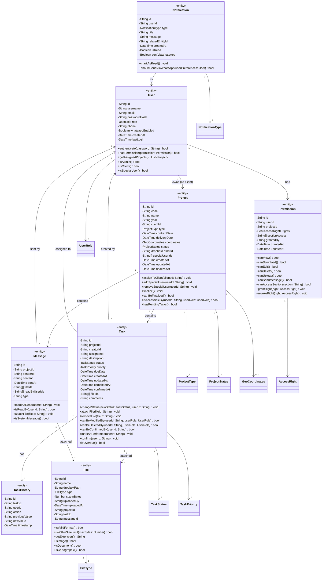
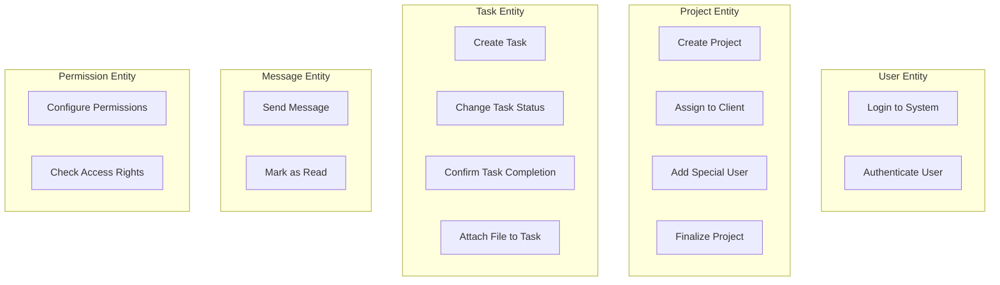

# GLOBAL CONTEXT

**Project:** Cartographic Project Manager (CPM)

**Description:** A web and mobile application for comprehensive management of cartographic projects that facilitates collaboration between an administrator (professional cartographer) and multiple clients simultaneously. The system enables detailed tracking of project status, bidirectional task assignment between administrator and clients with 5 possible states, internal messaging per project with file attachments, calendar view for delivery date management, and technical file sharing through Dropbox integration.

**Architecture:** Layered Architecture with Clean Architecture principles
- **Domain Layer** (current) → Application Layer → Infrastructure Layer → Presentation Layer

**Current module:** Domain Layer - Entities

## File Structure Reference
```
4-CartographicProjectManager/
├── src/
│   ├── domain/
│   │   ├── entities/
│   │   │   ├── index.ts                    # 🎯 TO IMPLEMENT
│   │   │   ├── file.ts                     # 🎯 TO IMPLEMENT
│   │   │   ├── message.ts                  # 🎯 TO IMPLEMENT
│   │   │   ├── notification.ts             # 🎯 TO IMPLEMENT
│   │   │   ├── permission.ts               # 🎯 TO IMPLEMENT
│   │   │   ├── project.ts                  # 🎯 TO IMPLEMENT
│   │   │   ├── task.ts                     # 🎯 TO IMPLEMENT
│   │   │   ├── task-history.ts             # 🎯 TO IMPLEMENT
│   │   │   └── user.ts                     # 🎯 TO IMPLEMENT
│   │   ├── enumerations/
│   │   │   ├── index.ts                    # ✅ Already implemented
│   │   │   ├── access-right.ts             # ✅ Already implemented
│   │   │   ├── file-type.ts                # ✅ Already implemented
│   │   │   ├── notification-type.ts        # ✅ Already implemented
│   │   │   ├── project-status.ts           # ✅ Already implemented
│   │   │   ├── project-type.ts             # ✅ Already implemented
│   │   │   ├── task-priority.ts            # ✅ Already implemented
│   │   │   ├── task-status.ts              # ✅ Already implemented
│   │   │   └── user-role.ts                # ✅ Already implemented
│   │   ├── repositories/
│   │   │   └── ...
│   │   ├── value-objects/
│   │   │   ├── index.ts                    # ✅ Already implemented
│   │   │   └── geo-coordinates.ts          # ✅ Already implemented
│   │   └── index.ts
```

---

# INPUT ARTIFACTS

## 1. Requirements Specification (Summary)

### User Entity (Section 7 & 8)
Users interact with the system based on their assigned role:

| Field | Type | Description | Required |
|-------|------|-------------|----------|
| id | String | Unique identifier | Yes |
| email | String | User email for login | Yes |
| passwordHash | String | Hashed password (bcrypt) | Yes |
| username | String | Display name | Yes |
| role | UserRole | ADMINISTRATOR, CLIENT, or SPECIAL_USER | Yes |
| phone | String | Phone number for WhatsApp notifications | No |
| whatsappEnabled | Boolean | Whether WhatsApp notifications are active | Yes (default: false) |
| createdAt | DateTime | Account creation timestamp | Yes |
| lastLogin | DateTime | Last successful login | No |

### Project Entity (Section 9.1)
Projects are the main organizational unit:

| Field | Type | Description | Required |
|-------|------|-------------|----------|
| id | String | Auto-generated unique identifier | Yes |
| year | Number | Project year (YYYY) | Yes |
| code | String | Project unique identifier code (e.g., CART-2025-001) | Yes |
| name | String | Complete project name | Yes |
| type | ProjectType | Cartographic work category | Yes |
| clientId | String | Reference to assigned client | Yes |
| coordinates | GeoCoordinates | Geographic coordinates (X/Y) | No |
| contractDate | DateTime | Project start date | Yes |
| deliveryDate | DateTime | Completion deadline | Yes |
| status | ProjectStatus | Active / Finalized | Yes (default: ACTIVE) |
| dropboxFolderId | String | Dropbox folder path or ID | Yes |
| specialUserIds | String[] | List of linked special user IDs | No |
| createdAt | DateTime | Record creation timestamp | Yes |
| updatedAt | DateTime | Last modification timestamp | Yes |
| finalizedAt | DateTime | When project was finalized | No |

### Task Entity (Section 10.1)
Tasks support bidirectional assignment between users:

| Field | Type | Description | Required |
|-------|------|-------------|----------|
| id | String | Unique identifier | Yes |
| projectId | String | Reference to parent project | Yes |
| description | String | Task detail to perform | Yes |
| creatorId | String | User who created the task | Yes |
| assigneeId | String | User responsible for execution | Yes |
| status | TaskStatus | PENDING, IN_PROGRESS, PARTIAL, PERFORMED, COMPLETED | Yes |
| priority | TaskPriority | HIGH, MEDIUM, LOW, URGENT | Yes |
| dueDate | DateTime | Maximum delivery deadline | Yes |
| fileIds | String[] | References to attached files | No |
| comments | String | Additional notes | No |
| createdAt | DateTime | When task was created | Yes |
| updatedAt | DateTime | Last modification | Yes |
| completedAt | DateTime | When marked as PERFORMED | No |
| confirmedAt | DateTime | When confirmed as COMPLETED | No |

### Task Status Flow (Section 10.2)
```
[PENDING] ←→ [IN_PROGRESS] ←→ [PARTIAL]
    ↓              ↓              ↓
    └──────────→ [PERFORMED] ←───┘
                     ↓
         [Confirmation by recipient]
                     ↓
               [COMPLETED]
```

### TaskHistory Entity (Section 10)
Records all changes to task status:

| Field | Type | Description | Required |
|-------|------|-------------|----------|
| id | String | Unique identifier | Yes |
| taskId | String | Reference to task | Yes |
| userId | String | User who made the change | Yes |
| action | String | Description of action taken | Yes |
| previousValue | String | Value before change | No |
| newValue | String | Value after change | No |
| timestamp | DateTime | When change occurred | Yes |

### Message Entity (Section 11.1)
Project-specific messaging:

| Field | Type | Description | Required |
|-------|------|-------------|----------|
| id | String | Message unique identifier | Yes |
| projectId | String | Project the message belongs to | Yes |
| senderId | String | User who sent the message | Yes |
| content | String | Message body | Yes |
| fileIds | String[] | References to attached files | No |
| sentAt | DateTime | Exact moment of sending | Yes |
| readByUserIds | String[] | Users who have viewed the message | No |
| type | String | 'NORMAL' or 'SYSTEM' | Yes (default: NORMAL) |

### Notification Entity (Section 13)
System and user notifications:

| Field | Type | Description | Required |
|-------|------|-------------|----------|
| id | String | Notification unique identifier | Yes |
| userId | String | Recipient user | Yes |
| type | NotificationType | Category of notification | Yes |
| title | String | Notification title | Yes |
| message | String | Notification content | Yes |
| relatedEntityId | String | ID of related project/task/message | No |
| createdAt | DateTime | When notification was created | Yes |
| isRead | Boolean | Whether user has seen it | Yes (default: false) |
| sentViaWhatsApp | Boolean | Whether sent via WhatsApp | Yes (default: false) |

### File Entity (Section 12)
File metadata for Dropbox integration:

| Field | Type | Description | Required |
|-------|------|-------------|----------|
| id | String | Unique identifier | Yes |
| name | String | Original filename | Yes |
| dropboxPath | String | Path in Dropbox storage | Yes |
| type | FileType | File category | Yes |
| sizeInBytes | Number | File size | Yes |
| uploadedBy | String | User who uploaded | Yes |
| uploadedAt | DateTime | Upload timestamp | Yes |
| projectId | String | Parent project | Yes |
| taskId | String | Associated task (if any) | No |
| messageId | String | Associated message (if any) | No |

### Permission Entity (Section 8.2)
Configurable permissions for Special Users:

| Field | Type | Description | Required |
|-------|------|-------------|----------|
| id | String | Unique identifier | Yes |
| userId | String | Special user ID | Yes |
| projectId | String | Project ID | Yes |
| rights | Set<AccessRight> | Granted access rights | Yes |
| sectionAccess | String[] | Specific sections accessible | No |
| grantedBy | String | Admin who granted permissions | Yes |
| grantedAt | DateTime | When permissions were set | Yes |
| updatedAt | DateTime | Last modification | Yes |

## 2. Class Diagram (Entities Extract)



## 3. Use Case Diagram (Entity Interactions)



---

# SPECIFIC TASK

Implement all Entity classes for the Domain Layer. Entities are objects with a distinct identity that persists over time and represent the core business concepts of the application.

## Files to implement:

### 1. **user.ts**

**Responsibilities:**
- Represent system users (Administrator, Client, Special User)
- Encapsulate authentication-related data
- Provide role-based identity checks

**Properties:**
| Property | Type | Access | Default |
|----------|------|--------|---------|
| id | string | readonly | - |
| username | string | read/write | - |
| email | string | read/write | - |
| passwordHash | string | private | - |
| role | UserRole | read/write | - |
| phone | string \| null | read/write | null |
| whatsappEnabled | boolean | read/write | false |
| createdAt | Date | readonly | - |
| lastLogin | Date \| null | read/write | null |

**Methods to implement:**

1. **constructor**(props: UserProps)
   - Description: Creates a new User entity
   - Preconditions: Valid email format, non-empty username
   - Postconditions: User instance created with provided properties
   - Exceptions: Throws ValidationError if required fields missing

2. **authenticate**(password: string) → boolean
   - Description: Placeholder for password verification (actual hashing done in service layer)
   - Preconditions: Password is non-empty string
   - Postconditions: Returns true if password matches (delegate to service)
   - Note: Entity should not contain bcrypt logic; this is a domain interface

3. **isAdmin**() → boolean
   - Description: Check if user has Administrator role
   - Postconditions: Returns true if role === UserRole.ADMINISTRATOR

4. **isClient**() → boolean
   - Description: Check if user has Client role
   - Postconditions: Returns true if role === UserRole.CLIENT

5. **isSpecialUser**() → boolean
   - Description: Check if user has Special User role
   - Postconditions: Returns true if role === UserRole.SPECIAL_USER

6. **updateLastLogin**() → void
   - Description: Updates lastLogin to current timestamp
   - Postconditions: lastLogin is set to new Date()

7. **enableWhatsApp**(phone: string) → void
   - Description: Enable WhatsApp notifications with phone number
   - Preconditions: Valid phone number format
   - Postconditions: whatsappEnabled = true, phone is set

8. **disableWhatsApp**() → void
   - Description: Disable WhatsApp notifications
   - Postconditions: whatsappEnabled = false

9. **toJSON**() → object
   - Description: Serialize entity (excluding sensitive data like passwordHash)
   - Postconditions: Returns plain object without passwordHash

---

### 2. **project.ts**

**Responsibilities:**
- Represent cartographic project with all its metadata
- Manage project lifecycle (Active → Finalized)
- Control access permissions and special user assignments
- Track project state for visualization (color coding)

**Properties:**
| Property | Type | Access | Default |
|----------|------|--------|---------|
| id | string | readonly | - |
| code | string | readonly | - |
| name | string | read/write | - |
| year | number | readonly | - |
| clientId | string | read/write | - |
| type | ProjectType | read/write | - |
| coordinates | GeoCoordinates \| null | read/write | null |
| contractDate | Date | read/write | - |
| deliveryDate | Date | read/write | - |
| status | ProjectStatus | read/write | ACTIVE |
| dropboxFolderId | string | read/write | - |
| specialUserIds | string[] | read/write | [] |
| createdAt | Date | readonly | - |
| updatedAt | Date | read/write | - |
| finalizedAt | Date \| null | readonly | null |

**Methods to implement:**

1. **constructor**(props: ProjectProps)
   - Description: Creates a new Project entity
   - Preconditions: Code is unique format, deliveryDate >= contractDate
   - Postconditions: Project instance created
   - Exceptions: Throws ValidationError if dates are invalid

2. **assignToClient**(clientId: string) → void
   - Description: Assign project to a client
   - Preconditions: clientId is non-empty
   - Postconditions: clientId is updated, updatedAt refreshed

3. **addSpecialUser**(userId: string) → void
   - Description: Link a special user to the project
   - Preconditions: userId not already in specialUserIds
   - Postconditions: userId added to specialUserIds array

4. **removeSpecialUser**(userId: string) → void
   - Description: Unlink a special user from the project
   - Preconditions: userId exists in specialUserIds
   - Postconditions: userId removed from specialUserIds array

5. **hasSpecialUser**(userId: string) → boolean
   - Description: Check if a special user is linked
   - Postconditions: Returns true if userId in specialUserIds

6. **finalize**() → void
   - Description: Mark project as finalized
   - Preconditions: canBeFinalized() returns true
   - Postconditions: status = FINALIZED, finalizedAt = now
   - Exceptions: Throws if project cannot be finalized

7. **canBeFinalized**() → boolean
   - Description: Check if project can be finalized (business rule placeholder)
   - Postconditions: Returns true if status is not already FINALIZED

8. **isAccessibleBy**(userId: string, userRole: UserRole) → boolean
   - Description: Check if user can access this project
   - Rules:
     - ADMINISTRATOR: Always true
     - CLIENT: True if userId === clientId
     - SPECIAL_USER: True if userId in specialUserIds
   - Postconditions: Returns boolean based on access rules

9. **isActive**() → boolean
   - Description: Check if project is in active state
   - Postconditions: Returns true if status !== FINALIZED

10. **isOverdue**() → boolean
    - Description: Check if project is past delivery date
    - Postconditions: Returns true if deliveryDate < now and not finalized

11. **daysUntilDelivery**() → number
    - Description: Calculate days remaining until delivery
    - Postconditions: Returns positive/negative number of days

12. **toJSON**() → object
    - Description: Serialize entity for API responses
    - Postconditions: Returns plain object with all properties

---

### 3. **task.ts**

**Responsibilities:**
- Represent tasks with bidirectional assignment
- Manage task status workflow (5 states)
- Handle task priority and deadlines
- Track file attachments
- Enforce permission rules for modification/deletion

**Properties:**
| Property | Type | Access | Default |
|----------|------|--------|---------|
| id | string | readonly | - |
| projectId | string | readonly | - |
| description | string | read/write | - |
| creatorId | string | readonly | - |
| assigneeId | string | read/write | - |
| status | TaskStatus | read/write | PENDING |
| priority | TaskPriority | read/write | MEDIUM |
| dueDate | Date | read/write | - |
| fileIds | string[] | read/write | [] |
| comments | string \| null | read/write | null |
| createdAt | Date | readonly | - |
| updatedAt | Date | read/write | - |
| completedAt | Date \| null | read/write | null |
| confirmedAt | Date \| null | read/write | null |

**Methods to implement:**

1. **constructor**(props: TaskProps)
   - Description: Creates a new Task entity
   - Preconditions: projectId, description, creatorId, assigneeId are valid
   - Postconditions: Task instance created with PENDING status

2. **changeStatus**(newStatus: TaskStatus, userId: string) → void
   - Description: Change task status following valid transitions
   - Preconditions: Transition is valid per state machine
   - Postconditions: status updated, updatedAt refreshed
   - Exceptions: Throws InvalidStatusTransitionError if transition not allowed

3. **isValidStatusTransition**(newStatus: TaskStatus) → boolean
   - Description: Validate if status transition is allowed
   - Rules per state machine diagram
   - Postconditions: Returns boolean

4. **markAsPerformed**(userId: string) → void
   - Description: Mark task as done (awaiting confirmation)
   - Preconditions: User is assignee, status allows transition
   - Postconditions: status = PERFORMED, completedAt = now

5. **confirm**(userId: string) → void
   - Description: Confirm task completion
   - Preconditions: status === PERFORMED, user is task creator (recipient)
   - Postconditions: status = COMPLETED, confirmedAt = now
   - Exceptions: Throws if user cannot confirm

6. **canBeConfirmedBy**(userId: string) → boolean
   - Description: Check if user can confirm this task
   - Rules: Task creator confirms when status is PERFORMED
   - Postconditions: Returns boolean

7. **canBeModifiedBy**(userId: string, userRole: UserRole) → boolean
   - Description: Check if user can modify this task
   - Rules:
     - ADMINISTRATOR: Always true
     - CLIENT: True if task is in their project
     - SPECIAL_USER: False
   - Postconditions: Returns boolean

8. **canBeDeletedBy**(userId: string, userRole: UserRole) → boolean
   - Description: Check if user can delete this task
   - Rules:
     - ADMINISTRATOR: Always true
     - CLIENT: True only if userId === creatorId
     - SPECIAL_USER: False
   - Postconditions: Returns boolean

9. **attachFile**(fileId: string) → void
   - Description: Add file reference to task
   - Preconditions: fileId not already attached
   - Postconditions: fileId added to fileIds array

10. **removeFile**(fileId: string) → void
    - Description: Remove file reference from task
    - Preconditions: fileId exists in fileIds
    - Postconditions: fileId removed from fileIds array

11. **isOverdue**() → boolean
    - Description: Check if task is past due date
    - Postconditions: Returns true if dueDate < now and status not COMPLETED

12. **isPending**() → boolean
    - Description: Check if task needs attention (not completed)
    - Postconditions: Returns true if status !== COMPLETED

13. **toJSON**() → object
    - Description: Serialize entity
    - Postconditions: Returns plain object

---

### 4. **task-history.ts**

**Responsibilities:**
- Record immutable history of task changes
- Provide audit trail for task modifications

**Properties:**
| Property | Type | Access | Default |
|----------|------|--------|---------|
| id | string | readonly | - |
| taskId | string | readonly | - |
| userId | string | readonly | - |
| action | string | readonly | - |
| previousValue | string \| null | readonly | null |
| newValue | string \| null | readonly | null |
| timestamp | Date | readonly | - |

**Methods to implement:**

1. **constructor**(props: TaskHistoryProps)
   - Description: Creates immutable history record
   - Postconditions: All properties set as readonly

2. **static createStatusChange**(taskId: string, userId: string, previousStatus: TaskStatus, newStatus: TaskStatus) → TaskHistory
   - Description: Factory for status change records
   - Postconditions: Returns new TaskHistory with action = 'STATUS_CHANGE'

3. **static createAssigneeChange**(taskId: string, userId: string, previousAssignee: string, newAssignee: string) → TaskHistory
   - Description: Factory for assignee change records
   - Postconditions: Returns new TaskHistory with action = 'ASSIGNEE_CHANGE'

4. **toJSON**() → object
   - Description: Serialize entity
   - Postconditions: Returns plain object

---

### 5. **message.ts**

**Responsibilities:**
- Represent project messages
- Track read status per user
- Support file attachments
- Distinguish between normal and system messages

**Properties:**
| Property | Type | Access | Default |
|----------|------|--------|---------|
| id | string | readonly | - |
| projectId | string | readonly | - |
| senderId | string | readonly | - |
| content | string | read/write | - |
| sentAt | Date | readonly | - |
| fileIds | string[] | read/write | [] |
| readByUserIds | string[] | read/write | [] |
| type | 'NORMAL' \| 'SYSTEM' | readonly | 'NORMAL' |

**Methods to implement:**

1. **constructor**(props: MessageProps)
   - Description: Creates a new Message entity
   - Preconditions: content is non-empty, projectId and senderId valid
   - Postconditions: Message instance created

2. **markAsRead**(userId: string) → void
   - Description: Mark message as read by user
   - Preconditions: userId not already in readByUserIds
   - Postconditions: userId added to readByUserIds

3. **isReadBy**(userId: string) → boolean
   - Description: Check if user has read message
   - Postconditions: Returns true if userId in readByUserIds

4. **attachFile**(fileId: string) → void
   - Description: Add file reference to message
   - Postconditions: fileId added to fileIds array

5. **isSystemMessage**() → boolean
   - Description: Check if message is system-generated
   - Postconditions: Returns true if type === 'SYSTEM'

6. **static createSystemMessage**(projectId: string, content: string) → Message
   - Description: Factory for system messages
   - Postconditions: Returns Message with type = 'SYSTEM', senderId = 'SYSTEM'

7. **toJSON**() → object
   - Description: Serialize entity
   - Postconditions: Returns plain object

---

### 6. **notification.ts**

**Responsibilities:**
- Represent user notifications
- Track read status
- Support WhatsApp delivery tracking

**Properties:**
| Property | Type | Access | Default |
|----------|------|--------|---------|
| id | string | readonly | - |
| userId | string | readonly | - |
| type | NotificationType | readonly | - |
| title | string | readonly | - |
| message | string | readonly | - |
| relatedEntityId | string \| null | readonly | null |
| createdAt | Date | readonly | - |
| isRead | boolean | read/write | false |
| sentViaWhatsApp | boolean | read/write | false |

**Methods to implement:**

1. **constructor**(props: NotificationProps)
   - Description: Creates a new Notification entity
   - Postconditions: Notification instance created with isRead = false

2. **markAsRead**() → void
   - Description: Mark notification as read
   - Postconditions: isRead = true

3. **markAsSentViaWhatsApp**() → void
   - Description: Record WhatsApp delivery
   - Postconditions: sentViaWhatsApp = true

4. **shouldSendViaWhatsApp**(user: User) → boolean
   - Description: Determine if should send via WhatsApp
   - Rules: User has whatsappEnabled and valid phone
   - Postconditions: Returns boolean

5. **static createForNewTask**(userId: string, taskDescription: string, taskId: string) → Notification
   - Description: Factory for new task notification
   - Postconditions: Returns Notification with type = NEW_TASK

6. **static createForNewMessage**(userId: string, projectName: string, projectId: string) → Notification
   - Description: Factory for new message notification
   - Postconditions: Returns Notification with type = NEW_MESSAGE

7. **static createForTaskStatusChange**(userId: string, taskDescription: string, newStatus: TaskStatus, taskId: string) → Notification
   - Description: Factory for task status change notification
   - Postconditions: Returns Notification with type = TASK_STATUS_CHANGE

8. **static createForProjectAssigned**(userId: string, projectCode: string, projectId: string) → Notification
   - Description: Factory for project assignment notification
   - Postconditions: Returns Notification with type = PROJECT_ASSIGNED

9. **toJSON**() → object
   - Description: Serialize entity
   - Postconditions: Returns plain object

---

### 7. **file.ts**

**Responsibilities:**
- Represent file metadata (actual files stored in Dropbox)
- Validate file types and sizes
- Categorize files for UI display

**Properties:**
| Property | Type | Access | Default |
|----------|------|--------|---------|
| id | string | readonly | - |
| name | string | readonly | - |
| dropboxPath | string | readonly | - |
| type | FileType | readonly | - |
| sizeInBytes | number | readonly | - |
| uploadedBy | string | readonly | - |
| uploadedAt | Date | readonly | - |
| projectId | string | readonly | - |
| taskId | string \| null | readonly | null |
| messageId | string \| null | readonly | null |

**Methods to implement:**

1. **constructor**(props: FileProps)
   - Description: Creates a new File entity
   - Preconditions: name, dropboxPath, sizeInBytes valid
   - Postconditions: File instance created

2. **getExtension**() → string
   - Description: Extract file extension from name
   - Postconditions: Returns lowercase extension (e.g., 'pdf', 'kml')

3. **isValidFormat**() → boolean
   - Description: Check if file type is supported
   - Postconditions: Returns true if type is valid FileType

4. **isWithinSizeLimit**(maxBytes: number) → boolean
   - Description: Check if file size is within limit
   - Postconditions: Returns true if sizeInBytes <= maxBytes

5. **isImage**() → boolean
   - Description: Check if file is an image
   - Postconditions: Returns true if type === FileType.IMAGE

6. **isDocument**() → boolean
   - Description: Check if file is a document
   - Postconditions: Returns true if type === FileType.PDF or DOCUMENT

7. **isCartographic**() → boolean
   - Description: Check if file is a cartographic file
   - Postconditions: Returns true if type === FileType.KML or SHP

8. **isSpreadsheet**() → boolean
   - Description: Check if file is a spreadsheet
   - Postconditions: Returns true if type === FileType.SPREADSHEET

9. **getHumanReadableSize**() → string
   - Description: Format size for display
   - Postconditions: Returns formatted string (e.g., '2.5 MB', '500 KB')

10. **static determineFileType**(filename: string) → FileType
    - Description: Determine FileType from filename extension
    - Postconditions: Returns appropriate FileType enum value

11. **toJSON**() → object
    - Description: Serialize entity
    - Postconditions: Returns plain object

---

### 8. **permission.ts**

**Responsibilities:**
- Represent configurable permissions for Special Users
- Manage access rights per project
- Support section-level access control

**Properties:**
| Property | Type | Access | Default |
|----------|------|--------|---------|
| id | string | readonly | - |
| userId | string | readonly | - |
| projectId | string | readonly | - |
| rights | Set<AccessRight> | read/write | new Set() |
| sectionAccess | string[] | read/write | [] (all sections) |
| grantedBy | string | readonly | - |
| grantedAt | Date | readonly | - |
| updatedAt | Date | read/write | - |

**Methods to implement:**

1. **constructor**(props: PermissionProps)
   - Description: Creates a new Permission entity
   - Postconditions: Permission instance created

2. **grantRight**(right: AccessRight) → void
   - Description: Add an access right
   - Postconditions: right added to rights Set, updatedAt refreshed

3. **revokeRight**(right: AccessRight) → void
   - Description: Remove an access right
   - Postconditions: right removed from rights Set, updatedAt refreshed

4. **hasRight**(right: AccessRight) → boolean
   - Description: Check if permission includes right
   - Postconditions: Returns true if right in rights Set

5. **canView**() → boolean
   - Description: Check VIEW right
   - Postconditions: Returns hasRight(AccessRight.VIEW)

6. **canDownload**() → boolean
   - Description: Check DOWNLOAD right
   - Postconditions: Returns hasRight(AccessRight.DOWNLOAD)

7. **canEdit**() → boolean
   - Description: Check EDIT right
   - Postconditions: Returns hasRight(AccessRight.EDIT)

8. **canDelete**() → boolean
   - Description: Check DELETE right
   - Postconditions: Returns hasRight(AccessRight.DELETE)

9. **canUpload**() → boolean
   - Description: Check UPLOAD right
   - Postconditions: Returns hasRight(AccessRight.UPLOAD)

10. **canSendMessage**() → boolean
    - Description: Check SEND_MESSAGE right
    - Postconditions: Returns hasRight(AccessRight.SEND_MESSAGE)

11. **grantSectionAccess**(section: string) → void
    - Description: Grant access to specific section
    - Postconditions: section added to sectionAccess

12. **revokeSectionAccess**(section: string) → void
    - Description: Revoke access to specific section
    - Postconditions: section removed from sectionAccess

13. **canAccessSection**(section: string) → boolean
    - Description: Check if can access specific section
    - Rules: True if sectionAccess is empty (all access) or section in sectionAccess
    - Postconditions: Returns boolean

14. **static createViewOnly**(userId: string, projectId: string, grantedBy: string) → Permission
    - Description: Factory for view-only permission
    - Postconditions: Returns Permission with only VIEW right

15. **static createFullAccess**(userId: string, projectId: string, grantedBy: string) → Permission
    - Description: Factory for full access permission
    - Postconditions: Returns Permission with all rights

16. **toJSON**() → object
    - Description: Serialize entity
    - Postconditions: Returns plain object with rights as array

---

### 9. **index.ts** (Barrel Export)

**Responsibilities:**
- Re-export all entity classes
- Re-export all entity props interfaces
- Provide single entry point for domain entities

---

# CONSTRAINTS AND STANDARDS

## Code:
- **Language:** TypeScript 5.x
- **Code style:** Google TypeScript Style Guide
- **Maximum cyclomatic complexity:** 10
- **Maximum method length:** 50 lines

## Mandatory best practices:
- **SOLID Principles:**
  - Single Responsibility: Each entity handles only its own data and behavior
  - Open/Closed: Entities extensible without modification
  - Liskov Substitution: N/A (no inheritance hierarchy)
  - Interface Segregation: Props interfaces separate from entity classes
  - Dependency Inversion: Entities depend on abstractions (enums, value objects)
- **Input validation:** Validate all constructor inputs
- **Immutability:** Use readonly for identity fields (id, createdAt)
- **Null safety:** Explicit null/undefined handling with proper types

## TypeScript patterns:
```typescript
// Entity Props interface pattern
interface UserProps {
  id: string;
  username: string;
  email: string;
  // ... other properties
}

// Entity class pattern
class User {
  private readonly _id: string;
  private _username: string;
  // ... 
  
  constructor(props: UserProps) {
    this.validateProps(props);
    this._id = props.id;
    // ...
  }
  
  get id(): string {
    return this._id;
  }
  
  // ...
}
```

## Security:
- Never expose passwordHash in toJSON()
- Validate all user inputs in constructors
- Use defensive copying for arrays and objects

---

# DELIVERABLES

1. **Complete source code** for all 9 files (8 entities + 1 index)

2. **For each entity file:**
   - Props interface for constructor parameters
   - Full JSDoc documentation for class and methods
   - Private properties with public getters (and setters where appropriate)
   - Input validation in constructors
   - Factory methods where useful
   - toJSON() method for serialization

3. **Type definitions to include:**
   - Props interfaces for each entity
   - MessageType literal type ('NORMAL' | 'SYSTEM')
   - Project sections constant array

4. **Edge cases to handle:**
   - Null/undefined inputs
   - Empty strings
   - Invalid dates (deliveryDate before contractDate)
   - Invalid status transitions
   - Duplicate entries in arrays (fileIds, specialUserIds)
   - Empty permission rights sets

---

# OUTPUT FORMAT

For each file, provide the complete implementation:

```typescript
// src/domain/entities/user.ts
[Complete code here]
```

```typescript
// src/domain/entities/project.ts
[Complete code here]
```

... (continue for all 9 files)

**Design decisions made:**
- [Decision 1 and justification]
- [Decision 2 and justification]

**Possible future improvements:**
- [Improvement 1]
- [Improvement 2]
