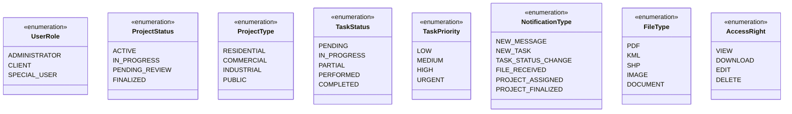
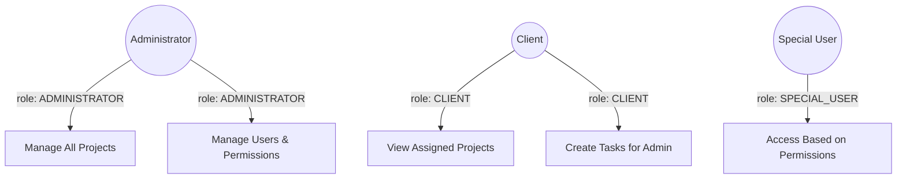

# GLOBAL CONTEXT

**Project:** Cartographic Project Manager (CPM)

**Description:** A web and mobile application for comprehensive management of cartographic projects that facilitates collaboration between an administrator (professional cartographer) and multiple clients simultaneously. The system enables detailed tracking of project status, bidirectional task assignment between administrator and clients with 5 possible states, internal messaging per project with file attachments, calendar view for delivery date management, and technical file sharing through Dropbox integration.

**Architecture:** Layered Architecture with Clean Architecture principles
- **Domain Layer** (current) → Application Layer → Infrastructure Layer → Presentation Layer

**Current module:** Domain Layer - Enumerations

## File Structure Reference
```
src/domain/enumerations/
├── index.ts
├── access-right.ts
├── file-type.ts
├── notification-type.ts
├── project-status.ts
├── project-type.ts
├── task-priority.ts
├── task-status.ts
└── user-role.ts
```

---

# INPUT ARTIFACTS

## 1. Requirements Specification (Summary)

### User Roles (Section 7 & 8)
The system supports three user roles with differentiated permissions:
- **Administrator:** Full control over the application (create projects, manage all tasks, configure permissions, access all data)
- **Client:** Limited to assigned projects only (view own projects, create tasks for admin, modify tasks in their projects, confirm task completion)
- **Special User:** Configurable permissions per project (view only, download, messaging, upload, section access)

### Project Structure (Section 9)
- Projects have a status lifecycle: Active → Finalized
- Project types categorize cartographic work: Residential, Commercial, Industrial, Public
- Each project contains four sections: Report and Annexes, Plans, Specifications, Budget

### Task System (Section 10)
Tasks have 5 possible states with the following flow:
```
[PENDING] ←→ [IN_PROGRESS] ←→ [PARTIAL]
    ↓              ↓              ↓
    └──────────→ [DONE] ←─────────┘
                   ↓
      [Confirmation by recipient]
                   ↓
              [COMPLETED]
```

Task priorities: High, Medium, Low (and optionally Urgent)

### Notification System (Section 13)
Events that generate notifications:
- New message in project
- File received
- Task assigned
- Task status change
- Task confirmed/completed
- Project assigned
- Project finalized
- Project about to expire

### File Management (Section 12)
Supported file categories:
- Documents: PDF, DOC, DOCX, TXT
- Cartography: KML, KMZ, SHP
- Images: JPG, JPEG, PNG, TIFF, GIF
- Spreadsheets: XLS, XLSX, CSV

### Permission System (Section 8.2)
Configurable access rights for Special Users:
- View only
- Download files
- View messages
- Send messages
- View tasks
- Upload files
- Access to specific sections

## 2. Class Diagram (Enumerations Extract)



## 3. Use Case Diagram (Relevant Actors)



---

# SPECIFIC TASK

Implement all enumerations for the Domain Layer. These enumerations define the fixed set of values used throughout the application for type safety and consistency.

## Files to implement:

### 1. **user-role.ts**
**Responsibilities:**
- Define the three user roles in the system
- Provide type safety for role-based access control

**Values:**
| Value | Description |
|-------|-------------|
| `ADMINISTRATOR` | Professional cartographer with full system control |
| `CLIENT` | User with access limited to assigned projects |
| `SPECIAL_USER` | User with configurable permissions per project |

---

### 2. **project-status.ts**
**Responsibilities:**
- Define the lifecycle states of a project
- Support project filtering and visualization (color coding)

**Values:**
| Value | Description | UI Color |
|-------|-------------|----------|
| `ACTIVE` | Project is active and accepting work | Blue |
| `IN_PROGRESS` | Project has tasks being worked on | Blue |
| `PENDING_REVIEW` | Project awaiting review/approval | Yellow |
| `FINALIZED` | Project completed and archived | Gray |

---

### 3. **project-type.ts**
**Responsibilities:**
- Categorize cartographic projects by type
- Support filtering and reporting by project category

**Values:**
| Value | Description |
|-------|-------------|
| `RESIDENTIAL` | Residential urbanization projects |
| `COMMERCIAL` | Commercial property projects |
| `INDUSTRIAL` | Industrial zone projects |
| `PUBLIC` | Public infrastructure projects |

---

### 4. **task-status.ts**
**Responsibilities:**
- Define the 5-state task workflow
- Support task progress tracking and confirmation flow
- Enable status-based filtering and visualization

**Values:**
| Value | Description | Flow Position |
|-------|-------------|---------------|
| `PENDING` | Task created, not yet started | Initial state |
| `IN_PROGRESS` | Task actively being worked on | Optional intermediate |
| `PARTIAL` | Task partially completed | Optional intermediate |
| `PERFORMED` | Task done, awaiting confirmation | Pre-final (was "Done" in requirements) |
| `COMPLETED` | Task confirmed as finished | Final state |

**State Transitions:**
- `PENDING` → `IN_PROGRESS`, `PARTIAL`, `PERFORMED`
- `IN_PROGRESS` → `PENDING`, `PARTIAL`, `PERFORMED`
- `PARTIAL` → `PENDING`, `IN_PROGRESS`, `PERFORMED`
- `PERFORMED` → `COMPLETED` (only by task recipient confirmation)
- `COMPLETED` → (terminal state, no transitions)

---

### 5. **task-priority.ts**
**Responsibilities:**
- Define task priority levels for ordering and visualization
- Support priority-based filtering and sorting

**Values:**
| Value | Description | UI Color | Sort Order |
|-------|-------------|----------|------------|
| `LOW` | Low priority task | Green | 4 |
| `MEDIUM` | Medium priority task | Yellow | 3 |
| `HIGH` | High priority task | Red | 2 |
| `URGENT` | Urgent task requiring immediate attention | Dark Red | 1 |

---

### 6. **notification-type.ts**
**Responsibilities:**
- Categorize notification events for filtering and display
- Support notification icon and message template selection

**Values:**
| Value | Description | Typical Message Template |
|-------|-------------|--------------------------|
| `NEW_MESSAGE` | New message in a project | "New message in {projectName}" |
| `NEW_TASK` | Task assigned to user | "New task: {taskDescription}" |
| `TASK_STATUS_CHANGE` | Task status updated | "Task '{taskDescription}' changed to {status}" |
| `FILE_RECEIVED` | New file uploaded to project | "New file: {fileName}" |
| `PROJECT_ASSIGNED` | Project assigned to client | "You've been assigned to project {projectCode}" |
| `PROJECT_FINALIZED` | Project marked as complete | "Project {projectCode} has been finalized" |

---

### 7. **file-type.ts**
**Responsibilities:**
- Categorize supported file formats
- Support file icon selection and validation
- Group related file extensions

**Values:**
| Value | Description | Extensions |
|-------|-------------|------------|
| `PDF` | PDF documents | .pdf |
| `KML` | Keyhole Markup Language (geographic) | .kml, .kmz |
| `SHP` | Shapefile (cartographic vector) | .shp, .shx, .dbf, .prj |
| `IMAGE` | Image files | .jpg, .jpeg, .png, .tiff, .gif, .webp |
| `DOCUMENT` | Text documents | .doc, .docx, .txt, .rtf |
| `SPREADSHEET` | Spreadsheet files | .xls, .xlsx, .csv |
| `CAD` | CAD drawing files | .dwg, .dxf |
| `COMPRESSED` | Compressed archives | .zip, .rar |

---

### 8. **access-right.ts**
**Responsibilities:**
- Define granular permission rights for Special Users
- Support permission checking in authorization service

**Values:**
| Value | Description |
|-------|-------------|
| `VIEW` | Can view/read content |
| `DOWNLOAD` | Can download files |
| `EDIT` | Can modify/update content |
| `DELETE` | Can remove content |
| `UPLOAD` | Can upload new files |
| `SEND_MESSAGE` | Can send messages in project |

---

### 9. **index.ts** (Barrel Export)
**Responsibilities:**
- Re-export all enumerations for convenient importing
- Provide single entry point for domain enumerations

---

# CONSTRAINTS AND STANDARDS

## Code:
- **Language:** TypeScript 5.x
- **Code style:** Google TypeScript Style Guide
- **Module system:** ES Modules (import/export)

## Mandatory patterns:
- Use `const enum` or regular `enum` based on need (prefer `const enum` for better tree-shaking)
- Include JSDoc comments for each enum and each value
- Export all enums as named exports
- Use UPPER_SNAKE_CASE for enum values
- Use PascalCase for enum names

## TypeScript best practices:
- Enums should be self-documenting with clear value names
- Consider adding helper functions if needed (e.g., `getTaskStatusColor()`)
- Ensure enums are compatible with JSON serialization (string enums preferred for API communication)

## Security:
- Enumerations are read-only by design
- No user input should directly set enum values without validation

---

# DELIVERABLES

1. **Complete source code** for all 8 enumeration files plus the index.ts barrel export

2. **For each enumeration file:**
   - JSDoc documentation for the enum
   - JSDoc documentation for each value
   - String-based enum values for JSON serialization compatibility

3. **Helper utilities** (if beneficial):
   - Type guards (e.g., `isValidTaskStatus()`)
   - Display name mappings (e.g., `TaskStatusDisplayName`)
   - Color mappings for UI (e.g., `TaskPriorityColor`)

4. **Edge cases to handle:**
   - Serialization/deserialization with JSON
   - Comparison operations
   - Iteration over enum values

---

# OUTPUT FORMAT

For each file, provide the complete implementation:

```typescript
// src/domain/enumerations/[filename].ts
[Complete code here]
```

After all files, provide:

**Design decisions made:**
- [Decision 1 and justification]
- [Decision 2 and justification]

**Possible future improvements:**
- [Improvement 1]
- [Improvement 2]
