# GLOBAL CONTEXT

**Project:** Cartographic Project Manager (CPM)

**Description:** A web and mobile application for comprehensive management of cartographic projects that facilitates collaboration between an administrator (professional cartographer) and multiple clients simultaneously. The system enables detailed tracking of project status, bidirectional task assignment between administrator and clients with 5 possible states, internal messaging per project with file attachments, calendar view for delivery date management, and technical file sharing through Dropbox integration.

**Architecture:** Layered Architecture with Clean Architecture principles
- **Domain Layer** (current) → Application Layer → Infrastructure Layer → Presentation Layer

**Current module:** Domain Layer - Repository Interfaces

## File Structure Reference
```
4-CartographicProjectManager/
├── src/
│   ├── domain/
│   │   ├── entities/
│   │   │   ├── index.ts                    # ✅ Already implemented
│   │   │   ├── file.ts                     # ✅ Already implemented
│   │   │   ├── message.ts                  # ✅ Already implemented
│   │   │   ├── notification.ts             # ✅ Already implemented
│   │   │   ├── permission.ts               # ✅ Already implemented
│   │   │   ├── project.ts                  # ✅ Already implemented
│   │   │   ├── task.ts                     # ✅ Already implemented
│   │   │   ├── task-history.ts             # ✅ Already implemented
│   │   │   └── user.ts                     # ✅ Already implemented
│   │   ├── enumerations/
│   │   │   ├── index.ts                    # ✅ Already implemented
│   │   │   ├── access-right.ts             # ✅ Already implemented
│   │   │   ├── file-type.ts                # ✅ Already implemented
│   │   │   ├── notification-type.ts        # ✅ Already implemented
│   │   │   ├── project-status.ts           # ✅ Already implemented
│   │   │   ├── project-type.ts             # ✅ Already implemented
│   │   │   ├── task-priority.ts            # ✅ Already implemented
│   │   │   ├── task-status.ts              # ✅ Already implemented
│   │   │   └── user-role.ts                # ✅ Already implemented
│   │   ├── repositories/
│   │   │   ├── index.ts                    # 🎯 TO IMPLEMENT
│   │   │   ├── file-repository.interface.ts        # 🎯 TO IMPLEMENT
│   │   │   ├── message-repository.interface.ts     # 🎯 TO IMPLEMENT
│   │   │   ├── notification-repository.interface.ts # 🎯 TO IMPLEMENT
│   │   │   ├── permission-repository.interface.ts  # 🎯 TO IMPLEMENT
│   │   │   ├── project-repository.interface.ts     # 🎯 TO IMPLEMENT
│   │   │   ├── task-repository.interface.ts        # 🎯 TO IMPLEMENT
│   │   │   ├── task-history-repository.interface.ts # 🎯 TO IMPLEMENT
│   │   │   └── user-repository.interface.ts        # 🎯 TO IMPLEMENT
│   │   ├── value-objects/
│   │   │   ├── index.ts                    # ✅ Already implemented
│   │   │   └── geo-coordinates.ts          # ✅ Already implemented
│   │   └── index.ts
```

---

# INPUT ARTIFACTS

## 1. Requirements Specification (Summary)

### Data Access Requirements

**User Data Access (Section 7, 8, NFR8):**
- Find users by ID, email, username
- Filter users by role (Administrator, Client, Special User)
- Support authentication queries
- Track last login updates

**Project Data Access (Section 9, FR1-FR6, FR25):**
- CRUD operations for projects
- Find projects by client ID (data isolation per client)
- Find projects by special user ID
- Filter by status (Active, Finalized)
- Filter by year, type, date range
- Support historical queries for finished projects
- Order by delivery date for main screen display

**Task Data Access (Section 10, FR7-FR14):**
- CRUD operations for tasks
- Find tasks by project ID
- Find tasks by assignee ID (user's tasks)
- Find tasks by creator ID
- Filter by status, priority
- Find overdue tasks
- Count pending tasks per project (for color coding)

**Message Data Access (Section 11, FR15-FR17):**
- CRUD operations for messages
- Find messages by project ID
- Count unread messages per project per user
- Support pagination for message history
- Order by sent timestamp

**Notification Data Access (Section 13, FR20-FR21):**
- CRUD operations for notifications
- Find notifications by user ID
- Filter by read/unread status
- Filter by notification type
- Mark notifications as read (single and batch)
- Delete old notifications

**File Data Access (Section 12, FR14, FR16, FR18-FR19):**
- CRUD operations for file metadata
- Find files by project ID
- Find files by task ID
- Find files by message ID
- Filter by file type

**Permission Data Access (Section 8.2, FR26, FR28):**
- CRUD operations for permissions
- Find permission by user ID and project ID
- Find all permissions for a user
- Find all permissions for a project

**Task History Data Access (Section 10, optional):**
- Create history records (append-only)
- Find history by task ID
- Support audit trail queries

### Non-Functional Requirements for Data Access (NFR8, NFR10, NFR11)
- Relational database (PostgreSQL/MySQL)
- Support for 50+ concurrent users
- Response time < 2 seconds for common operations
- Efficient queries with proper indexing considerations

## 2. Class Diagram (Repository Interfaces Extract)

```mermaid
classDiagram
    class IUserRepository {
        <<interface>>
        +findById(id: String) Promise~User | null~
        +findByEmail(email: String) Promise~User | null~
        +findByUsername(username: String) Promise~User | null~
        +save(user: User) Promise~User~
        +update(user: User) Promise~User~
        +delete(id: String) Promise~void~
        +findByRole(role: UserRole) Promise~List~User~~
        +findAll() Promise~List~User~~
        +existsByEmail(email: String) Promise~boolean~
    }

    class IProjectRepository {
        <<interface>>
        +findById(id: String) Promise~Project | null~
        +findByCode(code: String) Promise~Project | null~
        +save(project: Project) Promise~Project~
        +update(project: Project) Promise~Project~
        +delete(id: String) Promise~void~
        +findByClientId(clientId: String) Promise~List~Project~~
        +findBySpecialUserId(userId: String) Promise~List~Project~~
        +findByStatus(status: ProjectStatus) Promise~List~Project~~
        +findAll() Promise~List~Project~~
        +findAllOrderedByDeliveryDate() Promise~List~Project~~
        +existsByCode(code: String) Promise~boolean~
    }

    class ITaskRepository {
        <<interface>>
        +findById(id: String) Promise~Task | null~
        +save(task: Task) Promise~Task~
        +update(task: Task) Promise~Task~
        +delete(id: String) Promise~void~
        +findByProjectId(projectId: String) Promise~List~Task~~
        +findByAssigneeId(userId: String) Promise~List~Task~~
        +findByCreatorId(userId: String) Promise~List~Task~~
        +countPendingByProjectId(projectId: String) Promise~number~
        +findOverdue() Promise~List~Task~~
    }

    class ITaskHistoryRepository {
        <<interface>>
        +save(history: TaskHistory) Promise~TaskHistory~
        +findByTaskId(taskId: String) Promise~List~TaskHistory~~
    }

    class IMessageRepository {
        <<interface>>
        +findById(id: String) Promise~Message | null~
        +save(message: Message) Promise~Message~
        +update(message: Message) Promise~Message~
        +delete(id: String) Promise~void~
        +findByProjectId(projectId: String) Promise~List~Message~~
        +countUnreadByUser(projectId: String, userId: String) Promise~number~
        +findByProjectIdPaginated(projectId: String, limit: number, offset: number) Promise~List~Message~~
    }

    class INotificationRepository {
        <<interface>>
        +findById(id: String) Promise~Notification | null~
        +save(notification: Notification) Promise~Notification~
        +update(notification: Notification) Promise~Notification~
        +delete(id: String) Promise~void~
        +findByUserId(userId: String) Promise~List~Notification~~
        +findUnreadByUserId(userId: String) Promise~List~Notification~~
        +markAsRead(id: String) Promise~void~
        +markAllAsReadByUserId(userId: String) Promise~void~
        +countUnreadByUserId(userId: String) Promise~number~
    }

    class IFileRepository {
        <<interface>>
        +findById(id: String) Promise~File | null~
        +save(file: File) Promise~File~
        +delete(id: String) Promise~void~
        +findByProjectId(projectId: String) Promise~List~File~~
        +findByTaskId(taskId: String) Promise~List~File~~
        +findByMessageId(messageId: String) Promise~List~File~~
        +findByType(type: FileType) Promise~List~File~~
    }

    class IPermissionRepository {
        <<interface>>
        +findById(id: String) Promise~Permission | null~
        +findByUserAndProject(userId: String, projectId: String) Promise~Permission | null~
        +save(permission: Permission) Promise~Permission~
        +update(permission: Permission) Promise~Permission~
        +delete(id: String) Promise~void~
        +deleteByUserAndProject(userId: String, projectId: String) Promise~void~
        +findByUserId(userId: String) Promise~List~Permission~~
        +findByProjectId(projectId: String) Promise~List~Permission~~
    }

    %% Dependencies on Entities
    IUserRepository ..> User
    IProjectRepository ..> Project
    ITaskRepository ..> Task
    ITaskHistoryRepository ..> TaskHistory
    IMessageRepository ..> Message
    INotificationRepository ..> Notification
    IFileRepository ..> File
    IPermissionRepository ..> Permission
```



## 3. Repository Pattern Context

The Repository Pattern provides:
- **Abstraction** over data storage mechanisms
- **Decoupling** of domain layer from infrastructure
- **Testability** through easy mocking
- **Single Responsibility** for data access operations
- **Dependency Inversion** - domain defines interfaces, infrastructure implements

Repository interfaces belong in the **Domain Layer** because:
- They define the contract for data access from the domain's perspective
- Domain services depend on these abstractions
- Infrastructure layer provides concrete implementations
- This follows the Dependency Inversion Principle

---

# SPECIFIC TASK

Implement all Repository Interfaces for the Domain Layer. These interfaces define the contracts for data persistence operations that will be implemented by the Infrastructure Layer.

## Files to implement:

### 1. **user-repository.interface.ts**

**Responsibilities:**
- Define contract for User entity persistence
- Support authentication queries (find by email/username)
- Support role-based filtering
- Enable user existence checks

**Methods to define:**

| Method | Parameters | Return Type | Description |
|--------|------------|-------------|-------------|
| `findById` | id: string | Promise<User \| null> | Find user by unique ID |
| `findByEmail` | email: string | Promise<User \| null> | Find user by email (for login) |
| `findByUsername` | username: string | Promise<User \| null> | Find user by username |
| `save` | user: User | Promise<User> | Create new user |
| `update` | user: User | Promise<User> | Update existing user |
| `delete` | id: string | Promise<void> | Delete user by ID |
| `findByRole` | role: UserRole | Promise<User[]> | Find all users with specific role |
| `findAll` | - | Promise<User[]> | Get all users |
| `existsByEmail` | email: string | Promise<boolean> | Check if email already exists |
| `existsByUsername` | username: string | Promise<boolean> | Check if username already exists |

---

### 2. **project-repository.interface.ts**

**Responsibilities:**
- Define contract for Project entity persistence
- Support client-specific queries (data isolation)
- Support special user project access
- Enable filtering by status, year, type
- Support ordering by delivery date for UI display

**Methods to define:**

| Method | Parameters | Return Type | Description |
|--------|------------|-------------|-------------|
| `findById` | id: string | Promise<Project \| null> | Find project by unique ID |
| `findByCode` | code: string | Promise<Project \| null> | Find project by unique code |
| `save` | project: Project | Promise<Project> | Create new project |
| `update` | project: Project | Promise<Project> | Update existing project |
| `delete` | id: string | Promise<void> | Delete project by ID |
| `findByClientId` | clientId: string | Promise<Project[]> | Find all projects for a client |
| `findBySpecialUserId` | userId: string | Promise<Project[]> | Find projects where user is special user |
| `findByStatus` | status: ProjectStatus | Promise<Project[]> | Filter projects by status |
| `findByYear` | year: number | Promise<Project[]> | Filter projects by year |
| `findByType` | type: ProjectType | Promise<Project[]> | Filter projects by type |
| `findAll` | - | Promise<Project[]> | Get all projects |
| `findAllActive` | - | Promise<Project[]> | Get all non-finalized projects |
| `findAllOrderedByDeliveryDate` | ascending?: boolean | Promise<Project[]> | Get projects ordered by delivery date |
| `findByDeliveryDateRange` | startDate: Date, endDate: Date | Promise<Project[]> | Find projects within date range |
| `existsByCode` | code: string | Promise<boolean> | Check if code already exists |
| `countByClientId` | clientId: string | Promise<number> | Count projects for a client |
| `countByStatus` | status: ProjectStatus | Promise<number> | Count projects by status |

---

### 3. **task-repository.interface.ts**

**Responsibilities:**
- Define contract for Task entity persistence
- Support project-specific queries
- Support user-specific queries (assignee, creator)
- Enable status and priority filtering
- Support overdue task detection
- Count pending tasks for project status calculation

**Methods to define:**

| Method | Parameters | Return Type | Description |
|--------|------------|-------------|-------------|
| `findById` | id: string | Promise<Task \| null> | Find task by unique ID |
| `save` | task: Task | Promise<Task> | Create new task |
| `update` | task: Task | Promise<Task> | Update existing task |
| `delete` | id: string | Promise<void> | Delete task by ID |
| `findByProjectId` | projectId: string | Promise<Task[]> | Find all tasks for a project |
| `findByAssigneeId` | userId: string | Promise<Task[]> | Find tasks assigned to user |
| `findByCreatorId` | userId: string | Promise<Task[]> | Find tasks created by user |
| `findByProjectIdAndStatus` | projectId: string, status: TaskStatus | Promise<Task[]> | Filter project tasks by status |
| `findByProjectIdAndPriority` | projectId: string, priority: TaskPriority | Promise<Task[]> | Filter project tasks by priority |
| `findByAssigneeIdAndStatus` | userId: string, status: TaskStatus | Promise<Task[]> | Filter user's tasks by status |
| `findOverdue` | - | Promise<Task[]> | Find all overdue tasks |
| `findOverdueByProjectId` | projectId: string | Promise<Task[]> | Find overdue tasks in project |
| `findOverdueByAssigneeId` | userId: string | Promise<Task[]> | Find overdue tasks for user |
| `countByProjectId` | projectId: string | Promise<number> | Count all tasks in project |
| `countPendingByProjectId` | projectId: string | Promise<number> | Count non-completed tasks |
| `countByAssigneeId` | userId: string | Promise<number> | Count tasks assigned to user |
| `countPendingByAssigneeId` | userId: string | Promise<number> | Count pending tasks for user |
| `deleteByProjectId` | projectId: string | Promise<void> | Delete all tasks in project |

---

### 4. **task-history-repository.interface.ts**

**Responsibilities:**
- Define contract for TaskHistory entity persistence (append-only)
- Support audit trail queries by task
- No update/delete operations (immutable history)

**Methods to define:**

| Method | Parameters | Return Type | Description |
|--------|------------|-------------|-------------|
| `save` | history: TaskHistory | Promise<TaskHistory> | Create new history record |
| `findByTaskId` | taskId: string | Promise<TaskHistory[]> | Get all history for a task (ordered by timestamp) |
| `findByTaskIdAndAction` | taskId: string, action: string | Promise<TaskHistory[]> | Filter history by action type |
| `findByUserId` | userId: string | Promise<TaskHistory[]> | Find all changes made by user |
| `findByTaskIdPaginated` | taskId: string, limit: number, offset: number | Promise<TaskHistory[]> | Paginated history retrieval |
| `countByTaskId` | taskId: string | Promise<number> | Count history entries for task |
| `deleteByTaskId` | taskId: string | Promise<void> | Delete history when task deleted (cascade) |

---

### 5. **message-repository.interface.ts**

**Responsibilities:**
- Define contract for Message entity persistence
- Support project-specific queries
- Track unread counts per user per project
- Support pagination for message history
- Order by sent timestamp

**Methods to define:**

| Method | Parameters | Return Type | Description |
|--------|------------|-------------|-------------|
| `findById` | id: string | Promise<Message \| null> | Find message by unique ID |
| `save` | message: Message | Promise<Message> | Create new message |
| `update` | message: Message | Promise<Message> | Update message (e.g., mark as read) |
| `delete` | id: string | Promise<void> | Delete message by ID |
| `findByProjectId` | projectId: string | Promise<Message[]> | Find all messages in project (ordered by sentAt) |
| `findByProjectIdPaginated` | projectId: string, limit: number, offset: number | Promise<Message[]> | Paginated messages |
| `findBySenderId` | senderId: string | Promise<Message[]> | Find messages sent by user |
| `findByProjectIdAndSenderId` | projectId: string, senderId: string | Promise<Message[]> | Filter project messages by sender |
| `countByProjectId` | projectId: string | Promise<number> | Count messages in project |
| `countUnreadByProjectAndUser` | projectId: string, userId: string | Promise<number> | Count unread messages for user |
| `findUnreadByProjectAndUser` | projectId: string, userId: string | Promise<Message[]> | Get unread messages for user |
| `markAsReadByProjectAndUser` | projectId: string, userId: string | Promise<void> | Mark all project messages as read |
| `deleteByProjectId` | projectId: string | Promise<void> | Delete all messages in project |
| `findLatestByProjectId` | projectId: string, limit: number | Promise<Message[]> | Get most recent messages |

---

### 6. **notification-repository.interface.ts**

**Responsibilities:**
- Define contract for Notification entity persistence
- Support user-specific queries
- Track read/unread status
- Enable batch operations (mark all as read)
- Support filtering by type

**Methods to define:**

| Method | Parameters | Return Type | Description |
|--------|------------|-------------|-------------|
| `findById` | id: string | Promise<Notification \| null> | Find notification by ID |
| `save` | notification: Notification | Promise<Notification> | Create new notification |
| `update` | notification: Notification | Promise<Notification> | Update notification |
| `delete` | id: string | Promise<void> | Delete notification by ID |
| `findByUserId` | userId: string | Promise<Notification[]> | Find all notifications for user |
| `findByUserIdPaginated` | userId: string, limit: number, offset: number | Promise<Notification[]> | Paginated notifications |
| `findUnreadByUserId` | userId: string | Promise<Notification[]> | Find unread notifications |
| `findByUserIdAndType` | userId: string, type: NotificationType | Promise<Notification[]> | Filter by type |
| `countByUserId` | userId: string | Promise<number> | Count all notifications |
| `countUnreadByUserId` | userId: string | Promise<number> | Count unread notifications |
| `markAsRead` | id: string | Promise<void> | Mark single notification as read |
| `markAllAsReadByUserId` | userId: string | Promise<void> | Mark all user notifications as read |
| `deleteByUserId` | userId: string | Promise<void> | Delete all notifications for user |
| `deleteOlderThan` | date: Date | Promise<void> | Delete old notifications (cleanup) |
| `findByRelatedEntityId` | entityId: string | Promise<Notification[]> | Find notifications for entity |

---

### 7. **file-repository.interface.ts**

**Responsibilities:**
- Define contract for File entity persistence (metadata only, files in Dropbox)
- Support project, task, and message associations
- Enable file type filtering

**Methods to define:**

| Method | Parameters | Return Type | Description |
|--------|------------|-------------|-------------|
| `findById` | id: string | Promise<File \| null> | Find file by ID |
| `save` | file: File | Promise<File> | Create file metadata |
| `delete` | id: string | Promise<void> | Delete file metadata |
| `findByProjectId` | projectId: string | Promise<File[]> | Find all files in project |
| `findByTaskId` | taskId: string | Promise<File[]> | Find files attached to task |
| `findByMessageId` | messageId: string | Promise<File[]> | Find files attached to message |
| `findByProjectIdAndType` | projectId: string, type: FileType | Promise<File[]> | Filter by type |
| `findByUploadedBy` | userId: string | Promise<File[]> | Find files uploaded by user |
| `countByProjectId` | projectId: string | Promise<number> | Count files in project |
| `countByTaskId` | taskId: string | Promise<number> | Count files in task |
| `deleteByProjectId` | projectId: string | Promise<void> | Delete all file records for project |
| `deleteByTaskId` | taskId: string | Promise<void> | Delete file records for task |
| `deleteByMessageId` | messageId: string | Promise<void> | Delete file records for message |
| `findByDropboxPath` | path: string | Promise<File \| null> | Find by Dropbox path |
| `existsByDropboxPath` | path: string | Promise<boolean> | Check if path exists |

---

### 8. **permission-repository.interface.ts**

**Responsibilities:**
- Define contract for Permission entity persistence
- Support user-project permission lookups
- Enable bulk permission queries

**Methods to define:**

| Method | Parameters | Return Type | Description |
|--------|------------|-------------|-------------|
| `findById` | id: string | Promise<Permission \| null> | Find permission by ID |
| `findByUserAndProject` | userId: string, projectId: string | Promise<Permission \| null> | Find specific permission |
| `save` | permission: Permission | Promise<Permission> | Create new permission |
| `update` | permission: Permission | Promise<Permission> | Update permission |
| `delete` | id: string | Promise<void> | Delete permission by ID |
| `deleteByUserAndProject` | userId: string, projectId: string | Promise<void> | Delete specific permission |
| `findByUserId` | userId: string | Promise<Permission[]> | Find all permissions for user |
| `findByProjectId` | projectId: string | Promise<Permission[]> | Find all permissions for project |
| `findByGrantedBy` | adminId: string | Promise<Permission[]> | Find permissions granted by admin |
| `existsByUserAndProject` | userId: string, projectId: string | Promise<boolean> | Check if permission exists |
| `deleteByUserId` | userId: string | Promise<void> | Delete all permissions for user |
| `deleteByProjectId` | projectId: string | Promise<void> | Delete all permissions for project |
| `countByProjectId` | projectId: string | Promise<number> | Count special users in project |
| `countByUserId` | userId: string | Promise<number> | Count projects user has access to |

---

### 9. **index.ts** (Barrel Export)

**Responsibilities:**
- Re-export all repository interfaces
- Provide single entry point for domain repositories

---

# CONSTRAINTS AND STANDARDS

## Code:
- **Language:** TypeScript 5.x
- **Code style:** Google TypeScript Style Guide
- **Pattern:** Repository interfaces with async/Promise-based methods

## Mandatory best practices:
- **Interface Segregation:** Each repository handles only its entity
- **Dependency Inversion:** Interfaces define contracts, not implementations
- **Async/Await:** All methods return Promises for async data access
- **Null safety:** Use `T | null` for single-entity queries that may not find results
- **Consistent naming:** 
  - `findById`, `findByX` for queries returning single or multiple entities
  - `save` for create operations
  - `update` for modification operations
  - `delete` for removal operations
  - `countX` for count operations
  - `existsX` for existence checks

## TypeScript patterns:
```typescript
// Interface naming convention
export interface IUserRepository {
  // Methods...
}

// Import entities from domain layer
import { User } from '../entities/user';
import { UserRole } from '../enumerations/user-role';

// All methods are async
findById(id: string): Promise<User | null>;

// List methods return arrays
findAll(): Promise<User[]>;

// Void methods for operations without return value
delete(id: string): Promise<void>;
```

## Design considerations:
- Interfaces should not include implementation details
- No database-specific types (no SQL, no ORM references)
- No pagination details in interface (use simple limit/offset parameters)
- Sorting preferences as optional parameters where needed

---

# DELIVERABLES

1. **Complete source code** for all 9 files (8 interfaces + 1 index)

2. **For each repository interface file:**
   - JSDoc documentation for interface and all methods
   - Proper imports from domain entities and enumerations
   - Complete method signatures with parameter types and return types
   - Optional parameters where appropriate (e.g., sorting direction)

3. **Consistent patterns across all interfaces:**
   - Standard CRUD methods (findById, save, update, delete)
   - Entity-specific query methods
   - Count methods for statistics
   - Existence check methods where useful
   - Cascade delete methods for related entities

4. **Edge cases to document in JSDoc:**
   - Behavior when entity not found (return null vs throw)
   - Behavior for empty results (return empty array)
   - Cascade delete behavior
   - Ordering guarantees for list methods

---

# OUTPUT FORMAT

For each file, provide the complete implementation:

```typescript
// src/domain/repositories/user-repository.interface.ts
[Complete code here]
```

```typescript
// src/domain/repositories/project-repository.interface.ts
[Complete code here]
```

... (continue for all 9 files)

**Design decisions made:**
- [Decision 1 and justification]
- [Decision 2 and justification]

**Possible future improvements:**
- [Improvement 1]
- [Improvement 2]
