# GLOBAL CONTEXT

**Project:** Cartographic Project Manager (CPM)

**Description:** A web and mobile application for comprehensive management of cartographic projects that facilitates collaboration between an administrator (professional cartographer) and multiple clients simultaneously. The system enables detailed tracking of project status, bidirectional task assignment between administrator and clients with 5 possible states, internal messaging per project with file attachments, calendar view for delivery date management, and technical file sharing through Dropbox integration.

**Architecture:** Layered Architecture with Clean Architecture principles
- Domain Layer → **Application Layer** (current) → Infrastructure Layer → Presentation Layer

**Current module:** Application Layer - Service Interfaces

## File Structure Reference
```
4-CartographicProjectManager/
├── src/
│   ├── application/
│   │   ├── dto/
│   │   │   ├── index.ts                    # ✅ Already implemented
│   │   │   ├── auth-result.dto.ts          # ✅ Already implemented
│   │   │   ├── backup-result.dto.ts        # ✅ Already implemented
│   │   │   ├── export-filters.dto.ts       # ✅ Already implemented
│   │   │   ├── export-result.dto.ts        # ✅ Already implemented
│   │   │   ├── file-data.dto.ts            # ✅ Already implemented
│   │   │   ├── message-data.dto.ts         # ✅ Already implemented
│   │   │   ├── project-data.dto.ts         # ✅ Already implemented
│   │   │   ├── project-details.dto.ts      # ✅ Already implemented
│   │   │   ├── task-data.dto.ts            # ✅ Already implemented
│   │   │   └── validation-result.dto.ts    # ✅ Already implemented
│   │   ├── interfaces/
│   │   │   ├── index.ts                    # 🎯 TO IMPLEMENT
│   │   │   ├── authentication-service.interface.ts   # 🎯 TO IMPLEMENT
│   │   │   ├── authorization-service.interface.ts    # 🎯 TO IMPLEMENT
│   │   │   ├── backup-service.interface.ts           # 🎯 TO IMPLEMENT
│   │   │   ├── export-service.interface.ts           # 🎯 TO IMPLEMENT
│   │   │   ├── file-service.interface.ts             # 🎯 TO IMPLEMENT
│   │   │   ├── message-service.interface.ts          # 🎯 TO IMPLEMENT
│   │   │   ├── notification-service.interface.ts     # 🎯 TO IMPLEMENT
│   │   │   ├── project-service.interface.ts          # 🎯 TO IMPLEMENT
│   │   │   └── task-service.interface.ts             # 🎯 TO IMPLEMENT
│   │   ├── services/
│   │   │   └── ...
│   │   └── index.ts
│   ├── domain/
│   │   ├── entities/                       # ✅ Already implemented
│   │   ├── enumerations/                   # ✅ Already implemented
│   │   ├── repositories/                   # ✅ Already implemented
│   │   ├── value-objects/                  # ✅ Already implemented
│   │   └── index.ts
```

---

# INPUT ARTIFACTS

## 1. Requirements Specification (Summary)

### Authentication Requirements (Section 7, NFR7)
- Login with email/password
- JWT tokens with 24-hour expiration
- Refresh tokens for secure renewal
- Session validation and refresh
- Account lockout after 5 failed attempts
- Automatic session closure after 30 minutes inactivity
- Logout functionality

### Authorization Requirements (Section 8)
**Permission Matrix by Role:**

| Action | Administrator | Client | Special User |
|--------|--------------|--------|--------------|
| Create projects | ✓ | ✗ | ✗ |
| View all projects | ✓ | ✗ (only assigned) | ✗ (only assigned) |
| Edit any project | ✓ | ✗ | ✗ |
| Delete projects | ✓ | ✗ | ✗ |
| Create tasks for others | ✓ | ✓ (only admin) | ✗ |
| View all tasks | ✓ | ✗ (only own projects) | ✗ (only assigned) |
| Modify any task | ✓ | ✓ (in their projects) | ✗ |
| Delete any task | ✓ | ✗ (only own) | ✗ |
| Access all messages | ✓ | ✗ (only their projects) | ✗ (only their projects) |
| Send messages | ✓ | ✓ (in their projects) | Configurable |
| Upload files | ✓ | ✓ (in their projects) | Configurable |
| Download files | ✓ | ✓ (from their projects) | Configurable |
| Configure permissions | ✓ | ✗ | ✗ |
| Mark projects finished | ✓ | ✗ | ✗ |
| Confirm tasks | ✓ | ✓ (assigned to them) | ✗ |
| Export data | ✓ | ✗ | ✗ |

### Project Service Requirements (Section 9, FR1-FR6, FR24-FR25)
- Create projects (admin only)
- Assign projects to clients
- Link special users to projects
- Get projects by user (respecting data isolation)
- Finalize projects (automatic or manual)
- Query finished projects (historical)
- Get project details with tasks, messages, participants

### Task Service Requirements (Section 10, FR7-FR14)
- Create tasks (admin creates for anyone, client creates for admin only)
- Update tasks (respecting permissions)
- Delete tasks (admin any, client only own)
- Change task status (5-state workflow)
- Confirm task completion (bidirectional confirmation)
- Attach files to tasks
- Get tasks by project, assignee, creator

### Message Service Requirements (Section 11, FR15-FR17)
- Send messages to project channel
- Get messages by project (paginated)
- Mark messages as read
- Get unread message count per project
- Attach files to messages

### Notification Service Requirements (Section 13, FR20-FR21)
- Send in-app notifications for events
- Send WhatsApp notifications (optional)
- Get notifications by user
- Mark notifications as read
- Respect user notification preferences

### File Service Requirements (Section 12, FR14, FR16, FR18-FR19)
- Upload files to Dropbox
- Download files from Dropbox
- Validate file format and size
- Delete files
- Generate secure download links

### Export Service Requirements (FR30)
- Export projects to CSV, PDF, Excel
- Export tasks to CSV, PDF, Excel
- Apply filters (date range, client, type, status)

### Backup Service Requirements (NFR14)
- Create manual backups
- Schedule automatic backups
- Restore from backup
- Get backup history

## 2. Class Diagram (Service Interfaces Extract)

```mermaid
classDiagram
    class IAuthenticationService {
        <<interface>>
        +login(credentials: LoginCredentialsDto) Promise~AuthResultDto~
        +logout(userId: string) Promise~void~
        +validateSession(token: string) Promise~SessionDto~
        +refreshSession(refreshToken: string) Promise~AuthResultDto~
        +changePassword(userId: string, oldPassword: string, newPassword: string) Promise~ValidationResultDto~
    }

    class IAuthorizationService {
        <<interface>>
        +canAccessProject(userId: string, projectId: string) Promise~boolean~
        +canModifyProject(userId: string, projectId: string) Promise~boolean~
        +canDeleteProject(userId: string, projectId: string) Promise~boolean~
        +canCreateTask(userId: string, projectId: string) Promise~boolean~
        +canModifyTask(userId: string, taskId: string) Promise~boolean~
        +canDeleteTask(userId: string, taskId: string) Promise~boolean~
        +canConfirmTask(userId: string, taskId: string) Promise~boolean~
        +canAccessMessages(userId: string, projectId: string) Promise~boolean~
        +canSendMessage(userId: string, projectId: string) Promise~boolean~
        +canUploadFile(userId: string, projectId: string) Promise~boolean~
        +canDownloadFile(userId: string, fileId: string) Promise~boolean~
        +getPermissions(userId: string, projectId: string) Promise~Set~AccessRight~~
    }

    class IProjectService {
        <<interface>>
        +createProject(data: CreateProjectDto, creatorId: string) Promise~ProjectDto~
        +updateProject(data: UpdateProjectDto, userId: string) Promise~ProjectDto~
        +deleteProject(projectId: string, userId: string) Promise~void~
        +getProjectById(projectId: string, userId: string) Promise~ProjectDetailsDto~
        +getProjectsByUser(userId: string, filters?: ProjectFilterDto) Promise~ProjectListResponseDto~
        +getAllProjects(filters?: ProjectFilterDto) Promise~ProjectListResponseDto~
        +assignProjectToClient(projectId: string, clientId: string, adminId: string) Promise~void~
        +addSpecialUser(projectId: string, userId: string, permissions: AccessRight[], adminId: string) Promise~void~
        +removeSpecialUser(projectId: string, userId: string, adminId: string) Promise~void~
        +finalizeProject(projectId: string, adminId: string) Promise~void~
        +getProjectsForCalendar(userId: string, startDate: Date, endDate: Date) Promise~CalendarProjectDto[]~
    }

    class ITaskService {
        <<interface>>
        +createTask(data: CreateTaskDto, creatorId: string) Promise~TaskDto~
        +updateTask(data: UpdateTaskDto, userId: string) Promise~TaskDto~
        +deleteTask(taskId: string, userId: string) Promise~void~
        +getTaskById(taskId: string, userId: string) Promise~TaskDto~
        +getTasksByProject(projectId: string, userId: string, filters?: TaskFilterDto) Promise~TaskListResponseDto~
        +getTasksByAssignee(assigneeId: string, filters?: TaskFilterDto) Promise~TaskListResponseDto~
        +changeTaskStatus(data: ChangeTaskStatusDto, userId: string) Promise~TaskDto~
        +confirmTask(data: ConfirmTaskDto, userId: string) Promise~TaskDto~
        +attachFileToTask(taskId: string, fileId: string, userId: string) Promise~void~
        +removeFileFromTask(taskId: string, fileId: string, userId: string) Promise~void~
        +getTaskHistory(taskId: string, userId: string) Promise~TaskHistoryEntryDto[]~
    }

    class IMessageService {
        <<interface>>
        +sendMessage(data: CreateMessageDto, senderId: string) Promise~MessageDto~
        +getMessagesByProject(projectId: string, userId: string, filters?: MessageFilterDto) Promise~MessageListResponseDto~
        +markMessageAsRead(messageId: string, userId: string) Promise~void~
        +markAllMessagesAsRead(projectId: string, userId: string) Promise~void~
        +getUnreadCount(projectId: string, userId: string) Promise~number~
        +getUnreadCountsByUser(userId: string) Promise~UnreadCountsDto[]~
    }

    class INotificationService {
        <<interface>>
        +sendNotification(userId: string, type: NotificationType, title: string, message: string, relatedEntityId?: string) Promise~void~
        +sendBulkNotifications(userIds: string[], type: NotificationType, title: string, message: string, relatedEntityId?: string) Promise~void~
        +getNotificationsByUser(userId: string, filters?: NotificationFilterDto) Promise~NotificationListResponseDto~
        +markAsRead(notificationId: string, userId: string) Promise~void~
        +markAllAsRead(userId: string) Promise~void~
        +getUnreadCount(userId: string) Promise~number~
        +sendViaWhatsApp(userId: string, message: string) Promise~boolean~
    }

    class IFileService {
        <<interface>>
        +uploadFile(data: UploadFileDto, userId: string) Promise~FileUploadResultDto~
        +uploadMultipleFiles(data: BatchUploadDto, userId: string) Promise~BatchUploadResultDto~
        +downloadFile(fileId: string, userId: string) Promise~FileDownloadResultDto~
        +deleteFile(fileId: string, userId: string) Promise~void~
        +getFileById(fileId: string, userId: string) Promise~FileDto~
        +getFilesByProject(projectId: string, userId: string, filters?: FileFilterDto) Promise~FileDto[]~
        +getFilesByTask(taskId: string, userId: string) Promise~FileDto[]~
        +getFilesByMessage(messageId: string, userId: string) Promise~FileDto[]~
        +validateFile(data: UploadFileDto) Promise~ValidationResultDto~
        +generateDownloadUrl(fileId: string, userId: string) Promise~string~
    }

    class IExportService {
        <<interface>>
        +exportProjects(filters: ExportFiltersDto, userId: string) Promise~ExportResultDto~
        +exportTasks(filters: ExportFiltersDto, userId: string) Promise~ExportResultDto~
        +getExportProgress(exportId: string) Promise~ExportProgressDto~
        +cancelExport(exportId: string) Promise~void~
    }

    class IBackupService {
        <<interface>>
        +createBackup(userId: string, description?: string) Promise~BackupResultDto~
        +restoreBackup(data: RestoreBackupDto, userId: string) Promise~RestoreResultDto~
        +getBackupHistory(userId: string) Promise~BackupListResponseDto~
        +getBackupById(backupId: string, userId: string) Promise~BackupInfoDto~
        +deleteBackup(backupId: string, userId: string) Promise~void~
        +scheduleAutomaticBackup(schedule: BackupScheduleDto, userId: string) Promise~void~
        +getBackupSchedule(userId: string) Promise~BackupScheduleDto~
    }

    %% Dependencies
    IProjectService ..> IAuthorizationService : uses
    ITaskService ..> IAuthorizationService : uses
    IMessageService ..> IAuthorizationService : uses
    IFileService ..> IAuthorizationService : uses
    
    IProjectService ..> INotificationService : uses
    ITaskService ..> INotificationService : uses
    IMessageService ..> INotificationService : uses
    
    IFileService ..> IDropboxService : uses
    INotificationService ..> IWhatsAppGateway : uses
```



## 3. Use Case to Service Mapping

| Use Case | Service | Method(s) |
|----------|---------|-----------|
| UC-01: Login | IAuthenticationService | login() |
| UC-02: Logout | IAuthenticationService | logout() |
| UC-03: Create Project | IProjectService | createProject() |
| UC-04: Assign Project to Client | IProjectService | assignProjectToClient() |
| UC-05: Link Special User | IProjectService | addSpecialUser() |
| UC-06: View Assigned Projects | IProjectService | getProjectsByUser() |
| UC-07: Finalize Project | IProjectService | finalizeProject() |
| UC-08: Create Task | ITaskService | createTask() |
| UC-09: Modify Task | ITaskService | updateTask() |
| UC-10: Delete Task | ITaskService | deleteTask() |
| UC-11: Change Task Status | ITaskService | changeTaskStatus() |
| UC-12: Confirm Task | ITaskService | confirmTask() |
| UC-13: Attach File to Task | ITaskService | attachFileToTask() |
| UC-14: Send Message | IMessageService | sendMessage() |
| UC-15: View Messages | IMessageService | getMessagesByProject() |
| UC-16: Mark Message Read | IMessageService | markMessageAsRead() |
| UC-17: Upload File | IFileService | uploadFile() |
| UC-18: Download File | IFileService | downloadFile() |
| UC-19: Receive Notification | INotificationService | getNotificationsByUser() |
| UC-20: Export Data | IExportService | exportProjects(), exportTasks() |
| UC-21: Create Backup | IBackupService | createBackup() |
| UC-22: Restore Backup | IBackupService | restoreBackup() |

---

# SPECIFIC TASK

Implement all Service Interfaces for the Application Layer. These interfaces define the contracts for business logic operations that will be implemented by the Service classes.

## Files to implement:

### 1. **authentication-service.interface.ts**

**Responsibilities:**
- Define contract for user authentication operations
- Handle login, logout, session management
- Support token refresh and validation

**Methods to define:**

| Method | Parameters | Return Type | Description |
|--------|------------|-------------|-------------|
| `login` | credentials: LoginCredentialsDto | Promise<AuthResultDto> | Authenticate user with email/password |
| `logout` | userId: string | Promise<void> | Invalidate user session |
| `validateSession` | token: string | Promise<SessionDto> | Validate JWT token and return session info |
| `refreshSession` | refreshToken: string | Promise<AuthResultDto> | Get new access token using refresh token |
| `changePassword` | userId: string, oldPassword: string, newPassword: string | Promise<ValidationResultDto> | Change user password |
| `requestPasswordReset` | email: string | Promise<void> | Send password reset email |
| `resetPassword` | token: string, newPassword: string | Promise<ValidationResultDto> | Reset password with token |
| `getFailedLoginAttempts` | email: string | Promise<number> | Get failed login count for lockout check |
| `clearFailedLoginAttempts` | email: string | Promise<void> | Clear failed attempts after successful login |

**Behavior specifications:**
- `login`: Return error with ACCOUNT_LOCKED if >= 5 failed attempts
- `validateSession`: Return isValid=false if token expired
- `refreshSession`: Return error if refresh token is invalid/expired

---

### 2. **authorization-service.interface.ts**

**Responsibilities:**
- Define contract for permission checking
- Implement role-based access control (RBAC)
- Support configurable permissions for Special Users

**Methods to define:**

| Method | Parameters | Return Type | Description |
|--------|------------|-------------|-------------|
| `canAccessProject` | userId: string, projectId: string | Promise<boolean> | Check if user can view project |
| `canModifyProject` | userId: string, projectId: string | Promise<boolean> | Check if user can edit project |
| `canDeleteProject` | userId: string, projectId: string | Promise<boolean> | Check if user can delete project |
| `canFinalizeProject` | userId: string, projectId: string | Promise<boolean> | Check if user can finalize project |
| `canCreateTaskInProject` | userId: string, projectId: string | Promise<boolean> | Check if user can create task |
| `canAssignTaskTo` | userId: string, projectId: string, assigneeId: string | Promise<boolean> | Check if user can assign task to specific user |
| `canModifyTask` | userId: string, taskId: string | Promise<boolean> | Check if user can edit task |
| `canDeleteTask` | userId: string, taskId: string | Promise<boolean> | Check if user can delete task |
| `canChangeTaskStatus` | userId: string, taskId: string, newStatus: TaskStatus | Promise<boolean> | Check if user can change to specific status |
| `canConfirmTask` | userId: string, taskId: string | Promise<boolean> | Check if user can confirm task completion |
| `canAccessMessages` | userId: string, projectId: string | Promise<boolean> | Check if user can view messages |
| `canSendMessage` | userId: string, projectId: string | Promise<boolean> | Check if user can send messages |
| `canUploadFile` | userId: string, projectId: string | Promise<boolean> | Check if user can upload files |
| `canDownloadFile` | userId: string, fileId: string | Promise<boolean> | Check if user can download file |
| `canDeleteFile` | userId: string, fileId: string | Promise<boolean> | Check if user can delete file |
| `canManageProjectParticipants` | userId: string, projectId: string | Promise<boolean> | Check if user can add/remove participants |
| `canExportData` | userId: string | Promise<boolean> | Check if user can export data |
| `canManageBackups` | userId: string | Promise<boolean> | Check if user can manage backups |
| `getProjectPermissions` | userId: string, projectId: string | Promise<Set<AccessRight>> | Get all permissions for user on project |
| `getUserRole` | userId: string | Promise<UserRole> | Get user's role |
| `isAdmin` | userId: string | Promise<boolean> | Check if user is administrator |

**Behavior specifications:**
- Administrator always returns true for all permissions
- Client returns true only for assigned projects
- Special User returns based on configured permissions

---

### 3. **project-service.interface.ts**

**Responsibilities:**
- Define contract for project CRUD operations
- Handle project assignment and participant management
- Support project finalization and historical queries

**Methods to define:**

| Method | Parameters | Return Type | Description |
|--------|------------|-------------|-------------|
| `createProject` | data: CreateProjectDto, creatorId: string | Promise<ProjectDto> | Create new project (admin only) |
| `updateProject` | data: UpdateProjectDto, userId: string | Promise<ProjectDto> | Update project details |
| `deleteProject` | projectId: string, userId: string | Promise<void> | Delete project and all related data |
| `getProjectById` | projectId: string, userId: string | Promise<ProjectDetailsDto> | Get full project details |
| `getProjectSummary` | projectId: string, userId: string | Promise<ProjectSummaryDto> | Get project summary for list view |
| `getProjectsByUser` | userId: string, filters?: ProjectFilterDto | Promise<ProjectListResponseDto> | Get projects accessible by user |
| `getAllProjects` | filters?: ProjectFilterDto | Promise<ProjectListResponseDto> | Get all projects (admin only) |
| `getActiveProjects` | userId: string | Promise<ProjectSummaryDto[]> | Get active projects for dashboard |
| `getProjectsForCalendar` | userId: string, startDate: Date, endDate: Date | Promise<CalendarProjectDto[]> | Get projects for calendar view |
| `assignProjectToClient` | projectId: string, clientId: string, adminId: string | Promise<void> | Assign project to client |
| `addSpecialUser` | projectId: string, userId: string, permissions: AccessRight[], adminId: string | Promise<void> | Add special user to project |
| `removeSpecialUser` | projectId: string, userId: string, adminId: string | Promise<void> | Remove special user from project |
| `updateSpecialUserPermissions` | projectId: string, userId: string, permissions: AccessRight[], adminId: string | Promise<void> | Update special user permissions |
| `getProjectParticipants` | projectId: string, userId: string | Promise<ParticipantDto[]> | Get all project participants |
| `finalizeProject` | projectId: string, adminId: string | Promise<void> | Mark project as finalized |
| `reopenProject` | projectId: string, adminId: string | Promise<void> | Reopen finalized project |
| `checkProjectCodeExists` | code: string | Promise<boolean> | Check if project code is unique |
| `validateProjectData` | data: CreateProjectDto \| UpdateProjectDto | Promise<ValidationResultDto> | Validate project data |

**Behavior specifications:**
- `createProject`: Validate unique code, create Dropbox folder, notify client
- `deleteProject`: Delete all tasks, messages, files, permissions
- `getProjectsByUser`: Apply data isolation based on user role
- `finalizeProject`: Check no pending tasks, update status

---

### 4. **task-service.interface.ts**

**Responsibilities:**
- Define contract for task CRUD operations
- Handle bidirectional task assignment
- Manage 5-state task workflow
- Support task confirmation flow

**Methods to define:**

| Method | Parameters | Return Type | Description |
|--------|------------|-------------|-------------|
| `createTask` | data: CreateTaskDto, creatorId: string | Promise<TaskDto> | Create new task |
| `updateTask` | data: UpdateTaskDto, userId: string | Promise<TaskDto> | Update task details |
| `deleteTask` | taskId: string, userId: string | Promise<void> | Delete task |
| `getTaskById` | taskId: string, userId: string | Promise<TaskDto> | Get full task details |
| `getTasksByProject` | projectId: string, userId: string, filters?: TaskFilterDto | Promise<TaskListResponseDto> | Get tasks for project |
| `getTasksByAssignee` | assigneeId: string, filters?: TaskFilterDto | Promise<TaskListResponseDto> | Get tasks assigned to user |
| `getTasksByCreator` | creatorId: string, filters?: TaskFilterDto | Promise<TaskListResponseDto> | Get tasks created by user |
| `getOverdueTasks` | userId: string | Promise<TaskSummaryDto[]> | Get overdue tasks for user |
| `getPendingTasksCount` | projectId: string | Promise<number> | Get pending tasks count for project status |
| `changeTaskStatus` | data: ChangeTaskStatusDto, userId: string | Promise<TaskDto> | Change task status |
| `confirmTask` | data: ConfirmTaskDto, userId: string | Promise<TaskDto> | Confirm or reject completed task |
| `attachFileToTask` | taskId: string, fileId: string, userId: string | Promise<void> | Attach file to task |
| `removeFileFromTask` | taskId: string, fileId: string, userId: string | Promise<void> | Remove file from task |
| `getTaskHistory` | taskId: string, userId: string | Promise<TaskHistoryEntryDto[]> | Get task change history |
| `getValidStatusTransitions` | taskId: string, userId: string | Promise<TaskStatus[]> | Get allowed status transitions |
| `validateTaskData` | data: CreateTaskDto \| UpdateTaskDto | Promise<ValidationResultDto> | Validate task data |

**Behavior specifications:**
- `createTask`: 
  - Admin can assign to any user
  - Client can only assign to Admin
  - Notify assignee
- `changeTaskStatus`:
  - Validate transition is allowed per state machine
  - Record in task history
  - Notify relevant users
- `confirmTask`:
  - Only task creator can confirm
  - Only when status is PERFORMED
  - Changes status to COMPLETED

---

### 5. **message-service.interface.ts**

**Responsibilities:**
- Define contract for project messaging
- Handle message sending and retrieval
- Track read status per user
- Support file attachments

**Methods to define:**

| Method | Parameters | Return Type | Description |
|--------|------------|-------------|-------------|
| `sendMessage` | data: CreateMessageDto, senderId: string | Promise<MessageDto> | Send message to project |
| `getMessageById` | messageId: string, userId: string | Promise<MessageDto> | Get single message |
| `getMessagesByProject` | projectId: string, userId: string, filters?: MessageFilterDto | Promise<MessageListResponseDto> | Get project messages (paginated) |
| `getLatestMessages` | projectId: string, userId: string, limit: number | Promise<MessageDto[]> | Get most recent messages |
| `markMessageAsRead` | messageId: string, userId: string | Promise<void> | Mark single message as read |
| `markAllMessagesAsRead` | projectId: string, userId: string | Promise<void> | Mark all project messages as read |
| `getUnreadCount` | projectId: string, userId: string | Promise<number> | Get unread count for project |
| `getUnreadCountsByUser` | userId: string | Promise<UnreadCountsDto[]> | Get unread counts for all user's projects |
| `deleteMessage` | messageId: string, userId: string | Promise<void> | Delete message (admin only) |
| `createSystemMessage` | projectId: string, content: string | Promise<MessageDto> | Create system-generated message |

**Behavior specifications:**
- `sendMessage`:
  - Validate user can send in project
  - Create message record
  - Notify all project participants except sender
  - Upload attachments to Dropbox
- `getMessagesByProject`:
  - Auto-mark retrieved messages as read
  - Order by sentAt descending

---

### 6. **notification-service.interface.ts**

**Responsibilities:**
- Define contract for notification management
- Handle in-app and WhatsApp notifications
- Respect user notification preferences

**Methods to define:**

| Method | Parameters | Return Type | Description |
|--------|------------|-------------|-------------|
| `sendNotification` | userId: string, type: NotificationType, title: string, message: string, relatedEntityId?: string | Promise<void> | Send notification to user |
| `sendBulkNotifications` | userIds: string[], type: NotificationType, title: string, message: string, relatedEntityId?: string | Promise<void> | Send notification to multiple users |
| `getNotificationsByUser` | userId: string, filters?: NotificationFilterDto | Promise<NotificationListResponseDto> | Get user notifications |
| `getUnreadNotifications` | userId: string | Promise<NotificationDto[]> | Get unread notifications |
| `getUnreadCount` | userId: string | Promise<number> | Get unread notification count |
| `markAsRead` | notificationId: string, userId: string | Promise<void> | Mark notification as read |
| `markAllAsRead` | userId: string | Promise<void> | Mark all notifications as read |
| `deleteNotification` | notificationId: string, userId: string | Promise<void> | Delete notification |
| `deleteOldNotifications` | olderThanDays: number | Promise<number> | Clean up old notifications |
| `sendViaWhatsApp` | userId: string, message: string | Promise<boolean> | Send WhatsApp message |
| `shouldSendWhatsApp` | userId: string, notificationType: NotificationType | Promise<boolean> | Check if should send WhatsApp |
| `getUserNotificationPreferences` | userId: string | Promise<NotificationPreferencesDto> | Get user preferences |
| `updateUserNotificationPreferences` | userId: string, preferences: NotificationPreferencesDto | Promise<void> | Update user preferences |

**Notification type templates:**

```typescript
interface NotificationPreferencesDto {
  inAppEnabled: boolean;
  whatsAppEnabled: boolean;
  notifyNewMessages: boolean;
  notifyReceivedFiles: boolean;
  notifyAssignedTasks: boolean;
  notifyTaskStatusChanges: boolean;
  notifyDeadlineReminders: boolean;
}
```

**Behavior specifications:**
- Check user preferences before sending
- WhatsApp rate limit: max 1 per 30 minutes per project
- Create in-app notification even if WhatsApp fails

---

### 7. **file-service.interface.ts**

**Responsibilities:**
- Define contract for file operations
- Handle Dropbox integration
- Validate file types and sizes
- Generate secure download URLs

**Methods to define:**

| Method | Parameters | Return Type | Description |
|--------|------------|-------------|-------------|
| `uploadFile` | data: UploadFileDto, userId: string | Promise<FileUploadResultDto> | Upload file to Dropbox |
| `uploadMultipleFiles` | data: BatchUploadDto, userId: string | Promise<BatchUploadResultDto> | Upload multiple files |
| `downloadFile` | fileId: string, userId: string | Promise<FileDownloadResultDto> | Download file from Dropbox |
| `deleteFile` | fileId: string, userId: string | Promise<void> | Delete file from Dropbox and DB |
| `getFileById` | fileId: string, userId: string | Promise<FileDto> | Get file metadata |
| `getFilesByProject` | projectId: string, userId: string, filters?: FileFilterDto | Promise<FileDto[]> | Get project files |
| `getFilesBySection` | projectId: string, section: ProjectSection, userId: string | Promise<FileDto[]> | Get files by section |
| `getFilesByTask` | taskId: string, userId: string | Promise<FileDto[]> | Get task attachments |
| `getFilesByMessage` | messageId: string, userId: string | Promise<FileDto[]> | Get message attachments |
| `validateFile` | data: UploadFileDto | Promise<ValidationResultDto> | Validate file before upload |
| `generateDownloadUrl` | fileId: string, userId: string, expiresInSeconds?: number | Promise<string> | Generate temporary download URL |
| `generatePreviewUrl` | fileId: string, userId: string | Promise<string \| null> | Generate preview URL for images |
| `getFileSizeLimit` | - | number | Get max file size in bytes |
| `getSupportedFormats` | - | string[] | Get list of supported formats |
| `moveFile` | fileId: string, newSection: ProjectSection, userId: string | Promise<void> | Move file to different section |

**Behavior specifications:**
- `uploadFile`:
  - Validate format and size (max 50MB)
  - Upload to Dropbox
  - Create file metadata record
  - Notify project participants
- `downloadFile`:
  - Check user permissions
  - Get file from Dropbox
- `validateFile`:
  - Check format against whitelist
  - Check size limit
  - Return validation errors

---

### 8. **export-service.interface.ts**

**Responsibilities:**
- Define contract for data export operations
- Support multiple output formats (CSV, PDF, Excel)
- Handle large exports asynchronously

**Methods to define:**

| Method | Parameters | Return Type | Description |
|--------|------------|-------------|-------------|
| `exportProjects` | filters: ExportFiltersDto, userId: string | Promise<ExportResultDto> | Export projects data |
| `exportTasks` | filters: ExportFiltersDto, userId: string | Promise<ExportResultDto> | Export tasks data |
| `exportProjectReport` | projectId: string, userId: string, format: ExportFormat | Promise<ExportResultDto> | Export single project full report |
| `getExportProgress` | exportId: string | Promise<ExportProgressDto> | Get async export progress |
| `cancelExport` | exportId: string | Promise<void> | Cancel running export |
| `getExportHistory` | userId: string | Promise<ExportInfoDto[]> | Get user's export history |
| `deleteExport` | exportId: string, userId: string | Promise<void> | Delete export file |
| `validateExportFilters` | filters: ExportFiltersDto | Promise<ValidationResultDto> | Validate export filters |

**Behavior specifications:**
- Admin only operation
- Small exports (<1000 records): synchronous
- Large exports: asynchronous with progress tracking
- Export files expire after 24 hours

---

### 9. **backup-service.interface.ts**

**Responsibilities:**
- Define contract for backup and restore operations
- Support scheduled and manual backups
- Handle point-in-time restoration

**Methods to define:**

| Method | Parameters | Return Type | Description |
|--------|------------|-------------|-------------|
| `createBackup` | userId: string, description?: string | Promise<BackupResultDto> | Create manual backup |
| `restoreBackup` | data: RestoreBackupDto, userId: string | Promise<RestoreResultDto> | Restore from backup |
| `getBackupHistory` | userId: string | Promise<BackupListResponseDto> | Get list of backups |
| `getBackupById` | backupId: string, userId: string | Promise<BackupInfoDto> | Get backup details |
| `deleteBackup` | backupId: string, userId: string | Promise<void> | Delete backup |
| `scheduleAutomaticBackup` | schedule: BackupScheduleDto, userId: string | Promise<void> | Configure auto backup |
| `getBackupSchedule` | userId: string | Promise<BackupScheduleDto> | Get current schedule |
| `disableAutomaticBackup` | userId: string | Promise<void> | Disable scheduled backups |
| `getStorageUsage` | userId: string | Promise<StorageUsageDto> | Get backup storage usage |
| `validateBackup` | backupId: string | Promise<ValidationResultDto> | Validate backup integrity |

**Additional types:**

```typescript
interface StorageUsageDto {
  usedBytes: number;
  limitBytes: number;
  usedPercentage: number;
  backupCount: number;
}
```

**Behavior specifications:**
- Admin only operation
- Cannot restore while backup in progress
- Automatic backups run daily at configured time
- Keep backups for configured retention period

---

### 10. **index.ts** (Barrel Export)

**Responsibilities:**
- Re-export all service interfaces
- Provide single entry point for application interfaces

---

# CONSTRAINTS AND STANDARDS

## Code:
- **Language:** TypeScript 5.x
- **Code style:** Google TypeScript Style Guide
- **Pattern:** Interface-based contracts for dependency injection

## Mandatory best practices:
- **Interface Segregation:** Each interface handles a single domain concern
- **Dependency Inversion:** Services depend on interfaces, not implementations
- **Async/Await:** All methods return Promises
- **Documentation:** JSDoc on all interfaces and methods
- **Naming conventions:**
  - Interface names: `I{ServiceName}Service`
  - Method names: verb + noun (e.g., `createProject`, `getTaskById`)

## TypeScript patterns:
```typescript
import { 
  CreateProjectDto, 
  ProjectDto, 
  ProjectDetailsDto,
  ProjectFilterDto,
  ProjectListResponseDto,
  ValidationResultDto 
} from '../dto';
import { AccessRight } from '../../domain/enumerations';

/**
 * Service interface for project management operations.
 * Handles CRUD operations, participant management, and project lifecycle.
 */
export interface IProjectService {
  /**
   * Creates a new cartographic project.
   * @param data - Project creation data
   * @param creatorId - ID of the admin creating the project
   * @returns Created project details
   * @throws UnauthorizedError if creator is not admin
   * @throws ValidationError if data is invalid
   */
  createProject(data: CreateProjectDto, creatorId: string): Promise<ProjectDto>;
  
  // ... more methods
}
```

## Design considerations:
- Interfaces define WHAT, not HOW
- No implementation details in interfaces
- All methods include userId for authorization
- Filter DTOs have optional fields with sensible defaults
- Return DTOs, not domain entities (separation of concerns)

---

# DELIVERABLES

1. **Complete source code** for all 10 files (9 interfaces + 1 index)

2. **For each service interface file:**
   - Proper imports from DTOs and domain enumerations
   - Complete JSDoc documentation for interface and all methods
   - Parameter and return type definitions
   - @throws documentation for expected errors

3. **Consistent patterns across all interfaces:**
   - CRUD methods: create, update, delete, getById, getByX
   - Filter methods accept optional filter DTO
   - Batch operations where applicable
   - Validation methods for complex inputs
   - userId parameter for authorization context

4. **Additional types to define:**
   - NotificationFilterDto
   - NotificationListResponseDto
   - NotificationDto
   - NotificationPreferencesDto
   - ExportInfoDto
   - StorageUsageDto

---

# OUTPUT FORMAT

For each file, provide the complete implementation:

```typescript
// src/application/interfaces/authentication-service.interface.ts
[Complete code here]
```

```typescript
// src/application/interfaces/authorization-service.interface.ts
[Complete code here]
```

... (continue for all 10 files)

**Design decisions made:**
- [Decision 1 and justification]
- [Decision 2 and justification]

**Possible future improvements:**
- [Improvement 1]
- [Improvement 2]
