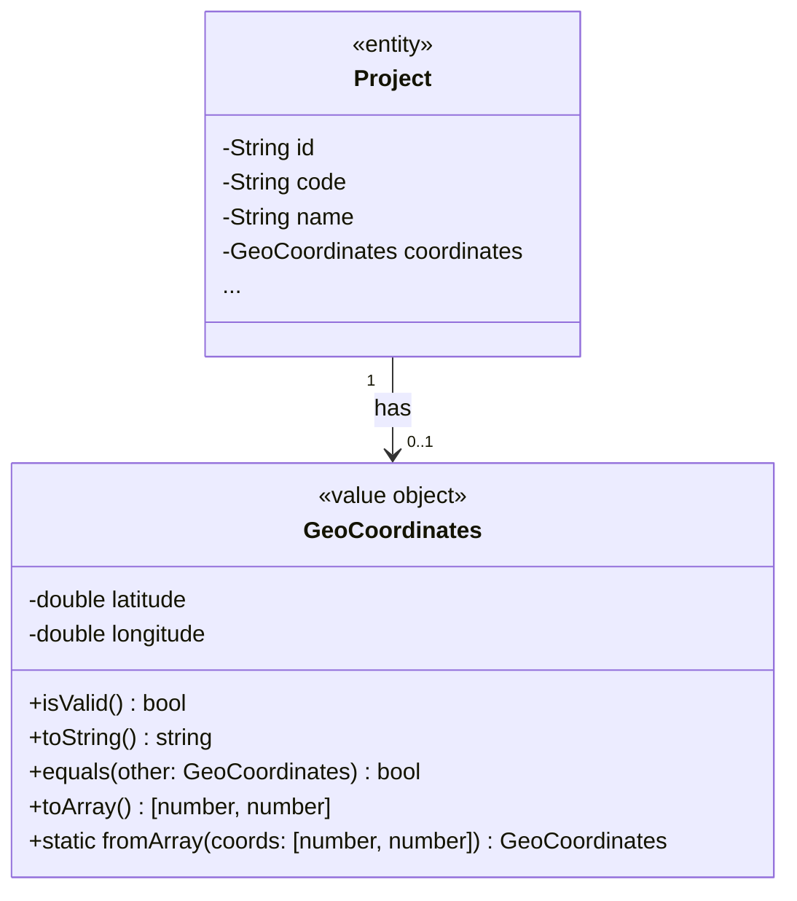

# GLOBAL CONTEXT

**Project:** Cartographic Project Manager (CPM)

**Description:** A web and mobile application for comprehensive management of cartographic projects that facilitates collaboration between an administrator (professional cartographer) and multiple clients simultaneously. The system enables detailed tracking of project status, bidirectional task assignment between administrator and clients with 5 possible states, internal messaging per project with file attachments, calendar view for delivery date management, and technical file sharing through Dropbox integration.

**Architecture:** Layered Architecture with Clean Architecture principles
- **Domain Layer** (current) → Application Layer → Infrastructure Layer → Presentation Layer

**Current module:** Domain Layer - Value Objects

## File Structure Reference
```
4-CartographicProjectManager/
├── src/
│   ├── domain/
│   │   ├── entities/
│   │   │   ├── index.ts
│   │   │   ├── file.ts
│   │   │   ├── message.ts
│   │   │   ├── notification.ts
│   │   │   ├── permission.ts
│   │   │   ├── project.ts
│   │   │   ├── task.ts
│   │   │   ├── task-history.ts
│   │   │   └── user.ts
│   │   ├── enumerations/
│   │   │   ├── index.ts                    # ✅ Already implemented
│   │   │   ├── access-right.ts             # ✅ Already implemented
│   │   │   ├── file-type.ts                # ✅ Already implemented
│   │   │   ├── notification-type.ts        # ✅ Already implemented
│   │   │   ├── project-status.ts           # ✅ Already implemented
│   │   │   ├── project-type.ts             # ✅ Already implemented
│   │   │   ├── task-priority.ts            # ✅ Already implemented
│   │   │   ├── task-status.ts              # ✅ Already implemented
│   │   │   └── user-role.ts                # ✅ Already implemented
│   │   ├── repositories/
│   │   │   ├── index.ts
│   │   │   ├── file-repository.interface.ts
│   │   │   ├── message-repository.interface.ts
│   │   │   ├── notification-repository.interface.ts
│   │   │   ├── permission-repository.interface.ts
│   │   │   ├── project-repository.interface.ts
│   │   │   ├── task-repository.interface.ts
│   │   │   ├── task-history-repository.interface.ts
│   │   │   └── user-repository.interface.ts
│   │   ├── value-objects/
│   │   │   ├── index.ts                    # 🎯 TO IMPLEMENT
│   │   │   └── geo-coordinates.ts          # 🎯 TO IMPLEMENT
│   │   └── index.ts
```

---

# INPUT ARTIFACTS

## 1. Requirements Specification (Summary)

### Project Geographic Data (Section 9.1)
Each cartographic project includes geographic coordinates for location reference:

| Field | Type | Description | Required |
|-------|------|-------------|----------|
| **Coordinate X** | Numeric | Geographic coordinate X (longitude) | No |
| **Coordinate Y** | Numeric | Geographic coordinate Y (latitude) | No |

### Project Information Context
From the requirements specification, the project entity includes:
- Geographic coordinates (X/Y) to identify the physical location of cartographic work
- Coordinates are optional but when provided must be valid
- Used for referencing the project's physical location on maps
- Typical coordinate systems: UTM, WGS84 (latitude/longitude)

### Main Screen Visualization (Section 14.3)
The detailed project view displays:
```
GENERAL INFORMATION
Client: John Pérez
Type: Urbanization
Coordinates: X: 123456.78  Y: 987654.32    ← Displayed as formatted pair
Contract: 09/01/2025  |  Delivery: 12/15/2025
Status: Active
```

## 2. Class Diagram (Value Objects Extract)



## 3. Value Object Characteristics

According to Domain-Driven Design principles, Value Objects:
- Are **immutable** - once created, they cannot be changed
- Have **no identity** - equality is based on all attributes, not an ID
- Are **self-validating** - invalid states should be impossible
- Are **replaceable** - to change, create a new instance
- Represent **descriptive aspects** of the domain

---

# SPECIFIC TASK

Implement the Value Object for the Domain Layer. Value Objects encapsulate domain concepts that are defined by their attributes rather than identity.

## Files to implement:

### 1. **geo-coordinates.ts**

**Responsibilities:**
- Encapsulate geographic coordinates (latitude/longitude or X/Y)
- Ensure immutability of coordinate values
- Validate coordinate ranges
- Provide formatting utilities for display
- Support equality comparison based on values
- Enable serialization/deserialization

**Properties:**
| Property | Type | Description | Constraints |
|----------|------|-------------|-------------|
| `latitude` | number | Y coordinate (latitude) | -90 to +90 degrees (WGS84) |
| `longitude` | number | X coordinate (longitude) | -180 to +180 degrees (WGS84) |

**Note:** The requirements refer to "Coordinate X" and "Coordinate Y". In standard geographic convention:
- X = Longitude (East-West position)
- Y = Latitude (North-South position)

The value object should support both naming conventions for compatibility.

**Methods to implement:**

1. **constructor**(latitude: number, longitude: number)
   - Description: Creates a new immutable GeoCoordinates instance
   - Preconditions: Both values must be valid numbers
   - Postconditions: Immutable object created with validated coordinates
   - Exceptions: Throws if coordinates are out of valid range or not numbers

2. **isValid**() → boolean
   - Description: Checks if coordinates are within valid geographic ranges
   - Preconditions: None
   - Postconditions: Returns true if latitude is in [-90, 90] and longitude is in [-180, 180]
   - Exceptions: None (never throws)

3. **equals**(other: GeoCoordinates | null | undefined) → boolean
   - Description: Compares two GeoCoordinates for value equality
   - Preconditions: None
   - Postconditions: Returns true if both latitude and longitude match (within floating-point tolerance)
   - Exceptions: None (returns false for null/undefined)

4. **toString**() → string
   - Description: Returns human-readable string representation
   - Preconditions: None
   - Postconditions: Returns formatted string like "X: 123456.78, Y: 987654.32" or "Lat: 40.4168, Lng: -3.7038"
   - Exceptions: None

5. **toArray**() → [number, number]
   - Description: Returns coordinates as tuple [latitude, longitude]
   - Preconditions: None
   - Postconditions: Returns array for use with mapping libraries
   - Exceptions: None

6. **toJSON**() → object
   - Description: Returns JSON-serializable object
   - Preconditions: None
   - Postconditions: Returns { latitude: number, longitude: number }
   - Exceptions: None

7. **static fromArray**(coords: [number, number]) → GeoCoordinates
   - Description: Factory method to create from array [latitude, longitude]
   - Preconditions: Array must have exactly 2 numeric elements
   - Postconditions: Returns new GeoCoordinates instance
   - Exceptions: Throws if array is invalid

8. **static fromObject**(obj: { latitude: number; longitude: number } | { x: number; y: number }) → GeoCoordinates
   - Description: Factory method to create from object notation
   - Preconditions: Object must have valid coordinate properties
   - Postconditions: Returns new GeoCoordinates instance
   - Exceptions: Throws if object is invalid

9. **getX**() → number (alias for longitude)
   - Description: Returns X coordinate (longitude) for compatibility with requirements terminology
   - Preconditions: None
   - Postconditions: Returns longitude value

10. **getY**() → number (alias for latitude)
    - Description: Returns Y coordinate (latitude) for compatibility with requirements terminology
    - Preconditions: None
    - Postconditions: Returns latitude value

11. **distanceTo**(other: GeoCoordinates) → number (optional utility)
    - Description: Calculates distance to another point in kilometers (Haversine formula)
    - Preconditions: Other must be valid GeoCoordinates
    - Postconditions: Returns distance in kilometers
    - Exceptions: Throws if other is null/undefined

**Dependencies:**
- None (pure value object with no external dependencies)

---

### 2. **index.ts** (Barrel Export)

**Responsibilities:**
- Re-export GeoCoordinates class
- Re-export any related types (e.g., GeoCoordinatesProps interface)
- Provide single entry point for domain value objects

---

# CONSTRAINTS AND STANDARDS

## Code:
- **Language:** TypeScript 5.x
- **Code style:** Google TypeScript Style Guide
- **Maximum cyclomatic complexity:** 10
- **Maximum method length:** 30 lines

## Mandatory best practices:
- **Immutability:** All properties must be readonly
- **SOLID principles:**
  - Single Responsibility: Only handles coordinate representation
  - Open/Closed: Extensible via composition, not modification
- **Input validation:** Validate all inputs in constructor and factory methods
- **Defensive copying:** Return new arrays/objects, never internal references
- **Floating-point comparison:** Use epsilon tolerance for equality checks

## TypeScript patterns:
```typescript
// Example structure expected:
class GeoCoordinates {
  private readonly _latitude: number;
  private readonly _longitude: number;
  
  // Getters only, no setters (immutability)
  get latitude(): number { ... }
  get longitude(): number { ... }
}
```

## Security:
- Validate all numeric inputs (prevent NaN, Infinity)
- No prototype pollution vulnerabilities in factory methods
- Safe JSON serialization (no circular references)

---

# DELIVERABLES

1. **Complete source code** for both files:
   - `geo-coordinates.ts` - Full implementation with all methods
   - `index.ts` - Barrel export

2. **For the GeoCoordinates class:**
   - JSDoc documentation for class and all public methods
   - TypeScript interfaces for input/output types
   - Private readonly properties with public getters
   - Static factory methods for flexible instantiation
   - Comprehensive input validation

3. **Type definitions to include:**
   ```typescript
   interface GeoCoordinatesProps {
     latitude: number;
     longitude: number;
   }
   
   interface GeoCoordinatesXY {
     x: number;
     y: number;
   }
   ```

4. **Edge cases to handle:**
   - Null/undefined inputs
   - NaN and Infinity values
   - Values at boundary limits (-90, 90, -180, 180)
   - Floating-point precision issues in equality comparison
   - Empty or malformed objects in factory methods
   - Coordinates at poles (latitude ±90)
   - International Date Line crossing (longitude ±180)

---

# OUTPUT FORMAT

For each file, provide the complete implementation:

```typescript
// src/domain/value-objects/geo-coordinates.ts
[Complete code here]
```

```typescript
// src/domain/value-objects/index.ts
[Complete code here]
```

**Design decisions made:**
- [Decision 1 and justification]
- [Decision 2 and justification]

**Possible future improvements:**
- [Improvement 1]
- [Improvement 2]
