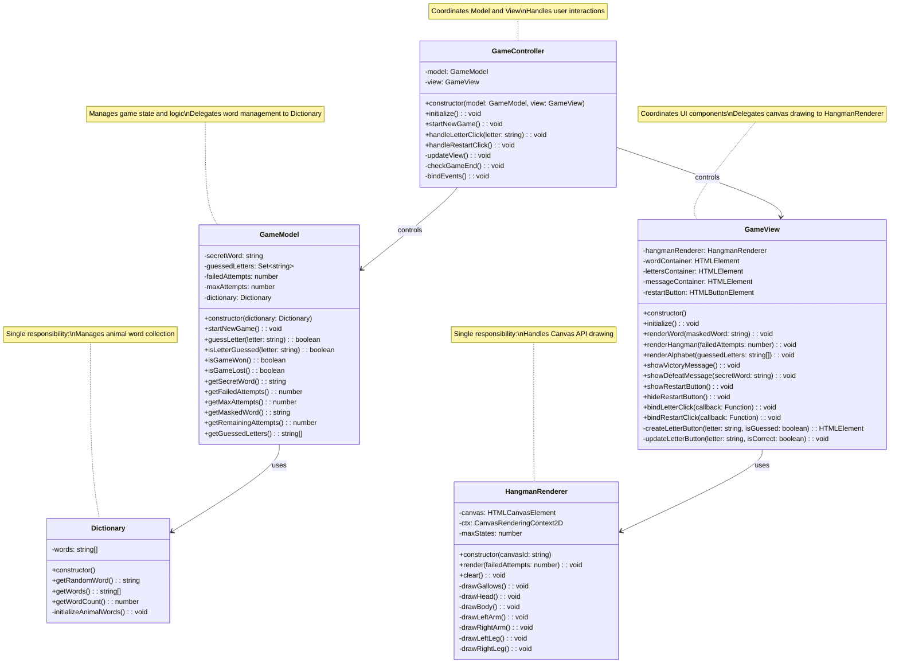

# Initial

I've created a comprehensive UML class diagram for your Hangman game application! Here's what I've designed:

## 🎯 **Key Design Principles Applied:**

### **SOLID Principles:**

1. **Single Responsibility**: Each class has one clear purpose (GameModel for logic, GameView for UI, GameController for coordination)
2. **Open/Closed**: `IDictionary` and `IHangmanRenderer` interfaces allow extension without modifying existing code
3. **Liskov Substitution**: Both `CanvasHangmanRenderer` and `ImageHangmanRenderer` can substitute `IHangmanRenderer`
4. **Interface Segregation**: Specific interfaces like `IDictionary`, `IHangmanRenderer`, and `IGameConfig`
5. **Dependency Inversion**: High-level modules depend on abstractions (interfaces), not concrete implementations

### **Design Patterns Used:**

- **MVC Pattern**: Clear separation between Model, View, and Controller
- **Strategy Pattern**: `IHangmanRenderer` allows switching between Canvas and Image rendering
- **Observer Pattern**: `EventEmitter` base class for event-driven architecture
- **Factory Pattern**: `GameConfig` for configuration management

### **Architecture Highlights:**

- **Modular structure** with independent, cohesive classes
- **Event-driven communication** between components
- **Flexible rendering** system (Canvas or Images)
- **Extensible dictionary** system for future categories
- **Clear separation of concerns** throughout

The diagram includes 20+ classes organized into Model, View, Controller, and Utility layers, all working together to create a maintainable, testable, and extensible Hangman game! 🎮

# Fix 1

**Prompt:** I think that for the scope of the project of The Hangman Game, maybe the structure you proposed was a little bit to complex, maybe you can do a good and functional approach with maybe 5 or 6 classes, don’t make things harder than they need to be.

You're absolutely right! I overcomplicated it. Let me create a simpler, more practical design that still follows good principles but is appropriate for the project scope. Perfect! Much better. Now we have a **clean, simple design with just 3 core classes**:

## 🎯 **Simplified Architecture:**

### **GameModel** (Logic & Data)

- Manages the secret word and game state
- Contains the animal dictionary
- Handles letter guessing logic
- Tracks attempts and determines win/loss

### **GameView** (UI & Rendering)

- Handles all DOM manipulation
- Draws the hangman on Canvas
- Displays word boxes and alphabet
- Shows messages and restart button

### **GameController** (Coordination)

- Connects Model and View
- Handles user clicks (letters and restart)
- Updates the view based on model changes

This is **much more appropriate** for a student project! It's:

- ✅ Simple and maintainable
- ✅ Still follows MVC pattern
- ✅ Easy to understand and implement
- ✅ Testable with Jest
- ✅ Follows good OOP principles without over-engineering

# Fix 2

**Prompt:** You misunderstood me, that didn't meant that you need to oversimplify everything at the point you only need 3 classes, maybe some functionality of classes like GameModel could be divided in other components to avoid having a "god class”.

You're absolutely right! Let me create a better balance - avoiding both over-engineering and god classes. I'll split responsibilities appropriately.

Creating a balanced design with 5-6 classes that properly separates concerns without over-engineering+119-90hangman-game-uml.mermaid

Much better! Now we have **5 well-balanced classes**:

## 🎯 **Balanced Design (5 Classes):**

### **Model Layer:**

1. **GameModel** - Game state and logic (secret word, attempts, win/loss conditions)
2. **Dictionary** - Word management (stores animals, provides random selection)

### **View Layer:**

1. **GameView** - UI coordination (word boxes, alphabet buttons, messages)
2. **HangmanRenderer** - Canvas drawing (dedicated to drawing the hangman)

### **Controller Layer:**

1. **GameController** - Coordinates Model and View, handles user interactions

## ✅ **Benefits of this design:**

- **No god classes** - Each class has a clear, focused responsibility
- **Good separation** - Dictionary handles words, HangmanRenderer handles drawing
- **Not over-engineered** - No unnecessary interfaces or abstractions
- **Easy to test** - Each component can be tested independently
- **Maintainable** - Easy to modify one part without affecting others
- **Practical scope** - Appropriate for a student TFG project

This strikes the right balance! 🎯

