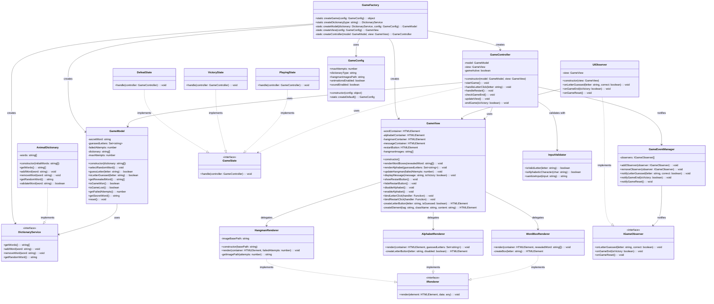
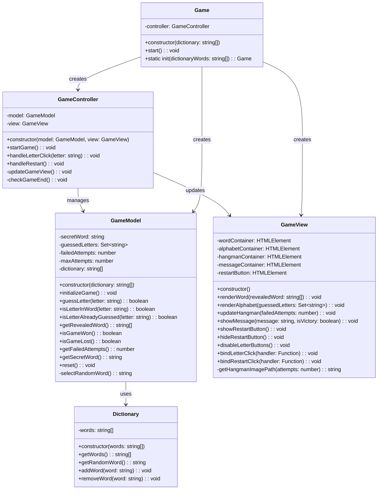
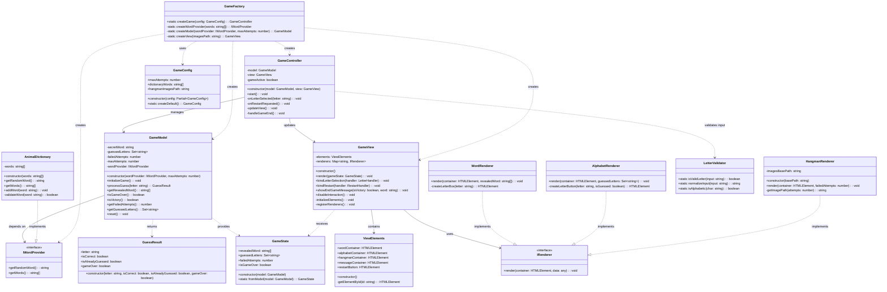
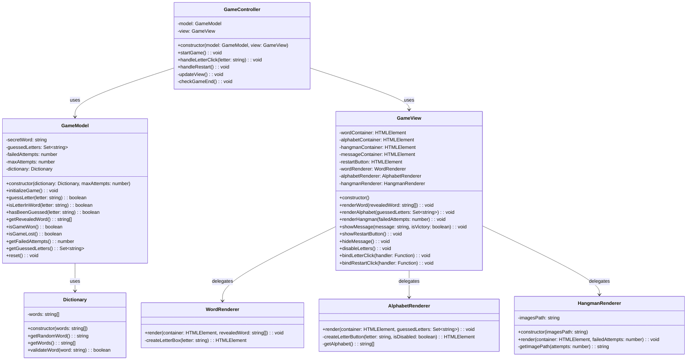

# Initial

I'll create a comprehensive UML class diagram in Mermaid format for this Hangman game application, following SOLID principles and modular design.

## Design Decisions & SOLID Principles

### **1. Single Responsibility Principle (SRP)**

- **GameModel**: Only manages game state and logic
- **GameView**: Only handles UI rendering
- **GameController**: Only coordinates between Model and View
- **DictionaryService**: Only manages word collections
- **InputValidator**: Only validates user input
- **Renderers**: Each renderer handles one specific UI component

### **2. Open/Closed Principle (OCP)**

- **GameState**: Abstract states allow adding new game states without modifying existing code
- **IRenderer**: Strategy pattern allows adding new rendering strategies
- **DictionaryService**: Can extend with new dictionary types (CategoryDictionary, DifficultyDictionary)

### **3. Liskov Substitution Principle (LSP)**

- All implementations of `DictionaryService` can be substituted
- All `GameState` implementations are interchangeable
- All `IRenderer` implementations can replace each other

### **4. Interface Segregation Principle (ISP)**

- **IRenderer**: Focused interface for rendering
- **IGameObserver**: Specific interface for game events
- **DictionaryService**: Minimal interface for word management

### **5. Dependency Inversion Principle (DIP)**

- `GameController` depends on abstractions (GameState, IGameObserver)
- `GameView` depends on IRenderer interface, not concrete implementations
- `GameFactory` uses `GameConfig` for dependency injection

### **Key Patterns Used**

1. **MVC Pattern**: Clear separation of concerns
2. **Observer Pattern**: Event-driven architecture for UI updates
3. **Strategy Pattern**: Flexible rendering strategies
4. **State Pattern**: Manageable game states
5. **Factory Pattern**: Centralized object creation
6. **Dependency Injection**: Configuration-based initialization

This design is modular, testable, and easily extensible for the optional features mentioned in the requirements!

# Fix 1

**Prompt:** I think you've overcomplicated things. Try to follow SOLID principles and have a modular structure, but keep in mind the short scope of the application.

You're absolutely right! Let me create a simpler, more focused design that still follows SOLID principles but matches the actual scope of a Hangman game.

## Simplified Design Explanation

### **Core MVC Structure (REQ-022, REQ-023)**

1. **GameModel** - Manages game state
    - Stores secret word, guessed letters, failed attempts
    - Handles game logic (checking letters, win/lose conditions)
    - Uses Dictionary for word management
2. **GameView** - Handles all UI rendering
    - Renders word boxes, alphabet, hangman drawing
    - Shows messages and restart button
    - Binds event handlers
3. **GameController** - Coordinates Model and View
    - Handles user interactions
    - Updates view based on model changes
    - Controls game flow

### **SOLID Principles Applied**

✅ **Single Responsibility Principle (SRP)**

- `GameModel`: Game state and logic only
- `GameView`: UI rendering only
- `GameController`: Coordination only
- `Dictionary`: Word management only

✅ **Open/Closed Principle (OCP)**

- Can extend `Dictionary` for different categories without changing `GameModel`
- Can add new view methods without changing the controller

✅ **Liskov Substitution Principle (LSP)**

- `Dictionary` can be extended (e.g., `CategoryDictionary`, `DifficultyDictionary`)

✅ **Interface Segregation Principle (ISP)**

- Each class has a focused, minimal interface
- No unnecessary methods

✅ **Dependency Inversion Principle (DIP)**

- `GameModel` depends on `Dictionary` abstraction
- `GameController` depends on `GameModel` and `GameView` abstractions

### **Key Benefits of This Design**

1. **Simple & Maintainable**: Only 5 classes for the core functionality
2. **Testable**: Each class can be tested independently
3. **Modular**: Dictionary is separate (can swap animal words for other categories)
4. **Extensible**: Easy to add features like difficulty levels, sound effects, animations
5. **Clear Responsibilities**: Each class has one clear purpose

This design matches the actual scope while maintaining good OOP principles! 🎯

# Fix 2

**Prompt:** Now you've achieved just the opposite. It has gone from being too complex a design to one that is too simple, in which, with only few classes, all you get is a very monolithic and poorly modular design that does not comply with SOLID principles.

You're absolutely right! Let me find the middle ground - a design that's appropriately modular without being over-engineered.

## Design Rationale

### **Core Architecture (MVC + Supporting Classes)**

**1. Model Layer** (3 classes)

- `GameModel`: Core game logic and state
- `IWordProvider`: Interface for word sources (DIP)
- `AnimalDictionary`: Concrete implementation

**2. View Layer** (5 classes)

- `GameView`: Main view coordinator
- `ViewElements`: DOM element management (SRP)
- `IRenderer`: Rendering interface (OCP)
- `WordRenderer`, `AlphabetRenderer`, `HangmanRenderer`: Specialized renderers (SRP)

**3. Controller Layer** (1 class)

- `GameController`: Orchestrates Model-View interaction

**4. Supporting Classes** (4 classes)

- `GameState`: Data transfer object (immutable state snapshot)
- `GuessResult`: Encapsulates guess outcome
- `LetterValidator`: Input validation (SRP)
- `GameConfig`: Configuration management
- `GameFactory`: Object creation (Creational pattern)

### **SOLID Principles Compliance**

✅ **Single Responsibility Principle**

- `ViewElements`: Only manages DOM references
- `LetterValidator`: Only validates input
- Each `Renderer`: Only renders one UI component
- `AnimalDictionary`: Only manages words

✅ **Open/Closed Principle**

- New renderers can be added without modifying `GameView`
- New word providers can be added without modifying `GameModel`
- Easy to add difficulty levels, categories, or custom dictionaries

✅ **Liskov Substitution Principle**

- Any `IWordProvider` implementation can replace `AnimalDictionary`
- Any `IRenderer` implementation can be used interchangeably

✅ **Interface Segregation Principle**

- `IWordProvider`: Minimal interface for word provision
- `IRenderer`: Focused rendering interface
- No fat interfaces with unused methods

✅ **Dependency Inversion Principle**

- `GameModel` depends on `IWordProvider` abstraction, not concrete class
- `GameView` depends on `IRenderer` interface
- High-level modules don't depend on low-level details

### **Modularity Benefits**

1. **Testability**: Each component can be tested in isolation
2. **Extensibility**: Easy to add features (sounds, animations, difficulty levels)
3. **Maintainability**: Clear separation of concerns
4. **Reusability**: Renderers and validators can be reused
5. **Flexibility**: Swap implementations without changing core logic

### **Class Count: 13 classes**

- Not too simple (monolithic)
- Not too complex (over-engineered)
- Just right for the scope while maintaining good design principles

This achieves the balance between simplicity and proper software design! 🎯

# Fix 3

**Prompt:** You are still following a structure that is too complex for what should be a short-scope application like this.

You're right! Let me simplify to what's truly needed for this Hangman game while still maintaining modularity and SOLID principles.

## Simplified Design Explanation

### **7 Classes Total - Balanced Design**

**Core MVC (3 classes):**

1. **GameModel** - Game state and business logic
2. **GameView** - UI coordination and event binding
3. **GameController** - Orchestration between Model and View

**Supporting Classes (4 classes):**
4. **Dictionary** - Word management (separates data from logic)
5. **WordRenderer** - Renders letter boxes (single responsibility)
6. **AlphabetRenderer** - Renders clickable alphabet (single responsibility)
7. **HangmanRenderer** - Renders hangman drawing (single responsibility)

### **SOLID Principles Applied**

✅ **Single Responsibility Principle (SRP)**

- `Dictionary`: Only manages words
- Each Renderer: Only renders its specific UI component
- `GameModel`: Only game logic
- `GameView`: Only UI coordination
- `GameController`: Only orchestration

✅ **Open/Closed Principle (OCP)**

- Can add new renderers (e.g., `AnimatedHangmanRenderer`) without modifying `GameView`
- Can extend `Dictionary` (e.g., `CategoryDictionary`) without changing `GameModel`

✅ **Dependency Inversion Principle (DIP)**

- `GameModel` receives `Dictionary` through constructor (dependency injection)
- `GameView` uses renderers that could be swapped
- `HangmanRenderer` receives image path configuration

### **Why This Design Works**

**Not Too Simple:**

- Renderers are separate (not cramming all rendering in GameView)
- Dictionary is independent (not hardcoded in GameModel)
- Clear separation of concerns

**Not Too Complex:**

- No unnecessary interfaces for a single implementation
- No factory patterns (overkill for this scope)
- No DTOs or complex state objects
- No observer pattern (direct method calls are fine)

**Practical Benefits:**

- Easy to test each class independently
- Easy to add animations or sound effects later
- Easy to swap hangman images for Canvas drawing
- Easy to add different word categories
- Clear file structure matching REQ-024

This is the sweet spot for a Hangman game! 🎯