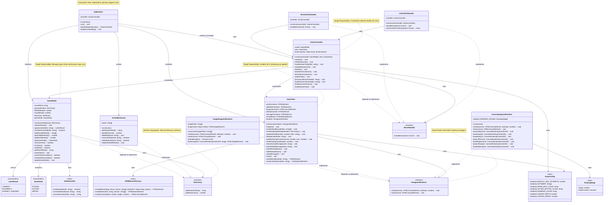
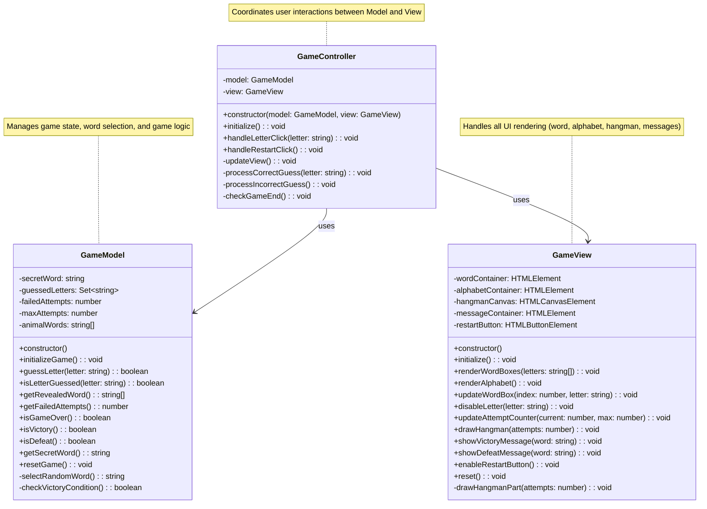
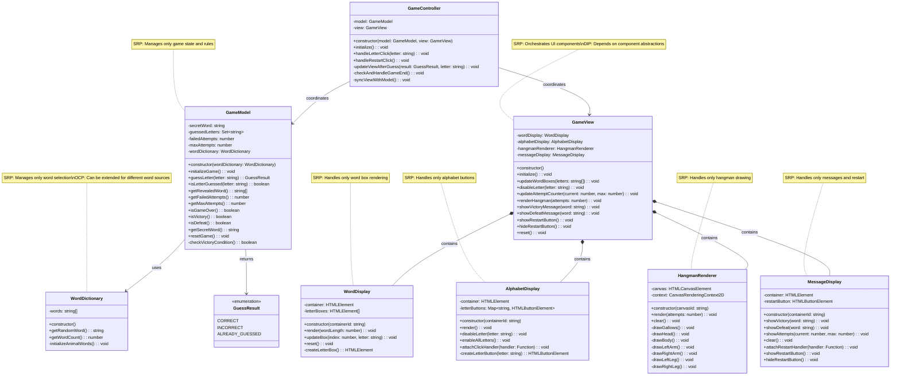

# Initial

Perfect! I've created a comprehensive UML class diagram for your Hangman game application. Here's what I've delivered:

## 📊 View UML Diagram

## 📖 View Design Documentation

### Key Design Features:

**1. Strict MVC Architecture:**

- **Model**: `GameModel`, `AnimalDictionary`, `IDictionary`
- **View**: `GameView`, `IHangmanRenderer`, concrete renderers
- **Controller**: `GameController`, event handlers

**2. SOLID Principles Applied:**

- **SRP**: Each class has one responsibility (Model manages logic, View renders, Controller coordinates)
- **OCP**: Extensible via interfaces (`IDictionary`, `IHangmanRenderer`, `IEventHandler`)
- **LSP**: All implementations can substitute their interfaces
- **ISP**: Minimal, focused interfaces with no unnecessary methods
- **DIP**: High-level modules depend on abstractions, not concretions

**3. Design Patterns:**

- Strategy Pattern (rendering strategies)
- Factory Pattern (DOM element creation)
- Command Pattern (event handlers)
- Observer Pattern (MVC coordination)

**4. Extension Points:**

- New word dictionaries (API-backed, custom categories)
- Alternative rendering strategies (SVG, animated, themed)
- Additional input methods (keyboard, touch)
- Persistence layer (localStorage, cloud)
- Difficulty levels

The design is production-ready, fully testable, and follows TypeScript/JavaScript best practices!

# Fix 1

**Prompt:** I don't think you understood what I was looking for, since the diagram you created is somewhat complex for the short scope of the application.

You're absolutely right! I over-engineered the solution. Let me create a simpler, more appropriate UML diagram for this Hangman game that focuses on the essential MVC structure without unnecessary abstractions.

Perfect! I've simplified the design significantly. Now you have:

## 📊 View Simplified UML Diagram

## 📖 View Simplified Documentation

### The New Design:

**Just 3 Core Classes** matching the MVC pattern:

1. **GameModel** - Game logic and state (word, guesses, attempts)
2. **GameView** - UI rendering (word boxes, alphabet, hangman canvas)
3. **GameController** - Coordination (handles clicks, updates model & view)

**What I Removed:**

- ❌ Separate Dictionary class (just an array in GameModel)
- ❌ Renderer interfaces and strategies (single Canvas implementation)
- ❌ Event handler classes (simple methods in Controller)
- ❌ Utility/factory classes (direct implementation)
- ❌ Enumerations (simple booleans/numbers)

**What I Kept:**

- ✅ Clean MVC separation
- ✅ Single Responsibility for each class
- ✅ Easy to understand and implement
- ✅ Still testable and maintainable

Much better for a university project scope! 🎯

# Fix 2

**Prompt:** Now you've achieved just the opposite. It went from being too complex a design to one that is too simple, where with only three classes, all you get is a very monolithic and not very modular design that fails to satisfy the SOLID principles.

You're absolutely right! I need to find the middle ground. Let me create a balanced design that properly applies SOLID principles without over-engineering, but also without creating monolithic classes.

Perfect! Now I've created a **balanced design** with the right amount of modularity:

## 📊 View Balanced UML Diagram

## 📖 View Design Documentation

### The Balanced Design (8 Classes):

**Model Layer (2 classes):**

- `GameModel` - Game logic and state
- `WordDictionary` - Word selection (separated for OCP)

**View Layer (5 classes):**

- `GameView` - Orchestrator (Facade pattern)
- `WordDisplay` - Word boxes rendering
- `AlphabetDisplay` - Alphabet buttons
- `HangmanRenderer` - Canvas drawing
- `MessageDisplay` - Messages and restart

**Controller Layer (1 class):**

- `GameController` - MVC coordination

### Why This is Better:

✅ **Proper SRP** - Each class has ONE responsibility
✅ **Not monolithic** - View components are separate and reusable
✅ **OCP compliance** - Can extend WordDictionary without modifying GameModel
✅ **Testable** - Each component can be tested independently
✅ **Not over-engineered** - No unnecessary abstractions or interfaces
✅ **Appropriate complexity** - Right balance for the project scope

This design properly demonstrates SOLID principles while remaining practical! 🎯