# Initial

Perfect! I've created a balanced UML diagram for the Music Player application. Here's the structure:

## 🎵 **Architecture Overview (16 classes organized in layers):**

### **Data Layer (3 classes):**

1. **Song** - Immutable data structure for track information
2. **Playlist** - Manages song collection and current position
3. **PlaylistStorage** - Handles localStorage persistence

### **Service/Logic Layer (2 classes):**

1. **AudioPlayer** - Wraps HTML5 Audio API, handles actual playback
2. **PlaybackController** - Coordinates playback logic with shuffle/repeat modes

### **React Hooks (3 custom hooks):**

1. **useAudioPlayer** - Integrates AudioPlayer with React state
2. **usePlaylist** - Manages playlist state and storage
3. **usePlaybackControls** - Handles shuffle/repeat functionality

### **React Components (7 components):**

1. **MusicPlayerApp** - Main orchestrator component
2. **NowPlaying** - Displays current song info and cover
3. **PlaybackControls** - Play/Pause/Next/Previous buttons
4. **ProgressBar** - Interactive progress bar with time display
5. **PlaylistView** - List of all songs
6. **AddSongForm** - Form to add new songs
7. **ErrorDisplay** - Error message handling

### **TypeScript Interfaces (6 props interfaces)**

## ✅ **Design Benefits:**

- **Clear separation** between data, logic, and UI
- **React-friendly** with custom hooks for state management
- **No god classes** - each class has focused responsibility
- **Testable** - services can be tested independently
- **Reusable** - hooks and components are modular
- **Appropriate complexity** for the project scope

```mermaid
classDiagram
    %% ============================================
    %% MUSIC PLAYER APPLICATION - REACT ARCHITECTURE
    %% ============================================

    %% ============================================
    %% MODEL / DATA LAYER
    %% ============================================
    
    class Song {
        +title: string
        +artist: string
        +cover: string
        +url: string
        +id: string
        
        +constructor(title: string, artist: string, cover: string, url: string)
        +equals(other: Song): boolean
    }

    class Playlist {
        -songs: Song[]
        -currentIndex: number
        
        +constructor(songs: Song[])
        +addSong(song: Song): void
        +removeSong(songId: string): void
        +getCurrentSong(): Song | null
        +getNextSong(): Song | null
        +getPreviousSong(): Song | null
        +getSongs(): Song[]
        +getCurrentIndex(): number
        +setCurrentIndex(index: number): void
        +getSize(): number
        +isEmpty(): boolean
        +contains(songId: string): boolean
    }

    class PlaylistStorage {
        -storageKey: string
        
        +constructor(storageKey: string)
        +savePlaylist(songs: Song[]): void
        +loadPlaylist(): Song[]
        +clear(): void
        -serializeSongs(songs: Song[]): string
        -deserializeSongs(data: string): Song[]
    }

    %% ============================================
    %% SERVICE / LOGIC LAYER
    %% ============================================

    class AudioPlayer {
        -audioElement: HTMLAudioElement
        -currentSong: Song | null
        -isPlaying: boolean
        -currentTime: number
        -duration: number
        
        +constructor()
        +loadSong(song: Song): Promise~void~
        +play(): Promise~void~
        +pause(): void
        +setCurrentTime(time: number): void
        +getCurrentTime(): number
        +getDuration(): number
        +isCurrentlyPlaying(): boolean
        +getCurrentSong(): Song | null
        +onTimeUpdate(callback: Function): void
        +onEnded(callback: Function): void
        +onError(callback: Function): void
        +destroy(): void
        -setupEventListeners(): void
    }

    class PlaybackController {
        -audioPlayer: AudioPlayer
        -playlist: Playlist
        -isShuffleMode: boolean
        -isRepeatMode: boolean
        -shuffleIndices: number[]
        
        +constructor(audioPlayer: AudioPlayer, playlist: Playlist)
        +playCurrent(): Promise~void~
        +pause(): void
        +togglePlayPause(): Promise~void~
        +next(): Promise~void~
        +previous(): Promise~void~
        +selectSong(index: number): Promise~void~
        +seek(time: number): void
        +toggleShuffle(): void
        +toggleRepeat(): void
        +isPlaying(): boolean
        +isShuffleActive(): boolean
        +isRepeatActive(): boolean
        -handleSongEnded(): void
        -generateShuffleOrder(): void
        -getNextIndex(): number
        -getPreviousIndex(): number
    }

    %% ============================================
    %% REACT HOOKS (Custom Logic)
    %% ============================================

    class useAudioPlayer {
        <<hook>>
        +currentSong: Song | null
        +isPlaying: boolean
        +currentTime: number
        +duration: number
        +play(): Promise~void~
        +pause(): void
        +next(): Promise~void~
        +previous(): Promise~void~
        +seek(time: number): void
        +selectSong(index: number): Promise~void~
    }

    class usePlaylist {
        <<hook>>
        +songs: Song[]
        +currentIndex: number
        +addSong(song: Song): void
        +removeSong(songId: string): void
        +loadPlaylist(): void
        +savePlaylist(): void
    }

    class usePlaybackControls {
        <<hook>>
        +isShuffleMode: boolean
        +isRepeatMode: boolean
        +toggleShuffle(): void
        +toggleRepeat(): void
    }

    %% ============================================
    %% REACT COMPONENTS
    %% ============================================

    class MusicPlayerApp {
        <<component>>
        +render(): JSX.Element
        -useAudioPlayer(): PlayerState
        -usePlaylist(): PlaylistState
        -usePlaybackControls(): ControlsState
    }

    class NowPlaying {
        <<component>>
        +props: NowPlayingProps
        +render(): JSX.Element
        -displayCover(coverUrl: string): JSX.Element
        -displaySongInfo(title: string, artist: string): JSX.Element
    }

    class PlaybackControls {
        <<component>>
        +props: PlaybackControlsProps
        +render(): JSX.Element
        -renderPlayPauseButton(): JSX.Element
        -renderNavigationButtons(): JSX.Element
        -renderExtendedControls(): JSX.Element
    }

    class ProgressBar {
        <<component>>
        +props: ProgressBarProps
        +render(): JSX.Element
        -handleProgressClick(event: MouseEvent): void
        -formatTime(seconds: number): string
        -calculateProgress(): number
    }

    class PlaylistView {
        <<component>>
        +props: PlaylistViewProps
        +render(): JSX.Element
        -renderSongItem(song: Song, index: number): JSX.Element
        -handleSongClick(index: number): void
        -handleRemoveSong(songId: string): void
    }

    class AddSongForm {
        <<component>>
        +props: AddSongFormProps
        +render(): JSX.Element
        -handleSubmit(event: FormEvent): void
        -validateSongData(data: SongData): boolean
    }

    class ErrorDisplay {
        <<component>>
        +props: ErrorDisplayProps
        +render(): JSX.Element
        -displayErrorMessage(message: string): JSX.Element
    }

    %% ============================================
    %% TYPES / INTERFACES
    %% ============================================

    class NowPlayingProps {
        <<interface>>
        +currentSong: Song | null
    }

    class PlaybackControlsProps {
        <<interface>>
        +isPlaying: boolean
        +onPlayPause: Function
        +onNext: Function
        +onPrevious: Function
        +isShuffleMode: boolean
        +isRepeatMode: boolean
        +onToggleShuffle: Function
        +onToggleRepeat: Function
    }

    class ProgressBarProps {
        <<interface>>
        +currentTime: number
        +duration: number
        +onSeek: Function
    }

    class PlaylistViewProps {
        <<interface>>
        +songs: Song[]
        +currentIndex: number
        +onSongSelect: Function
        +onRemoveSong: Function
    }

    class AddSongFormProps {
        <<interface>>
        +onAddSong: Function
    }

    class ErrorDisplayProps {
        <<interface>>
        +error: string | null
        +onDismiss: Function
    }

    %% ============================================
    %% RELATIONSHIPS
    %% ============================================

    %% Data Layer Relationships
    Playlist --> Song : contains
    PlaylistStorage --> Song : serializes/deserializes

    %% Service Layer Relationships
    AudioPlayer --> Song : plays
    PlaybackController --> AudioPlayer : controls
    PlaybackController --> Playlist : manages

    %% Hook Relationships
    useAudioPlayer ..> AudioPlayer : uses
    useAudioPlayer ..> PlaybackController : uses
    usePlaylist ..> Playlist : uses
    usePlaylist ..> PlaylistStorage : uses
    usePlaybackControls ..> PlaybackController : uses

    %% Component Relationships
    MusicPlayerApp --> NowPlaying : contains
    MusicPlayerApp --> PlaybackControls : contains
    MusicPlayerApp --> ProgressBar : contains
    MusicPlayerApp --> PlaylistView : contains
    MusicPlayerApp --> AddSongForm : contains
    MusicPlayerApp --> ErrorDisplay : contains
    MusicPlayerApp ..> useAudioPlayer : uses
    MusicPlayerApp ..> usePlaylist : uses
    MusicPlayerApp ..> usePlaybackControls : uses

    %% Props Relationships
    NowPlaying --> NowPlayingProps : receives
    PlaybackControls --> PlaybackControlsProps : receives
    ProgressBar --> ProgressBarProps : receives
    PlaylistView --> PlaylistViewProps : receives
    AddSongForm --> AddSongFormProps : receives
    ErrorDisplay --> ErrorDisplayProps : receives

    %% ============================================
    %% NOTES
    %% ============================================
    
    note for Song "Immutable data structure\nrepresenting a music track"
    
    note for Playlist "Manages song collection\nand current playback position"
    
    note for PlaylistStorage "Handles persistence with\nlocalStorage or JSON"
    
    note for AudioPlayer "Wraps HTML5 Audio API\nHandles actual playback"
    
    note for PlaybackController "Coordinates playback logic\nwith shuffle and repeat modes"
    
    note for useAudioPlayer "Custom hook that integrates\nAudioPlayer with React state"
    
    note for MusicPlayerApp "Main component that orchestrates\nall child components and hooks"
```

