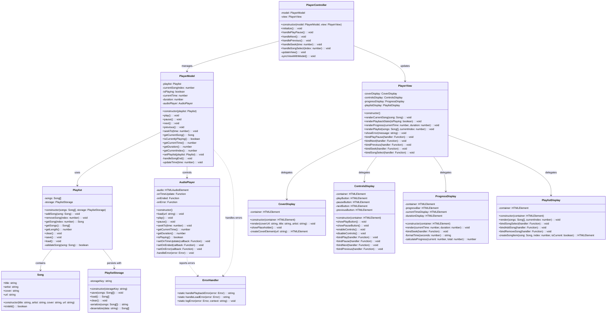
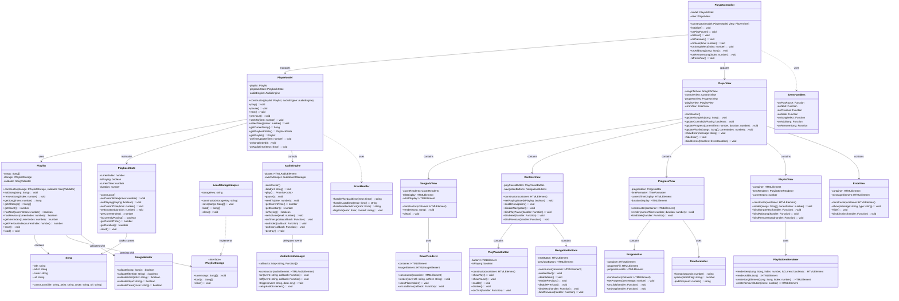

# Initial

I'll create a balanced UML class diagram for this music player application, maintaining modularity and SOLID principles appropriate for its scope.

## Design Explanation

### **Core Architecture (11 Classes)**

**MVC Core (3 classes):**

1. **PlayerModel** - Manages playback state and coordinates audio/playlist
2. **PlayerView** - Coordinates all UI components and event binding
3. **PlayerController** - Orchestrates user interactions

**Playlist Management (3 classes):**
4. **Playlist** - Manages song collection and operations
5. **Song** - Data structure for song information
6. **PlaylistStorage** - Handles persistence (localStorage/JSON)

**Audio Management (1 class):**
7. **AudioPlayer** - Wraps HTMLAudioElement and manages audio playback

**View Components (4 classes):**
8. **CoverDisplay** - Renders cover art, title, and artist
9. **ControlsDisplay** - Renders and manages playback buttons
10. **ProgressDisplay** - Renders and manages progress bar
11. **PlaylistDisplay** - Renders playlist and manages add/remove

**Error Handling (1 class):**
12. **ErrorHandler** - Centralizes error handling logic

### **SOLID Principles Applied**

✅ **Single Responsibility Principle (SRP)**

- `AudioPlayer`: Only manages audio playback
- `Playlist`: Only manages song collection
- `PlaylistStorage`: Only handles persistence
- Each display component: Only renders its specific UI section
- `ErrorHandler`: Only handles errors

✅ **Open/Closed Principle (OCP)**

- Can add new display components without modifying `PlayerView`
- Can extend `PlaylistStorage` for different storage mechanisms (API, IndexedDB)
- Can add new playback modes (shuffle, repeat) by extending `PlayerModel`

✅ **Liskov Substitution Principle (LSP)**

- `PlaylistStorage` can be substituted with `APIStorage` or `IndexedDBStorage`
- Display components can be swapped or extended

✅ **Interface Segregation Principle (ISP)**

- Each display component has a focused interface
- `AudioPlayer` has minimal, clear interface
- No fat interfaces with unused methods

✅ **Dependency Inversion Principle (DIP)**

- `PlayerModel` depends on `Playlist` and `AudioPlayer` abstractions
- `Playlist` receives `PlaylistStorage` through constructor
- Components are injected, not created internally

### **Key Design Decisions**

1. **Separated Display Components**: Each UI section (cover, controls, progress, playlist) is independent for easier testing and maintenance
2. **AudioPlayer Wrapper**: Encapsulates HTMLAudioElement to provide clean interface and handle browser quirks
3. **PlaylistStorage Separation**: Makes it easy to switch between localStorage, JSON files, or API storage
4. **ErrorHandler Utility**: Centralizes error handling for consistent user feedback
5. **Song as Data Class**: Simple, validated data structure

### **Benefits**

- **Testable**: Each component can be unit tested independently
- **Maintainable**: Clear responsibilities and boundaries
- **Extensible**: Easy to add shuffle/repeat modes, themes, or external playlists
- **Reusable**: Display components and storage can be reused in other projects

This design is appropriately scoped for a music player while maintaining good software engineering practices! 🎵

# Fix 1

**Prompt:** The base is a good starting point from which to try to modularize it even further, because despite having a good structure, it would be better to divide some classes so that they manage the application's operation more effectively.

You're right! Let me further modularize the design to improve separation of concerns and make the application more maintainable.

## Improved Modularization

### **Total: 23 Classes - Better Separation of Concerns**

**Core MVC (3 classes):**

1. PlayerModel
2. PlayerView
3. PlayerController

**State Management (1 class):**
4. **PlaybackState** - Separated from PlayerModel to isolate state changes

**Playlist Domain (4 classes):**
5. Playlist
6. Song
7. **SongValidator** - Separated validation logic
8. IPlaylistStorage (interface)
9. LocalStorageAdapter

**Audio Domain (2 classes):**
10. AudioEngine
11. **AudioEventManager** - Separated event handling from audio control

**Song Info View (2 classes):**
12. SongInfoView
13. **CoverRenderer** - Separated image rendering logic

**Controls View (3 classes):**
14. ControlsView
15. **PlayPauseButton** - Isolated play/pause button logic
16. **NavigationButtons** - Isolated next/previous button logic

**Progress View (3 classes):**
17. ProgressView
18. **ProgressBar** - Separated interactive progress bar logic
19. **TimeFormatter** - Separated time formatting utility

**Playlist View (2 classes):**
20. PlaylistView
21. **PlaylistItemRenderer** - Separated item rendering logic

**Error Handling (2 classes):**
22. ErrorView
23. ErrorHandler

**Helper (1 class):**
24. EventHandlers - Type-safe event handler structure

### **Key Improvements**

✅ **Better State Management**

- `PlaybackState` isolated from `PlayerModel` - easier to track state changes
- Clear state mutations in one place

✅ **More Granular Audio Control**

- `AudioEventManager` separated from `AudioEngine`
- Better event subscription management
- Easier to add new audio events

✅ **Validation Separated**

- `SongValidator` extracted from `Playlist`
- Reusable validation logic
- Single responsibility for validation rules

✅ **UI Components More Atomic**

- `PlayPauseButton` isolated - can be reused or styled independently
- `NavigationButtons` separated - easier to disable/enable
- `ProgressBar` extracted - complex interaction logic isolated
- `CoverRenderer` separated - handles image loading errors independently
- `PlaylistItemRenderer` extracted - rendering logic reusable

✅ **Better Error Handling**

- `ErrorView` separated from other views
- `ErrorHandler` provides consistent error messages
- Errors can be displayed without affecting other UI components

✅ **Utilities Extracted**

- `TimeFormatter` - reusable time formatting
- Can be used in tests independently

### **SOLID Principles Enhanced**

✅ **Single Responsibility** - Each class now has a more focused responsibility
✅ **Open/Closed** - Easier to extend individual components
✅ **Liskov Substitution** - Storage interface, validators can be swapped
✅ **Interface Segregation** - Smaller, more focused interfaces
✅ **Dependency Inversion** - More abstractions, less coupling

### **Benefits of This Structure**

1. **Testing**: Smaller classes are easier to unit test
2. **Reusability**: Components like `TimeFormatter`, `ProgressBar`, `CoverRenderer` can be reused
3. **Maintenance**: Changes to progress bar logic don't affect other components
4. **Extensibility**: Easy to add shuffle/repeat modes, volume control, equalizer
5. **Debugging**: Isolated components make bug tracking easier

This design provides better modularity while staying practical for the application's scope! 🎵