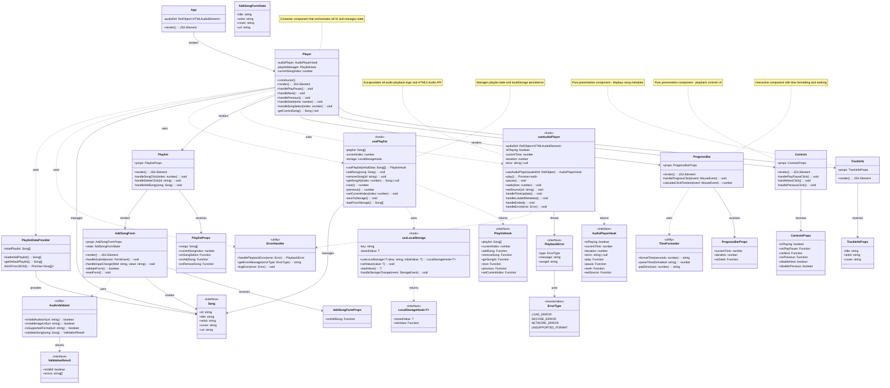
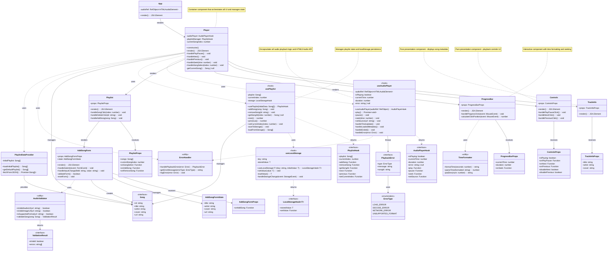

# Initial

Perfect! I've created the UML class diagram for the Music Player application.

## 📊 View Music Player UML Diagram

### Design Overview (18 classes/interfaces):

**React Components (7):**

- `App` - Root component
- `Player` - Container component (orchestrator)
- `TrackInfo`, `Controls`, `ProgressBar`, `Playlist` - Presentation components
- `AddSongForm` - Form component with validation

**Custom Hooks (3):**

- `useAudioPlayer` - Audio playback logic (SRP)
- `usePlaylist` - Playlist management (SRP)
- `useLocalStorage` - Generic persistence hook (reusable)

**Data Models (5):**

- `Song` - Core data interface
- `PlaybackError` - Error handling
- Props interfaces for each component

**Utilities (3):**

- `TimeFormatter` - Time conversion (SRP)
- `ErrorHandler` - Centralized error handling (SRP)
- `AudioValidator` - Input validation (SRP)

**Data Provider (1):**

- `PlaylistDataProvider` - Initial data loading (OCP)

### SOLID Principles Applied:

✅ **SRP**: Each hook has one responsibility (audio, playlist, storage)

✅ **OCP**: Can extend PlaylistDataProvider for API sources

✅ **LSP**: Props interfaces ensure component contracts

✅ **ISP**: Focused prop interfaces per component

✅ **DIP**: Components depend on hook abstractions

Ready for the next application! 🎵

# Fix 1

**Prompt:** It's almost perfect, you only need to create the required relationship between AddSongForm and AddSongFormState.

Perfect! I've added the relationship between `AddSongForm` and `AddSongFormState`.

## 📊 View Updated Music Player UML Diagram

Now `AddSongForm` properly shows it manages its internal state through `AddSongFormState`. Ready for the next application specification! 🎵