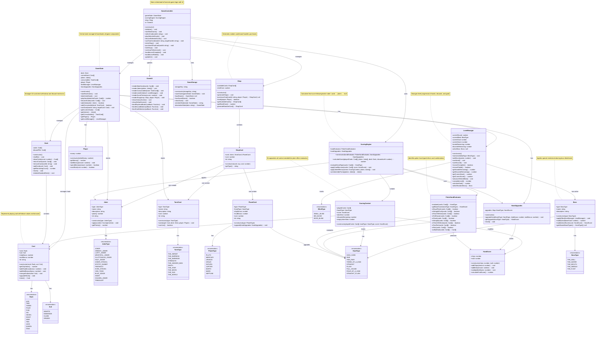

# Initial

Excellent! I've created a comprehensive UML diagram for the Balatro-inspired card game. Here's the balanced structure:

## 🃏 **Architecture Overview (24 classes organized in layers):**

### **Card Model Layer (4 classes):**

1. **Card** - Playing card with rank, suit, and bonuses
2. **Rank** - Enumeration of card ranks (A-K)
3. **Suit** - Enumeration of suits (Hearts, Diamonds, Clubs, Spades)
4. **Deck** - Manages 52-card deck with draw/discard mechanics

### **Special Cards Layer (6 classes):**

1. **Joker** - Persistent bonus cards with priority system
2. **JokerType** - 15 different joker types
3. **TarotCard** - Consumable tactical cards
4. **TarotType** - 10 tarot card types
5. **PlanetCard** - Permanent hand upgrade cards
6. **PlanetType** - 9 planet card types

### **Poker Evaluation Layer (4 classes):**

1. **PokerHandEvaluator** - Identifies poker hand types
2. **HandType** - 9 poker hand types
3. **HandScore** - Stores chips and mult values
4. **HandUpgrades** - Tracks permanent hand upgrades

### **Scoring System Layer (2 classes):**

1. **ScoringEngine** - Calculates scores following strict order
2. **ScoringContext** - Encapsulates scoring context for jokers

### **Game State Layer (3 classes):**

1. **GameState** - Central state manager
2. **Player** - Manages money and economy
3. **LevelManager** - Tracks level progression, hands, discards

### **Boss System Layer (2 classes):**

1. **Boss** - Applies special boss restrictions
2. **BossType** - 5 different boss types

### **Shop System Layer (2 classes):**

1. **Shop** - Generates and manages shop cards
2. **ShopCard** - Wraps purchasable cards with cost

### **Controller & UI Layer (3 classes):**

1. **GameController** - Main game orchestrator
2. **GameUI** - Handles all rendering and user input
3. **GameStorage** - Persistence with localStorage

## ✅ **Design Highlights:**

- **Clear separation** between card logic, scoring, and game flow
- **ScoringEngine** follows the strict order: base → cards → jokers
- **No god classes** - responsibilities are well distributed
- **Extensible** - Easy to add new jokers, tarot, or bosses
- **Testable** - Each layer can be tested independently
- **Appropriate complexity** for the game's scope



# Fix 1

**Prompt:** I'm not sure I'm convinced that Joker, Tarot, or Planet cards should use enums with each of their types to represent each card. Instead, I think it would be less of a violation of SOLID principles if we modularized this in such a way that classes like TarotCard, JokerCard, or PlanetCard were abstract classes, whose children represent each of the types of cards that have different effects on the game.

You're absolutely right! Using enums violates the Open/Closed Principle. Let me refactor the design to use abstract classes with concrete implementations for each card type.

Perfect! Much better design now. Here's what changed:

## 🎯 **Refactored Design - Following SOLID Principles:**

### **Abstract Base Classes:**

- **Joker** (abstract) - Defines common interface for all jokers
- **TarotCard** (abstract) - Defines common interface for all tarot cards
- **PlanetCard** (abstract) - Defines common interface for all planet cards

### **Concrete Implementations:**

**15 Joker Classes:**

- BasicJoker, GreedyJoker, LustyJoker, WrathfulJoker, GluttonousJoker
- HalfJoker, JokerStencil, MysticSummit
- Fibonacci, EvenSteven, OddTodd
- BlueJoker, Hiker, GoldenJoker, Triboulet

**10 Tarot Classes:**

- TheHermit, TheEmpress, TheEmperor, Strength, TheHangedMan
- Death, TheStar, TheMoon, TheSun, TheWorld

**9 Planet Classes:**

- Pluto, Mercury, Uranus, Venus, Saturn
- Jupiter, Earth, Mars, Neptune

## ✅ **SOLID Principles Applied:**

1. **Open/Closed Principle** ✅ - Can add new jokers/tarot/planets without modifying existing code
2. **Single Responsibility** ✅ - Each card class handles its own specific effect
3. **Liskov Substitution** ✅ - Any concrete joker can substitute the abstract Joker
4. **Dependency Inversion** ✅ - System depends on abstractions (Joker, TarotCard, PlanetCard)

This design is **much more extensible** - adding a new joker is as simple as creating a new class that extends Joker!

```mermaid
classDiagram
    %% ============================================
    %% BALATRO-INSPIRED CARD GAME ARCHITECTURE
    %% ============================================

    %% ============================================
    %% CARD MODEL LAYER
    %% ============================================
    
    class Card {
        +rank: Rank
        +suit: Suit
        +chipBonus: number
        +multBonus: number
        +id: string
        
        +constructor(rank: Rank, suit: Suit)
        +getChipValue(): number
        +addChipBonus(bonus: number): void
        +addMultBonus(bonus: number): void
        +changeSuit(newSuit: Suit): void
        +upgradeRank(): void
        +clone(): Card
    }

    class Rank {
        <<enumeration>>
        ACE
        TWO
        THREE
        FOUR
        FIVE
        SIX
        SEVEN
        EIGHT
        NINE
        TEN
        JACK
        QUEEN
        KING
    }

    class Suit {
        <<enumeration>>
        HEARTS
        DIAMONDS
        CLUBS
        SPADES
    }

    class Deck {
        -cards: Card[]
        -discardPile: Card[]
        
        +constructor()
        +shuffle(): void
        +drawCards(count: number): Card[]
        +returnCards(cards: Card[]): void
        +removeCard(cardId: string): void
        +addCard(card: Card): void
        +getRemainingCount(): number
        +reset(): void
        -initializeStandardDeck(): void
    }

    %% ============================================
    %% SPECIAL CARDS LAYER - ABSTRACT CLASSES
    %% ============================================

    class Joker {
        <<abstract>>
        #name: string
        #description: string
        #priority: number
        #id: string
        
        +constructor(name: string, description: string, priority: number)
        +apply(context: ScoringContext): void*
        +getPriority(): number
        +getName(): string
        +getDescription(): string
        +onLevelComplete(player: Player): void
    }

    class TarotCard {
        <<abstract>>
        #name: string
        #description: string
        #cost: number
        #id: string
        
        +constructor(name: string, description: string, cost: number)
        +use(target: Card, deck: Deck, player: Player): void*
        +canUse(): boolean
        +requiresTarget(): boolean
        +getName(): string
        +getDescription(): string
    }

    class PlanetCard {
        <<abstract>>
        #name: string
        #description: string
        #handType: HandType
        #chipBonus: number
        #multBonus: number
        #cost: number
        #id: string
        
        +constructor(name: string, handType: HandType, chipBonus: number, multBonus: number)
        +upgrade(handUpgrades: HandUpgrades): void
        +getHandType(): HandType
        +getName(): string
        +getDescription(): string
    }

    %% ============================================
    %% JOKER CONCRETE IMPLEMENTATIONS
    %% ============================================

    class BasicJoker {
        +apply(context: ScoringContext): void
    }

    class GreedyJoker {
        +apply(context: ScoringContext): void
    }

    class LustyJoker {
        +apply(context: ScoringContext): void
    }

    class WrathfulJoker {
        +apply(context: ScoringContext): void
    }

    class GluttonousJoker {
        +apply(context: ScoringContext): void
    }

    class HalfJoker {
        +apply(context: ScoringContext): void
    }

    class JokerStencil {
        +apply(context: ScoringContext): void
    }

    class MysticSummit {
        +apply(context: ScoringContext): void
    }

    class Fibonacci {
        +apply(context: ScoringContext): void
    }

    class EvenSteven {
        +apply(context: ScoringContext): void
    }

    class OddTodd {
        +apply(context: ScoringContext): void
    }

    class BlueJoker {
        +apply(context: ScoringContext): void
    }

    class Hiker {
        -cardsPlayedCount: number
        +apply(context: ScoringContext): void
    }

    class GoldenJoker {
        +apply(context: ScoringContext): void
        +onLevelComplete(player: Player): void
    }

    class Triboulet {
        +apply(context: ScoringContext): void
    }

    %% ============================================
    %% TAROT CONCRETE IMPLEMENTATIONS
    %% ============================================

    class TheHermit {
        +use(target: Card, deck: Deck, player: Player): void
        +requiresTarget(): boolean
    }

    class TheEmpress {
        +use(target: Card, deck: Deck, player: Player): void
        +requiresTarget(): boolean
    }

    class TheEmperor {
        +use(target: Card, deck: Deck, player: Player): void
        +requiresTarget(): boolean
    }

    class Strength {
        +use(target: Card, deck: Deck, player: Player): void
        +requiresTarget(): boolean
    }

    class TheHangedMan {
        +use(target: Card, deck: Deck, player: Player): void
        +requiresTarget(): boolean
    }

    class Death {
        +use(target: Card, deck: Deck, player: Player): void
        +requiresTarget(): boolean
    }

    class TheStar {
        +use(target: Card, deck: Deck, player: Player): void
        +requiresTarget(): boolean
    }

    class TheMoon {
        +use(target: Card, deck: Deck, player: Player): void
        +requiresTarget(): boolean
    }

    class TheSun {
        +use(target: Card, deck: Deck, player: Player): void
        +requiresTarget(): boolean
    }

    class TheWorld {
        +use(target: Card, deck: Deck, player: Player): void
        +requiresTarget(): boolean
    }

    %% ============================================
    %% PLANET CONCRETE IMPLEMENTATIONS
    %% ============================================

    class Pluto {
        +constructor()
    }

    class Mercury {
        +constructor()
    }

    class Uranus {
        +constructor()
    }

    class Venus {
        +constructor()
    }

    class Saturn {
        +constructor()
    }

    class Jupiter {
        +constructor()
    }

    class Earth {
        +constructor()
    }

    class Mars {
        +constructor()
    }

    class Neptune {
        +constructor()
    }

    %% ============================================
    %% POKER HAND EVALUATION LAYER
    %% ============================================

    class PokerHandEvaluator {
        +evaluate(cards: Card[]): HandType
        +getBaseScore(handType: HandType): HandScore
        -isRoyalFlush(cards: Card[]): boolean
        -isStraightFlush(cards: Card[]): boolean
        -isFourOfAKind(cards: Card[]): boolean
        -isFullHouse(cards: Card[]): boolean
        -isFlush(cards: Card[]): boolean
        -isStraight(cards: Card[]): boolean
        -isThreeOfAKind(cards: Card[]): boolean
        -isTwoPair(cards: Card[]): boolean
        -isPair(cards: Card[]): boolean
        -sortByRank(cards: Card[]): Card[]
    }

    class HandType {
        <<enumeration>>
        HIGH_CARD
        PAIR
        TWO_PAIR
        THREE_OF_A_KIND
        STRAIGHT
        FLUSH
        FULL_HOUSE
        FOUR_OF_A_KIND
        STRAIGHT_FLUSH
    }

    class HandScore {
        +chips: number
        +mult: number
        
        +constructor(chips: number, mult: number)
        +addChips(amount: number): void
        +addMult(amount: number): void
        +multiplyMult(factor: number): void
        +calculateFinalScore(): number
    }

    class HandUpgrades {
        -upgrades: Map~HandType, HandScore~
        
        +constructor()
        +upgradeHand(handType: HandType, chipBonus: number, multBonus: number): void
        +getUpgrade(handType: HandType): HandScore
        +reset(): void
    }

    %% ============================================
    %% SCORING SYSTEM LAYER
    %% ============================================

    class ScoringEngine {
        -handEvaluator: PokerHandEvaluator
        -handUpgrades: HandUpgrades
        
        +constructor(handEvaluator: PokerHandEvaluator, handUpgrades: HandUpgrades)
        +calculateScore(playedCards: Card[], jokers: Joker[], deck: Deck, discardsLeft: number): number
        -evaluateHandType(cards: Card[]): HandType
        -applyCardBonuses(cards: Card[], score: HandScore): void
        -applyJokerEffects(context: ScoringContext, jokers: Joker[]): void
        -sortJokersByPriority(jokers: Joker[]): Joker[]
    }

    class ScoringContext {
        +playedCards: Card[]
        +handType: HandType
        +score: HandScore
        +deckSize: number
        +discardsRemaining: number
        +emptyJokerSlots: number
        
        +constructor(playedCards: Card[], handType: HandType, score: HandScore)
    }

    %% ============================================
    %% GAME STATE LAYER
    %% ============================================

    class GameState {
        -deck: Deck
        -currentHand: Card[]
        -jokers: Joker[]
        -consumables: TarotCard[]
        -player: Player
        -levelManager: LevelManager
        -handUpgrades: HandUpgrades
        
        +constructor()
        +startNewGame(): void
        +dealInitialHand(): void
        +playHand(selectedCards: Card[]): number
        +discardCards(cards: Card[]): void
        +addJoker(joker: Joker): boolean
        +addConsumable(tarot: TarotCard): boolean
        +useTarot(tarotId: string, targetCard: Card): void
        +getCurrentHand(): Card[]
        +getJokers(): Joker[]
        +getConsumables(): TarotCard[]
        +getPlayer(): Player
        +getLevelManager(): LevelManager
    }

    class Player {
        -money: number
        
        +constructor(initialMoney: number)
        +getMoney(): number
        +addMoney(amount: number): void
        +spendMoney(amount: number): boolean
        +canAfford(cost: number): boolean
    }

    class LevelManager {
        -currentRound: number
        -currentBlind: BlindType
        -currentGoal: number
        -currentScore: number
        -handsRemaining: number
        -discardsRemaining: number
        -activeBoss: Boss | null
        
        +constructor()
        +startLevel(blindType: BlindType): void
        +addScore(points: number): void
        +useHand(): void
        +useDiscard(): void
        +isLevelComplete(): boolean
        +isLevelFailed(): boolean
        +getHandsRemaining(): number
        +getDiscardsRemaining(): number
        +getCurrentGoal(): number
        +getCurrentScore(): number
        +advanceToNextBlind(): void
        +completeLevel(): number
        -calculateGoal(): number
        -selectRandomBoss(): Boss
    }

    class BlindType {
        <<enumeration>>
        SMALL_BLIND
        BIG_BLIND
        BOSS_BLIND
    }

    %% ============================================
    %% BOSS SYSTEM LAYER
    %% ============================================

    class Boss {
        +type: BossType
        +name: string
        +description: string
        
        +constructor(type: BossType)
        +applyEffect(levelManager: LevelManager): void
        +modifyGoal(baseGoal: number): number
        +modifyHandScore(score: HandScore): HandScore
        +getAllowedHandTypes(): HandType[] | null
    }

    class BossType {
        <<enumeration>>
        THE_WALL
        THE_WATER
        THE_MOUTH
        THE_NEEDLE
        THE_FLINT
    }

    %% ============================================
    %% SHOP SYSTEM LAYER
    %% ============================================

    class Shop {
        -availableCards: ShopCard[]
        -rerollCost: number
        
        +constructor()
        +generateShop(): void
        +purchaseCard(cardId: string, player: Player): ShopCard | null
        +reroll(player: Player): boolean
        +getAvailableCards(): ShopCard[]
        +getRerollCost(): number
        -generateRandomCard(): ShopCard
    }

    class ShopCard {
        +card: Joker | TarotCard | PlanetCard
        +cost: number
        +id: string
        
        +constructor(card: any, cost: number)
        +getType(): string
    }

    %% ============================================
    %% GAME CONTROLLER LAYER
    %% ============================================

    class GameController {
        -gameState: GameState
        -scoringEngine: ScoringEngine
        -shop: Shop
        -ui: GameUI
        
        +constructor()
        +initialize(): void
        +startNewGame(): void
        +selectCard(cardId: string): void
        +playSelectedCards(): void
        +discardSelectedCards(): void
        +useTarotCard(tarotId: string, targetCardId: string): void
        +enterShop(): void
        +purchaseShopCard(cardId: string): void
        +exitShop(): void
        +continueToNextLevel(): void
        -handleLevelComplete(): void
        -handleLevelFailed(): void
        -updateUI(): void
    }

    class GameUI {
        +renderMainHand(cards: Card[]): void
        +renderJokers(jokers: Joker[]): void
        +renderConsumables(tarot: TarotCard[]): void
        +renderLevelInfo(level: LevelManager): void
        +renderScorePreview(score: number): void
        +renderShop(shop: Shop, player: Player): void
        +showVictoryScreen(): void
        +showDefeatScreen(): void
        +bindPlayHandButton(callback: Function): void
        +bindDiscardButton(callback: Function): void
        +bindCardSelection(callback: Function): void
    }

    %% ============================================
    %% PERSISTENCE LAYER
    %% ============================================

    class GameStorage {
        -storageKey: string
        
        +constructor(storageKey: string)
        +saveGame(gameState: GameState): void
        +loadGame(): GameState | null
        +hasSavedGame(): boolean
        +clearSave(): void
        -serializeState(state: GameState): string
        -deserializeState(data: string): GameState
    }

    %% ============================================
    %% RELATIONSHIPS
    %% ============================================

    %% Card relationships
    Card --> Rank : has
    Card --> Suit : has
    Deck --> Card : contains

    %% Special cards inheritance - Jokers
    BasicJoker --|> Joker : extends
    GreedyJoker --|> Joker : extends
    LustyJoker --|> Joker : extends
    WrathfulJoker --|> Joker : extends
    GluttonousJoker --|> Joker : extends
    HalfJoker --|> Joker : extends
    JokerStencil --|> Joker : extends
    MysticSummit --|> Joker : extends
    Fibonacci --|> Joker : extends
    EvenSteven --|> Joker : extends
    OddTodd --|> Joker : extends
    BlueJoker --|> Joker : extends
    Hiker --|> Joker : extends
    GoldenJoker --|> Joker : extends
    Triboulet --|> Joker : extends

    %% Special cards inheritance - Tarot
    TheHermit --|> TarotCard : extends
    TheEmpress --|> TarotCard : extends
    TheEmperor --|> TarotCard : extends
    Strength --|> TarotCard : extends
    TheHangedMan --|> TarotCard : extends
    Death --|> TarotCard : extends
    TheStar --|> TarotCard : extends
    TheMoon --|> TarotCard : extends
    TheSun --|> TarotCard : extends
    TheWorld --|> TarotCard : extends

    %% Special cards inheritance - Planets
    Pluto --|> PlanetCard : extends
    Mercury --|> PlanetCard : extends
    Uranus --|> PlanetCard : extends
    Venus --|> PlanetCard : extends
    Saturn --|> PlanetCard : extends
    Jupiter --|> PlanetCard : extends
    Earth --|> PlanetCard : extends
    Mars --|> PlanetCard : extends
    Neptune --|> PlanetCard : extends

    %% Special cards usage
    PlanetCard --> HandType : upgrades

    %% Poker evaluation relationships
    PokerHandEvaluator --> HandType : evaluates
    PokerHandEvaluator --> HandScore : produces
    HandUpgrades --> HandType : tracks
    HandUpgrades --> HandScore : stores

    %% Scoring relationships
    ScoringEngine --> PokerHandEvaluator : uses
    ScoringEngine --> HandUpgrades : uses
    ScoringEngine --> ScoringContext : creates
    ScoringEngine --> Joker : applies
    ScoringContext --> Card : contains
    ScoringContext --> HandType : has
    ScoringContext --> HandScore : modifies

    %% Game state relationships
    GameState --> Deck : manages
    GameState --> Card : manages hand
    GameState --> Joker : stores
    GameState --> TarotCard : stores
    GameState --> Player : has
    GameState --> LevelManager : has
    GameState --> HandUpgrades : has

    %% Level management relationships
    LevelManager --> BlindType : tracks
    LevelManager --> Boss : has active

    %% Boss relationships
    Boss --> BossType : has
    Boss --> HandType : may restrict

    %% Shop relationships
    Shop --> ShopCard : contains
    ShopCard --> Joker : can contain
    ShopCard --> TarotCard : can contain
    ShopCard --> PlanetCard : can contain

    %% Controller relationships
    GameController --> GameState : manages
    GameController --> ScoringEngine : uses
    GameController --> Shop : manages
    GameController --> GameUI : updates
    GameController --> GameStorage : uses

    %% ============================================
    %% NOTES
    %% ============================================
    
    note for Card "Represents playing card with\nbase values and bonuses"
    
    note for Deck "Manages 52-card deck with\ndraw and discard mechanics"
    
    note for Joker "Abstract base class\nEach joker type is a concrete class\nFollows Open/Closed Principle"
    
    note for TarotCard "Abstract base class\nEach tarot is a concrete class\nEasy to add new tarot cards"
    
    note for PlanetCard "Abstract base class\nEach planet is a concrete class\nExtensible design"
    
    note for PokerHandEvaluator "Identifies poker hand types\nfrom card combinations"
    
    note for ScoringEngine "Calculates final score following\nstrict order: cards → jokers → mult"
    
    note for ScoringContext "Encapsulates all context needed\nfor joker effect evaluation"
    
    note for GameState "Central state manager\nCoordinates all game components"
    
    note for LevelManager "Manages level progression,\nhands, discards, and goals"
    
    note for Boss "Applies special restrictions\nduring boss blind levels"
    
    note for Shop "Generates random cards\nand handles purchases"
    
    note for GameController "Main orchestrator\nConnects game logic with UI"
```

# Fix 2

**Prompt:** For planet cards, considering that they work in a simpler way, I think we could adapt the structure so that each planet uses the PlanetType enum to know the type of card and from there know the values it has to take, since creating individual classes in this case is perhaps a bit of overkill compared to Tarot or Joker, where it was more necessary.

You're absolutely right! Planet cards are much simpler - they just add static bonuses to hand types. Using individual classes for them is overkill. Let me refactor that.

Perfect! Much more pragmatic now. Here's the updated design:

## 🎯 **Balanced Approach:**

### **Abstract Classes (Complex Behavior):**

- **Joker** - Abstract class with 15 concrete implementations
    - Each joker has unique complex logic in `apply()`
- **TarotCard** - Abstract class with 10 concrete implementations
    - Each tarot has unique effects in `use()`

### **Enum-Based (Simple Static Data):**

- **PlanetCard** - Concrete class with `PlanetType` enum
    - All planets work the same way: add static bonuses to hand types
    - No complex logic, just different values
    - Constructor uses enum to initialize appropriate values

## ✅ **Why This Makes Sense:**

**Jokers & Tarot** → Individual classes because:

- Complex, varied behavior
- Different logic in each card's methods
- Stateful (like Hiker tracking cards played)

**Planets** → Single class with enum because:

- All work identically (just add chips + mult to a hand type)
- Only difference is the values
- No complex logic or state
- 9 nearly identical classes would be overkill

This is a **pragmatic balance** between following principles and avoiding over-engineering! 👍

```mermaid
classDiagram
    %% ============================================
    %% BALATRO-INSPIRED CARD GAME ARCHITECTURE
    %% ============================================

    %% ============================================
    %% CARD MODEL LAYER
    %% ============================================
    
    class Card {
        +rank: Rank
        +suit: Suit
        +chipBonus: number
        +multBonus: number
        +id: string
        
        +constructor(rank: Rank, suit: Suit)
        +getChipValue(): number
        +addChipBonus(bonus: number): void
        +addMultBonus(bonus: number): void
        +changeSuit(newSuit: Suit): void
        +upgradeRank(): void
        +clone(): Card
    }

    class Rank {
        <<enumeration>>
        ACE
        TWO
        THREE
        FOUR
        FIVE
        SIX
        SEVEN
        EIGHT
        NINE
        TEN
        JACK
        QUEEN
        KING
    }

    class Suit {
        <<enumeration>>
        HEARTS
        DIAMONDS
        CLUBS
        SPADES
    }

    class Deck {
        -cards: Card[]
        -discardPile: Card[]
        
        +constructor()
        +shuffle(): void
        +drawCards(count: number): Card[]
        +returnCards(cards: Card[]): void
        +removeCard(cardId: string): void
        +addCard(card: Card): void
        +getRemainingCount(): number
        +reset(): void
        -initializeStandardDeck(): void
    }

    %% ============================================
    %% SPECIAL CARDS LAYER - ABSTRACT CLASSES
    %% ============================================

    class Joker {
        <<abstract>>
        #name: string
        #description: string
        #priority: number
        #id: string
        
        +constructor(name: string, description: string, priority: number)
        +apply(context: ScoringContext): void*
        +getPriority(): number
        +getName(): string
        +getDescription(): string
        +onLevelComplete(player: Player): void
    }

    class TarotCard {
        <<abstract>>
        #name: string
        #description: string
        #cost: number
        #id: string
        
        +constructor(name: string, description: string, cost: number)
        +use(target: Card, deck: Deck, player: Player): void*
        +canUse(): boolean
        +requiresTarget(): boolean
        +getName(): string
        +getDescription(): string
    }

    class PlanetCard {
        +type: PlanetType
        +name: string
        +description: string
        +handType: HandType
        +chipBonus: number
        +multBonus: number
        +cost: number
        +id: string
        
        +constructor(type: PlanetType)
        +upgrade(handUpgrades: HandUpgrades): void
        +getHandType(): HandType
        +getName(): string
        +getDescription(): string
        -initializeValues(): void
    }

    class PlanetType {
        <<enumeration>>
        PLUTO
        MERCURY
        URANUS
        VENUS
        SATURN
        JUPITER
        EARTH
        MARS
        NEPTUNE
    }

    class BasicJoker {
        +apply(context: ScoringContext): void
    }

    class GreedyJoker {
        +apply(context: ScoringContext): void
    }

    class LustyJoker {
        +apply(context: ScoringContext): void
    }

    class WrathfulJoker {
        +apply(context: ScoringContext): void
    }

    class GluttonousJoker {
        +apply(context: ScoringContext): void
    }

    class HalfJoker {
        +apply(context: ScoringContext): void
    }

    class JokerStencil {
        +apply(context: ScoringContext): void
    }

    class MysticSummit {
        +apply(context: ScoringContext): void
    }

    class Fibonacci {
        +apply(context: ScoringContext): void
    }

    class EvenSteven {
        +apply(context: ScoringContext): void
    }

    class OddTodd {
        +apply(context: ScoringContext): void
    }

    class BlueJoker {
        +apply(context: ScoringContext): void
    }

    class Hiker {
        -cardsPlayedCount: number
        +apply(context: ScoringContext): void
    }

    class GoldenJoker {
        +apply(context: ScoringContext): void
        +onLevelComplete(player: Player): void
    }

    class Triboulet {
        +apply(context: ScoringContext): void
    }

    %% ============================================
    %% TAROT CONCRETE IMPLEMENTATIONS
    %% ============================================

    class TheHermit {
        +use(target: Card, deck: Deck, player: Player): void
        +requiresTarget(): boolean
    }

    class TheEmpress {
        +use(target: Card, deck: Deck, player: Player): void
        +requiresTarget(): boolean
    }

    class TheEmperor {
        +use(target: Card, deck: Deck, player: Player): void
        +requiresTarget(): boolean
    }

    class Strength {
        +use(target: Card, deck: Deck, player: Player): void
        +requiresTarget(): boolean
    }

    class TheHangedMan {
        +use(target: Card, deck: Deck, player: Player): void
        +requiresTarget(): boolean
    }

    class Death {
        +use(target: Card, deck: Deck, player: Player): void
        +requiresTarget(): boolean
    }

    class TheStar {
        +use(target: Card, deck: Deck, player: Player): void
        +requiresTarget(): boolean
    }

    class TheMoon {
        +use(target: Card, deck: Deck, player: Player): void
        +requiresTarget(): boolean
    }

    class TheSun {
        +use(target: Card, deck: Deck, player: Player): void
        +requiresTarget(): boolean
    }

    class TheWorld {
        +use(target: Card, deck: Deck, player: Player): void
        +requiresTarget(): boolean
    }

    %% ============================================
    %% JOKER CONCRETE IMPLEMENTATIONS
    %% ============================================

    class PokerHandEvaluator {
        +evaluate(cards: Card[]): HandType
        +getBaseScore(handType: HandType): HandScore
        -isRoyalFlush(cards: Card[]): boolean
        -isStraightFlush(cards: Card[]): boolean
        -isFourOfAKind(cards: Card[]): boolean
        -isFullHouse(cards: Card[]): boolean
        -isFlush(cards: Card[]): boolean
        -isStraight(cards: Card[]): boolean
        -isThreeOfAKind(cards: Card[]): boolean
        -isTwoPair(cards: Card[]): boolean
        -isPair(cards: Card[]): boolean
        -sortByRank(cards: Card[]): Card[]
    }

    class HandType {
        <<enumeration>>
        HIGH_CARD
        PAIR
        TWO_PAIR
        THREE_OF_A_KIND
        STRAIGHT
        FLUSH
        FULL_HOUSE
        FOUR_OF_A_KIND
        STRAIGHT_FLUSH
    }

    class HandScore {
        +chips: number
        +mult: number
        
        +constructor(chips: number, mult: number)
        +addChips(amount: number): void
        +addMult(amount: number): void
        +multiplyMult(factor: number): void
        +calculateFinalScore(): number
    }

    class HandUpgrades {
        -upgrades: Map~HandType, HandScore~
        
        +constructor()
        +upgradeHand(handType: HandType, chipBonus: number, multBonus: number): void
        +getUpgrade(handType: HandType): HandScore
        +reset(): void
    }

    %% ============================================
    %% SCORING SYSTEM LAYER
    %% ============================================

    class ScoringEngine {
        -handEvaluator: PokerHandEvaluator
        -handUpgrades: HandUpgrades
        
        +constructor(handEvaluator: PokerHandEvaluator, handUpgrades: HandUpgrades)
        +calculateScore(playedCards: Card[], jokers: Joker[], deck: Deck, discardsLeft: number): number
        -evaluateHandType(cards: Card[]): HandType
        -applyCardBonuses(cards: Card[], score: HandScore): void
        -applyJokerEffects(context: ScoringContext, jokers: Joker[]): void
        -sortJokersByPriority(jokers: Joker[]): Joker[]
    }

    class ScoringContext {
        +playedCards: Card[]
        +handType: HandType
        +score: HandScore
        +deckSize: number
        +discardsRemaining: number
        +emptyJokerSlots: number
        
        +constructor(playedCards: Card[], handType: HandType, score: HandScore)
    }

    %% ============================================
    %% GAME STATE LAYER
    %% ============================================

    class GameState {
        -deck: Deck
        -currentHand: Card[]
        -jokers: Joker[]
        -consumables: TarotCard[]
        -player: Player
        -levelManager: LevelManager
        -handUpgrades: HandUpgrades
        
        +constructor()
        +startNewGame(): void
        +dealInitialHand(): void
        +playHand(selectedCards: Card[]): number
        +discardCards(cards: Card[]): void
        +addJoker(joker: Joker): boolean
        +addConsumable(tarot: TarotCard): boolean
        +useTarot(tarotId: string, targetCard: Card): void
        +getCurrentHand(): Card[]
        +getJokers(): Joker[]
        +getConsumables(): TarotCard[]
        +getPlayer(): Player
        +getLevelManager(): LevelManager
    }

    class Player {
        -money: number
        
        +constructor(initialMoney: number)
        +getMoney(): number
        +addMoney(amount: number): void
        +spendMoney(amount: number): boolean
        +canAfford(cost: number): boolean
    }

    class LevelManager {
        -currentRound: number
        -currentBlind: BlindType
        -currentGoal: number
        -currentScore: number
        -handsRemaining: number
        -discardsRemaining: number
        -activeBoss: Boss | null
        
        +constructor()
        +startLevel(blindType: BlindType): void
        +addScore(points: number): void
        +useHand(): void
        +useDiscard(): void
        +isLevelComplete(): boolean
        +isLevelFailed(): boolean
        +getHandsRemaining(): number
        +getDiscardsRemaining(): number
        +getCurrentGoal(): number
        +getCurrentScore(): number
        +advanceToNextBlind(): void
        +completeLevel(): number
        -calculateGoal(): number
        -selectRandomBoss(): Boss
    }

    class BlindType {
        <<enumeration>>
        SMALL_BLIND
        BIG_BLIND
        BOSS_BLIND
    }

    %% ============================================
    %% BOSS SYSTEM LAYER
    %% ============================================

    class Boss {
        +type: BossType
        +name: string
        +description: string
        
        +constructor(type: BossType)
        +applyEffect(levelManager: LevelManager): void
        +modifyGoal(baseGoal: number): number
        +modifyHandScore(score: HandScore): HandScore
        +getAllowedHandTypes(): HandType[] | null
    }

    class BossType {
        <<enumeration>>
        THE_WALL
        THE_WATER
        THE_MOUTH
        THE_NEEDLE
        THE_FLINT
    }

    %% ============================================
    %% SHOP SYSTEM LAYER
    %% ============================================

    class Shop {
        -availableCards: ShopCard[]
        -rerollCost: number
        
        +constructor()
        +generateShop(): void
        +purchaseCard(cardId: string, player: Player): ShopCard | null
        +reroll(player: Player): boolean
        +getAvailableCards(): ShopCard[]
        +getRerollCost(): number
        -generateRandomCard(): ShopCard
    }

    class ShopCard {
        +card: Joker | TarotCard | PlanetCard
        +cost: number
        +id: string
        
        +constructor(card: any, cost: number)
        +getType(): string
    }

    %% ============================================
    %% GAME CONTROLLER LAYER
    %% ============================================

    class GameController {
        -gameState: GameState
        -scoringEngine: ScoringEngine
        -shop: Shop
        -ui: GameUI
        
        +constructor()
        +initialize(): void
        +startNewGame(): void
        +selectCard(cardId: string): void
        +playSelectedCards(): void
        +discardSelectedCards(): void
        +useTarotCard(tarotId: string, targetCardId: string): void
        +enterShop(): void
        +purchaseShopCard(cardId: string): void
        +exitShop(): void
        +continueToNextLevel(): void
        -handleLevelComplete(): void
        -handleLevelFailed(): void
        -updateUI(): void
    }

    class GameUI {
        +renderMainHand(cards: Card[]): void
        +renderJokers(jokers: Joker[]): void
        +renderConsumables(tarot: TarotCard[]): void
        +renderLevelInfo(level: LevelManager): void
        +renderScorePreview(score: number): void
        +renderShop(shop: Shop, player: Player): void
        +showVictoryScreen(): void
        +showDefeatScreen(): void
        +bindPlayHandButton(callback: Function): void
        +bindDiscardButton(callback: Function): void
        +bindCardSelection(callback: Function): void
    }

    %% ============================================
    %% PERSISTENCE LAYER
    %% ============================================

    class GameStorage {
        -storageKey: string
        
        +constructor(storageKey: string)
        +saveGame(gameState: GameState): void
        +loadGame(): GameState | null
        +hasSavedGame(): boolean
        +clearSave(): void
        -serializeState(state: GameState): string
        -deserializeState(data: string): GameState
    }

    %% ============================================
    %% RELATIONSHIPS
    %% ============================================

    %% Card relationships
    Card --> Rank : has
    Card --> Suit : has
    Deck --> Card : contains

    %% Special cards inheritance - Jokers
    BasicJoker --|> Joker : extends
    GreedyJoker --|> Joker : extends
    LustyJoker --|> Joker : extends
    WrathfulJoker --|> Joker : extends
    GluttonousJoker --|> Joker : extends
    HalfJoker --|> Joker : extends
    JokerStencil --|> Joker : extends
    MysticSummit --|> Joker : extends
    Fibonacci --|> Joker : extends
    EvenSteven --|> Joker : extends
    OddTodd --|> Joker : extends
    BlueJoker --|> Joker : extends
    Hiker --|> Joker : extends
    GoldenJoker --|> Joker : extends
    Triboulet --|> Joker : extends

    %% Special cards inheritance - Tarot
    TheHermit --|> TarotCard : extends
    TheEmpress --|> TarotCard : extends
    TheEmperor --|> TarotCard : extends
    Strength --|> TarotCard : extends
    TheHangedMan --|> TarotCard : extends
    Death --|> TarotCard : extends
    TheStar --|> TarotCard : extends
    TheMoon --|> TarotCard : extends
    TheSun --|> TarotCard : extends
    TheWorld --|> TarotCard : extends

    %% Special cards usage
    PlanetCard --> PlanetType : has
    PlanetCard --> HandType : upgrades

    %% Poker evaluation relationships
    PokerHandEvaluator --> HandType : evaluates
    PokerHandEvaluator --> HandScore : produces
    HandUpgrades --> HandType : tracks
    HandUpgrades --> HandScore : stores

    %% Scoring relationships
    ScoringEngine --> PokerHandEvaluator : uses
    ScoringEngine --> HandUpgrades : uses
    ScoringEngine --> ScoringContext : creates
    ScoringEngine --> Joker : applies
    ScoringContext --> Card : contains
    ScoringContext --> HandType : has
    ScoringContext --> HandScore : modifies

    %% Game state relationships
    GameState --> Deck : manages
    GameState --> Card : manages hand
    GameState --> Joker : stores
    GameState --> TarotCard : stores
    GameState --> Player : has
    GameState --> LevelManager : has
    GameState --> HandUpgrades : has

    %% Level management relationships
    LevelManager --> BlindType : tracks
    LevelManager --> Boss : has active

    %% Boss relationships
    Boss --> BossType : has
    Boss --> HandType : may restrict

    %% Shop relationships
    Shop --> ShopCard : contains
    ShopCard --> Joker : can contain
    ShopCard --> TarotCard : can contain
    ShopCard --> PlanetCard : can contain

    %% Controller relationships
    GameController --> GameState : manages
    GameController --> ScoringEngine : uses
    GameController --> Shop : manages
    GameController --> GameUI : updates
    GameController --> GameStorage : uses

    %% ============================================
    %% NOTES
    %% ============================================
    
    note for Card "Represents playing card with\nbase values and bonuses"
    
    note for Deck "Manages 52-card deck with\ndraw and discard mechanics"
    
    note for Joker "Abstract base class\nEach joker type is a concrete class\nFollows Open/Closed Principle"
    
    note for TarotCard "Abstract base class\nEach tarot is a concrete class\nEasy to add new tarot cards"
    
    note for PlanetCard "Concrete class using PlanetType enum\nSimple static bonuses don't need\nindividual classes - pragmatic approach"
    
    note for PokerHandEvaluator "Identifies poker hand types\nfrom card combinations"
    
    note for ScoringEngine "Calculates final score following\nstrict order: cards → jokers → mult"
    
    note for ScoringContext "Encapsulates all context needed\nfor joker effect evaluation"
    
    note for GameState "Central state manager\nCoordinates all game components"
    
    note for LevelManager "Manages level progression,\nhands, discards, and goals"
    
    note for Boss "Applies special restrictions\nduring boss blind levels"
    
    note for Shop "Generates random cards\nand handles purchases"
    
    note for GameController "Main orchestrator\nConnects game logic with UI"
```