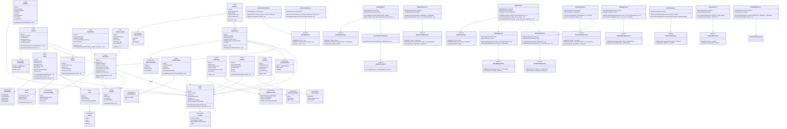

# Initial

Based on this comprehensive tournament management system specification, I'll create a UML class diagram following SOLID principles with a modular architecture. This is a complex sports tournament platform with bracket management, rankings, and real-time updates.

```mermaid
classDiagram
    %% ==================== CORE DOMAIN ENTITIES ====================

    class User {
        <<entity>>
        -String id
        -String username
        -String email
        -String passwordHash
        -UserRole role
        -ContactInfo contactInfo
        -PrivacySettings privacySettings
        -DateTime createdAt
        +authenticate(password: String) bool
        +hasPermission(permission: Permission) bool
        +updatePrivacySettings(settings: PrivacySettings) void
    }

    class UserRole {
        <<enumeration>>
        SYSTEM_ADMIN
        TOURNAMENT_ADMIN
        REGISTERED_PARTICIPANT
        PUBLIC
    }

    class ContactInfo {
        <<value object>>
        -String phoneNumber
        -String telegram
        -String whatsapp
        -String avatarUrl
        +isVisible(viewer: User, context: VisibilityContext) bool
    }

    class PrivacySettings {
        <<value object>>
        -VisibilityLevel emailVisibility
        -VisibilityLevel phoneVisibility
        -VisibilityLevel telegramVisibility
        -VisibilityLevel whatsappVisibility
        -VisibilityLevel avatarVisibility
        -VisibilityLevel rankingVisibility
    }

    class VisibilityLevel {
        <<enumeration>>
        ADMINS_ONLY
        TOURNAMENT_PARTICIPANTS
        REGISTERED_USERS
        PUBLIC
    }

    class Tournament {
        <<entity>>
        -String id
        -String name
        -DateTime startDate
        -DateTime endDate
        -TournamentStatus status
        -List~Category~ categories
        -List~Surface~ surfaces
        -List~Court~ courts
        -String regulations
        -RegistrationConfig registrationConfig
        -VisualConfig visualConfig
        -List~String~ adminIds
        +addCategory(category: Category) void
        +addCourt(court: Court) void
        +canAcceptRegistrations() bool
        +assignAdministrator(userId: String) void
        +finalize() void
    }

    class TournamentStatus {
        <<enumeration>>
        DRAFT
        REGISTRATION_OPEN
        REGISTRATION_CLOSED
        IN_PROGRESS
        FINALIZED
    }

    class Category {
        <<entity>>
        -String id
        -String name
        -AgeRange ageRange
        -GenderType gender
        -SkillLevel level
        -int maxQuota
        -int reservedSpots
        +hasAvailableSpots() bool
        +getRemainingSpots() int
    }

    class Surface {
        <<enumeration>>
        HARD
        CLAY
        GRASS
        CARPET
        INDOOR
    }

    class Court {
        <<entity>>
        -String id
        -String name
        -Surface surface
        -List~TimeSlot~ availableSlots
        -bool isAvailable
        +addTimeSlot(slot: TimeSlot) void
        +isAvailableAt(dateTime: DateTime) bool
    }

    class TimeSlot {
        <<value object>>
        -DateTime startTime
        -DateTime endTime
        -int capacity
        +overlaps(other: TimeSlot) bool
        +contains(dateTime: DateTime) bool
    }

    class RegistrationConfig {
        <<value object>>
        -DateTime openDate
        -DateTime closeDate
        -DateTime drawDate
        -bool requiresPayment
        -Money registrationFee
        -bool autoAcceptWithinQuota
    }

    class VisualConfig {
        <<value object>>
        -String primaryColor
        -String secondaryColor
        -String logoUrl
        -Map~String,String~ customCSS
    }

    class Registration {
        <<entity>>
        -String id
        -String tournamentId
        -String categoryId
        -String participantId
        -RegistrationStatus status
        -int ranking
        -AcceptanceType acceptanceType
        -DateTime registeredAt
        -DateTime statusChangedAt
        -PaymentStatus paymentStatus
        +accept() void
        +putOnWaitingList() void
        +withdraw(withdrawalTime: WithdrawalTime) void
        +promoteFromWaitingList() void
    }

    class RegistrationStatus {
        <<enumeration>>
        PENDING
        ACCEPTED
        WAITING_LIST
        LUCKY_LOSER
        WITHDRAWN
        REJECTED
    }

    class AcceptanceType {
        <<enumeration>>
        DIRECT_ACCEPTANCE
        WILD_CARD
        JUNIOR_EXEMPT
        OTHER_ACCEPTANCE
        SEEDED
    }

    class WithdrawalTime {
        <<enumeration>>
        BEFORE_DRAW
        AFTER_DRAW
        DURING_TOURNAMENT
    }

    class PaymentStatus {
        <<enumeration>>
        PENDING
        PAID
        REFUNDED
        FAILED
    }

    class Bracket {
        <<entity>>
        -String id
        -String tournamentId
        -String categoryId
        -String phaseId
        -BracketType type
        -BracketStatus status
        -List~Match~ matches
        -List~Seed~ seeds
        -DateTime generatedAt
        -String regulations
        +generate(participants: List~Registration~) void
        +addMatch(match: Match) void
        +getNextMatch(winnerId: String) Match
        +canBeModified() bool
        +regenerate(keepResults: bool) void
    }

    class BracketType {
        <<enumeration>>
        SINGLE_ELIMINATION
        DOUBLE_ELIMINATION
        ROUND_ROBIN
        MATCH_PLAY
        CONSOLATION
    }

    class BracketStatus {
        <<enumeration>>
        PENDING_DRAW
        DRAW_COMPLETE
        IN_PROGRESS
        COMPLETED
    }

    class Seed {
        <<value object>>
        -int position
        -String participantId
        -bool isBye
    }

    class Phase {
        <<entity>>
        -String id
        -String tournamentId
        -String name
        -int sequenceOrder
        -PhaseType type
        -String nextPhaseId
        -bool isConsolation
        -QualificationRules qualificationRules
        +linkToNextPhase(nextPhaseId: String) void
        +getQualifiedParticipants() List~String~
    }

    class PhaseType {
        <<enumeration>>
        PRELIMINARY
        MAIN_DRAW
        FINAL
        CONSOLATION
    }

    class QualificationRules {
        <<value object>>
        -int qualifyingPositions
        -bool includeRunnersUp
        -bool useRankingForTies
    }

    class Match {
        <<entity>>
        -String id
        -String bracketId
        -int roundNumber
        -int matchNumber
        -String player1Id
        -String player2Id
        -MatchStatus status
        -Score score
        -DateTime scheduledTime
        -String courtId
        -String materialResponsible
        -MatchMode mode
        -List~MatchEvent~ events
        +scheduleOn(court: Court, dateTime: DateTime) void
        +recordResult(result: MatchResult, recordedBy: String) void
        +suspend(reason: String) void
        +resume() void
        +assignWalkover(winnerId: String) void
        +requiresConfirmation() bool
    }

    class MatchStatus {
        <<enumeration>>
        SCHEDULED
        IN_PROGRESS
        SUSPENDED
        COMPLETED
        WALKOVER
        RETIRED
        CANCELLED
        AWAITING_CONFIRMATION
    }

    class MatchMode {
        <<value object>>
        -int numberOfSets
        -int gamesPerSet
        -bool useSuperTiebreak
        -TiebreakRules tiebreakRules
        -int matchDurationMinutes
    }

    class Score {
        <<entity>>
        -List~SetScore~ sets
        -String winnerId
        -bool isConfirmed
        -String confirmedBy
        -DateTime confirmedAt
        +addSet(setScore: SetScore) void
        +getWinner() String
        +isValid() bool
        +needsConfirmation() bool
    }

    class SetScore {
        <<value object>>
        -int player1Games
        -int player2Games
        -TiebreakScore tiebreak
        +getWinner() int
        +isCompleted() bool
    }

    class TiebreakScore {
        <<value object>>
        -int player1Points
        -int player2Points
        +getWinner() int
    }

    class MatchResult {
        <<value object>>
        -String winnerId
        -String loserId
        -List~SetScore~ sets
        -MatchOutcome outcome
        -String recordedBy
        -DateTime recordedAt
    }

    class MatchOutcome {
        <<enumeration>>
        NORMAL
        WALKOVER
        RETIRED
        DISQUALIFIED
        CANCELLED
    }

    class MatchEvent {
        <<entity>>
        -String id
        -String matchId
        -MatchEventType type
        -DateTime timestamp
        -String description
        -String userId
        +isSignificant() bool
    }

    class MatchEventType {
        <<enumeration>>
        SCHEDULED
        RESCHEDULED
        STARTED
        SUSPENDED
        RESUMED
        RESULT_ENTERED
        RESULT_DISPUTED
        RESULT_CONFIRMED
        CANCELLED
        COURT_CHANGED
    }

    class Standing {
        <<entity>>
        -String id
        -String bracketId
        -String participantId
        -int position
        -StandingStats stats
        -DateTime updatedAt
        +updateStats(matchResult: MatchResult) void
        +calculatePosition(tiebreakCriteria: List~TiebreakCriterion~) void
    }

    class StandingStats {
        <<value object>>
        -int points
        -int matchesPlayed
        -int matchesWon
        -int matchesLost
        -int setsWon
        -int setsLost
        -int gamesWon
        -int gamesLost
        +getSetsRatio() double
        +getGamesRatio() double
        +getTotalPoints() int
    }

    class TiebreakCriterion {
        <<enumeration>>
        POINTS
        SETS_RATIO
        GAMES_RATIO
        DIRECT_CONFRONTATION
        RANDOM_DRAW
    }

    class GlobalRanking {
        <<entity>>
        -String id
        -String participantId
        -String categoryId
        -int position
        -double points
        -RankingSystem system
        -DateTime updatedAt
        -List~RankingEntry~ history
        +updatePoints(tournamentResult: TournamentResult) void
        +getHistoricalPosition(date: DateTime) int
    }

    class RankingSystem {
        <<enumeration>>
        POINTS_BASED
        ELO
        HYBRID
    }

    class RankingEntry {
        <<value object>>
        -DateTime date
        -int position
        -double points
        -String tournamentId
    }

    class OrderOfPlay {
        <<entity>>
        -String id
        -String tournamentId
        -DateTime playDate
        -List~ScheduledMatch~ scheduledMatches
        -OrderOfPlayStatus status
        -DateTime publishedAt
        +addScheduledMatch(match: ScheduledMatch) void
        +rescheduleMatch(matchId: String, newTime: DateTime, newCourt: Court) void
        +publish() void
        +isPublished() bool
    }

    class OrderOfPlayStatus {
        <<enumeration>>
        DRAFT
        PUBLISHED
        IN_PROGRESS
        COMPLETED
    }

    class ScheduledMatch {
        <<value object>>
        -String matchId
        -DateTime scheduledTime
        -String courtId
        -int estimatedDuration
        -int sequenceNumber
        +conflicts(other: ScheduledMatch) bool
    }

    class Announcement {
        <<entity>>
        -String id
        -String tournamentId
        -String authorId
        -String title
        -String summary
        -String fullText
        -List~String~ tags
        -AnnouncementVisibility visibility
        -DateTime publishDate
        -DateTime createdAt
        -bool isPublished
        +publish() void
        +schedulePublication(date: DateTime) void
        +addTag(tag: String) void
    }

    class AnnouncementVisibility {
        <<enumeration>>
        PUBLIC
        PARTICIPANTS_ONLY
        ADMINS_ONLY
        CATEGORY_SPECIFIC
    }

    class Notification {
        <<entity>>
        -String id
        -String userId
        -NotificationType type
        -String title
        -String message
        -String relatedEntityId
        -NotificationChannel channel
        -bool isRead
        -DateTime createdAt
        -DateTime sentAt
        +markAsRead() void
        +send() void
    }

    class NotificationType {
        <<enumeration>>
        REGISTRATION_CONFIRMED
        MATCH_SCHEDULED
        MATCH_RESCHEDULED
        RESULT_ENTERED
        RESULT_DISPUTED
        ORDER_OF_PLAY_PUBLISHED
        ANNOUNCEMENT
        WITHDRAWAL_PROCESSED
        PAYMENT_CONFIRMED
        SANCTION_APPLIED
    }

    class NotificationChannel {
        <<enumeration>>
        EMAIL
        TELEGRAM
        WEB_PUSH
        WHATSAPP
        IN_APP
    }

    class NotificationPreferences {
        <<value object>>
        -Set~NotificationType~ enabledTypes
        -Set~NotificationChannel~ preferredChannels
        -bool enableRealTime
        +shouldNotify(type: NotificationType) bool
        +getChannelsFor(type: NotificationType) Set~NotificationChannel~
    }

    class Statistics {
        <<entity>>
        -String id
        -String participantId
        -String tournamentId
        -StatisticsData data
        -DateTime updatedAt
        +updateFromMatch(match: Match) void
        +getHeadToHead(opponentId: String) HeadToHeadStats
    }

    class StatisticsData {
        <<value object>>
        -int totalMatches
        -int wins
        -int losses
        -int setsWon
        -int setsLost
        -int gamesWon
        -int gamesLost
        -int walkovers
        -int retirements
        +getWinPercentage() double
        +getSetsRatio() double
    }

    class HeadToHeadStats {
        <<value object>>
        -String opponentId
        -int matchesPlayed
        -int wins
        -int losses
        -List~String~ matchIds
    }

    class Sanction {
        <<entity>>
        -String id
        -String participantId
        -String tournamentId
        -SanctionType type
        -String reason
        -int pointsPenalty
        -bool isActive
        -DateTime appliedAt
        -String appliedBy
        +apply() void
        +revoke() void
    }

    class SanctionType {
        <<enumeration>>
        WARNING
        POINT_DEDUCTION
        MATCH_SUSPENSION
        TOURNAMENT_EXCLUSION
        RANKING_PENALTY
    }

    class ChatRoom {
        <<entity>>
        -String id
        -String tournamentId
        -ChatRoomType type
        -List~String~ participantIds
        -List~ChatMessage~ messages
        -bool isModerated
        +addParticipant(userId: String) void
        +sendMessage(message: ChatMessage) void
        +removeMessage(messageId: String) void
    }

    class ChatRoomType {
        <<enumeration>>
        TOURNAMENT_GENERAL
        PHASE_SPECIFIC
        PRIVATE
        GROUP
    }

    class ChatMessage {
        <<entity>>
        -String id
        -String senderId
        -String content
        -DateTime sentAt
        -bool isModerated
        -List~String~ attachments
    }

    class Payment {
        <<entity>>
        -String id
        -String registrationId
        -Money amount
        -PaymentStatus status
        -PaymentMethod method
        -String transactionId
        -DateTime processedAt
        +process() void
        +refund() void
        +verify() bool
    }

    class PaymentMethod {
        <<enumeration>>
        CREDIT_CARD
        PAYPAL
        BANK_TRANSFER
        CASH
    }

    class Money {
        <<value object>>
        -double amount
        -String currency
        +add(other: Money) Money
        +subtract(other: Money) Money
    }

    class AuditLog {
        <<entity>>
        -String id
        -String userId
        -String entityType
        -String entityId
        -AuditAction action
        -String previousValue
        -String newValue
        -DateTime timestamp
        -String ipAddress
    }

    class AuditAction {
        <<enumeration>>
        CREATE
        UPDATE
        DELETE
        LOGIN
        LOGOUT
        PERMISSION_CHANGE
        RESULT_MODIFICATION
        BRACKET_REGENERATION
    }

    %% ==================== APPLICATION SERVICES ====================

    class IAuthenticationService {
        <<interface>>
        +login(username: String, password: String) AuthResult
        +logout(userId: String) void
        +validateSession(token: String) bool
        +changePassword(userId: String, oldPassword: String, newPassword: String) void
    }

    class AuthenticationService {
        -IUserRepository userRepository
        -IPasswordHasher passwordHasher
        -ISessionManager sessionManager
        -IAuditService auditService
        +login(username: String, password: String) AuthResult
        +logout(userId: String) void
        +validateSession(token: String) bool
    }

    class IAuthorizationService {
        <<interface>>
        +canAccessTournament(userId: String, tournamentId: String) bool
        +canModifyBracket(userId: String, bracketId: String) bool
        +canEnterResult(userId: String, matchId: String) bool
        +canViewStatistics(userId: String, targetUserId: String) bool
        +hasRole(userId: String, role: UserRole) bool
    }

    class AuthorizationService {
        -IUserRepository userRepository
        -ITournamentRepository tournamentRepository
        -IPermissionEvaluator permissionEvaluator
        +canAccessTournament(userId: String, tournamentId: String) bool
        +canModifyBracket(userId: String, bracketId: String) bool
    }

    class IUserManagementService {
        <<interface>>
        +createUser(userData: UserData) User
        +updateUser(userId: String, userData: UserData) User
        +deleteUser(userId: String) void
        +assignRole(userId: String, role: UserRole) void
        +updatePrivacySettings(userId: String, settings: PrivacySettings) void
    }

    class UserManagementService {
        -IUserRepository userRepository
        -IAuthorizationService authService
        -INotificationService notificationService
        -IAuditService auditService
        +createUser(userData: UserData) User
        +updateUser(userId: String, userData: UserData) User
        +deleteUser(userId: String) void
    }

    class ITournamentService {
        <<interface>>
        +createTournament(tournamentData: TournamentData) Tournament
        +updateTournament(tournamentId: String, data: TournamentData) Tournament
        +addCategory(tournamentId: String, category: Category) void
        +addCourt(tournamentId: String, court: Court) void
        +assignAdministrator(tournamentId: String, userId: String) void
        +finalizeTournament(tournamentId: String) void
    }

    class TournamentService {
        -ITournamentRepository tournamentRepository
        -IAuthorizationService authService
        -INotificationService notificationService
        -IAuditService auditService
        +createTournament(tournamentData: TournamentData) Tournament
        +updateTournament(tournamentId: String, data: TournamentData) Tournament
        +finalizeTournament(tournamentId: String) void
    }

    class IRegistrationService {
        <<interface>>
        +registerParticipant(registration: Registration) Registration
        +acceptRegistration(registrationId: String) void
        +withdrawRegistration(registrationId: String, time: WithdrawalTime) void
        +processWaitingList(categoryId: String) void
        +promoteSubstitute(registrationId: String) void
    }

    class RegistrationService {
        -IRegistrationRepository registrationRepository
        -ITournamentRepository tournamentRepository
        -IQuotaManager quotaManager
        -INotificationService notificationService
        -IPaymentService paymentService
        +registerParticipant(registration: Registration) Registration
        +withdrawRegistration(registrationId: String, time: WithdrawalTime) void
        +processWaitingList(categoryId: String) void
    }

    class IQuotaManager {
        <<interface>>
        +hasAvailableSpots(categoryId: String) bool
        +assignAcceptanceType(registration: Registration) AcceptanceType
        +moveToWaitingList(registrationId: String) void
        +getNextSubstitute(categoryId: String) Registration
    }

    class QuotaManager {
        -IRegistrationRepository registrationRepository
        -ICategoryRepository categoryRepository
        +hasAvailableSpots(categoryId: String) bool
        +assignAcceptanceType(registration: Registration) AcceptanceType
    }

    class IBracketService {
        <<interface>>
        +generateBracket(bracketConfig: BracketConfig) Bracket
        +regenerateBracket(bracketId: String, keepResults: bool) Bracket
        +assignSeeds(bracketId: String, seeds: List~Seed~) void
        +modifyBracket(bracketId: String, modifications: BracketModifications) void
    }

    class BracketService {
        -IBracketRepository bracketRepository
        -IBracketGenerator bracketGenerator
        -IMatchService matchService
        -INotificationService notificationService
        +generateBracket(bracketConfig: BracketConfig) Bracket
        +regenerateBracket(bracketId: String, keepResults: bool) Bracket
    }

    class IBracketGenerator {
        <<interface>>
        +generateEliminatory(participants: List~Registration~, seeds: List~Seed~) Bracket
        +generateRoundRobin(participants: List~Registration~) Bracket
        +generateMatchPlay(participants: List~Registration~) Bracket
    }

    class BracketGeneratorFactory {
        +createGenerator(type: BracketType) IBracketGenerator
    }

    class EliminatoryBracketGenerator {
        +generateEliminatory(participants: List~Registration~, seeds: List~Seed~) Bracket
        -distributeByes(bracket: Bracket, seeds: List~Seed~) void
        -balanceSeeds(bracket: Bracket) void
    }

    class RoundRobinBracketGenerator {
        +generateRoundRobin(participants: List~Registration~) Bracket
        -createGroups(participants: List~Registration~) List~Group~
        -generateGroupMatches(group: Group) List~Match~
    }

    class IMatchService {
        <<interface>>
        +scheduleMatch(matchId: String, court: Court, dateTime: DateTime) void
        +rescheduleMatch(matchId: String, newTime: DateTime, newCourt: Court) void
        +recordResult(matchId: String, result: MatchResult, userId: String) void
        +confirmResult(matchId: String, userId: String) void
        +disputeResult(matchId: String, userId: String, reason: String) void
        +suspendMatch(matchId: String, reason: String) void
        +resumeMatch(matchId: String) void
        +assignWalkover(matchId: String, winnerId: String) void
    }

    class MatchService {
        -IMatchRepository matchRepository
        -IAuthorizationService authService
        -IStandingService standingService
        -INotificationService notificationService
        -IAuditService auditService
        +recordResult(matchId: String, result: MatchResult, userId: String) void
        +confirmResult(matchId: String, userId: String) void
        +disputeResult(matchId: String, userId: String, reason: String) void
    }

    class IStandingService {
        <<interface>>
        +updateStandings(bracketId: String, matchResult: MatchResult) void
        +calculateStandings(bracketId: String) List~Standing~
        +applyTiebreakRules(standings: List~Standing~, criteria: List~TiebreakCriterion~) List~Standing~
    }

    class StandingService {
        -IStandingRepository standingRepository
        -ITiebreakResolver tiebreakResolver
        +updateStandings(bracketId: String, matchResult: MatchResult) void
        +calculateStandings(bracketId: String) List~Standing~
    }

    class ITiebreakResolver {
        <<interface>>
        +resolve(standings: List~Standing~, criteria: List~TiebreakCriterion~) List~Standing~
    }

    class TiebreakResolver {
        +resolve(standings: List~Standing~, criteria: List~TiebreakCriterion~) List~Standing~
        -applyCriterion(standings: List~Standing~, criterion: TiebreakCriterion) List~Standing~
    }

    class IRankingService {
        <<interface>>
        +updateGlobalRanking(participantId: String, result: TournamentResult) void
        +getParticipantRanking(participantId: String, categoryId: String) GlobalRanking
        +calculateSeeds(categoryId: String, count: int) List~String~
        +importExternalRanking(data: RankingImportData) void
    }

    class RankingService {
        -IGlobalRankingRepository rankingRepository
        -IRankingCalculator calculator
        -IExternalRankingAdapter externalAdapter
        +updateGlobalRanking(participantId: String, result: TournamentResult) void
        +importExternalRanking(data: RankingImportData) void
    }

    class IRankingCalculator {
        <<interface>>
        +calculatePoints(result: TournamentResult, system: RankingSystem) double
        +calculateEloChange(winner: GlobalRanking, loser: GlobalRanking) EloChange
    }

    class IOrderOfPlayService {
        <<interface>>
        +generateOrderOfPlay(tournamentId: String, date: DateTime) OrderOfPlay
        +publishOrderOfPlay(orderOfPlayId: String) void
        +updateOrderOfPlay(orderOfPlayId: String, changes: List~ScheduleChange~) void
    }

    class OrderOfPlayService {
        -IOrderOfPlayRepository orderRepository
        -ICourtScheduler courtScheduler
        -IMatchRepository matchRepository
        -INotificationService notificationService
        +generateOrderOfPlay(tournamentId: String, date: DateTime) OrderOfPlay
        +updateOrderOfPlay(orderOfPlayId: String, changes: List~ScheduleChange~) void
    }

    class ICourtScheduler {
        <<interface>>
        +scheduleMatches(matches: List~Match~, courts: List~Court~, date: DateTime) List~ScheduledMatch~
        +optimizeSchedule(schedule: List~ScheduledMatch~) List~ScheduledMatch~
    }

    class CourtScheduler {
        +scheduleMatches(matches: List~Match~, courts: List~Court~, date: DateTime) List~ScheduledMatch~
        -findAvailableSlot(court: Court, duration: int, date: DateTime) TimeSlot
        -resolveConflicts(schedule: List~ScheduledMatch~) List~ScheduledMatch~
    }

    class INotificationService {
        <<interface>>
        +sendNotification(notification: Notification) void
        +sendBulkNotifications(notifications: List~Notification~) void
        +getUserNotifications(userId: String) List~Notification~
        +markAsRead(notificationId: String) void
        +configurePreferences(userId: String, preferences: NotificationPreferences) void
    }

    class NotificationService {
        -INotificationRepository notificationRepository
        -INotificationChannelFactory channelFactory
        -IUserRepository userRepository
        +sendNotification(notification: Notification) void
        +sendBulkNotifications(notifications: List~Notification~) void
    }

    class INotificationChannelFactory {
        <<interface>>
        +getChannel(type: NotificationChannel) INotificationChannel
    }

    class INotificationChannel {
        <<interface>>
        +send(notification: Notification, recipient: User) bool
    }

    class EmailNotificationChannel {
        -IEmailService emailService
        +send(notification: Notification, recipient: User) bool
    }

    class TelegramNotificationChannel {
        -ITelegramBot telegramBot
        +send(notification: Notification, recipient: User) bool
    }

    class WebPushNotificationChannel {
        -IPushService pushService
        +send(notification: Notification, recipient: User) bool
    }

    class IAnnouncementService {
        <<interface>>
        +createAnnouncement(announcement: Announcement) Announcement
        +publishAnnouncement(announcementId: String) void
        +scheduleAnnouncement(announcementId: String, date: DateTime) void
        +getAnnouncementsByTournament(tournamentId: String, userId: String) List~Announcement~
    }

    class AnnouncementService {
        -IAnnouncementRepository announcementRepository
        -IAuthorizationService authService
        -INotificationService notificationService
        +createAnnouncement(announcement: Announcement) Announcement
        +publishAnnouncement(announcementId: String) void
    }

    class IStatisticsService {
        <<interface>>
        +getParticipantStatistics(participantId: String, tournamentId: String) Statistics
        +getTournamentStatistics(tournamentId: String) TournamentStatistics
        +getHeadToHead(participant1Id: String, participant2Id: String) HeadToHeadStats
        +getResultHistory(participantId: String, filters: StatisticsFilters) List~MatchResult~
    }

    class StatisticsService {
        -IStatisticsRepository statisticsRepository
        -IMatchRepository matchRepository
        +getParticipantStatistics(participantId: String, tournamentId: String) Statistics
        +getTournamentStatistics(tournamentId: String) TournamentStatistics
    }

    class IPaymentService {
        <<interface>>
        +processPayment(payment: Payment) PaymentResult
        +refundPayment(paymentId: String) RefundResult
        +verifyPayment(transactionId: String) bool
    }

    class PaymentService {
        -IPaymentRepository paymentRepository
        -IPaymentGateway paymentGateway
        -IRegistrationService registrationService
        -INotificationService notificationService
        +processPayment(payment: Payment) PaymentResult
        +refundPayment(paymentId: String) RefundResult
    }

    class IPaymentGateway {
        <<interface>>
        +charge(amount: Money, method: PaymentMethod) TransactionResult
        +refund(transactionId: String, amount: Money) RefundResult
        +verifyTransaction(transactionId: String) bool
    }

    class ISanctionService {
        <<interface>>
        +applySanction(sanction: Sanction) void
        +revokeSanction(sanctionId: String) void
        +getParticipantSanctions(participantId: String) List~Sanction~
    }

    class SanctionService {
        -ISanctionRepository sanctionRepository
        -IStandingService standingService
        -INotificationService notificationService
        -IAuditService auditService
        +applySanction(sanction: Sanction) void
        +revokeSanction(sanctionId: String) void
    }

    class IChatService {
        <<interface>>
        +createChatRoom(chatRoom: ChatRoom) ChatRoom
        +sendMessage(chatRoomId: String, message: ChatMessage) void
        +getMessages(chatRoomId: String, pagination: Pagination) List~ChatMessage~
        +moderateMessage(messageId: String, action: ModerationAction) void
    }

    class ChatService {
        -IChatRepository chatRepository
        -IAuthorizationService authService
        -INotificationService notificationService
        +sendMessage(chatRoomId: String, message: ChatMessage) void
        +moderateMessage(messageId: String, action: ModerationAction) void
    }

    class IExportService {
        <<interface>>
        +exportBracket(bracketId: String, format: ExportFormat) byte[]
        +exportResults(tournamentId: String, format: ExportFormat) byte[]
        +exportStatistics(filters: ExportFilters) byte[]
        +generateDocument(template: DocumentTemplate, data: Object) byte[]
    }

    class ExportService {
        -IBracketRepository bracketRepository
        -IMatchRepository matchRepository
        -IDocumentGenerator documentGenerator
        -IFormatConverter formatConverter
        +exportBracket(bracketId: String, format: ExportFormat) byte[]
        +exportResults(tournamentId: String, format: ExportFormat) byte[]
    }

    class IDocumentGenerator {
        <<interface>>
        +generateDiploma(participant: User, tournament: Tournament) byte[]
        +generateCertificate(data: CertificateData) byte[]
        +generateReport(reportData: ReportData) byte[]
    }

    class IBackupService {
        <<interface>>
        +createBackup() BackupResult
        +restoreBackup(backupId: String) RestoreResult
        +scheduleAutoBackup(schedule: BackupSchedule) void
        +getBackupHistory() List~Backup~
    }

    class BackupService {
        -IBackupRepository backupRepository
        -IBackupStrategy backupStrategy
        -IAuditService auditService
        +createBackup() BackupResult
        +restoreBackup(backupId: String) RestoreResult
    }

    class IAuditService {
        <<interface>>
        +log(action: AuditAction, userId: String, entityType: String, entityId: String, changes: Changes) void
        +getAuditLog(filters: AuditFilters) List~AuditLog~
    }

    class AuditService {
        -IAuditLogRepository auditRepository
        +log(action: AuditAction, userId: String, entityType: String, entityId: String, changes: Changes) void
        +getAuditLog(filters: AuditFilters) List~AuditLog~
    }

    class ILiveScoringService {
        <<interface>>
        +startLiveScoring(matchId: String) void
        +updateLiveScore(matchId: String, score: Score) void
        +endLiveScoring(matchId: String) void
        +subscribeTo(matchId: String, callback: Function) Subscription
    }

    class LiveScoringService {
        -IMatchRepository matchRepository
        -IWebSocketManager webSocketManager
        -IEventBus eventBus
        +updateLiveScore(matchId: String, score: Score) void
        +subscribeTo(matchId: String, callback: Function) Subscription
    }

    %% ==================== REPOSITORIES ====================

    class IUserRepository {
        <<interface>>
        +findById(id: String) User
        +findByUsername(username: String) User
        +findByRole(role: UserRole) List~User~
        +save(user: User) User
        +update(user: User) User
        +delete(id: String) void
    }

    class ITournamentRepository {
        <<interface>>
        +findById(id: String) Tournament
        +findByStatus(status: TournamentStatus) List~Tournament~
        +findByAdministrator(userId: String) List~Tournament~
        +save(tournament: Tournament) Tournament
        +update(tournament: Tournament) Tournament
    }

    class IRegistrationRepository {
        <<interface>>
        +findById(id: String) Registration
        +findByTournamentAndCategory(tournamentId: String, categoryId: String) List~Registration~
        +findByParticipant(participantId: String) List~Registration~
        +findByStatus(status: RegistrationStatus) List~Registration~
        +save(registration: Registration) Registration
        +update(registration: Registration) Registration
    }

    class IBracketRepository {
        <<interface>>
        +findById(id: String) Bracket
        +findByTournament(tournamentId: String) List~Bracket~
        +findByPhase(phaseId: String) List~Bracket~
        +save(bracket: Bracket) Bracket
        +update(bracket: Bracket) Bracket
    }

    class IMatchRepository {
        <<interface>>
        +findById(id: String) Match
        +findByBracket(bracketId: String) List~Match~
        +findByParticipant(participantId: String) List~Match~
        +findByDate(date: DateTime) List~Match~
        +save(match: Match) Match
        +update(match: Match) Match
    }

    class IStandingRepository {
        <<interface>>
        +findByBracket(bracketId: String) List~Standing~
        +findByParticipant(participantId: String, bracketId: String) Standing
        +save(standing: Standing) Standing
        +update(standing: Standing) Standing
    }

    class IGlobalRankingRepository {
        <<interface>>
        +findByParticipant(participantId: String, categoryId: String) GlobalRanking
        +findByCategory(categoryId: String) List~GlobalRanking~
        +save(ranking: GlobalRanking) GlobalRanking
        +update(ranking: GlobalRanking) GlobalRanking
    }

    class INotificationRepository {
        <<interface>>
        +findById(id: String) Notification
        +findByUser(userId: String) List~Notification~
        +findUnread(userId: String) List~Notification~
        +save(notification: Notification) Notification
        +markAsRead(id: String) void
    }

    class IAnnouncementRepository {
        <<interface>>
        +findById(id: String) Announcement
        +findByTournament(tournamentId: String) List~Announcement~
        +findPublished(filters: AnnouncementFilters) List~Announcement~
        +save(announcement: Announcement) Announcement
        +update(announcement: Announcement) Announcement
    }

    class IStatisticsRepository {
        <<interface>>
        +findByParticipant(participantId: String, tournamentId: String) Statistics
        +save(statistics: Statistics) Statistics
        +update(statistics: Statistics) Statistics
    }

    class IPaymentRepository {
        <<interface>>
        +findById(id: String) Payment
        +findByRegistration(registrationId: String) Payment
        +save(payment: Payment) Payment
        +update(payment: Payment) Payment
    }

    class ISanctionRepository {
        <<interface>>
        +findById(id: String) Sanction
        +findByParticipant(participantId: String) List~Sanction~
        +findActive(participantId: String) List~Sanction~
        +save(sanction: Sanction) Sanction
        +update(sanction: Sanction) Sanction
    }

    class IChatRepository {
        <<interface>>
        +findById(id: String) ChatRoom
        +findByTournament(tournamentId: String) List~ChatRoom~
        +findByParticipant(participantId: String) List~ChatRoom~
        +save(chatRoom: ChatRoom) ChatRoom
    }

    class IOrderOfPlayRepository {
        <<interface>>
        +findById(id: String) OrderOfPlay
        +findByTournamentAndDate(tournamentId: String, date: DateTime) OrderOfPlay
        +save(orderOfPlay: OrderOfPlay) OrderOfPlay
        +update(orderOfPlay: OrderOfPlay) OrderOfPlay
    }

    class IAuditLogRepository {
        <<interface>>
        +save(auditLog: AuditLog) AuditLog
        +findByEntity(entityType: String, entityId: String) List~AuditLog~
        +findByUser(userId: String) List~AuditLog~
        +findByDateRange(start: DateTime, end: DateTime) List~AuditLog~
    }

    %% ==================== RELATIONSHIPS ====================

    User "1" --> "1" UserRole
    User "1" --> "1" ContactInfo
    User "1" --> "1" PrivacySettings
    User "1" --> "1" NotificationPreferences

    Tournament "1" --> "1" TournamentStatus
    Tournament "1" --> "*" Category
    Tournament "1" --> "*" Court
    Tournament "1" --> "1" RegistrationConfig
    Tournament "1" --> "1" VisualConfig
    Tournament "*" --> "*" User : administered by

    Court "1" --> "1" Surface
    Court "1" --> "*" TimeSlot

    Registration "1" --> "1" RegistrationStatus
    Registration "1" --> "1" AcceptanceType
    Registration "1" --> "1" PaymentStatus
    Registration "*" --> "1" User
    Registration "*" --> "1" Tournament
    Registration "*" --> "1" Category

    Bracket "1" --> "1" BracketType
    Bracket "1" --> "1" BracketStatus
    Bracket "1" --> "*" Match
    Bracket "1" --> "*" Seed
    Bracket "*" --> "1" Tournament
    Bracket "*" --> "1" Phase

    Phase "1" --> "1" PhaseType
    Phase "1" --> "1" QualificationRules
    Phase "*" --> "1" Tournament

    Match "1" --> "1" MatchStatus
    Match "1" --> "1" MatchMode
    Match "1" --> "1" Score
    Match "1" --> "*" MatchEvent
    Match "*" --> "2" User : players
    Match "*" --> "1" Court

    Score "1" --> "*" SetScore

    Standing "1" --> "1" StandingStats
    Standing "*" --> "1" User
    Standing "*" --> "1" Bracket

    GlobalRanking "1" --> "1" RankingSystem
    GlobalRanking "1" --> "*" RankingEntry
    GlobalRanking "*" --> "1" User

    OrderOfPlay "1" --> "1" OrderOfPlayStatus
    OrderOfPlay "1" --> "*" ScheduledMatch
    OrderOfPlay "*" --> "1" Tournament

    Notification "1" --> "1" NotificationType
    Notification "1" --> "1" NotificationChannel
    Notification "*" --> "1" User

    Announcement "1" --> "1" AnnouncementVisibility
    Announcement "*" --> "1" Tournament
    Announcement "*" --> "1" User : author

    Statistics "1" --> "1" StatisticsData
    Statistics "*" --> "1" User

    Sanction "1" --> "1" SanctionType
    Sanction "*" --> "1" User

    ChatRoom "1" --> "1" ChatRoomType
    ChatRoom "1" --> "*" ChatMessage
    ChatRoom "*" --> "*" User : participants

    Payment "1" --> "1" PaymentMethod
    Payment "1" --> "1" Money
    Payment "1" --> "1" Registration

    AuditLog "1" --> "1" AuditAction

    %% Service Implementations
    IAuthenticationService <|.. AuthenticationService
    IAuthorizationService <|.. AuthorizationService
    IUserManagementService <|.. UserManagementService
    ITournamentService <|.. TournamentService
    IRegistrationService <|.. RegistrationService
    IQuotaManager <|.. QuotaManager
    IBracketService <|.. BracketService
    IBracketGenerator <|.. EliminatoryBracketGenerator
    IBracketGenerator <|.. RoundRobinBracketGenerator
    IMatchService <|.. MatchService
    IStandingService <|.. StandingService
    ITiebreakResolver <|.. TiebreakResolver
    IRankingService <|.. RankingService
    IOrderOfPlayService <|.. OrderOfPlayService
    ICourtScheduler <|.. CourtScheduler
    INotificationService <|.. NotificationService
    INotificationChannel <|.. EmailNotificationChannel
    INotificationChannel <|.. TelegramNotificationChannel
    INotificationChannel <|.. WebPushNotificationChannel
    IAnnouncementService <|.. AnnouncementService
    IStatisticsService <|.. StatisticsService
    IPaymentService <|.. PaymentService
    ISanctionService <|.. SanctionService
    IChatService <|.. ChatService
    IExportService <|.. ExportService
    IBackupService <|.. BackupService
    IAuditService <|.. AuditService
    ILiveScoringService <|.. LiveScoringService

    %% Service Dependencies
    AuthenticationService --> IUserRepository
    AuthorizationService --> IUserRepository
    AuthorizationService --> ITournamentRepository
    UserManagementService --> IUserRepository
    UserManagementService --> IAuditService
    TournamentService --> ITournamentRepository
    TournamentService --> INotificationService
    RegistrationService --> IRegistrationRepository
    RegistrationService --> IQuotaManager
    RegistrationService --> IPaymentService
    BracketService --> IBracketRepository
    BracketService --> IBracketGenerator
    BracketService --> IMatchService
    MatchService --> IMatchRepository
    MatchService --> IStandingService
    MatchService --> INotificationService
    StandingService --> IStandingRepository
    StandingService --> ITiebreakResolver
    RankingService --> IGlobalRankingRepository
    OrderOfPlayService --> IOrderOfPlayRepository
    OrderOfPlayService --> ICourtScheduler
    NotificationService --> INotificationRepository
    NotificationService --> INotificationChannelFactory
    PaymentService --> IPaymentRepository
    PaymentService --> IPaymentGateway
    SanctionService --> ISanctionRepository
    LiveScoringService --> IMatchRepository

```

## Key Design Decisions:

### SOLID Principles Applied:

1. **Single Responsibility**:
    - Each service handles one specific domain (Tournaments, Brackets, Matches, Rankings, etc.)
    - Bracket generation separated from bracket management
    - Court scheduling isolated from order of play management
2. **Open/Closed**:
    - IBracketGenerator with multiple implementations (Eliminatory, Round Robin, Match Play)
    - INotificationChannel for extensible notification delivery
    - Strategy pattern for bracket generation and ranking calculation
3. **Liskov Substitution**:
    - All generators implement IBracketGenerator and can be used interchangeably
    - Notification channels are fully substitutable
    - Repository implementations can be swapped
4. **Interface Segregation**:
    - Focused interfaces for each service concern
    - Separate interfaces for payment gateway, notification channels
    - No god interfaces forcing unnecessary dependencies
5. **Dependency Inversion**:
    - All services depend on repository interfaces
    - External systems (payment, notifications) abstracted behind interfaces
    - Business logic independent of infrastructure

### Modular Design Features:

- **Bracket Generation Factory**: Factory pattern for creating different bracket types
- **Notification System**: Channel-based notification with multiple delivery methods
- **Authorization Layer**: Centralized permission checking across all operations
- **Audit Trail**: Complete tracking of all system modifications
- **Live Scoring**: Real-time updates using event-driven architecture
- **Multi-Phase Support**: Complex tournament structures with linked phases
- **Privacy Controls**: Fine-grained visibility settings per user
- **Payment Integration**: Abstracted payment gateway for multiple providers

This design supports all 50 user stories with proper separation, extensibility, and maintainability for a complex tournament management system.

# Fix 1

**Prompt:** Error: Could not find a suitable point for the given distance. I want you to create a more concise diagram that contains all the necessary classes, but without making it too complex.

I'll create a more concise diagram by consolidating related concepts and focusing on the essential structure:



## Key Simplifications:

### Consolidated Elements:

1. **Removed auxiliary value objects** - Integrated simple properties directly into entities
2. **Simplified Score/Standing** - Kept only essential attributes inline
3. **Consolidated notification system** - Single service instead of multiple channel implementations
4. **Removed duplicate interfaces** - Kept only essential repository interfaces
5. **Simplified auxiliary services** - Removed chat, backup, audit (can be added later)
6. **Integrated privacy/contact** - Made them attributes rather than separate classes

### Core Architecture Maintained:

- **SOLID principles** still applied
- **Service layer** clearly separated from domain
- **Repository pattern** for data access
- **Factory pattern** for bracket generation
- **All 50 user stories** still supported

### Essential Services Included:

- Authentication & Authorization
- Tournament & Registration Management
- Bracket Generation & Match Management
- Standing & Ranking Calculation
- Order of Play Scheduling
- Notifications & Statistics
- Payment Processing
- Sanctions

This diagram is more concise while maintaining all critical functionality and architectural integrity.