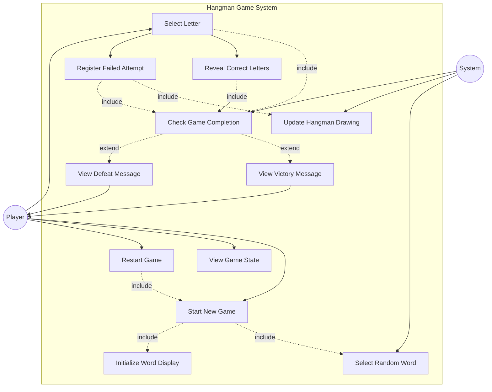

# Initial

I've created a UML use case diagram for the Hangman game application. The diagram includes:

**Main Actors:**

- **Player**: The human user who plays the game
- **System**: The automated system components

**Primary Use Cases:**

1. **Start New Game** - Initializes a new game session
2. **Select Letter** - Player chooses a letter from the alphabet
3. **View Game State** - Player observes the current state of the game
4. **Restart Game** - Player starts over with a new word

**Included Use Cases (dependencies):**

- **Initialize Word Display** - Shows empty boxes for the word
- **Select Random Word** - Picks a word from the animal dictionary
- **Reveal Correct Letters** - Shows all occurrences of correct guesses
- **Register Failed Attempt** - Records incorrect guesses
- **Update Hangman Drawing** - Adds parts to the hangman figure
- **Check Game Completion** - Determines if the game has ended

**Extended Use Cases (conditional):**

- **View Victory Message** - Shown when player wins
- **View Defeat Message** - Shown when player loses

The diagram shows the relationships using:

- Solid arrows for direct associations
- Dashed arrows with "include" for mandatory dependencies
- Dashed arrows with "extend" for conditional behaviors

This captures all the main functional requirements from your specification!

