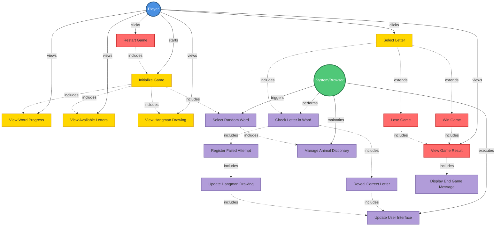

# Initial

I've created a comprehensive UML use case diagram for the Hangman game application. Here's what the diagram includes:

## **Key Elements:**

### **Actors:**

- **Player** - The end user playing the game
- **System/Browser** - Represents the automated system processes

### **Main Use Cases:**

1. **Core Gameplay** (Yellow):
    - Initialize Game
    - Select Letter
    - View Word Progress
    - View Available Letters
    - View Hangman Drawing
2. **Game End Scenarios** (Red):
    - Win Game
    - Lose Game
    - View Game Result
    - Restart Game
3. **System Functions** (Purple):
    - Select Random Word
    - Manage Animal Dictionary
    - Check Letter in Word
    - Reveal Correct Letter
    - Register Failed Attempt
    - Update Hangman Drawing
    - Update User Interface
    - Display End Game Message

### **Relationships:**

- **Solid arrows (→)**: Actor-to-use-case associations
- **Dashed arrows (-.->)**: «include» relationships (mandatory sub-functionality)
- **Dotted arrows (.->)**: «extend» relationships (conditional extensions)

The diagram maps all the requirements from REQ-001 through REQ-040, showing the complete interaction flow between the player and the system throughout the game lifecycle.

